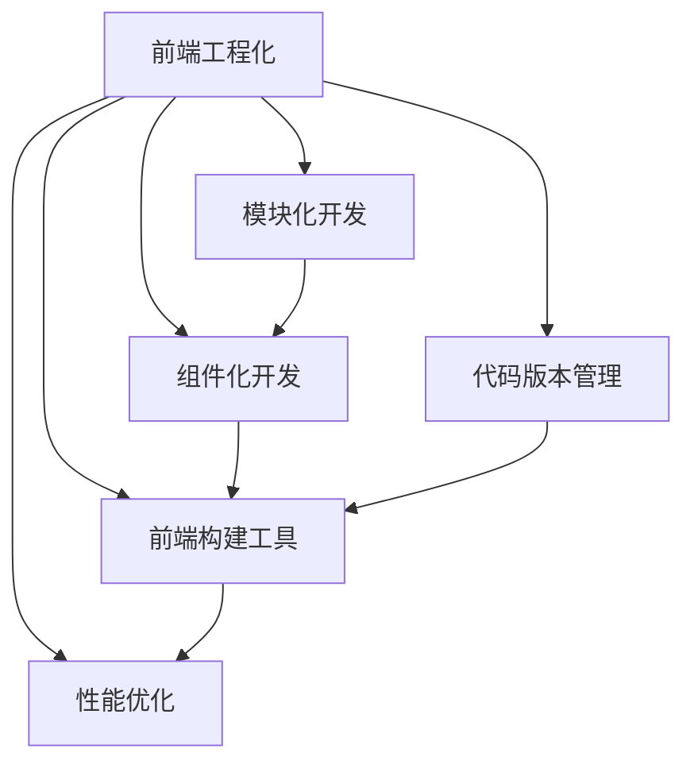

                 

# 前端工程化：现代Web开发流程与工具

> 关键词：前端工程化, 现代Web开发, 前端工具链, 模块化开发, 组件化开发, 代码管理, 前端构建工具, 前端性能优化

## 1. 背景介绍

在Web发展的早期阶段，前端开发往往是较为随意和松散的。开发者使用简单的HTML、CSS和JavaScript书写页面，并通过手动发布到服务器来实现简单的功能。但随着Web应用的不断复杂化，这种松散的方式逐渐暴露出诸多问题，如代码难以维护、版本管理困难、开发效率低下等。这些问题严重制约了Web应用的开发速度和质量。

### 1.1 问题的由来
随着时间的推移，Web应用的复杂性不断增加，前端开发也逐渐从“线框图设计”向“产品开发”转变。但传统的开发方式难以应对这种变化。Web应用的开发涉及前端、后端、数据库等多个方面，跨团队的协作越来越频繁。因此，如何提高开发效率、保证代码质量和版本管理，成为前端工程化的一个主要挑战。

### 1.2 问题核心关键点
前端工程化的核心在于通过系统化的开发流程和工具，提升前端开发的效率和质量，保证代码的可维护性和可扩展性。关键点包括：

1. 代码模块化：将代码拆分为独立的功能模块，便于管理和维护。
2. 组件化开发：通过组件化的方法，将复杂的页面拆分为可重用的模块，提升开发效率。
3. 代码版本管理：通过版本控制工具，保证代码的历史版本清晰可追溯。
4. 前端构建工具：通过自动化构建工具，实现快速构建、测试和发布。
5. 性能优化：通过优化代码和资源，提升Web应用的加载速度和用户体验。

这些关键点共同构成了前端工程化的基本框架，通过科学合理的流程和工具，将前端开发变得更加高效和规范。

## 2. 核心概念与联系

### 2.1 核心概念概述

为更好地理解前端工程化的核心概念，本节将介绍几个关键概念，并阐述它们之间的联系。

- **前端工程化**：通过系统化的开发流程和工具，提升前端开发的效率和质量，保证代码的可维护性和可扩展性。
- **模块化开发**：将代码拆分为独立的功能模块，便于管理和维护。
- **组件化开发**：通过组件化的方法，将复杂的页面拆分为可重用的模块，提升开发效率。
- **代码版本管理**：通过版本控制工具，保证代码的历史版本清晰可追溯。
- **前端构建工具**：通过自动化构建工具，实现快速构建、测试和发布。
- **性能优化**：通过优化代码和资源，提升Web应用的加载速度和用户体验。

这些概念之间存在紧密联系。模块化和组件化开发提供了代码的基础结构，使得代码更易于管理和维护。版本控制工具和构建工具则保证了代码的变更记录和自动化构建流程。性能优化则进一步提升了Web应用的质量和用户体验。这些概念共同构成了前端工程化的基本框架。

### 2.2 核心概念原理和架构的 Mermaid 流程图



这个流程图展示了前端工程化中的关键概念及其相互关系。

## 3. 核心算法原理 & 具体操作步骤
### 3.1 算法原理概述

前端工程化的核心算法原理主要集中在如何通过系统化的开发流程和工具，提升前端开发的效率和质量。其基本思想是通过对代码的模块化、组件化，配合代码的版本管理和构建工具，以及性能优化，实现代码的可靠、高效和高质量开发。

### 3.2 算法步骤详解

前端工程化的核心算法步骤主要包括：

1. **模块化开发**：将代码拆分为独立的功能模块，便于管理和维护。
2. **组件化开发**：通过组件化的方法，将复杂的页面拆分为可重用的模块，提升开发效率。
3. **代码版本管理**：通过版本控制工具，保证代码的历史版本清晰可追溯。
4. **前端构建工具**：通过自动化构建工具，实现快速构建、测试和发布。
5. **性能优化**：通过优化代码和资源，提升Web应用的加载速度和用户体验。

### 3.3 算法优缺点

前端工程化方法具有以下优点：
1. 提升开发效率：通过模块化和组件化开发，代码更易于维护，重复利用。
2. 保证代码质量：通过版本控制工具和构建工具，代码的变更记录清晰，构建流程规范。
3. 提升用户体验：通过性能优化，提升Web应用的加载速度和流畅度。

但前端工程化方法也存在一些缺点：
1. 学习成本较高：需要掌握多种工具和流程，对初学者有一定门槛。
2. 工具链复杂：多种工具的集成使用，可能导致工具链过于复杂。
3. 灵活性受限：固定的流程和工具链可能限制开发者的创造力。

### 3.4 算法应用领域

前端工程化方法广泛应用于各种Web应用开发中，如电商、社交网络、在线教育等。这些领域中的前端开发，往往需要处理大量的用户交互和数据展示，因此对开发效率和用户体验有着更高的要求。

## 4. 数学模型和公式 & 详细讲解 & 举例说明

### 4.1 数学模型构建

在前端工程化中，数学模型主要用于描述代码的模块化、组件化和性能优化等流程。这些流程可以通过数学模型进行量化和优化。

### 4.2 公式推导过程

为了便于理解，我们将以性能优化为例，说明如何通过数学模型进行量化和优化。

假设Web应用的页面由N个模块组成，每个模块的大小为S_i字节。在未优化的状态下，页面的加载时间为T_未优化，可以表示为：

$$
T_{未优化} = \sum_{i=1}^N S_i \times t_i
$$

其中，t_i为第i个模块的加载时间。假设所有模块的加载时间都相同，则有：

$$
T_{未优化} = N \times S_i \times t_i
$$

通过性能优化的方式，可以将加载时间t_i减少到t_优化。优化后的总加载时间为：

$$
T_{优化} = \sum_{i=1}^N S_i \times t_{优化}
$$

通过数学公式可以直观地看到，性能优化可以显著减少Web应用的加载时间。

### 4.3 案例分析与讲解

以一个电商网站的开发为例，分析前端工程化方法如何提升开发效率和用户体验。

1. **模块化开发**：将电商网站分为前端UI、后端API、数据库等多个模块，每个模块独立开发和维护。
2. **组件化开发**：通过组件化的方法，将复杂的商品展示、购物车、结算页面等拆分为可重用的组件。
3. **代码版本管理**：使用Git进行版本控制，确保每个模块的历史版本清晰可追溯。
4. **前端构建工具**：使用Webpack等构建工具，实现自动化构建、测试和发布。
5. **性能优化**：通过代码压缩、资源懒加载、图片优化等手段，提升Web应用的加载速度。

通过这些前端工程化方法，电商网站可以在短时间内完成开发，并保证代码的可靠性和高质量。用户在使用电商网站时，能够快速加载页面，体验流畅。

## 5. 项目实践：代码实例和详细解释说明

### 5.1 开发环境搭建

在进行前端工程化实践前，我们需要准备好开发环境。以下是使用Node.js和npm开发的环境配置流程：

1. 安装Node.js：从官网下载并安装Node.js。
2. 配置npm：在项目根目录下运行`npm init`，根据提示创建`package.json`文件。
3. 安装开发工具：安装Webpack、Babel等开发工具。
4. 创建项目结构：根据项目需求，创建项目目录结构。

### 5.2 源代码详细实现

以下是一个简单的电商网站的代码实现，展示了如何使用前端工程化方法进行开发。

**package.json**

```json
{
  "name": "e-commerce",
  "version": "1.0.0",
  "main": "index.js",
  "scripts": {
    "start": "webpack-dev-server --config webpack.config.js",
    "build": "webpack --config webpack.config.js"
  },
  "devDependencies": {
    "babel-loader": "^7.0.0",
    "webpack": "^4.0.0"
  }
}
```

**webpack.config.js**

```javascript
module.exports = {
  entry: './src/index.js',
  output: {
    path: path.resolve(__dirname, 'dist'),
    filename: 'bundle.js'
  },
  module: {
    rules: [
      {
        test: /\.js$/,
        exclude: /node_modules/,
        use: {
          loader: 'babel-loader'
        }
      }
    ]
  }
};
```

**src/index.js**

```javascript
import React from 'react';
import ReactDOM from 'react-dom';
import App from './App';

ReactDOM.render(<App />, document.getElementById('root'));
```

**App.js**

```javascript
import React, { Component } from 'react';

class App extends Component {
  constructor(props) {
    super(props);
    this.state = { counter: 0 };
  }

  handleClick() {
    this.setState({ counter: this.state.counter + 1 });
  }

  render() {
    return (
      <div>
        <h1>Counter: {this.state.counter}</h1>
        <button onClick={() => this.handleClick()}>Click me</button>
      </div>
    );
  }
}

export default App;
```

这个代码实现展示了如何使用Webpack进行前端构建。通过Webpack，我们将React组件打包成可执行的代码，并生成优化的资源。

### 5.3 代码解读与分析

**package.json**：定义了项目的名称、版本、主入口文件和构建脚本。`scripts`字段定义了开发和构建的命令，通过`webpack-dev-server`和`webpack`命令启动开发环境和构建环境。`devDependencies`字段指定了需要的开发工具。

**webpack.config.js**：定义了Webpack的配置项。`entry`字段指定了入口文件。`output`字段指定了输出路径和文件名。`module`字段定义了加载器，使用`babel-loader`将JS代码转换为ES6代码。

**src/index.js**：作为入口文件，导入App组件并渲染到页面上。

**App.js**：定义了一个简单的计数器组件，通过React的状态和事件处理实现。

通过以上代码，我们实现了基于React的前端应用开发。使用Webpack进行构建，可以将代码打包成优化的资源，提升Web应用的加载速度和用户体验。

## 6. 实际应用场景

### 6.1 电商网站

电商网站是前端工程化的一个典型应用场景。电商网站需要处理大量的用户交互和数据展示，对开发效率和用户体验有着更高的要求。

使用前端工程化方法，电商网站可以迅速搭建开发环境，进行模块化和组件化开发，通过Webpack进行构建，生成优化的资源。同时，使用性能优化手段，提升Web应用的加载速度和流畅度。

### 6.2 在线教育平台

在线教育平台需要对用户进行课程推荐、学习进度管理等复杂操作。前端工程化方法可以提升开发效率，保证代码的可维护性和可扩展性。

通过模块化和组件化开发，将复杂的页面拆分为可重用的组件。使用版本控制工具进行代码管理，确保每个模块的历史版本清晰可追溯。使用构建工具进行自动化构建，提升开发效率。通过性能优化，提升Web应用的加载速度和用户体验。

### 6.3 金融应用

金融应用需要处理大量的用户数据和交易记录，对代码质量和性能有着更高的要求。

使用前端工程化方法，金融应用可以提升开发效率，保证代码的可维护性和可扩展性。通过模块化和组件化开发，将复杂的页面拆分为可重用的组件。使用版本控制工具进行代码管理，确保每个模块的历史版本清晰可追溯。使用构建工具进行自动化构建，提升开发效率。通过性能优化，提升Web应用的加载速度和用户体验。

### 6.4 未来应用展望

随着前端工程化方法的不断成熟，未来Web应用开发将更加高效和规范。前端工程化方法的应用范围将不断扩大，覆盖更多的垂直领域，如医疗、教育、金融等。同时，前端工程化方法也将与更多的前沿技术进行融合，如区块链、人工智能等，提升Web应用的智能化水平。

## 7. 工具和资源推荐

### 7.1 学习资源推荐

为了帮助开发者系统掌握前端工程化的相关技术，这里推荐一些优质的学习资源：

1. **《JavaScript高级程序设计》**：JavaScript语言的权威指南，涵盖了JavaScript的基础语法和高级特性。
2. **《React官方文档》**：React框架的官方文档，提供详细的API和使用指南。
3. **《Webpack官方文档》**：Webpack构建工具的官方文档，提供详细的配置和使用指南。
4. **《Node.js官方文档》**：Node.js平台的官方文档，提供详细的API和使用指南。
5. **《React Router官方文档》**：React Router的官方文档，提供详细的路由配置和使用指南。

### 7.2 开发工具推荐

前端工程化需要依赖多种开发工具，以下是几款常用的开发工具：

1. **Visual Studio Code**：一款流行的代码编辑器，支持多种编程语言，提供了丰富的扩展插件。
2. **Git**：版本控制工具，用于管理和追踪代码的历史变更。
3. **Webpack**：前端构建工具，用于自动化构建、测试和发布。
4. **Babel**：代码转换工具，用于将ES6代码转换为ES5代码，支持React等框架。
5. **Prettier**：代码格式化工具，用于自动格式化代码，提升代码的可读性。

### 7.3 相关论文推荐

前端工程化的发展离不开学术界的持续研究。以下是几篇奠基性的相关论文，推荐阅读：

1. **《前端工程化与模块化开发》**：介绍前端工程化的基本概念和实践方法。
2. **《组件化开发与可重用性提升》**：探讨组件化开发对提升代码可重用性的重要性。
3. **《版本控制与代码版本管理》**：介绍版本控制工具的使用方法和最佳实践。
4. **《Web应用性能优化与用户体验提升》**：探讨前端性能优化技术，提升Web应用的加载速度和流畅度。
5. **《前端工程化的未来发展趋势》**：预测前端工程化的未来发展方向和应用前景。

## 8. 总结：未来发展趋势与挑战

### 8.1 总结

本文对前端工程化方法进行了全面系统的介绍。首先阐述了前端工程化的背景和意义，明确了前端工程化在提升开发效率、保证代码质量等方面的重要作用。其次，从原理到实践，详细讲解了前端工程化的关键步骤，给出了前端工程化任务开发的完整代码实例。同时，本文还探讨了前端工程化在多个行业领域的应用前景，展示了前端工程化的巨大潜力。

通过本文的系统梳理，可以看到，前端工程化方法正在成为Web开发的重要范式，极大地提升了Web应用的开发速度和质量。未来，随着前端工程化方法的不断演进，Web应用的开发将更加高效和规范。

### 8.2 未来发展趋势

展望未来，前端工程化方法将呈现以下几个发展趋势：

1. **前端构建工具的集成化**：未来的前端构建工具将更加集成化，涵盖前端、后端、数据库等多个方面的开发流程。
2. **前端开发流程的自动化**：通过自动化工具，实现从代码编写到发布的一体化流程，提升开发效率。
3. **前端开发的平台化**：前端开发将更多地依赖云平台，通过云服务实现资源的弹性伸缩和自动扩展。
4. **前端开发的智能化**：通过AI和机器学习技术，提升前端开发的智能化水平，实现更高效的开发和测试。
5. **前端开发的生态化**：前端开发将更多地依赖开源社区，通过开源项目和工具，实现代码的复用和共享。

以上趋势凸显了前端工程化方法的发展前景。这些方向的探索发展，必将进一步提升前端开发的效率和质量，推动Web应用的智能化和平台化。

### 8.3 面临的挑战

尽管前端工程化方法已经取得了显著进展，但在迈向更加智能化、平台化的应用过程中，它仍面临着诸多挑战：

1. **工具链的复杂性**：前端工程化需要依赖多种工具，工具链的复杂性可能带来管理上的困难。
2. **跨团队协作的难题**：前端工程化方法需要跨团队协作，不同团队对工具的熟悉程度可能存在差异，导致协作效率低下。
3. **性能优化的瓶颈**：前端性能优化涉及代码和资源的优化，可能面临技术上的瓶颈。
4. **代码的维护性和可扩展性**：前端工程化方法需要保证代码的维护性和可扩展性，但这可能对开发者的技能要求较高。

### 8.4 研究展望

面向未来，前端工程化研究需要在以下几个方面寻求新的突破：

1. **工具链的整合与简化**：开发更加集成化、平台化的前端构建工具，简化工具链的使用和管理。
2. **跨团队协作机制**：建立跨团队协作机制，提升协作效率和质量。
3. **性能优化技术**：研发新的性能优化技术，提升Web应用的加载速度和流畅度。
4. **代码的维护性和可扩展性**：探索更好的代码管理策略，提升代码的维护性和可扩展性。

这些研究方向和突破，必将推动前端工程化方法的进一步成熟，为Web应用开发提供更加高效、智能和平台化的工具和方法。

## 9. 附录：常见问题与解答

**Q1：前端工程化方法是否适用于所有Web应用？**

A: 前端工程化方法适用于各种Web应用，尤其是复杂的Web应用。通过模块化和组件化开发，代码更易于维护和复用，提升开发效率。但需要注意的是，对于一些简单的Web应用，前端工程化方法可能带来额外的复杂性。

**Q2：如何选择合适的前端构建工具？**

A: 选择合适的前端构建工具需要考虑多个因素，包括项目的复杂度、开发团队的熟悉程度、技术栈的兼容性等。常用的前端构建工具包括Webpack、Rollup、Browserify等，建议根据项目需求进行选择。

**Q3：前端工程化是否会影响Web应用的性能？**

A: 前端工程化方法可以通过优化代码和资源，提升Web应用的性能。但需要注意的是，过度优化可能导致代码的可读性降低，影响代码的维护性和可扩展性。因此，需要在性能优化和代码可读性之间寻找平衡。

**Q4：如何提高前端开发团队的协作效率？**

A: 提高前端开发团队的协作效率需要建立良好的沟通机制和代码规范。可以使用版本控制工具、代码审查工具、代码管理工具等，提升协作效率和代码质量。同时，建立跨团队协作机制，定期进行沟通和交流，解决协作中的问题。

**Q5：如何提升Web应用的加载速度和流畅度？**

A: 提升Web应用的加载速度和流畅度需要综合考虑多个因素，包括代码优化、资源优化、网络优化等。可以通过代码压缩、资源懒加载、图片优化、CDN加速等方式，提升Web应用的加载速度和流畅度。

**Q6：前端工程化是否会带来额外的开发成本？**

A: 前端工程化方法需要依赖多种工具和流程，对开发者有一定的门槛。但长期来看，通过提升开发效率和代码质量，可以降低开发成本。同时，通过工具和平台的积累，也可以实现更高效的开发和部署。

总之，前端工程化方法需要在性能优化和代码可读性之间寻找平衡，选择合适的工具和流程，提升前端开发的效率和质量。只有在科学合理的流程和工具的支持下，才能实现前端工程化方法的价值。

