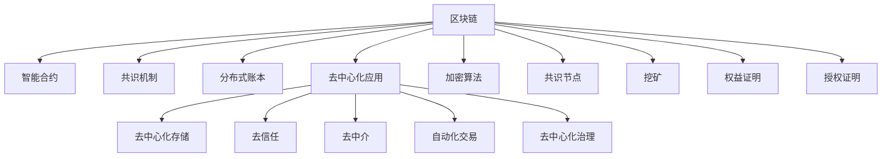

                 

# 区块链技术：去中心化应用开发

## 1. 背景介绍

### 1.1 问题由来
随着互联网的发展，信息共享和安全交易成为数字时代的核心需求。传统的中心化系统如银行、电商平台等，由于需要依赖中心化的机构进行信任背书，存在单点故障、数据垄断等问题。而区块链技术，作为一种分布式、去中心化的技术架构，通过共识机制和加密算法保障数据的真实性和不可篡改性，极大提升了信息共享和交易的安全性和透明度。

区块链技术的核心思想是构建一个去中心化的网络，通过分布式节点之间的协同工作，实现信息的去中心化存储和验证。与传统中心化系统相比，区块链具有以下显著优势：

1. **去中心化**：不依赖于单一中心化的机构，而是由网络中的多个节点共同维护。
2. **透明度**：所有交易记录公开透明，可追溯。
3. **安全性**：通过加密算法和共识机制保障数据的安全性和不可篡改性。
4. **去信任**：通过算法和机制去除交易双方之间的信任关系，减少信任成本。
5. **效率**：分布式存储和计算可以提升系统的吞吐量，降低延迟。

### 1.2 问题核心关键点
区块链技术的核心在于其去中心化的架构和区块链网络中的共识机制。共识机制是确保网络中所有节点达成一致的关键，常见的共识机制包括PoW(工作量证明)、PoS(权益证明)、DPoS(授权证明)等。同时，区块链网络中还有智能合约、分布式账本等核心概念，共同构成了区块链技术的核心框架。

目前，基于区块链技术的应用场景已经涵盖了金融、供应链、医疗、物联网等多个领域，正在逐步改变传统行业的工作方式和商业模式。研究区块链技术的原理和应用，对于推动区块链技术的落地应用，具有重要意义。

## 2. 核心概念与联系

### 2.1 核心概念概述

为更好地理解区块链技术的核心原理和应用，本节将介绍几个密切相关的核心概念：

- **区块链(Blockchain)**：一种分布式数据库技术，通过时间序列链式结构、密码学算法和共识机制，实现去中心化的信息存储和验证。

- **智能合约(Smart Contracts)**：自动执行的代码，当满足预设条件时，能够自动执行某个操作，常用于自动化交易和治理。

- **共识机制(Consensus Mechanisms)**：区块链网络中用于保证交易一致性的算法，如PoW、PoS、DPoS等。

- **分布式账本(Distributed Ledger)**：区块链技术中的核心数据结构，记录所有交易的不可篡改记录。

- **去中心化应用(Decentralized Applications, DApps)**：基于区块链技术构建的应用程序，具有去中心化、去信任、去中介的特点。

- **加密算法(Cryptography)**：保障数据安全性的关键技术，包括公钥加密、哈希函数、数字签名等。

- **共识节点(Nodes)**：区块链网络中的参与者，负责验证交易、达成共识。

- **挖矿(Mining)**：在PoW共识机制中，通过计算复杂的工作量证明，获得网络中的记账权。

- **权益证明(Proof of Stake, PoS)**：一种共识机制，通过持有代币的权益来验证交易。

- **授权证明(Delegated Proof of Stake, DPoS)**：一种PoS改进版，由一组被选举的节点负责验证交易。

这些核心概念之间的逻辑关系可以通过以下Mermaid流程图来展示：



这个流程图展示了一些核心概念之间的相互关系和连接：

1. 区块链作为基础架构，记录并验证所有交易。
2. 智能合约实现自动化交易和治理。
3. 共识机制保证网络中的交易一致性。
4. 加密算法保障数据的真实性和安全性。
5. 去中心化应用基于区块链构建，具有去中心化、去信任等特点。

这些概念共同构成了区块链技术的核心框架，使其能够在各种场景下发挥强大的分布式和去中心化能力。通过理解这些核心概念，我们可以更好地把握区块链技术的本质和应用方向。

## 3. 核心算法原理 & 具体操作步骤

### 3.1 算法原理概述

区块链技术的核心在于通过分布式账本和共识机制实现去中心化的信息存储和验证。其核心算法原理包括：

1. **分布式账本技术(DLT)**：采用去中心化的方式，通过多个节点共同维护一个公开的、不可篡改的账本，记录所有交易信息。
2. **加密算法**：包括哈希函数、公钥加密、数字签名等，用于保障数据的完整性和安全性。
3. **共识机制**：通过算法和机制，确保网络中的所有节点达成一致，共同维护账本的权威性。

区块链技术的实现流程通常包括：

1. **数据提交**：交易发起方将交易信息发送到网络中的所有节点。
2. **验证和打包**：每个节点对交易进行验证，通过共识机制决定哪些交易可以打包成区块。
3. **共识达成**：通过共识算法，网络中的节点达成一致，选择最优的区块进行打包。
4. **区块验证**：网络中的其他节点验证新产生的区块，确保其有效性和完整性。
5. **区块链接**：新产生的区块通过加密算法与之前的区块链接，形成完整的区块链。

### 3.2 算法步骤详解

区块链技术的实现步骤主要包括：

**Step 1: 设计共识算法**
- 选择合适的共识算法，如PoW、PoS、DPoS等。
- 确定共识参数，如奖励机制、区块大小、验证规则等。

**Step 2: 设计智能合约**
- 定义智能合约的逻辑和触发条件。
- 编写智能合约的代码，并部署到区块链上。

**Step 3: 配置区块链网络**
- 搭建区块链网络，配置节点和网络参数。
- 启动共识算法，确保网络中的节点能够达成一致。

**Step 4: 执行交易**
- 发送交易信息到网络中的所有节点。
- 节点验证交易信息，通过共识算法打包成区块。
- 区块通过网络传播，并由其他节点验证。
- 区块被添加到区块链中，完成交易记录。

**Step 5: 监控和维护**
- 实时监控区块链网络，确保其稳定运行。
- 定期维护和更新网络参数，解决潜在的性能问题。

### 3.3 算法优缺点

区块链技术的优点包括：

1. **去中心化**：不依赖于单一中心化的机构，提高系统的稳定性和安全性。
2. **透明度**：所有交易记录公开透明，可追溯。
3. **去信任**：通过算法和机制去除交易双方之间的信任关系，降低信任成本。
4. **抗攻击**：通过加密算法和共识机制保障数据的安全性和不可篡改性。

然而，区块链技术也存在一些局限性：

1. **扩展性不足**：当前区块链的吞吐量较低，难以支持大规模应用。
2. **能耗高**：如PoW共识机制，需要大量计算资源，能耗较高。
3. **延迟高**：由于分布式存储和计算，交易处理速度较慢。
4. **技术门槛高**：需要具备密码学、共识算法等专业知识，实施难度较大。

尽管存在这些局限性，但区块链技术的去中心化和透明性在许多场景下具有无可替代的优势。未来相关研究重点在于如何提升区块链的扩展性和能效，降低实施难度，推动其广泛应用。

### 3.4 算法应用领域

区块链技术已经在金融、供应链、医疗、物联网等多个领域得到了广泛应用，具体如下：

- **金融**：通过智能合约和共识机制，实现去中心化的交易和结算，降低成本和风险。如区块链银行、去中心化交易平台等。

- **供应链**：通过区块链技术，实现供应链中所有节点的信息透明共享，提高供应链的效率和安全性。如溯源系统、合同管理等。

- **医疗**：通过区块链技术，保障医疗数据的隐私和安全，实现电子病历共享和病人身份验证。如病历管理、药物追溯等。

- **物联网**：通过区块链技术，实现设备之间的互信和信息共享，提高物联网系统的安全性。如智能合约、设备管理等。

- **版权保护**：通过区块链技术，记录知识产权信息，保障版权所有者的权益。如数字版权管理、版权交易等。

- **电子投票**：通过区块链技术，实现去中心化的投票系统，提高投票过程的透明性和安全性。如选举投票、社区治理等。

- **身份认证**：通过区块链技术，实现去中心化的身份认证，提高认证过程的安全性和可靠性。如数字身份、匿名支付等。

## 4. 数学模型和公式 & 详细讲解 & 举例说明

### 4.1 数学模型构建

区块链技术的核心数学模型包括：

- **哈希函数**：将任意长度的数据映射为固定长度的哈希值，常用于数据校验和区块链接。
- **公钥加密和私钥解密**：通过非对称加密算法，保障数据的机密性和完整性。
- **数字签名**：一种电子签名方式，用于验证交易发起方的身份和交易的有效性。

### 4.2 公式推导过程

**哈希函数**：
- 哈希函数是一种单向不可逆的函数，常用于计算数据的摘要。对于给定数据 $M$，哈希函数的输出 $H(M)$ 具有以下特性：
  - 输入数据稍有变化，输出结果将有显著变化。
  - 对于任意长度的输入数据，输出结果长度固定。
- 常见的哈希函数包括SHA-256、SHA-3等。

**公钥加密和私钥解密**：
- 公钥加密和私钥解密是基于非对称加密算法的技术，常用于保障数据的机密性和完整性。假设Alice和Bob通信，Alice生成一对公钥-私钥对 $(PK_A, SK_A)$，Bob生成一对公钥-私钥对 $(PK_B, SK_B)$。Alice向Bob发送数据 $M$，使用Bob的公钥对 $M$ 进行加密，Bob使用自己的私钥进行解密。
- 公钥加密算法通常采用RSA算法，私钥解密算法采用ElGamal算法。

**数字签名**：
- 数字签名是一种电子签名方式，用于验证交易发起方的身份和交易的有效性。假设Alice发送数据 $M$ 给Bob，Bob需要验证数据的真实性和完整性。Alice首先使用自己的私钥对 $M$ 进行签名，生成数字签名 $Sig$。Bob收到 $M$ 和 $Sig$，使用Alice的公钥对 $Sig$ 进行验证，确保 $Sig$ 是由Alice产生的，且数据未被篡改。

### 4.3 案例分析与讲解

假设Alice和Bob在进行比特币交易，其交易过程如下：

1. **数据提交**：Alice将交易信息 $T$ 提交到比特币网络中的所有节点。
2. **验证和打包**：每个节点对交易信息进行验证，通过PoW共识算法打包成区块。
3. **共识达成**：网络中的节点通过PoW算法达成一致，选择最优的区块进行打包。
4. **区块验证**：网络中的其他节点验证新产生的区块，确保其有效性和完整性。
5. **区块链接**：新产生的区块通过哈希函数与之前的区块链接，形成完整的区块链。

在上述过程中，Alice使用比特币地址作为公钥，通过RSA算法加密交易金额和签名信息，发送给Bob。Bob使用Alice的公钥解密数字签名，验证交易的有效性和Alice的身份。

## 5. 项目实践：代码实例和详细解释说明

### 5.1 开发环境搭建

在进行区块链项目开发前，我们需要准备好开发环境。以下是使用Python进行Hyperledger Fabric开发的流程：

1. **安装Hyperledger Fabric**：从官网下载并安装Hyperledger Fabric，创建独立的开发环境。

2. **安装Node.js和npm**：Hyperledger Fabric基于Node.js构建，需要安装Node.js和npm。

3. **安装Hyperledger Fabric CLI**：从官网下载并安装Hyperledger Fabric CLI。

4. **创建和配置区块链网络**：使用CLI工具创建新的区块链网络，并配置网络参数。

5. **编写智能合约**：使用Solidity语言编写智能合约，并编译成字节码。

6. **部署智能合约**：将智能合约部署到区块链网络中。

完成上述步骤后，即可在Hyperledger Fabric环境中开始区块链项目开发。

### 5.2 源代码详细实现

以下是一个基于Hyperledger Fabric的智能合约的Python实现：

```python
# 导入Hyperledger Fabric SDK
from hfc.fabric import client
from hfc.fabric import config
from hfc.fabric import network
from hfc.fabric import contract

# 配置区块链网络
config_path = config.ConfigPathManager.getConfigPath()
network_path = config_path.newChannel("mychannel")
network = network.FileNetworkConfig(network_path)

# 连接到区块链网络
client = client.Client(network)

# 创建智能合约
contract_path = network_path.newFile("example.mycontract")
contract.addToContract(contract_path, "Example")

# 注册智能合约
client.registerContract("Example", contract_path)

# 执行智能合约
contract.addFunction("Example", "execute")
contract.addFunction("Example", "query")

# 调用智能合约函数
result = contract.execute("Example", "func", args)
```

以上就是使用Hyperledger Fabric实现智能合约的Python代码实现。可以看到，Hyperledger Fabric的开发环境已经封装了区块链网络的相关配置和操作，使得开发者能够专注于智能合约的编写和部署。

### 5.3 代码解读与分析

让我们再详细解读一下关键代码的实现细节：

- **Hyperledger Fabric SDK**：提供了丰富的API，用于连接区块链网络、注册智能合约、执行智能合约等操作。
- **配置区块链网络**：通过`ConfigPathManager`和`FileNetworkConfig`等工具类，创建并配置区块链网络，如通道名称、网络配置文件等。
- **连接到区块链网络**：通过`Client`类，连接到区块链网络，并进行操作。
- **创建智能合约**：使用Solidity语言编写智能合约，并将其编译为字节码。
- **注册智能合约**：通过`registerContract`方法，将智能合约注册到区块链网络中。
- **执行智能合约**：通过`execute`方法，执行智能合约函数。

在实际应用中，智能合约通常需要处理复杂的操作，如资产转移、事务验证等。因此，开发智能合约需要具备一定的区块链和加密算法知识。

## 6. 实际应用场景

### 6.1 智能合约应用

智能合约是区块链技术的核心应用之一，主要用于自动化执行交易和治理。以下是一个智能合约的实际应用场景：

**场景描述**：某公司需要对其员工进行绩效考核，考核结果需要公开透明，并自动存储到区块链中。公司需要定义一组智能合约，用于记录和验证员工绩效，自动生成考核结果，并确保数据的安全性和不可篡改性。

**实现流程**：
1. **智能合约定义**：定义智能合约的逻辑和触发条件，如员工绩效记录、考核规则、考核结果等。
2. **智能合约编写**：编写智能合约的代码，并将其编译为字节码。
3. **智能合约部署**：将智能合约部署到区块链网络中。
4. **数据提交**：员工将绩效数据提交到区块链网络中，智能合约自动验证和存储。
5. **考核结果生成**：根据绩效数据，智能合约自动生成考核结果，并发布到区块链网络中。
6. **数据查询和验证**：员工和公司可以实时查询绩效数据和考核结果，验证数据的真实性和完整性。

**技术难点**：
- 智能合约的逻辑设计需要考虑全面，确保所有业务场景都能被覆盖。
- 智能合约的代码编写需要考虑安全性，避免漏洞和攻击。
- 智能合约的部署和更新需要考虑兼容性和一致性，避免对现有数据造成影响。

### 6.2 去中心化供应链应用

区块链技术在供应链中的应用可以大幅提高供应链的透明度和效率。以下是一个去中心化供应链的实际应用场景：

**场景描述**：某公司需要管理其供应链，确保所有供应链环节的信息公开透明，并实现自动化管理。公司需要定义一组智能合约，用于记录和验证供应链信息，自动生成供应链报告，并确保数据的安全性和不可篡改性。

**实现流程**：
1. **智能合约定义**：定义智能合约的逻辑和触发条件，如供应链信息记录、供应链报告生成、供应链监控等。
2. **智能合约编写**：编写智能合约的代码，并将其编译为字节码。
3. **智能合约部署**：将智能合约部署到区块链网络中。
4. **数据提交**：供应链各方将供应链信息提交到区块链网络中，智能合约自动验证和存储。
5. **供应链报告生成**：根据供应链信息，智能合约自动生成供应链报告，并发布到区块链网络中。
6. **供应链监控**：供应链各方可以实时监控供应链信息，验证数据的真实性和完整性。

**技术难点**：
- 智能合约的逻辑设计需要考虑供应链各方的业务需求，确保所有业务场景都能被覆盖。
- 智能合约的代码编写需要考虑安全性，避免漏洞和攻击。
- 智能合约的部署和更新需要考虑兼容性和一致性，避免对现有数据造成影响。

## 7. 工具和资源推荐

### 7.1 学习资源推荐

为了帮助开发者系统掌握区块链技术的原理和实践，这里推荐一些优质的学习资源：

1. **《区块链原理及应用》**：一本系统介绍区块链技术的书籍，涵盖了区块链的原理、共识机制、智能合约等内容。
2. **Hyperledger Fabric官方文档**：Hyperledger Fabric的官方文档，提供了完整的区块链开发指南和示例。
3. **Solidity官方文档**：Solidity语言官方文档，提供了智能合约的编写和部署指南。
4. **以太坊开发者文档**：以太坊区块链的官方开发者文档，提供了智能合约和区块链应用的开发指南。
5. **Blockchain Developer Bootcamp**：Udemy上的区块链开发者课程，涵盖区块链基础、智能合约编写、区块链应用开发等内容。

通过对这些资源的学习实践，相信你一定能够快速掌握区块链技术的精髓，并用于解决实际的区块链问题。

### 7.2 开发工具推荐

高效的开发离不开优秀的工具支持。以下是几款用于区块链项目开发的常用工具：

1. **Hyperledger Fabric**：由Hyperledger开发的区块链平台，提供了丰富的API和工具，方便开发者进行区块链应用开发。
2. **Ethereum**：以太坊区块链平台，支持智能合约和去中心化应用开发。
3. **IPFS**：分布式文件存储系统，支持去中心化数据存储和分发。
4. **Ripple**：区块链支付平台，支持快速、低成本的交易和跨境支付。
5. **Blockchain.com**：区块链开发平台，提供完整的区块链开发环境、测试网络和社区支持。

合理利用这些工具，可以显著提升区块链项目开发的效率，加快创新迭代的步伐。

### 7.3 相关论文推荐

区块链技术的快速发展离不开学界的持续研究。以下是几篇奠基性的相关论文，推荐阅读：

1. **Bitcoin: A Peer-to-Peer Electronic Cash System**：比特币白皮书，介绍了区块链技术的核心原理和设计思想。
2. **Smart Contracts: Towards a Generic Model of Digital Rights Management**：提出智能合约的概念和应用场景，为区块链技术的发展奠定了基础。
3. **Consensus in Fault-Tolerant Distributed Systems**：详细探讨了共识机制的设计和实现，为区块链网络中的数据一致性提供了理论支持。
4. **Proof of Work and Equilibrium Sharing in Bitcoin**：详细分析了PoW共识机制的工作原理和实际应用，为比特币网络的安全性提供了保障。
5. **Hyperledger Fabric 1.0: A Architecture for Secure Decentralized Applications**：介绍了Hyperledger Fabric平台的架构和特点，为分布式应用提供了完整的解决方案。

这些论文代表了大规模区块链技术的研究方向，通过学习这些前沿成果，可以帮助研究者把握学科前进方向，激发更多的创新灵感。

## 8. 总结：未来发展趋势与挑战

### 8.1 总结

本文对区块链技术的核心原理和应用实践进行了全面系统的介绍。首先阐述了区块链技术的背景和优势，明确了智能合约在区块链网络中的核心作用。其次，从原理到实践，详细讲解了智能合约的编写和部署流程，给出了完整的代码实例。同时，本文还探讨了智能合约在供应链、医疗、金融等场景中的应用，展示了区块链技术的多样化应用。

通过本文的系统梳理，可以看到，区块链技术作为一种去中心化的分布式架构，正在逐步改变传统行业的工作方式和商业模式。智能合约作为区块链的核心应用，实现了去中心化的自动化交易和治理，具有广泛的应用前景。未来，伴随区块链技术的不断发展，智能合约也将得到更广泛的应用和改进，推动区块链技术向更高的台阶迈进。

### 8.2 未来发展趋势

展望未来，区块链技术的未来发展趋势如下：

1. **去中心化进一步加强**：区块链技术的去中心化特性将进一步得到加强，形成更全面、更可靠的去中心化网络。
2. **跨链技术发展**：实现不同区块链之间的互操作性，提升区块链网络的灵活性和扩展性。
3. **共识机制优化**：研究和优化共识机制，降低能耗，提高网络吞吐量和安全性。
4. **智能合约演进**：智能合约将不断演进，实现更加全面、灵活的自动化交易和治理。
5. **应用场景扩展**：区块链技术将在更多领域得到应用，如医疗、金融、供应链等。
6. **生态系统完善**：区块链生态系统将不断完善，各类工具、平台和社区将更加丰富，推动区块链技术的普及和应用。

这些趋势凸显了区块链技术的广阔前景。这些方向的探索发展，必将进一步提升区块链网络的安全性和透明性，推动区块链技术的落地应用。

### 8.3 面临的挑战

尽管区块链技术已经取得了瞩目成就，但在迈向更加智能化、普适化应用的过程中，它仍面临着诸多挑战：

1. **扩展性不足**：当前区块链的吞吐量较低，难以支持大规模应用。
2. **能耗高**：如PoW共识机制，需要大量计算资源，能耗较高。
3. **延迟高**：由于分布式存储和计算，交易处理速度较慢。
4. **技术门槛高**：需要具备密码学、共识算法等专业知识，实施难度较大。
5. **安全问题**：智能合约可能存在漏洞和攻击，导致资产丢失。
6. **生态系统不完善**：区块链生态系统尚不成熟，缺乏广泛的应用和工具支持。

尽管存在这些挑战，但区块链技术的去中心化和透明性在许多场景下具有无可替代的优势。未来相关研究需要在扩展性、能效、安全等方面寻求新的突破，推动区块链技术的成熟和落地。

### 8.4 研究展望

面对区块链技术面临的挑战，未来的研究需要在以下几个方面寻求新的突破：

1. **区块链分层设计**：将区块链网络分为不同层次，提升网络的灵活性和扩展性。
2. **跨链通信协议**：研究和设计跨链通信协议，实现不同区块链之间的互操作性。
3. **共识机制改进**：研究和优化共识机制，降低能耗，提高网络吞吐量和安全性。
4. **智能合约安全**：研究和改进智能合约的安全性，避免漏洞和攻击。
5. **分布式应用框架**：研究和设计分布式应用框架，提升应用的可靠性和可扩展性。
6. **区块链社区建设**：建设和完善区块链社区，促进开发者和用户的交流和协作。

这些研究方向的探索，必将引领区块链技术的持续发展和创新，推动区块链技术向更高的台阶迈进。面向未来，区块链技术需要与其他先进技术进行更深入的融合，如云计算、人工智能等，共同构建一个更安全、更高效的未来社会。

## 9. 附录：常见问题与解答

**Q1: 什么是区块链？**

A: 区块链是一种分布式数据库技术，通过时间序列链式结构、密码学算法和共识机制，实现去中心化的信息存储和验证。

**Q2: 区块链与传统中心化系统的区别是什么？**

A: 区块链不依赖于单一中心化的机构，而是由网络中的多个节点共同维护。所有交易记录公开透明，可追溯。

**Q3: 区块链的核心算法包括哪些？**

A: 哈希函数、公钥加密、数字签名等，保障数据的完整性和安全性。

**Q4: 智能合约在区块链中的作用是什么？**

A: 智能合约是自动执行的代码，当满足预设条件时，能够自动执行某个操作，常用于自动化交易和治理。

**Q5: 区块链技术在实际应用中存在哪些挑战？**

A: 扩展性不足、能耗高、延迟高、技术门槛高等问题，需要在未来研究中进一步突破。

通过本文的系统梳理，可以看到，区块链技术作为一种去中心化的分布式架构，正在逐步改变传统行业的工作方式和商业模式。智能合约作为区块链的核心应用，实现了去中心化的自动化交易和治理，具有广泛的应用前景。未来，伴随区块链技术的不断发展，智能合约也将得到更广泛的应用和改进，推动区块链技术向更高的台阶迈进。面向未来，区块链技术需要与其他先进技术进行更深入的融合，共同构建一个更安全、更高效的未来社会。

