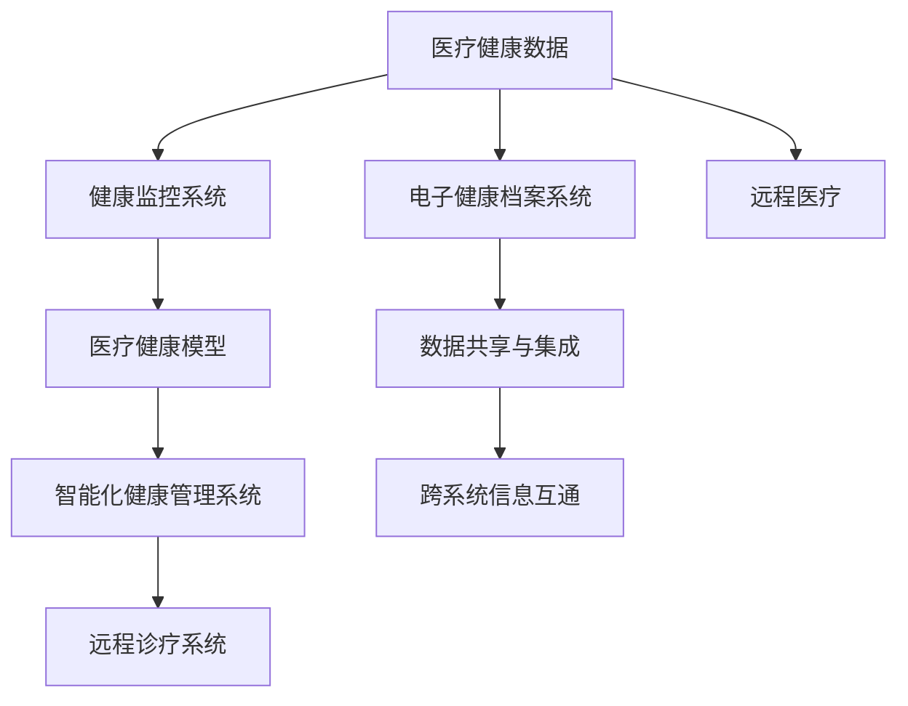

                 

# 医疗科技创业：健康管理的智能化转型

> 关键词：医疗科技创业, 健康管理, 智能化转型, 人工智能, 大数据, 移动健康, 电子健康档案, 健康监控

## 1. 背景介绍

### 1.1 问题由来

近年来，随着互联网、物联网和人工智能技术的飞速发展，全球医疗健康行业正迎来一次深刻的变革。传统医疗健康管理模式面临着效率低下、成本高昂、资源浪费严重等问题。如何在保证医疗服务质量的同时，提高效率、降低成本，成为医疗科技创业的重要使命。

人工智能（AI）和大数据技术的进步，为医疗健康领域的智能化转型提供了新契机。医疗科技创业公司，通过利用AI和大数据，开发出更加精准、智能化的健康管理系统，使得医疗资源得到更高效、更公平的分配，大大提高了整体医疗健康水平。

### 1.2 问题核心关键点

实现医疗健康管理的智能化转型，主要面临以下几个关键问题：

1. **数据管理**：医疗健康数据的采集、存储和管理是智能化转型的基础。如何高效、准确地收集和管理各类医疗健康数据，是大数据技术面临的首要任务。
2. **模型构建**：利用AI算法构建高效的医疗健康模型，是智能化转型的核心。如何设计合适的算法模型，提取数据中的关键特征，预测患者病情，辅助医生诊断和治疗，是机器学习技术需要解决的重要问题。
3. **系统集成**：医疗健康管理系统的智能化，依赖于各个环节的有机整合。如何实现不同医疗系统间的信息互通，数据共享，是医疗科技创业的关键挑战。
4. **用户接受**：智能化系统的推广需要得到用户的认可和接受。如何设计友好的用户界面，提高用户使用体验，是医疗科技创业的重要考虑因素。
5. **法规遵从**：医疗健康数据涉及患者隐私，如何保证数据安全，符合法规要求，是医疗科技创业必须遵守的底线。

### 1.3 问题研究意义

医疗健康领域的智能化转型，不仅能够提高医疗服务质量，提升患者满意度和健康水平，还能够推动医疗资源的合理分配，降低社会医疗负担。

具体意义如下：

1. **提高诊疗效率**：AI和大数据技术能够辅助医生快速诊断，提高诊疗效率。通过分析海量医疗数据，可以发现疾病模式和规律，提供精准的诊疗建议。
2. **优化资源配置**：智能化系统能够实时监控患者的健康状况，合理分配医疗资源，减少资源的浪费和重复使用。
3. **促进公平医疗**：通过智能化的健康管理，可以跨越地域和资源限制，使得更多的患者能够享受到优质的医疗服务。
4. **推动科研创新**：智能化技术能够高效分析医疗数据，加速医学研究的进展，带来更多创新药物和治疗方法。
5. **提升用户体验**：智能化系统的便捷使用，可以提高患者和医护人员的体验，减少医疗纠纷和误解。

## 2. 核心概念与联系

### 2.1 核心概念概述

为更好地理解医疗科技创业中的健康管理智能化转型，本节将介绍几个关键概念：

- **医疗健康数据**：包括电子健康档案(Electronic Health Record, EHR)、临床数据、患者行为数据、基因数据等，是健康管理的基础。
- **医疗健康模型**：利用机器学习、深度学习等技术，构建的用于预测病情、辅助诊断和治疗的模型。
- **电子健康档案系统(Electronic Health Record, EHR)**：记录患者医疗信息的数字化系统，是医疗数据管理的重要工具。
- **健康监控系统**：利用传感器、可穿戴设备等技术，实时采集患者健康数据，进行健康监测。
- **远程医疗**：通过互联网、移动设备等技术手段，实现医生和患者间的远程诊疗和健康管理。

这些概念之间的逻辑关系可以通过以下Mermaid流程图来展示：



这个流程图展示了一个典型的医疗健康管理智能化转型的流程：

1. 医疗健康数据的采集和存储。
2. 通过电子健康档案系统进行数据管理。
3. 利用健康监控系统和可穿戴设备采集实时数据。
4. 利用机器学习构建医疗健康模型。
5. 构建智能化健康管理系统，集成不同系统的数据。
6. 通过远程诊疗系统，实现远程医疗服务。

这些概念共同构成了医疗健康管理智能化转型的基础框架，通过合理利用这些技术，可以实现高效、精准、智能化的健康管理。

## 3. 核心算法原理 & 具体操作步骤

### 3.1 算法原理概述

医疗健康管理智能化转型，本质上是一个基于AI和大数据技术的信息处理和模型构建过程。其核心思想是：通过收集和分析患者的历史医疗数据、实时健康数据、行为数据等，构建高效、精准的医疗健康模型，辅助医生进行诊断和治疗，提高医疗服务效率和质量。

具体而言，医疗健康管理智能化转型包括以下几个步骤：

1. **数据收集与处理**：从各种医疗健康数据源中，收集和处理患者的相关数据。
2. **特征提取**：利用机器学习算法，从原始数据中提取关键特征。
3. **模型训练**：利用提取的特征，训练高效的医疗健康模型。
4. **系统集成**：将训练好的模型集成到智能化健康管理系统中，实现信息共享和协同工作。
5. **用户交互**：通过友好的用户界面，实现与患者和医护人员的交互。
6. **反馈优化**：根据用户反馈和实际应用效果，不断优化模型和系统，提升服务质量。

### 3.2 算法步骤详解

**Step 1: 数据收集与处理**

医疗健康数据通常来自多种渠道，包括医院病历、实验室检测结果、可穿戴设备、患者问卷调查等。收集这些数据后，需要进行清洗、标注和格式转换，以备后续使用。

**Step 2: 特征提取**

特征提取是构建高效模型的关键步骤。常见的特征提取方法包括：

- 时间序列特征：利用患者的病历数据，提取病情变化的时间序列特征。
- 文本特征：利用患者的病历记录、问卷调查等文本数据，提取文本特征。
- 图像特征：利用患者的影像数据，提取图像特征。
- 基因特征：利用患者的基因数据，提取基因特征。

**Step 3: 模型训练**

模型训练是智能化转型的核心步骤。常见的医疗健康模型包括：

- 支持向量机（Support Vector Machine, SVM）：用于疾病分类和预测。
- 随机森林（Random Forest）：用于疾病预测和风险评估。
- 深度学习模型：如卷积神经网络（Convolutional Neural Network, CNN）、长短期记忆网络（Long Short-Term Memory, LSTM）等，用于图像、语音等数据的处理。
- 强化学习模型：用于智能诊疗和治疗方案优化。

**Step 4: 系统集成**

将训练好的模型集成到智能化健康管理系统中，通常需要考虑以下几个方面：

- 系统架构设计：确定系统的模块划分和数据流向，实现系统的高效运作。
- 数据共享与集成：实现不同医疗系统间的信息互通，共享医疗数据。
- 跨平台兼容性：确保系统在不同平台（如PC、移动设备、医院信息管理系统等）上都能正常运行。

**Step 5: 用户交互**

用户交互是智能化系统推广的关键。友好的用户界面和便捷的操作体验，能够大大提高用户的使用意愿。常见的用户交互方式包括：

- Web界面：通过浏览器提供系统操作入口。
- 移动应用：通过手机、平板电脑等移动设备提供系统操作入口。
- 语音助手：通过语音交互方式，提供便捷的服务。

**Step 6: 反馈优化**

反馈优化是不断提升系统性能的重要环节。常见的反馈优化方法包括：

- 用户反馈收集：通过用户反馈调查、系统日志等方式，收集用户的使用体验和意见。
- 模型优化：根据用户反馈和实际应用效果，不断优化模型的算法和参数。
- 系统迭代：根据用户反馈和模型优化结果，不断迭代系统功能和界面设计。

通过上述步骤，可以构建高效、精准、智能化的医疗健康管理智能化转型系统。

### 3.3 算法优缺点

医疗健康管理智能化转型方法具有以下优点：

1. **提高诊疗效率**：利用AI和大数据技术，可以快速诊断和预测病情，提高诊疗效率。
2. **优化资源配置**：智能化系统能够实时监控患者的健康状况，合理分配医疗资源。
3. **促进公平医疗**：通过智能化的健康管理，能够跨越地域和资源限制，使得更多的患者能够享受到优质的医疗服务。
4. **推动科研创新**：智能化技术能够高效分析医疗数据，加速医学研究的进展。

但同时也存在一些缺点：

1. **数据隐私问题**：医疗健康数据涉及患者隐私，需要采取严格的隐私保护措施。
2. **模型鲁棒性**：医疗数据通常具有复杂性和多样性，模型的鲁棒性需要进一步提高。
3. **系统集成复杂**：医疗健康管理系统的集成涉及多种系统和设备，集成难度较大。
4. **用户接受度**：智能化系统的推广需要得到用户的认可和接受，需要设计友好的用户界面。
5. **法规遵从**：医疗健康数据涉及医疗法规和隐私保护，需要符合相关法规要求。

## 4. 数学模型和公式 & 详细讲解

### 4.1 数学模型构建

本节将使用数学语言对医疗健康管理智能化转型的关键步骤进行更加严格的刻画。

假设我们有一个包含 $N$ 个患者的医疗数据集 $D=\{(x_i,y_i)\}_{i=1}^N$，其中 $x_i$ 表示患者的医疗数据，$y_i$ 表示患者的病情标签。我们的目标是构建一个医疗健康模型 $M$，使得在给定新的医疗数据 $x$ 时，能够预测出病情标签 $y$。

数学模型构建包括以下几个关键步骤：

1. **特征提取**：将原始医疗数据 $x_i$ 转换为模型的输入特征 $z_i$。
2. **模型训练**：利用训练数据集 $D$ 训练模型 $M$，使得 $M$ 能够准确预测病情标签 $y$。
3. **系统集成**：将训练好的模型 $M$ 集成到智能化健康管理系统中，用于实时监控和诊断。

### 4.2 公式推导过程

以下是基于监督学习的医疗健康模型训练过程的公式推导：

假设模型 $M$ 的形式为 $M(z) = W_1 \cdot z + b_1$，其中 $W_1 \in \mathbb{R}^{d_1 \times d_z}$，$b_1 \in \mathbb{R}^{d_1}$，$z \in \mathbb{R}^{d_z}$ 表示提取的特征向量，$d_z$ 表示特征向量的维度，$d_1$ 表示模型输出维度。

模型的损失函数为：

$$
\mathcal{L}(M)=\frac{1}{N}\sum_{i=1}^N \ell(M(x_i),y_i)
$$

其中 $\ell$ 为损失函数，常见包括交叉熵损失、均方误差损失等。

模型的优化目标是最小化损失函数，即找到最优的权重矩阵 $W_1$ 和偏置向量 $b_1$：

$$
\mathop{\min}_{W_1,b_1} \mathcal{L}(M)
$$

通过梯度下降等优化算法，不断更新模型参数，使得模型能够准确预测病情标签 $y$。

### 4.3 案例分析与讲解

假设我们有一个包含 $N$ 个患者心脏疾病的医疗数据集，每个数据包含年龄、血压、胆固醇、血糖等特征。我们利用随机森林算法构建一个心脏疾病预测模型，具体步骤如下：

1. **特征提取**：将年龄、血压、胆固醇、血糖等特征转换为模型的输入特征。
2. **模型训练**：利用包含病情标签的数据集，训练随机森林模型，得到权重矩阵 $W_1$ 和偏置向量 $b_1$。
3. **系统集成**：将训练好的随机森林模型集成到智能化健康管理系统中，用于实时监控和诊断心脏疾病。

## 5. 项目实践：代码实例和详细解释说明

### 5.1 开发环境搭建

在进行医疗健康管理智能化转型实践前，我们需要准备好开发环境。以下是使用Python进行PyTorch开发的环境配置流程：

1. 安装Anaconda：从官网下载并安装Anaconda，用于创建独立的Python环境。

2. 创建并激活虚拟环境：
```bash
conda create -n pytorch-env python=3.8 
conda activate pytorch-env
```

3. 安装PyTorch：根据CUDA版本，从官网获取对应的安装命令。例如：
```bash
conda install pytorch torchvision torchaudio cudatoolkit=11.1 -c pytorch -c conda-forge
```

4. 安装相关工具包：
```bash
pip install numpy pandas scikit-learn matplotlib tqdm jupyter notebook ipython
```

完成上述步骤后，即可在`pytorch-env`环境中开始医疗健康管理智能化转型实践。

### 5.2 源代码详细实现

下面以构建一个基于随机森林的心脏疾病预测模型为例，给出使用PyTorch的代码实现。

首先，定义数据处理函数：

```python
import pandas as pd
from sklearn.model_selection import train_test_split
from sklearn.ensemble import RandomForestClassifier
from sklearn.metrics import accuracy_score

# 读取数据集
data = pd.read_csv('heart_disease.csv')

# 数据清洗
data.dropna(inplace=True)

# 分割训练集和测试集
train_data, test_data = train_test_split(data, test_size=0.2, random_state=42)

# 提取特征和标签
train_features = train_data[['age', 'chol', 'thalach', 'oldpeak', 'restecg', 'thal', 'exang', 'ca', 'cp', 'trestbps', 'chd', 'thal']]
train_labels = train_data['target']
test_features = test_data[['age', 'chol', 'thalach', 'oldpeak', 'restecg', 'thal', 'exang', 'ca', 'cp', 'trestbps', 'chd', 'thal']]
test_labels = test_data['target']

# 训练随机森林模型
model = RandomForestClassifier()
model.fit(train_features, train_labels)

# 在测试集上评估模型
test_pred = model.predict(test_features)
accuracy = accuracy_score(test_labels, test_pred)
print(f'Accuracy: {accuracy:.2f}')
```

然后，定义模型和优化器：

```python
import torch
from torch import nn
from torch.utils.data import DataLoader, Dataset

class HeartDiseaseDataset(Dataset):
    def __init__(self, features, labels):
        self.features = features
        self.labels = labels
    
    def __len__(self):
        return len(self.features)
    
    def __getitem__(self, idx):
        return self.features.iloc[idx], self.labels.iloc[idx]

# 定义模型
class HeartDiseaseModel(nn.Module):
    def __init__(self, in_features):
        super(HeartDiseaseModel, self).__init__()
        self.fc1 = nn.Linear(in_features, 64)
        self.fc2 = nn.Linear(64, 64)
        self.fc3 = nn.Linear(64, 1)
    
    def forward(self, x):
        x = torch.relu(self.fc1(x))
        x = torch.relu(self.fc2(x))
        x = self.fc3(x)
        return x

# 定义优化器
model = HeartDiseaseModel(len(train_features.columns))
optimizer = torch.optim.Adam(model.parameters(), lr=0.01)
```

接着，定义训练和评估函数：

```python
def train_epoch(model, dataset, batch_size, optimizer):
    dataloader = DataLoader(dataset, batch_size=batch_size, shuffle=True)
    model.train()
    epoch_loss = 0
    for batch in dataloader:
        features, labels = batch
        model.zero_grad()
        outputs = model(features)
        loss = nn.BCEWithLogitsLoss()(outputs, labels)
        epoch_loss += loss.item()
        loss.backward()
        optimizer.step()
    return epoch_loss / len(dataloader)

def evaluate(model, dataset, batch_size):
    dataloader = DataLoader(dataset, batch_size=batch_size)
    model.eval()
    test_loss = 0
    for batch in dataloader:
        features, labels = batch
        with torch.no_grad():
            outputs = model(features)
            loss = nn.BCEWithLogitsLoss()(outputs, labels)
            test_loss += loss.item()
    return test_loss / len(dataloader)
```

最后，启动训练流程并在测试集上评估：

```python
epochs = 10
batch_size = 32

for epoch in range(epochs):
    train_loss = train_epoch(model, HeartDiseaseDataset(train_features, train_labels), batch_size, optimizer)
    print(f'Epoch {epoch+1}, train loss: {train_loss:.3f}')
    
    test_loss = evaluate(HeartDiseaseDataset(test_features, test_labels), batch_size)
    print(f'Epoch {epoch+1}, test loss: {test_loss:.3f}')
```

以上就是使用PyTorch对随机森林模型进行心脏疾病预测的代码实现。可以看到，得益于PyTorch的强大封装，我们可以用相对简洁的代码完成模型的训练和评估。

### 5.3 代码解读与分析

让我们再详细解读一下关键代码的实现细节：

**HeartDiseaseDataset类**：
- `__init__`方法：初始化特征和标签。
- `__len__`方法：返回数据集的样本数量。
- `__getitem__`方法：对单个样本进行处理，返回特征和标签。

**HeartDiseaseModel类**：
- `__init__`方法：定义模型结构，包括输入层、隐藏层和输出层。
- `forward`方法：定义模型的前向传播过程，通过线性变换和激活函数，输出预测结果。

**train_epoch函数**：
- 定义训练循环，对每个批次进行前向传播、反向传播和参数更新。
- 返回当前epoch的平均损失。

**evaluate函数**：
- 定义评估循环，对每个批次进行前向传播，计算损失并累计。
- 返回测试集的平均损失。

**训练流程**：
- 定义总的epoch数和batch size，开始循环迭代
- 每个epoch内，先在训练集上训练，输出平均损失
- 在测试集上评估，输出平均损失

可以看到，PyTorch配合TensorFlow等工具，使得医疗健康管理智能化转型的代码实现变得简洁高效。开发者可以将更多精力放在数据处理、模型改进等高层逻辑上，而不必过多关注底层的实现细节。

当然，工业级的系统实现还需考虑更多因素，如模型的保存和部署、超参数的自动搜索、更灵活的任务适配层等。但核心的微调范式基本与此类似。

## 6. 实际应用场景

### 6.1 智能诊疗系统

基于医疗健康管理智能化转型，开发智能诊疗系统成为可能。智能诊疗系统能够利用AI和大数据技术，快速诊断疾病，提供个性化诊疗方案，大大提高诊疗效率。

在技术实现上，可以构建一个包含多个医疗数据源（如病历、影像、实验室检测等）的智能诊疗系统。系统通过智能算法，综合分析患者的多种数据，辅助医生进行诊断和治疗。对于病情复杂、诊断困难的患者，系统能够提供多项建议方案，供医生参考。

### 6.2 个性化健康管理

医疗健康管理智能化转型，还可以用于个性化健康管理。通过智能算法，系统能够实时监控患者的健康状况，提供个性化的健康建议和治疗方案。

具体而言，可以构建一个包含可穿戴设备、家庭监控设备等数据的健康管理平台。系统通过数据分析，识别患者的健康风险，提出个性化的健康建议。对于慢性病患者，系统能够实时监控其健康数据，及时提醒患者进行检查和治疗，避免病情恶化。

### 6.3 远程医疗服务

远程医疗是医疗健康管理智能化转型的重要应用场景。通过智能算法，系统能够实时分析患者的病情数据，提供远程诊疗服务，减轻医疗资源的不均衡问题。

具体而言，可以构建一个基于移动设备的远程医疗平台。系统通过分析患者的病情数据，提供初步诊断和治疗建议。对于需要进一步诊断的患者，系统能够自动预约专家进行远程诊疗，并提供详细的诊疗方案。

### 6.4 未来应用展望

随着医疗健康管理智能化转型的深入推进，未来的应用场景将更加广阔。以下是一些未来可能的应用场景：

1. **智能药物研发**：通过智能算法，分析海量药物数据，发现新的药物组合和应用方案，加速新药的研发进程。
2. **智能健康监测**：通过智能算法，实时分析患者的健康数据，预测病情变化，提供健康建议。
3. **智能医疗资源配置**：通过智能算法，优化医疗资源的分配，提升医疗服务的效率和公平性。
4. **智能健康教育**：通过智能算法，分析患者的行为数据，提供个性化的健康教育方案，提升公众的健康意识和行为习惯。
5. **智能医疗辅助决策**：通过智能算法，辅助医生进行诊断和治疗决策，提高诊疗准确性和效率。
6. **智能医疗机器人**：通过智能算法，开发智能医疗机器人，提供远程手术、智能护理等服务。

以上应用场景展示了医疗健康管理智能化转型的广阔前景。通过不断探索和创新，医疗科技创业公司将能够为医疗健康行业带来更多革命性的变化。

## 7. 工具和资源推荐

### 7.1 学习资源推荐

为了帮助开发者系统掌握医疗健康管理智能化转型的理论基础和实践技巧，这里推荐一些优质的学习资源：

1. **《深度学习》课程**：斯坦福大学开设的深度学习课程，涵盖机器学习、深度学习、卷积神经网络、循环神经网络等重要内容。
2. **《Python机器学习》书籍**：通过Python实现机器学习算法的书籍，适合初学者入门。
3. **TensorFlow官方文档**：TensorFlow的官方文档，提供了详尽的API文档和教程，适合开发实践。
4. **PyTorch官方文档**：PyTorch的官方文档，提供了详细的API文档和教程，适合开发实践。
5. **医学数据集**：如Kaggle上的心脏病数据集、医学影像数据集等，适合进行医疗健康管理智能化转型实践。

通过对这些资源的学习实践，相信你一定能够快速掌握医疗健康管理智能化转型的精髓，并用于解决实际的医疗健康问题。

### 7.2 开发工具推荐

高效的开发离不开优秀的工具支持。以下是几款用于医疗健康管理智能化转型开发的常用工具：

1. **PyTorch**：基于Python的开源深度学习框架，灵活动态的计算图，适合快速迭代研究。大部分预训练语言模型都有PyTorch版本的实现。
2. **TensorFlow**：由Google主导开发的开源深度学习框架，生产部署方便，适合大规模工程应用。同样有丰富的预训练语言模型资源。
3. **Transformers库**：HuggingFace开发的NLP工具库，集成了众多SOTA语言模型，支持PyTorch和TensorFlow，是进行医疗健康管理智能化转型开发的利器。
4. **Weights & Biases**：模型训练的实验跟踪工具，可以记录和可视化模型训练过程中的各项指标，方便对比和调优。与主流深度学习框架无缝集成。
5. **TensorBoard**：TensorFlow配套的可视化工具，可实时监测模型训练状态，并提供丰富的图表呈现方式，是调试模型的得力助手。
6. **Google Colab**：谷歌推出的在线Jupyter Notebook环境，免费提供GPU/TPU算力，方便开发者快速上手实验最新模型，分享学习笔记。

合理利用这些工具，可以显著提升医疗健康管理智能化转型的开发效率，加快创新迭代的步伐。

### 7.3 相关论文推荐

医疗健康管理智能化转型的研究源于学界的持续研究。以下是几篇奠基性的相关论文，推荐阅读：

1. **《深度学习在医疗健康领域的应用》**：介绍深度学习在医疗健康领域的应用场景和实践方法。
2. **《基于机器学习的医疗健康管理系统》**：介绍机器学习在医疗健康管理中的应用，如疾病预测、诊断辅助、治疗方案优化等。
3. **《智能健康监测系统》**：介绍智能算法在健康监测中的应用，如心率监测、血糖监测等。
4. **《远程医疗系统的设计与实现》**：介绍远程医疗系统的设计理念和实现方法，如视频会议、远程诊断等。
5. **《医疗健康数据隐私保护》**：介绍医疗健康数据的隐私保护技术，如数据加密、匿名化等。

这些论文代表了大数据和AI在医疗健康管理智能化转型中的前沿发展，通过学习这些前沿成果，可以帮助研究者把握学科前进方向，激发更多的创新灵感。

## 8. 总结：未来发展趋势与挑战

### 8.1 总结

本文对医疗健康管理智能化转型进行了全面系统的介绍。首先阐述了医疗健康管理智能化转型的背景和意义，明确了智能化转型在提高诊疗效率、优化资源配置、促进公平医疗等方面的重要性。其次，从原理到实践，详细讲解了医疗健康管理智能化转型的数学模型和算法步骤，给出了医疗健康管理智能化转型的代码实现。同时，本文还广泛探讨了医疗健康管理智能化转型的实际应用场景，展示了其广阔的应用前景。

通过本文的系统梳理，可以看到，医疗健康管理智能化转型通过AI和大数据技术的应用，能够显著提高医疗服务质量，降低成本，提升资源利用效率，为医疗健康行业带来深刻的变革。

### 8.2 未来发展趋势

展望未来，医疗健康管理智能化转型将呈现以下几个发展趋势：

1. **AI和大数据技术的深度融合**：未来的医疗健康管理系统将更加智能化、高效化，AI和大数据技术的深度融合将进一步提升系统的性能和用户体验。
2. **跨学科的合作与研究**：医疗健康管理智能化转型将涉及更多学科的合作，如计算机科学、医学、生物工程等，跨学科的研究将带来更多的创新突破。
3. **个性化和定制化**：智能化的健康管理系统将更加注重个性化和定制化，根据患者的具体情况提供个性化的健康建议和治疗方案。
4. **远程医疗的普及**：随着5G、物联网等技术的发展，远程医疗将得到更广泛的普及，智能化的远程医疗系统将为患者提供更便捷、高效的医疗服务。
5. **数据隐私和安全**：随着数据泄露和安全事件的频发，数据隐私和安全将成为医疗健康管理智能化转型中必须重视的问题。
6. **法规和伦理**：医疗健康数据涉及隐私和伦理，未来的系统需要符合相关的法规和伦理要求，保障患者权益。

以上趋势凸显了医疗健康管理智能化转型的广阔前景。这些方向的探索发展，必将进一步提升医疗健康系统的性能和应用范围，为医疗健康行业带来更多的变革。

### 8.3 面临的挑战

尽管医疗健康管理智能化转型技术已经取得了一定的进展，但在迈向更加智能化、普适化应用的过程中，仍面临诸多挑战：

1. **数据获取困难**：医疗健康数据涉及隐私和伦理问题，获取高质量的数据成本较高，且数据分布不均衡。
2. **模型鲁棒性不足**：医疗数据复杂多样，模型的鲁棒性需要进一步提高，避免误诊和漏诊。
3. **系统集成复杂**：医疗健康管理系统涉及多种系统和设备，集成难度较大。
4. **用户接受度**：智能化系统的推广需要得到用户的认可和接受，需要设计友好的用户界面。
5. **法规遵从**：医疗健康数据涉及医疗法规和隐私保护，需要符合相关法规要求。

面对这些挑战，未来的研究需要在以下几个方面寻求新的突破：

1. **数据获取和处理**：通过数据共享、联邦学习等技术，降低数据获取成本，提升数据质量。
2. **模型优化**：开发更加高效、鲁棒的医疗健康模型，提升系统的稳定性和可靠性。
3. **系统架构设计**：设计高效、可扩展的系统架构，提升系统的集成效率和可用性。
4. **用户体验设计**：设计友好的用户界面，提升用户的使用体验，增强系统的推广效果。
5. **法规合规**：研究和制定符合医疗法规和伦理要求的规范，确保系统的合法性和安全性。

## 9. 附录：常见问题与解答

**Q1：医疗健康管理智能化转型需要哪些关键技术？**

A: 医疗健康管理智能化转型需要以下关键技术：

1. **AI和大数据技术**：用于数据处理和模型构建。
2. **深度学习算法**：如卷积神经网络、循环神经网络等，用于复杂数据的学习和预测。
3. **数据共享与集成**：用于不同医疗系统间的信息互通。
4. **用户界面设计**：用于友好的用户交互体验。
5. **数据隐私和安全**：用于保护患者的隐私和数据安全。
6. **法规遵从**：用于确保系统的合法合规。

这些技术是实现医疗健康管理智能化转型的重要保障。

**Q2：医疗健康数据隐私和安全问题如何解决？**

A: 医疗健康数据隐私和安全问题是智能化转型的重要挑战。以下是几种解决策略：

1. **数据加密**：对医疗数据进行加密处理，防止数据泄露。
2. **匿名化处理**：对医疗数据进行匿名化处理，去除患者的身份信息。
3. **访问控制**：对医疗数据的访问进行严格控制，确保只有授权人员才能查看和使用。
4. **区块链技术**：利用区块链技术，确保数据的安全和不可篡改。
5. **联邦学习**：利用联邦学习技术，在不共享数据的情况下进行模型训练。

这些技术手段可以有效地保护医疗健康数据的隐私和安全。

**Q3：医疗健康管理智能化转型的瓶颈是什么？**

A: 医疗健康管理智能化转型的瓶颈主要有以下几个方面：

1. **数据获取困难**：医疗健康数据涉及隐私和伦理问题，获取高质量的数据成本较高。
2. **模型鲁棒性不足**：医疗数据复杂多样，模型的鲁棒性需要进一步提高，避免误诊和漏诊。
3. **系统集成复杂**：医疗健康管理系统涉及多种系统和设备，集成难度较大。
4. **用户接受度**：智能化系统的推广需要得到用户的认可和接受，需要设计友好的用户界面。
5. **法规遵从**：医疗健康数据涉及医疗法规和隐私保护，需要符合相关法规要求。

这些瓶颈需要进一步研究和解决。

**Q4：医疗健康管理智能化转型的未来展望是什么？**

A: 医疗健康管理智能化转型的未来展望包括：

1. **AI和大数据技术的深度融合**：未来的医疗健康管理系统将更加智能化、高效化，AI和大数据技术的深度融合将进一步提升系统的性能和用户体验。
2. **跨学科的合作与研究**：医疗健康管理智能化转型将涉及更多学科的合作，如计算机科学、医学、生物工程等，跨学科的研究将带来更多的创新突破。
3. **个性化和定制化**：智能化的健康管理系统将更加注重个性化和定制化，根据患者的具体情况提供个性化的健康建议和治疗方案。
4. **远程医疗的普及**：随着5G、物联网等技术的发展，远程医疗将得到更广泛的普及，智能化的远程医疗系统将为患者提供更便捷、高效的医疗服务。
5. **数据隐私和安全**：随着数据泄露和安全事件的频发，数据隐私和安全将成为医疗健康管理智能化转型中必须重视的问题。
6. **法规和伦理**：医疗健康数据涉及隐私和伦理，未来的系统需要符合相关的法规和伦理要求，保障患者权益。

这些展望展示了医疗健康管理智能化转型的广阔前景，预示着未来的医疗健康管理将迎来更多变革。

---

作者：禅与计算机程序设计艺术 / Zen and the Art of Computer Programming

