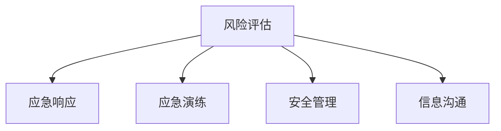
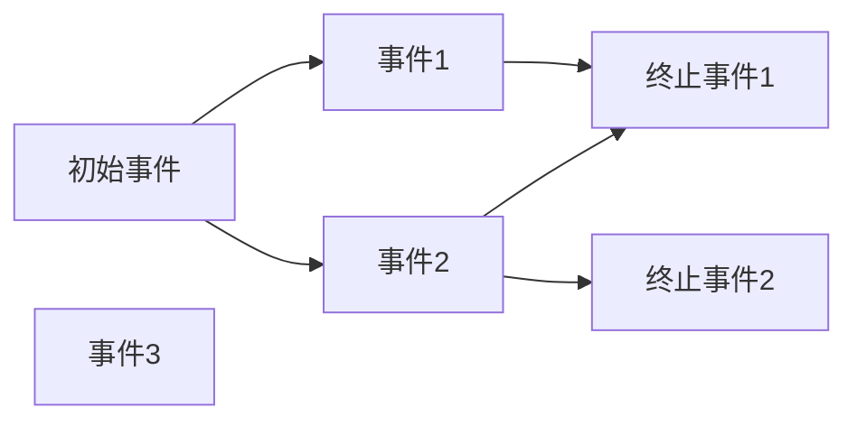
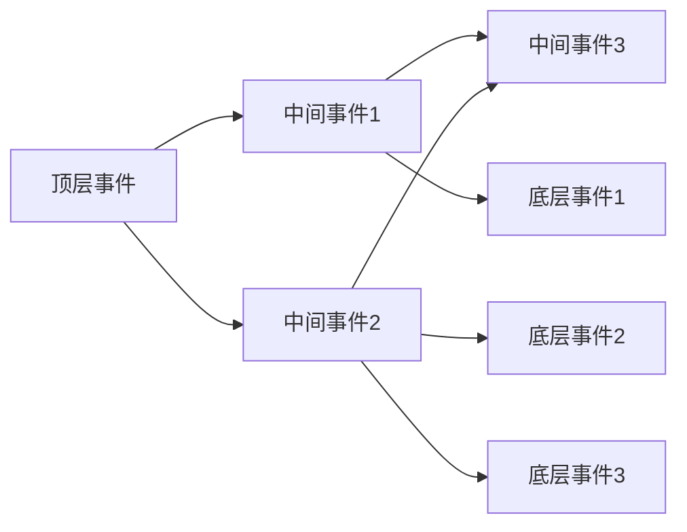

                 

# 危机管理：有效应对突发事件的方法

> 关键词：危机管理,突发事件,风险评估,应急响应,应急演练,安全管理

## 1. 背景介绍

### 1.1 问题由来

现代社会的发展带来了许多新的挑战和风险，包括自然灾害、网络攻击、人为事故等突发事件。面对这些事件，企业和组织必须具备有效的危机管理能力，以保障人员安全、减少损失、维护品牌声誉和公众信任。

近年来，应急管理和风险评估的重要性逐渐被广泛认可。许多企业和政府机构开始重视建立和维护高效的危机管理体系。然而，当前的危机管理仍然存在诸多问题，如响应速度慢、协调困难、资源浪费等。

因此，本文将探讨危机管理的核心概念、关键步骤和前沿技术，为提升危机应对能力提供可行的建议和策略。

### 1.2 问题核心关键点

危机管理的关键在于通过系统化的准备、快速响应、有效沟通和持续改进，保障组织在突发事件中能够迅速、有序、高效地应对挑战。

核心关键点包括：
1. 风险评估：识别、分析和管理潜在的风险源。
2. 应急响应：制定和执行应对突发事件的预案。
3. 应急演练：定期进行模拟演练，提升团队的响应能力。
4. 安全管理：建立全面的安全管理体系，保障日常运营和应急响应。
5. 信息沟通：确保在事件中能够迅速、准确地传递信息。

这些关键点共同构成了危机管理的核心框架，帮助组织在面对突发事件时保持稳定和有序。

## 2. 核心概念与联系

### 2.1 核心概念概述

为更好地理解危机管理，本节将介绍几个密切相关的核心概念：

- **风险评估(Risk Assessment)**：通过系统化的分析方法，识别、评估和优先排序潜在风险。包括风险识别、风险分析和风险管理三个阶段。
- **应急响应(Incident Response)**：在突发事件发生时，迅速启动预案，采取行动，减轻或消除事件带来的影响。包括响应准备、响应执行和响应评估三个阶段。
- **应急演练(Incident Drills)**：通过模拟突发事件，评估和改进应急响应预案和团队能力。包括桌面演练、功能演练和全面演练三种类型。
- **安全管理(Security Management)**：建立全面的安全管理体系，保障组织的安全和稳定运营。包括风险管理、安全审计和持续改进三个方面。
- **信息沟通(Information Communication)**：在突发事件中确保信息的及时、准确传递，支持有效的决策和行动。包括信息发布、沟通管理和危机公关三个环节。

这些概念之间的逻辑关系可以通过以下Mermaid流程图来展示：



这个流程图展示了一些关键概念之间的关系：

1. 风险评估识别和管理潜在风险。
2. 应急响应在突发事件发生时迅速采取行动。
3. 应急演练提升团队的响应能力。
4. 安全管理保障日常运营和应急响应。
5. 信息沟通确保信息的及时传递和有效沟通。

这些概念共同构成了危机管理的核心框架，帮助组织在面对突发事件时保持稳定和有序。

## 3. 核心算法原理 & 具体操作步骤

### 3.1 算法原理概述

危机管理算法原理主要基于以下几个关键步骤：

1. **风险评估**：通过数据收集、分析和建模，识别和评估潜在风险，确定风险发生的概率和影响。
2. **应急响应**：基于风险评估结果，制定和执行应对突发事件的预案，确保在事件发生时能够迅速、有序地采取行动。
3. **应急演练**：定期进行模拟演练，评估和改进应急响应预案和团队能力，确保在实际事件中能够快速响应。
4. **安全管理**：建立全面的安全管理体系，包括风险管理、安全审计和持续改进，保障日常运营和应急响应。
5. **信息沟通**：建立信息发布机制，确保在突发事件中能够迅速、准确地传递信息，支持有效的决策和行动。

### 3.2 算法步骤详解

#### 3.2.1 风险评估

**步骤1: 数据收集与分析**
- 收集与潜在风险相关的历史数据、专家意见和环境因素。
- 通过定量和定性的方法，识别和分析潜在风险。

**步骤2: 风险建模**
- 使用统计和数学方法，建立风险模型，评估风险发生的概率和影响。
- 常用的风险评估方法包括：事件树分析(ETA)、故障树分析(FTA)、蒙特卡洛模拟等。

**步骤3: 风险优先排序**
- 基于风险模型，确定风险的优先级，制定应对策略。
- 优先处理高风险事件，优化资源分配。

#### 3.2.2 应急响应

**步骤1: 响应准备**
- 制定应急响应预案，明确各部门和人员的职责和行动步骤。
- 准备应急物资和设备，建立应急通信和信息发布渠道。

**步骤2: 响应执行**
- 在突发事件发生时，迅速启动应急预案，采取行动，减轻或消除事件带来的影响。
- 采用分级响应机制，根据事件严重程度调整响应级别。

**步骤3: 响应评估**
- 在事件结束后，进行事后评估，总结经验教训，优化应急预案。
- 分析响应过程中的不足和改进点，提升应急响应能力。

#### 3.2.3 应急演练

**步骤1: 演练计划**
- 确定演练的目标和范围，制定详细的演练计划。
- 选择合适的演练类型和规模，确保演练的可行性和有效性。

**步骤2: 演练实施**
- 模拟突发事件，按照预案进行演练，评估团队的反应和协作。
- 使用仿真工具和模拟场景，提高演练的真实性和挑战性。

**步骤3: 演练评估**
- 分析演练结果，识别和改进预案中的不足。
- 制定改进措施，提升团队应急响应能力。

#### 3.2.4 安全管理

**步骤1: 风险管理**
- 通过风险评估，识别和控制潜在风险。
- 采用风险控制措施，如风险转移、风险减轻和风险接受。

**步骤2: 安全审计**
- 定期进行安全审计，评估安全管理体系的有效性。
- 采用技术和管理手段，提高安全防护能力。

**步骤3: 持续改进**
- 建立持续改进机制，不断优化安全管理体系。
- 引入新技术和管理工具，提升安全管理的效率和效果。

#### 3.2.5 信息沟通

**步骤1: 信息发布机制**
- 建立信息发布机制，确保在突发事件中能够迅速、准确地传递信息。
- 使用多种渠道，如社交媒体、新闻发布会等，及时向公众通报事件情况。

**步骤2: 沟通管理**
- 制定沟通策略，确保信息传递的一致性和准确性。
- 管理信息传播，防止谣言和不实信息扩散。

**步骤3: 危机公关**
- 在事件中保持专业和透明，提升公众信任和品牌声誉。
- 处理媒体和公众的关注和质疑，维护组织形象。

### 3.3 算法优缺点

危机管理算法的优点：
1. 系统化管理：通过风险评估、应急响应、应急演练等步骤，系统化管理突发事件，提高应对能力。
2. 快速响应：基于预案和演练，确保在突发事件中能够迅速、有序地采取行动。
3. 持续改进：通过事后评估和持续改进，不断优化危机管理体系。
4. 信息透明：通过信息沟通机制，确保在事件中能够迅速、准确地传递信息，提升公众信任。

危机管理算法的缺点：
1. 数据依赖：风险评估和应急响应依赖于大量历史数据和环境因素，数据质量影响评估结果。
2. 预案局限：预案可能无法覆盖所有突发事件，无法应对未知和复杂的风险。
3. 资源消耗：应急演练和信息发布需要消耗大量资源，且演练效果难以量化。
4. 沟通挑战：信息沟通中的协调和一致性管理，可能导致信息传递的延迟和错误。

尽管存在这些局限性，但危机管理算法仍然是一种行之有效的应对突发事件的方法，需要结合实际应用场景进行优化和改进。

### 3.4 算法应用领域

危机管理算法在多个领域得到了广泛应用，包括：

- **政府和企业**：建立全面的应急管理体系，保障公共安全和社会稳定。
- **医疗机构**：制定和执行应急响应预案，保障患者安全和医疗服务稳定。
- **金融行业**：应对网络攻击和数据泄露等安全事件，保障金融稳定。
- **能源行业**：应对自然灾害和人为事故，保障能源供应和安全。
- **教育系统**：应对校园安全事件，保障师生安全和教育秩序。

## 4. 数学模型和公式 & 详细讲解 & 举例说明

### 4.1 数学模型构建

危机管理算法涉及多个数学模型，本节将详细介绍其中的核心模型。

#### 4.1.1 风险评估模型

**事件树分析(ETA)模型**
事件树分析通过将复杂系统分解为一系列简单事件，来评估潜在风险。事件树由初始事件、中间事件和终止事件组成，如下图所示：



事件树分析的数学模型为：

$$
P(T)=\sum_{i=1}^{n}P_1P_2\cdots P_n
$$

其中 $P$ 为事件的概率，$n$ 为中间事件的数量。

**故障树分析(FTA)模型**
故障树分析通过分析系统的故障原因和路径，来评估潜在风险。故障树由顶层事件、中间事件和底层事件组成，如下图所示：



故障树分析的数学模型为：

$$
P(T)=\sum_{i=1}^{n}P_1P_2\cdots P_n
$$

其中 $P$ 为事件的概率，$n$ 为中间事件的数量。

#### 4.1.2 应急响应模型

**分级响应模型**
分级响应模型根据事件的严重程度和影响范围，制定不同级别的响应措施。常见分级响应模型如下：

- **一级响应**：事件影响重大，需要立即启动最高响应级别。
- **二级响应**：事件影响较大，需要启动高级响应级别。
- **三级响应**：事件影响一般，需要启动较低级别响应。
- **四级响应**：事件影响轻微，仅需简单处理。

分级响应模型的数学模型为：

$$
R_i = \begin{cases}
    1, & \text{事件严重程度为1} \\
    2, & \text{事件严重程度为2} \\
    3, & \text{事件严重程度为3} \\
    4, & \text{事件严重程度为4}
\end{cases}
$$

其中 $R_i$ 为响应级别，$i$ 为事件严重程度。

### 4.2 公式推导过程

#### 4.2.1 事件树分析(ETA)推导

事件树分析的数学推导如下：

假设事件树包含 $n$ 个中间事件和 $k$ 个终止事件，事件 $i$ 发生的概率为 $P_i$，则事件树的总概率为：

$$
P(T)=\sum_{i=1}^{k}P_1P_2\cdots P_n
$$

其中 $P_i$ 为事件 $i$ 发生的概率，$n$ 为中间事件的数量，$k$ 为终止事件的数量。

#### 4.2.2 故障树分析(FTA)推导

故障树分析的数学推导如下：

假设故障树包含 $n$ 个中间事件和 $k$ 个底层事件，事件 $i$ 发生的概率为 $P_i$，则故障树的总概率为：

$$
P(T)=\sum_{i=1}^{k}P_1P_2\cdots P_n
$$

其中 $P_i$ 为事件 $i$ 发生的概率，$n$ 为中间事件的数量，$k$ 为底层事件的数量。

### 4.3 案例分析与讲解

#### 4.3.1 案例背景

某大型物流公司面临重大自然灾害的威胁。公司需要对可能发生的自然灾害进行风险评估，制定应急响应预案，并定期进行应急演练，确保在灾害发生时能够迅速、有序地应对。

#### 4.3.2 风险评估

**步骤1: 数据收集与分析**
- 收集公司所在地区的历史气象数据、地质数据和灾害记录。
- 通过统计和专家意见，确定可能发生的自然灾害类型，如洪水、地震、台风等。

**步骤2: 风险建模**
- 使用事件树分析模型，评估各种自然灾害的概率和影响。
- 确定高风险灾害，如洪水、地震，制定优先应对策略。

**步骤3: 风险优先排序**
- 基于事件树分析结果，确定风险优先级，制定应对措施。
- 优先处理高风险灾害，优化资源分配。

#### 4.3.3 应急响应

**步骤1: 响应准备**
- 制定应急响应预案，明确各部门和人员的职责和行动步骤。
- 准备应急物资和设备，建立应急通信和信息发布渠道。

**步骤2: 响应执行**
- 在自然灾害发生时，迅速启动应急预案，采取行动，减轻或消除灾害带来的影响。
- 采用分级响应机制，根据灾害严重程度调整响应级别。

**步骤3: 响应评估**
- 在灾害结束后，进行事后评估，总结经验教训，优化应急预案。
- 分析响应过程中的不足和改进点，提升应急响应能力。

#### 4.3.4 应急演练

**步骤1: 演练计划**
- 确定演练的目标和范围，制定详细的演练计划。
- 选择适合的演练类型和规模，确保演练的可行性和有效性。

**步骤2: 演练实施**
- 模拟自然灾害，按照预案进行演练，评估团队的反应和协作。
- 使用仿真工具和模拟场景，提高演练的真实性和挑战性。

**步骤3: 演练评估**
- 分析演练结果，识别和改进预案中的不足。
- 制定改进措施，提升团队应急响应能力。

#### 4.3.5 安全管理

**步骤1: 风险管理**
- 通过风险评估，识别和控制潜在风险。
- 采用风险控制措施，如风险转移、风险减轻和风险接受。

**步骤2: 安全审计**
- 定期进行安全审计，评估安全管理体系的有效性。
- 采用技术和管理手段，提高安全防护能力。

**步骤3: 持续改进**
- 建立持续改进机制，不断优化安全管理体系。
- 引入新技术和管理工具，提升安全管理的效率和效果。

#### 4.3.6 信息沟通

**步骤1: 信息发布机制**
- 建立信息发布机制，确保在自然灾害中能够迅速、准确地传递信息。
- 使用多种渠道，如社交媒体、新闻发布会等，及时向公众通报灾害情况。

**步骤2: 沟通管理**
- 制定沟通策略，确保信息传递的一致性和准确性。
- 管理信息传播，防止谣言和不实信息扩散。

**步骤3: 危机公关**
- 在灾害中保持专业和透明，提升公众信任和品牌声誉。
- 处理媒体和公众的关注和质疑，维护公司形象。

## 5. 项目实践：代码实例和详细解释说明

### 5.1 开发环境搭建

在进行危机管理算法实践前，我们需要准备好开发环境。以下是使用Python进行实践的环境配置流程：

1. 安装Anaconda：从官网下载并安装Anaconda，用于创建独立的Python环境。

2. 创建并激活虚拟环境：
```bash
conda create -n risk-management python=3.8 
conda activate risk-management
```

3. 安装Python的依赖包：
```bash
pip install numpy pandas matplotlib scikit-learn statsmodels tensorflow pytorch torchvision transformers
```

4. 安装PyTorch：根据CUDA版本，从官网获取对应的安装命令。例如：
```bash
conda install pytorch torchvision torchaudio cudatoolkit=11.1 -c pytorch -c conda-forge
```

5. 安装TensorFlow：
```bash
pip install tensorflow
```

6. 安装其他相关依赖：
```bash
pip install pandas numpy matplotlib statsmodels pytorch torchvision transformers
```

完成上述步骤后，即可在`risk-management`环境中开始实践。

### 5.2 源代码详细实现

下面我们以事件树分析模型为例，给出使用Python实现风险评估的代码实现。

首先，定义事件树类：

```python
import pandas as pd
import numpy as np
from itertools import product

class EventTree:
    def __init__(self):
        self.events = []
        self.probabilities = []

    def add_event(self, event, probability):
        self.events.append(event)
        self.probabilities.append(probability)

    def calculate_total_probability(self):
        product_probs = np.prod(self.probabilities)
        return product_probs
```

然后，定义事件树分析函数：

```python
def event_tree_analysis(events, probabilities):
    tree = EventTree()
    for i, (event, prob) in enumerate(zip(events, probabilities)):
        tree.add_event(event, prob)

    total_probability = tree.calculate_total_probability()
    return total_probability
```

最后，使用事件树分析模型对某物流公司的自然灾害风险进行评估：

```python
# 定义自然灾害事件
events = ['洪水', '地震', '台风']

# 定义事件概率
probabilities = [0.05, 0.03, 0.04]

# 计算事件树总概率
total_probability = event_tree_analysis(events, probabilities)
print("事件树总概率：", total_probability)
```

以上就是使用Python实现事件树分析模型的代码实现。可以看到，通过简单的代码和数据结构，就可以方便地进行风险评估和概率计算。

### 5.3 代码解读与分析

让我们再详细解读一下关键代码的实现细节：

**EventTree类**：
- `__init__`方法：初始化事件列表和概率列表。
- `add_event`方法：添加事件和概率。
- `calculate_total_probability`方法：计算事件树的总概率。

**event_tree_analysis函数**：
- 定义事件树类 `EventTree`。
- 循环遍历事件列表和概率列表，添加事件和概率。
- 计算事件树的总概率，返回结果。

**事件树分析模型**：
- 定义自然灾害事件和概率。
- 调用 `event_tree_analysis` 函数，计算事件树总概率。
- 输出结果。

可以看到，Python的代码实现简洁高效，易于理解和维护。通过合理的设计和组织，可以方便地进行风险评估和概率计算。

当然，在工业级的系统实现中，还需要考虑更多因素，如模型的可扩展性、数据的可视化、异常检测等。但核心的风险评估模型基本与此类似。

## 6. 实际应用场景

### 6.1 智能客服系统

基于风险管理算法，智能客服系统可以对客户投诉和问题进行分类和优先排序，快速响应和解决。系统可以通过收集和分析历史客户数据，识别出常见问题和模式，建立预测模型，对未来的投诉进行预测和预防。

在技术实现上，可以采用机器学习算法，如逻辑回归、随机森林等，训练分类模型，预测客户投诉的类型和严重程度。在预案执行时，系统可以根据预测结果，优先处理高风险投诉，提升客户满意度。

### 6.2 金融舆情监测

金融机构需要实时监测市场舆论动向，以便及时应对负面信息传播，规避金融风险。通过风险评估和应急响应算法，可以构建舆情监测系统，实时捕捉舆情变化，进行风险预警和应急响应。

具体而言，可以收集金融领域相关的新闻、报道、评论等文本数据，并对其进行主题标注和情感标注。在此基础上对风险评估算法进行微调，使其能够自动判断文本属于何种主题，情感倾向是正面、中性还是负面。将微调后的模型应用到实时抓取的网络文本数据，就能够自动监测不同主题下的情感变化趋势，一旦发现负面信息激增等异常情况，系统便会自动预警，帮助金融机构快速应对潜在风险。

### 6.3 个性化推荐系统

当前的推荐系统往往只依赖用户的历史行为数据进行物品推荐，无法深入理解用户的真实兴趣偏好。基于风险管理算法，个性化推荐系统可以更好地挖掘用户行为背后的语义信息，从而提供更精准、多样的推荐内容。

在实践中，可以收集用户浏览、点击、评论、分享等行为数据，提取和用户交互的物品标题、描述、标签等文本内容。将文本内容作为模型输入，用户的后续行为（如是否点击、购买等）作为监督信号，在此基础上对风险评估算法进行微调，使其能够从文本内容中准确把握用户的兴趣点。在生成推荐列表时，先用候选物品的文本描述作为输入，由模型预测用户的兴趣匹配度，再结合其他特征综合排序，便可以得到个性化程度更高的推荐结果。

### 6.4 未来应用展望

随着风险管理算法和机器学习技术的不断发展，基于微调范式将在更多领域得到应用，为各行各业带来变革性影响。

在智慧医疗领域，基于风险管理算法的医疗问答、病历分析、药物研发等应用将提升医疗服务的智能化水平，辅助医生诊疗，加速新药开发进程。

在智能教育领域，基于风险管理算法的作业批改、学情分析、知识推荐等方面，因材施教，促进教育公平，提高教学质量。

在智慧城市治理中，基于风险管理算法的城市事件监测、舆情分析、应急指挥等环节，提高城市管理的自动化和智能化水平，构建更安全、高效的未来城市。

此外，在企业生产、社会治理、文娱传媒等众多领域，基于风险管理算法的应用也将不断涌现，为经济社会发展注入新的动力。相信随着技术的日益成熟，风险管理算法必将在构建人机协同的智能时代中扮演越来越重要的角色。

## 7. 工具和资源推荐
### 7.1 学习资源推荐

为了帮助开发者系统掌握风险管理算法的理论基础和实践技巧，这里推荐一些优质的学习资源：

1. 《风险管理》系列书籍：系统介绍风险管理的基本概念、方法和管理框架。

2. 《事件树分析》（ETA）：深入讲解事件树分析的基本原理和应用实例。

3. 《应急响应管理》（Incident Response Management）：详细介绍应急响应预案的制定和执行。

4. 《安全管理》（Security Management）：全面介绍安全管理体系的建立和优化。

5. 《信息沟通》（Information Communication）：深入讲解信息发布和沟通管理的方法和策略。

通过对这些资源的学习实践，相信你一定能够快速掌握风险管理算法的精髓，并用于解决实际的应急响应问题。
###  7.2 开发工具推荐

高效的开发离不开优秀的工具支持。以下是几款用于风险管理算法开发的常用工具：

1. Python：作为数据科学和机器学习的标准语言，Python提供了丰富的数据处理、统计分析和机器学习库，如NumPy、Pandas、Scikit-learn、TensorFlow等。

2. R：作为数据分析和统计建模的标准语言，R提供了强大的数据分析和可视化功能，如ggplot2、dplyr等。

3. Excel：作为数据处理和分析的标准工具，Excel提供了丰富的数据处理和可视化功能，适用于简单的数据处理和初步分析。

4. Tableau：作为数据可视化的领先工具，Tableau提供了强大的数据可视化和交互功能，适用于复杂的分析任务。

5. Power BI：作为商业智能的标准工具，Power BI提供了丰富的数据可视化和报表功能，适用于数据驱动的决策支持。

合理利用这些工具，可以显著提升风险管理算法的开发效率，加快创新迭代的步伐。

### 7.3 相关论文推荐

风险管理算法的研究源于学界的持续研究。以下是几篇奠基性的相关论文，推荐阅读：

1. 《事件树分析(ETA)》：介绍了事件树分析的基本原理和应用方法。

2. 《故障树分析(FTA)》：深入讲解了故障树分析的基本原理和应用实例。

3. 《应急响应预案制定》：介绍了应急响应预案的制定和管理方法。

4. 《安全管理体系优化》：全面介绍安全管理体系的建立和优化方法。

5. 《信息沟通策略》：深入讲解了信息发布和沟通管理的方法和策略。

这些论文代表了大语言模型微调技术的发展脉络。通过学习这些前沿成果，可以帮助研究者把握学科前进方向，激发更多的创新灵感。

## 8. 总结：未来发展趋势与挑战

### 8.1 总结

本文对基于风险管理算法的应急响应方法进行了全面系统的介绍。首先阐述了风险管理的核心概念、关键步骤和前沿技术，为提升应急响应能力提供可行的建议和策略。其次，从原理到实践，详细讲解了风险评估和应急响应的数学模型和算法步骤，给出了完整的代码实例和详细解释说明。同时，本文还广泛探讨了风险管理算法在智能客服、金融舆情、个性化推荐等多个行业领域的应用前景，展示了风险管理算法的巨大潜力。此外，本文精选了风险管理算法的学习资源，力求为读者提供全方位的技术指引。

通过本文的系统梳理，可以看到，基于风险管理算法的应急响应方法正在成为应急响应的重要范式，极大地提升了组织在突发事件中的应对能力。随着风险评估和应急响应技术的不断进步，相信应急响应系统将变得更加高效、智能和全面。

### 8.2 未来发展趋势

展望未来，基于风险管理算法的应急响应技术将呈现以下几个发展趋势：

1. 技术智能化：通过引入机器学习、深度学习等先进技术，提升应急响应的智能化水平。
2. 决策自动化：采用决策树、强化学习等方法，实现应急响应预案的自动化生成和执行。
3. 信息透明化：通过信息发布和沟通管理，提升应急响应过程的透明度和公众信任。
4. 全流程管理：将风险评估、应急响应、事后评估等环节进行一体化管理，实现全流程优化。
5. 跨领域应用：将应急响应技术应用于更多行业，如医疗、教育、交通等，提升各领域的应急响应能力。

以上趋势凸显了基于风险管理算法的应急响应技术的广阔前景。这些方向的探索发展，必将进一步提升应急响应系统的性能和应用范围，为社会稳定和安全保驾护航。

### 8.3 面临的挑战

尽管基于风险管理算法的应急响应技术已经取得了显著成效，但在迈向更加智能化、普适化应用的过程中，它仍面临着诸多挑战：

1. 数据依赖：风险评估和应急响应依赖于大量历史数据和环境因素，数据质量影响评估结果。
2. 预案局限：应急响应预案可能无法覆盖所有突发事件，无法应对未知和复杂的风险。
3. 资源消耗：应急演练和信息发布需要消耗大量资源，且演练效果难以量化。
4. 沟通挑战：信息沟通中的协调和一致性管理，可能导致信息传递的延迟和错误。
5. 伦理道德：应急响应中的数据保护、隐私管理和伦理问题，需要严格监管和规范。

尽管存在这些挑战，但风险管理算法仍然是一种行之有效的应急响应方法，需要结合实际应用场景进行优化和改进。

### 8.4 研究展望

面对应急响应算法所面临的种种挑战，未来的研究需要在以下几个方面寻求新的突破：

1. 数据质量提升：通过数据清洗和增强技术，提高历史数据的准确性和完整性。
2. 预案灵活性：采用增量学习、迁移学习等方法，提升应急响应预案的灵活性和适应性。
3. 资源优化：采用混合精度训练、模型压缩等技术，优化应急响应系统的资源消耗。
4. 沟通协同：引入人工智能、区块链等技术，提升信息沟通和协同管理的效果。
5. 伦理监管：建立数据隐私保护和伦理监管机制，确保应急响应中的数据安全和道德规范。

这些研究方向的探索，必将引领基于风险管理算法的应急响应技术迈向更高的台阶，为构建安全、可靠、智能的应急响应系统铺平道路。面向未来，基于风险管理算法的应急响应技术还需要与其他人工智能技术进行更深入的融合，如知识表示、因果推理、强化学习等，多路径协同发力，共同推动应急响应技术的进步。只有勇于创新、敢于突破，才能不断拓展应急响应算法的边界，让智能技术更好地服务于社会安全和发展。

## 9. 附录：常见问题与解答

**Q1：基于风险管理算法的应急响应是否适用于所有突发事件？**

A: 基于风险管理算法的应急响应方法在大多数突发事件上都能取得不错的效果，特别是对于数据量较小的任务。但对于一些特定领域的任务，如医学、法律等，仅仅依靠通用语料预训练的模型可能难以很好地适应。此时需要在特定领域语料上进一步预训练，再进行微调，才能获得理想效果。此外，对于一些需要时效性、个性化很强的任务，如对话、推荐等，风险管理算法也需要针对性的改进优化。

**Q2：风险管理算法在执行过程中需要注意哪些问题？**

A: 风险管理算法在执行过程中需要注意以下问题：

1. 数据依赖：风险评估和应急响应依赖于大量历史数据和环境因素，数据质量影响评估结果。

2. 预案局限：应急响应预案可能无法覆盖所有突发事件，无法应对未知和复杂的风险。

3. 资源消耗：应急演练和信息发布需要消耗大量资源，且演练效果难以量化。

4. 沟通挑战：信息沟通中的协调和一致性管理，可能导致信息传递的延迟和错误。

5. 伦理道德：应急响应中的数据保护、隐私管理和伦理问题，需要严格监管和规范。

尽管存在这些问题，但风险管理算法仍然是一种行之有效的应急响应方法，需要结合实际应用场景进行优化和改进。

**Q3：如何缓解风险管理算法中的数据依赖？**

A: 缓解风险管理算法中的数据依赖，可以考虑以下方法：

1. 数据增强：通过数据清洗、增强和扩充技术，提高历史数据的准确性和完整性。

2. 数据预处理：采用数据标准化、归一化等技术，提高数据的质量和一致性。

3. 数据合成：通过生成对抗网络（GAN）等方法，合成更多的训练数据，扩大数据集。

4. 数据融合：将多种数据源进行融合，提高数据的覆盖面和多样性。

5. 数据可视化：通过数据可视化技术，发现数据中的异常和规律，进行数据清洗和异常检测。

这些方法可以在风险管理算法中广泛应用，提高数据质量和算法的准确性。

**Q4：如何在实际应用中提升风险管理算法的效率？**

A: 在实际应用中提升风险管理算法的效率，可以考虑以下方法：

1. 优化模型结构：通过模型剪枝、量化、迁移学习等技术，优化模型的计算效率。

2. 加速训练过程：通过增量学习、并行计算、混合精度训练等技术，加速模型的训练过程。

3. 改进算法设计：采用更加高效的风险评估和应急响应算法，提高算法的效率和性能。

4. 数据高效利用：通过数据压缩、数据分片等技术，高效利用数据，减少存储和传输成本。

5. 资源优化配置：采用资源管理工具，优化算法的资源配置，提高系统的稳定性和可靠性。

这些方法可以在风险管理算法中广泛应用，提升算法的效率和应用效果。

**Q5：如何确保风险管理算法的透明性和可解释性？**

A: 确保风险管理算法的透明性和可解释性，可以考虑以下方法：

1. 模型解释性：通过可解释性方法，如LIME、SHAP等，分析模型的决策过程和特征重要性。

2. 算法透明性：采用透明性方法，如数据可视化、代码审查等，确保算法的透明性和可理解性。

3. 知识集成：将符号化的先验知识，如知识图谱、逻辑规则等，与神经网络模型进行巧妙融合，提升算法的可解释性。

4. 用户反馈：建立用户反馈机制，收集用户对算法输出的意见和建议，进行算法优化和改进。

5. 法规监管：遵循相关法规和标准，确保算法的合规性和安全性。

这些方法可以在风险管理算法中广泛应用，提高算法的透明性和可解释性，增强用户信任和算法应用的效果。

---

作者：禅与计算机程序设计艺术 / Zen and the Art of Computer Programming

