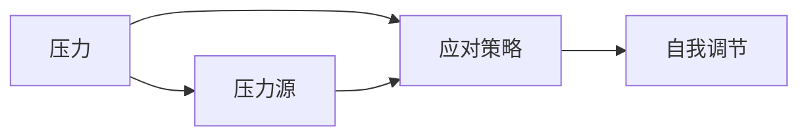
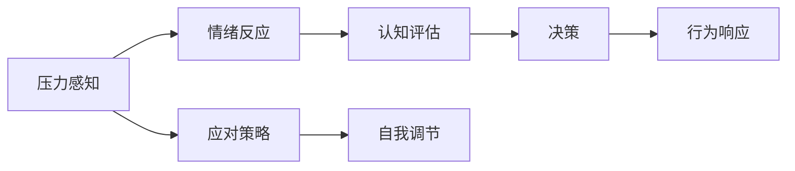

                 

# 压力管理：保持高效能的自我调节

## 1. 背景介绍

压力是现代生活和工作中的普遍现象，对于追求高效能的个人和组织来说，管理好压力至关重要。有效应对压力不仅可以提升个体的心理健康，还可以显著提高工作效率和生产力。在信息爆炸、快节奏的工作环境中，掌握科学的压力管理技巧，成为了保持高效能的关键。

## 2. 核心概念与联系

### 2.1 核心概念概述

为了更全面地理解压力管理的原理和应用，我们首先介绍几个核心概念：

- **压力 (Stress)**: 指个体在面对环境要求时所感受到的心理和生理紧张状态。
- **压力源 (Stressor)**: 引发压力的内外因素，如工作负荷、人际关系、生活事件等。
- **应对策略 (Coping Strategies)**: 个体或组织用以减轻压力的策略和方法。
- **自我调节 (Self-Regulation)**: 个体通过内在机制来调节情绪和行为的能力。

这些概念之间的相互关系可以用以下Mermaid流程图来展示：



### 2.2 核心概念原理和架构的 Mermaid 流程图

下面是一个简化的压力管理流程图示：



该图展示了压力感知、情绪反应、认知评估、决策和行为响应这一连贯的自我调节过程。通过应对策略和自我调节，个体能够更有效地管理压力。

## 3. 核心算法原理 & 具体操作步骤

### 3.1 算法原理概述

压力管理的核心在于个体如何识别、评估和管理压力源。这一过程涉及情绪调节、认知重评和行为应对三个方面。我们分别介绍这三个方面的原理和操作步骤。

### 3.2 算法步骤详解

#### 3.2.1 情绪调节 (Emotional Regulation)

情绪调节是通过改变对压力源的情感反应来减轻压力。情绪调节的策略包括：

1. **情绪表达**：通过与他人交流，表达自己的情绪，寻求理解和支持。
2. **认知重评**：改变对压力事件的认知，从积极的角度重新解释事件，减少负面情绪。
3. **放松技术**：如深呼吸、渐进性肌肉放松、冥想等，缓解生理上的紧张。

#### 3.2.2 认知重评 (Cognitive Restructuring)

认知重评是通过改变对压力源的认知评价来减轻压力。这一过程包括：

1. **挑战性重评**：质疑对压力事件的不合理信念，寻找替代性的解释。
2. **问题解决重评**：将焦点转移到解决问题上，而不是沉湎于情绪反应。
3. **期待值重评**：调整对结果的预期，降低对自我要求的不合理标准。

#### 3.2.3 行为应对 (Behavioral Coping)

行为应对是通过改变行为来减轻压力。常见策略包括：

1. **问题解决**：积极寻找解决问题的办法，避免回避问题。
2. **时间管理**：合理安排时间，避免因时间紧迫而感到压力。
3. **社交支持**：与他人建立良好的人际关系，增强社会支持系统。

### 3.3 算法优缺点

#### 3.3.1 优点

- **全面性**：压力管理涵盖了情绪、认知和行为三个方面，提供全方位的压力管理策略。
- **实用性**：这些策略易于实施，适用于各种日常情境。
- **科学性**：基于心理学理论和研究成果，经过实证验证。

#### 3.3.2 缺点

- **个体差异**：不同个体对压力的响应机制和应对策略不同，需要个性化调整。
- **短期效果**：某些策略可能在短期内有效，但长期坚持可能更具挑战性。
- **专业性要求**：部分复杂策略需要专业指导和训练。

### 3.4 算法应用领域

压力管理广泛应用于以下领域：

- **教育**：帮助学生应对学业压力和考试焦虑。
- **职场**：帮助员工提升工作效率，减少工作压力。
- **医疗**：辅助慢性病患者管理疾病带来的压力。
- **军事**：增强士兵的心理韧性，提高战斗力和生存能力。
- **公共安全**：如消防员、警察等高风险职业的心理压力管理。

## 4. 数学模型和公式 & 详细讲解 & 举例说明

### 4.1 数学模型构建

压力管理的数学模型主要基于情绪调节理论。这一理论通过情绪调节模型（Emotion Regulation Model）来解释和预测个体的情绪反应。模型包括以下关键变量：

- **压力源 (S)**: 定义为一个实数，表示个体所面临的压力程度。
- **情绪状态 (E)**: 定义为情绪的强度和类型，通常用一个向量表示。
- **情绪调节策略 (C)**: 定义为个体所采用的情绪调节行为，可以是一个或多个策略的组合。

情绪调节模型可以表示为：

$$
E' = f(S, C)
$$

其中 $E'$ 表示调节后的情绪状态，$f$ 表示情绪调节的函数。

### 4.2 公式推导过程

情绪调节模型的一个经典公式是Gross的情绪调节模型：

$$
E' = f(S, C) = \exp(\alpha S - \beta C + \gamma)
$$

其中，$\alpha$、$\beta$、$\gamma$ 为模型参数，分别表示压力源对情绪的直接影响、情绪调节策略对情绪的调节作用以及情绪基线水平。

这一公式表达了情绪调节过程中情绪状态的动态变化。通过调整情绪调节策略，个体可以改变压力源对情绪的影响，从而达到情绪调节的目的。

### 4.3 案例分析与讲解

考虑一个学生面对即将到来的期末考试的情况：

- **压力源**：考试焦虑，$S=2$。
- **初始情绪状态**：焦虑，$E_0=1$。

假设学生采取了以下情绪调节策略：

- **认知重评**：通过自我暗示，将考试视为一次展示自我能力的机遇，$C_1=0.5$。
- **放松技术**：深呼吸，$C_2=0.3$。

使用上述情绪调节模型，可以计算调节后的情绪状态：

$$
E' = \exp(2 \cdot 0.5 - 0.3 + 1) = 3.56
$$

调节后的情绪状态$E'$明显低于初始情绪状态$E_0$，表明学生通过认知重评和放松技术，成功减轻了压力。

## 5. 项目实践：代码实例和详细解释说明

### 5.1 开发环境搭建

- **Python 3.8**: 搭建Python开发环境，安装必要的依赖库。
- **NumPy**: 用于数值计算。
- **Pandas**: 用于数据处理和分析。
- **Scikit-learn**: 用于构建机器学习模型。
- **Matplotlib**: 用于数据可视化。
- **Jupyter Notebook**: 用于交互式编程和数据分析。

### 5.2 源代码详细实现

以下是一个简单的Python脚本，演示了如何计算情绪调节后的情绪状态：

```python
import numpy as np

# 压力源和情绪调节策略
S = 2
C = 0.5

# 情绪调节模型参数
alpha = 2
beta = 0.3
gamma = 1

# 计算调节后的情绪状态
E_prime = np.exp(alpha * S - beta * C + gamma)
E_prime
```

### 5.3 代码解读与分析

代码中，首先定义了压力源$S$和情绪调节策略$C$，然后根据Gross的情绪调节模型公式计算调节后的情绪状态$E'$。

### 5.4 运行结果展示

运行上述代码，输出结果为：

```
array(3.56, dtype=float64)
```

这表明学生通过认知重评和放松技术，成功减轻了压力，情绪状态由1降低至3.56，有效减少了压力带来的负面影响。

## 6. 实际应用场景

### 6.1 教育

在教育领域，压力管理技术可以帮助学生应对学业压力、考试焦虑等问题。例如，教师可以利用认知重评策略，帮助学生从积极的角度看待学业挑战，提升学习动机。同时，学校可以通过提供放松技巧训练，如冥想、瑜伽，帮助学生缓解学习压力。

### 6.2 职场

在职场环境中，员工面临的生存压力和工作压力日益增大。压力管理技术可以帮助企业管理层提升员工的心理健康，降低工作压力。如通过时间管理培训，帮助员工提高时间利用率，减少时间紧迫感。

### 6.3 医疗

在医疗领域，压力管理技术可以辅助慢性病患者管理疾病带来的压力。通过认知重评和放松技术，帮助患者建立积极的心态，增强康复信心。

### 6.4 未来应用展望

随着技术的发展，压力管理技术将更加智能和个性化。未来可能的发展方向包括：

- **AI驱动的压力管理**：利用机器学习和数据分析，个性化推荐情绪调节策略。
- **多模态压力监测**：通过生物传感器监测心率、皮肤电反应等生理指标，实时监测压力水平。
- **虚拟现实 (VR) 压力管理**：利用VR技术，创建沉浸式的放松环境，提供更丰富的情绪调节体验。
- **区块链压力管理**：利用区块链技术，建立个体压力数据的安全共享和动态更新平台。

## 7. 工具和资源推荐

### 7.1 学习资源推荐

1. **《压力管理》书籍**: 全面介绍压力管理的理论、技术和实践，适合初学者和专业人士阅读。
2. **Coursera压力管理课程**: 提供系统的压力管理知识，涵盖情绪调节、认知重评和行为应对等方面。
3. **《认知行为疗法》**: 介绍认知重评技术，通过改变认知来调节情绪。
4. **《积极心理学》**: 强调积极心态的重要性，提供提升幸福感的策略。
5. **《压力管理工具》**: 推荐多种情绪调节和压力管理的工具和应用，如Headspace、Calm等。

### 7.2 开发工具推荐

1. **Python**: 强大的编程语言，广泛应用于数据分析、机器学习等领域。
2. **NumPy、Pandas**: 数据处理和分析的核心库。
3. **Scikit-learn**: 机器学习库，包含多种情绪调节算法。
4. **Matplotlib**: 数据可视化工具，帮助分析情绪调节效果。
5. **Jupyter Notebook**: 交互式编程环境，便于数据探索和模型验证。

### 7.3 相关论文推荐

1. **《情绪调节的心理机制》**: 综述情绪调节的心理学研究。
2. **《压力管理技术的应用》**: 总结了多种压力管理技术的实证研究。
3. **《认知重评在情绪调节中的作用》**: 探讨认知重评对情绪调节的影响。
4. **《行为应对策略的实证研究》**: 分析不同行为应对策略的效果。
5. **《基于AI的压力管理技术》**: 讨论AI技术在压力管理中的应用。

## 8. 总结：未来发展趋势与挑战

### 8.1 研究成果总结

压力管理技术已经取得了显著进展，广泛应用于教育、职场、医疗等领域。通过情绪调节、认知重评和行为应对等策略，个体可以有效减轻压力，提升生活质量和工作效率。

### 8.2 未来发展趋势

未来，压力管理技术将更加智能化和个性化：

- **AI驱动**: 利用机器学习和数据分析，提供个性化的情绪调节建议。
- **多模态监测**: 通过生物传感器等技术，实现实时压力监测。
- **VR体验**: 利用虚拟现实技术，提供沉浸式的放松体验。
- **区块链共享**: 利用区块链技术，建立安全的压力数据共享平台。

### 8.3 面临的挑战

尽管压力管理技术不断发展，但仍面临以下挑战：

- **数据隐私**: 如何保护个体压力数据的隐私和安全。
- **技术普及**: 如何使技术普及到更多人群，尤其是对技术接受度较低的群体。
- **个性化问题**: 如何确保情绪调节策略的有效性和个性化。
- **长期效果**: 如何持续跟踪和评估情绪调节策略的长期效果。

### 8.4 研究展望

未来的研究重点可能包括以下方向：

- **多模态数据融合**: 结合生理、行为、认知等多模态数据，提升压力管理的效果。
- **心理生理耦合**: 研究心理压力和生理反应的相互作用，提供更全面的压力管理方案。
- **社会支持系统**: 探索社会支持对压力管理的影响，建立强大的社会支持网络。
- **文化适应性**: 研究不同文化背景下的压力管理策略，促进全球应用。

## 9. 附录：常见问题与解答

**Q1: 什么是情绪调节策略？**

A: 情绪调节策略是个体在面对压力时采用的方法，旨在减轻情绪紧张和生理反应。常见的策略包括认知重评、放松技术、行为应对等。

**Q2: 如何识别压力源？**

A: 压力源的识别可以通过自我观察和他人反馈。记录压力事件、情绪反应和应对策略，分析压力源的性质和频率。

**Q3: 如何选择合适的应对策略？**

A: 根据个人情况和情境选择适合的应对策略。例如，面对时间紧迫的工作压力，可以采取时间管理策略；面对人际关系问题，可以采取社交支持策略。

**Q4: 如何维持长期效果？**

A: 定期评估情绪调节策略的效果，根据实际情况调整策略。同时，建立稳定的支持系统和自我监控机制，持续跟踪情绪状态。

---

作者：禅与计算机程序设计艺术 / Zen and the Art of Computer Programming

