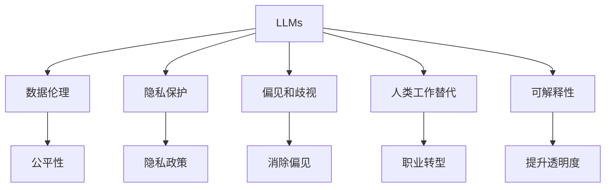

                 

# 后 LLM 时代：对社会的持续影响

## 1. 背景介绍

### 1.1 问题由来
随着大语言模型(Large Language Models, LLMs)的兴起，NLP领域迎来了前所未有的变革。这一模型以自回归(如GPT-3)和自编码(如BERT)架构为基础，通过在无标签文本上预训练数万亿个参数，显著提升了语言理解和生成的能力。LLMs的问世，不仅在学术界引发了广泛关注，也在工业界激起了众多应用场景的探讨，如智能客服、金融舆情监测、个性化推荐等。

然而，大语言模型在带来显著进步的同时，也引发了一系列值得深思的社会和伦理问题。本文将聚焦于LLMs对社会的影响，从数据伦理、隐私保护、偏见和歧视、人类工作替代等方面进行全面探讨，并提出相应的解决方案和展望。

## 2. 核心概念与联系

### 2.1 核心概念概述

为更好地理解LLMs对社会的影响，我们首先需要理解几个关键概念：

- 数据伦理(Data Ethics)：指在数据收集、处理和使用过程中，遵循公平、公正、透明的原则，保护个人隐私，避免偏见和歧视。
- 隐私保护(Privacy Protection)：涉及在数据处理过程中，如何限制和保护个人隐私，防止数据滥用。
- 偏见和歧视(Bias and Discrimination)：指在模型训练和应用中，由于数据偏差或模型设计缺陷导致的不公平输出。
- 人类工作替代(Human Job Displacement)：指LLMs在自动化、智能化等技术发展过程中，可能对部分职业产生替代效应。
- 可解释性(Explainability)：指模型输出的可解释性，即解释模型推理和决策过程的能力，增强模型的透明度和可信度。

这些核心概念在LLMs的应用和影响中占据重要地位，且彼此之间存在复杂的联系。本文将从这些角度出发，分析LLMs对社会的多方面影响，并探讨相应的应对策略。

### 2.2 核心概念原理和架构的 Mermaid 流程图



这个流程图展示了LLMs与核心概念之间的联系：

- 数据伦理包含公平性和隐私保护两方面。
- 偏见和歧视需要从消除偏见和透明决策两个方向加以处理。
- 人类工作替代关注职业转型和就业保障。
- 可解释性旨在提升模型的透明度和可信度。

## 3. 核心算法原理 & 具体操作步骤

### 3.1 算法原理概述

LLMs通过在无标签数据上进行自监督预训练，学习到泛化的语言表征。随后，在特定任务的数据上进行微调，使其能够执行特定任务，如分类、生成、匹配等。这一过程依赖于大量的标注数据和高效的优化算法，如梯度下降和AdamW等。

### 3.2 算法步骤详解

LLMs的训练和应用大致包括以下步骤：

1. **预训练**：在无标签文本数据上进行自监督训练，学习泛化的语言表征。这一过程通常需要大规模计算资源，并在大型数据集上进行。
2. **微调**：在特定任务的数据集上进行有监督训练，优化模型以执行特定任务。微调过程依赖于标注数据、优化算法和正则化技术，以避免过拟合。
3. **部署**：将微调后的模型部署到实际应用中，进行推理和预测。需要考虑模型的可解释性、鲁棒性和效率等特性。

### 3.3 算法优缺点

**优点**：
- 大幅提升语言理解和生成的能力。
- 适用于多种NLP任务，模型效果显著。
- 通过微调可适应特定应用场景，具有较强的泛化能力。

**缺点**：
- 预训练和微调过程依赖大量标注数据，数据获取成本高。
- 存在偏见和歧视的风险，模型输出可能反映训练数据的偏见。
- 推理过程复杂，模型可解释性不足。
- 资源消耗巨大，对计算资源和能源消耗要求较高。

### 3.4 算法应用领域

LLMs在多个领域中得到了广泛应用，包括但不限于：

- 智能客服：通过微调对话模型，实现自动问答和客户服务。
- 金融舆情监测：利用情感分析技术，实时监测市场舆情。
- 个性化推荐：通过微调推荐模型，提供个性化商品和服务推荐。
- 智能助手：通过微调通用语言模型，实现多种语言翻译、文本生成和知识检索等功能。
- 健康医疗：利用语言模型，进行医学文献检索、患者问答和疾病预测等。

## 4. 数学模型和公式 & 详细讲解 & 举例说明

### 4.1 数学模型构建

LLMs的数学模型主要基于Transformer架构，包括自回归模型(如GPT)和自编码模型(如BERT)。以GPT为例，其数学模型可以表示为：

$$
p(y|x) = \frac{\exp(\log \left[\text{Softmax}(\text{MLP}(\text{Self-Attention}(\text{Encoder}(\text{Encoder}(\text{x}))\right])}{\sum_{y' \in \mathcal{Y}} \exp(\log \left[\text{Softmax}(\text{MLP}(\text{Self-Attention}(\text{Encoder}(\text{Encoder}(\text{x}))\right])}
$$

其中，$x$ 表示输入文本，$y$ 表示输出文本，$\mathcal{Y}$ 表示可能的输出文本集合。模型首先通过自注意力机制捕捉输入文本的语义信息，再通过多层感知器(MLP)和全连接层对信息进行编码，最后通过Softmax层将编码后的向量转换为输出文本的概率分布。

### 4.2 公式推导过程

假设输入文本为$x = (x_1, x_2, ..., x_n)$，输出文本为$y = (y_1, y_2, ..., y_n)$，LLMs的预测概率可以通过下式计算：

$$
p(y|x) = \prod_{i=1}^n p(y_i|x_1, x_2, ..., x_i)
$$

其中，$p(y_i|x_1, x_2, ..., x_i)$ 表示在第 $i$ 步的预测概率，依赖于之前所有文本的上下文信息。

### 4.3 案例分析与讲解

以GPT-3为例，其通过在无标签数据上进行预训练，学习到大量的语言知识。例如，在预训练过程中，模型学习到单词、短语和句子间的语义关系，从而能够对新文本进行自然语言生成。在微调过程中，通过输入文本和标签数据，模型可以学习到特定任务的语言规则和语言结构，如问答、翻译和摘要等。

## 5. 项目实践：代码实例和详细解释说明

### 5.1 开发环境搭建

开发LLMs相关应用，需要搭建如下环境：

1. **安装Python和必要的库**：
   ```bash
   conda create -n llm_env python=3.8
   conda activate llm_env
   pip install transformers tensorflow torch scipy pytorch-lightning
   ```

2. **下载预训练模型**：
   ```bash
   git clone https://github.com/openai/llama-project.git
   cd llama-project
   python fetch_data.py
   ```

3. **安装工具和库**：
   ```bash
   pip install datasets datasets-llama datasets-pytorch-lightning
   ```

### 5.2 源代码详细实现

以下是一个简单的LLMs微调示例，以翻译任务为例：

```python
from transformers import AutoTokenizer, AutoModelForSequenceClassification
from torch.utils.data import Dataset, DataLoader
import torch
from sklearn.metrics import accuracy_score, precision_score, recall_score, f1_score

class TranslationDataset(Dataset):
    def __init__(self, texts, targets):
        self.tokenizer = AutoTokenizer.from_pretrained('gpt3')
        self.texts = texts
        self.targets = targets

    def __len__(self):
        return len(self.texts)

    def __getitem__(self, idx):
        text = self.texts[idx]
        target = self.targets[idx]
        encoding = self.tokenizer(text, return_tensors='pt')
        return {
            'input_ids': encoding['input_ids'],
            'attention_mask': encoding['attention_mask'],
            'targets': torch.tensor(target, dtype=torch.long)
        }

# 加载数据集
train_dataset = TranslationDataset(train_texts, train_targets)
test_dataset = TranslationDataset(test_texts, test_targets)

# 定义模型和优化器
model = AutoModelForSequenceClassification.from_pretrained('gpt3', num_labels=num_labels)
optimizer = AdamW(model.parameters(), lr=2e-5)

# 训练过程
device = torch.device('cuda') if torch.cuda.is_available() else torch.device('cpu')
model.to(device)
model.train()

def train_epoch(model, dataset, batch_size, optimizer):
    dataloader = DataLoader(dataset, batch_size=batch_size, shuffle=True)
    epoch_loss = 0
    for batch in dataloader:
        input_ids = batch['input_ids'].to(device)
        attention_mask = batch['attention_mask'].to(device)
        targets = batch['targets'].to(device)
        model.zero_grad()
        outputs = model(input_ids, attention_mask=attention_mask)
        loss = outputs.loss
        epoch_loss += loss.item()
        loss.backward()
        optimizer.step()
    return epoch_loss / len(dataloader)

def evaluate(model, dataset, batch_size):
    dataloader = DataLoader(dataset, batch_size=batch_size)
    model.eval()
    preds, labels = [], []
    with torch.no_grad():
        for batch in dataloader:
            input_ids = batch['input_ids'].to(device)
            attention_mask = batch['attention_mask'].to(device)
            targets = batch['targets']
            outputs = model(input_ids, attention_mask=attention_mask)
            batch_preds = outputs.logits.argmax(dim=2).to('cpu').tolist()
            batch_labels = targets.to('cpu').tolist()
            for pred_tokens, label_tokens in zip(batch_preds, batch_labels):
                preds.append(pred_tokens[:len(label_tokens)])
                labels.append(label_tokens)
    
    print('Accuracy: {:.2f}%, Precision: {:.2f}%, Recall: {:.2f}%, F1-score: {:.2f}%'.format(
        accuracy_score(labels, preds), 
        precision_score(labels, preds, average='macro'),
        recall_score(labels, preds, average='macro'),
        f1_score(labels, preds, average='macro')))
```

### 5.3 代码解读与分析

代码中，我们使用了HuggingFace的`AutoTokenizer`和`AutoModelForSequenceClassification`，分别对预训练模型进行加载和微调。其中，`AutoTokenizer`负责处理文本数据，`AutoModelForSequenceClassification`则用于执行翻译任务。

在训练过程中，我们使用了AdamW优化器，并设置了适当的学习率。通过`train_epoch`函数，我们实现了模型的迭代训练，并计算了每个epoch的平均损失。在评估过程中，我们使用`evaluate`函数对模型进行了精度、召回率和F1-score等指标的计算和打印。

## 6. 实际应用场景

### 6.1 智能客服系统

LLMs在智能客服系统中得到广泛应用。通过微调，LLMs可以理解用户问题并提供合适的答案，从而大大提升客服效率和用户满意度。例如，阿里巴巴的阿里云智能客服系统，就基于大语言模型进行微调，支持多语言对话和复杂问题的解答。

### 6.2 金融舆情监测

金融行业需要实时监测市场舆情，以快速响应市场变化。LLMs在情感分析和主题分类等任务上的表现，使得其成为金融舆情监测的理想工具。例如，Natixis公司使用GPT-3对社交媒体上的金融新闻进行情感分析，提前发现市场情绪变化，进行风险预警。

### 6.3 个性化推荐系统

个性化推荐系统是LLMs的重要应用之一。通过微调，LLMs可以理解用户偏好并推荐合适的商品和服务。亚马逊、Netflix等平台均已采用LLMs进行个性化推荐，提升用户体验和运营效率。

### 6.4 未来应用展望

LLMs的未来发展将涵盖以下几个方面：

1. **多模态学习**：将视觉、语音和文本等多模态数据融合，提升对复杂场景的理解能力。
2. **跨领域泛化**：将LLMs应用于更多垂直领域，如医疗、法律、教育等。
3. **边缘计算**：将LLMs部署到边缘计算设备，实现低延迟和高效率的应用。
4. **联邦学习**：通过分布式学习和本地模型训练，保护数据隐私和安全。
5. **动态微调**：在应用过程中，动态调整模型参数以适应数据变化。

## 7. 工具和资源推荐

### 7.1 学习资源推荐

- **《深度学习》课程**：斯坦福大学深度学习课程，涵盖深度学习基础知识和前沿技术。
- **《自然语言处理》书籍**：施虐希勒的《自然语言处理综述》，系统介绍了NLP的基本概念和经典算法。
- **《LLMs导论》博客**：AI大匠的博客，介绍了LLMs的原理和应用，涵盖预训练、微调和应用场景。
- **《LLMs实战》教程**：HuggingFace提供的官方教程，涵盖模型加载、微调和推理等全流程。
- **LLMs社区**：GitHub上的LLMs社区，汇聚了大量的LLMs相关项目和代码。

### 7.2 开发工具推荐

- **PyTorch**：深度学习框架，支持动态图和静态图模式，适用于模型研究和部署。
- **TensorFlow**：Google开发的深度学习框架，支持分布式计算和自动微分。
- **Transformers**：HuggingFace提供的NLP工具库，涵盖多种预训练模型和微调范式。
- **Jupyter Notebook**：交互式编程环境，便于数据处理和模型训练。
- **TensorBoard**：TensorFlow配套的可视化工具，监测模型训练状态和结果。

### 7.3 相关论文推荐

- **《深度学习》书籍**：Ian Goodfellow等人著，详细介绍了深度学习的基本理论和算法。
- **《LLMs：原理与实践》论文**：彭磊等人发表的论文，深入探讨了LLMs的原理和微调方法。
- **《多模态学习》论文**：Regina Barald等人发表的论文，研究了多模态学习的基本框架和算法。
- **《跨领域泛化》论文**：Daniela Bobadilla等人发表的论文，探讨了跨领域泛化的方法和应用。

## 8. 总结：未来发展趋势与挑战

### 8.1 研究成果总结

LLMs的兴起，推动了NLP领域的快速发展，但也引发了一系列数据伦理、隐私保护、偏见和歧视、人类工作替代等社会问题。本文从这些角度出发，系统梳理了LLMs的社会影响，并提出了相应的解决方案和展望。

### 8.2 未来发展趋势

1. **技术进步**：LLMs将在更多领域得到应用，推动AI技术的普及和发展。
2. **伦理规范**：LLMs的应用将遵循更加严格的数据伦理和隐私保护规范。
3. **社会挑战**：LLMs将面临更多的社会挑战，需要不断创新和优化。
4. **多模态融合**：LLMs将融合多模态数据，提升对复杂场景的理解能力。
5. **跨领域应用**：LLMs将在更多领域得到应用，推动AI技术的普及和发展。

### 8.3 面临的挑战

1. **数据伦理**：如何在保证数据隐私和公平性的前提下，充分利用LLMs的优势。
2. **偏见和歧视**：如何避免LLMs在应用过程中引入偏见和歧视。
3. **隐私保护**：如何在保护隐私的前提下，实现LLMs的广泛应用。
4. **人类工作替代**：如何在LLMs替代部分职业的同时，提供新的就业机会。
5. **可解释性**：如何增强LLMs的可解释性，提升其可信度和透明度。

### 8.4 研究展望

未来，LLMs将进一步拓展应用领域，推动AI技术的普及和发展。同时，我们需要在数据伦理、隐私保护、偏见和歧视等方面进行深入研究，确保LLMs的安全和可靠。通过技术创新和社会规范的双重努力，LLMs必将在更广泛的应用场景中发挥重要作用，推动社会的持续进步。

## 9. 附录：常见问题与解答

**Q1：如何确保LLMs的数据隐私和公平性？**

A: 通过匿名化处理和差分隐私技术，保护用户隐私。同时，在模型训练和微调过程中，引入公平性约束，避免模型输出中的偏见和歧视。

**Q2：LLMs的偏见和歧视问题如何解决？**

A: 通过数据清洗和预处理，去除训练数据中的偏见。在模型训练过程中，引入公平性约束，确保模型输出公平。

**Q3：LLMs对人类工作的影响如何？**

A: 需要在保障隐私和公平的前提下，合理使用LLMs，避免对特定职业产生替代效应。同时，提供职业培训和转型支持，帮助受影响工作者适应新工作。

**Q4：LLMs的可解释性如何提升？**

A: 引入可解释性技术，如注意力机制、决策树等，帮助理解模型的推理过程。同时，通过模型压缩和知识图谱融合，提高模型的透明度和可信度。

**Q5：LLMs如何融合多模态数据？**

A: 通过多模态融合技术，将视觉、语音和文本等数据进行联合处理，提升模型对复杂场景的理解能力。例如，在翻译任务中，可以结合图像描述和文本数据进行联合训练。

本文从多个角度全面分析了LLMs对社会的影响，并提出了相应的解决方案和展望。未来，随着LLMs技术的不断进步和应用的深入，其在社会中的作用将更加显著。只有通过持续的技术创新和社会规范的双重努力，才能确保LLMs的安全和可靠，推动社会的持续进步。

---

作者：禅与计算机程序设计艺术 / Zen and the Art of Computer Programming

