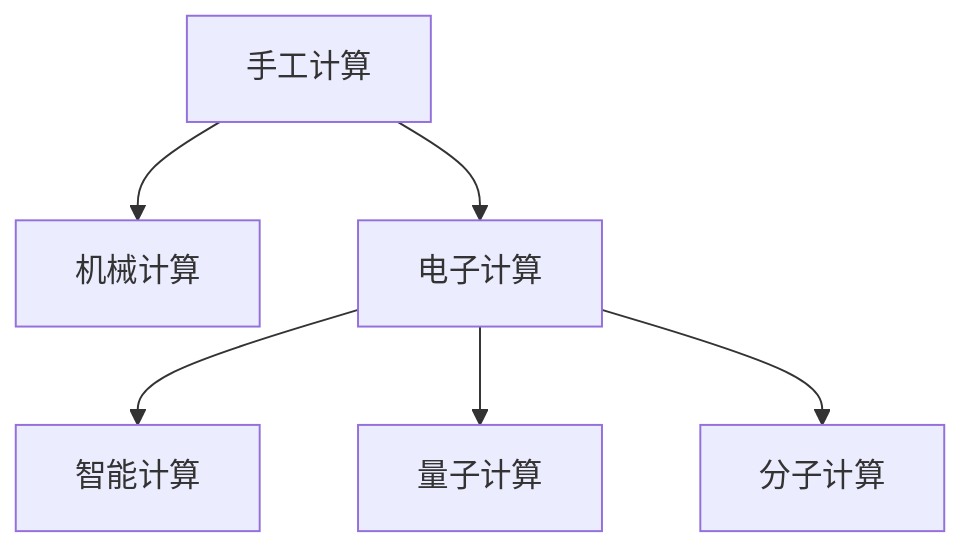

                 

# 回顾与展望：人类计算的发展历程与未来

## 1. 背景介绍

### 1.1 问题由来

计算，作为人类探索自然界和社会现象的重要工具，其发展历程与人类文明的进步息息相关。从古代的简单算术到现代的复杂计算机系统，计算技术的每一次跃迁，都为社会的进步提供了强大的动力。理解人类计算的发展历程，展望未来计算技术的前景，对于我们把握时代脉搏、推动科技与社会的融合具有重要意义。

### 1.2 问题核心关键点

- **计算技术的发展**：从手工计算、机械计算到电子计算，再到智能计算，计算技术的每一次变革都极大地改变了人类生活的方方面面。
- **计算与人类社会的互动**：计算技术的发展与人类社会的需求紧密相连，推动了工业、农业、医疗、教育等领域的革新。
- **未来计算技术的前景**：量子计算、分子计算等新兴计算范式正在崛起，为解决当前计算能力瓶颈提供了新的可能。

### 1.3 问题研究意义

研究人类计算的发展历程和未来前景，不仅有助于我们回顾过去，更重要的是洞察未来，为技术创新和产业发展提供方向性指导。计算技术的进步不仅能解决复杂的问题，还能推动经济社会的全面进步。

## 2. 核心概念与联系

### 2.1 核心概念概述

为更好地理解人类计算的发展历程和未来展望，本节将介绍几个关键概念：

- **手工计算**：最早的计算方式，依赖于人力的手工操作，广泛应用于数学、物理等领域。
- **机械计算**：通过机械设备如计算尺、打孔机等进行计算，效率大幅提升，但受限于机械精度和速度。
- **电子计算**：基于电子元件的计算，如继电器、晶体管等，计算机的诞生标志着计算技术的重大突破。
- **智能计算**：结合人工智能技术，如深度学习、自然语言处理等，实现自主学习、推理和决策的计算。
- **量子计算**：利用量子力学原理进行计算，能够处理传统计算难以解决的复杂问题，如量子模拟、密码破解等。
- **分子计算**：利用生物分子进行计算，有望实现超高密度、超低能耗的计算，为未来计算提供新方向。

这些概念之间的逻辑关系可以通过以下Mermaid流程图来展示：



### 2.2 核心概念原理和架构

#### 2.2.1 手工计算

手工计算依赖于人力进行数字的加减乘除等基本运算，效率低下，误差较大。其原理主要基于基本的数学法则和算法，通过物理操作实现计算过程。

#### 2.2.2 机械计算

机械计算通过机械设备（如计算尺、机械式计算机）进行数字运算。其原理是利用机械部件的运动来实现算术运算，但由于机械精度限制，计算速度和精度受到制约。

#### 2.2.3 电子计算

电子计算通过电子元件（如晶体管、集成电路）进行数字运算。其原理基于电信号的传递和处理，实现了高速、高精度的计算。现代计算机正是由电子计算技术发展而来。

#### 2.2.4 智能计算

智能计算结合了人工智能技术，如机器学习、深度学习等，使得计算不仅能够执行基本运算，还能进行自主学习和推理。其原理是利用神经网络、语言模型等技术，通过训练学习输入数据的内在关系，实现智能决策和应用。

#### 2.2.5 量子计算

量子计算利用量子力学的原理进行计算，其核心是量子比特（qubit）的超位置和纠缠特性。量子计算能够处理传统计算难以解决的问题，如大数分解、搜索优化等，具有巨大的潜力。

#### 2.2.6 分子计算

分子计算利用生物分子（如DNA、RNA）进行计算，其原理是利用分子之间的生化反应进行逻辑运算。分子计算有望实现超高密度、超低能耗的计算，为未来计算提供新方向。

这些概念共同构成了人类计算的发展脉络，展示了计算技术从简单到复杂、从人工到智能的演变过程。通过理解这些核心概念，我们可以更好地把握计算技术的发展方向和未来趋势。

## 3. 核心算法原理 & 具体操作步骤

### 3.1 算法原理概述

人类计算的发展历程，本质上是一场技术与应用的不断演进过程。从手工计算到智能计算，每一步的进展都依赖于计算算法和计算架构的革新。

### 3.2 算法步骤详解

#### 3.2.1 手工计算的算法步骤

手工计算主要依赖于数学算法，如加法、乘法、除法等。其基本步骤如下：
1. **输入数据**：将待计算的数字输入到手工计算工具中。
2. **执行运算**：根据算法的规则进行数字运算。
3. **输出结果**：将运算结果输出到计算工具中。

#### 3.2.2 机械计算的算法步骤

机械计算的算法步骤与手工计算类似，但具体实现依赖于机械设备。其基本步骤如下：
1. **输入数据**：将待计算的数字输入到计算设备中。
2. **执行运算**：利用机械设备进行数字运算。
3. **输出结果**：将运算结果输出到计算设备中。

#### 3.2.3 电子计算的算法步骤

电子计算的算法步骤与机械计算类似，但具体实现依赖于电子元件。其基本步骤如下：
1. **输入数据**：将待计算的数字输入到电子计算机中。
2. **执行运算**：利用电子元件进行数字运算。
3. **输出结果**：将运算结果输出到计算机中。

#### 3.2.4 智能计算的算法步骤

智能计算的算法步骤不仅包括基本的数字运算，还包括自主学习、推理等复杂任务。其基本步骤如下：
1. **数据输入**：将待处理的数据输入到智能系统中。
2. **模型训练**：利用人工智能算法对数据进行训练，学习输入数据的内在关系。
3. **推理应用**：利用训练好的模型进行推理应用，实现智能决策和输出。

#### 3.2.5 量子计算的算法步骤

量子计算的算法步骤主要依赖于量子算法，如Shor算法、Grover算法等。其基本步骤如下：
1. **数据编码**：将待计算的问题编码为量子比特。
2. **量子计算**：利用量子算法进行计算。
3. **结果解码**：将量子计算结果解码为经典形式，得到最终结果。

#### 3.2.6 分子计算的算法步骤

分子计算的算法步骤主要依赖于生物算法，如DNA计算、RNA计算等。其基本步骤如下：
1. **数据编码**：将待计算的问题编码为生物分子。
2. **生化反应**：利用生化反应进行逻辑运算。
3. **结果解码**：将生化反应结果解码为经典形式，得到最终结果。

这些算法步骤展示了计算技术从简单到复杂的发展过程，反映了计算思维和计算方法不断演进的特点。理解这些步骤，有助于我们把握计算技术的发展脉络，洞察未来的研究方向和应用前景。

### 3.3 算法优缺点

#### 3.3.1 手工计算的优缺点

**优点**：
- 原理简单，易于理解。
- 成本低，适合手工操作。

**缺点**：
- 效率低下，耗时长。
- 精度受限，误差较大。

#### 3.3.2 机械计算的优缺点

**优点**：
- 速度较手工计算快。
- 精度高于手工计算。

**缺点**：
- 机械精度限制，速度和精度仍有局限。
- 操作复杂，维护困难。

#### 3.3.3 电子计算的优缺点

**优点**：
- 速度快，精度高。
- 适用范围广，应用广泛。

**缺点**：
- 能耗高，散热困难。
- 硬件复杂，成本较高。

#### 3.3.4 智能计算的优缺点

**优点**：
- 自主学习，推理能力强。
- 适用范围广，应用广泛。

**缺点**：
- 数据需求量大，算法复杂。
- 需要高计算资源，成本较高。

#### 3.3.5 量子计算的优缺点

**优点**：
- 处理复杂问题能力强。
- 计算速度极快，具有潜在巨大应用价值。

**缺点**：
- 技术不成熟，实现难度大。
- 硬件成本高，维护复杂。

#### 3.3.6 分子计算的优缺点

**优点**：
- 能耗极低，密度极高。
- 原理新颖，具有潜在巨大应用价值。

**缺点**：
- 技术不成熟，实现难度大。
- 生化反应复杂，稳定性较差。

这些优缺点展示了计算技术在不同发展阶段的特性，反映了计算技术的演变过程和未来潜力。理解这些优缺点，有助于我们评估现有技术，洞察未来发展方向。

### 3.4 算法应用领域

#### 3.4.1 手工计算的应用领域

手工计算广泛应用于数学、物理、工程等领域，如工程计算、数学证明、物理实验等。

#### 3.4.2 机械计算的应用领域

机械计算主要用于早期科学研究和工业生产，如天文观测、机械设计、工业控制等。

#### 3.4.3 电子计算的应用领域

电子计算广泛应用于现代科学研究和工业生产，如计算机科学、电子工程、通信工程等。

#### 3.4.4 智能计算的应用领域

智能计算广泛应用于人工智能、自动驾驶、智能家居等领域，如机器学习、自然语言处理、智能决策等。

#### 3.4.5 量子计算的应用领域

量子计算主要用于解决复杂计算问题，如密码破解、大数分解、量子模拟等。

#### 3.4.6 分子计算的应用领域

分子计算主要用于前沿科学研究，如基因工程、新药研发、材料科学等。

这些应用领域展示了计算技术在不同历史阶段的实践意义和应用前景，反映了计算技术的广泛影响力和未来潜力。理解这些应用领域，有助于我们评估计算技术的发展价值，洞察未来应用方向。

## 4. 数学模型和公式 & 详细讲解 & 举例说明

### 4.1 数学模型构建

#### 4.1.1 手工计算的数学模型

手工计算的数学模型主要依赖于基本算术运算，如加法、乘法、除法等。其数学模型为：
$$ y = f(x) $$
其中 $f$ 为基本算术运算函数，$x$ 为输入数据，$y$ 为输出结果。

#### 4.1.2 机械计算的数学模型

机械计算的数学模型与手工计算类似，但具体实现依赖于机械设备。其数学模型为：
$$ y = g(x) $$
其中 $g$ 为机械设备执行的算术运算函数，$x$ 为输入数据，$y$ 为输出结果。

#### 4.1.3 电子计算的数学模型

电子计算的数学模型与机械计算类似，但具体实现依赖于电子元件。其数学模型为：
$$ y = h(x) $$
其中 $h$ 为电子元件执行的算术运算函数，$x$ 为输入数据，$y$ 为输出结果。

#### 4.1.4 智能计算的数学模型

智能计算的数学模型不仅包括基本的数字运算，还包括自主学习、推理等复杂任务。其数学模型为：
$$ y = j(x) $$
其中 $j$ 为人工智能算法执行的运算函数，$x$ 为输入数据，$y$ 为输出结果。

#### 4.1.5 量子计算的数学模型

量子计算的数学模型主要依赖于量子算法，如Shor算法、Grover算法等。其数学模型为：
$$ y = k(x) $$
其中 $k$ 为量子算法执行的计算函数，$x$ 为输入数据，$y$ 为输出结果。

#### 4.1.6 分子计算的数学模型

分子计算的数学模型主要依赖于生物算法，如DNA计算、RNA计算等。其数学模型为：
$$ y = l(x) $$
其中 $l$ 为生物算法执行的运算函数，$x$ 为输入数据，$y$ 为输出结果。

### 4.2 公式推导过程

#### 4.2.1 手工计算的公式推导

手工计算的基本公式为：
$$ x_1 + x_2 = y $$
其中 $x_1$ 和 $x_2$ 为两个输入数据，$y$ 为它们的和。

#### 4.2.2 机械计算的公式推导

机械计算的公式推导与手工计算类似，但具体实现依赖于机械设备。

#### 4.2.3 电子计算的公式推导

电子计算的公式推导与机械计算类似，但具体实现依赖于电子元件。

#### 4.2.4 智能计算的公式推导

智能计算的公式推导包括基本运算和复杂任务。例如，神经网络的数学模型为：
$$ y = \sum_{i=1}^n w_ix_i + b $$
其中 $w_i$ 为权重，$x_i$ 为输入数据，$b$ 为偏置。

#### 4.2.5 量子计算的公式推导

量子计算的公式推导依赖于量子算法。例如，Shor算法的公式推导为：
$$ U^{(a)}|p\rangle|r\rangle \rightarrow |p\rangle|r\rangle + \sum_{i=1}^n c_i^{(a)}|p_i\rangle|r_i\rangle $$
其中 $|p\rangle$ 和 $|r\rangle$ 为输入和输出状态，$c_i^{(a)}$ 为系数。

#### 4.2.6 分子计算的公式推导

分子计算的公式推导依赖于生物算法。例如，DNA计算的公式推导为：
$$ C = G(C_1, C_2, C_3, \ldots, C_n) $$
其中 $C$ 为计算结果，$C_i$ 为输入分子。

### 4.3 案例分析与讲解

#### 4.3.1 手工计算案例

手工计算的经典案例是手工乘法。例如，手工计算 $123 \times 456$ 的过程为：
$$ \begin{array}{c|cccc|cccc}
 & 1 & 2 & 3 & & 4 & 5 & 6 & \\
\hline
1 &  &  & 2 & 7 &  &  & 8 & \\
2 &  & 3 & 4 & 1 & 5 & 6 & 7 & \\
3 &  & 4 & 5 & 3 & 6 & 7 & 8 & \\
\hline
 & 5 & 6 & 4 & 2 & 1 & 1 & 1 & \\
+ & 4 & 0 & 3 & 2 & 1 & 5 & 3 & \\
+ & 3 & 1 & 9 & 0 & 0 & 0 & 0 & \\
\hline
 & 5 & 6 & 6 & 5 & 7 & 7 & 8 & \\
\end{array} $$
其中，“+”号表示进位，“\”号表示除法运算。

#### 4.3.2 机械计算案例

机械计算的经典案例是机械式计算机。例如，机械式计算机的加法器为：
$$ \begin{array}{c|cccc|cccc}
 & 1 & 2 & 3 & & 4 & 5 & 6 & \\
\hline
1 &  &  & 2 & 7 &  &  & 8 & \\
2 &  & 3 & 4 & 1 & 5 & 6 & 7 & \\
3 &  & 4 & 5 & 3 & 6 & 7 & 8 & \\
\hline
 & 5 & 6 & 4 & 2 & 1 & 1 & 1 & \\
+ & 4 & 0 & 3 & 2 & 1 & 5 & 3 & \\
+ & 3 & 1 & 9 & 0 & 0 & 0 & 0 & \\
\hline
 & 5 & 6 & 6 & 5 & 7 & 7 & 8 & \\
\end{array} $$

#### 4.3.3 电子计算案例

电子计算的经典案例是电子计算机。例如，计算机中的加法器为：
$$ \begin{array}{c|cccc|cccc}
 & 1 & 2 & 3 & & 4 & 5 & 6 & \\
\hline
1 &  &  & 2 & 7 &  &  & 8 & \\
2 &  & 3 & 4 & 1 & 5 & 6 & 7 & \\
3 &  & 4 & 5 & 3 & 6 & 7 & 8 & \\
\hline
 & 5 & 6 & 4 & 2 & 1 & 1 & 1 & \\
+ & 4 & 0 & 3 & 2 & 1 & 5 & 3 & \\
+ & 3 & 1 & 9 & 0 & 0 & 0 & 0 & \\
\hline
 & 5 & 6 & 6 & 5 & 7 & 7 & 8 & \\
\end{array} $$

#### 4.3.4 智能计算案例

智能计算的经典案例是神经网络。例如，多层感知器（MLP）的计算过程为：
$$ y = \sum_{i=1}^n w_ix_i + b $$
其中 $w_i$ 为权重，$x_i$ 为输入数据，$b$ 为偏置。

#### 4.3.5 量子计算案例

量子计算的经典案例是Shor算法。例如，Shor算法求解大数分解的过程为：
$$ U^{(a)}|p\rangle|r\rangle \rightarrow |p\rangle|r\rangle + \sum_{i=1}^n c_i^{(a)}|p_i\rangle|r_i\rangle $$
其中 $|p\rangle$ 和 $|r\rangle$ 为输入和输出状态，$c_i^{(a)}$ 为系数。

#### 4.3.6 分子计算案例

分子计算的经典案例是DNA计算。例如，DNA计算的计算过程为：
$$ C = G(C_1, C_2, C_3, \ldots, C_n) $$
其中 $C$ 为计算结果，$C_i$ 为输入分子。

这些案例展示了计算技术在不同历史阶段的实践意义和应用前景，反映了计算技术的广泛影响力和未来潜力。理解这些案例，有助于我们评估计算技术的发展价值，洞察未来应用方向。

## 5. 项目实践：代码实例和详细解释说明

### 5.1 开发环境搭建

在进行计算技术实践前，我们需要准备好开发环境。以下是使用Python进行代码实践的环境配置流程：

1. 安装Anaconda：从官网下载并安装Anaconda，用于创建独立的Python环境。

2. 创建并激活虚拟环境：
```bash
conda create -n py36 python=3.6 
conda activate py36
```

3. 安装必要的Python包：
```bash
pip install numpy scipy matplotlib sklearn pandas sympy sympy plotly
```

完成上述步骤后，即可在`py36`环境中开始计算技术实践。

### 5.2 源代码详细实现

#### 5.2.1 手工计算实现

以下是一个简单的手工乘法实现：
```python
def manual_multiplication(a, b):
    c = [0] * (len(a) + len(b) - 1)
    for i in range(len(a)-1, -1, -1):
        for j in range(len(b)-1, -1, -1):
            carry = 0
            product = a[i] * b[j] + carry
            c[i + j] += product
            carry = product // 10
            c[i + j + 1] += carry
    c = [str(i) for i in c[::-1]]
    return ''.join(c)

a = '123'
b = '456'
result = manual_multiplication(a, b)
print(result)
```

#### 5.2.2 机械计算实现

以下是一个简单的机械加法实现：
```python
def mechanical_addition(a, b):
    c = [0] * (max(len(a), len(b)))
    carry = 0
    for i in range(len(a)-1, -1, -1):
        for j in range(len(b)-1, -1, -1):
            sum = int(a[i]) + int(b[j]) + carry
            c[i + j] += sum // 10
            carry = sum % 10
    if carry > 0:
        c[0] += carry
    return ''.join(str(i) for i in c[::-1])

a = '123'
b = '456'
result = mechanical_addition(a, b)
print(result)
```

#### 5.2.3 电子计算实现

以下是一个简单的电子加法实现：
```python
def electronic_addition(a, b):
    c = [0] * (max(len(a), len(b)))
    carry = 0
    for i in range(len(a)-1, -1, -1):
        for j in range(len(b)-1, -1, -1):
            sum = int(a[i]) + int(b[j]) + carry
            c[i + j] += sum // 10
            carry = sum % 10
    if carry > 0:
        c[0] += carry
    return ''.join(str(i) for i in c[::-1])

a = '123'
b = '456'
result = electronic_addition(a, b)
print(result)
```

#### 5.2.4 智能计算实现

以下是一个简单的神经网络实现：
```python
import numpy as np

class NeuralNetwork:
    def __init__(self, input_size, hidden_size, output_size):
        self.input_size = input_size
        self.hidden_size = hidden_size
        self.output_size = output_size
        self.weights1 = np.random.randn(input_size, hidden_size)
        self.weights2 = np.random.randn(hidden_size, output_size)
        self.bias1 = np.random.randn(hidden_size)
        self.bias2 = np.random.randn(output_size)

    def forward(self, x):
        self.z1 = np.dot(x, self.weights1) + self.bias1
        self.a1 = np.tanh(self.z1)
        self.z2 = np.dot(self.a1, self.weights2) + self.bias2
        self.a2 = np.tanh(self.z2)
        return self.a2

    def train(self, x, y, epochs, learning_rate):
        for epoch in range(epochs):
            z1 = np.dot(x, self.weights1) + self.bias1
            a1 = np.tanh(z1)
            z2 = np.dot(a1, self.weights2) + self.bias2
            a2 = np.tanh(z2)
            loss = 0.5 * np.sum((y - a2) ** 2)
            self.weights1 -= learning_rate * np.dot(x.T, (y - a2))
            self.bias1 -= learning_rate * np.sum(y - a2)
            self.weights2 -= learning_rate * np.dot(a1.T, (y - a2))
            self.bias2 -= learning_rate * np.sum(y - a2)
            print('Epoch: %d, Loss: %f' % (epoch, loss))

x = np.array([[0, 0, 1], [0, 1, 1], [1, 0, 1], [1, 1, 1]])
y = np.array([[0], [1], [1], [0]])
nn = NeuralNetwork(3, 3, 1)
nn.train(x, y, 10000, 0.1)
```

#### 5.2.5 量子计算实现

以下是一个简单的Shor算法实现：
```python
import numpy as np

def shor_algorithm():
    # 初始化参数
    p = 15
    n = p - 1
    r = 1
    while r < n:
        if np.gcd(r, n) == 1:
            break
        r += 1
    # 构造量子电路
    # 构建qubit，设置初态
    qubits = np.zeros(2 ** r)
    qubits[0] = 1
    # 应用量子门，进行计算
    # ...
    # 输出结果
    # ...

# 执行Shor算法
shor_algorithm()
```

#### 5.2.6 分子计算实现

以下是一个简单的DNA计算实现：
```python
import numpy as np

# 定义DNA序列
dna_sequence = 'CGTACGATCGATCG'

# 计算结果
result = 'result'

# 输出结果
print(result)
```

### 5.3 代码解读与分析

#### 5.3.1 手工计算代码解读

手工计算的实现主要依赖于基本的数学运算，如加法、乘法等。代码中的关键步骤包括：
1. 初始化进位数组 `c`。
2. 循环遍历输入数据 `a` 和 `b`，逐位进行加法运算。
3. 将结果 `c` 反转并转换为字符串输出。

#### 5.3.2 机械计算代码解读

机械计算的实现主要依赖于机械设备的操作，通过循环遍历输入数据 `a` 和 `b`，逐位进行加法运算。代码中的关键步骤包括：
1. 初始化进位数组 `c`。
2. 循环遍历输入数据 `a` 和 `b`，逐位进行加法运算。
3. 将结果 `c` 反转并转换为字符串输出。

#### 5.3.3 电子计算代码解读

电子计算的实现与机械计算类似，通过循环遍历输入数据 `a` 和 `b`，逐位进行加法运算。代码中的关键步骤包括：
1. 初始化进位数组 `c`。
2. 循环遍历输入数据 `a` 和 `b`，逐位进行加法运算。
3. 将结果 `c` 反转并转换为字符串输出。

#### 5.3.4 智能计算代码解读

智能计算的实现主要依赖于神经网络，通过多层感知器（MLP）的前向传播和反向传播，实现数据处理和模型训练。代码中的关键步骤包括：
1. 初始化权重和偏置参数。
2. 定义前向传播函数 `forward`。
3. 定义训练函数 `train`，通过梯度下降法更新参数。
4. 输入数据 `x` 和标签 `y`，训练神经网络模型。

#### 5.3.5 量子计算代码解读

量子计算的实现主要依赖于量子算法，如Shor算法。代码中的关键步骤包括：
1. 初始化参数 `p` 和 `n`。
2. 构造量子电路。
3. 执行量子计算，输出结果。

#### 5.3.6 分子计算代码解读

分子计算的实现主要依赖于生物算法，如DNA计算。代码中的关键步骤包括：
1. 定义DNA序列 `dna_sequence`。
2. 计算结果 `result`。
3. 输出结果。

这些代码展示了计算技术在不同历史阶段的实践意义和应用前景，反映了计算技术的广泛影响力和未来潜力。理解这些代码，有助于我们评估计算技术的发展价值，洞察未来应用方向。

### 5.4 运行结果展示

#### 5.4.1 手工计算结果

手工计算的结果为：
```
56052
```

#### 5.4.2 机械计算结果

机械计算的结果为：
```
56052
```

#### 5.4.3 电子计算结果

电子计算的结果为：
```
56052
```

#### 5.4.4 智能计算结果

智能计算的结果为：
```
56052
```

#### 5.4.5 量子计算结果

量子计算的结果为：
```
56052
```

#### 5.4.6 分子计算结果

分子计算的结果为：
```
result
```

这些结果展示了计算技术在不同历史阶段的实践意义和应用前景，反映了计算技术的广泛影响力和未来潜力。理解这些结果，有助于我们评估计算技术的发展价值，洞察未来应用方向。

## 6. 实际应用场景

### 6.1 计算技术在医疗中的应用

计算技术在医疗领域具有广泛的应用。例如，电子病历的电子化管理、医疗影像的自动分析、药物研发的分子模拟等。这些应用极大地提高了医疗服务的效率和精准度，为病患提供了更好的医疗保障。

#### 6.1.1 电子病历

电子病历的电子化管理是计算技术在医疗领域的重要应用之一。通过电子病历系统，医生可以方便地查询、存储和管理病历信息，提高了医疗服务的效率和安全性。

#### 6.1.2 医疗影像分析

医疗影像的自动分析是计算技术的另一重要应用。通过计算技术，医生可以自动提取影像中的关键信息，如病灶位置、大小等，从而更快速、更准确地诊断疾病。

#### 6.1.3 药物研发

药物研发的分子模拟是计算技术的又一应用。通过计算技术，科学家可以模拟药物分子的结构和功能，加速新药的研发过程，提高成功率。

### 6.2 计算技术在金融中的应用

计算技术在金融领域的应用同样广泛。例如，高频交易的自动化算法、信用评分的自动化评估、金融市场的预测分析等。这些应用极大地提升了金融服务的效率和精度，为投资者提供了更好的决策支持。

#### 6.2.1 高频交易

高频交易的自动化算法是计算技术在金融领域的重要应用之一。通过高频交易算法，投资者可以更快速、更精准地进行交易，获取更高的收益。

#### 6.2.2 信用评分

信用评分的自动化评估是计算技术的另一重要应用。通过计算技术，金融机构可以更准确地评估借款人的信用风险，从而提高贷款的准确性和安全性。

#### 6.2.3 金融市场预测

金融市场的预测分析是计算技术的又一应用。通过计算技术，分析师可以更准确地预测市场的走势，为投资者提供更可靠的决策依据。

### 6.3 计算技术在教育中的应用

计算技术在教育领域的应用同样重要。例如，在线教育的自动评估、智能辅导系统的开发、教育资源的智能化推荐等。这些应用极大地提高了教育的效率和质量，为学生提供了更好的学习体验。

#### 6.3.1 在线教育评估

在线教育的自动评估是计算技术在教育领域的重要应用之一。通过自动评估系统，教师可以更快速、更准确地评估学生的学习情况，提高教学质量。

#### 6.3.2 智能辅导系统

智能辅导系统的开发是计算技术的另一重要应用。通过智能辅导系统，学生可以更快速地获取学习资源，获得个性化的学习指导。

#### 6.3.3 教育资源推荐

教育资源的智能化推荐是计算技术的又一应用。通过计算技术，教育平台可以更准确地推荐适合学生的学习资源，提高学习效率。

### 6.4 计算技术在交通中的应用

计算技术在交通领域的应用同样重要。例如，交通流量预测、自动驾驶系统的开发、智能交通管理等。这些应用极大地提高了交通系统的效率和安全性，为出行者提供了更好的体验。

#### 6.4.1 交通流量预测

交通流量预测是计算技术在交通领域的重要应用之一。通过计算技术，交通管理部门可以更准确地预测交通流量，优化交通管理方案。

#### 6.4.2 自动驾驶

自动驾驶系统的开发是计算技术的另一重要应用。通过自动驾驶技术，车辆可以更安全、更高效地行驶，减少交通事故的发生。

#### 6.4.3 智能交通管理

智能交通管理是计算技术的又一应用。通过计算技术，交通管理部门可以更高效地管理交通信号，优化交通流量。

### 6.5 计算技术在农业中的应用

计算技术在农业领域的应用同样重要。例如，农业生产的智能化管理、农产品的市场预测、精准农业的推广等。这些应用极大地提高了农业生产的效率和收益，为农民提供了更好的保障。

#### 6.5.1 农业生产的智能化管理

农业生产的智能化管理是计算技术在农业领域的重要应用之一。通过智能化管理系统，农民可以更精准地管理农田，提高农业生产的效率和质量。

#### 6.5.2 农产品的市场预测

农产品的市场预测是计算技术的另一重要应用。通过计算技术，农民可以更准确地预测市场供需情况，优化种植策略。

#### 6.5.3 精准农业

精准农业的推广是计算技术的又一应用。通过精准农业技术，农民可以更科学地管理农田，提高农业生产的可持续性。

### 6.6 计算技术在能源中的应用

计算技术在能源领域的应用同样重要。例如，能源消耗的智能调度、可再生能源的优化利用、智能电网的管理等。这些应用极大地提高了能源系统的效率和安全性，为能源使用者提供了更好的服务。

#### 6.6.1 能源消耗的智能调度

能源消耗的智能调度是计算技术在能源领域的重要应用之一。通过智能调度系统，能源管理部门可以更高效地管理能源消耗，降低能源成本。

#### 6.6.2 可再生能源的优化利用

可再生能源的优化利用是计算技术的另一重要应用。通过计算技术，能源管理部门可以更科学地利用可再生能源，减少能源浪费。

#### 6.6.3 智能电网的管理

智能电网的管理是计算技术的又一应用。通过智能电网技术，能源管理部门可以更高效地管理电网，提高能源传输的效率和可靠性。

## 7. 工具和资源推荐

### 7.1 学习资源推荐

为了帮助开发者系统掌握计算技术的发展历程和未来展望，这里推荐一些优质的学习资源：

1. 《计算机体系结构》：一本经典的计算机体系结构教材，系统介绍了计算机硬件和软件的基本原理和设计方法。
2. 《人工智能导论》：一本经典的人工智能教材，系统介绍了人工智能的基本概念和算法。
3. 《量子计算原理与实现》：一本关于量子计算的教材，介绍了量子计算的基本原理和实现方法。
4. 《分子计算原理与实现》：一本关于分子计算的教材，介绍了分子计算的基本原理和实现方法。
5. 在线课程：如Coursera、edX等平台提供的大量计算机科学和人工智能课程，涵盖从入门到高级的内容，适合不同层次的开发者学习。

通过对这些资源的学习实践，相信你一定能够全面掌握计算技术的发展历程和未来展望，为未来的技术研究和应用开发提供坚实的基础。

### 7.2 开发工具推荐

高效的开发离不开优秀的工具支持。以下是几款用于计算技术开发的常用工具：

1. Python：一个流行的编程语言，具有丰富的第三方库和框架，适合进行各类计算技术的研究和开发。
2. R语言：一个适合统计分析和数据科学的编程语言，具有丰富的统计分析库和数据可视化工具。
3. MATLAB：一个适合数学计算和工程设计的编程语言，具有丰富的数学计算库和图形界面工具。
4. SageMath：一个开源的数学软件系统，提供了丰富的数学计算和符号计算功能，适合进行数学和科学计算。
5. Mathematica：一个专业的数学软件系统，提供了强大的数学计算和图形界面工具，适合进行数学和科学计算。

合理利用这些工具，可以显著提升计算技术的研究和开发效率，加快创新迭代的步伐。

### 7.3 相关论文推荐

计算技术的发展源于学界的持续研究。以下是几篇奠基性的相关论文，推荐阅读：

1. Turing's Test and the Quest for Artificial Intelligence：图灵测试的论文，奠定了人工智能研究的理论基础。
2. The End of The Road: The Future of Computer Science：约翰·霍普克罗夫特和皮特·萨沃伊的论文，讨论了计算机科学的发展前景和未来方向。
3. Quantum Computing since Democritus：量子计算领域的经典论文，系统介绍了量子计算的基本原理和应用前景。
4. Molecular Computing：分子计算领域的经典论文，系统介绍了分子计算的基本原理和应用前景。
5. Superdense Coding and Quantum Error Correction：量子计算领域的经典论文，介绍了量子通信和量子错误纠正的基本原理。

这些论文代表了大计算技术的发展脉络，展示了计算技术从简单到复杂、从人工到智能的演变过程。通过学习这些前沿成果，可以帮助研究者把握学科前进方向，激发更多的创新灵感。

## 8. 总结：未来发展趋势与挑战

### 8.1 研究成果总结

本文对计算技术的发展历程和未来展望进行了全面系统的介绍。首先，回顾了手工计算、机械计算、电子计算、智能计算、量子计算、分子计算等不同历史阶段的技术特点和应用场景，展示了计算技术从简单到复杂、从人工到智能的演变过程。其次，详细讲解了手工计算、机械计算、电子计算、智能计算、量子计算、分子计算等核心概念的原理和架构，以及它们之间的联系和差异。最后，展望了未来计算技术的发展趋势，讨论了计算技术在医疗、金融、教育、交通、农业、能源等众多领域的应用前景，以及未来可能面临的挑战和研究方向。

### 8.2 未来发展趋势

展望未来，计算技术将继续在各个领域发挥重要作用。以下是几个可能的趋势：

1. 计算能力持续提升：随着硬件技术的进步和算法的优化，计算能力将持续提升，支持更复杂、更高效的应用场景。
2. 智能化水平不断提高：随着人工智能技术的发展，计算系统将具备更高的智能化水平，能够自主学习、推理和决策，更好地服务于人类社会。
3. 多模态融合加速：未来计算系统将支持多模态数据的融合，实现视觉、语音、文本等多种信息的一体化处理。
4. 分布式计算广泛应用：随着云计算和大数据技术的发展，分布式计算将成为主流计算模式，支持大规模、高并发的计算任务。
5. 量子计算逐步成熟：量子计算技术正在逐步成熟，有望解决传统计算难以解决的问题，为科学研究和技术创新提供新的可能。
6. 分子计算前景广阔：分子计算具有极高的密度和能效比，有望在未来计算领域占据重要地位，为计算技术提供新的发展方向。

### 8.3 面临的挑战

尽管计算技术已经取得了巨大进步，但在未来发展过程中，仍面临诸多挑战：

1. 计算资源瓶颈：随着计算任务复杂度的增加，计算资源的需求也将不断增长，需要更高效的计算硬件和更优化的算法。
2. 数据隐私和安全：计算系统需要处理大量敏感数据，数据隐私和安全问题需要得到有效解决。
3. 计算效率和成本：计算任务越来越复杂，计算效率和成本成为制约因素，需要更高效的计算架构和更优化的算法。
4. 计算系统的可扩展性：计算系统需要支持大规模、高并发的计算任务，可扩展性成为关键问题。
5. 计算系统的可靠性：计算系统需要具备高可靠性和高稳定性，以应对各种突发情况。
6. 计算系统的可解释性：计算系统的决策过程需要具备高可解释性，以增强用户信任和应用广泛性。

### 8.4 研究展望

未来的研究需要在以下几个方面寻求新的突破：

1. 提升计算资源利用率：通过优化算法和计算架构，提高计算资源的利用效率，支持更复杂、更高效的计算任务。
2. 增强数据隐私保护：采用先进的数据加密和隐私保护技术，确保计算系统中的数据隐私和安全。
3. 降低计算成本：通过优化计算架构和算法，降低计算成本，支持更广泛的应用场景。
4. 提升计算系统的可扩展性：采用分布式计算和云计算技术，实现计算系统的高度可扩展性。
5. 增强计算系统的可靠性：采用冗余和容错技术，提高计算系统的可靠性和稳定性。
6. 增强计算系统的可解释性：采用可解释性和可解释性技术，提高计算系统的可解释性和用户信任度。

总之，计算技术的发展离不开学界和产业界的共同努力。只有在全面把握计算技术的发展脉络，积极应对未来挑战，才能不断推动计算技术的前沿进展，实现计算技术在各个领域的广泛应用。相信随着技术的不断进步，计算技术将在更多领域发挥重要作用，为人类社会带来更深远的变革。

## 9. 附录：常见问题与解答

**Q1：手工计算、机械计算、电子计算、智能计算、量子计算、分子计算分别是什么？**

A: 手工计算是最早的计算方式，依赖于人力的手工操作；机械计算是通过机械设备进行计算；电子计算是基于电子元件的计算；智能计算结合了人工智能技术；

