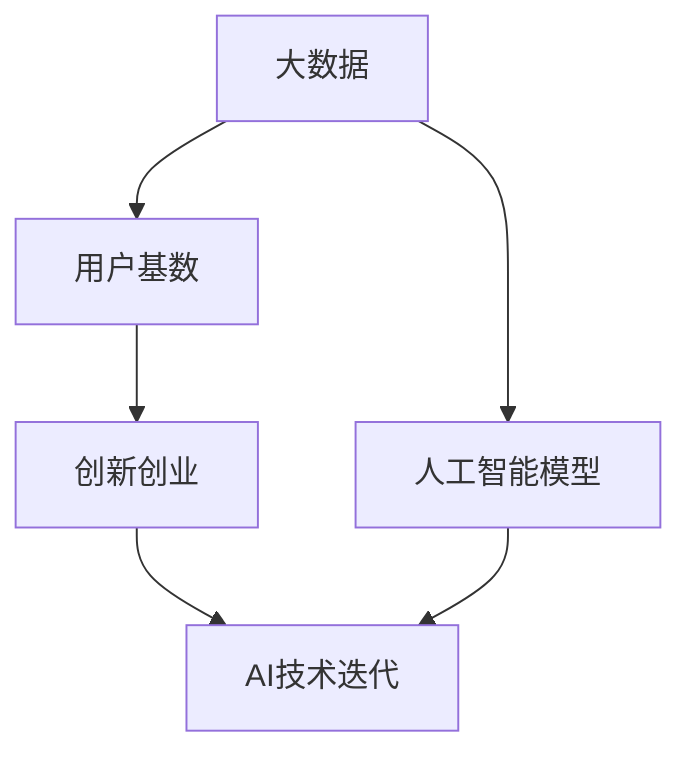

                 

# 国内AI优势：庞大用户基数，积极尝试新事物利于产品迭代

## 1. 背景介绍

### 1.1 问题由来
在全球人工智能(AI)发展迅猛的今天，中国在AI领域的成绩也逐渐引人瞩目。尽管相比于美国等AI强国，中国起步较晚，但在短短几年间，通过庞大的数据资源、政府政策的支持和创新创业的活跃，中国AI的发展已经进入快车道，并展现了强大的生命力和竞争力。

### 1.2 问题核心关键点
中国AI的优势主要体现在以下几个方面：

- **数据资源丰富**：庞大的互联网用户基数和社交媒体活跃度，为AI模型提供了丰富的数据来源。
- **政府政策支持**：从“互联网+”行动计划到“新一代人工智能发展规划”，政府不断出台政策推动AI产业的快速成长。
- **创新创业活跃**：丰富的创新创业生态和人才资源，为AI技术创新提供了强劲动力。

## 2. 核心概念与联系

### 2.1 核心概念概述

为更好地理解中国AI的优势，本节将介绍几个密切相关的核心概念：

- **大数据**：指在人工智能模型训练和优化中，用于表示和挖掘模式、知识、关系等信息的数据集合。
- **人工智能模型**：指能够接收、处理、学习数据，并从中提取知识和规律，以实现特定任务的程序或算法。
- **用户基数**：指一个地区、平台或应用的用户数量，反映市场潜力和用户体验的广度。
- **创新创业**：指个人或团队通过新技术、新模式和新方法，创造新价值、新机会的商业活动。
- **AI技术迭代**：指通过不断优化和改进，使得AI模型在性能、效率和功能上不断进步的过程。

这些核心概念之间的逻辑关系可以通过以下Mermaid流程图来展示：



这个流程图展示了大数据、用户基数、创新创业和AI技术迭代之间的关系：

1. 大数据为人工智能模型提供了训练的源泉。
2. 庞大的用户基数为AI模型提供了丰富多样化的数据集。
3. 活跃的创新创业生态不断推动AI技术的创新和发展。
4. AI技术的不断迭代优化，反过来又推动了产品的快速迭代和市场扩展。

## 3. 核心算法原理 & 具体操作步骤
### 3.1 算法原理概述

中国AI的优势之一是用户基数庞大，这为AI模型提供了丰富的训练数据。通过在大规模数据集上进行监督学习、强化学习等算法训练，中国AI模型往往能够获得更好的性能和泛化能力。以下将以监督学习为例，说明AI模型的训练和迭代过程。

假设我们有一个用于预测用户购买行为的AI模型，其基本结构为：

1. **输入数据**：用户的行为数据，如浏览记录、购买历史、社会属性等。
2. **模型训练**：通过监督学习算法，模型学习输入数据与购买行为之间的关系。
3. **模型验证**：使用测试数据集验证模型效果，评估模型的泛化能力。
4. **模型优化**：根据验证结果，不断调整模型参数，提升预测准确度。

### 3.2 算法步骤详解

以用户购买行为预测为例，具体算法步骤如下：

1. **数据准备**：
   - 收集大量用户行为数据，如浏览记录、购买历史、社交属性等。
   - 对数据进行清洗、标注和预处理，生成训练集、验证集和测试集。

2. **模型选择与构建**：
   - 选择合适的AI模型，如决策树、随机森林、神经网络等。
   - 使用训练集数据，对模型进行初始化训练。

3. **模型验证与评估**：
   - 在验证集上评估模型性能，使用准确率、召回率、F1分数等指标衡量。
   - 根据评估结果，调整模型参数和结构，提高模型泛化能力。

4. **模型优化**：
   - 使用改进算法，如梯度下降、Adam等，优化模型训练过程。
   - 引入正则化技术，防止模型过拟合。
   - 定期重新训练模型，适应新的数据分布。

### 3.3 算法优缺点

中国AI模型在构建过程中，数据资源丰富和用户基数庞大是其显著优势，但也存在一些缺点：

优点：
1. **数据丰富**：庞大的用户数据集提供了丰富的训练样本，使得模型能够更好地泛化。
2. **市场应用广泛**：用户基数大意味着市场应用场景多，模型在实际应用中效果更好。
3. **政策支持**：政府政策支持为AI产业提供了稳定的发展环境。
4. **创业活跃**：活跃的创业生态和人才资源，推动了AI技术的快速迭代。

缺点：
1. **数据质量参差不齐**：大量数据中可能包含噪声和错误，影响模型训练效果。
2. **模型复杂度高**：庞大用户基数带来的数据复杂性，使得模型结构更复杂。
3. **隐私保护问题**：处理大量用户数据时，需要特别注意隐私保护和数据安全。
4. **计算资源需求高**：训练和优化大规模模型需要高昂的计算资源，可能面临成本压力。

## 4. 数学模型和公式 & 详细讲解  
### 4.1 数学模型构建

对于用户购买行为预测模型，可以使用逻辑回归、随机森林、神经网络等算法进行建模。这里我们以逻辑回归为例，介绍其数学模型构建过程。

假设模型的输入特征为 $x$，输出为 $y$（购买或不购买），模型参数为 $\theta$。逻辑回归模型的预测函数为：

$$
\hat{y} = \sigma(\theta^T x)
$$

其中，$\sigma$ 为sigmoid函数，$\theta^T$ 为模型的权重向量。逻辑回归的目标是最小化预测值 $\hat{y}$ 与真实值 $y$ 之间的交叉熵损失函数：

$$
\mathcal{L}(\theta) = -\frac{1}{N} \sum_{i=1}^N [y_i \log \hat{y_i} + (1-y_i) \log (1-\hat{y_i})]
$$

### 4.2 公式推导过程

逻辑回归模型的训练过程如下：

1. **前向传播**：
   - 将输入 $x$ 代入模型，计算预测值 $\hat{y}$。
   - 计算预测值与真实值之间的交叉熵损失函数。

2. **反向传播**：
   - 根据损失函数对权重向量 $\theta$ 求导，计算梯度。
   - 使用梯度下降算法更新模型参数。

3. **参数优化**：
   - 不断迭代上述过程，直至模型收敛或达到预设的训练轮数。

### 4.3 案例分析与讲解

假设有一个电商平台的推荐系统，我们使用逻辑回归模型预测用户是否会购买某件商品。我们首先需要收集用户的浏览记录、购买历史等数据，构建训练集、验证集和测试集。

通过前向传播和反向传播，模型逐渐学习输入数据与购买行为之间的关系，最终输出的预测值与真实值之间的交叉熵损失函数被最小化。

## 5. 项目实践：代码实例和详细解释说明
### 5.1 开发环境搭建

在进行AI项目实践前，我们需要准备好开发环境。以下是使用Python进行TensorFlow开发的环境配置流程：

1. 安装Anaconda：从官网下载并安装Anaconda，用于创建独立的Python环境。

2. 创建并激活虚拟环境：
```bash
conda create -n tf-env python=3.8 
conda activate tf-env
```

3. 安装TensorFlow：根据CUDA版本，从官网获取对应的安装命令。例如：
```bash
conda install tensorflow=2.6 -c tf
```

4. 安装其他依赖包：
```bash
pip install numpy pandas scikit-learn tensorflow-addons
```

完成上述步骤后，即可在`tf-env`环境中开始AI项目开发。

### 5.2 源代码详细实现

这里我们以用户购买行为预测为例，给出使用TensorFlow对逻辑回归模型进行训练和优化的PyTorch代码实现。

```python
import tensorflow as tf
from sklearn.model_selection import train_test_split
from sklearn.preprocessing import StandardScaler

# 准备数据
X_train, X_test, y_train, y_test = train_test_split(X, y, test_size=0.2, random_state=42)
scaler = StandardScaler()
X_train = scaler.fit_transform(X_train)
X_test = scaler.transform(X_test)

# 构建模型
model = tf.keras.Sequential([
    tf.keras.layers.Dense(64, activation='relu', input_shape=(X_train.shape[1],)),
    tf.keras.layers.Dense(1, activation='sigmoid')
])

# 编译模型
model.compile(optimizer='adam', loss='binary_crossentropy', metrics=['accuracy'])

# 训练模型
model.fit(X_train, y_train, epochs=10, batch_size=32, validation_data=(X_test, y_test))

# 评估模型
loss, accuracy = model.evaluate(X_test, y_test)
print(f'Test loss: {loss:.4f}')
print(f'Test accuracy: {accuracy:.4f}')
```

### 5.3 代码解读与分析

让我们再详细解读一下关键代码的实现细节：

**数据准备**：
- 使用`train_test_split`对数据进行划分，构建训练集和测试集。
- 使用`StandardScaler`对数据进行标准化处理，提高模型的训练效率。

**模型构建**：
- 使用`tf.keras.Sequential`构建逻辑回归模型，包括一个全连接层和一个sigmoid激活层。

**模型编译**：
- 使用`compile`方法配置优化器、损失函数和评价指标。

**模型训练**：
- 使用`fit`方法对模型进行训练，设置训练轮数和批次大小。

**模型评估**：
- 使用`evaluate`方法评估模型性能，输出测试损失和准确度。

## 6. 实际应用场景
### 6.1 智能客服系统

基于AI的智能客服系统，能够实时响应客户咨询，提升客户满意度。通过收集用户历史聊天记录和常见问题，构建监督数据，在预训练模型上进行微调，可以使智能客服系统更加精准地理解用户意图，并给出合适的回答。

**具体实现**：
- 收集用户历史聊天记录和常见问题，构建标注数据集。
- 使用预训练模型，如BERT，作为初始化参数。
- 在标注数据集上进行微调，训练一个特定的任务模型，如问答模型或对话模型。
- 部署模型到生产环境中，实时处理客户咨询，给出精准回答。

### 6.2 个性化推荐系统

个性化推荐系统通过分析用户行为数据，为用户推荐最符合其兴趣的商品或内容。通过收集用户浏览记录、购买历史等数据，构建监督数据，在预训练模型上进行微调，可以提高推荐系统的精准度和个性化程度。

**具体实现**：
- 收集用户浏览记录、购买历史等数据，构建标注数据集。
- 使用预训练模型，如BERT，作为初始化参数。
- 在标注数据集上进行微调，训练一个推荐模型，如协同过滤模型或深度学习推荐模型。
- 部署模型到推荐引擎中，实时为用户推荐商品或内容。

### 6.3 金融风险控制

金融风险控制通过分析用户行为数据，预测潜在的风险事件，如信用风险、欺诈风险等。通过收集用户交易记录、行为数据等，构建监督数据，在预训练模型上进行微调，可以提高风险控制的准确度和及时性。

**具体实现**：
- 收集用户交易记录、行为数据等，构建标注数据集。
- 使用预训练模型，如BERT，作为初始化参数。
- 在标注数据集上进行微调，训练一个风险控制模型，如决策树模型或神经网络模型。
- 部署模型到风控系统中，实时监控用户行为，预警潜在风险事件。

### 6.4 未来应用展望

随着AI技术的发展，AI模型将在更多领域得到应用，为各行各业带来变革性影响：

- **医疗健康**：基于AI的医学影像分析、个性化诊疗等，将大幅提升医疗服务的质量和效率。
- **教育培训**：基于AI的智能辅导、内容推荐等，将改善学习效果，实现因材施教。
- **智能制造**：基于AI的生产流程优化、设备维护预测等，将提高生产效率和设备利用率。
- **交通出行**：基于AI的交通流量预测、自动驾驶等，将改善交通体验，提高出行效率。
- **智慧城市**：基于AI的城市管理、公共安全等，将提升城市治理水平，构建智慧未来。

## 7. 工具和资源推荐
### 7.1 学习资源推荐

为了帮助开发者系统掌握AI技术，这里推荐一些优质的学习资源：

1. **Coursera《机器学习》课程**：由斯坦福大学教授Andrew Ng主讲的入门课程，讲解机器学习和深度学习的基本概念和算法。
2. **DeepLearning.AI《深度学习专项课程》**：由吴恩达教授主讲的系列课程，涵盖深度学习、强化学习、生成对抗网络等前沿技术。
3. **Kaggle竞赛平台**：参加各类AI竞赛，积累实践经验，学习数据处理和模型优化的技巧。
4. **GitHub代码库**：搜索和参考开源AI项目，学习代码实现和模型训练的技巧。
5. **《深度学习》书籍**：Ian Goodfellow等著的深度学习经典书籍，详细讲解深度学习的基本原理和算法。

通过这些资源的学习实践，相信你一定能够掌握AI技术的基本框架和实际应用方法。

### 7.2 开发工具推荐

高效的开发离不开优秀的工具支持。以下是几款用于AI开发常用的工具：

1. **TensorFlow**：由Google主导开发的深度学习框架，支持动态图和静态图两种计算图模式，适合构建复杂的神经网络模型。
2. **PyTorch**：由Facebook主导开发的深度学习框架，支持动态图，适合快速迭代研究。
3. **Jupyter Notebook**：支持Python等语言的交互式编程，方便数据处理和模型调试。
4. **Git**：版本控制系统，方便代码版本管理和团队协作。
5. **Docker**：容器化技术，方便模型部署和跨平台移植。

合理利用这些工具，可以显著提升AI模型的开发效率，加快创新迭代的步伐。

### 7.3 相关论文推荐

AI技术的发展离不开学界的持续研究。以下是几篇奠基性的相关论文，推荐阅读：

1. **《深度学习》(Deep Learning)**：Ian Goodfellow等著，详细讲解深度学习的基本原理和算法。
2. **《Generative Adversarial Nets》**：Ian Goodfellow等著，提出生成对抗网络(GAN)，开创生成式深度学习的新方向。
3. **《Attention is All You Need》**：Ashish Vaswani等著，提出Transformer结构，开启大规模预训练语言模型的时代。
4. **《BERT: Pre-training of Deep Bidirectional Transformers for Language Understanding》**：Jacob Devlin等著，提出BERT模型，利用掩码自监督学习，提升语言理解的准确度。
5. **《AlphaGo Zero》**：David Silver等著，提出AlphaGo Zero，通过自我对弈学习，成为围棋世界冠军。

这些论文代表了大AI技术的发展脉络，通过学习这些前沿成果，可以帮助研究者把握学科前进方向，激发更多的创新灵感。

## 8. 总结：未来发展趋势与挑战

### 8.1 总结

本文对基于数据和用户基数优势的AI模型进行了全面系统的介绍。首先阐述了中国AI的优势和模型训练的基本原理，明确了AI模型在实际应用中的重要作用。其次，从原理到实践，详细讲解了AI模型的数学模型构建和微调优化过程，给出了AI模型训练的完整代码实现。同时，本文还广泛探讨了AI模型在智能客服、个性化推荐、金融风险控制等多个行业领域的应用前景，展示了AI模型在实际应用中的强大能力。

通过本文的系统梳理，可以看到，基于数据和用户基数优势的AI模型正在成为各行各业的重要工具，为人工智能技术落地应用提供了有力支撑。AI模型的不断优化和改进，将进一步提升各行业的智能化水平，推动经济社会的全面发展。

### 8.2 未来发展趋势

展望未来，AI模型将在更多领域得到应用，为各行各业带来变革性影响：

1. **技术进步**：AI模型算法和架构的不断改进，将带来更高效、更精准的AI应用。
2. **数据多样性**：AI模型能够处理和分析更多样化的数据，提升模型的泛化能力。
3. **应用拓展**：AI模型将进入更多垂直行业，如智能制造、智慧城市、智慧医疗等，带来更多的创新机会。
4. **人机协同**：AI模型将更加注重与人类用户交互，提升用户体验和满意度。
5. **跨领域融合**：AI模型与其他技术的融合，如物联网、大数据、区块链等，将带来更多的应用场景和创新价值。

这些趋势将进一步推动AI技术的成熟和应用，为各行业带来深远影响。

### 8.3 面临的挑战

尽管AI技术在不断发展，但在实际应用中仍面临诸多挑战：

1. **数据隐私和安全**：处理大量用户数据时，需要特别注意数据隐私和数据安全问题。
2. **模型复杂性**：庞大的数据集和复杂的模型结构，增加了模型训练和调优的难度。
3. **算法透明度**：AI模型的决策过程往往难以解释，缺乏透明度和可解释性。
4. **技术成本高**：AI技术的研发和应用需要高昂的计算资源和技术投入，可能面临成本压力。
5. **伦理和法律问题**：AI模型的应用需要遵守伦理和法律规定，避免潜在的风险和争议。

这些挑战需要学界和产业界共同努力，推动AI技术的健康发展。

### 8.4 研究展望

未来，需要在以下几个方面进行研究：

1. **数据隐私保护**：研究和开发更加高效的数据隐私保护技术，确保数据安全和用户隐私。
2. **模型简化**：研究和开发更加简单、高效的AI模型，降低技术门槛和成本。
3. **算法透明性**：研究和开发更加透明的AI算法，提升模型的可解释性和可信度。
4. **多模态融合**：研究和开发多模态数据融合技术，提升AI模型的综合能力。
5. **伦理和社会责任**：研究和制定AI技术的伦理标准和社会责任规范，确保技术的可持续发展。

只有从数据、算法、工程、伦理等多个维度协同发力，才能真正实现AI技术的全面发展，为社会带来更多福祉。

## 9. 附录：常见问题与解答

**Q1：AI模型在数据处理时需要注意哪些问题？**

A: 在数据处理过程中，需要注意以下几点：
1. **数据清洗**：处理缺失值、异常值和噪声，提高数据质量。
2. **数据标注**：确保标注数据的质量和一致性，避免标注偏差。
3. **数据平衡**：处理类别不平衡的数据，避免模型偏向于多数类别。
4. **数据增强**：通过数据扩充、数据增强等技术，提升模型的泛化能力。

**Q2：如何选择适合的数据集进行模型训练？**

A: 选择适合的数据集进行模型训练，需要考虑以下几个因素：
1. **数据规模**：数据集规模越大，模型性能越好，但同时需要更多的计算资源。
2. **数据质量**：数据质量越高，模型效果越好，但数据标注需要耗费大量人力。
3. **数据分布**：数据集需要与实际应用场景的分布一致，避免模型过拟合。
4. **数据多样性**：数据集需要包含多种数据类型和来源，提高模型的泛化能力。

**Q3：如何在模型训练中避免过拟合？**

A: 在模型训练中避免过拟合，可以采用以下几种方法：
1. **正则化**：通过L2正则化、Dropout等技术，避免模型过度拟合训练数据。
2. **早停法**：通过监控验证集损失，在模型性能不再提升时停止训练。
3. **模型简化**：通过模型简化、特征选择等技术，减少模型复杂度。
4. **数据增强**：通过数据扩充、数据增强等技术，提高模型的泛化能力。

**Q4：如何评估AI模型的性能？**

A: 评估AI模型的性能需要考虑以下几个指标：
1. **准确率**：模型预测结果与真实结果一致的比例。
2. **召回率**：模型正确预测的正例占所有正例的比例。
3. **F1分数**：准确率和召回率的调和平均数，综合评估模型的性能。
4. **ROC曲线**：通过绘制ROC曲线，评估模型在不同阈值下的性能。
5. **混淆矩阵**：通过混淆矩阵，分析模型在各类别上的性能。

这些指标可以帮助我们全面评估AI模型的性能，选择适合的模型进行实际应用。

---

作者：禅与计算机程序设计艺术 / Zen and the Art of Computer Programming

