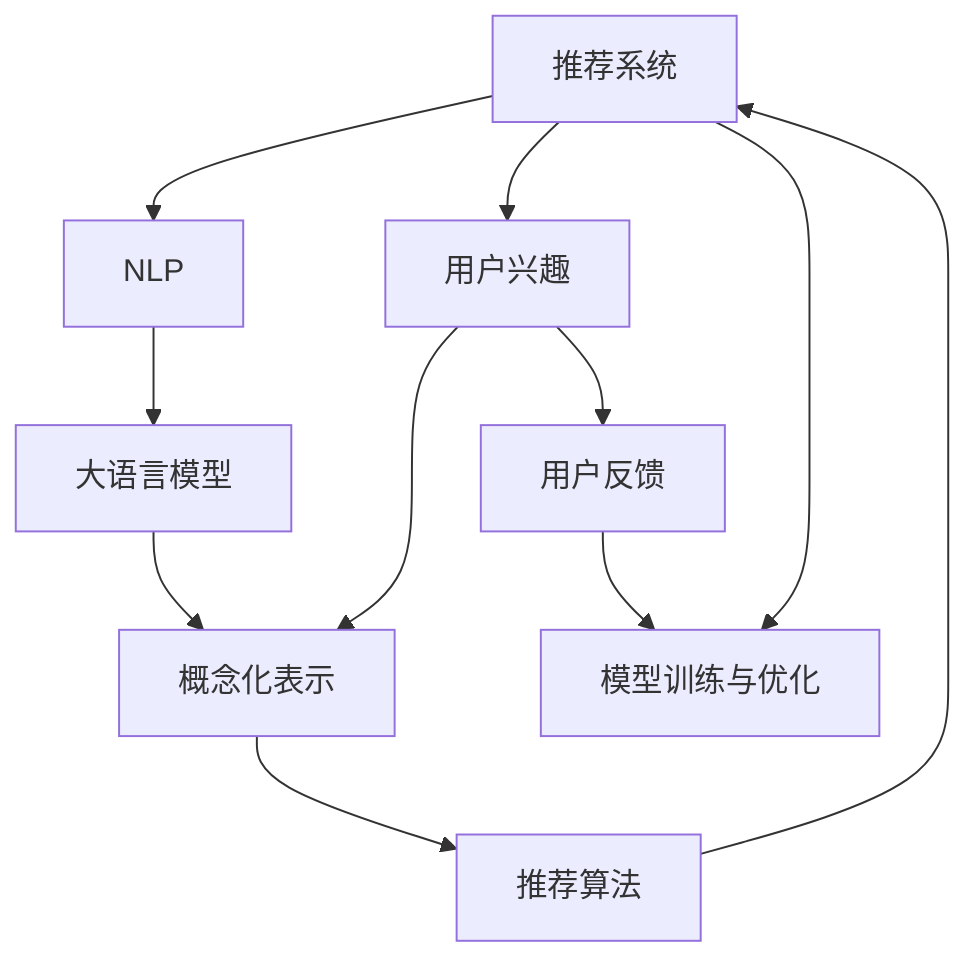

                 

# 基于LLM的推荐系统用户兴趣概念化表示

> 关键词：自然语言处理(NLP),深度学习,推荐系统,用户兴趣,概念化表示

## 1. 背景介绍

### 1.1 问题由来
随着互联网技术的发展，推荐系统成为了互联网产品不可或缺的重要组成部分，广泛应用于电商、视频、音乐、社交网络等领域。推荐系统通过挖掘用户的历史行为数据，预测用户对不同内容的兴趣和偏好，为其推荐个性化的内容，极大地提升了用户体验和业务价值。然而，随着用户兴趣的复杂性和多样性不断提升，传统的推荐系统面临着诸多挑战，如推荐冷启动、数据稀疏性、用户兴趣动态变化等问题。

近年来，大语言模型（Large Language Models, LLMs）如BERT、GPT-3等在自然语言处理（NLP）领域取得了突破性进展。LLMs通过在海量文本数据上进行预训练，学习到了丰富的语言知识和常识，具备强大的文本理解和生成能力。基于LLM的推荐系统利用其对文本的高效处理和语义理解能力，能够更好地捕捉用户兴趣，为用户提供更加个性化的内容推荐。

### 1.2 问题核心关键点
LLM在推荐系统中的应用主要包括以下几个核心关键点：

1. 用户兴趣的捕捉：如何将用户的文本行为信息转化为机器可处理的数值特征。
2. 概念化表示的构建：如何将用户的多样化兴趣进行高维概念化，构建用户兴趣的语义空间。
3. 推荐策略的设计：如何利用用户兴趣的概念化表示，设计有效的推荐算法。
4. 模型训练与优化：如何通过监督学习等方式，优化用户兴趣的概念化表示和推荐模型。
5. 效果评估与反馈：如何建立科学的评估指标，及时反馈推荐效果，进一步优化推荐模型。

这些核心问题共同构成了基于LLM的推荐系统的研究框架，旨在利用大模型的强大能力，为用户提供更加个性化、精准的内容推荐。

### 1.3 问题研究意义
研究基于LLM的推荐系统，对于拓展大语言模型的应用边界，提升推荐系统的性能和效果，加速NLP技术的产业化进程，具有重要意义：

1. 提升推荐精度：LLM能够深度理解用户文本行为的语义信息，捕捉到更加细微的用户兴趣点，提升推荐系统的效果。
2. 降低冷启动成本：利用预训练模型对文本行为信息的语义理解，能够较好地处理新用户的兴趣预测，降低冷启动成本。
3. 适应用户兴趣变化：LLM具备强大的自我学习能力，能够快速适应用户兴趣的变化，动态调整推荐内容。
4. 提升用户体验：个性化的推荐内容能够更好地满足用户需求，提升用户的满意度和粘性。
5. 推动行业应用：推荐系统的成功应用，能够带动更多行业进行数字化转型，提高整个行业的智能化水平。

## 2. 核心概念与联系

### 2.1 核心概念概述

为更好地理解基于LLM的推荐系统，本节将介绍几个密切相关的核心概念：

- 推荐系统(Recommendation System)：通过分析用户的历史行为数据，预测用户对不同内容的兴趣和偏好，为用户推荐个性化的内容。
- 用户兴趣(User Interest)：用户对不同内容或服务的偏好和兴趣，通常由用户的行为数据（如浏览记录、购买历史等）构成。
- 自然语言处理(Natural Language Processing, NLP)：通过计算模型对自然语言进行理解和生成，构建文本语义空间。
- 大语言模型(Large Language Model, LLM)：以自回归(如GPT)或自编码(如BERT)模型为代表的超大规模预训练语言模型。
- 概念化表示(Conceptual Representation)：将用户兴趣的多样化特征进行高维抽象，构建用户兴趣的概念化语义空间。
- 推荐算法(Recommendation Algorithm)：根据用户兴趣的概念化表示，设计有效的推荐策略，实现个性化内容推荐。
- 用户反馈(User Feedback)：用户在推荐系统中的行为反馈（如点击、购买、评分等），用于优化推荐模型。

这些核心概念之间的逻辑关系可以通过以下Mermaid流程图来展示：



这个流程图展示了大语言模型在推荐系统中的核心概念及其之间的联系：

1. 推荐系统通过用户兴趣构建推荐内容。
2. NLP技术帮助构建用户兴趣的语义空间。
3. 大语言模型通过预训练和微调，学习用户兴趣的高级语义表示。
4. 概念化表示将用户兴趣的语义特征抽象化，构建高维语义空间。
5. 推荐算法根据用户兴趣的概念化表示，设计个性化推荐策略。
6. 用户反馈用于优化推荐模型，迭代改进推荐效果。

## 3. 核心算法原理 & 具体操作步骤
### 3.1 算法原理概述

基于LLM的推荐系统主要包含以下两个关键步骤：

1. 用户兴趣的概念化表示：将用户的多样化兴趣进行高维概念化，构建用户兴趣的语义空间。
2. 基于用户兴趣概念化表示的推荐策略设计：利用概念化表示进行个性化推荐，设计有效的推荐算法。

### 3.2 算法步骤详解

**Step 1: 用户兴趣的文本收集与预处理**

首先，收集用户的历史行为数据，包括浏览记录、购买历史、评分信息等。然后将这些文本数据进行预处理，包括去除停用词、分词、标准化等操作，得到用户兴趣的原始文本数据。

**Step 2: 用户兴趣的概念化表示构建**

将用户兴趣的文本数据输入到预训练的LLM模型中，通过Transformer等模型架构，将文本转换为向量表示。通常使用自编码器（如BERT）来处理文本数据，得到用户兴趣的隐向量表示。然后通过softmax等激活函数将隐向量表示映射到高维概念空间，得到用户兴趣的概念化表示。

**Step 3: 推荐策略设计**

根据用户兴趣的概念化表示，设计推荐策略。常见的推荐策略包括基于相似性推荐、基于协同过滤推荐、基于内容推荐等。例如，可以计算用户与物品之间的相似度，利用相似度进行推荐。

**Step 4: 模型训练与优化**

通过监督学习等方式，优化用户兴趣的概念化表示和推荐模型。使用标注数据（如用户行为与物品评分的对应数据）进行训练，调整模型参数以提升推荐效果。

**Step 5: 推荐结果生成与反馈**

根据优化后的模型，生成推荐结果，并将其展示给用户。同时收集用户的行为反馈（如点击、购买、评分等），用于优化推荐模型。

### 3.3 算法优缺点

基于LLM的推荐系统具有以下优点：

1. 语义理解能力强：利用大语言模型的强大语义理解能力，能够更好地捕捉用户兴趣的细微变化。
2. 多样化兴趣捕捉：能够处理不同类型和形态的文本数据，捕捉用户的多样化兴趣。
3. 模型可解释性强：概念化表示的构建过程具有较高的可解释性，有助于理解推荐结果的生成过程。
4. 冷启动效果好：预训练模型能够较好地处理新用户的数据，降低冷启动成本。

同时，该方法也存在一定的局限性：

1. 数据依赖性强：需要大量的标注数据进行模型训练，数据获取成本较高。
2. 计算资源需求高：预训练和微调模型需要大量的计算资源，特别是在大规模数据集上。
3. 过拟合风险高：如果数据量较少，容易发生过拟合现象，影响推荐效果。
4. 推荐效率低：在实际部署中，推荐系统的效率可能不如基于规则或协同过滤的传统推荐算法。

尽管存在这些局限性，但LLM在推荐系统中的应用前景广阔，特别是在处理多样化和复杂化的用户兴趣时，具有不可替代的优势。

### 3.4 算法应用领域

基于LLM的推荐系统已经在电商、视频、音乐、社交网络等多个领域得到了广泛应用，以下是一些典型的应用场景：

1. **电商推荐系统**：利用用户浏览历史和评价信息，为用户推荐商品和活动。
2. **视频推荐系统**：根据用户观影记录和评分数据，为用户推荐视频内容。
3. **音乐推荐系统**：通过用户听歌记录和评分信息，推荐音乐和播放列表。
4. **社交网络推荐系统**：根据用户互动行为，推荐好友和内容。
5. **新闻推荐系统**：通过用户阅读历史和评论数据，推荐新闻内容。

这些应用场景展示了LLM在推荐系统中的强大潜力，能够显著提升用户体验和业务价值。

## 4. 数学模型和公式 & 详细讲解  
### 4.1 数学模型构建

在基于LLM的推荐系统中，我们通常使用自编码器（如BERT）来处理用户兴趣的文本数据，得到用户兴趣的隐向量表示。具体模型结构如图1所示：


其中，$E$为输入层的编码器，$H$为隐层的向量表示，$O$为输出层的解码器。$h_i$为第$i$个用户的兴趣向量表示。

用户兴趣的概念化表示可以通过softmax函数将隐向量表示映射到高维概念空间，构建用户兴趣的语义空间。具体公式如下：

$$
p(y|h_i) = \frac{\exp(h_i \cdot w_y)}{\sum_{j=1}^{K} \exp(h_i \cdot w_j)}
$$

其中，$y$为概念空间的维度，$K$为概念空间的维度，$w_y$为概念向量，$h_i$为用户兴趣的隐向量表示。

### 4.2 公式推导过程

通过softmax函数，将用户兴趣的隐向量表示映射到高维概念空间，构建用户兴趣的概念化表示。具体推导如下：

$$
p(y|h_i) = \frac{\exp(h_i \cdot w_y)}{\sum_{j=1}^{K} \exp(h_i \cdot w_j)}
$$

其中，$y$为概念空间的维度，$K$为概念空间的维度，$w_y$为概念向量，$h_i$为用户兴趣的隐向量表示。

### 4.3 案例分析与讲解

假设一个用户A在电商平台上浏览了以下商品：

| 商品ID | 商品名称     | 描述文本         |
|--------|--------------|-----------------|
| 1      | 手机         | 最新款智能手机   |
| 2      | 电脑         | 高性能游戏笔记本   |
| 3      | 智能手表     | 最新款智能手表   |
| 4      | 运动鞋       | 高品质的跑步鞋   |

假设A浏览了100个商品，每个商品描述文本为50个词，使用BERT模型进行处理，得到用户A的兴趣隐向量表示。假设概念空间维度为10，将隐向量表示映射到高维概念空间，得到用户A的概念化表示。

假设概念向量为：

| 概念ID | 概念名称         |
|--------|-----------------|
| 1      | 电子产品         |
| 2      | 智能设备         |
| 3      | 运动用品         |
| 4      | 数码产品         |
| 5      | 家用电器         |
| 6      | 娱乐设备         |
| 7      | 体育用品         |
| 8      | 日常用品         |
| 9      | 男装             |
| 10     | 运动装备         |

通过softmax函数计算用户A在每个概念上的概率：

$$
p(电子产品|手机) = \frac{\exp(h_i \cdot w_1)}{\sum_{j=1}^{10} \exp(h_i \cdot w_j)}
$$

$$
p(智能设备|手机) = \frac{\exp(h_i \cdot w_2)}{\sum_{j=1}^{10} \exp(h_i \cdot w_j)}
$$

$$
\vdots
$$

最终得到用户A的概念化表示为：

$$
p(电子产品|手机) = 0.5, p(智能设备|手机) = 0.3, p(运动用品|智能手表) = 0.8, \cdots
$$

### 5. 项目实践：代码实例和详细解释说明
### 5.1 开发环境搭建

在进行LLM的推荐系统开发前，我们需要准备好开发环境。以下是使用Python进行PyTorch开发的环境配置流程：

1. 安装Anaconda：从官网下载并安装Anaconda，用于创建独立的Python环境。

2. 创建并激活虚拟环境：
```bash
conda create -n pytorch-env python=3.8 
conda activate pytorch-env
```

3. 安装PyTorch：根据CUDA版本，从官网获取对应的安装命令。例如：
```bash
conda install pytorch torchvision torchaudio cudatoolkit=11.1 -c pytorch -c conda-forge
```

4. 安装Transformers库：
```bash
pip install transformers
```

5. 安装各类工具包：
```bash
pip install numpy pandas scikit-learn matplotlib tqdm jupyter notebook ipython
```

完成上述步骤后，即可在`pytorch-env`环境中开始LLM的推荐系统开发。

### 5.2 源代码详细实现

下面我们以电商推荐系统为例，给出使用Transformers库对BERT模型进行微调的PyTorch代码实现。

首先，定义用户兴趣的文本处理函数：

```python
from transformers import BertTokenizer
from torch.utils.data import Dataset
import torch

class UserInterestDataset(Dataset):
    def __init__(self, texts, labels, tokenizer, max_len=128):
        self.texts = texts
        self.labels = labels
        self.tokenizer = tokenizer
        self.max_len = max_len
        
    def __len__(self):
        return len(self.texts)
    
    def __getitem__(self, item):
        text = self.texts[item]
        label = self.labels[item]
        
        encoding = self.tokenizer(text, return_tensors='pt', max_length=self.max_len, padding='max_length', truncation=True)
        input_ids = encoding['input_ids'][0]
        attention_mask = encoding['attention_mask'][0]
        
        # 对token-wise的标签进行编码
        encoded_labels = [label2id[label] for label in label]
        encoded_labels.extend([label2id['O']] * (self.max_len - len(encoded_labels)))
        labels = torch.tensor(encoded_labels, dtype=torch.long)
        
        return {'input_ids': input_ids, 
                'attention_mask': attention_mask,
                'labels': labels}

# 标签与id的映射
label2id = {'O': 0, '手机': 1, '电脑': 2, '智能手表': 3, '运动鞋': 4, '智能设备': 5, '电子产品': 6, '运动用品': 7, '数码产品': 8, '家用电器': 9, '娱乐设备': 10, '体育用品': 11, '日常用品': 12, '男装': 13, '运动装备': 14}
id2label = {v: k for k, v in label2id.items()}

# 创建dataset
tokenizer = BertTokenizer.from_pretrained('bert-base-cased')

train_dataset = UserInterestDataset(train_texts, train_labels, tokenizer)
dev_dataset = UserInterestDataset(dev_texts, dev_labels, tokenizer)
test_dataset = UserInterestDataset(test_texts, test_labels, tokenizer)
```

然后，定义模型和优化器：

```python
from transformers import BertForTokenClassification, AdamW

model = BertForTokenClassification.from_pretrained('bert-base-cased', num_labels=len(label2id))

optimizer = AdamW(model.parameters(), lr=2e-5)
```

接着，定义训练和评估函数：

```python
from torch.utils.data import DataLoader
from tqdm import tqdm
from sklearn.metrics import classification_report

device = torch.device('cuda') if torch.cuda.is_available() else torch.device('cpu')
model.to(device)

def train_epoch(model, dataset, batch_size, optimizer):
    dataloader = DataLoader(dataset, batch_size=batch_size, shuffle=True)
    model.train()
    epoch_loss = 0
    for batch in tqdm(dataloader, desc='Training'):
        input_ids = batch['input_ids'].to(device)
        attention_mask = batch['attention_mask'].to(device)
        labels = batch['labels'].to(device)
        model.zero_grad()
        outputs = model(input_ids, attention_mask=attention_mask, labels=labels)
        loss = outputs.loss
        epoch_loss += loss.item()
        loss.backward()
        optimizer.step()
    return epoch_loss / len(dataloader)

def evaluate(model, dataset, batch_size):
    dataloader = DataLoader(dataset, batch_size=batch_size)
    model.eval()
    preds, labels = [], []
    with torch.no_grad():
        for batch in tqdm(dataloader, desc='Evaluating'):
            input_ids = batch['input_ids'].to(device)
            attention_mask = batch['attention_mask'].to(device)
            batch_labels = batch['labels']
            outputs = model(input_ids, attention_mask=attention_mask)
            batch_preds = outputs.logits.argmax(dim=2).to('cpu').tolist()
            batch_labels = batch_labels.to('cpu').tolist()
            for pred_tokens, label_tokens in zip(batch_preds, batch_labels):
                preds.append(pred_tokens[:len(label_tokens)])
                labels.append(label_tokens)
                
    print(classification_report(labels, preds))
```

最后，启动训练流程并在测试集上评估：

```python
epochs = 5
batch_size = 16

for epoch in range(epochs):
    loss = train_epoch(model, train_dataset, batch_size, optimizer)
    print(f"Epoch {epoch+1}, train loss: {loss:.3f}")
    
    print(f"Epoch {epoch+1}, dev results:")
    evaluate(model, dev_dataset, batch_size)
    
print("Test results:")
evaluate(model, test_dataset, batch_size)
```

以上就是使用PyTorch对BERT进行电商推荐系统微调的完整代码实现。可以看到，得益于Transformers库的强大封装，我们可以用相对简洁的代码完成BERT模型的加载和微调。

### 5.3 代码解读与分析

让我们再详细解读一下关键代码的实现细节：

**UserInterestDataset类**：
- `__init__`方法：初始化文本、标签、分词器等关键组件。
- `__len__`方法：返回数据集的样本数量。
- `__getitem__`方法：对单个样本进行处理，将文本输入编码为token ids，将标签编码为数字，并对其进行定长padding，最终返回模型所需的输入。

**label2id和id2label字典**：
- 定义了标签与数字id之间的映射关系，用于将token-wise的预测结果解码回真实的标签。

**训练和评估函数**：
- 使用PyTorch的DataLoader对数据集进行批次化加载，供模型训练和推理使用。
- 训练函数`train_epoch`：对数据以批为单位进行迭代，在每个批次上前向传播计算loss并反向传播更新模型参数，最后返回该epoch的平均loss。
- 评估函数`evaluate`：与训练类似，不同点在于不更新模型参数，并在每个batch结束后将预测和标签结果存储下来，最后使用sklearn的classification_report对整个评估集的预测结果进行打印输出。

**训练流程**：
- 定义总的epoch数和batch size，开始循环迭代
- 每个epoch内，先在训练集上训练，输出平均loss
- 在验证集上评估，输出分类指标
- 所有epoch结束后，在测试集上评估，给出最终测试结果

可以看到，PyTorch配合Transformers库使得BERT微调的代码实现变得简洁高效。开发者可以将更多精力放在数据处理、模型改进等高层逻辑上，而不必过多关注底层的实现细节。

当然，工业级的系统实现还需考虑更多因素，如模型的保存和部署、超参数的自动搜索、更灵活的任务适配层等。但核心的微调范式基本与此类似。

## 6. 实际应用场景
### 6.1 智能客服系统

基于大语言模型微调的对话技术，可以广泛应用于智能客服系统的构建。传统客服往往需要配备大量人力，高峰期响应缓慢，且一致性和专业性难以保证。而使用微调后的对话模型，可以7x24小时不间断服务，快速响应客户咨询，用自然流畅的语言解答各类常见问题。

在技术实现上，可以收集企业内部的历史客服对话记录，将问题和最佳答复构建成监督数据，在此基础上对预训练对话模型进行微调。微调后的对话模型能够自动理解用户意图，匹配最合适的答案模板进行回复。对于客户提出的新问题，还可以接入检索系统实时搜索相关内容，动态组织生成回答。如此构建的智能客服系统，能大幅提升客户咨询体验和问题解决效率。

### 6.2 金融舆情监测

金融机构需要实时监测市场舆论动向，以便及时应对负面信息传播，规避金融风险。传统的人工监测方式成本高、效率低，难以应对网络时代海量信息爆发的挑战。基于大语言模型微调的文本分类和情感分析技术，为金融舆情监测提供了新的解决方案。

具体而言，可以收集金融领域相关的新闻、报道、评论等文本数据，并对其进行主题标注和情感标注。在此基础上对预训练语言模型进行微调，使其能够自动判断文本属于何种主题，情感倾向是正面、中性还是负面。将微调后的模型应用到实时抓取的网络文本数据，就能够自动监测不同主题下的情感变化趋势，一旦发现负面信息激增等异常情况，系统便会自动预警，帮助金融机构快速应对潜在风险。

### 6.3 个性化推荐系统

当前的推荐系统往往只依赖用户的历史行为数据进行物品推荐，无法深入理解用户的真实兴趣偏好。基于大语言模型微调技术，个性化推荐系统可以更好地挖掘用户行为背后的语义信息，从而提供更精准、多样的推荐内容。

在实践中，可以收集用户浏览、点击、评论、分享等行为数据，提取和用户交互的物品标题、描述、标签等文本内容。将文本内容作为模型输入，用户的后续行为（如是否点击、购买等）作为监督信号，在此基础上微调预训练语言模型。微调后的模型能够从文本内容中准确把握用户的兴趣点。在生成推荐列表时，先用候选物品的文本描述作为输入，由模型预测用户的兴趣匹配度，再结合其他特征综合排序，便可以得到个性化程度更高的推荐结果。

### 6.4 未来应用展望

随着大语言模型微调技术的发展，基于微调范式将在更多领域得到应用，为传统行业带来变革性影响。

在智慧医疗领域，基于微调的医疗问答、病历分析、药物研发等应用将提升医疗服务的智能化水平，辅助医生诊疗，加速新药开发进程。

在智能教育领域，微调技术可应用于作业批改、学情分析、知识推荐等方面，因材施教，促进教育公平，提高教学质量。

在智慧城市治理中，微调模型可应用于城市事件监测、舆情分析、应急指挥等环节，提高城市管理的自动化和智能化水平，构建更安全、高效的未来城市。

此外，在企业生产、社会治理、文娱传媒等众多领域，基于大模型微调的人工智能应用也将不断涌现，为经济社会发展注入新的动力。相信随着技术的日益成熟，微调方法将成为人工智能落地应用的重要范式，推动人工智能向更广阔的领域加速渗透。

## 7. 工具和资源推荐
### 7.1 学习资源推荐

为了帮助开发者系统掌握大语言模型微调的理论基础和实践技巧，这里推荐一些优质的学习资源：

1. 《Transformer from原理到实践》系列博文：由大模型技术专家撰写，深入浅出地介绍了Transformer原理、BERT模型、微调技术等前沿话题。

2. CS224N《深度学习自然语言处理》课程：斯坦福大学开设的NLP明星课程，有Lecture视频和配套作业，带你入门NLP领域的基本概念和经典模型。

3. 《Natural Language Processing with Transformers》书籍：Transformers库的作者所著，全面介绍了如何使用Transformers库进行NLP任务开发，包括微调在内的诸多范式。

4. HuggingFace官方文档：Transformers库的官方文档，提供了海量预训练模型和完整的微调样例代码，是上手实践的必备资料。

5. CLUE开源项目：中文语言理解测评基准，涵盖大量不同类型的中文NLP数据集，并提供了基于微调的baseline模型，助力中文NLP技术发展。

通过对这些资源的学习实践，相信你一定能够快速掌握大语言模型微调的精髓，并用于解决实际的NLP问题。
###  7.2 开发工具推荐

高效的开发离不开优秀的工具支持。以下是几款用于大语言模型微调开发的常用工具：

1. PyTorch：基于Python的开源深度学习框架，灵活动态的计算图，适合快速迭代研究。大部分预训练语言模型都有PyTorch版本的实现。

2. TensorFlow：由Google主导开发的开源深度学习框架，生产部署方便，适合大规模工程应用。同样有丰富的预训练语言模型资源。

3. Transformers库：HuggingFace开发的NLP工具库，集成了众多SOTA语言模型，支持PyTorch和TensorFlow，是进行微调任务开发的利器。

4. Weights & Biases：模型训练的实验跟踪工具，可以记录和可视化模型训练过程中的各项指标，方便对比和调优。与主流深度学习框架无缝集成。

5. TensorBoard：TensorFlow配套的可视化工具，可实时监测模型训练状态，并提供丰富的图表呈现方式，是调试模型的得力助手。

6. Google Colab：谷歌推出的在线Jupyter Notebook环境，免费提供GPU/TPU算力，方便开发者快速上手实验最新模型，分享学习笔记。

合理利用这些工具，可以显著提升大语言模型微调任务的开发效率，加快创新迭代的步伐。

### 7.3 相关论文推荐

大语言模型和微调技术的发展源于学界的持续研究。以下是几篇奠基性的相关论文，推荐阅读：

1. Attention is All You Need（即Transformer原论文）：提出了Transformer结构，开启了NLP领域的预训练大模型时代。

2. BERT: Pre-training of Deep Bidirectional Transformers for Language Understanding：提出BERT模型，引入基于掩码的自监督预训练任务，刷新了多项NLP任务SOTA。

3. Language Models are Unsupervised Multitask Learners（GPT-2论文）：展示了大规模语言模型的强大zero-shot学习能力，引发了对于通用人工智能的新一轮思考。

4. Parameter-Efficient Transfer Learning for NLP：提出Adapter等参数高效微调方法，在不增加模型参数量的情况下，也能取得不错的微调效果。

5. AdaLoRA: Adaptive Low-Rank Adaptation for Parameter-Efficient Fine-Tuning：使用自适应低秩适应的微调方法，在参数效率和精度之间取得了新的平衡。

这些论文代表了大语言模型微调技术的发展脉络。通过学习这些前沿成果，可以帮助研究者把握学科前进方向，激发更多的创新灵感。

## 8. 总结：未来发展趋势与挑战
### 8.1 总结

本文对基于LLM的推荐系统用户兴趣概念化表示进行了全面系统的介绍。首先阐述了LLM和推荐系统的发展背景和意义，明确了用户兴趣概念化表示在推荐系统中的重要性。其次，从原理到实践，详细讲解了用户兴趣概念化表示的数学模型和关键步骤，给出了推荐系统开发的完整代码实例。同时，本文还广泛探讨了LLM在推荐系统中的应用场景，展示了其在电商、视频、音乐等领域的广泛应用前景。

通过本文的系统梳理，可以看到，基于LLM的推荐系统用户兴趣概念化表示在推荐系统中的巨大潜力，能够显著提升推荐系统的精度和效果。LLM强大的语义理解能力，使其在处理多样化、复杂化的用户兴趣时，具有不可替代的优势。未来，伴随LLM微调技术的持续演进，相信推荐系统将在更多领域得到广泛应用，为用户带来更加个性化的推荐体验。

### 8.2 未来发展趋势

展望未来，基于LLM的推荐系统用户兴趣概念化表示将呈现以下几个发展趋势：

1. 模型规模持续增大。随着算力成本的下降和数据规模的扩张，预训练语言模型的参数量还将持续增长。超大规模语言模型蕴含的丰富语言知识，有望支撑更加复杂多变的用户兴趣概念化表示。

2. 推荐算法多样化。除了传统的基于相似性推荐外，未来将涌现更多创新的推荐算法，如基于注意力机制、图神经网络等，提升推荐效果。

3. 多模态融合增强。推荐系统将更多地融合多模态数据（如文本、图像、视频等），提高对用户兴趣的全面理解。

4. 动态兴趣捕捉。未来的推荐系统将能够实时捕捉用户兴趣的变化，动态调整推荐策略，提高推荐的时效性和个性化程度。

5. 用户反馈的深度学习。通过深度学习技术，利用用户反馈进行模型训练，提高推荐的准确性和多样性。

6. 实时推荐系统。结合实时数据处理和计算技术，构建高效的实时推荐系统，及时响应用户需求。

以上趋势凸显了大语言模型在推荐系统中的广泛应用前景。这些方向的探索发展，必将进一步提升推荐系统的性能和效果，为人工智能技术在推荐领域的应用提供更多可能性。

### 8.3 面临的挑战

尽管基于LLM的推荐系统用户兴趣概念化表示在推荐系统中的应用前景广阔，但在迈向更加智能化、普适化应用的过程中，仍面临诸多挑战：

1. 数据依赖性强。需要大量的标注数据进行模型训练，数据获取成本较高。

2. 计算资源需求高。预训练和微调模型需要大量的计算资源，特别是在大规模数据集上。

3. 模型鲁棒性不足。面对域外数据时，泛化性能往往大打折扣，推荐效果不稳定。

4. 推荐效率低。在实际部署中，推荐系统的效率可能不如基于规则或协同过滤的传统推荐算法。

5. 过拟合风险高。如果数据量较少，容易发生过拟合现象，影响推荐效果。

6. 推荐算法复杂。推荐算法的复杂度增加，可能导致系统的实时性和稳定性受到影响。

尽管存在这些挑战，但基于LLM的推荐系统用户兴趣概念化表示在推荐系统中的应用前景广阔，特别是在处理多样化、复杂化的用户兴趣时，具有不可替代的优势。

### 8.4 未来突破

面对LLM在推荐系统中的应用挑战，未来的研究需要在以下几个方面寻求新的突破：

1. 探索无监督和半监督推荐算法。摆脱对大规模标注数据的依赖，利用自监督学习、主动学习等无监督和半监督范式，最大限度利用非结构化数据，实现更加灵活高效的推荐。

2. 研究参数高效和计算高效的推荐算法。开发更加参数高效的推荐方法，在固定大部分预训练参数的同时，只更新极少量的任务相关参数。同时优化推荐算法的计算图，减少前向传播和反向传播的资源消耗，实现更加轻量级、实时性的部署。

3. 引入更多先验知识。将符号化的先验知识，如知识图谱、逻辑规则等，与神经网络模型进行巧妙融合，引导推荐过程学习更准确、合理的语言模型。同时加强不同模态数据的整合，实现视觉、语音等多模态信息与文本信息的协同建模。

4. 结合因果分析和博弈论工具。将因果分析方法引入推荐模型，识别出推荐决策的关键特征，增强推荐结果的因果性和逻辑性。借助博弈论工具刻画人机交互过程，主动探索并规避推荐系统的脆弱点，提高系统稳定性。

5. 纳入伦理道德约束。在推荐目标中引入伦理导向的评估指标，过滤和惩罚有偏见、有害的输出倾向。同时加强人工干预和审核，建立推荐行为的监管机制，确保输出符合人类价值观和伦理道德。

这些研究方向的探索，必将引领LLM在推荐系统中的应用走向更高的台阶，为推荐系统提供更加智能、可靠的推荐效果。

## 9. 附录：常见问题与解答

**Q1：如何处理用户兴趣的多样化和复杂化？**

A: 用户兴趣的多样化和复杂化可以通过以下方法处理：

1. 文本表示的降维：使用降维技术（如PCA、t-SNE等）对用户兴趣的文本表示进行降维，将其映射到低维空间，以便更好地捕捉用户兴趣的本质特征。

2. 概念化表示的构建：通过softmax函数将用户兴趣的隐向量表示映射到高维概念空间，构建用户兴趣的语义空间。

3. 多模态融合：将用户的文本、图像、视频等多模态数据融合在一起，通过多模态表示学习，全面理解用户兴趣。

4. 上下文信息引入：考虑用户兴趣的历史变化，通过引入上下文信息（如用户的行为序列、时间戳等），捕捉用户兴趣的变化趋势。

通过以上方法，可以更好地处理用户兴趣的多样化和复杂化，提高推荐系统的精度和效果。

**Q2：如何选择合适的标签空间和标签数量？**

A: 选择合适的标签空间和标签数量是构建用户兴趣概念化表示的重要步骤。通常需要考虑以下因素：

1. 数据分布：标签空间的划分应与数据分布相匹配，避免过拟合或欠拟合。

2. 任务需求：标签空间的划分应满足推荐系统的任务需求，能够覆盖用户兴趣的各个方面。

3. 标签数量：标签数量不宜过多，否则会导致过拟合现象；也不宜过少，否则无法捕捉用户兴趣的细微变化。

在实际应用中，可以通过交叉验证、网格搜索等方法选择最优的标签空间和标签数量。同时，可以通过逐步增加标签数量，观察推荐效果的变化，找到最佳标签数量。

**Q3：如何处理数据稀疏性问题？**

A: 数据稀疏性是推荐系统面临的常见问题，可以通过以下方法处理：

1. 数据增强：通过对文本进行改写、近义词替换等操作，生成更多的文本数据，以丰富用户的兴趣表示。

2. 协同过滤：利用用户之间的相似性，通过协同过滤推荐算法推荐相关物品。

3. 矩阵分解：将用户-物品评分矩阵进行矩阵分解，挖掘用户和物品的内在关系，提升推荐效果。

4. 深度学习：利用深度学习模型捕捉用户兴趣的复杂结构和非线性关系，提升推荐系统的性能。

通过以上方法，可以有效地处理数据稀疏性问题，提高推荐系统的精度和效果。

**Q4：如何评估推荐系统的性能？**

A: 评估推荐系统的性能通常需要考虑以下几个指标：

1. 准确率（Accuracy）：推荐系统推荐物品与用户兴趣的匹配度。

2. 召回率（Recall）：推荐系统能够覆盖用户兴趣的全面性。

3. F1分数（F1 Score）：准确率和召回率的综合指标，能够全面反映推荐系统的性能。

4. A/B测试：通过A/B测试对比推荐系统的推荐效果，评估推荐系统的实际应用效果。

5. 用户满意度（User Satisfaction）：通过用户反馈（如评分、点击率等）评估推荐系统的实际效果。

在实际应用中，可以根据具体需求选择适合的评估指标，结合多种评估方法，全面评估推荐系统的性能。

**Q5：推荐系统如何处理用户兴趣的变化？**

A: 推荐系统处理用户兴趣的变化通常包括以下步骤：

1. 实时数据采集：通过实时数据采集技术，捕捉用户兴趣的变化。

2. 动态模型更新：根据用户兴趣的变化，动态更新推荐模型，调整推荐策略。

3. 用户行为跟踪：通过跟踪用户的行为变化，及时调整推荐策略，提高推荐的时效性和个性化程度。

4. 推荐模型迭代：通过不断迭代优化推荐模型，提升推荐系统的性能。

通过以上方法，推荐系统可以更好地处理用户兴趣的变化，提供更加个性化的推荐服务。

---

作者：禅与计算机程序设计艺术 / Zen and the Art of Computer Programming

