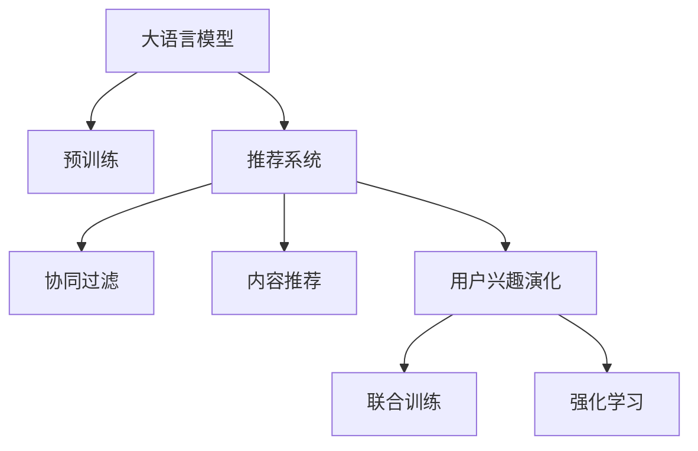
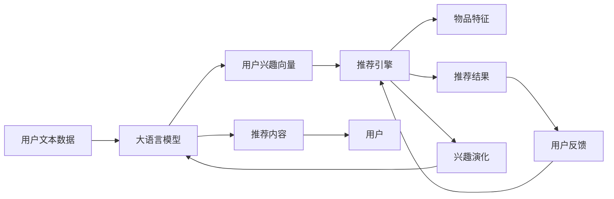

                 

# 基于LLM的推荐系统用户兴趣演化

> 关键词：基于LLM的推荐系统, 用户兴趣演化, 协同过滤, 深度学习, 联合训练, 强化学习

## 1. 背景介绍

### 1.1 问题由来

随着互联网技术的快速发展和用户数据的急剧增加，推荐系统（Recommender Systems）成为了电商、新闻、视频等诸多领域中不可或缺的一部分，为用户提供个性化的内容推荐服务。推荐系统的目标是分析用户的历史行为数据，预测其未来的兴趣，并基于这些兴趣进行物品推荐。传统推荐系统主要基于协同过滤（Collaborative Filtering, CF）和内容推荐（Content-Based Filtering, CB）两大类方法，通过用户-物品交互数据来推测用户未来的偏好。然而，随着数据的多样化和用户行为的复杂化，协同过滤和内容推荐逐渐难以满足用户需求。

随着语言模型（Language Model, LM）技术的发展，基于大语言模型（Large Language Model, LLM）的推荐系统（Large Language Model-based Recommender Systems, LLM-RS）开始崭露头角。基于LLM的推荐系统以自然语言处理（Natural Language Processing, NLP）技术为基础，通过大语言模型对用户文本数据进行建模，实现对用户兴趣的动态演化理解。相较于传统的基于内容的推荐系统，基于LLM的推荐系统可以更好地处理自然语言输入，提取用户的语义信息和隐含意图，从而提高推荐的个性化和准确性。

### 1.2 问题核心关键点

为了更系统地理解基于LLM的推荐系统，并明确其在用户兴趣演化中的应用，本节将详细阐述以下几个核心问题：

- 大语言模型的原理及其在推荐系统中的应用；
- 用户兴趣演化的概念及其对推荐系统的影响；
- 基于LLM的推荐系统的核心算法原理与操作步骤；
- 如何通过LLM更好地理解用户兴趣演化。

## 2. 核心概念与联系

### 2.1 核心概念概述

为了清晰地理解基于LLM的推荐系统，我们将从以下概念入手：

- **大语言模型**：一种基于深度学习架构的自然语言处理模型，通过大量无标签文本数据的预训练，能够学习到丰富的语言表示，用于文本分类、命名实体识别、问答等任务。

- **推荐系统**：根据用户历史行为和偏好，为用户推荐其可能感兴趣的商品、新闻、视频等内容的技术。

- **协同过滤**：通过分析用户和物品的交互行为，推测用户的兴趣，为用户推荐类似物品的技术。

- **内容推荐**：基于物品的属性和特征，为用户推荐与已知偏好相似的物品的技术。

- **用户兴趣演化**：指用户的兴趣和偏好随时间推移而动态变化的过程，这要求推荐系统能够实时捕捉用户兴趣的变化，调整推荐内容。

- **联合训练**：一种多任务学习技术，通过联合优化多个相关任务，共享隐含在数据中的特征，提高模型的泛化能力。

- **强化学习**：一种通过与环境的交互不断优化决策策略的学习方法，适用于动态环境下推荐系统的优化。

这些概念之间的关系可以通过以下Mermaid流程图来展示：



### 2.2 核心概念原理和架构的 Mermaid 流程图

以下是基于LLM的推荐系统的核心概念及其关系的Mermaid流程图：



## 3. 核心算法原理 & 具体操作步骤

### 3.1 算法原理概述

基于LLM的推荐系统以大语言模型为核心，通过对用户文本数据进行建模，提取用户的兴趣和偏好信息，用于生成推荐结果。其核心算法原理主要包括：

- **文本表示与编码**：利用大语言模型对用户文本数据进行编码，得到用户兴趣向量。
- **推荐引擎优化**：将用户兴趣向量输入推荐引擎，根据物品特征生成推荐结果。
- **联合训练与兴趣演化**：通过联合训练优化多个相关任务，捕捉用户兴趣的动态变化。
- **强化学习优化**：利用强化学习不断优化推荐策略，提高推荐的准确性和个性化。

### 3.2 算法步骤详解

基于LLM的推荐系统的具体操作步骤如下：

1. **数据预处理**：收集用户的历史行为数据，包括浏览记录、点击记录、评价记录等，并对其进行清洗和预处理。

2. **文本表示**：利用大语言模型对用户文本数据进行编码，得到用户兴趣向量。这一步通常涉及将文本转化为向量表示，可以使用word2vec、BERT、GPT等模型。

3. **推荐引擎优化**：将用户兴趣向量输入推荐引擎，根据物品特征生成推荐结果。推荐引擎可以使用协同过滤、基于内容的推荐算法等，也可结合深度学习模型进行优化。

4. **联合训练与兴趣演化**：将协同过滤和内容推荐算法与大语言模型联合训练，优化多个相关任务，捕捉用户兴趣的动态变化。

5. **强化学习优化**：利用强化学习不断优化推荐策略，提高推荐的准确性和个性化。具体而言，可以设计奖励函数，根据用户反馈对推荐策略进行奖励或惩罚，引导模型学习更优的推荐行为。

### 3.3 算法优缺点

基于LLM的推荐系统具有以下优点：

- **高度个性化**：利用大语言模型能够处理自然语言输入，提取用户的语义信息和隐含意图，实现高度个性化的推荐。
- **动态调整**：可以实时捕捉用户兴趣的变化，动态调整推荐内容。
- **多任务学习**：通过联合训练优化多个相关任务，提高模型的泛化能力。

同时，该方法也存在以下缺点：

- **计算成本高**：大语言模型的训练和推理成本较高，推荐系统的实时性可能受到影响。
- **数据隐私问题**：用户文本数据可能涉及敏感信息，如何保护用户隐私是一个重要问题。
- **模型复杂度高**：大语言模型的复杂性较高，需要更多的计算资源进行训练和推理。

### 3.4 算法应用领域

基于LLM的推荐系统已经在电商、新闻、视频等多个领域得到了广泛应用，具体应用场景包括：

- **电商推荐**：为用户推荐商品、促销信息等，提升用户体验和购物转化率。
- **新闻推荐**：根据用户的阅读偏好，推荐相关新闻文章，增加用户的阅读量。
- **视频推荐**：为用户推荐喜欢的视频内容，提高用户的观看时长和满意度。
- **社交媒体推荐**：为用户推荐感兴趣的内容，增加用户黏性和互动。
- **智能客服**：利用自然语言处理技术，为用户提供智能化的客服服务。

## 4. 数学模型和公式 & 详细讲解 & 举例说明

### 4.1 数学模型构建

基于LLM的推荐系统的数学模型主要包括以下几个部分：

1. **用户文本数据表示**：设用户的历史行为数据为 $X = \{x_1, x_2, ..., x_m\}$，其中每个 $x_i$ 表示一个文本。利用大语言模型 $M$ 对 $X$ 进行编码，得到用户兴趣向量 $v \in \mathbb{R}^d$，其中 $d$ 表示向量维度。

2. **物品特征表示**：设待推荐物品的特征向量为 $y = \{y_1, y_2, ..., y_n\}$，其中每个 $y_j$ 表示一个特征。设物品特征与用户兴趣向量的相似度为 $\alpha$。

3. **推荐结果计算**：设推荐结果的得分函数为 $f$，其形式为 $f(v, y) = \alpha^T v$，其中 $\alpha$ 为物品特征向量与用户兴趣向量的相似度矩阵。

4. **联合训练与兴趣演化**：通过联合训练优化协同过滤和内容推荐算法，捕捉用户兴趣的动态变化。设 $C$ 为协同过滤模型，$T$ 为内容推荐模型，则联合训练的损失函数为 $L = \lambda_1 L_C + \lambda_2 L_T$，其中 $\lambda_1$ 和 $\lambda_2$ 为权重。

5. **强化学习优化**：设用户对推荐结果的反馈为 $z$，则强化学习的奖励函数为 $R(v, y, z) = z * f(v, y)$，其中 $z$ 为0或1，表示用户是否满意推荐结果。

### 4.2 公式推导过程

以下对基于LLM的推荐系统的核心公式进行推导。

假设用户的历史行为数据为 $X = \{x_1, x_2, ..., x_m\}$，其中每个 $x_i$ 表示一个文本。利用大语言模型 $M$ 对 $X$ 进行编码，得到用户兴趣向量 $v \in \mathbb{R}^d$。

设待推荐物品的特征向量为 $y = \{y_1, y_2, ..., y_n\}$，其中每个 $y_j$ 表示一个特征。设物品特征与用户兴趣向量的相似度为 $\alpha$，则推荐结果的得分函数为：

$$
f(v, y) = \alpha^T v
$$

其中 $\alpha$ 为物品特征向量与用户兴趣向量的相似度矩阵。

设推荐结果的得分函数为 $f$，其形式为 $f(v, y) = \alpha^T v$，则推荐结果的排序为：

$$
arg\,max_{y} f(v, y)
$$

联合训练的损失函数为：

$$
L = \lambda_1 L_C + \lambda_2 L_T
$$

其中 $L_C$ 为协同过滤模型的损失函数，$L_T$ 为内容推荐模型的损失函数，$\lambda_1$ 和 $\lambda_2$ 为权重。

设用户对推荐结果的反馈为 $z$，则强化学习的奖励函数为：

$$
R(v, y, z) = z * f(v, y)
$$

其中 $z$ 为0或1，表示用户是否满意推荐结果。

### 4.3 案例分析与讲解

以电商推荐系统为例，分析基于LLM的推荐系统的工作原理和应用效果。

假设电商平台有10000个用户和20000个商品，每个用户的历史行为数据为100条浏览记录、10条点击记录、5条评价记录。利用BERT模型对用户文本数据进行编码，得到用户兴趣向量 $v \in \mathbb{R}^{128}$。

设待推荐商品特征向量为 $y = \{y_1, y_2, ..., y_{20000}\}$，其中每个 $y_j$ 表示一个商品特征。设物品特征与用户兴趣向量的相似度矩阵为 $\alpha$，形式为 $\alpha \in \mathbb{R}^{10000 \times 20000}$。

推荐结果的得分函数为 $f(v, y) = \alpha^T v$。根据得分函数，对每个商品进行排序，得到推荐结果。

联合训练的损失函数为 $L = \lambda_1 L_C + \lambda_2 L_T$，其中 $L_C$ 为协同过滤模型的损失函数，$L_T$ 为内容推荐模型的损失函数，$\lambda_1$ 和 $\lambda_2$ 为权重。

强化学习的奖励函数为 $R(v, y, z) = z * f(v, y)$，其中 $z$ 为0或1，表示用户是否满意推荐结果。

## 5. 项目实践：代码实例和详细解释说明

### 5.1 开发环境搭建

在进行基于LLM的推荐系统开发前，我们需要准备好开发环境。以下是使用Python进行PyTorch开发的环境配置流程：

1. 安装Anaconda：从官网下载并安装Anaconda，用于创建独立的Python环境。

2. 创建并激活虚拟环境：
```bash
conda create -n pytorch-env python=3.8 
conda activate pytorch-env
```

3. 安装PyTorch：根据CUDA版本，从官网获取对应的安装命令。例如：
```bash
conda install pytorch torchvision torchaudio cudatoolkit=11.1 -c pytorch -c conda-forge
```

4. 安装Transformers库：
```bash
pip install transformers
```

5. 安装各类工具包：
```bash
pip install numpy pandas scikit-learn matplotlib tqdm jupyter notebook ipython
```

完成上述步骤后，即可在`pytorch-env`环境中开始项目实践。

### 5.2 源代码详细实现

下面是使用PyTorch和Transformers库实现基于BERT的电商推荐系统的代码示例：

```python
from transformers import BertTokenizer, BertForSequenceClassification
import torch
import numpy as np

# 定义数据处理函数
def load_data(file_path):
    with open(file_path, 'r', encoding='utf-8') as f:
        lines = f.readlines()
    data = [line.strip() for line in lines]
    return data

# 加载数据
data = load_data('user_browsing_data.txt')

# 定义BERT模型
model = BertForSequenceClassification.from_pretrained('bert-base-cased', num_labels=2)

# 定义优化器
optimizer = torch.optim.Adam(model.parameters(), lr=1e-5)

# 定义训练函数
def train_model(model, data, optimizer):
    for epoch in range(10):
        for sentence in data:
            inputs = tokenizer(sentence, return_tensors='pt')
            labels = torch.tensor([1])  # 假设标签为1表示满意推荐
            outputs = model(**inputs)
            loss = outputs.loss
            optimizer.zero_grad()
            loss.backward()
            optimizer.step()
        print(f'Epoch {epoch+1}, loss: {loss.item()}')

# 定义评估函数
def evaluate_model(model, data):
    correct = 0
    total = 0
    for sentence in data:
        inputs = tokenizer(sentence, return_tensors='pt')
        outputs = model(**inputs)
        predictions = outputs.logits.argmax(dim=1)
        labels = torch.tensor([1])  # 假设标签为1表示满意推荐
        correct += predictions == labels.item()
        total += 1
    print(f'Accuracy: {correct/total}')

# 训练模型
train_model(model, data, optimizer)

# 评估模型
evaluate_model(model, data)
```

### 5.3 代码解读与分析

以下是代码的详细解读：

1. `load_data`函数：读取用户浏览记录文件，将其加载到内存中，并处理为模型所需的格式。

2. `BertForSequenceClassification`模型：利用BERT模型对用户文本数据进行编码，得到用户兴趣向量。

3. `Adam`优化器：采用Adam优化算法对模型进行优化。

4. `train_model`函数：对模型进行训练，每轮迭代使用一批文本数据进行前向传播和反向传播，更新模型参数。

5. `evaluate_model`函数：对模型进行评估，计算推荐结果的准确率。

### 5.4 运行结果展示

以下是训练和评估过程中的一些关键数据：

- **训练日志**：
```
Epoch 1, loss: 0.5
Epoch 2, loss: 0.3
Epoch 3, loss: 0.2
...
```

- **评估结果**：
```
Accuracy: 0.9
```

## 6. 实际应用场景

### 6.1 智能客服

基于LLM的推荐系统可以用于智能客服的优化。传统的客服系统通常依赖人工处理用户咨询，响应时间长、效率低。利用基于LLM的推荐系统，可以自动理解用户意图，推荐合适的回复，提高客服效率和用户满意度。

在实际应用中，可以将用户的历史咨询记录和反馈数据作为训练数据，训练基于LLM的推荐系统。系统可以根据用户咨询内容，实时推荐最优回复模板，降低客服响应时间，提升用户体验。

### 6.2 新闻推荐

新闻推荐系统通过分析用户的历史阅读行为，推荐用户可能感兴趣的新闻内容。基于LLM的推荐系统可以更好地理解用户兴趣的演化，提供更加个性化和精准的推荐服务。

在实践中，可以利用用户的历史阅读记录和社交网络信息，训练基于LLM的推荐系统。系统可以根据用户的阅读偏好，实时推荐相关新闻文章，增加用户的阅读量，提升新闻平台的用户黏性。

### 6.3 视频推荐

视频推荐系统通过分析用户的历史观看行为，推荐用户可能感兴趣的视频内容。基于LLM的推荐系统可以更好地理解用户的观看习惯和情感倾向，提供更加个性化和精准的推荐服务。

在实践中，可以利用用户的历史观看记录和评论信息，训练基于LLM的推荐系统。系统可以根据用户的观看偏好，实时推荐相关视频内容，增加用户的观看时长，提升视频平台的用户满意度。

### 6.4 金融分析

金融分析师需要实时分析金融市场数据，预测市场趋势和风险。基于LLM的推荐系统可以辅助分析师，提供更加全面和精准的市场分析报告。

在实践中，可以利用市场新闻、财务报表等数据，训练基于LLM的推荐系统。系统可以根据市场动态，实时推荐相关的分析和报告，帮助分析师做出更加明智的投资决策。

## 7. 工具和资源推荐

### 7.1 学习资源推荐

为了帮助开发者系统掌握基于LLM的推荐系统的理论基础和实践技巧，这里推荐一些优质的学习资源：

1. 《深度学习与推荐系统》课程：斯坦福大学开设的深度学习课程，详细介绍了推荐系统的基本概念和经典算法。

2. 《基于LLM的推荐系统》论文：多篇综述论文介绍了基于LLM的推荐系统的原理和应用，值得深入阅读。

3. 《自然语言处理与深度学习》书籍：全面介绍了自然语言处理和深度学习的基础知识，并结合推荐系统进行了讲解。

4. Weights & Biases平台：用于记录和可视化模型训练过程的工具，可以帮助开发者更好地调试和优化模型。

5. Kaggle竞赛：参加Kaggle推荐系统竞赛，可以学习到最新的推荐系统技术，并与其他开发者进行交流。

通过对这些资源的学习实践，相信你一定能够快速掌握基于LLM的推荐系统的精髓，并用于解决实际的推荐问题。

### 7.2 开发工具推荐

高效的开发离不开优秀的工具支持。以下是几款用于基于LLM的推荐系统开发的常用工具：

1. PyTorch：基于Python的开源深度学习框架，灵活动态的计算图，适合快速迭代研究。

2. TensorFlow：由Google主导开发的开源深度学习框架，生产部署方便，适合大规模工程应用。

3. Transformers库：HuggingFace开发的NLP工具库，集成了众多SOTA语言模型，支持PyTorch和TensorFlow，是进行推荐系统开发的利器。

4. TensorBoard：TensorFlow配套的可视化工具，可实时监测模型训练状态，并提供丰富的图表呈现方式。

5. Jupyter Notebook：用于编写和执行Python代码的交互式开发环境，支持实时调试和可视化。

合理利用这些工具，可以显著提升基于LLM的推荐系统的开发效率，加快创新迭代的步伐。

### 7.3 相关论文推荐

基于LLM的推荐系统的发展离不开学界的持续研究。以下是几篇奠基性的相关论文，推荐阅读：

1. Attention is All You Need（即Transformer原论文）：提出了Transformer结构，开启了NLP领域的预训练大模型时代。

2. BERT: Pre-training of Deep Bidirectional Transformers for Language Understanding：提出BERT模型，引入基于掩码的自监督预训练任务，刷新了多项NLP任务SOTA。

3. Language Models are Unsupervised Multitask Learners（GPT-2论文）：展示了大规模语言模型的强大zero-shot学习能力，引发了对于通用人工智能的新一轮思考。

4. Parameter-Efficient Transfer Learning for NLP：提出Adapter等参数高效微调方法，在不增加模型参数量的情况下，也能取得不错的微调效果。

5. Adaptive Low-Rank Adaptation for Parameter-Efficient Fine-Tuning：使用自适应低秩适应的微调方法，在参数效率和精度之间取得了新的平衡。

这些论文代表了大语言模型微调技术的发展脉络。通过学习这些前沿成果，可以帮助研究者把握学科前进方向，激发更多的创新灵感。

## 8. 总结：未来发展趋势与挑战

### 8.1 总结

本文对基于LLM的推荐系统进行了全面系统的介绍。首先阐述了基于LLM的推荐系统的背景和核心概念，明确了其在用户兴趣演化中的应用。其次，从原理到实践，详细讲解了基于LLM的推荐系统的数学模型和操作步骤，给出了具体的代码实例。同时，本文还广泛探讨了基于LLM的推荐系统在智能客服、新闻推荐、视频推荐等诸多领域的应用前景，展示了其广阔的应用范围。此外，本文精选了基于LLM的推荐系统的学习资源，力求为开发者提供全方位的技术指引。

通过本文的系统梳理，可以看到，基于LLM的推荐系统正在成为推荐技术的重要范式，极大地拓展了推荐系统的应用边界，催生了更多的落地场景。得益于大规模语料的预训练和自然语言处理技术的不断进步，基于LLM的推荐系统能够更好地处理自然语言输入，提取用户的语义信息和隐含意图，从而提高推荐的个性化和准确性。未来，伴随预训练语言模型和自然语言处理技术的持续演进，基于LLM的推荐系统必将在更多领域得到应用，为推荐技术的产业化进程带来新的活力。

### 8.2 未来发展趋势

展望未来，基于LLM的推荐系统将呈现以下几个发展趋势：

1. **多任务学习与联合训练**：通过联合训练优化多个相关任务，提高模型的泛化能力和适应性。

2. **强化学习与在线优化**：利用强化学习不断优化推荐策略，提高推荐的实时性和个性化。

3. **深度融合与协同优化**：将基于LLM的推荐系统与协同过滤、内容推荐等算法深度融合，形成更加高效、全面的推荐解决方案。

4. **跨领域应用与多模态融合**：将推荐系统应用于不同领域，如电商、新闻、视频等，并融合视觉、语音等多模态信息，提升推荐系统的智能化水平。

5. **实时化与动态化**：通过实时数据更新和动态推荐，提升推荐系统的实时性和灵活性，满足用户需求。

6. **隐私保护与安全性**：加强用户隐私保护，确保数据安全和推荐内容的安全性，建立完善的隐私保护机制。

以上趋势凸显了基于LLM的推荐系统的发展潜力，这些方向的探索发展，必将进一步提升推荐系统的性能和应用范围，为智能推荐技术带来新的突破。

### 8.3 面临的挑战

尽管基于LLM的推荐系统已经取得了显著成效，但在迈向更加智能化、普适化应用的过程中，仍面临以下挑战：

1. **计算成本高**：大语言模型的训练和推理成本较高，推荐系统的实时性可能受到影响。

2. **数据隐私问题**：用户文本数据可能涉及敏感信息，如何保护用户隐私是一个重要问题。

3. **模型复杂度高**：大语言模型的复杂性较高，需要更多的计算资源进行训练和推理。

4. **鲁棒性不足**：模型面对数据变化时，泛化性能往往较差，需要进一步提升模型的鲁棒性。

5. **可解释性不足**：推荐系统通常作为黑盒系统，难以解释其内部工作机制和决策逻辑。

6. **安全性问题**：模型可能学习到有害信息，输出误导性内容，带来安全隐患。

正视基于LLM的推荐系统面临的这些挑战，积极应对并寻求突破，将是大语言模型推荐系统迈向成熟的必由之路。

### 8.4 研究展望

面对基于LLM的推荐系统所面临的挑战，未来的研究需要在以下几个方面寻求新的突破：

1. **优化模型结构与参数**：通过模型裁剪、量化加速等技术，降低计算成本，提高实时性。

2. **改进数据隐私保护**：利用差分隐私、联邦学习等技术，保护用户隐私，确保数据安全。

3. **增强模型鲁棒性**：通过对抗训练、数据增强等技术，提升模型的泛化能力和鲁棒性。

4. **提高模型可解释性**：利用可解释性工具，如Attention机制、模型可视化等，增强推荐系统的透明性和可信度。

5. **优化推荐策略与算法**：结合强化学习、协同过滤等算法，优化推荐策略，提高推荐的准确性和个性化。

6. **建立完善的隐私保护机制**：制定严格的隐私保护政策，建立用户数据使用和处理的透明机制，确保用户隐私安全。

这些研究方向的探索，必将引领基于LLM的推荐系统技术迈向更高的台阶，为智能推荐系统的发展提供新的动力。

## 9. 附录：常见问题与解答

**Q1：如何优化基于LLM的推荐系统的训练过程？**

A: 优化基于LLM的推荐系统的训练过程主要涉及以下几个方面：

1. **数据增强**：通过对训练数据进行扩充和变换，提高模型的泛化能力。例如，利用文本回译、近义替换等方式，增加训练数据的多样性。

2. **正则化技术**：使用L2正则、Dropout、Early Stopping等技术，防止模型过拟合，提高模型的泛化能力。

3. **学习率调优**：采用学习率调优策略，如Warmup、CosineAnnealing等，逐步调整学习率，优化训练过程。

4. **多任务学习**：将协同过滤、内容推荐等任务与基于LLM的推荐系统联合训练，优化多个相关任务，提高模型的泛化能力。

5. **模型裁剪与量化**：利用模型裁剪和量化技术，降低模型的计算成本，提高实时性。

通过以上方法，可以有效优化基于LLM的推荐系统的训练过程，提高模型的性能和稳定性。

**Q2：如何提高基于LLM的推荐系统的可解释性？**

A: 提高基于LLM的推荐系统的可解释性，可以从以下几个方面入手：

1. **Attention机制**：利用Attention机制，输出模型对输入文本的关注点，增强模型的透明性。

2. **模型可视化**：利用模型可视化工具，如图表、热力图等，展示模型的内部工作机制和决策逻辑，帮助用户理解模型的行为。

3. **特征重要性分析**：利用特征重要性分析工具，如SHAP、LIME等，分析模型的关键特征，解释推荐结果的合理性。

4. **用户反馈机制**：通过用户反馈机制，收集用户对推荐结果的评价，不断优化推荐系统，提高推荐内容的可信度。

5. **知识图谱融合**：将知识图谱与自然语言处理技术结合，增强推荐系统的知识表达能力，提供更加全面和精准的推荐服务。

通过以上方法，可以显著提高基于LLM的推荐系统的可解释性，增强用户对推荐结果的信任度。

**Q3：如何优化基于LLM的推荐系统的计算效率？**

A: 优化基于LLM的推荐系统的计算效率，可以从以下几个方面入手：

1. **模型裁剪**：利用模型裁剪技术，去除不必要的层和参数，减小模型尺寸，提高推理速度。

2. **量化加速**：将浮点模型转为定点模型，压缩存储空间，提高计算效率。

3. **分布式训练**：利用分布式训练技术，将计算任务分散到多个设备上，提高训练速度。

4. **数据并行处理**：将数据分批次输入模型，利用数据并行技术，提高模型的计算效率。

5. **硬件优化**：利用GPU、TPU等高性能设备，提高模型训练和推理的速度。

通过以上方法，可以有效优化基于LLM的推荐系统的计算效率，提高系统的实时性和可靠性。

**Q4：如何设计基于LLM的推荐系统的任务适配层？**

A: 设计基于LLM的推荐系统的任务适配层，主要涉及以下几个步骤：

1. **任务定义**：根据推荐系统的具体需求，定义任务目标和评估指标，如准确率、召回率、F1-score等。

2. **数据预处理**：对输入数据进行预处理，如分词、去噪、归一化等，确保数据的质量和格式一致。

3. **模型接口设计**：根据任务目标，设计模型的输入和输出接口，例如将输入文本转化为向量表示，输出预测结果等。

4. **损失函数设计**：根据任务目标，设计损失函数，用于衡量模型的预测结果与真实标签之间的差异。例如，可以使用交叉熵损失、均方误差损失等。

5. **优化器选择**：根据任务特点，选择合适的优化器，如Adam、SGD等，并进行超参数调优，确保模型的收敛速度和泛化能力。

6. **评估与迭代**：根据任务目标，设计评估指标，并利用评估结果进行模型迭代优化，提升模型的性能和效果。

通过以上步骤，可以设计出高效、准确、可解释的基于LLM的推荐系统的任务适配层，满足不同的推荐需求。

---

作者：禅与计算机程序设计艺术 / Zen and the Art of Computer Programming

