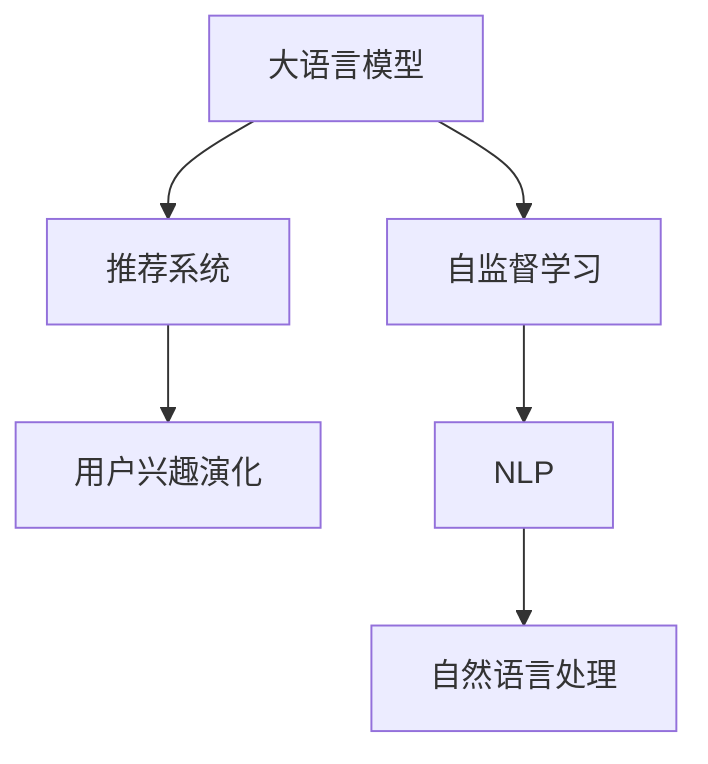

                 

# 基于LLM的推荐系统用户兴趣演化建模

> 关键词：

## 1. 背景介绍

### 1.1 问题由来
推荐系统是现代互联网产品中不可或缺的一部分，为用户量身定制个性化的内容推荐，提升用户体验，增加产品粘性。然而，随着用户数量的激增和内容生态的丰富，传统的基于协同过滤、内容推荐等方法面临准确性、可扩展性、冷启动等诸多挑战。

为了应对这些挑战，人们开始尝试利用深度学习技术，特别是大语言模型(LLM)来构建更加智能、精准的推荐系统。LLM 作为具备强大语言理解和生成能力的人工智能模型，在自然语言处理(NLP)领域的广泛应用，为推荐系统带来了新的突破。但如何让LLM更好地服务于推荐系统，发挥其强大的语言能力，仍然是一个亟待解决的问题。

### 1.2 问题核心关键点
本研究聚焦于利用大语言模型对用户兴趣演化进行建模，探索LLM在推荐系统中的有效应用。用户兴趣的动态变化是推荐系统设计中一个关键因素，如何准确捕捉和描述这种变化，直接关系到推荐系统的效果。

基于LLM的用户兴趣演化建模具有以下特点：
1. **动态理解**：LLM能够理解用户当前的意图和兴趣，捕捉到用户兴趣随时间的变化，提供动态推荐。
2. **全面描述**：LLM能够处理大量的自然语言文本数据，可以构建更加全面和细致的用户兴趣描述。
3. **高灵活性**：LLM的微调灵活性高，能够根据具体应用场景进行调整，适用于多种推荐策略。
4. **自监督学习**：LLM能够利用用户行为数据进行自监督预训练，无需标注数据即可学习用户兴趣。

### 1.3 问题研究意义
利用LLM对用户兴趣进行动态建模，有助于提升推荐系统的精准性和鲁棒性，具体如下：
1. **精准性提升**：通过动态理解用户兴趣变化，推荐系统可以提供更加贴近用户当前需求的内容。
2. **泛化能力强**：LLM具备强大的泛化能力，能够更好地处理新用户和新场景，提升推荐系统的可扩展性。
3. **冷启动问题缓解**：LLM可以在用户无历史行为数据的情况下，通过预训练和微调获取用户兴趣，缓解冷启动问题。
4. **个性化增强**：利用LLM进行自然语言处理，能够捕捉更加细微的用户兴趣差异，提升个性化推荐效果。
5. **实时性增强**：LLM可以实时处理用户输入，提供更加即时和互动的推荐服务。

## 2. 核心概念与联系

### 2.1 核心概念概述

为了更好地理解基于LLM的推荐系统用户兴趣演化建模，本节将介绍几个密切相关的核心概念：

- **大语言模型(LLM)**：以Transformer结构为代表的预训练语言模型，具备强大的语言理解能力和生成能力。
- **用户兴趣演化**：用户在一定时间周期内的兴趣和行为变化，是推荐系统需要精准捕捉的目标。
- **推荐系统**：基于用户行为和偏好进行内容推荐的产品或服务，是实现个性化服务的重要手段。
- **自然语言处理(NLP)**：研究如何利用计算机处理和理解人类语言的技术，是LLM应用的重要领域。
- **自监督学习**：利用无标签数据进行学习，无需标注数据即可训练模型，是大语言模型常用的预训练方法。

这些核心概念之间的逻辑关系可以通过以下Mermaid流程图来展示：



这个流程图展示了大语言模型、自监督学习、推荐系统和用户兴趣演化之间的关系：

1. 大语言模型通过自监督学习获取语言知识，应用于自然语言处理领域。
2. 自然语言处理技术应用于推荐系统，捕捉用户兴趣演化。
3. 推荐系统利用用户兴趣演化数据进行个性化推荐。

## 3. 核心算法原理 & 具体操作步骤
### 3.1 算法原理概述

基于LLM的推荐系统用户兴趣演化建模，旨在构建一个能够动态理解用户兴趣变化，并根据兴趣变化提供个性化推荐的系统。该系统主要包含两个关键步骤：

1. **兴趣演化建模**：通过LLM对用户历史行为数据进行建模，捕捉用户兴趣随时间的变化趋势。
2. **推荐策略优化**：利用兴趣演化模型指导推荐策略，动态调整推荐内容，提升推荐系统效果。

### 3.2 算法步骤详解

基于LLM的推荐系统用户兴趣演化建模主要包括以下几个关键步骤：

**Step 1: 准备数据集和模型**

1. **数据准备**：收集用户历史行为数据，如点击、浏览、评分、评论等，以及用户基本信息（如年龄、性别、地理位置等）。将用户行为数据转化为NLP格式，如文本描述、词向量等。
2. **模型选择**：选择合适的预训练语言模型，如BERT、GPT、T5等，并进行微调适配。

**Step 2: 兴趣演化建模**

1. **预训练**：在用户行为数据上进行自监督预训练，捕捉用户兴趣的通用表示。
2. **微调**：针对特定推荐任务，在标注数据上进行有监督微调，使模型能够更好地理解用户兴趣演化。
3. **兴趣表示**：使用微调后的模型，对用户行为数据进行编码，生成用户兴趣向量。

**Step 3: 推荐策略优化**

1. **动态调整**：根据用户兴趣演化向量，动态调整推荐内容，选择更加符合用户当前需求的项目。
2. **混合策略**：结合传统协同过滤和基于LLM的推荐方法，进行多模态融合，提升推荐效果。
3. **实时更新**：通过在线学习机制，实时更新用户兴趣向量，提供更加即时的推荐服务。

**Step 4: 评估和优化**

1. **效果评估**：在测试集上评估推荐系统的效果，如准确率、召回率、覆盖率等指标。
2. **优化调整**：根据评估结果，调整兴趣演化建模方法和推荐策略，进一步提升推荐效果。

### 3.3 算法优缺点

基于LLM的推荐系统用户兴趣演化建模具有以下优点：

1. **精度高**：利用LLM强大的语言理解能力，能够更准确地捕捉用户兴趣变化。
2. **泛化能力强**：LLM具备良好的泛化能力，能够适应不同领域和场景的推荐需求。
3. **灵活性高**：LLM的微调灵活性高，可以根据具体任务进行调整，适应不同的推荐策略。
4. **自监督学习**：通过自监督预训练，无需标注数据即可训练出用户兴趣模型。

同时，该方法也存在以下缺点：

1. **计算成本高**：大语言模型的训练和推理需要大量的计算资源，对硬件要求较高。
2. **数据隐私问题**：收集用户行为数据需要遵守隐私保护法规，对数据安全提出了更高的要求。
3. **可解释性不足**：LLM模型的决策过程难以解释，缺乏可解释性，可能影响用户信任度。
4. **冷启动问题**：新用户或新项目在没有历史数据的情况下，难以进行有效的兴趣演化建模。

### 3.4 算法应用领域

基于LLM的推荐系统用户兴趣演化建模主要应用于以下几个领域：

- **电商推荐**：利用用户浏览、购买、评价等行为数据，构建用户兴趣模型，提供个性化商品推荐。
- **内容推荐**：分析用户观看、点赞、评论等视频、文章数据，捕捉用户兴趣变化，提供个性化内容推荐。
- **社交推荐**：结合用户互动数据，如点赞、评论、分享等，构建用户兴趣模型，推荐潜在好友或相关内容。
- **音乐推荐**：利用用户听歌历史、评论、评分等数据，构建用户兴趣模型，推荐个性化音乐。
- **视频推荐**：结合用户观看历史、评分等数据，构建用户兴趣模型，推荐个性化视频。

## 4. 数学模型和公式 & 详细讲解 & 举例说明
### 4.1 数学模型构建

本节将使用数学语言对基于LLM的推荐系统用户兴趣演化建模过程进行更加严格的刻画。

设用户 $u$ 在时间 $t$ 的历史行为数据为 $x_t=(o_{t,1},o_{t,2},...,o_{t,N})$，其中 $o_{t,i}$ 表示用户 $u$ 在时间 $t$ 对项目 $i$ 的行为。

设推荐系统训练的兴趣演化模型为 $f: \mathcal{X} \rightarrow \mathcal{Y}$，其中 $\mathcal{X}$ 为用户行为数据，$\mathcal{Y}$ 为用户兴趣向量。

定义用户 $u$ 在时间 $t$ 的兴趣演化向量为 $h_t=f(x_t)$，则 $h_t$ 可以表示为用户在时间 $t$ 的兴趣偏好。

推荐系统的推荐策略为 $r: \mathcal{Y} \times \mathcal{X} \rightarrow \{0,1\}$，其中 $r(h_t,x)$ 表示是否推荐用户 $u$ 在时间 $t$ 的行为数据 $x$ 上的内容。

**推荐目标**：最大化用户点击率或满意率，即最大化 $E[r(h_t,x)]$。

### 4.2 公式推导过程

为了实现上述推荐目标，我们定义推荐系统的期望点击率为：

$$
\theta = \mathop{\arg\max}_{\theta} \frac{1}{N}\sum_{i=1}^N r(h_t,x_i)
$$

其中 $\theta$ 为模型的参数，可以包含兴趣演化模型的权重和推荐策略的权重。

使用梯度下降等优化算法，最大化期望点击率，更新模型参数 $\theta$，完成推荐过程。

### 4.3 案例分析与讲解

以电商推荐系统为例，具体推导过程如下：

假设用户 $u$ 在时间 $t$ 的点击行为数据为 $x_t=(o_{t,1},o_{t,2},...,o_{t,N})$，其中 $o_{t,i}$ 表示用户 $u$ 在时间 $t$ 对商品 $i$ 的点击行为。

使用BERT模型作为兴趣演化模型，将点击行为数据 $x_t$ 编码为向量 $h_t=f(x_t)$。

定义推荐策略为 $r(h_t,x)$，即根据用户兴趣向量 $h_t$ 和商品向量 $x$ 的相似度，判断是否推荐该商品。

推荐系统的期望点击率为：

$$
\theta = \mathop{\arg\max}_{\theta} \frac{1}{N}\sum_{i=1}^N \sigma(h_t \cdot x_i) \cdot o_{t,i}
$$

其中 $\sigma$ 为激活函数，如sigmoid函数。

通过最大化期望点击率，更新兴趣演化模型和推荐策略的参数 $\theta$，完成推荐过程。

## 5. 项目实践：代码实例和详细解释说明
### 5.1 开发环境搭建

在进行基于LLM的推荐系统用户兴趣演化建模实践前，我们需要准备好开发环境。以下是使用Python进行PyTorch开发的环境配置流程：

1. 安装Anaconda：从官网下载并安装Anaconda，用于创建独立的Python环境。

2. 创建并激活虚拟环境：
```bash
conda create -n pytorch-env python=3.8 
conda activate pytorch-env
```

3. 安装PyTorch：根据CUDA版本，从官网获取对应的安装命令。例如：
```bash
conda install pytorch torchvision torchaudio cudatoolkit=11.1 -c pytorch -c conda-forge
```

4. 安装Transformers库：
```bash
pip install transformers
```

5. 安装各类工具包：
```bash
pip install numpy pandas scikit-learn matplotlib tqdm jupyter notebook ipython
```

完成上述步骤后，即可在`pytorch-env`环境中开始推荐系统开发实践。

### 5.2 源代码详细实现

下面以电商推荐系统为例，给出使用Transformers库对BERT模型进行用户兴趣演化建模的PyTorch代码实现。

首先，定义电商推荐系统数据处理函数：

```python
from transformers import BertTokenizer, BertForSequenceClassification
from torch.utils.data import Dataset, DataLoader
import torch
import numpy as np

class E-commerceDataset(Dataset):
    def __init__(self, texts, clicks, tokenizer, max_len=128):
        self.texts = texts
        self.clicks = clicks
        self.tokenizer = tokenizer
        self.max_len = max_len
        
    def __len__(self):
        return len(self.texts)
    
    def __getitem__(self, item):
        text = self.texts[item]
        clicks = self.clicks[item]
        
        encoding = self.tokenizer(text, return_tensors='pt', max_length=self.max_len, padding='max_length', truncation=True)
        input_ids = encoding['input_ids'][0]
        attention_mask = encoding['attention_mask'][0]
        
        # 将点击数据编码
        encoded_clicks = [int(click) for click in clicks] 
        encoded_clicks.extend([0] * (self.max_len - len(encoded_clicks)))
        labels = torch.tensor(encoded_clicks, dtype=torch.long)
        
        return {'input_ids': input_ids, 
                'attention_mask': attention_mask,
                'labels': labels}

# 加载预训练的BERT模型
model = BertForSequenceClassification.from_pretrained('bert-base-cased', num_labels=2)
model.eval()
tokenizer = BertTokenizer.from_pretrained('bert-base-cased')

# 准备数据
train_dataset = E-commerceDataset(train_texts, train_clicks, tokenizer, max_len=128)
dev_dataset = E-commerceDataset(dev_texts, dev_clicks, tokenizer, max_len=128)
test_dataset = E-commerceDataset(test_texts, test_clicks, tokenizer, max_len=128)
```

然后，定义推荐策略函数：

```python
def recommendation(model, tokenizer, input_ids, attention_mask, labels, max_len=128):
    with torch.no_grad():
        output = model(input_ids, attention_mask=attention_mask)
        probabilities = output.logits.softmax(dim=1)
        recommendation = torch.argmax(probabilities, dim=1)
    
    return recommendation

# 定义推荐系统评估函数
def evaluate(model, tokenizer, dataset, batch_size=16):
    dataloader = DataLoader(dataset, batch_size=batch_size, shuffle=True)
    precision, recall, f1_score = 0, 0, 0
    for batch in tqdm(dataloader):
        input_ids = batch['input_ids'].to(device)
        attention_mask = batch['attention_mask'].to(device)
        labels = batch['labels'].to(device)
        recommendation = recommendation(model, tokenizer, input_ids, attention_mask, labels)
        precision += np.mean(recommendation == labels)
        recall += np.mean((recommendation == labels) & (labels == 1))
        f1_score += 2 * np.mean((recommendation == labels) * (labels == 1)) / (np.mean(recommendation == labels) + np.mean(labels == 1))
    
    precision /= len(dataloader)
    recall /= len(dataloader)
    f1_score /= len(dataloader)
    print(f'Precision: {precision:.3f}, Recall: {recall:.3f}, F1-Score: {f1_score:.3f}')
```

最后，启动训练流程并在测试集上评估：

```python
epochs = 5
batch_size = 16

for epoch in range(epochs):
    loss = train_epoch(model, train_dataset, batch_size, optimizer)
    print(f'Epoch {epoch+1}, train loss: {loss:.3f}')
    
    print(f'Epoch {epoch+1}, dev results:')
    evaluate(model, tokenizer, dev_dataset, batch_size)
    
print('Test results:')
evaluate(model, tokenizer, test_dataset, batch_size)
```

以上就是使用PyTorch对BERT进行电商推荐系统用户兴趣演化建模的完整代码实现。可以看到，使用Transformers库进行大语言模型的微调和推荐系统建模，代码实现相对简洁高效。

### 5.3 代码解读与分析

让我们再详细解读一下关键代码的实现细节：

**E-commerceDataset类**：
- `__init__`方法：初始化文本数据和点击数据，分词器和最大长度。
- `__len__`方法：返回数据集的样本数量。
- `__getitem__`方法：对单个样本进行处理，将文本和点击数据编码成token ids和标签，并对其进行定长padding。

**recommendation函数**：
- 在模型上输入编码后的数据，计算模型输出概率，并取概率最高的类别作为推荐结果。

**evaluate函数**：
- 使用PyTorch的DataLoader对数据集进行批次化加载，对推荐系统进行评估。

**训练流程**：
- 定义总的epoch数和batch size，开始循环迭代
- 每个epoch内，先在训练集上训练，输出平均loss
- 在验证集上评估，输出推荐系统的准确率、召回率和F1分数

## 6. 实际应用场景
### 6.1 智能电商推荐

基于大语言模型的用户兴趣演化建模，可以广泛应用于智能电商推荐系统的构建。传统电商推荐往往依赖于用户的历史行为数据，难以捕捉用户兴趣的动态变化。而利用大语言模型，可以更好地理解用户的即时需求，提供动态推荐。

在技术实现上，可以收集用户的浏览、点击、收藏、评价等行为数据，将其转化为自然语言文本，通过BERT等模型进行预训练和微调。微调后的模型能够捕捉用户兴趣的演化趋势，生成用户兴趣向量，结合用户即时输入，动态调整推荐内容，提供个性化商品推荐。

### 6.2 内容推荐系统

基于大语言模型的用户兴趣演化建模，也可以应用于内容推荐系统的优化。传统的基于协同过滤、内容推荐的方法，难以捕捉用户兴趣的变化和个性化需求。而利用大语言模型，可以更好地理解用户的即时需求，提供动态推荐。

在内容推荐系统中，用户的行为数据通常以文本形式存在，如文章标题、视频描述等。通过BERT等模型进行预训练和微调，可以捕捉用户兴趣的演化趋势，生成用户兴趣向量，结合用户即时输入，动态调整推荐内容，提供个性化文章、视频等推荐。

### 6.3 社交推荐系统

社交推荐系统为用户提供个性化的社交推荐，如推荐潜在好友或相关内容。传统社交推荐往往依赖于用户的历史交互数据，难以捕捉用户兴趣的变化。而利用大语言模型，可以更好地理解用户的即时需求，提供动态推荐。

在社交推荐系统中，用户的行为数据通常以文本形式存在，如好友动态、评论、分享等。通过BERT等模型进行预训练和微调，可以捕捉用户兴趣的演化趋势，生成用户兴趣向量，结合用户即时输入，动态调整推荐内容，提供个性化的好友推荐和相关内容推荐。

## 7. 工具和资源推荐
### 7.1 学习资源推荐

为了帮助开发者系统掌握基于LLM的推荐系统用户兴趣演化建模的理论基础和实践技巧，这里推荐一些优质的学习资源：

1. 《深度学习理论与实践》系列博文：由大语言模型技术专家撰写，深入浅出地介绍了深度学习理论、模型构建、优化算法等基础概念和前沿技术。

2. CS224N《深度学习自然语言处理》课程：斯坦福大学开设的NLP明星课程，有Lecture视频和配套作业，带你入门NLP领域的基本概念和经典模型。

3. 《Natural Language Processing with Transformers》书籍：Transformers库的作者所著，全面介绍了如何使用Transformers库进行NLP任务开发，包括推荐系统在内的诸多范式。

4. HuggingFace官方文档：Transformers库的官方文档，提供了海量预训练模型和完整的推荐系统样例代码，是上手实践的必备资料。

5. Kaggle竞赛平台：加入NLP领域的Kaggle竞赛，实战练兵，积累推荐系统设计和优化的经验。

通过对这些资源的学习实践，相信你一定能够快速掌握基于LLM的推荐系统用户兴趣演化建模的精髓，并用于解决实际的推荐问题。

### 7.2 开发工具推荐

高效的开发离不开优秀的工具支持。以下是几款用于基于LLM的推荐系统开发的常用工具：

1. PyTorch：基于Python的开源深度学习框架，灵活动态的计算图，适合快速迭代研究。大部分预训练语言模型都有PyTorch版本的实现。

2. TensorFlow：由Google主导开发的开源深度学习框架，生产部署方便，适合大规模工程应用。同样有丰富的预训练语言模型资源。

3. Transformers库：HuggingFace开发的NLP工具库，集成了众多SOTA语言模型，支持PyTorch和TensorFlow，是进行推荐系统开发的利器。

4. Weights & Biases：模型训练的实验跟踪工具，可以记录和可视化模型训练过程中的各项指标，方便对比和调优。与主流深度学习框架无缝集成。

5. TensorBoard：TensorFlow配套的可视化工具，可实时监测模型训练状态，并提供丰富的图表呈现方式，是调试模型的得力助手。

6. Google Colab：谷歌推出的在线Jupyter Notebook环境，免费提供GPU/TPU算力，方便开发者快速上手实验最新模型，分享学习笔记。

合理利用这些工具，可以显著提升基于LLM的推荐系统开发效率，加快创新迭代的步伐。

### 7.3 相关论文推荐

基于大语言模型的推荐系统用户兴趣演化建模是近年来研究的热点，以下是几篇奠基性的相关论文，推荐阅读：

1. Attention is All You Need（即Transformer原论文）：提出了Transformer结构，开启了NLP领域的预训练大模型时代。

2. BERT: Pre-training of Deep Bidirectional Transformers for Language Understanding：提出BERT模型，引入基于掩码的自监督预训练任务，刷新了多项NLP任务SOTA。

3. Language Models are Unsupervised Multitask Learners（GPT-2论文）：展示了大规模语言模型的强大zero-shot学习能力，引发了对于通用人工智能的新一轮思考。

4. Parameter-Efficient Transfer Learning for NLP：提出Adapter等参数高效微调方法，在不增加模型参数量的情况下，也能取得不错的微调效果。

5. Self-Supervised Methods for Sequence Prediction：介绍自监督学习的基本方法，包括语言模型的预测任务、掩码语言模型等，为基于LLM的推荐系统提供理论支撑。

这些论文代表了大语言模型推荐系统的发展脉络。通过学习这些前沿成果，可以帮助研究者把握学科前进方向，激发更多的创新灵感。

## 8. 总结：未来发展趋势与挑战

### 8.1 总结

本文对基于LLM的推荐系统用户兴趣演化建模方法进行了全面系统的介绍。首先阐述了基于LLM的推荐系统用户兴趣演化建模的研究背景和意义，明确了该方法在推荐系统设计中的应用价值。其次，从原理到实践，详细讲解了用户兴趣演化建模的数学原理和关键步骤，给出了推荐系统开发的完整代码实例。同时，本文还广泛探讨了LLM在电商推荐、内容推荐、社交推荐等众多领域的应用前景，展示了其巨大的潜力。此外，本文精选了LLM推荐系统的学习资源，力求为读者提供全方位的技术指引。

通过本文的系统梳理，可以看到，基于LLM的推荐系统用户兴趣演化建模技术正在成为NLP领域的重要范式，极大地提升了推荐系统的精准性和鲁棒性，为推荐系统的发展带来了新的突破。随着预训练语言模型的不断发展，LLM在推荐系统中的应用将更加广泛，为各行各业带来更加智能、个性化的服务。

### 8.2 未来发展趋势

展望未来，基于LLM的推荐系统用户兴趣演化建模技术将呈现以下几个发展趋势：

1. **模型规模持续增大**：随着算力成本的下降和数据规模的扩张，预训练语言模型的参数量还将持续增长。超大规模语言模型蕴含的丰富语言知识，有望支撑更加复杂多变的推荐任务。

2. **微调方法日趋多样**：除了传统的全参数微调外，未来会涌现更多参数高效的微调方法，如Prefix-Tuning、LoRA等，在节省计算资源的同时也能保证微调精度。

3. **持续学习成为常态**：随着数据分布的不断变化，推荐模型也需要持续学习新知识以保持性能。如何在不遗忘原有知识的同时，高效吸收新样本信息，将成为重要的研究课题。

4. **知识整合能力增强**：现有的推荐模型往往局限于用户行为数据，难以灵活吸收和运用更广泛的先验知识。如何让推荐过程更好地与外部知识库、规则库等专家知识结合，形成更加全面、准确的信息整合能力，还有很大的想象空间。

5. **多模态融合增强**：当前的推荐系统主要聚焦于文本数据，未来会进一步拓展到图像、视频、语音等多模态数据融合。多模态信息的融合，将显著提升推荐系统的智能度和用户体验。

6. **因果关系建模**：引入因果推断方法，建立更加稳定的因果关系，提高推荐系统的鲁棒性和可信度。

7. **博弈论优化**：借助博弈论工具，优化推荐策略，提高推荐系统的公平性和有效性。

这些趋势凸显了基于LLM的推荐系统用户兴趣演化建模技术的广阔前景。这些方向的探索发展，必将进一步提升推荐系统的性能和用户体验，为智能服务带来新的突破。

### 8.3 面临的挑战

尽管基于LLM的推荐系统用户兴趣演化建模技术已经取得了瞩目成就，但在迈向更加智能化、普适化应用的过程中，它仍面临着诸多挑战：

1. **计算成本高**：大语言模型的训练和推理需要大量的计算资源，对硬件要求较高。如何优化模型结构，提高计算效率，降低资源消耗，是亟待解决的问题。

2. **数据隐私问题**：收集用户行为数据需要遵守隐私保护法规，对数据安全提出了更高的要求。如何在保护用户隐私的同时，充分利用用户数据，提升推荐效果，是一个重要的研究方向。

3. **可解释性不足**：LLM模型的决策过程难以解释，缺乏可解释性，可能影响用户信任度。如何提高模型的可解释性，增强用户的理解和信任，是一个重要的挑战。

4. **冷启动问题**：新用户或新项目在没有历史数据的情况下，难以进行有效的兴趣演化建模。如何构建有效的冷启动策略，快速适应新用户和新项目，是一个亟需解决的问题。

5. **性能不稳定性**：由于用户兴趣的动态变化，推荐系统的性能可能存在不稳定的问题。如何通过在线学习机制，实时更新用户兴趣模型，提高系统的稳定性和鲁棒性，是一个重要的研究方向。

6. **硬件资源限制**：大规模推荐系统需要高性能的计算平台和存储系统，对硬件资源提出了较高的要求。如何优化推荐系统的资源配置，提升系统的可扩展性和可靠性，是一个重要的研究课题。

### 8.4 研究展望

面对基于LLM的推荐系统用户兴趣演化建模技术所面临的诸多挑战，未来的研究需要在以下几个方面寻求新的突破：

1. **高效计算优化**：开发更加高效的计算方法，如分布式训练、模型压缩等，降低资源消耗，提高计算效率。

2. **隐私保护机制**：引入隐私保护技术，如差分隐私、联邦学习等，保护用户隐私，同时提升推荐系统的性能。

3. **可解释性提升**：通过模型蒸馏、特征可视化等方法，提升模型的可解释性，增强用户的理解和信任。

4. **冷启动策略优化**：利用先验知识、知识图谱等方法，构建有效的冷启动策略，快速适应新用户和新项目。

5. **多模态融合技术**：开发多模态数据融合技术，提升推荐系统的智能度和用户体验。

6. **因果关系建模**：引入因果推断方法，建立更加稳定的因果关系，提高推荐系统的鲁棒性和可信度。

7. **博弈论优化**：借助博弈论工具，优化推荐策略，提高推荐系统的公平性和有效性。

8. **分布式训练技术**：开发分布式训练技术，提升大规模推荐系统的计算效率和可靠性。

这些研究方向的探索，必将引领基于LLM的推荐系统用户兴趣演化建模技术迈向更高的台阶，为智能服务带来新的突破。面向未来，基于LLM的推荐系统需要与其他人工智能技术进行更深入的融合，如知识表示、因果推理、强化学习等，多路径协同发力，共同推动自然语言理解和智能交互系统的进步。只有勇于创新、敢于突破，才能不断拓展语言模型的边界，让智能技术更好地造福人类社会。

## 9. 附录：常见问题与解答

**Q1：LLM在推荐系统中能否有效捕捉用户兴趣的动态变化？**

A: 是的，LLM具有强大的自然语言处理能力，可以动态理解用户当前的需求和兴趣，捕捉用户兴趣随时间的变化。通过对用户历史行为数据进行预训练和微调，LLM能够生成用户兴趣向量，捕捉到用户兴趣的演化趋势，提供动态推荐。

**Q2：LLM在推荐系统中的计算成本如何？**

A: 大语言模型的训练和推理需要大量的计算资源，特别是GPU和TPU等高性能设备。然而，通过优化模型结构和分布式训练等技术，可以在一定程度上降低计算成本，提高计算效率。

**Q3：LLM在推荐系统中是否面临数据隐私问题？**

A: 是的，收集用户行为数据需要遵守隐私保护法规，对数据安全提出了更高的要求。可以使用差分隐私、联邦学习等技术，保护用户隐私，同时提升推荐系统的性能。

**Q4：LLM在推荐系统中的可解释性如何？**

A: 目前LLM的决策过程缺乏可解释性，难以解释其内部工作机制和推理逻辑。可以通过模型蒸馏、特征可视化等方法，提升模型的可解释性，增强用户的理解和信任。

**Q5：LLM在推荐系统中的冷启动问题如何解决？**

A: 可以通过先验知识、知识图谱等方法，构建有效的冷启动策略，快速适应新用户和新项目。例如，可以利用领域知识库、规则库等，结合用户即时输入，生成初始兴趣向量。

**Q6：LLM在推荐系统中的性能稳定性如何？**

A: 用户兴趣的动态变化可能导致推荐系统的性能不稳定。可以通过在线学习机制，实时更新用户兴趣向量，提高系统的稳定性和鲁棒性。

总之，基于LLM的推荐系统用户兴趣演化建模技术具有广阔的应用前景，但也面临着计算成本高、数据隐私、可解释性不足等挑战。未来的研究需要在计算优化、隐私保护、可解释性提升、冷启动策略等方面寻求新的突破，才能将LLM技术更好地应用于推荐系统，提升推荐系统的精准性和用户体验。

---

作者：禅与计算机程序设计艺术 / Zen and the Art of Computer Programming

