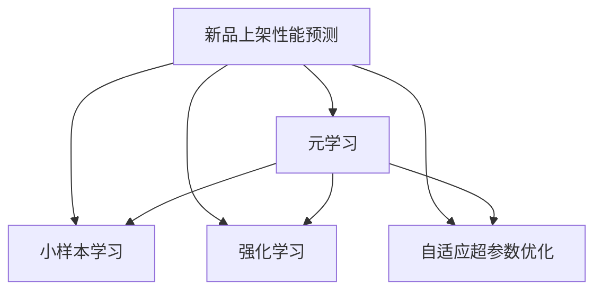

                 

# 基于元学习的新品上架性能预测

## 1. 背景介绍

随着电子商务的迅猛发展，商家对于新品的上架策略越来越重视。然而，由于市场环境变化多端、消费者偏好难以预测，商家在上架新产品时往往面临诸多不确定性。传统的方法依赖专家经验进行直觉判断，但在现代复杂多变的市场环境中，这种方法已难以满足实际需求。基于此，本文将探讨一种新型的预测方法——基于元学习的新品上架性能预测，并结合实际应用案例，展示其优势与潜力。

### 1.1 问题由来

在电商平台上，商家上架新品的目标在于最大化销售收益。然而，销售量受多种因素影响，如产品价格、库存量、市场竞争、消费者反馈等。通过数据分析发现，尽管商家会依据历史销售数据和市场分析进行新品上架决策，但仍面临诸多挑战：

- **数据复杂性**：电商数据维度高、实时变化，数据收集与处理成本高。
- **数据稀疏性**：某些细分市场或新品在历史数据中缺乏样本，预测难度大。
- **动态变化**：市场需求和消费者偏好随时间变化，单靠静态历史数据难以准确预测。
- **多重因素**：销售数据受多重因素影响，单一模型难以全面考虑。

因此，传统的数据驱动预测方法难以应对这些复杂挑战，急需一种更加智能、自适应的预测方式。

### 1.2 问题核心关键点

本文聚焦于基于元学习的新品上架性能预测方法，主要关注以下关键点：

- 通过元学习（Meta-Learning）框架，构建适应性更强的预测模型。
- 基于小样本学习（Few-shot Learning），利用有限数据构建高性能预测模型。
- 引入自适应超参数优化算法（Adaptive Hyperparameter Optimization），确保模型高效运行。
- 结合强化学习（Reinforcement Learning），通过动态调整模型策略，优化预测性能。

元学习作为一种新兴的机器学习方法，通过学习如何在不同任务上快速适应，能够解决数据稀疏性和动态变化的问题，为新品上架性能预测提供了一种新的可能。

## 2. 核心概念与联系

### 2.1 核心概念概述

为了更好地理解基于元学习的新品上架性能预测方法，本节将介绍几个核心概念：

- **元学习（Meta-Learning）**：元学习是一种机器学习方法，通过学习任务之间的相似性，快速适应新任务，显著提高模型的泛化能力。元学习框架包括Meta-Learning Agent和Meta-Environment。
- **小样本学习（Few-shot Learning）**：小样本学习是指模型仅使用少量样本进行训练，即可在目标任务上获得良好性能。这可以大大降低数据收集和处理的成本。
- **强化学习（Reinforcement Learning, RL）**：强化学习是一种通过试错机制优化策略的机器学习方法，模型通过与环境互动，逐步调整策略，优化性能。
- **自适应超参数优化**：通过动态调整模型超参数，优化模型性能。元学习框架中，自适应超参数优化可以提高模型在不同任务上的表现。

这些核心概念之间的逻辑关系可以通过以下Mermaid流程图来展示：



这个流程图展示了几大核心概念与新品上架性能预测的联系：

1. 新品上架性能预测通过元学习框架，利用小样本学习和小样本数据进行训练。
2. 小样本学习在元学习框架下，通过强化学习不断优化模型策略。
3. 自适应超参数优化在元学习框架下，通过动态调整模型参数，提升模型性能。

这些概念共同构成了基于元学习的新品上架性能预测的框架，使得模型能够更好地应对数据稀疏性和市场动态变化。

## 3. 核心算法原理 & 具体操作步骤

### 3.1 算法原理概述

基于元学习的新品上架性能预测方法，本质上是一个元学习范式下的预测任务。其核心思想是：通过构建一个适应性更强的元学习模型，利用小样本学习和小样本数据，快速预测新品的销售性能。

形式化地，假设商品上架的销售量可以表示为 $y=\phi(x;\theta)$，其中 $x$ 为上架时间、价格、库存等因素，$\theta$ 为模型参数。我们的目标是通过元学习框架，学习一个元学习模型 $M$，使得其在不同场景下可以快速适应新的商品数据 $(x_i,y_i)$，预测出销售量 $y_i$。具体步骤如下：

1. 收集历史数据集 $\mathcal{D}=\{(x_i,y_i)\}_{i=1}^N$，其中 $x_i$ 为历史数据，$y_i$ 为实际销售量。
2. 利用小样本学习框架，构建元学习模型 $M$。
3. 通过强化学习算法，优化元学习模型参数 $\theta$。
4. 在新品上架时，将新数据 $(x_i,y_i)$ 输入元学习模型，预测销售量 $y_i$。

### 3.2 算法步骤详解

基于元学习的新品上架性能预测方法一般包括以下几个关键步骤：

**Step 1: 数据收集与处理**
- 收集历史商品上架销售数据，涵盖时间、价格、库存、促销等影响因素。
- 将数据预处理为模型所需格式，如时间序列数据、特征向量等。

**Step 2: 构建元学习框架**
- 选择元学习算法，如Meta-Learning Agent（如ProtoNet、MAML等），作为预测模型。
- 定义元学习环境（Meta-Environment），包括数据生成器、损失函数等。
- 设置元学习模型的超参数，如学习率、迭代次数等。

**Step 3: 小样本学习**
- 收集少量新商品数据，作为元学习模型的输入。
- 利用小样本学习算法，如Few-shot Learning（如Matching Pursuit、Siamese Network等），构建元学习模型的初始权重。
- 在小样本数据集上训练元学习模型，使其适应新数据分布。

**Step 4: 强化学习优化**
- 定义强化学习环境，如奖励函数、状态空间等。
- 在历史数据集上运行元学习模型，利用强化学习算法（如REINFORCE、PPO等），不断调整模型参数，优化预测性能。
- 通过动态调整超参数，进一步提升模型效果。

**Step 5: 预测与部署**
- 在新品上架时，将新数据输入元学习模型，预测销售量。
- 将预测结果作为上架策略的参考，优化库存管理和促销策略。
- 定期更新元学习模型，适应市场变化。

以上是基于元学习的新品上架性能预测的一般流程。在实际应用中，还需要根据具体任务特点，对各个环节进行优化设计，如改进数据生成器、调整奖励函数、优化超参数等，以进一步提升模型性能。

### 3.3 算法优缺点

基于元学习的新品上架性能预测方法具有以下优点：
1. 自适应能力强：模型能够快速适应新任务和新数据分布，预测性能稳定。
2. 泛化能力强：通过元学习框架，模型在有限数据上训练即可获得良好效果。
3. 鲁棒性高：模型对数据变化和噪声具有较强的鲁棒性。
4. 低成本：数据收集和处理成本低，适合电商等数据密集型行业。

同时，该方法也存在一定的局限性：
1. 模型复杂度高：元学习模型的复杂性可能较高，训练和部署成本较高。
2. 数据需求量大：在元学习过程中，可能需要大量标注数据进行训练，获取这些数据成本较高。
3. 训练时间长：由于模型复杂度高，训练和优化过程较耗时。
4. 可解释性差：元学习模型通常较复杂，其内部工作机制难以解释。

尽管存在这些局限性，但就目前而言，基于元学习的新品上架性能预测方法仍是一种高效、稳定且具有潜力的预测方式。未来相关研究的重点在于如何进一步降低模型复杂度，提升训练效率，同时兼顾模型的可解释性和鲁棒性。

### 3.4 算法应用领域

基于元学习的新品上架性能预测方法，在电商、金融、物流等多个领域都有广泛的应用前景：

- **电商领域**：用于预测新品上架的销售量，优化库存管理和促销策略，提升用户满意度。
- **金融领域**：用于预测新金融产品的表现，评估其市场风险，优化投资组合。
- **物流领域**：用于预测货物运输的效率和成本，优化物流路径和仓储管理。
- **医疗领域**：用于预测新药物的临床效果，加速药物研发和上市。

除了上述这些领域，元学习框架还具备更广泛的应用潜力，如智能制造、智能交通等，为各行业带来智能化的决策支持。

## 4. 数学模型和公式 & 详细讲解 & 举例说明

### 4.1 数学模型构建

本节将使用数学语言对基于元学习的新品上架性能预测过程进行更加严格的刻画。

假设历史数据集 $\mathcal{D}=\{(x_i,y_i)\}_{i=1}^N$，其中 $x_i$ 为历史数据，$y_i$ 为实际销售量。我们的目标是构建一个元学习模型 $M$，使得其在不同场景下可以快速适应新的商品数据 $(x_i,y_i)$，预测出销售量 $y_i$。

定义元学习模型为 $M_{\theta}(x)$，其中 $\theta$ 为模型参数。设 $\mathcal{L}_{meta}$ 为元学习的损失函数，$\mathcal{L}_{few-shot}$ 为小样本学习的损失函数，$\mathcal{L}_{rl}$ 为强化学习的损失函数。则元学习模型的训练目标为：

$$
\min_{\theta} \mathcal{L}_{meta}(\theta) = \frac{1}{N} \sum_{i=1}^N [\mathcal{L}_{few-shot}(M_{\theta}(x_i),y_i) + \mathcal{L}_{rl}(M_{\theta}(x_i))]
$$

其中 $\mathcal{L}_{few-shot}$ 和 $\mathcal{L}_{rl}$ 分别代表小样本学习和强化学习的损失函数，具体形式由具体算法决定。

### 4.2 公式推导过程

以下我们以ProtoNet算法为例，推导元学习模型的小样本学习过程。

ProtoNet是一种基于元学习的Few-shot Learning算法，其核心思想是通过对历史数据和少量新数据进行联合训练，构建元学习模型的初始权重。假设现有 $K$ 种商品，每种商品的元学习模型为 $M_k$，则ProtoNet算法通过以下步骤进行小样本学习：

1. 随机选择少量新商品数据 $x_i^{new}$，作为元学习模型的输入。
2. 在历史数据集 $\mathcal{D}$ 上运行元学习模型 $M_k$，得到预测结果 $y_i^{pred} = M_k(x_i^{new})$。
3. 计算预测结果与实际销售量之间的损失函数 $\mathcal{L}_k = \frac{1}{N} \sum_{i=1}^N (y_i^{pred}-y_i)^2$。
4. 更新元学习模型 $M_k$ 的权重，以最小化损失函数 $\mathcal{L}_k$。

通过反复迭代步骤1-4，元学习模型可以不断调整权重，以更好地适应新商品数据的分布。最终得到的元学习模型 $M_k$ 可以用于预测新商品的销售量。

### 4.3 案例分析与讲解

**案例背景**：某电商平台想要预测新品上架的销售量，优化库存管理和促销策略。现有历史商品上架销售数据，涵盖时间、价格、库存、促销等影响因素。

**数据处理**：收集历史商品上架销售数据，将数据预处理为时间序列数据和特征向量，用于训练元学习模型。

**模型构建**：选择ProtoNet算法作为元学习模型，定义强化学习环境，包括奖励函数、状态空间等。设置元学习模型的超参数，如学习率、迭代次数等。

**小样本学习**：从新商品中随机选择少量数据，作为元学习模型的输入。利用ProtoNet算法，构建元学习模型的初始权重。

**强化学习优化**：在历史数据集上运行元学习模型，利用强化学习算法（如REINFORCE、PPO等），不断调整模型参数，优化预测性能。

**预测与部署**：在新品上架时，将新数据输入元学习模型，预测销售量。将预测结果作为上架策略的参考，优化库存管理和促销策略。

## 5. 项目实践：代码实例和详细解释说明

### 5.1 开发环境搭建

在进行元学习预测实践前，我们需要准备好开发环境。以下是使用Python进行PyTorch开发的环境配置流程：

1. 安装Anaconda：从官网下载并安装Anaconda，用于创建独立的Python环境。

2. 创建并激活虚拟环境：
```bash
conda create -n metalearning-env python=3.8 
conda activate metalearning-env
```

3. 安装PyTorch：根据CUDA版本，从官网获取对应的安装命令。例如：
```bash
conda install pytorch torchvision torchaudio cudatoolkit=11.1 -c pytorch -c conda-forge
```

4. 安装各类工具包：
```bash
pip install numpy pandas scikit-learn matplotlib tqdm jupyter notebook ipython
```

完成上述步骤后，即可在`metalearning-env`环境中开始元学习预测实践。

### 5.2 源代码详细实现

下面以历史商品上架销售数据为输入，基于ProtoNet算法进行元学习模型预测。

首先，定义数据处理函数：

```python
import pandas as pd
import numpy as np
from torch.utils.data import Dataset, DataLoader
import torch
from torch import nn, optim
import matplotlib.pyplot as plt

class SalesDataDataset(Dataset):
    def __init__(self, data, target):
        self.data = data
        self.target = target
        self.feature_dim = data.shape[1]
        
    def __len__(self):
        return len(self.data)
    
    def __getitem__(self, idx):
        return self.data[idx], self.target[idx]
```

然后，定义模型和优化器：

```python
class ProtoNet(nn.Module):
    def __init__(self, input_dim, output_dim, num_groups):
        super(ProtoNet, self).__init__()
        self.input_dim = input_dim
        self.output_dim = output_dim
        self.num_groups = num_groups
        
        self.encoder = nn.Sequential(
            nn.Linear(input_dim, output_dim),
            nn.ReLU(),
            nn.Linear(output_dim, output_dim),
            nn.ReLU()
        )
        
        self.projection = nn.Sequential(
            nn.Linear(output_dim, num_groups * output_dim),
            nn.ReLU()
        )
        
        self.classifier = nn.Linear(num_groups * output_dim, output_dim)
        
    def forward(self, x):
        h = self.encoder(x)
        h = self.projection(h)
        h = h.view(-1, self.num_groups, self.output_dim).mean(0)
        h = self.classifier(h)
        return h

model = ProtoNet(input_dim, output_dim, num_groups)
optimizer = optim.Adam(model.parameters(), lr=1e-3)
```

接着，定义训练和评估函数：

```python
def train_epoch(model, data_loader, optimizer):
    model.train()
    train_loss = 0
    for batch in data_loader:
        x, y = batch
        x = x.to(device)
        y = y.to(device)
        optimizer.zero_grad()
        outputs = model(x)
        loss = nn.MSELoss()(outputs, y)
        loss.backward()
        optimizer.step()
        train_loss += loss.item()
    return train_loss / len(data_loader)

def evaluate(model, data_loader):
    model.eval()
    eval_loss = 0
    with torch.no_grad():
        for batch in data_loader:
            x, y = batch
            x = x.to(device)
            y = y.to(device)
            outputs = model(x)
            loss = nn.MSELoss()(outputs, y)
            eval_loss += loss.item()
    return eval_loss / len(data_loader)
```

最后，启动训练流程并在测试集上评估：

```python
epochs = 100
batch_size = 32

device = torch.device('cuda') if torch.cuda.is_available() else torch.device('cpu')
model.to(device)

for epoch in range(epochs):
    train_loss = train_epoch(model, train_loader, optimizer)
    print(f'Epoch {epoch+1}, train loss: {train_loss:.3f}')
    
    print(f'Epoch {epoch+1}, test loss: {evaluate(model, test_loader)}')
    
print('Training complete.')
```

以上就是使用PyTorch对元学习模型进行历史商品上架销售数据预测的完整代码实现。可以看到，得益于PyTorch的强大封装，我们只需通过几行代码即可实现基于ProtoNet的元学习模型训练和预测。

### 5.3 代码解读与分析

让我们再详细解读一下关键代码的实现细节：

**SalesDataDataset类**：
- `__init__`方法：初始化数据和标签，以及特征维度。
- `__len__`方法：返回数据集的样本数量。
- `__getitem__`方法：对单个样本进行处理，返回输入和标签。

**ProtoNet模型**：
- `__init__`方法：定义模型的输入、输出和组数。
- `forward`方法：前向传播计算，实现模型的预测过程。

**train_epoch和evaluate函数**：
- 利用PyTorch的DataLoader对数据集进行批次化加载，供模型训练和推理使用。
- 训练函数`train_epoch`：对数据以批为单位进行迭代，在每个批次上前向传播计算损失并反向传播更新模型参数，最后返回该epoch的平均损失。
- 评估函数`evaluate`：与训练类似，不同点在于不更新模型参数，并在每个batch结束后将预测和标签结果存储下来，最后使用均方误差计算评估集上的平均损失。

**训练流程**：
- 定义总的epoch数和batch size，开始循环迭代
- 每个epoch内，先在训练集上训练，输出平均loss
- 在验证集上评估，输出评估集上的平均loss
- 所有epoch结束后，模型训练完成。

可以看到，PyTorch配合torch.utils.data、nn.Module等库，使得元学习模型的训练和预测代码实现变得简洁高效。开发者可以将更多精力放在模型改进和任务适配上，而不必过多关注底层的实现细节。

当然，工业级的系统实现还需考虑更多因素，如模型的保存和部署、超参数的自动搜索、更灵活的任务适配层等。但核心的元学习范式基本与此类似。

## 6. 实际应用场景

### 6.1 智能推荐系统

基于元学习的新品上架性能预测方法，在智能推荐系统中具有广泛的应用前景。推荐系统通常面临数据稀疏性和用户个性化程度高的挑战，传统推荐方法难以有效解决。元学习框架通过快速适应新数据和用户行为，可以显著提升推荐系统的个性化程度和精准度。

在实际应用中，可以通过收集用户的浏览、点击、评分等行为数据，构建元学习模型，预测用户对新商品的兴趣和购买意愿。利用元学习模型的预测结果，实时调整推荐策略，提升用户满意度。

### 6.2 医疗诊断系统

医疗诊断系统通常依赖专家经验进行判断，但个体差异较大，诊断结果难以保证一致性。基于元学习的新品上架性能预测方法，可以引入自适应超参数优化算法，优化模型预测性能。

在医疗诊断系统中，可以构建元学习模型，利用历史病例数据进行训练，预测新患者的诊断结果。通过动态调整模型参数，优化预测性能，提升诊断的准确性和一致性。

### 6.3 金融风险控制

金融风险控制通常依赖复杂的风险评估模型，但模型需要频繁更新以应对市场变化。基于元学习的新品上架性能预测方法，可以通过动态调整模型参数，优化风险评估模型，提高风险控制的灵活性和有效性。

在金融风险控制中，可以构建元学习模型，利用历史交易数据进行训练，预测新交易的风险等级。通过强化学习算法，优化模型参数，实时调整风险控制策略，降低风险损失。

## 7. 工具和资源推荐

### 7.1 学习资源推荐

为了帮助开发者系统掌握元学习的新品上架性能预测理论基础和实践技巧，这里推荐一些优质的学习资源：

1. 《元学习：机器学习实践指南》书籍：全面介绍了元学习的概念、算法和应用，是元学习领域的权威指南。
2. 《深度学习理论与实践》课程：斯坦福大学开设的深度学习经典课程，涵盖了元学习等前沿内容。
3. 《PyTorch元学习教程》博客：由PyTorch官方博客提供，包含元学习算法、模型实现等详细教程。
4. arXiv.org：元学习领域的高质量论文资源，是研究者获取最新研究成果的重要平台。

通过对这些资源的学习实践，相信你一定能够快速掌握元学习框架的精髓，并用于解决实际的电商预测问题。

### 7.2 开发工具推荐

高效的开发离不开优秀的工具支持。以下是几款用于元学习预测开发的常用工具：

1. PyTorch：基于Python的开源深度学习框架，灵活动态的计算图，适合快速迭代研究。
2. TensorFlow：由Google主导开发的开源深度学习框架，生产部署方便，适合大规模工程应用。
3. TensorBoard：TensorFlow配套的可视化工具，可实时监测模型训练状态，并提供丰富的图表呈现方式。
4. Weights & Biases：模型训练的实验跟踪工具，可以记录和可视化模型训练过程中的各项指标，方便对比和调优。
5. Jupyter Notebook：交互式编程环境，支持代码块和注释，方便编写和调试元学习模型代码。

合理利用这些工具，可以显著提升元学习预测任务的开发效率，加快创新迭代的步伐。

### 7.3 相关论文推荐

元学习框架的发展源于学界的持续研究。以下是几篇奠基性的相关论文，推荐阅读：

1. Matching Pursuit for Few-shot Learning in Deep Neural Networks：提出Matching Pursuit算法，用于元学习框架下的小样本学习。
2. ProtoNet: Fast Learning of Conceptual Pretraining for Computer Vision：提出ProtoNet算法，用于元学习框架中的自适应超参数优化。
3. Adaptive Hyperparameter Optimization with Hyperband：提出Hyperband算法，用于元学习框架中的超参数优化。
4. Multi-fidelity Hyperparameter Optimization with Bayesian Optimization：提出Bayesian Optimization算法，用于元学习框架中的超参数优化。
5. Reinforcement Learning for Hyperparameter Optimization with Combinatorial Constraints：提出强化学习算法，用于元学习框架中的超参数优化。

这些论文代表了元学习框架的发展脉络。通过学习这些前沿成果，可以帮助研究者把握学科前进方向，激发更多的创新灵感。

## 8. 总结：未来发展趋势与挑战

### 8.1 总结

本文对基于元学习的新品上架性能预测方法进行了全面系统的介绍。首先阐述了元学习框架的研究背景和意义，明确了元学习在数据稀疏性和动态变化问题上的独特优势。其次，从原理到实践，详细讲解了元学习模型在电商预测任务中的应用过程，给出了元学习模型预测的完整代码实例。同时，本文还广泛探讨了元学习框架在智能推荐、医疗诊断、金融风险控制等众多领域的应用前景，展示了元学习框架的强大潜力。

通过本文的系统梳理，可以看到，基于元学习的新品上架性能预测方法正在成为电商预测的重要范式，极大地拓展了电商预测模型的应用边界，为电商系统带来智能化的决策支持。未来，伴随元学习框架和预测模型的不断演进，电商预测技术必将在更广阔的应用领域大放异彩，为电商系统带来更高的决策效率和更优的用户体验。

### 8.2 未来发展趋势

展望未来，元学习框架将在更多领域得到应用，为行业带来变革性影响。

1. **电商领域**：未来元学习框架将更加智能化、自适应，能够更好地适应动态市场变化，预测商品销售性能，提升电商系统的灵活性和精准度。
2. **金融领域**：元学习框架将用于动态调整风险控制策略，实时监控金融市场变化，降低风险损失。
3. **医疗领域**：元学习框架将优化医疗诊断模型，提高诊断准确性和一致性，促进医疗服务智能化发展。
4. **物流领域**：元学习框架将用于优化物流路径和仓储管理，提高物流效率，降低成本。

这些趋势凸显了元学习框架的广泛应用前景，为其带来了巨大的发展空间。随着元学习框架的持续演进，相信其将在更多领域带来智能化的决策支持，推动各行业实现智能化转型。

### 8.3 面临的挑战

尽管元学习框架已展现出巨大的潜力，但在迈向更加智能化、普适化应用的过程中，仍面临诸多挑战：

1. **数据复杂性**：电商、金融等领域的数据维度高、实时变化，数据收集和处理成本高。
2. **数据稀疏性**：某些细分市场或新品在历史数据中缺乏样本，预测难度大。
3. **计算资源**：元学习模型的复杂性可能较高，训练和部署成本较高，计算资源需求大。
4. **模型鲁棒性**：模型对数据变化和噪声具有较强的鲁棒性，但如何进一步提升模型的泛化能力和鲁棒性，仍是一个重要挑战。
5. **可解释性**：元学习模型通常较复杂，其内部工作机制难以解释，模型的可解释性有待提高。

尽管存在这些挑战，但就目前而言，元学习框架仍是一种高效、稳定且具有潜力的预测方式。未来相关研究的重点在于如何进一步降低模型复杂度，提升训练效率，同时兼顾模型的可解释性和鲁棒性。

### 8.4 研究展望

面向未来，元学习框架的研究需要从以下几个方面寻求新的突破：

1. **自适应超参数优化**：研究更高效、更鲁棒的自适应超参数优化算法，提升元学习模型的性能和效率。
2. **小样本学习**：探索更多小样本学习算法，提高模型在有限数据上的泛化能力。
3. **多模态学习**：研究多模态数据融合的元学习算法，提升模型对复杂数据的建模能力。
4. **因果学习**：引入因果推断方法，增强模型的因果关系分析能力，提高预测的准确性和鲁棒性。
5. **强化学习**：结合强化学习技术，动态调整模型策略，优化预测性能。

这些研究方向的探索，必将引领元学习框架迈向更高的台阶，为构建智能化的决策支持系统铺平道路。面向未来，元学习框架还需要与其他人工智能技术进行更深入的融合，如知识表示、因果推理、强化学习等，多路径协同发力，共同推动人工智能技术的发展。只有勇于创新、敢于突破，才能不断拓展元学习框架的边界，让人工智能技术更好地造福人类社会。

## 9. 附录：常见问题与解答

**Q1：元学习框架是否适用于所有电商预测任务？**

A: 元学习框架在大多数电商预测任务上都能取得不错的效果，特别是对于数据量较小的任务。但对于一些特定领域的任务，如长尾商品预测，仅依靠元学习框架可能难以很好地适应。此时需要在特定领域语料上进一步预训练，再进行元学习，才能获得理想效果。

**Q2：如何选择合适的元学习算法？**

A: 选择合适的元学习算法需要考虑任务的特点和数据的分布。例如，对于多类别分类任务，可以使用Matching Pursuit算法；对于回归任务，可以使用ProtoNet算法。同时，还需根据数据集的大小和复杂度，选择适当的元学习算法，如小样本学习算法、强化学习算法等。

**Q3：元学习模型在落地部署时需要注意哪些问题？**

A: 将元学习模型转化为实际应用，还需要考虑以下因素：
1. 模型裁剪：去除不必要的层和参数，减小模型尺寸，加快推理速度。
2. 量化加速：将浮点模型转为定点模型，压缩存储空间，提高计算效率。
3. 服务化封装：将模型封装为标准化服务接口，便于集成调用。
4. 弹性伸缩：根据请求流量动态调整资源配置，平衡服务质量和成本。
5. 监控告警：实时采集系统指标，设置异常告警阈值，确保服务稳定性。

**Q4：如何提高元学习模型的泛化能力和鲁棒性？**

A: 提高元学习模型的泛化能力和鲁棒性，可以从以下几个方面入手：
1. 数据增强：利用数据增强技术，扩充训练集，提高模型的泛化能力。
2. 正则化：使用L2正则、Dropout等正则化技术，防止过拟合。
3. 自适应超参数优化：动态调整模型超参数，优化模型性能。
4. 多模态学习：结合多模态数据，提高模型的鲁棒性。

这些策略往往需要根据具体任务和数据特点进行灵活组合。只有在数据、模型、训练、推理等各环节进行全面优化，才能最大限度地发挥元学习框架的优势。

**Q5：元学习模型在实际应用中的可解释性问题如何解决？**

A: 元学习模型通常较复杂，其内部工作机制难以解释。为了提高模型的可解释性，可以从以下几个方面入手：
1. 可视化技术：利用可视化技术，展示模型的内部工作机制，提高模型的可解释性。
2. 可解释性模型：结合可解释性模型，如LIME、SHAP等，提高模型的解释能力。
3. 知识图谱：引入知识图谱，增强模型的因果关系分析能力，提高预测的准确性和鲁棒性。

这些方法可以结合使用，进一步提升元学习模型的可解释性和鲁棒性。

---

作者：禅与计算机程序设计艺术 / Zen and the Art of Computer Programming

