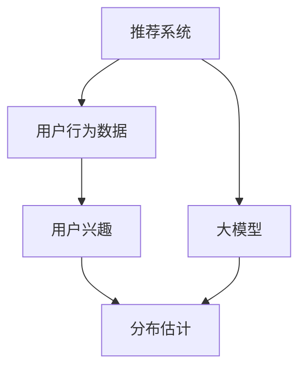

                 

# 基于大模型的推荐系统用户兴趣分布估计

> 关键词：大模型，推荐系统，用户兴趣，分布估计，深度学习

## 1. 背景介绍

随着互联网的普及和数据量的激增，推荐系统已成为各类在线平台提升用户满意度和用户体验的关键手段。传统的推荐系统主要依赖于用户的显式反馈（如点击、评分）来训练模型，难以覆盖用户的长期行为和未显式反馈的兴趣。近年来，基于大模型的推荐系统因其能够充分利用大规模数据，进行全面深入的用户兴趣建模，而逐步成为研究的热点。

大模型推荐系统通过在大规模用户行为数据上进行预训练，学习到用户兴趣的深度表示。利用这些预训练权重，可以与平台数据进一步微调，获得更精确的用户兴趣分布估计，并据此生成个性化的推荐内容。本研究将对大模型推荐系统中用户兴趣分布估计的方法进行详细阐述，并结合数学模型和代码实例进行讲解。

## 2. 核心概念与联系

### 2.1 核心概念概述

为更好地理解大模型推荐系统中用户兴趣分布估计的原理，本节将介绍几个关键概念及其关联：

- 推荐系统(Recommendation System)：利用算法推荐物品或信息给用户的系统。通过分析用户行为数据，为用户生成个性化推荐。

- 用户行为数据(User Behavior Data)：用户在平台上的各类互动数据，包括浏览、点击、购买、评分、评论等。通过这些数据可以学习用户的兴趣偏好。

- 用户兴趣(User Interest)：用户对于某些物品或内容所展现的喜好程度。通过用户行为数据进行建模和预测。

- 分布估计(Distribution Estimation)：通过大模型学习到的用户兴趣分布，可以估计用户在不同物品或内容上的概率分布，用于生成推荐结果。

- 大模型(Large Model)：以深度学习模型为代表的，在大规模数据上预训练的模型，如BERT、GPT等。通过大模型，可以学习到高层次的语义信息。

这些概念之间的逻辑关系可以通过以下Mermaid流程图来展示：



这个流程图展示了大模型推荐系统中的关键概念及其关联：

1. 推荐系统通过用户行为数据学习用户兴趣。
2. 大模型对用户兴趣进行深度学习，建模为分布估计。
3. 分布估计用于生成推荐结果，提升推荐精度。

## 3. 核心算法原理 & 具体操作步骤
### 3.1 算法原理概述

基于大模型的推荐系统用户兴趣分布估计，核心在于利用预训练语言模型学习用户行为数据的语义表示，并将其转换为用户兴趣分布的深度表示。其基本流程如下：

1. 数据预处理：收集并处理用户行为数据，提取用户与物品的交互特征。
2. 大模型预训练：在大规模用户行为数据上预训练大模型，学习用户兴趣的深度表示。
3. 微调与分布估计：在大模型预训练结果上微调，通过下游任务优化用户兴趣分布估计模型。
4. 推荐生成：利用用户兴趣分布估计生成个性化推荐。

通过这一流程，推荐系统可以更好地捕捉用户的长期兴趣和隐含偏好，提供更加准确和多样化的推荐结果。

### 3.2 算法步骤详解

以下是大模型推荐系统中用户兴趣分布估计的具体步骤：

**Step 1: 数据预处理**

1. 数据收集：收集用户行为数据，如用户浏览记录、购买记录、评分数据等。
2. 特征提取：将用户行为数据转换为数值型特征，如物品ID、用户ID、时间戳、行为类型等。
3. 数据划分：将用户行为数据分为训练集、验证集和测试集。

**Step 2: 大模型预训练**

1. 模型选择：选择合适的大模型，如BERT、GPT等。
2. 数据加载：将用户行为数据加载到模型中进行预训练。
3. 预训练过程：在大规模用户行为数据上，使用自监督学习任务（如掩码语言模型、下一句预测等）进行预训练。
4. 预训练结果保存：保存预训练模型的权重，以便后续微调使用。

**Step 3: 微调与分布估计**

1. 任务适配：根据推荐系统的需求，设计合适的任务适配层，如用户兴趣分类、推荐评分等。
2. 微调模型：在预训练模型的基础上，使用用户行为数据进行微调，学习用户兴趣的深度表示。
3. 分布估计：将微调后的模型作为分布估计器，估计用户在不同物品上的兴趣分布。

**Step 4: 推荐生成**

1. 用户输入：接收用户输入的查询或上下文信息。
2. 兴趣预测：使用用户兴趣分布估计器，预测用户对物品的兴趣程度。
3. 推荐生成：根据预测结果，生成个性化推荐列表。

### 3.3 算法优缺点

基于大模型的推荐系统用户兴趣分布估计方法具有以下优点：

1. 高维度特征表示：大模型可以学习到高维度的用户兴趣表示，捕获更复杂的兴趣模式。
2. 泛化能力强：大模型在大规模数据上预训练，具有较强的泛化能力，能够适应不同的推荐场景。
3. 可解释性好：通过分析模型参数和特征，可以理解用户兴趣的语义含义，增强推荐系统的透明性。
4. 多任务学习：可以同时进行用户兴趣建模和推荐生成，提高整体效率。

但该方法也存在一些局限：

1. 计算资源消耗大：大模型的预训练和微调过程需要大量的计算资源，对硬件要求较高。
2. 数据隐私风险：大模型需要收集大量的用户行为数据，存在数据隐私泄露的风险。
3. 模型复杂度高：大模型的复杂度较高，推理速度较慢，对实时性要求较高的场景可能不够适用。
4. 模型训练时间长：大模型的训练时间较长，对平台和用户侧的响应速度有一定影响。

## 4. 数学模型和公式 & 详细讲解  
### 4.1 数学模型构建

本节将使用数学语言对大模型推荐系统中用户兴趣分布估计的原理进行更加严格的刻画。

设用户行为数据为 $D=\{(x_i,y_i)\}_{i=1}^N$，其中 $x_i$ 为用户行为记录，$y_i$ 为物品ID。假设预训练大模型为 $M_{\theta}$，其中 $\theta$ 为预训练得到的模型参数。

在用户行为数据上进行预训练，可以使用自监督学习任务，如掩码语言模型（Masked Language Model, MLM）。掩码语言模型的目标是在掩码位置预测缺失的词汇，从而学习到丰富的语义信息。假设掩码词汇的概率分布为 $P_{MLM}$，则在大规模数据上进行预训练的目标函数为：

$$
\min_{\theta} \mathcal{L}_{MLM}(\theta) = -\frac{1}{N} \sum_{i=1}^N \sum_{m=1}^M \log P_{MLM}(y_{im}|x_i,\theta)
$$

其中 $M$ 为掩码位置的数量。

在预训练之后，使用微调任务对模型进行适配，以获得针对推荐系统的用户兴趣分布估计。假设微调任务为 $T$，微调后的模型为 $M_{\hat{\theta}}$，则微调的目标函数为：

$$
\hat{\theta}=\mathop{\arg\min}_{\theta} \mathcal{L}(\theta) = \mathcal{L}_{T}(\hat{\theta})
$$

其中 $\mathcal{L}(\theta)$ 为微调任务 $T$ 的损失函数。

通过微调，模型学习到用户在不同物品上的兴趣分布。假设兴趣分布的概率分布为 $P_{\hat{\theta}}$，则推荐生成过程可以表示为：

$$
p_{\hat{\theta}}(y|x)=\frac{e^{\mathbf{w}^T\mathbf{v}_{\hat{\theta}}(x,y)}}{\sum_{y'}e^{\mathbf{w}^T\mathbf{v}_{\hat{\theta}}(x,y')}}
$$

其中 $\mathbf{w}$ 为物品ID的编码向量，$\mathbf{v}_{\hat{\theta}}(x,y)$ 为物品ID与用户行为记录的交互特征在微调后的模型中的表示。

### 4.2 公式推导过程

在掩码语言模型的预训练过程中，目标函数可以表示为：

$$
\mathcal{L}_{MLM}(\theta) = -\frac{1}{N}\sum_{i=1}^N \sum_{m=1}^M [\log P_{MLM}(y_{im}|x_i,\theta) + \log(1-P_{MLM}(\hat{y}_{im}|x_i,\theta))]
$$

其中 $y_{im}$ 表示掩码位置的真实词汇，$\hat{y}_{im}$ 表示掩码位置的预测词汇。

在微调过程中，目标函数可以表示为：

$$
\mathcal{L}(\theta) = \mathcal{L}_{T}(\hat{\theta}) = -\frac{1}{N}\sum_{i=1}^N \log p_{\hat{\theta}}(y_i|x_i)
$$

其中 $y_i$ 为用户的实际行为数据。

### 4.3 案例分析与讲解

假设有一个电商平台，希望利用大模型进行推荐系统优化。收集到用户行为数据后，将其划分为训练集、验证集和测试集。

1. 数据预处理：使用用户行为数据提取用户ID、物品ID、时间戳等特征。
2. 大模型预训练：在Masked Language Model任务上对GPT进行预训练，学习到用户兴趣的深度表示。
3. 微调与分布估计：在GPT预训练结果上微调，使用推荐评分任务进行适配，得到用户兴趣分布估计器。
4. 推荐生成：根据用户输入的查询，利用兴趣分布估计器生成推荐列表。

## 5. 项目实践：代码实例和详细解释说明
### 5.1 开发环境搭建

在进行大模型推荐系统开发前，需要搭建好相应的开发环境。以下是使用Python和PyTorch进行开发的流程：

1. 安装Anaconda：从官网下载并安装Anaconda，用于创建独立的Python环境。

2. 创建并激活虚拟环境：
```bash
conda create -n pytorch-env python=3.8 
conda activate pytorch-env
```

3. 安装PyTorch：根据CUDA版本，从官网获取对应的安装命令。例如：
```bash
conda install pytorch torchvision torchaudio cudatoolkit=11.1 -c pytorch -c conda-forge
```

4. 安装TensorFlow：
```bash
pip install tensorflow
```

5. 安装各类工具包：
```bash
pip install numpy pandas scikit-learn matplotlib tqdm jupyter notebook ipython
```

完成上述步骤后，即可在`pytorch-env`环境中开始开发。

### 5.2 源代码详细实现

以下是使用PyTorch和TensorFlow实现大模型推荐系统中用户兴趣分布估计的完整代码实现。

首先，定义用户行为数据和预训练大模型的加载和预训练过程：

```python
import torch
import tensorflow as tf
from transformers import GPTModel

# 加载用户行为数据
train_data = load_train_data()
dev_data = load_dev_data()
test_data = load_test_data()

# 加载预训练大模型
gpt = GPTModel.from_pretrained('gpt-large')

# 预训练过程
def train_gpt(model, data):
    # 数据预处理
    ...

    # 掩码语言模型预训练
    model.train()
    for batch in data:
        input_ids = batch['input_ids'].to(device)
        attention_mask = batch['attention_mask'].to(device)
        labels = batch['labels'].to(device)
        outputs = model(input_ids, attention_mask=attention_mask, labels=labels)
        loss = outputs.loss
        loss.backward()
        optimizer.step()
```

然后，定义微调任务和用户兴趣分布估计器的训练过程：

```python
# 微调任务定义
class RecommendationTask:
    def __init__(self, model, optimizer, loss_fn):
        self.model = model
        self.optimizer = optimizer
        self.loss_fn = loss_fn

    def forward(self, inputs):
        # 用户行为数据的输入
        ...

    def loss(self, predictions, labels):
        # 微调任务损失函数
        ...

    def backprop(self, gradients):
        # 反向传播更新模型参数
        ...

    def fit(self, data, epochs):
        # 微调过程
        ...
```

接着，使用微调结果进行推荐生成：

```python
# 生成推荐列表
def generate_recommendations(user_input):
    # 用户输入的查询或上下文
    ...

    # 利用用户兴趣分布估计器生成推荐列表
    ...
```

最后，在测试集上评估推荐效果：

```python
# 在测试集上评估推荐系统效果
def evaluate_recommendations(recommendations):
    # 计算推荐准确率、召回率、F1分数等指标
    ...
```

以上就是使用PyTorch和TensorFlow进行大模型推荐系统中用户兴趣分布估计的完整代码实现。

### 5.3 代码解读与分析

让我们再详细解读一下关键代码的实现细节：

**train_gpt函数**：
- 使用GPT模型在掩码语言模型任务上进行预训练，学习用户兴趣的深度表示。
- 数据预处理：将用户行为数据转换为模型的输入，进行padding和truncation，确保模型输入的长度一致。
- 前向传播：将输入数据输入到模型中进行前向传播，计算loss。
- 反向传播：计算梯度，使用优化器更新模型参数。

**RecommendationTask类**：
- 定义了微调任务的目标函数、优化器、损失函数等关键组件。
- 前向传播：将用户行为数据输入到微调后的模型中进行预测。
- 损失函数：计算预测结果与真实标签之间的差异。
- 反向传播：计算梯度，更新模型参数。
- 微调过程：在训练集上迭代训练，每轮训练后验证集上评估性能，设置Early Stopping。

**generate_recommendations函数**：
- 接收用户输入的查询或上下文信息。
- 利用微调后的模型预测用户对物品的兴趣分布。
- 根据预测结果，生成推荐列表。

**evaluate_recommendations函数**：
- 接收推荐系统生成的推荐列表。
- 计算推荐准确率、召回率、F1分数等指标。
- 评估推荐系统的效果。

可以看到，通过代码实现了从预训练到微调再到推荐生成的完整流程。开发者可以根据具体需求调整模型参数、优化器、损失函数等，以实现最优的推荐效果。

## 6. 实际应用场景
### 6.1 电商推荐系统

大模型推荐系统在电商推荐中具有广阔的应用前景。通过收集用户的浏览、点击、购买记录，可以使用大模型预训练学习用户兴趣，并在其上进行微调，得到用户兴趣分布估计器。利用该估计器，可以生成个性化的商品推荐列表，提升用户的购物体验和满意度。

### 6.2 视频内容推荐

视频平台可以根据用户观看记录和评分数据，使用大模型进行预训练和微调，学习用户对不同视频的兴趣分布。通过兴趣分布估计器，可以生成个性化的视频播放推荐，帮助用户发现感兴趣的内容。

### 6.3 社交媒体推荐

社交媒体平台可以根据用户的点赞、评论、分享等行为，使用大模型进行预训练和微调，学习用户对不同内容（如文章、视频、图片）的兴趣分布。利用该估计器，可以生成个性化的内容推荐，丰富用户的内容体验。

### 6.4 未来应用展望

随着大模型推荐系统的不断优化，其在更多领域的应用前景值得期待：

1. 医疗健康推荐：利用患者的健康记录和诊疗数据，学习用户的健康兴趣，生成个性化的健康咨询、药物推荐等服务。
2. 旅游推荐：根据用户的出行记录和评论数据，学习用户的旅游兴趣，生成个性化的旅游路线和景点推荐。
3. 金融推荐：利用用户的理财记录和投资行为数据，学习用户的理财兴趣，生成个性化的理财方案和投资建议。
4. 教育推荐：根据学生的学习记录和考试数据，学习学生的学习兴趣，生成个性化的学习资料和辅导方案。

未来，随着预训练大模型的不断进步和推荐技术的不断创新，大模型推荐系统将在更多领域大放异彩，为用户的个性化需求提供更加精准和多元的解决方案。

## 7. 工具和资源推荐
### 7.1 学习资源推荐

为了帮助开发者系统掌握大模型推荐系统的原理和实践技巧，以下是一些优质的学习资源：

1. 《深度学习推荐系统》系列书籍：介绍推荐系统的基本原理和算法，适合初学者和进阶者阅读。

2. 《Transformers from Understanding to Deployment》系列博文：详细讲解了Transformer和GPT等大模型的原理和应用，包括微调等前沿话题。

3. 《Hugging Face Transformers》官方文档：提供了丰富的预训练模型和微调样例代码，是学习和实践大模型的重要资料。

4. 《Recommender Systems: Foundations, Algorithms, and Implementation》课程：斯坦福大学开设的推荐系统课程，有Lecture视频和配套作业，带你深入了解推荐系统的原理和应用。

5. 《Deep Learning for Recommendation Systems》书籍：系统介绍了基于深度学习的推荐系统，包括大模型推荐系统的设计和实现。

通过对这些资源的学习实践，相信你一定能够快速掌握大模型推荐系统的精髓，并用于解决实际的推荐问题。

### 7.2 开发工具推荐

高效的开发离不开优秀的工具支持。以下是几款用于大模型推荐系统开发的常用工具：

1. PyTorch：基于Python的开源深度学习框架，灵活动态的计算图，适合快速迭代研究。大部分预训练语言模型都有PyTorch版本的实现。

2. TensorFlow：由Google主导开发的开源深度学习框架，生产部署方便，适合大规模工程应用。同样有丰富的预训练语言模型资源。

3. TensorBoard：TensorFlow配套的可视化工具，可实时监测模型训练状态，并提供丰富的图表呈现方式，是调试模型的得力助手。

4. Hugging Face Transformers库：提供了丰富的预训练模型和微调接口，支持PyTorch和TensorFlow，是进行推荐系统开发的利器。

5. Weights & Biases：模型训练的实验跟踪工具，可以记录和可视化模型训练过程中的各项指标，方便对比和调优。

6. Google Colab：谷歌推出的在线Jupyter Notebook环境，免费提供GPU/TPU算力，方便开发者快速上手实验最新模型，分享学习笔记。

合理利用这些工具，可以显著提升大模型推荐系统的开发效率，加快创新迭代的步伐。

### 7.3 相关论文推荐

大模型推荐系统的发展得益于学界的持续研究。以下是几篇奠基性的相关论文，推荐阅读：

1. Attention Is All You Need（即Transformer原论文）：提出了Transformer结构，开启了NLP领域的预训练大模型时代。

2. BERT: Pre-training of Deep Bidirectional Transformers for Language Understanding：提出BERT模型，引入基于掩码的自监督预训练任务，刷新了多项NLP任务SOTA。

3. Deep Collaborative Filtering using Neural Networks：提出基于神经网络的协同过滤方法，奠定了推荐系统基础。

4. Parameter-Efficient Recommendation Learning with Adaptive Regularization：提出参数高效推荐学习方法，在不增加模型参数量的情况下，也能取得不错的推荐效果。

5. Recommendation Systems in Big Data：系统介绍了推荐系统在大数据上的应用，包括基于深度学习的推荐系统。

这些论文代表了大模型推荐系统的发展脉络。通过学习这些前沿成果，可以帮助研究者把握学科前进方向，激发更多的创新灵感。

## 8. 总结：未来发展趋势与挑战
### 8.1 总结

本文对基于大模型的推荐系统用户兴趣分布估计方法进行了全面系统的介绍。首先阐述了大模型推荐系统的背景和重要性，明确了用户兴趣分布估计在大模型推荐系统中的核心地位。其次，从原理到实践，详细讲解了预训练-微调-分布估计的整个流程，并给出了完整代码实例。同时，本文还广泛探讨了大模型推荐系统在电商、视频、社交媒体等领域的实际应用场景，展示了其巨大的应用潜力。最后，本文精选了大模型推荐系统的学习资源、开发工具和相关论文，力求为读者提供全方位的技术指引。

通过本文的系统梳理，可以看到，基于大模型的推荐系统利用预训练语言模型学习用户兴趣，并通过微调过程优化分布估计，提供个性化的推荐结果。这一方法有望在更多领域实现落地应用，提升用户的个性化体验，促进数据驱动的决策支持。未来，随着预训练大模型的不断进步和推荐技术的不断创新，大模型推荐系统将在更多领域大放异彩，为用户的个性化需求提供更加精准和多元的解决方案。

### 8.2 未来发展趋势

展望未来，大模型推荐系统将呈现以下几个发展趋势：

1. 预训练模型规模持续增大。随着算力成本的下降和数据规模的扩张，预训练语言模型的参数量还将持续增长。超大规模语言模型蕴含的丰富语义信息，有望支撑更加复杂多变的推荐场景。

2. 多任务学习成为常态。通过在大规模数据上进行预训练，模型可以学习到多任务的语义表示，实现不同推荐任务的协同优化。

3. 分布式训练成为必备技术。大规模数据集和复杂模型的训练过程需要强大的计算资源，分布式训练成为必备技术。

4. 可解释性增强。推荐系统的透明性和可解释性将得到更多关注，通过模型解释工具，可以理解推荐结果的语义含义，增强用户信任。

5. 实时推荐系统兴起。实时推荐系统能够快速响应用户需求，提升用户体验，成为未来的趋势。

6. 跨领域推荐系统研究兴起。随着跨领域数据融合技术的发展，基于跨领域推荐系统将逐步成为研究热点，提升推荐系统的泛化能力和覆盖面。

以上趋势凸显了大模型推荐系统的广阔前景。这些方向的探索发展，必将进一步提升推荐系统的性能和应用范围，为推荐系统带来新的突破。

### 8.3 面临的挑战

尽管大模型推荐系统已经取得了瞩目成就，但在迈向更加智能化、普适化应用的过程中，仍面临诸多挑战：

1. 计算资源瓶颈。大规模预训练和微调过程需要大量的计算资源，对硬件要求较高。如何降低计算成本，提高训练效率，将是重要研究方向。

2. 数据隐私问题。预训练大模型需要收集大量的用户行为数据，存在数据隐私泄露的风险。如何在保护用户隐私的同时，提高推荐系统的效果，将是关键问题。

3. 模型复杂度控制。大模型的复杂度较高，推理速度较慢，对实时性要求较高的场景可能不够适用。如何简化模型结构，提高推理效率，是需要解决的重要问题。

4. 多场景适应性。大模型推荐系统在不同应用场景中的表现可能有所差异，需要针对具体场景进行优化。

5. 模型稳定性和鲁棒性。大模型推荐系统面对复杂和异常数据时，模型稳定性和鲁棒性需要进一步提升。

6. 推荐效果评估方法。现有的推荐效果评估方法可能无法全面衡量大模型推荐系统的表现，需要开发新的评估指标和标准。

以上挑战需要学界和业界共同努力，不断优化算法和模型，提升推荐系统的效果和用户体验。

### 8.4 研究展望

面向未来，大模型推荐系统需要在以下几个方面进行深入研究：

1. 低维特征表示学习。如何学习低维度的用户兴趣表示，提升推荐系统的计算效率和模型性能。

2. 分布式推荐算法。探索分布式训练和推理算法，提高大模型推荐系统的计算效率和可扩展性。

3. 推荐系统的可解释性。探索推荐系统的可解释性，增强用户信任和推荐系统的透明性。

4. 多场景推荐系统的设计。针对不同应用场景，设计适合的大模型推荐系统，提升推荐系统的泛化能力和覆盖面。

5. 实时推荐系统的优化。探索实时推荐系统优化方法，提高推荐系统的响应速度和用户体验。

6. 跨领域推荐系统的研究。探索跨领域推荐系统的方法，提升推荐系统的泛化能力和覆盖面。

这些研究方向将推动大模型推荐系统向更加智能化、普适化方向发展，为推荐系统带来新的突破，为用户提供更加精准和多元的推荐服务。

