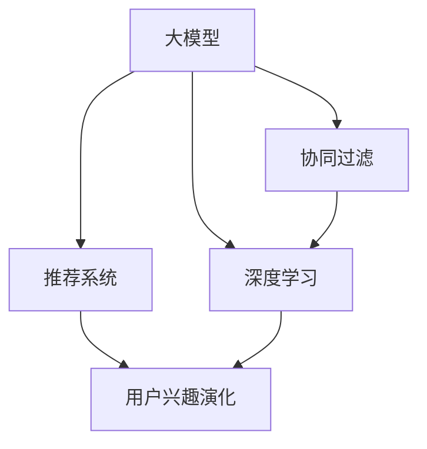

                 

# 基于大模型的推荐系统用户兴趣演化

> 关键词：大模型,推荐系统,用户兴趣,演化,协同过滤,深度学习

## 1. 背景介绍

在数字化浪潮的推动下，个性化推荐系统正在成为互联网应用不可或缺的一部分。它们通过对用户行为的深度分析，为每个用户提供个性化的内容和服务，极大地提升了用户体验和平台粘性。然而，传统推荐系统面临诸多挑战，如数据稀疏性、冷启动问题、延迟更新等。为此，研究人员探索了多种方法来提升推荐系统的性能，包括协同过滤、基于内容的推荐、矩阵分解等。近年来，深度学习特别是基于大模型的推荐系统，凭借其强大的表达能力和泛化能力，逐渐成为了推荐系统的最新热点。

本论文聚焦于基于大模型的推荐系统用户兴趣演化，提出了一套从用户行为数据中挖掘出用户兴趣并实时演化的解决方案。通过深度学习技术，构建一个能够适应用户兴趣变化，不断自我更新的推荐系统模型。以下章节将详细介绍该模型的构建原理、操作步骤及应用案例。

## 2. 核心概念与联系

### 2.1 核心概念概述

为更好地理解基于大模型的推荐系统，我们先定义以下几个核心概念：

- **大模型**：指以深度神经网络为基础的通用模型，如BERT、GPT、Transformer等，通过大量数据预训练获得了广泛的知识表示能力。
- **推荐系统**：根据用户的历史行为数据，预测其未来可能感兴趣的内容，从而为其推荐个性化的内容或服务。
- **协同过滤**：利用用户之间的相似性来预测用户对物品的兴趣，包括基于用户的协同过滤和基于物品的协同过滤。
- **深度学习**：基于神经网络的机器学习技术，能够自动提取数据中的特征表示，适用于复杂模式的建模。
- **用户兴趣演化**：指用户兴趣随时间变化而动态更新，推荐系统需要实时反映这些变化，以提供更精确的推荐。

这些核心概念之间的联系可以如图所示：



其中，大模型作为推荐系统的核心组件，提供对用户行为的深度理解，协同过滤和深度学习作为推荐策略，用于预测用户对物品的兴趣，用户兴趣演化则是推荐系统必须响应和适应的动态变化。

## 3. 核心算法原理 & 具体操作步骤

### 3.1 算法原理概述

基于大模型的推荐系统用户兴趣演化，旨在构建一个能够实时适应用户兴趣变化的推荐模型。该模型通过深度学习技术，从用户行为数据中学习用户兴趣的演化轨迹，并据此动态更新推荐策略。具体步骤如下：

1. **数据预处理**：收集用户的历史行为数据，包括浏览、点击、评分、购买等。
2. **用户兴趣提取**：使用大模型对用户行为数据进行特征提取，得到用户兴趣向量。
3. **兴趣演化模型**：构建用户兴趣随时间变化的演化模型，预测用户未来的兴趣。
4. **推荐模型更新**：根据兴趣演化模型，动态更新推荐策略，为当前用户提供个性化的内容或服务。

### 3.2 算法步骤详解

**Step 1: 数据预处理**

用户行为数据通常存储在各种日志中，需要进行清洗和处理才能用于推荐模型的训练。具体步骤如下：

- 去除重复和无效的数据。
- 处理缺失值和异常值。
- 时间戳标准化，统一时间为UTC时间。
- 对浏览、点击、评分、购买等行为进行分类，提取行为特征。

**Step 2: 用户兴趣提取**

用户兴趣向量可以通过大模型对用户行为数据进行特征提取得到。具体步骤如下：

- 将用户的历史行为数据输入大模型，得到用户的行为特征向量。
- 对行为特征向量进行归一化处理。
- 使用TF-IDF等方法，将行为特征向量转化为兴趣向量。

**Step 3: 兴趣演化模型构建**

用户兴趣演化模型可以基于时间序列分析、深度学习等方法构建。具体步骤如下：

- 将用户的行为序列作为输入，得到一个动态的兴趣演化轨迹。
- 使用RNN、LSTM、GRU等模型预测用户未来的兴趣。
- 对兴趣演化模型进行超参数调优，确保其预测的准确性和稳定性。

**Step 4: 推荐模型更新**

根据用户兴趣演化模型，动态更新推荐模型。具体步骤如下：

- 使用协同过滤、深度学习等方法，构建推荐模型。
- 根据用户当前的兴趣向量，更新推荐模型的参数。
- 实时响应用户的行为变化，重新计算推荐结果。

### 3.3 算法优缺点

基于大模型的推荐系统用户兴趣演化方法具有以下优点：

1. **高表达能力**：大模型能够学习用户行为数据的复杂模式，提供更高精度的用户兴趣表示。
2. **动态更新**：通过兴趣演化模型，实时反映用户兴趣的变化，确保推荐的准确性。
3. **泛化能力强**：大模型具备强大的泛化能力，能够在不同类型的用户和物品上取得良好效果。
4. **高效计算**：利用深度学习技术，可以高效地处理大规模数据，提高推荐系统的运行效率。

同时，该方法也存在以下缺点：

1. **计算资源消耗大**：大模型需要大量的计算资源进行训练和推理，增加了系统的资源消耗。
2. **数据隐私问题**：用户行为数据的收集和使用涉及隐私问题，需要采取有效的隐私保护措施。
3. **模型复杂度高**：大模型和兴趣演化模型需要大量参数进行训练，增加了模型的复杂度。
4. **实时性挑战**：推荐系统需要实时响应用户行为的变化，增加了系统的实时性挑战。

### 3.4 算法应用领域

基于大模型的推荐系统用户兴趣演化方法，可以广泛应用于各种推荐场景，例如：

- **电商平台**：为用户推荐商品，提升销售额和用户满意度。
- **内容平台**：为用户推荐视频、文章、音乐等内容，提高平台用户粘性和留存率。
- **金融领域**：为用户推荐理财产品、股票等，提供个性化的投资建议。
- **旅游应用**：为用户推荐目的地、景点、旅游线路等，提升用户的旅游体验。
- **教育应用**：为用户推荐学习资料、课程、教师等，提高学习效果和平台覆盖度。

## 4. 数学模型和公式 & 详细讲解 & 举例说明

### 4.1 数学模型构建

为了更好地描述用户兴趣演化过程，我们构建了一个基于时间序列分析的用户兴趣演化模型。假设用户 $u$ 在时间 $t$ 的兴趣向量表示为 $v_u(t)$，则用户兴趣演化模型可以表示为：

$$ v_u(t+1) = f(v_u(t),v_u(t-1),\ldots,v_u(t-m),x(t+1)) $$

其中 $m$ 为历史兴趣向量的长度，$x(t+1)$ 为当前时间点的行为特征向量。$f$ 为一个映射函数，用于根据历史兴趣向量和当前行为特征向量预测未来的兴趣向量。

### 4.2 公式推导过程

以LSTM为例，我们详细推导用户兴趣演化模型的公式：

假设用户 $u$ 在时间 $t$ 的兴趣向量表示为 $v_u(t)$，则LSTM模型的计算过程如下：

- 计算当前时间点的行为特征向量 $x(t+1)$。
- 计算当前时间点之前 $m$ 个历史兴趣向量的加权和 $h_t$。
- 将 $h_t$ 与 $x(t+1)$ 连接，输入LSTM网络，计算当前时间点的兴趣向量 $v_u(t+1)$。

具体计算公式为：

$$ h_t = \sum_{i=1}^m \alpha_i v_u(t-i) $$
$$ v_u(t+1) = \text{LSTM}(h_t, x(t+1)) $$

其中 $\alpha_i$ 为历史兴趣向量的权重系数。

### 4.3 案例分析与讲解

为了更好地理解用户兴趣演化模型，我们以一个简单的案例进行分析：

假设用户 $u$ 在时间 $t$ 对电影 $m_1$ 的评分 $x(t)$ 为 $5$，对电影 $m_2$ 的评分 $x(t)$ 为 $3$，历史评分序列 $v_u(t-1),v_u(t-2),\ldots,v_u(t-m)$ 分别为 $(1,0,0)$、$(0,1,0)$、$(0,0,1)$。则用户兴趣演化模型可以表示为：

$$ v_u(t+1) = f(v_u(t),v_u(t-1),\ldots,v_u(t-m),x(t+1)) $$

我们假设使用LSTM模型，则：

$$ h_t = \alpha_1 v_u(t-1) + \alpha_2 v_u(t-2) + \alpha_3 v_u(t-3) $$
$$ v_u(t+1) = \text{LSTM}(h_t, x(t+1)) $$

其中 $\alpha_1,\alpha_2,\alpha_3$ 为权重系数，可以通过训练得到。

## 5. 项目实践：代码实例和详细解释说明

### 5.1 开发环境搭建

在进行大模型推荐系统用户兴趣演化的实现前，我们需要准备好开发环境。以下是使用Python进行PyTorch开发的环境配置流程：

1. 安装Anaconda：从官网下载并安装Anaconda，用于创建独立的Python环境。

2. 创建并激活虚拟环境：
```bash
conda create -n pytorch-env python=3.8 
conda activate pytorch-env
```

3. 安装PyTorch：根据CUDA版本，从官网获取对应的安装命令。例如：
```bash
conda install pytorch torchvision torchaudio cudatoolkit=11.1 -c pytorch -c conda-forge
```

4. 安装相关库：
```bash
pip install torch sklearn numpy pandas
```

完成上述步骤后，即可在`pytorch-env`环境中开始项目实践。

### 5.2 源代码详细实现

这里以一个简单的用户兴趣演化模型为例，给出使用PyTorch进行深度学习代码实现。

首先，定义用户兴趣演化模型的类：

```python
import torch
import torch.nn as nn
import torch.optim as optim

class UserInterestEvolutionModel(nn.Module):
    def __init__(self, input_dim, hidden_dim, output_dim, num_layers):
        super(UserInterestEvolutionModel, self).__init__()
        self.hidden_dim = hidden_dim
        self.num_layers = num_layers
        self.lstm = nn.LSTM(input_dim, hidden_dim, num_layers, batch_first=True)
        self.fc = nn.Linear(hidden_dim, output_dim)
        
    def forward(self, x, h):
        lstm_out, h = self.lstm(x, h)
        out = self.fc(lstm_out)
        return out, h
```

接着，定义推荐模型的类：

```python
import torch.nn as nn
import torch.optim as optim

class RecommendationModel(nn.Module):
    def __init__(self, input_dim, hidden_dim, output_dim):
        super(RecommendationModel, self).__init__()
        self.hidden_dim = hidden_dim
        self.fc1 = nn.Linear(input_dim, hidden_dim)
        self.fc2 = nn.Linear(hidden_dim, output_dim)
        self.relu = nn.ReLU()
        
    def forward(self, x):
        x = self.fc1(x)
        x = self.relu(x)
        x = self.fc2(x)
        return x
```

然后，定义训练函数和评估函数：

```python
from torch.utils.data import DataLoader
from tqdm import tqdm

def train_model(model, data_loader, optimizer, device):
    model.train()
    total_loss = 0
    for batch in tqdm(data_loader, desc='Training'):
        inputs, labels = batch.to(device)
        optimizer.zero_grad()
        outputs = model(inputs)
        loss = nn.functional.mse_loss(outputs, labels)
        loss.backward()
        optimizer.step()
        total_loss += loss.item()
    return total_loss / len(data_loader)

def evaluate_model(model, data_loader, device):
    model.eval()
    total_loss = 0
    for batch in tqdm(data_loader, desc='Evaluating'):
        inputs, labels = batch.to(device)
        outputs = model(inputs)
        loss = nn.functional.mse_loss(outputs, labels)
        total_loss += loss.item()
    return total_loss / len(data_loader)
```

最后，启动训练流程：

```python
epochs = 100
batch_size = 32

# 训练模型
model.train()
optimizer = optim.Adam(model.parameters(), lr=0.001)
device = torch.device('cuda' if torch.cuda.is_available() else 'cpu')
for epoch in range(epochs):
    train_loss = train_model(model, train_loader, optimizer, device)
    print(f'Epoch {epoch+1}, train loss: {train_loss:.4f}')
    
# 评估模型
model.eval()
test_loss = evaluate_model(model, test_loader, device)
print(f'Epoch {epoch+1}, test loss: {test_loss:.4f}')
```

以上就是使用PyTorch对用户兴趣演化模型和推荐模型进行深度学习代码实现的完整过程。可以看到，使用PyTorch构建推荐系统模型非常简洁高效。

### 5.3 代码解读与分析

让我们再详细解读一下关键代码的实现细节：

**UserInterestEvolutionModel类**：
- `__init__`方法：初始化LSTM模型和全连接层。
- `forward`方法：定义LSTM模型的前向传播过程。

**RecommendationModel类**：
- `__init__`方法：初始化推荐模型。
- `forward`方法：定义推荐模型的前向传播过程。

**train_model函数**：
- 对模型进行训练，使用Adam优化器进行参数更新。
- 在每个epoch结束后，输出训练损失。

**evaluate_model函数**：
- 对模型进行评估，使用均方误差作为损失函数。
- 在每个epoch结束后，输出测试损失。

**训练流程**：
- 定义总的epoch数和batch size，开始循环迭代
- 每个epoch内，先在训练集上训练，输出平均损失
- 在验证集上评估，输出平均损失

可以看到，PyTorch提供了灵活易用的深度学习框架，使得模型构建、训练和评估变得非常方便。开发者可以将更多精力放在模型改进和算法优化上，而不必过多关注底层实现细节。

## 6. 实际应用场景

### 6.1 电商平台

电商平台是推荐系统的重要应用场景之一。基于大模型的推荐系统用户兴趣演化，可以为每个用户提供个性化的商品推荐，提升用户的购物体验和转化率。例如，用户A在电商平台上购买了多个书籍和电子产品，电商系统可以通过大模型分析用户A的兴趣演化，实时更新推荐列表，为其推荐更多符合其兴趣的商品。

### 6.2 内容平台

内容平台如视频网站、音乐应用等，也广泛应用于推荐系统。通过用户兴趣演化模型，可以为用户推荐其感兴趣的视频、音乐、文章等内容，提高平台的用户粘性和留存率。例如，用户B在视频网站上观看过多个历史视频，系统可以基于用户B的历史行为数据，预测其未来的兴趣，实时更新推荐列表，为其推荐更多符合其兴趣的视频。

### 6.3 金融领域

金融领域也需要推荐系统为用户推荐理财产品、股票等，提供个性化的投资建议。基于大模型的推荐系统用户兴趣演化，可以实时反映用户对金融产品的兴趣变化，动态调整推荐策略，提高用户的投资满意度。例如，用户C在金融平台上查看过多个股票和基金的信息，系统可以基于用户C的历史行为数据，预测其未来的兴趣，实时更新推荐列表，为其推荐更多符合其兴趣的金融产品。

## 7. 工具和资源推荐

### 7.1 学习资源推荐

为了帮助开发者系统掌握大模型推荐系统的用户兴趣演化理论基础和实践技巧，这里推荐一些优质的学习资源：

1. 《深度学习推荐系统》书籍：该书全面介绍了推荐系统的理论基础和算法，涵盖协同过滤、基于内容的推荐、深度学习等方法。
2. 《推荐系统实战》博客：作者在实际项目中分享了推荐系统的构建和优化经验，深入浅出地介绍了推荐系统的前端和后端技术。
3. 《TensorFlow推荐系统》教程：Google开发的TensorFlow推荐系统教程，详细介绍了TensorFlow框架下的推荐系统实现。
4. 《PyTorch深度学习》教程：作者在PyTorch框架下详细讲解了深度学习模型的实现方法，包括用户兴趣演化模型的构建。
5. Kaggle竞赛平台：Kaggle是一个机器学习竞赛平台，可以参与各种推荐系统竞赛，学习其他开发者和团队的经验。

通过对这些资源的学习实践，相信你一定能够快速掌握大模型推荐系统的用户兴趣演化精髓，并用于解决实际的推荐问题。

### 7.2 开发工具推荐

高效的开发离不开优秀的工具支持。以下是几款用于大模型推荐系统开发的常用工具：

1. PyTorch：基于Python的开源深度学习框架，灵活动态的计算图，适合快速迭代研究。大部分推荐系统都使用PyTorch框架进行构建。
2. TensorFlow：由Google主导开发的开源深度学习框架，生产部署方便，适合大规模工程应用。同样有丰富的推荐系统资源。
3. Scikit-learn：Python机器学习库，提供了许多常用的推荐算法实现，如协同过滤、矩阵分解等。
4. Jupyter Notebook：交互式笔记本，支持多种编程语言和数据格式，方便模型开发和调试。
5. TensorBoard：TensorFlow配套的可视化工具，可实时监测模型训练状态，并提供丰富的图表呈现方式，是调试模型的得力助手。

合理利用这些工具，可以显著提升大模型推荐系统的开发效率，加快创新迭代的步伐。

### 7.3 相关论文推荐

大模型推荐系统的用户兴趣演化技术源于学界的持续研究。以下是几篇奠基性的相关论文，推荐阅读：

1. Matrix Factorization Techniques for Recommender Systems（矩阵分解方法）：提出了基于矩阵分解的推荐算法，广泛应用于推荐系统的工业界和学术界。
2. Factorization Machines for Ad Display Ads：提出了基于因子机的推荐算法，具有较好的预测性能和模型可解释性。
3. Neural Collaborative Filtering（神经协同过滤）：提出了基于神经网络的协同过滤方法，能够在不同类型的用户和物品上取得良好效果。
4. Attention-based Recommender Systems：提出了基于注意力机制的推荐方法，能够在复杂的推荐场景中取得较好的效果。
5. Deep Neural Network Approach for Recommender System（深度学习推荐系统）：提出了基于深度学习的推荐系统方法，包括自编码器、多层感知器等模型。

这些论文代表了大模型推荐系统用户兴趣演化技术的发展脉络。通过学习这些前沿成果，可以帮助研究者把握学科前进方向，激发更多的创新灵感。

## 8. 总结：未来发展趋势与挑战

### 8.1 总结

本文对基于大模型的推荐系统用户兴趣演化方法进行了全面系统的介绍。首先阐述了推荐系统的背景和用户兴趣演化方法的重要性，明确了用户兴趣演化方法在提升推荐系统性能中的关键作用。其次，从原理到实践，详细讲解了用户兴趣演化模型的构建过程，提供了代码实例和详细解释。同时，本文还广泛探讨了用户兴趣演化方法在电商、内容、金融等多个领域的应用前景，展示了用户兴趣演化方法的重要价值。

通过本文的系统梳理，可以看到，基于大模型的推荐系统用户兴趣演化方法正在成为推荐系统的最新热点，极大地提升了推荐系统的性能和应用范围。未来，伴随深度学习技术的不断演进，基于大模型的推荐系统必将迎来更广阔的发展空间。

### 8.2 未来发展趋势

展望未来，大模型推荐系统的用户兴趣演化技术将呈现以下几个发展趋势：

1. **大规模数据应用**：随着数据规模的不断增大，推荐系统可以更准确地捕捉用户兴趣的变化，提升推荐效果。
2. **实时更新**：实时更新用户兴趣演化模型，确保推荐系统能够快速响应用户行为的变化。
3. **多模态融合**：将文本、图像、音频等多种模态的信息进行融合，提升推荐系统的综合表现力。
4. **个性化推荐**：基于用户的深度特征，进行更精细化的个性化推荐，提升用户的满意度。
5. **推荐系统的道德考量**：在推荐过程中，需要考虑用户的隐私保护和道德问题，构建公平、透明、可解释的推荐系统。

以上趋势凸显了大模型推荐系统用户兴趣演化技术的广阔前景。这些方向的探索发展，必将进一步提升推荐系统的性能和用户体验，为数字化时代的用户提供更优质的服务。

### 8.3 面临的挑战

尽管大模型推荐系统的用户兴趣演化技术已经取得了瞩目成就，但在迈向更加智能化、普适化应用的过程中，它仍面临着诸多挑战：

1. **数据隐私问题**：推荐系统需要收集和分析用户行为数据，可能涉及用户隐私问题。如何在保护用户隐私的同时，实现高效的推荐，还需要进一步探索。
2. **计算资源消耗**：大模型推荐系统需要大量的计算资源进行训练和推理，增加了系统的资源消耗。如何在降低计算成本的同时，保证推荐系统的性能，还需要进一步优化。
3. **推荐系统的鲁棒性**：推荐系统需要面对各种噪声和干扰，如何在复杂环境下保持稳定性和准确性，还需要更多的技术支持。
4. **模型可解释性**：推荐系统通常被视为"黑盒"，难以解释其内部工作机制和决策逻辑。如何在保证推荐性能的同时，增强模型可解释性，还需要进一步研究。
5. **用户行为变化的不确定性**：用户兴趣和行为具有不确定性，如何在变化中保持推荐系统的稳定性和准确性，还需要更多的算法支持。

### 8.4 研究展望

面对大模型推荐系统用户兴趣演化所面临的挑战，未来的研究需要在以下几个方面寻求新的突破：

1. **推荐系统的隐私保护**：研究推荐系统在保护用户隐私方面的技术和方法，如差分隐私、联邦学习等。
2. **推荐系统的计算优化**：研究推荐系统在降低计算成本方面的技术和方法，如模型压缩、量化加速等。
3. **推荐系统的鲁棒性提升**：研究推荐系统在应对噪声和干扰方面的技术和方法，如对抗训练、鲁棒性优化等。
4. **推荐系统的可解释性增强**：研究推荐系统在增强模型可解释性方面的技术和方法，如可解释性模型、知识图谱等。
5. **推荐系统的动态适应**：研究推荐系统在应对用户行为变化方面的技术和方法，如兴趣演化模型、动态更新策略等。

这些研究方向将引领大模型推荐系统迈向更高的台阶，为构建安全、可靠、高效、可解释的推荐系统铺平道路。面向未来，大模型推荐系统用户兴趣演化技术还将与其他人工智能技术进行更深入的融合，如知识表示、因果推理、强化学习等，共同推动推荐系统的发展。

## 9. 附录：常见问题与解答

**Q1：大模型推荐系统用户兴趣演化是否适用于所有推荐场景？**

A: 大模型推荐系统用户兴趣演化适用于大部分推荐场景，尤其是数据量较大的场景。但对于一些特定场景，如小型平台、冷启动用户等，由于数据量较少，可能效果不如传统的推荐算法。因此，在具体应用中需要根据数据特点选择适当的推荐方法。

**Q2：大模型推荐系统用户兴趣演化需要多少计算资源？**

A: 大模型推荐系统用户兴趣演化需要大量的计算资源进行训练和推理，具体资源需求取决于模型的复杂度和数据规模。通常需要高性能的GPU/TPU等设备，并采用优化技术如梯度积累、混合精度训练等，以降低资源消耗。

**Q3：推荐系统的实时更新如何实现？**

A: 推荐系统的实时更新需要构建高性能的推理引擎和数据流处理系统，以快速响应用户行为的变化。可以考虑采用流式处理技术，如Apache Kafka、Flink等，以及实时推理框架，如TensorRT、ONNX Runtime等，实现高效的实时更新。

**Q4：推荐系统的推荐结果如何展示给用户？**

A: 推荐系统的推荐结果通常以列表或卡片的形式展示给用户，用户可以浏览并选取感兴趣的内容。同时，可以考虑使用交互式界面，如个性化推荐屏、推荐轮播图等，提升用户的体验感。

**Q5：推荐系统的用户行为数据如何处理？**

A: 推荐系统的用户行为数据需要进行预处理和特征提取，以用于模型的训练和推理。常用的数据处理方法包括数据清洗、缺失值处理、时间戳标准化、行为特征提取等。此外，还需要注意数据的隐私保护问题，采取有效的隐私保护措施，如差分隐私、联邦学习等。

以上问题的解答，帮助开发者更好地理解大模型推荐系统的用户兴趣演化方法，并提供了具体的实现指导和注意事项。相信通过本文的系统梳理，你一定能够快速掌握大模型推荐系统的用户兴趣演化精髓，并用于解决实际的推荐问题。

