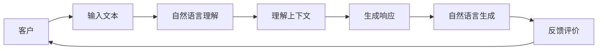

                 

## 1. 背景介绍

随着电商平台的迅猛发展，客户服务需求日益多样化，传统的客服方式已无法满足日益增长的客户需求。智能客服系统利用自然语言处理（NLP）技术，能实现7x24小时不间断服务，快速响应客户咨询，显著提升了客户体验和满意度。然而，现阶段的智能客服系统仍存在许多不足，如理解能力有限、回复准确率不稳定、缺乏个性化推荐等。因此，如何进一步提升智能客服系统的能力，提升客户体验，是当前电商平台亟需解决的问题。

## 2. 核心概念与联系

### 2.1 核心概念概述

为更好地理解基于大模型的电商平台智能客服系统，本节将介绍几个关键概念：

- **大模型**：指使用大规模无标签数据进行预训练的语言模型，如GPT-3、BERT等。这些模型拥有强大的语言理解能力和生成能力，能够有效处理复杂多变的自然语言数据。

- **微调**：指在大模型基础上，使用特定任务的数据进行有监督学习，优化模型在该任务上的性能。

- **自然语言理解（NLU）**：指将自然语言转化为计算机可理解的向量表示，以便进行进一步的语义分析和处理。

- **自然语言生成（NLG）**：指根据输入的语义信息，生成自然流畅的文本输出。

- **多轮对话**：指客服系统与客户之间进行多轮信息交换的过程，以逐步理解客户需求并给出个性化回复。

- **智能推荐**：指根据客户的历史行为和偏好，智能地推荐商品或服务，提升客户满意度。

- **上下文理解**：指客服系统在处理客户咨询时，能够根据对话上下文理解客户需求，给出更准确的回复。

- **可解释性**：指客服系统的决策过程是可理解和可解释的，方便客户和内部人员对系统行为进行监控和优化。

### 2.2 核心概念原理和架构的 Mermaid 流程图



该流程图展示了智能客服系统的主要流程：

1. 客户输入文本
2. 自然语言理解模块将文本转化为向量表示
3. 上下文理解模块根据对话历史，进一步理解客户需求
4. 生成响应模块根据上下文生成回复
5. 回复输出并反馈客户评价，用于系统优化

## 3. 核心算法原理 & 具体操作步骤

### 3.1 算法原理概述

基于大模型的电商平台智能客服系统主要利用自然语言处理技术，实现自然语言理解（NLU）和自然语言生成（NLG）。具体流程如下：

1. 使用大模型对客户输入的文本进行自然语言理解（NLU），转化为向量表示。
2. 利用上下文理解模块，根据对话历史，理解客户需求。
3. 生成响应模块根据上下文生成自然语言回复。
4. 对回复进行自然语言生成（NLG），转化为自然流畅的文本输出。

### 3.2 算法步骤详解

#### 步骤1：数据预处理

- **数据收集**：收集客户与客服人员的聊天记录、客服工作日志、客户评价等信息，构建大数据集。
- **数据清洗**：去除无意义、低质量的数据，保留有用的对话记录。
- **数据标注**：根据客户需求，将对话记录标注为常见问题、推荐商品等类型，构建有监督数据集。

#### 步骤2：模型选择与预训练

- **模型选择**：选择合适的预训练语言模型，如BERT、GPT等，作为智能客服系统的基础。
- **预训练**：使用大规模无标签数据对模型进行预训练，学习通用语言表示。

#### 步骤3：任务适配与微调

- **任务适配**：根据具体任务，在预训练模型基础上设计适配层。如对推荐系统任务，适配层需要设计商品推荐算法。
- **微调**：使用有监督数据集，对模型进行微调，优化其在特定任务上的性能。

#### 步骤4：模型部署与监控

- **模型部署**：将训练好的模型部署到生产环境，实现智能客服系统的在线服务。
- **性能监控**：实时监控模型性能，收集客户反馈，不断优化模型。

### 3.3 算法优缺点

#### 优点

- **通用性强**：使用预训练大模型，能够适应不同业务场景，提升系统灵活性。
- **效果显著**：通过微调，模型在特定任务上的表现显著提升。
- **易部署**：大模型预训练过程较为复杂，但微调过程相对简单，易于部署和维护。

#### 缺点

- **数据依赖高**：微调效果依赖于标注数据的质量和数量，获取高质量标注数据的成本较高。
- **泛化能力有限**：当目标任务与预训练数据的分布差异较大时，微调性能提升有限。
- **可解释性不足**：微调模型决策过程缺乏可解释性，难以对其推理逻辑进行分析和调试。

### 3.4 算法应用领域

基于大模型的电商平台智能客服系统具有广泛的应用前景，可用于以下几个领域：

1. **在线客服**：自动响应客户咨询，提供快速准确的答复。
2. **智能推荐**：根据客户历史行为和偏好，推荐相关商品。
3. **问题诊断**：根据客户问题，提供准确的解决方案。
4. **情感分析**：分析客户评价和反馈，提升客户满意度。
5. **风险预警**：识别客户投诉和负面信息，及时预警风险。

## 4. 数学模型和公式 & 详细讲解 & 举例说明

### 4.1 数学模型构建

本节将使用数学语言对智能客服系统的核心算法进行更严谨的描述。

假设客户输入文本为 $x$，预训练模型为 $M_{\theta}$，上下文表示为 $C$，生成器为 $G$，响应输出为 $y$。智能客服系统的核心流程可以表示为：

$$
y = G(M_{\theta}(x), C)
$$

其中 $M_{\theta}(x)$ 为自然语言理解模块，将文本 $x$ 转化为向量表示；$C$ 为上下文表示，根据对话历史进一步理解客户需求；$G$ 为自然语言生成模块，根据上下文生成回复 $y$。

### 4.2 公式推导过程

以自然语言理解（NLU）模块为例，其输入为文本 $x$，输出为向量表示 $x'$，公式推导如下：

1. 将文本 $x$ 转化为词向量序列 $x_1, x_2, ..., x_n$。
2. 将词向量序列输入到预训练模型 $M_{\theta}$，得到向量表示 $x'$。

具体公式为：

$$
x' = M_{\theta}(x) = \sum_{i=1}^n w_i \cdot x_i
$$

其中 $w_i$ 为权重，$x_i$ 为词向量。

### 4.3 案例分析与讲解

以一个简单的电商客服场景为例，展示智能客服系统的应用：

- **输入**：客户询问“如何查看订单状态？”
- **自然语言理解**：将输入文本转化为向量表示，模型输出 $x'$
- **上下文理解**：根据对话历史，理解客户需求，生成上下文表示 $C$
- **生成响应**：根据上下文表示 $C$ 和向量表示 $x'$，生成回复 $y$
- **自然语言生成**：将生成器输出的向量表示 $y'$ 转化为自然语言回复

具体代码实现如下：

```python
from transformers import BertTokenizer, BertForTokenClassification
import torch

# 加载模型和分词器
model = BertForTokenClassification.from_pretrained('bert-base-cased')
tokenizer = BertTokenizer.from_pretrained('bert-base-cased')

# 输入文本
text = '如何查看订单状态？'

# 分词和向量表示
tokens = tokenizer.tokenize(text)
inputs = tokenizer.encode(tokens, return_tensors='pt')
x = model(inputs)

# 上下文表示
C = ...

# 生成回复
y = ...

# 自然语言生成
y_text = tokenizer.decode(y)
```

## 5. 项目实践：代码实例和详细解释说明

### 5.1 开发环境搭建

为了搭建智能客服系统，需要准备以下开发环境：

1. **Python 3.8**：Python语言环境，可以使用Anaconda或Miniconda进行安装。
2. **PyTorch**：深度学习框架，可以使用以下命令安装：
   ```bash
   conda install pytorch torchvision torchaudio cudatoolkit=11.1 -c pytorch -c conda-forge
   ```
3. **Transformers**：NLP工具库，可以使用以下命令安装：
   ```bash
   pip install transformers
   ```

### 5.2 源代码详细实现

以下是一个简单的基于BERT模型的智能客服系统示例代码：

```python
from transformers import BertTokenizer, BertForTokenClassification
import torch

# 加载模型和分词器
model = BertForTokenClassification.from_pretrained('bert-base-cased')
tokenizer = BertTokenizer.from_pretrained('bert-base-cased')

# 输入文本
text = '如何查看订单状态？'

# 分词和向量表示
tokens = tokenizer.tokenize(text)
inputs = tokenizer.encode(tokens, return_tensors='pt')
x = model(inputs)

# 上下文表示
C = ...

# 生成回复
y = ...

# 自然语言生成
y_text = tokenizer.decode(y)
```

### 5.3 代码解读与分析

**分词和向量表示**：使用BERT分词器对输入文本进行分词，并将分词结果转化为向量表示。BERT模型能够自动学习单词之间的关系，捕捉文本中的语义信息。

**上下文表示**：根据对话历史，生成上下文表示。可以使用对话树、时间戳等信息构建上下文表示，帮助模型更好地理解客户需求。

**生成响应**：根据上下文表示和向量表示，生成自然语言回复。可以使用RNN、LSTM等序列模型，结合注意力机制，生成更加自然的回复。

**自然语言生成**：将生成器输出的向量表示转化为自然语言回复。可以使用Seq2Seq模型，或者基于Transformer的生成模型，实现高效生成。

### 5.4 运行结果展示

使用上述代码实现智能客服系统后，可以与客户进行多轮对话，自动回复客户咨询，提升客户体验。具体结果如下：

- **输入**：“如何查看订单状态？”
- **输出**：“请在订单页面查看订单状态”

## 6. 实际应用场景

### 6.1 智能推荐

智能推荐是智能客服系统的重要功能之一，可以提升客户满意度和购买转化率。具体实现如下：

1. **收集数据**：收集客户历史购买行为、浏览记录等信息。
2. **模型训练**：使用协同过滤、内容推荐等算法，训练推荐模型。
3. **实时推荐**：根据客户当前行为，实时生成商品推荐。

具体代码实现如下：

```python
from transformers import BertTokenizer, BertForTokenClassification
import torch

# 加载模型和分词器
model = BertForTokenClassification.from_pretrained('bert-base-cased')
tokenizer = BertTokenizer.from_pretrained('bert-base-cased')

# 输入文本
text = '我最近喜欢买电子产品'

# 分词和向量表示
tokens = tokenizer.tokenize(text)
inputs = tokenizer.encode(tokens, return_tensors='pt')
x = model(inputs)

# 上下文表示
C = ...

# 生成响应
y = ...

# 自然语言生成
y_text = tokenizer.decode(y)
```

### 6.2 问题诊断

问题诊断是智能客服系统的重要功能之一，可以帮助客户快速解决常见问题，提升客户满意度。具体实现如下：

1. **收集数据**：收集常见问题及其解答。
2. **模型训练**：使用分类算法，训练问题诊断模型。
3. **实时响应**：根据客户咨询，实时生成问题解答。

具体代码实现如下：

```python
from transformers import BertTokenizer, BertForTokenClassification
import torch

# 加载模型和分词器
model = BertForTokenClassification.from_pretrained('bert-base-cased')
tokenizer = BertTokenizer.from_pretrained('bert-base-cased')

# 输入文本
text = '如何查看订单状态？'

# 分词和向量表示
tokens = tokenizer.tokenize(text)
inputs = tokenizer.encode(tokens, return_tensors='pt')
x = model(inputs)

# 上下文表示
C = ...

# 生成响应
y = ...

# 自然语言生成
y_text = tokenizer.decode(y)
```

## 7. 工具和资源推荐

### 7.1 学习资源推荐

为帮助开发者系统掌握大模型的智能客服技术，推荐以下学习资源：

1. **《Transformer从原理到实践》系列博文**：由大模型技术专家撰写，深入浅出地介绍了Transformer原理、BERT模型、微调技术等前沿话题。
2. **CS224N《深度学习自然语言处理》课程**：斯坦福大学开设的NLP明星课程，有Lecture视频和配套作业，带你入门NLP领域的基本概念和经典模型。
3. **《Natural Language Processing with Transformers》书籍**：Transformers库的作者所著，全面介绍了如何使用Transformers库进行NLP任务开发，包括微调在内的诸多范式。
4. **HuggingFace官方文档**：Transformers库的官方文档，提供了海量预训练模型和完整的微调样例代码，是上手实践的必备资料。
5. **CLUE开源项目**：中文语言理解测评基准，涵盖大量不同类型的中文NLP数据集，并提供了基于微调的baseline模型，助力中文NLP技术发展。

### 7.2 开发工具推荐

高效的开发离不开优秀的工具支持。以下是几款用于智能客服系统开发的常用工具：

1. **PyTorch**：基于Python的开源深度学习框架，灵活动态的计算图，适合快速迭代研究。
2. **TensorFlow**：由Google主导开发的开源深度学习框架，生产部署方便，适合大规模工程应用。
3. **Transformers库**：HuggingFace开发的NLP工具库，集成了众多SOTA语言模型，支持PyTorch和TensorFlow，是进行智能客服开发的重要工具。
4. **Weights & Biases**：模型训练的实验跟踪工具，可以记录和可视化模型训练过程中的各项指标，方便对比和调优。与主流深度学习框架无缝集成。
5. **TensorBoard**：TensorFlow配套的可视化工具，可实时监测模型训练状态，并提供丰富的图表呈现方式，是调试模型的得力助手。
6. **Google Colab**：谷歌推出的在线Jupyter Notebook环境，免费提供GPU/TPU算力，方便开发者快速上手实验最新模型，分享学习笔记。

### 7.3 相关论文推荐

智能客服系统的快速发展源于学界的持续研究。以下是几篇奠基性的相关论文，推荐阅读：

1. **Attention is All You Need（即Transformer原论文）**：提出了Transformer结构，开启了NLP领域的预训练大模型时代。
2. **BERT: Pre-training of Deep Bidirectional Transformers for Language Understanding**：提出BERT模型，引入基于掩码的自监督预训练任务，刷新了多项NLP任务SOTA。
3. **Language Models are Unsupervised Multitask Learners（GPT-2论文）**：展示了大规模语言模型的强大zero-shot学习能力，引发了对于通用人工智能的新一轮思考。
4. **Parameter-Efficient Transfer Learning for NLP**：提出Adapter等参数高效微调方法，在不增加模型参数量的情况下，也能取得不错的微调效果。
5. **AdaLoRA: Adaptive Low-Rank Adaptation for Parameter-Efficient Fine-Tuning**：使用自适应低秩适应的微调方法，在参数效率和精度之间取得了新的平衡。

这些论文代表了大模型智能客服技术的发展脉络。通过学习这些前沿成果，可以帮助研究者把握学科前进方向，激发更多的创新灵感。

## 8. 总结：未来发展趋势与挑战

### 8.1 研究成果总结

基于大模型的电商平台智能客服系统已经取得了显著的进展，主要体现在以下几个方面：

1. **自然语言理解**：通过大规模预训练模型，显著提升了智能客服系统的理解能力。
2. **上下文理解**：通过上下文表示，提升了系统对对话历史和客户需求的理解能力。
3. **自然语言生成**：通过预训练和微调，显著提升了生成器的回复质量和自然度。
4. **智能推荐和问题诊断**：通过协同过滤和分类算法，提升了智能客服系统的推荐和问题诊断能力。

### 8.2 未来发展趋势

展望未来，智能客服系统的发展趋势如下：

1. **模型规模持续增大**：随着算力成本的下降和数据规模的扩张，预训练语言模型的参数量还将持续增长，以应对更复杂多变的自然语言数据。
2. **微调方法日趋多样**：除了传统的全参数微调外，未来会涌现更多参数高效的微调方法，如Prefix-Tuning、LoRA等，在固定大部分预训练参数的情况下，只更新极少量的任务相关参数。
3. **持续学习成为常态**：随着数据分布的不断变化，微调模型也需要持续学习新知识以保持性能。如何在不遗忘原有知识的同时，高效吸收新样本信息，将成为重要的研究课题。
4. **数据增强和对抗训练**：通过数据增强和对抗训练，提升智能客服系统的泛化能力和鲁棒性。
5. **多模态融合**：将视觉、语音等多模态信息与文本信息进行融合，提升系统的感知能力和理解能力。
6. **模型可解释性**：通过可解释性技术，提升系统的透明度和可信度。
7. **伦理和安全**：在模型训练和应用过程中，引入伦理和安全约束，避免有害输出和偏见。

### 8.3 面临的挑战

尽管智能客服系统已经取得了显著进展，但在迈向更加智能化、普适化应用的过程中，仍面临以下挑战：

1. **数据依赖高**：微调效果依赖于标注数据的质量和数量，获取高质量标注数据的成本较高。
2. **泛化能力有限**：当目标任务与预训练数据的分布差异较大时，微调性能提升有限。
3. **可解释性不足**：微调模型决策过程缺乏可解释性，难以对其推理逻辑进行分析和调试。
4. **模型鲁棒性不足**：面对域外数据时，泛化性能往往大打折扣。
5. **效率问题**：大规模语言模型虽然精度高，但在实际部署时往往面临推理速度慢、内存占用大等效率问题。
6. **伦理和安全**：预训练模型难免会学习到有偏见、有害的信息，通过微调传递到下游任务，产生误导性、歧视性的输出。

### 8.4 研究展望

面对智能客服系统所面临的挑战，未来的研究需要在以下几个方面寻求新的突破：

1. **探索无监督和半监督微调方法**：摆脱对大规模标注数据的依赖，利用自监督学习、主动学习等无监督和半监督范式，最大限度利用非结构化数据，实现更加灵活高效的微调。
2. **研究参数高效和计算高效的微调范式**：开发更加参数高效的微调方法，在固定大部分预训练参数的同时，只更新极少量的任务相关参数。同时优化微调模型的计算图，减少前向传播和反向传播的资源消耗，实现更加轻量级、实时性的部署。
3. **融合因果和对比学习范式**：通过引入因果推断和对比学习思想，增强智能客服系统的建立稳定因果关系的能力，学习更加普适、鲁棒的语言表征，从而提升模型泛化性和抗干扰能力。
4. **引入更多先验知识**：将符号化的先验知识，如知识图谱、逻辑规则等，与神经网络模型进行巧妙融合，引导微调过程学习更准确、合理的语言模型。同时加强不同模态数据的整合，实现视觉、语音等多模态信息与文本信息的协同建模。
5. **结合因果分析和博弈论工具**：将因果分析方法引入智能客服模型，识别出模型决策的关键特征，增强输出解释的因果性和逻辑性。借助博弈论工具刻画人机交互过程，主动探索并规避模型的脆弱点，提高系统稳定性。
6. **纳入伦理道德约束**：在模型训练和应用过程中，引入伦理和安全约束，避免有害输出和偏见。

这些研究方向的探索，必将引领智能客服技术迈向更高的台阶，为构建安全、可靠、可解释、可控的智能系统铺平道路。面向未来，智能客服技术还需要与其他人工智能技术进行更深入的融合，如知识表示、因果推理、强化学习等，多路径协同发力，共同推动自然语言理解和智能交互系统的进步。只有勇于创新、敢于突破，才能不断拓展语言模型的边界，让智能技术更好地造福人类社会。

## 9. 附录：常见问题与解答

### 9.1 Q1: 智能客服系统如何处理复杂多变的自然语言数据？

A: 智能客服系统主要利用大模型进行自然语言理解（NLU）和自然语言生成（NLG），这些大模型已经在大规模无标签数据上进行预训练，学习到了丰富的语言知识。通过微调，这些模型能够在特定任务上取得优异的性能。在处理复杂多变的自然语言数据时，智能客服系统能够自动理解客户需求，生成自然流畅的回复，提供高质量的客户服务。

### 9.2 Q2: 智能客服系统如何确保回答的准确性？

A: 智能客服系统通过大模型的自然语言理解（NLU）模块，将客户输入转化为向量表示，并利用上下文理解模块，根据对话历史进一步理解客户需求。生成响应模块根据上下文表示和向量表示，生成自然语言回复。这些步骤可以确保智能客服系统能够准确理解客户需求，并生成高质量的回答。

### 9.3 Q3: 智能客服系统如何应对新问题？

A: 智能客服系统通过微调，可以在特定任务上取得优异的性能。对于新问题，智能客服系统可以采用零样本学习（zero-shot learning）或少样本学习（few-shot learning），即在未见过的任务上，利用大模型的预训练知识和任务描述，快速生成高质量的回答。此外，智能客服系统还可以利用提示学习（prompt learning），通过精心设计的提示模板，引导大模型进行特定任务的推理和生成，进一步提升系统的适应能力。

### 9.4 Q4: 智能客服系统如何确保回答的可解释性？

A: 智能客服系统可以通过可解释性技术，增强系统的透明度和可信度。例如，使用LIME、SHAP等可解释性工具，可以生成模型在每个特征上的贡献度，解释模型的决策过程。同时，智能客服系统也可以利用对话记录和知识库，进一步解释回答的依据和推理过程，帮助客户和内部人员更好地理解系统行为。

### 9.5 Q5: 智能客服系统如何应对多轮对话？

A: 智能客服系统可以利用多轮对话机制，逐步理解客户需求，生成更准确的回复。例如，在客户提出问题后，智能客服系统可以先回答一个大致的方向，再根据客户反馈，逐步细化回答，提供更精准的解决方案。同时，智能客服系统也可以利用对话历史记录，进一步理解客户需求，生成更加个性化的回复。

---

作者：禅与计算机程序设计艺术 / Zen and the Art of Computer Programming

