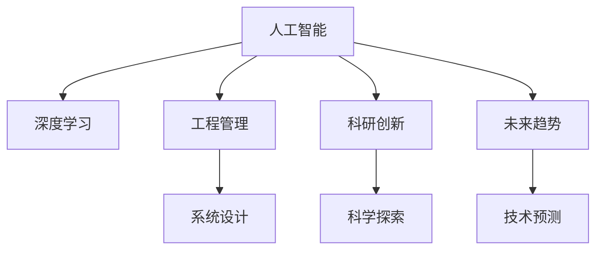

                 

# 塑造数字时代：人类计算的关键作用

> 关键词：数字时代,计算能力,人工智能,人机协同,工程管理,未来趋势,技术应用,科研创新

## 1. 背景介绍

### 1.1 问题由来
数字时代的到来，极大地改变了我们的生活方式、工作方式以及思考方式。在此过程中，计算能力发挥了至关重要的作用，驱动了科技的每一次重大突破。从原始的机械计算，到现代的电子计算机，再到当前的深度学习与人工智能，计算能力的飞跃带来了信息社会的爆炸性发展。

在这迅猛发展的浪潮中，人类计算的作用越发凸显。人类不仅仅是数据源和用户，更是系统设计和思维创新的源泉。无论是在工程管理、科研创新、技术应用还是未来趋势预判等方面，人类的直觉和经验都是不可或缺的关键因素。

### 1.2 问题核心关键点
当前，人类计算的作用主要体现在以下几个方面：

- **人工智能(AI)的发展**：深度学习与人工智能技术的突破离不开人的创意与算法优化。专家经验指导下的算法设计，使得模型在特定任务上表现卓越。
- **工程管理与系统设计**：跨领域专业知识与经验，推动了大规模项目的规划与执行。系统设计中的人机协同，有效平衡了系统性能与成本。
- **科研创新与突破**：前沿科学研究的进展，往往源于对已知数据的洞察与分析，而人类敏锐的直觉与逻辑推理，往往能在现有知识体系之外发现新的科学路径。
- **未来趋势的预判**：对技术应用的敏锐洞察，使得人类能够预见并引领未来的技术潮流。

## 2. 核心概念与联系

### 2.1 核心概念概述

为更好地理解人类计算的关键作用，本节将介绍几个密切相关的核心概念：

- **人工智能(AI)**：通过计算机模拟人的智能行为，实现自动化、智能化操作的技术。
- **深度学习(Deep Learning)**：一种基于神经网络结构，通过多层非线性映射，进行复杂数据分析与决策的机器学习技术。
- **工程管理(Engineering Management)**：以系统的视角，运用工程、技术和经济原理，对工程项目进行规划、设计、实施和评价的过程。
- **科研创新(Scientific Innovation)**：通过科学实验和数据分析，揭示自然规律，推动技术突破和科学进步的活动。
- **未来趋势(Future Trends)**：基于现有技术发展方向与市场需求，对未来可能出现的技术与应用进行预测与规划。

这些核心概念之间的逻辑关系可以通过以下Mermaid流程图来展示：



这个流程图展示的核心概念及其之间的关系：

1. 人工智能通过深度学习等技术实现自动化与智能化，涵盖从系统设计到科学探索等多个方面。
2. 工程管理运用人类专业知识，规划与执行项目，优化系统设计。
3. 科研创新揭示自然规律，推动技术进步，为人工智能提供新的发展方向。
4. 未来趋势预测未来发展，指导科研与工程实践。

## 3. 核心算法原理 & 具体操作步骤

### 3.1 算法原理概述

人工智能的实现过程中，计算能力、算法设计与人类经验密不可分。以深度学习为例，核心算法原理包括以下几个方面：

1. **多层非线性映射**：深度学习通过多层神经网络结构，实现对复杂输入数据的非线性映射，提取隐含特征，完成高级抽象。
2. **反向传播算法(Backpropagation)**：通过链式法则计算损失函数对模型参数的梯度，实现权重更新，优化模型性能。
3. **数据驱动**：深度学习依赖于大量标注数据进行训练，使模型能够学习到任务的规律与特征。
4. **人类经验指导**：模型设计、超参数调优等过程中，人类的知识与直觉起到了关键作用。

### 3.2 算法步骤详解

深度学习的核心算法步骤主要包括数据准备、模型训练、参数调整和模型评估：

1. **数据准备**：收集、清洗、标注数据，确保数据质量与多样性。
2. **模型训练**：使用深度学习框架，定义模型结构与优化策略，在标注数据上训练模型。
3. **参数调整**：根据训练结果，调整模型参数，如学习率、批次大小、正则化系数等，以提高模型性能。
4. **模型评估**：在验证集或测试集上评估模型效果，调整超参数，优化模型表现。

### 3.3 算法优缺点

深度学习的优缺点如下：

- **优点**：
  - **自适应性强**：能够处理大规模数据集，学习复杂特征。
  - **泛化能力**：在适当的数据和算法设计下，模型具有较强的泛化能力。
  - **人类经验结合**：人类知识与直觉在模型设计、超参数调整等过程中起到重要作用。
  
- **缺点**：
  - **数据依赖性强**：需要大量标注数据，数据质量与数量直接影响模型性能。
  - **模型复杂度高**：模型结构复杂，训练与推理资源消耗大。
  - **可解释性差**：深度学习模型往往是"黑盒"，难以解释其决策过程。

### 3.4 算法应用领域

深度学习在多个领域得到广泛应用：

- **计算机视觉**：如图像分类、目标检测、图像分割等任务。
- **自然语言处理(NLP)**：如文本分类、机器翻译、情感分析等任务。
- **语音识别**：如语音转文本、语音合成等任务。
- **推荐系统**：如电商推荐、广告推荐等。
- **自动驾驶**：如图像识别、路径规划等。

## 4. 数学模型和公式 & 详细讲解 & 举例说明

### 4.1 数学模型构建

以卷积神经网络(Convolutional Neural Networks, CNN)为例，构建基本的数学模型。

卷积神经网络由卷积层、池化层、全连接层组成，其中卷积层与池化层实现特征提取，全连接层进行分类决策。以二分类任务为例，数学模型构建如下：

- **输入层**：输入为 $x \in \mathbb{R}^n$。
- **卷积层**：通过卷积核对输入 $x$ 进行特征提取，输出为 $y_1 = h(x;\theta)$。
- **池化层**：对卷积层输出 $y_1$ 进行降维处理，输出为 $y_2 = h(y_1;\phi)$。
- **全连接层**：将池化层输出 $y_2$ 展开为向量 $z$，输出为二分类决策 $y = h(z;\omega)$。

### 4.2 公式推导过程

卷积神经网络的损失函数一般采用交叉熵损失，推导如下：

- **交叉熵损失**：$L = -\frac{1}{N} \sum_{i=1}^N [y_i\log(\hat{y}_i) + (1-y_i)\log(1-\hat{y}_i)]$

其中 $y_i$ 为真实标签，$\hat{y}_i$ 为模型预测输出。

- **反向传播算法**：计算损失函数对模型参数的梯度，更新模型权重，优化模型性能。

### 4.3 案例分析与讲解

以图像分类任务为例，探讨卷积神经网络的应用。假设输入为 $28\times28$ 像素的灰度图像，经过卷积、池化等操作后，输出为 $2$ 维的向量，通过全连接层进行二分类决策。以MNIST数据集为例，推导模型的训练与评估过程。

## 5. 项目实践：代码实例和详细解释说明

### 5.1 开发环境搭建

在进行深度学习项目实践前，我们需要准备好开发环境。以下是使用Python进行TensorFlow开发的环境配置流程：

1. 安装Anaconda：从官网下载并安装Anaconda，用于创建独立的Python环境。

2. 创建并激活虚拟环境：
```bash
conda create -n tensorflow-env python=3.8 
conda activate tensorflow-env
```

3. 安装TensorFlow：根据CUDA版本，从官网获取对应的安装命令。例如：
```bash
conda install tensorflow -c conda-forge
```

4. 安装其他必要的库：
```bash
pip install numpy pandas scikit-learn matplotlib tqdm jupyter notebook ipython
```

完成上述步骤后，即可在`tensorflow-env`环境中开始深度学习实践。

### 5.2 源代码详细实现

下面我们以图像分类任务为例，给出使用TensorFlow构建卷积神经网络的PyTorch代码实现。

首先，定义模型层：

```python
import tensorflow as tf
from tensorflow.keras import layers

class ConvNet(tf.keras.Model):
    def __init__(self, num_classes):
        super(ConvNet, self).__init__()
        self.conv1 = layers.Conv2D(32, (3,3), activation='relu', padding='same')
        self.pool1 = layers.MaxPooling2D((2,2))
        self.conv2 = layers.Conv2D(64, (3,3), activation='relu', padding='same')
        self.pool2 = layers.MaxPooling2D((2,2))
        self.flatten = layers.Flatten()
        self.dense1 = layers.Dense(128, activation='relu')
        self.dense2 = layers.Dense(num_classes, activation='softmax')
        
    def call(self, inputs):
        x = self.conv1(inputs)
        x = self.pool1(x)
        x = self.conv2(x)
        x = self.pool2(x)
        x = self.flatten(x)
        x = self.dense1(x)
        x = self.dense2(x)
        return x
```

然后，定义训练与评估函数：

```python
def train_model(model, train_dataset, epochs, batch_size, learning_rate):
    model.compile(optimizer=tf.keras.optimizers.Adam(learning_rate),
                  loss=tf.keras.losses.SparseCategoricalCrossentropy(),
                  metrics=['accuracy'])
    
    model.fit(train_dataset, epochs=epochs, batch_size=batch_size)
    
def evaluate_model(model, test_dataset, batch_size):
    test_loss, test_acc = model.evaluate(test_dataset, batch_size=batch_size)
    print(f'Test Loss: {test_loss}, Test Acc: {test_acc}')
```

最后，启动训练流程并在测试集上评估：

```python
epochs = 10
batch_size = 128
learning_rate = 0.001

model = ConvNet(num_classes)
train_dataset = # 加载训练数据集
test_dataset = # 加载测试数据集

train_model(model, train_dataset, epochs, batch_size, learning_rate)
evaluate_model(model, test_dataset, batch_size)
```

以上就是使用TensorFlow构建卷积神经网络并进行图像分类任务微调的完整代码实现。可以看到，TensorFlow提供的高层API使得模型构建和训练过程变得简洁高效。

### 5.3 代码解读与分析

让我们再详细解读一下关键代码的实现细节：

**ConvNet类**：
- `__init__`方法：定义模型的层级结构，包括卷积层、池化层、全连接层等。
- `call`方法：定义前向传播过程，从输入层开始，经过卷积、池化、全连接等操作，最终输出预测结果。

**train_model函数**：
- 定义模型编译的优化器、损失函数与评估指标。
- 使用`fit`方法在训练集上进行模型训练，通过多次迭代逐步优化模型参数。

**evaluate_model函数**：
- 在测试集上评估模型性能，输出损失和准确率。

**训练流程**：
- 定义总的epoch数和batch size，开始循环迭代
- 每个epoch内，先在训练集上训练，输出训练集上的损失和准确率
- 在测试集上评估，输出测试集上的损失和准确率

可以看到，TensorFlow提供了丰富的API和工具，使得深度学习模型的构建与训练过程变得简便快捷。开发者可以将更多精力放在数据处理、模型改进等高层逻辑上，而不必过多关注底层的实现细节。

当然，实际应用中还需要考虑更多因素，如超参数搜索、模型保存与部署等。但核心的深度学习范式基本与此类似。

## 6. 实际应用场景

### 6.1 智能推荐系统

深度学习在智能推荐系统中的应用非常广泛。传统推荐系统主要依赖用户行为数据，难以捕捉用户兴趣的多样性和复杂性。而深度学习模型通过分析用户的历史行为和互动，可以捕捉到更深层次的隐含特征，提供个性化的推荐结果。

在具体实现中，可以收集用户的历史浏览、购买、评分等行为数据，结合商品属性信息，使用深度学习模型进行特征学习与用户建模。通过多次迭代训练，模型能够自适应地捕捉用户兴趣，生成个性化的推荐列表，显著提高用户满意度与转化率。

### 6.2 医疗影像分析

在医疗影像分析领域，深度学习同样展示了其强大的能力。传统的影像分析依赖于医生丰富的经验和知识，但诊断任务繁重、耗时，且存在人为误差。通过深度学习模型对影像数据进行自动化的特征提取与分析，可以大幅提升诊断的准确率和效率。

在实践中，可以收集大量的医疗影像数据，并进行标注。使用卷积神经网络等深度学习模型，对影像进行特征提取与分类。模型训练完成后，可以应用于新的影像数据，快速生成诊断结果，为医生提供辅助决策。

### 6.3 自动驾驶系统

自动驾驶系统是深度学习在实时感知、决策与控制等方面的重要应用。通过深度学习模型，车辆可以实时处理传感器数据，识别道路标志、行人和其他车辆，进行路径规划与控制，实现自动驾驶。

在实现中，可以采用卷积神经网络等模型，对传感器数据进行特征提取与分类。结合其他感知与决策模型，实现高精度、高可靠性的自动驾驶功能。

## 7. 工具和资源推荐

### 7.1 学习资源推荐

为了帮助开发者系统掌握深度学习理论与实践，这里推荐一些优质的学习资源：

1. **《深度学习》书籍**：由Yoshua Bengio、Ian Goodfellow、Aaron Courville等机器学习专家共同撰写，全面介绍了深度学习的基本概念、算法与实践，是深度学习领域的经典之作。

2. **CS231n《深度学习视觉识别课程》**：斯坦福大学开设的深度学习视觉识别课程，涵盖计算机视觉领域的基本概念与经典模型，有Lecture视频和配套作业，深入浅出地讲解了深度学习的核心算法。

3. **Coursera《深度学习专项课程》**：由Andrew Ng教授主讲，介绍了深度学习的基础知识、高级算法与实际应用，适合初学者与进阶学习者。

4. **Kaggle平台**：全球最大的数据科学竞赛平台，提供大量公开数据集和比赛，帮助开发者实践深度学习技能，拓展学习视野。

5. **Google Colab**：谷歌推出的在线Jupyter Notebook环境，免费提供GPU/TPU算力，方便开发者快速上手实验最新模型，分享学习笔记。

通过对这些资源的学习实践，相信你一定能够快速掌握深度学习的基本原理与实践技能，并用于解决实际的业务问题。

### 7.2 开发工具推荐

高效的开发离不开优秀的工具支持。以下是几款用于深度学习项目开发的常用工具：

1. **TensorFlow**：由Google主导开发的开源深度学习框架，生产部署方便，适合大规模工程应用。同样有丰富的预训练模型资源。

2. **PyTorch**：基于Python的开源深度学习框架，灵活动态的计算图，适合快速迭代研究。大部分预训练语言模型都有PyTorch版本的实现。

3. **Keras**：基于TensorFlow和Theano的高级深度学习API，提供了高层抽象与便捷的API，适合快速搭建模型原型。

4. **Weights & Biases**：模型训练的实验跟踪工具，可以记录和可视化模型训练过程中的各项指标，方便对比和调优。与主流深度学习框架无缝集成。

5. **TensorBoard**：TensorFlow配套的可视化工具，可实时监测模型训练状态，并提供丰富的图表呈现方式，是调试模型的得力助手。

6. **Anaconda**：由Continuum Analytics开发的Python环境管理工具，支持创建虚拟环境、安装和管理Python包，方便开发环境的设置与维护。

合理利用这些工具，可以显著提升深度学习模型的开发效率，加快创新迭代的步伐。

### 7.3 相关论文推荐

深度学习技术的发展源于学界的持续研究。以下是几篇奠基性的相关论文，推荐阅读：

1. **《ImageNet Classification with Deep Convolutional Neural Networks》**：AlexNet论文，首次展示了深度卷积神经网络在图像分类任务上的强大能力。

2. **《Inception: Scalable Inception-based Neural Networks for Image Recognition》**：Inception模型，提出了Inception模块，优化了深度卷积神经网络的模型结构，提高了计算效率。

3. **《ResNet: Deep Residual Learning for Image Recognition》**：ResNet模型，提出了残差网络结构，解决了深度神经网络训练过程中的梯度消失问题。

4. **《Transformer Networks》**：Transformer模型，引入了自注意力机制，显著提升了深度学习在序列数据处理上的性能。

5. **《Attention is All You Need》**：Transformer模型原论文，提出了自注意力机制，推动了自然语言处理领域的深度学习应用。

这些论文代表了大规模深度学习模型与算法的发展脉络。通过学习这些前沿成果，可以帮助研究者把握学科前进方向，激发更多的创新灵感。

## 8. 总结：未来发展趋势与挑战

### 8.1 总结

本文对深度学习在数字时代的应用进行了全面系统的介绍。首先阐述了深度学习在人工智能发展、工程管理、科研创新与未来趋势预判等方面的重要地位，明确了深度学习在现代技术发展中的关键作用。其次，从原理到实践，详细讲解了深度学习的数学模型构建与算法实现，给出了深度学习任务开发的完整代码实例。同时，本文还广泛探讨了深度学习在推荐系统、医疗影像、自动驾驶等多个行业领域的应用前景，展示了深度学习技术的多样性与强大潜力。此外，本文精选了深度学习技术的各类学习资源，力求为读者提供全方位的技术指引。

通过本文的系统梳理，可以看到，深度学习在数字时代的作用日益凸显，成为了驱动科技发展的核心动力。未来，伴随深度学习技术的持续演进，其在各个领域的深度应用，必将继续拓展人类认知与行为的边界，带来前所未有的变革与创新。

### 8.2 未来发展趋势

展望未来，深度学习技术将呈现以下几个发展趋势：

1. **多模态学习**：深度学习将进一步拓展到多模态数据，如图像、语音、文本等，提升跨模态数据的整合与理解能力。

2. **自监督学习**：通过无标签数据进行预训练，减少对标注数据的依赖，提高深度学习模型的鲁棒性与泛化能力。

3. **联邦学习**：在分布式环境中，通过多方数据共享与协同训练，实现模型优化，保护数据隐私。

4. **边缘计算**：深度学习模型将在边缘设备上进行推理，实现低延迟、高实时性的计算需求。

5. **自动化模型开发**：借助自动化机器学习(AutoML)技术，自动化模型选择、超参数调优与模型部署，降低深度学习应用的门槛。

6. **模型压缩与优化**：通过模型压缩、量化等技术，优化模型大小与计算效率，支持大规模模型的部署与推理。

以上趋势凸显了深度学习技术的广阔前景。这些方向的探索发展，必将进一步提升深度学习模型的性能与效率，为更多行业带来深刻的变革。

### 8.3 面临的挑战

尽管深度学习技术已经取得了瞩目成就，但在迈向更加智能化、普适化应用的过程中，它仍面临着诸多挑战：

1. **数据依赖性强**：深度学习依赖于大量标注数据，数据质量与数量直接影响模型性能。如何降低对标注数据的依赖，是一个亟待解决的问题。

2. **计算资源消耗大**：深度学习模型规模大，计算资源消耗高，如何优化模型结构与计算效率，是另一个重要挑战。

3. **可解释性差**：深度学习模型往往是"黑盒"，难以解释其决策过程，这对于某些关键应用场景，如医疗、金融等，尤为重要。

4. **鲁棒性与泛化性**：深度学习模型在对抗样本、领域适应等方面存在局限，如何提高模型的鲁棒性与泛化性，是未来的一个重要研究方向。

5. **伦理与安全**：深度学习模型可能学习到有害信息，如何确保模型输出的安全性，避免误导性、歧视性的输出，是亟待解决的问题。

6. **人机协同**：如何在人机协同过程中，有效融合人的智慧与机器的能力，是深度学习应用面临的另一个重要挑战。

正视深度学习面临的这些挑战，积极应对并寻求突破，将使深度学习技术走向成熟，为构建人机协同的智能系统提供坚实的技术支撑。

### 8.4 研究展望

面对深度学习面临的种种挑战，未来的研究需要在以下几个方面寻求新的突破：

1. **无监督与半监督学习**：摆脱对大规模标注数据的依赖，利用自监督学习、主动学习等无监督和半监督范式，最大限度利用非结构化数据，实现更加灵活高效的模型训练。

2. **小样本学习**：在少量标注数据的情况下，利用深度学习模型进行高效学习，提升模型的泛化能力。

3. **参数高效与计算高效**：开发更加参数高效的深度学习模型与算法，在固定大部分模型参数的同时，只更新极少量的任务相关参数。同时优化模型的计算图，减少前向传播和反向传播的资源消耗，实现更加轻量级、实时性的部署。

4. **跨模态学习**：提升深度学习模型的多模态数据整合与理解能力，实现视觉、语音、文本等多模态数据的协同处理。

5. **自动化模型开发**：借助自动化机器学习(AutoML)技术，自动化模型选择、超参数调优与模型部署，降低深度学习应用的门槛。

6. **模型压缩与优化**：通过模型压缩、量化等技术，优化模型大小与计算效率，支持大规模模型的部署与推理。

这些研究方向的探索，必将引领深度学习技术的进一步发展，为构建人机协同的智能系统提供坚实的技术支撑。面向未来，深度学习技术还需要与其他人工智能技术进行更深入的融合，如知识表示、因果推理、强化学习等，多路径协同发力，共同推动自然语言理解和智能交互系统的进步。只有勇于创新、敢于突破，才能不断拓展深度学习模型的边界，让智能技术更好地造福人类社会。

## 9. 附录：常见问题与解答

**Q1：深度学习的应用范围有哪些？**

A: 深度学习在多个领域得到广泛应用：

- **计算机视觉**：如图像分类、目标检测、图像分割等任务。
- **自然语言处理(NLP)**：如文本分类、机器翻译、情感分析等任务。
- **语音识别**：如语音转文本、语音合成等任务。
- **推荐系统**：如电商推荐、广告推荐等。
- **自动驾驶**：如图像识别、路径规划等。

**Q2：深度学习与传统机器学习有什么区别？**

A: 深度学习与传统机器学习的主要区别在于：

- **模型复杂度**：深度学习模型由多层的神经网络构成，具有更强的非线性表达能力。
- **数据依赖**：深度学习依赖于大量标注数据进行训练，而传统机器学习对数据量要求相对较低。
- **特征工程**：深度学习可以通过模型自身学习数据特征，而传统机器学习需要人工设计特征。
- **可解释性**：深度学习模型往往是"黑盒"，难以解释其决策过程，而传统机器学习模型通常较为透明。

**Q3：如何优化深度学习模型的性能？**

A: 深度学习模型的性能优化可以从以下几个方面入手：

- **数据预处理**：包括数据清洗、归一化、数据增强等，提高数据质量与多样性。
- **模型结构优化**：通过网络结构设计、参数共享等方法，优化模型复杂度与计算效率。
- **超参数调优**：通过网格搜索、随机搜索等方法，寻找最优超参数组合，提升模型性能。
- **正则化与Dropout**：使用L2正则、Dropout等技术，防止过拟合。
- **模型压缩与优化**：通过模型压缩、量化等技术，优化模型大小与计算效率。

**Q4：深度学习在智能推荐系统中的应用有何优势？**

A: 深度学习在智能推荐系统中的应用具有以下优势：

- **用户兴趣建模**：深度学习模型能够自适应地捕捉用户兴趣，提供个性化的推荐结果。
- **实时性**：深度学习模型可以实时处理用户行为数据，快速生成推荐结果。
- **多模态数据融合**：深度学习模型可以整合多模态数据，提升推荐系统的综合性能。

**Q5：深度学习在医疗影像分析中的应用有何特点？**

A: 深度学习在医疗影像分析中的应用具有以下特点：

- **自动特征提取**：深度学习模型能够自动从影像中提取高层次的特征，提升诊断的准确率。
- **实时处理**：深度学习模型可以实时处理影像数据，提供高效的诊断服务。
- **跨模态融合**：深度学习模型可以整合多模态数据，如影像与文本，提升诊断的全面性。

---

作者：禅与计算机程序设计艺术 / Zen and the Art of Computer Programming

