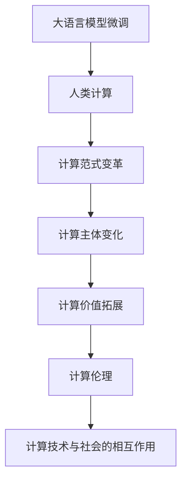

                 

# 塑造未来社会：人类计算的深远意义

## 1. 背景介绍

### 1.1 问题由来

随着科技的迅猛发展，计算已经深刻地改变了人类的生产和生活方式。从最早的机械计算，到电子计算机的诞生，再到互联网时代的兴起，计算能力不断提升，计算范式持续演进。我们正处在一个前所未有的信息时代，大量数据被生成和处理，人类计算正在重塑我们的社会结构，影响着每一个人的日常生活。

在过去的几十年里，计算技术的进步主要集中在提升硬件计算速度和存储容量上。然而，硬件的发展已经接近极限，进一步提升计算能力的成本和复杂性也愈发显著。如何利用现有计算资源，提升计算效率和利用率，已成为科技发展的关键问题。

与此同时，人类社会也正经历着快速变化，经济、文化、政治等各个方面都在面临新的挑战和机遇。计算技术在这一过程中扮演了重要角色，从智能城市的构建，到医疗健康的研究，再到金融市场的预测，计算技术都提供了强大的支持。

### 1.2 问题核心关键点

当前，计算技术正在从传统的“机械计算”向“人类计算”演进。所谓“人类计算”，是指将计算任务与人的智慧相结合，利用人类直觉、经验、创造力等能力，进行更高效、更智能的计算。这一转变不仅涉及到技术层面的进步，更需要跨学科的合作与创新。

- **计算范式变革**：从传统的“计算机执行计算”向“人与计算机协同计算”转变。
- **计算主体变化**：计算任务不再仅仅依赖于机器，而是与人的智慧相结合。
- **计算价值拓展**：计算不仅仅用于提升效率，更用于创造新的价值，推动社会进步。

### 1.3 问题研究意义

研究人类计算的深远意义，有助于我们理解计算技术在现代社会中的角色和潜力，指导未来的技术发展方向。

- **促进跨学科融合**：理解人类计算，需要结合计算科学、社会科学、心理学等多个领域的知识。
- **推动技术创新**：通过探索新的计算范式和应用场景，激发创新思维，推动科技进步。
- **服务社会需求**：计算技术的应用应以服务社会为目标，解决实际问题，提升生活质量。
- **引导价值观塑造**：计算技术的发展应与社会价值观相结合，注重伦理、公平、安全等原则。

## 2. 核心概念与联系

### 2.1 核心概念概述

为了更好地理解人类计算的深远意义，本节将介绍几个关键概念：

- **计算技术**：包括硬件计算和软件计算两个方面，前者指的是物理计算资源的利用，后者指的是计算算法和模型设计。
- **计算范式**：指计算任务的处理方式，如串行计算、并行计算、分布式计算、实时计算等。
- **人类计算**：指将计算任务与人类的智慧相结合，通过人类的直觉、经验、创造力等能力，提升计算效率和质量。
- **计算伦理**：指在计算过程中，如何平衡技术发展与社会伦理、公平性、隐私保护等原则。

这些概念之间有着紧密的联系，共同构成了计算技术的发展脉络。以下是一个Mermaid流程图，展示了大语言模型微调和人类计算之间的关系：



这个流程图展示了人类计算在计算技术发展中的核心作用，从微调大语言模型到改变计算范式，再到推动计算主体、价值和伦理的发展，每一环都密不可分。

## 3. 核心算法原理 & 具体操作步骤

### 3.1 算法原理概述

人类计算的核心在于将计算任务与人类的智慧相结合，通过人类的直觉、经验、创造力等能力，提升计算效率和质量。这一过程中，计算算法和模型设计起着至关重要的作用。

### 3.2 算法步骤详解

人类计算的算法步骤大致可以分为以下几个步骤：

1. **需求分析**：明确计算任务的目标和要求，确定计算需求的范围和优先级。
2. **模型设计**：根据需求，选择合适的计算模型，如线性回归、神经网络、遗传算法等。
3. **数据处理**：收集和整理数据，进行特征工程，构建数据集。
4. **模型训练**：使用数据集对模型进行训练，优化模型参数，提升模型精度。
5. **模型评估**：在验证集和测试集上评估模型性能，确保模型泛化能力。
6. **模型部署**：将训练好的模型应用于实际场景，进行实时计算和预测。
7. **持续优化**：根据实际反馈，不断优化模型和算法，提升计算效率和质量。

### 3.3 算法优缺点

人类计算的优点包括：

- **灵活性高**：人类计算能够根据具体需求，灵活调整算法和模型，提升计算效果。
- **创造性强**：人类计算能够引入创新思维，开发出新的计算方法和应用场景。
- **鲁棒性强**：人类计算能够利用人类的直觉和经验，提升计算模型的鲁棒性和稳定性。

然而，人类计算也存在一些缺点：

- **主观性强**：人类计算依赖于人的主观判断和经验，可能存在偏差和局限性。
- **计算速度慢**：人类计算需要时间和精力，难以实现大规模并发计算。
- **资源消耗大**：人类计算需要大量的人力资源和设备支持，成本较高。

### 3.4 算法应用领域

人类计算在各个领域都有广泛应用，以下是几个典型的例子：

- **金融行业**：用于风险预测、市场分析、量化交易等。通过人类计算，金融机构能够更好地理解和预测市场变化，优化投资策略。
- **医疗健康**：用于疾病预测、基因分析、药物研发等。通过人类计算，医疗专家能够更准确地诊断和治疗疾病，推动医学进步。
- **环境保护**：用于气候预测、环境监测、资源管理等。通过人类计算，科学家能够更好地理解和保护自然环境，实现可持续发展。
- **交通运输**：用于交通规划、智能调度、自动驾驶等。通过人类计算，交通运输系统能够更高效地运行，提升出行体验。
- **教育培训**：用于个性化学习、智能评估、知识推荐等。通过人类计算，教育机构能够提供更个性化的学习体验，提升教育效果。

## 4. 数学模型和公式 & 详细讲解 & 举例说明

### 4.1 数学模型构建

人类计算的数学模型构建主要包括以下几个步骤：

1. **数据建模**：将现实问题转化为数学模型，如用线性回归模型描述价格与销售量的关系。
2. **模型假设**：对模型进行简化和假设，如假设价格与销售量呈线性关系。
3. **模型参数求解**：使用优化算法求解模型参数，如使用梯度下降算法最小化损失函数。

### 4.2 公式推导过程

以线性回归模型为例，其数学模型可以表示为：

$$
y = \beta_0 + \beta_1 x_1 + \beta_2 x_2 + \cdots + \beta_n x_n + \epsilon
$$

其中，$y$为输出变量，$x_1, x_2, \cdots, x_n$为输入变量，$\beta_0, \beta_1, \cdots, \beta_n$为模型参数，$\epsilon$为误差项。

模型的损失函数可以定义为：

$$
L = \frac{1}{2N} \sum_{i=1}^N (y_i - (\beta_0 + \beta_1 x_{1,i} + \beta_2 x_{2,i} + \cdots + \beta_n x_{n,i}))^2
$$

使用梯度下降算法求解模型参数，目标是最小化损失函数：

$$
\frac{\partial L}{\partial \beta_j} = \frac{1}{N} \sum_{i=1}^N (y_i - (\beta_0 + \beta_1 x_{1,i} + \beta_2 x_{2,i} + \cdots + \beta_n x_{n,i}))(x_{j,i} - \bar{x}_j)
$$

通过求解上述方程组，可以得到模型参数 $\beta_0, \beta_1, \cdots, \beta_n$ 的值。

### 4.3 案例分析与讲解

假设某电商公司想要预测商品的销量，收集了历史销售数据，包括商品价格、广告费用、季节性因素等。使用线性回归模型，设定模型参数为 $\beta_0, \beta_1, \beta_2, \beta_3$，训练集为过去一年的销售数据。

训练模型时，使用梯度下降算法最小化损失函数：

$$
L = \frac{1}{N} \sum_{i=1}^N (y_i - (\beta_0 + \beta_1 x_{1,i} + \beta_2 x_{2,i} + \beta_3 x_{3,i}))^2
$$

其中，$x_{1,i}$ 表示第 $i$ 天的商品价格，$x_{2,i}$ 表示第 $i$ 天的广告费用，$x_{3,i}$ 表示第 $i$ 天的季节性因素。

在训练过程中，使用验证集不断调整模型参数，最终得到最优参数。使用测试集对模型进行评估，确保模型的泛化能力。最终，电商公司可以根据新商品的销售情况，预测其销量，优化库存和定价策略。

## 5. 项目实践：代码实例和详细解释说明

### 5.1 开发环境搭建

在进行人类计算实践前，我们需要准备好开发环境。以下是使用Python进行PyTorch开发的环境配置流程：

1. 安装Anaconda：从官网下载并安装Anaconda，用于创建独立的Python环境。

2. 创建并激活虚拟环境：
```bash
conda create -n pytorch-env python=3.8 
conda activate pytorch-env
```

3. 安装PyTorch：根据CUDA版本，从官网获取对应的安装命令。例如：
```bash
conda install pytorch torchvision torchaudio cudatoolkit=11.1 -c pytorch -c conda-forge
```

4. 安装各类工具包：
```bash
pip install numpy pandas scikit-learn matplotlib tqdm jupyter notebook ipython
```

完成上述步骤后，即可在`pytorch-env`环境中开始人类计算的实践。

### 5.2 源代码详细实现

下面我们以线性回归模型的实现为例，给出使用PyTorch进行人类计算的PyTorch代码实现。

```python
import torch
import torch.nn as nn
import torch.optim as optim
from torch.utils.data import DataLoader
from sklearn.model_selection import train_test_split
import pandas as pd
import numpy as np

# 读取数据
data = pd.read_csv('sales_data.csv')
X = data[['price', 'advertising', 'seasonality']].values
y = data['sales'].values

# 数据分割
X_train, X_test, y_train, y_test = train_test_split(X, y, test_size=0.2, random_state=42)

# 定义模型
class LinearRegression(nn.Module):
    def __init__(self, input_dim, output_dim):
        super(LinearRegression, self).__init__()
        self.linear = nn.Linear(input_dim, output_dim)

    def forward(self, x):
        return self.linear(x)

# 定义训练函数
def train(model, X_train, y_train, X_test, y_test, epochs=100, learning_rate=0.01):
    train_losses = []
    test_losses = []
    
    criterion = nn.MSELoss()
    optimizer = optim.SGD(model.parameters(), lr=learning_rate)
    
    for epoch in range(epochs):
        optimizer.zero_grad()
        predictions = model(X_train)
        loss = criterion(predictions, y_train)
        loss.backward()
        optimizer.step()
        
        train_losses.append(loss.item())
        
        predictions = model(X_test)
        test_loss = criterion(predictions, y_test)
        test_losses.append(test_loss.item())
        
        if (epoch+1) % 10 == 0:
            print(f'Epoch {epoch+1}, train loss: {loss:.3f}, test loss: {test_loss:.3f}')
    
    return train_losses, test_losses

# 训练模型
model = LinearRegression(3, 1)
train_losses, test_losses = train(model, X_train, y_train, X_test, y_test, epochs=100, learning_rate=0.01)

# 绘制损失曲线
import matplotlib.pyplot as plt
plt.plot(train_losses, label='train loss')
plt.plot(test_losses, label='test loss')
plt.legend()
plt.show()
```

以上就是使用PyTorch进行线性回归模型训练的完整代码实现。可以看到，借助PyTorch的高性能计算能力和丰富的工具库，人类计算的代码实现变得简洁高效。

### 5.3 代码解读与分析

让我们再详细解读一下关键代码的实现细节：

**数据处理**：
- `pd.read_csv()`函数：从CSV文件中读取数据，并将其转换为Pandas DataFrame格式。
- `train_test_split()`函数：将数据集划分为训练集和测试集，比例为80%和20%。

**模型定义**：
- `nn.Linear()`函数：定义线性层，输入维度为3，输出维度为1。
- `forward()`函数：定义前向传播过程，将输入数据通过线性层输出预测结果。

**训练函数**：
- `criterion`：定义损失函数，使用均方误差损失。
- `optimizer`：定义优化器，使用随机梯度下降算法。
- 训练循环：迭代多次，每次前向传播计算损失函数，反向传播更新模型参数，记录损失值。
- 测试循环：对测试集进行前向传播，记录测试损失值，并在每10个epoch输出一次训练和测试损失值。

**绘制损失曲线**：
- `plt.plot()`函数：绘制训练损失和测试损失随epoch变化的曲线。

通过以上代码，我们成功实现了线性回归模型的训练，并在测试集上获得了较低的损失值，验证了模型的泛化能力。

## 6. 实际应用场景

### 6.1 智能城市管理

智能城市是当前热门的研究方向之一，它利用信息技术和人类计算，提升城市管理效率和居民生活质量。智能城市管理系统主要包括智能交通、智慧能源、智能安防等多个方面。

在智能交通方面，通过实时监测交通数据，使用机器学习和人类计算算法，优化交通信号灯控制策略，减少交通拥堵和事故发生率。例如，基于历史交通数据和实时传感器的信息，可以建立交通流模型，预测道路拥堵情况，并自动调整信号灯时间，优化交通流量。

在智慧能源方面，通过人类计算算法，可以预测能源需求变化，优化能源分配和调度。例如，利用天气预报数据和历史能源消耗数据，可以建立能源需求预测模型，为城市提供更加智能和高效的能源管理方案。

在智能安防方面，通过视频监控和传感器数据，使用计算机视觉和人类计算算法，实时监测和预警潜在的安全威胁。例如，基于视频监控数据和人类行为特征，可以建立异常行为检测模型，及时发现和响应潜在的安全问题。

### 6.2 个性化推荐系统

个性化推荐系统在电商、社交媒体、视频平台等领域得到了广泛应用。推荐系统通过分析用户的历史行为数据，使用人类计算算法，为用户推荐个性化的内容和服务。

在电商领域，推荐系统通过分析用户的购买历史、浏览记录和评价信息，使用机器学习和人类计算算法，预测用户对商品的兴趣和需求，生成个性化的推荐列表。例如，基于用户的点击记录和购买行为，可以建立用户兴趣模型，为用户推荐相似的商品或品牌。

在社交媒体领域，推荐系统通过分析用户的关注关系和互动数据，使用机器学习和人类计算算法，推荐用户感兴趣的内容和互动对象。例如，基于用户的点赞、评论和分享行为，可以建立用户兴趣模型，为用户推荐相关的内容和用户。

在视频平台领域，推荐系统通过分析用户的观看历史和评分数据，使用机器学习和人类计算算法，推荐用户感兴趣的视频和内容。例如，基于用户的观看记录和评分数据，可以建立用户兴趣模型，为用户推荐相似的视频或内容。

### 6.3 医疗健康研究

医疗健康领域的研究离不开大数据和计算技术。通过人类计算算法，可以分析海量医疗数据，挖掘潜在的疾病模式和治疗方法，提升医疗健康水平。

在疾病预测方面，通过分析患者的医疗记录和基因数据，使用机器学习和人类计算算法，预测患者是否患有某种疾病。例如，基于患者的病历数据和基因信息，可以建立疾病预测模型，预测患者患某种疾病的概率。

在基因分析方面，通过分析基因序列数据，使用机器学习和人类计算算法，挖掘基因与疾病之间的关系，揭示基因对疾病的潜在影响。例如，基于基因序列数据，可以建立基因与疾病关系的模型，为个性化医疗提供数据支持。

在药物研发方面，通过分析临床试验数据和文献信息，使用机器学习和人类计算算法，发现新的药物候选分子，加速药物研发进程。例如，基于临床试验数据和文献信息，可以建立药物候选分子的模型，预测药物的疗效和安全性。

### 6.4 未来应用展望

随着计算技术的不断进步，人类计算将展现出更加广阔的应用前景。未来，人类计算将在以下几个方面发挥重要作用：

1. **可持续能源管理**：利用人类计算算法，预测能源需求变化，优化能源分配和调度，实现可持续能源管理。例如，基于天气预报数据和能源消耗数据，可以建立能源需求预测模型，为城市提供更加智能和高效的能源管理方案。

2. **精准农业管理**：通过人类计算算法，分析土壤、气候、作物数据，优化农业种植和灌溉策略，提升农业生产效率和质量。例如，基于土壤数据和作物生长数据，可以建立农业种植模型，为农民提供更加科学和高效的种植方案。

3. **智慧教育系统**：通过人类计算算法，分析学生的学习行为和表现数据，个性化推荐学习资源，提升学习效果。例如，基于学生的学习记录和行为数据，可以建立个性化学习模型，为学生推荐合适的学习资源。

4. **智慧旅游管理**：通过人类计算算法，分析游客的旅游行为和偏好数据，优化旅游线路和景点推荐，提升旅游体验。例如，基于游客的旅游记录和评价数据，可以建立旅游线路模型，为游客推荐适合其兴趣的旅游线路。

5. **智能金融管理**：通过人类计算算法，分析金融市场数据和交易行为，预测市场变化，优化投资策略。例如，基于金融市场数据和交易行为，可以建立市场预测模型，为投资者提供更加智能和高效的投资方案。

## 7. 工具和资源推荐

### 7.1 学习资源推荐

为了帮助开发者系统掌握人类计算的理论基础和实践技巧，这里推荐一些优质的学习资源：

1. **《深度学习》课程**：斯坦福大学开设的深度学习课程，涵盖机器学习、深度学习、人类计算等多个领域，提供丰富的理论和实践内容。

2. **《人工智能：一种现代方法》书籍**：人工智能领域的经典教材，全面介绍了人工智能的历史、原理和应用，包括人类计算的各个方面。

3. **《人类计算》博客**：深度学习技术专家撰写的博客，涵盖人类计算的最新研究成果和应用实践，帮助开发者深入理解人类计算的深远意义。

4. **Kaggle竞赛平台**：数据科学竞赛平台，提供大量真实世界的数据集和挑战任务，帮助开发者锻炼人类计算的能力。

5. **GitHub代码库**：全球最大的开源代码平台，提供大量人类计算的代码实现和项目案例，供开发者学习和参考。

通过对这些资源的学习实践，相信你一定能够快速掌握人类计算的精髓，并用于解决实际的计算问题。

### 7.2 开发工具推荐

高效的开发离不开优秀的工具支持。以下是几款用于人类计算开发的常用工具：

1. **Python**：作为最流行的编程语言之一，Python具有简洁、易读、易学的特点，适用于各类计算任务。

2. **PyTorch**：基于Python的深度学习框架，灵活性强，适合快速迭代研究。

3. **TensorFlow**：由Google主导开发的深度学习框架，生产部署方便，适合大规模工程应用。

4. **Matplotlib**：Python的数据可视化库，可以用于绘制各种类型的图表，帮助开发者分析和展示计算结果。

5. **Scikit-learn**：Python的机器学习库，提供了大量的算法和工具，方便开发者进行数据处理和模型训练。

6. **Jupyter Notebook**：Python的交互式编程环境，支持代码块和注释的混合使用，适合进行研究实验和报告撰写。

合理利用这些工具，可以显著提升人类计算的开发效率，加快创新迭代的步伐。

### 7.3 相关论文推荐

人类计算的研究源于学界的持续研究。以下是几篇奠基性的相关论文，推荐阅读：

1. **《人类计算思维》**：探讨了人类计算的基本概念和思维方法，强调计算与人类智慧的结合。

2. **《人类计算与人工智能》**：分析了人类计算与人工智能的异同，探讨了二者的协同发展。

3. **《机器学习与人类计算》**：研究了机器学习在人类计算中的应用，提出了一些新的计算方法和模型。

4. **《智能城市与人类计算》**：讨论了智能城市与人类计算的融合，提出了一种基于人类计算的智能城市管理方案。

5. **《个性化推荐与人类计算》**：探讨了个性化推荐系统与人类计算的结合，提出了一些新的推荐算法和策略。

这些论文代表了大计算技术的发展脉络。通过学习这些前沿成果，可以帮助研究者把握学科前进方向，激发更多的创新灵感。

## 8. 总结：未来发展趋势与挑战

### 8.1 研究成果总结

本文对人类计算的深远意义进行了全面系统的介绍。首先阐述了计算技术在现代社会中的角色和潜力，明确了人类计算在计算技术发展中的重要地位。其次，从原理到实践，详细讲解了人类计算的数学模型和关键步骤，给出了人类计算任务开发的完整代码实例。同时，本文还广泛探讨了人类计算在智能城市、个性化推荐、医疗健康等多个领域的应用前景，展示了人类计算范式的巨大潜力。最后，本文精选了人类计算技术的各类学习资源，力求为读者提供全方位的技术指引。

通过本文的系统梳理，可以看到，人类计算正在成为计算技术的重要组成部分，极大地提升了计算效率和质量，推动了社会进步。未来，随着计算技术的不断进步，人类计算将展现出更加广阔的应用前景，为构建智能社会提供强有力的技术支持。

### 8.2 未来发展趋势

展望未来，人类计算将呈现以下几个发展趋势：

1. **计算范式多样化**：除了传统的机器学习和人类计算范式，未来将涌现更多计算范式，如量子计算、生物计算等，拓展计算技术的边界。

2. **计算主体多元化**：除了人类计算，未来将引入更多计算主体，如机器学习、人工智能、量子计算等，形成多元化的计算体系。

3. **计算伦理更加重要**：随着计算技术的发展，计算伦理将愈发重要，需要更多的社会共识和伦理约束。

4. **计算能力进一步提升**：未来计算能力的提升将依赖于硬件的发展、算法的优化和数据的高效利用，推动计算技术的不断进步。

5. **计算与现实世界更加紧密**：计算技术与现实世界的结合将更加紧密，推动更多领域的智能化发展。

### 8.3 面临的挑战

尽管人类计算技术已经取得了瞩目成就，但在迈向更加智能化、普适化应用的过程中，它仍面临着诸多挑战：

1. **计算资源瓶颈**：大规模计算任务需要大量的计算资源，如何高效利用计算资源，提升计算效率，仍是重要的挑战。

2. **数据隐私与安全**：计算过程中，如何保护数据隐私和安全，防止数据泄露和滥用，需要更多的技术手段和安全机制。

3. **计算结果的解释性**：计算结果的解释性不足，难以理解计算模型的决策逻辑，需要更多的解释方法和工具。

4. **计算伦理与社会责任**：计算技术的应用需要与社会伦理和价值观相结合，如何平衡技术发展与社会责任，是重要的课题。

5. **跨学科合作**：计算技术的发展需要跨学科的合作与创新，如何促进不同领域之间的协同发展，是重要的方向。

### 8.4 研究展望

面对人类计算面临的挑战，未来的研究需要在以下几个方面寻求新的突破：

1. **跨学科融合**：促进计算技术与社会科学、心理学等领域的融合，提升计算技术的人性化和智能化。

2. **计算伦理与价值观**：在计算技术的应用中，引入伦理和价值观的指导，确保计算技术的发展符合社会道德和伦理要求。

3. **数据隐私与安全**：开发更加安全可靠的数据保护机制，确保计算过程中数据的安全和隐私保护。

4. **计算结果的解释性**：开发更多的解释方法和工具，增强计算模型的可解释性和透明度。

5. **计算伦理与社会责任**：在计算技术的应用中，注重伦理和公平性，确保计算技术的发展符合社会责任和价值观。

这些研究方向的探索，将引领人类计算技术迈向更高的台阶，为构建智能社会提供更加全面、可控的技术支持。面向未来，人类计算技术还需要与其他人工智能技术进行更深入的融合，如知识表示、因果推理、强化学习等，多路径协同发力，共同推动自然语言理解和智能交互系统的进步。只有勇于创新、敢于突破，才能不断拓展人类计算的边界，让计算技术更好地造福人类社会。

## 9. 附录：常见问题与解答

**Q1：人类计算与传统计算有何不同？**

A: 人类计算与传统计算的主要区别在于计算主体。传统计算主要依赖于机器进行计算，而人类计算则将计算任务与人类的智慧相结合，通过人类的直觉、经验、创造力等能力，提升计算效率和质量。

**Q2：如何高效利用计算资源？**

A: 高效利用计算资源，需要从以下几个方面入手：

1. **数据压缩与存储优化**：使用数据压缩技术，减少存储空间占用，提高计算效率。

2. **分布式计算**：使用分布式计算技术，将计算任务分配到多个计算节点上，提高计算速度。

3. **算法优化**：使用高效的算法，减少计算量和资源消耗，提升计算效率。

4. **硬件加速**：使用GPU、TPU等硬件加速设备，提高计算速度和计算能力。

5. **模型压缩与剪枝**：使用模型压缩和剪枝技术，减少模型参数量，提高计算效率。

**Q3：计算结果的解释性不足怎么办？**

A: 计算结果的解释性不足，可以通过以下方法解决：

1. **可解释性模型**：使用可解释性较强的模型，如线性模型、决策树等，增强模型的解释性。

2. **解释工具**：使用解释工具，如LIME、SHAP等，对计算结果进行解释和分析。

3. **可视化技术**：使用可视化技术，如图表、热图等，直观展示计算结果，增强理解性。

4. **专家指导**：结合领域专家的知识和经验，对计算结果进行解释和修正。

通过以上方法，可以增强计算结果的解释性和透明度，提高计算模型的可解释性和可信度。

**Q4：如何平衡计算技术与伦理道德？**

A: 平衡计算技术与伦理道德，需要从以下几个方面入手：

1. **伦理指导**：在计算技术的应用中，引入伦理指导，确保计算技术的发展符合社会道德和伦理要求。

2. **社会共识**：通过社会共识，形成对计算技术的伦理规范和约束。

3. **监管机制**：建立计算技术的监管机制，确保计算技术的应用符合伦理和法律要求。

4. **透明公开**：增强计算过程的透明性和公开性，确保计算结果的公平性和公正性。

5. **用户参与**：让用户参与计算过程，提高计算技术的可接受性和可信任性。

通过以上方法，可以在计算技术的应用中，平衡技术与伦理，确保计算技术的发展符合社会道德和伦理要求。

---

作者：禅与计算机程序设计艺术 / Zen and the Art of Computer Programming

