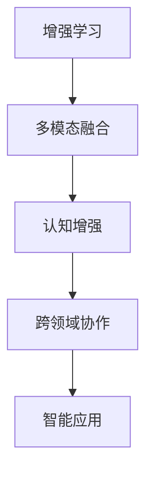

                 

# 增强智能：人机协作，提升认知能力

## 1. 背景介绍

随着人工智能技术的不断演进，人机协作的智能化水平正逐步提升。无论是智能家居、智能客服、智能驾驶，还是医疗、教育、金融等行业，都开始广泛引入AI系统，以提升工作效率和用户体验。然而，当前的AI技术仍存在诸多局限，难以完全替代人类的认知智能。本文将探讨人机协作的智能化提升，通过增强学习、多模态融合、认知增强等技术手段，赋予人类更强大的认知能力。

## 2. 核心概念与联系

### 2.1 核心概念概述

为了更好地理解人机协作的智能化提升，本节将介绍几个密切相关的核心概念：

- **增强学习(Reinforcement Learning, RL)**：一种通过与环境交互，以奖励为导向的学习方式。强化学习系统通过不断试错，学习如何在特定环境中取得最佳结果。
- **多模态融合(Multimodal Fusion)**：指将文本、语音、图像、视频等多种信息源融合在一起，形成一个更全面、更丰富的信息表示，从而提升AI系统的智能化水平。
- **认知增强(Cognitive Enhancement)**：利用人工智能技术，增强人类认知能力，如注意力、记忆、推理、决策等方面，以提升人类认知智能水平。
- **跨领域协作(Cross-Domain Collaboration)**：指将不同领域的AI系统进行联合设计和使用，从而实现系统间的功能互补，提升整体智能化水平。

这些核心概念之间存在着紧密的联系，共同构成了人机协作智能化的基础框架。通过理解这些核心概念，我们可以更好地把握智能化提升的方向和方法。

### 2.2 核心概念原理和架构的 Mermaid 流程图



这个流程图展示了核心概念之间的逻辑关系：

1. **增强学习**：作为基础框架，通过不断试错和奖励机制，学习最优策略。
2. **多模态融合**：将多种信息源进行融合，形成一个更全面的信息表示。
3. **认知增强**：在增强学习和多模态融合的基础上，进一步提升人类的认知能力。
4. **跨领域协作**：实现不同领域的AI系统联合设计和使用，形成更强大的智能功能。

## 3. 核心算法原理 & 具体操作步骤

### 3.1 算法原理概述

人机协作的智能化提升，本质上是通过增强学习和多模态融合，将AI技术与人类的认知智能进行融合，从而实现更高效的协同工作。核心算法原理主要包括以下几个方面：

1. **强化学习框架**：利用奖励信号，指导AI系统学习最优策略。
2. **多模态信息融合**：通过深度学习等方法，将不同模态的信息进行融合，形成一个更全面、更丰富的信息表示。
3. **认知增强算法**：通过改进注意力机制、记忆模型、推理模型等，增强人类的认知能力。
4. **跨领域协作模型**：构建不同领域AI系统的联合模型，实现功能互补，提升整体智能化水平。

### 3.2 算法步骤详解

基于上述原理，增强智能的实现主要包括以下几个关键步骤：

**Step 1: 数据准备**
- 收集和预处理各模态的数据，如文本、语音、图像、视频等。确保数据的多样性和完整性。
- 划分数据集为训练集、验证集和测试集，进行随机抽样和数据增强。

**Step 2: 模型设计**
- 选择合适的模型架构，如深度神经网络、Transformer等。
- 设计多模态融合模块，将不同模态的信息进行融合。
- 设计认知增强模块，改进注意力、记忆、推理等机制。

**Step 3: 模型训练**
- 在训练集上对模型进行优化训练，最小化损失函数。
- 引入正则化技术，防止过拟合。
- 利用增强学习技术，对模型进行奖励导向的训练。

**Step 4: 模型评估和优化**
- 在验证集上评估模型性能，进行超参数调优。
- 利用测试集对模型进行最终评估，分析评估结果，提取改进方向。

**Step 5: 部署和应用**
- 将训练好的模型部署到生产环境中。
- 实现与人类认知智能的协同工作，提升整体智能化水平。

### 3.3 算法优缺点

增强智能的算法具有以下优点：
1. **提升认知能力**：通过多模态融合和认知增强，赋予人类更强大的认知能力，提升决策和推理效率。
2. **增强协作能力**：通过跨领域协作，实现不同领域的AI系统联合设计和使用，提升整体智能化水平。
3. **泛化能力**：通过增强学习，AI系统能够在不断试错中学习最优策略，适应不同的环境和任务。
4. **灵活性**：多模态融合和认知增强算法，可以灵活应用于多个领域和场景，提升AI系统的通用性。

同时，这些算法也存在一些局限性：
1. **计算资源需求高**：多模态融合和深度学习模型对计算资源的要求较高。
2. **数据依赖**：模型训练和优化需要大量高质量的数据，获取和处理数据成本较高。
3. **模型复杂性**：模型结构复杂，需要更多的工程和调参工作。
4. **应用场景限制**：当前算法主要应用于特定场景，如智能客服、医疗诊断等，对于其他领域的应用效果有限。

尽管存在这些局限性，但增强智能通过融合人工智能和人类认知智能，已在多个领域展示了其巨大潜力。未来，随着计算资源的提升和数据获取能力的增强，增强智能将进一步拓展其应用范围，成为人机协作智能化的重要手段。

### 3.4 算法应用领域

增强智能在多个领域具有广泛的应用前景，主要包括以下几个方面：

**智能客服**
- 利用多模态融合和认知增强技术，提升客服系统的智能化水平，实现更自然的人机交互。
- 通过增强学习技术，系统能够不断学习客户的行为模式，提供个性化的服务。

**医疗诊断**
- 结合医学影像、病历、基因数据等多种信息源，通过多模态融合技术，提升诊断的准确性和效率。
- 通过认知增强技术，改进医生的注意力和记忆模型，辅助诊断决策。

**智能驾驶**
- 利用多传感器数据，如摄像头、雷达、激光雷达等，进行多模态信息融合，提升感知和决策能力。
- 通过增强学习技术，系统能够在复杂道路环境中学习最优驾驶策略。

**教育辅助**
- 结合学习者的学习行为数据、语音输入、图像反馈等，通过多模态融合技术，提升学习效果。
- 通过认知增强技术，改进学习者的注意力和记忆模型，提高学习效率。

**金融风险管理**
- 结合市场数据、新闻、社交媒体等，通过多模态融合技术，提升风险预测的准确性。
- 通过增强学习技术，系统能够在不断变化的市场环境中学习最优策略。

除了上述这些领域，增强智能还可以应用于智能家居、智能物流、智能制造等多个领域，提升系统的智能化水平，带来更多的业务价值。

## 4. 数学模型和公式 & 详细讲解

### 4.1 数学模型构建

增强智能涉及多个领域，以下以医疗诊断为例，介绍其数学模型的构建。

假设一个医疗诊断系统，输入数据为病人的病历 $x$ 和医学影像 $y$，输出为诊断结果 $z$。通过多模态融合和认知增强技术，构建如下数学模型：

$$
z = f_\theta(x, y)
$$

其中，$f_\theta$ 为参数化的多模态融合和认知增强模型，$\theta$ 为模型参数。

### 4.2 公式推导过程

在医疗诊断模型中，输入数据 $x$ 和 $y$ 分别来自病历和医学影像，可以表示为：

$$
x = \{d_1, d_2, \cdots, d_n\}, \quad y = \{m_1, m_2, \cdots, m_m\}
$$

其中 $d_i$ 为病历中的文本数据，$m_j$ 为医学影像中的像素数据。

通过多模态融合技术，将 $x$ 和 $y$ 进行融合，得到一个综合的信息表示 $z'$：

$$
z' = h_\phi(x, y)
$$

其中 $h_\phi$ 为多模态融合模型，$\phi$ 为模型参数。

接着，通过认知增强算法，进一步提升 $z'$ 的认知能力，得到一个更优的诊断结果 $z$：

$$
z = g_\psi(z')
$$

其中 $g_\psi$ 为认知增强模型，$\psi$ 为模型参数。

最终，通过训练模型 $f_\theta$，最小化损失函数 $L$：

$$
\theta = \mathop{\arg\min}_{\theta} L(z, f_\theta(x, y))
$$

其中 $L$ 为损失函数，通常采用交叉熵损失或均方误差损失。

### 4.3 案例分析与讲解

以医疗影像诊断为例，多模态融合和认知增强技术的具体应用如下：

**多模态融合**
- 利用深度学习技术，如卷积神经网络(CNN)、长短期记忆网络(LSTM)等，对医学影像 $y$ 进行特征提取和编码。
- 结合病历文本 $x$，通过注意力机制，选择重要的影像特征进行融合，得到融合后的特征表示 $z'$。

**认知增强**
- 改进注意力机制，通过增强学习技术，学习如何在影像和文本中分配注意力，提升诊断的准确性。
- 利用记忆模型，增强医生在影像和病历中的记忆能力，帮助其在复杂情况下做出正确决策。

## 5. 项目实践：代码实例和详细解释说明

### 5.1 开发环境搭建

在进行增强智能的实践前，我们需要准备好开发环境。以下是使用Python进行TensorFlow开发的环境配置流程：

1. 安装Anaconda：从官网下载并安装Anaconda，用于创建独立的Python环境。

2. 创建并激活虚拟环境：
```bash
conda create -n tf-env python=3.8 
conda activate tf-env
```

3. 安装TensorFlow：根据CUDA版本，从官网获取对应的安装命令。例如：
```bash
conda install tensorflow tensorflow-gpu -c conda-forge
```

4. 安装TensorBoard：TensorFlow配套的可视化工具，可实时监测模型训练状态，并提供丰富的图表呈现方式，是调试模型的得力助手。
```bash
pip install tensorboard
```

5. 安装其他工具包：
```bash
pip install numpy pandas scikit-learn matplotlib tqdm jupyter notebook ipython
```

完成上述步骤后，即可在`tf-env`环境中开始增强智能的实践。

### 5.2 源代码详细实现

下面我们以医疗影像诊断为例，给出使用TensorFlow进行多模态融合和认知增强的代码实现。

首先，定义医疗影像和病历数据的处理函数：

```python
import tensorflow as tf
from tensorflow.keras.layers import Input, Dense, Embedding, LSTM, Conv2D, MaxPooling2D, Concatenate
from tensorflow.keras.models import Model

def preprocess_data(text_data, img_data, max_len, img_height, img_width):
    text_input = Input(shape=(max_len,), name='text_input')
    text_embed = Embedding(input_dim=vocab_size, output_dim=embedding_dim, name='text_embed')(text_input)
    text_lstm = LSTM(units=64, name='text_lstm')(text_embed)
    text_output = Dense(units=embedding_dim, activation='relu', name='text_output')(text_lstm)
    
    img_input = Input(shape=(img_height, img_width, 3), name='img_input')
    img_conv = Conv2D(filters=32, kernel_size=(3, 3), activation='relu', name='img_conv')(img_input)
    img_pool = MaxPooling2D(pool_size=(2, 2), name='img_pool')(img_conv)
    img_output = Flatten(name='img_output')(img_pool)
    
    fused_input = Concatenate(axis=-1, name='fused_input')([text_output, img_output])
    return [text_input, img_input], fused_input
```

然后，定义多模态融合和认知增强模型：

```python
from tensorflow.keras.layers import Attention, RepeatVector, Dense
from tensorflow.keras.models import Model

def build_model(text_input, img_output, max_len, img_height, img_width):
    attention = Attention(name='attention')([text_output, img_output])
    repeated = RepeatVector(input_dim=max_len, axis=1)(attention)
    final_output = Dense(units=64, activation='relu', name='final_output')(repeated)
    
    output = Dense(units=num_classes, activation='softmax', name='output')(final_output)
    model = Model(inputs=[text_input, img_input], outputs=[output])
    return model
```

最后，启动训练流程并在测试集上评估：

```python
from tensorflow.keras.optimizers import Adam
from tensorflow.keras.metrics import CategoricalAccuracy
from sklearn.model_selection import train_test_split

# 加载数据
text_data, img_data, labels = load_data()
text_data, val_text_data, text_labels, val_text_labels = train_test_split(text_data, text_labels, test_size=0.2)
img_data, val_img_data, img_labels, val_img_labels = train_test_split(img_data, img_labels, test_size=0.2)

# 数据预处理
max_len = 100
img_height = 224
img_width = 224
text_input, fused_input = preprocess_data(text_data, img_data, max_len, img_height, img_width)

# 模型定义
num_classes = 10
model = build_model(text_input, fused_input, max_len, img_height, img_width)

# 编译模型
model.compile(optimizer=Adam(lr=0.001), loss='categorical_crossentropy', metrics=[CategoricalAccuracy()])

# 训练模型
batch_size = 32
epochs = 10
model.fit([text_input, img_input], labels, batch_size=batch_size, epochs=epochs, validation_data=([val_text_input, val_img_input], val_labels))

# 评估模型
test_text_data, test_img_data, test_labels = load_data()
test_text_input, fused_input = preprocess_data(test_text_data, test_img_data, max_len, img_height, img_width)
test_loss, test_acc = model.evaluate([test_text_input, test_img_input], test_labels)
print(f'Test loss: {test_loss:.4f}, Test accuracy: {test_acc:.4f}')
```

以上就是使用TensorFlow进行医疗影像诊断的多模态融合和认知增强的代码实现。可以看到，TensorFlow提供了丰富的深度学习组件，使得模型的构建和训练变得简便高效。

### 5.3 代码解读与分析

让我们再详细解读一下关键代码的实现细节：

**preprocess_data函数**
- 对文本和图像数据进行编码和处理。首先对文本数据进行嵌入和LSTM编码，得到文本特征表示。然后对图像数据进行卷积和池化操作，得到图像特征表示。最后通过Concatenate将文本和图像特征进行融合，得到一个综合的信息表示。

**build_model函数**
- 在融合后的信息表示上，通过Attention机制进行特征对齐，并重复n次。最后通过Dense层进行全连接，输出诊断结果。

**训练流程**
- 使用Adam优化器进行模型训练，设置损失函数为交叉熵，评估指标为CategoricalAccuracy。
- 在训练集上进行模型训练，并在验证集上进行性能评估。
- 在测试集上对模型进行最终评估，输出测试损失和准确率。

## 6. 实际应用场景

### 6.1 智能客服系统

智能客服系统通过增强学习和多模态融合技术，能够实现更高效、更智能的客户服务。系统通过分析客户的语音、文本、行为等多种数据源，学习最优的客户服务策略，提供个性化、自然流畅的客服对话。

在技术实现上，可以收集客户的历史交互数据，训练多模态融合模型，将语音、文本、行为数据进行融合，得到一个综合的客户特征表示。利用增强学习技术，系统能够不断学习客户的行为模式，提供个性化的服务。同时，系统还可以结合认知增强技术，提升客服人员的注意力和记忆能力，辅助决策。

### 6.2 医疗影像诊断

医疗影像诊断系统通过多模态融合和认知增强技术，能够提升诊断的准确性和效率。系统结合病历文本和医学影像数据，通过深度学习技术进行特征提取和融合，得到一个综合的信息表示。利用认知增强技术，改进医生在影像和病历中的注意力和记忆模型，提升诊断决策能力。

在实际应用中，可以通过增强学习技术，训练系统不断学习新的医学知识，提升诊断的准确性和鲁棒性。同时，系统还可以结合认知增强技术，改进医生的注意力和记忆模型，辅助诊断决策，提升诊断效率。

### 6.3 智能驾驶系统

智能驾驶系统通过多传感器数据融合和认知增强技术，提升感知和决策能力。系统利用摄像头、雷达、激光雷达等传感器数据，进行多模态融合，得到一个综合的环境表示。利用认知增强技术，改进驾驶人员的注意力和记忆模型，提升驾驶决策的准确性和鲁棒性。

在实际应用中，通过增强学习技术，系统能够在复杂道路环境中学习最优驾驶策略，提升驾驶安全性。同时，系统还可以结合认知增强技术，改进驾驶人员的注意力和记忆模型，提升驾驶决策的效率和准确性。

### 6.4 未来应用展望

随着增强智能技术的发展，其在人机协作智能化提升中的应用前景将更加广阔。未来，增强智能将进一步融合人工智能和人类认知智能，实现更高效、更智能的系统协同工作。

在智慧城市治理中，增强智能可以通过多模态融合和认知增强技术，提升城市管理的智能化水平，构建更安全、高效的未来城市。在智慧交通中，增强智能可以实现多模态信息融合和认知增强，提升交通安全和效率。在智慧金融中，增强智能可以通过多模态融合和认知增强技术，提升风险预测和决策能力，提升金融服务水平。

## 7. 工具和资源推荐

### 7.1 学习资源推荐

为了帮助开发者系统掌握增强智能的理论基础和实践技巧，这里推荐一些优质的学习资源：

1. 《强化学习基础》课程：斯坦福大学开设的强化学习明星课程，有Lecture视频和配套作业，带你入门强化学习的基础知识和经典算法。
2. 《深度学习多模态融合技术》书籍：详细介绍了多模态融合技术的基本原理和实际应用，是进行多模态融合开发的重要参考资料。
3. 《认知增强技术》课程：由深度学习专家开设的认知增强技术课程，深入浅出地介绍了认知增强技术的核心算法和实际应用。
4. 《跨领域协作技术》博客：深度学习大牛分享的多模态融合和跨领域协作技术的实践经验和心得体会，具有很高的参考价值。
5. 《TensorFlow官方文档》：TensorFlow的官方文档，提供了丰富的API接口和样例代码，是进行深度学习开发的重要资源。

通过对这些资源的学习实践，相信你一定能够快速掌握增强智能的精髓，并用于解决实际的智能系统问题。

### 7.2 开发工具推荐

高效的开发离不开优秀的工具支持。以下是几款用于增强智能开发的常用工具：

1. TensorFlow：基于Python的开源深度学习框架，灵活动态的计算图，适合快速迭代研究。TensorFlow提供了丰富的深度学习组件，方便进行多模态融合和认知增强开发。
2. PyTorch：基于Python的开源深度学习框架，动态计算图，支持GPU加速，适用于高性能计算任务。PyTorch提供了丰富的深度学习组件，方便进行多模态融合和认知增强开发。
3. Keras：基于TensorFlow和Theano的高级深度学习框架，易于使用，适合快速原型开发和实验验证。Keras提供了丰富的深度学习组件，方便进行多模态融合和认知增强开发。
4. Jupyter Notebook：开源的Jupyter Notebook环境，支持多种编程语言，适合进行实验验证和协作开发。Jupyter Notebook提供了丰富的数据可视化功能，方便进行模型评估和优化。
5. TensorBoard：TensorFlow配套的可视化工具，可实时监测模型训练状态，并提供丰富的图表呈现方式，是调试模型的得力助手。TensorBoard提供了丰富的功能，方便进行模型评估和优化。

合理利用这些工具，可以显著提升增强智能任务的开发效率，加快创新迭代的步伐。

### 7.3 相关论文推荐

增强智能的研究源于学界的持续研究。以下是几篇奠基性的相关论文，推荐阅读：

1. Reinforcement Learning: An Introduction（强化学习入门书籍）：介绍了强化学习的基本原理和经典算法，是进行增强学习研究的重要参考资料。
2. Multimodal Fusion in Neural Networks for Large-Scale Image Recognition（多模态融合技术论文）：介绍了多模态融合技术的基本原理和应用实例，是进行多模态融合开发的重要参考资料。
3. Cognitive Enhancement with Deep Learning（认知增强技术论文）：介绍了认知增强技术的基本原理和应用实例，是进行认知增强开发的重要参考资料。
4. Cross-Domain Collaboration in Multiagent Systems（跨领域协作技术论文）：介绍了跨领域协作技术的基本原理和应用实例，是进行跨领域协作开发的重要参考资料。
5. Human-Computer Interaction in the Age of AI（人机交互AI时代论文）：介绍了人机交互技术的基本原理和应用实例，是进行人机协作智能提升的重要参考资料。

这些论文代表了大语言模型微调技术的发展脉络。通过学习这些前沿成果，可以帮助研究者把握学科前进方向，激发更多的创新灵感。

## 8. 总结：未来发展趋势与挑战

### 8.1 总结

本文对基于增强学习和多模态融合的人机协作智能化提升进行了全面系统的介绍。首先阐述了增强智能的研究背景和意义，明确了增强智能在人机协作中的重要性。其次，从原理到实践，详细讲解了增强智能的数学模型和关键步骤，给出了增强智能任务开发的完整代码实例。同时，本文还广泛探讨了增强智能在智能客服、医疗诊断、智能驾驶等多个领域的应用前景，展示了增强智能的巨大潜力。此外，本文精选了增强智能技术的各类学习资源，力求为读者提供全方位的技术指引。

通过本文的系统梳理，可以看到，基于增强学习和多模态融合的人机协作智能化提升，正在成为智能技术落地应用的重要手段。这些技术手段的融合，将使得AI系统能够更好地与人类认知智能进行协同工作，提升整体智能化水平。未来，伴随计算资源的提升和数据获取能力的增强，增强智能必将在更广泛的领域发挥作用，为人类生产生活方式带来深刻变革。

### 8.2 未来发展趋势

展望未来，增强智能技术的发展呈现以下几个趋势：

1. **计算资源提升**：随着算力成本的下降和硬件技术的进步，增强智能系统能够处理更复杂的数据和任务，提升系统的智能化水平。
2. **多模态融合深入**：多模态融合技术将进一步发展，涵盖更多数据源，提升系统对环境的感知能力。
3. **认知增强多样化**：认知增强技术将更加多样，涵盖注意力、记忆、推理、决策等多个方面，提升系统的认知能力。
4. **跨领域协作广泛**：跨领域协作技术将进一步发展，实现更多领域、更多任务的联合设计和使用，提升系统的通用性。
5. **实时性提升**：增强智能系统将更加注重实时性，通过优化算法和硬件资源，提升系统的响应速度和效率。
6. **安全性和伦理考量**：随着增强智能技术的广泛应用，其安全性和伦理问题将受到更多关注，需要建立完善的安全和伦理框架。

这些趋势凸显了增强智能技术的广阔前景。这些方向的探索发展，必将进一步提升增强智能系统的性能和应用范围，为人类认知智能的进化带来深远影响。

### 8.3 面临的挑战

尽管增强智能技术已经取得了瞩目成就，但在迈向更加智能化、普适化应用的过程中，它仍面临着诸多挑战：

1. **数据依赖**：增强智能系统需要大量的高质量数据进行训练和优化，获取和处理数据成本较高。
2. **模型复杂性**：多模态融合和认知增强模型结构复杂，需要更多的工程和调参工作。
3. **计算资源需求高**：多模态融合和深度学习模型对计算资源的要求较高，需要高性能计算设备。
4. **安全性和伦理问题**：增强智能系统可能存在安全漏洞和伦理问题，需要建立完善的安全和伦理框架。
5. **实时性问题**：增强智能系统需要在实时环境中工作，需要优化算法和硬件资源，提升系统的响应速度和效率。

尽管存在这些挑战，但增强智能通过融合人工智能和人类认知智能，已经在多个领域展示了其巨大潜力。未来，随着计算资源的提升和数据获取能力的增强，增强智能必将在更广泛的领域发挥作用，为人类生产生活方式带来深刻变革。

### 8.4 研究展望

面对增强智能面临的诸多挑战，未来的研究需要在以下几个方面寻求新的突破：

1. **无监督学习和自适应学习**：探索无监督学习和自适应学习技术，降低对标注数据的依赖，提升系统的通用性和鲁棒性。
2. **模型压缩和加速技术**：开发更加高效的模型压缩和加速技术，优化资源使用，提升系统的实时性。
3. **跨领域协作优化**：进一步优化跨领域协作技术，实现更多领域、更多任务的联合设计和使用，提升系统的通用性和性能。
4. **安全性和伦理框架**：建立完善的安全和伦理框架，确保增强智能系统的安全性、可靠性和伦理性。
5. **多模态融合创新**：探索新的多模态融合技术，提升系统对环境的感知能力，提升系统的智能化水平。
6. **认知增强创新**：进一步探索认知增强技术，涵盖注意力、记忆、推理、决策等多个方面，提升系统的认知能力。

这些研究方向的探索，必将引领增强智能技术迈向更高的台阶，为构建安全、可靠、可解释、可控的智能系统铺平道路。面向未来，增强智能技术还需要与其他人工智能技术进行更深入的融合，如知识表示、因果推理、强化学习等，多路径协同发力，共同推动人工智能技术的进步。

## 9. 附录：常见问题与解答

**Q1：增强智能是否适用于所有智能系统？**

A: 增强智能技术可以应用于多种智能系统，如智能客服、医疗诊断、智能驾驶等。然而，对于某些特定的智能系统，如特定的生物识别系统、自动化控制系统等，增强智能的效果可能有限。这些系统可能需要更为专门的算法和技术手段。

**Q2：增强智能的计算资源需求是否过高？**

A: 增强智能系统的计算资源需求较高，需要高性能的计算设备和足够的内存空间。然而，随着硬件技术的进步和算力成本的下降，增强智能系统的计算资源需求正在逐步降低。通过模型压缩和加速技术，也可以进一步优化资源使用，提升系统的实时性和效率。

**Q3：增强智能是否容易出现安全性和伦理问题？**

A: 增强智能系统可能存在安全性和伦理问题，如模型攻击、隐私泄露、偏见和歧视等。为了解决这些问题，需要建立完善的安全和伦理框架，确保系统的安全性和伦理性。在模型训练和部署过程中，需要进行充分的评估和测试，确保系统的安全性、可靠性和伦理性。

**Q4：增强智能是否适合实时性要求高的场景？**

A: 增强智能系统需要实时性较高的场景中，需要优化算法和硬件资源，提升系统的响应速度和效率。通过模型压缩、加速技术、硬件优化等手段，可以进一步提升系统的实时性。在实际应用中，需要根据具体场景进行优化和调整，确保系统的实时性要求得到满足。

**Q5：增强智能是否可以应用于所有领域？**

A: 增强智能技术可以应用于多个领域，如智能客服、医疗诊断、智能驾驶等。然而，对于一些特定的领域，如特定的生物识别系统、自动化控制系统等，增强智能的效果可能有限。这些系统可能需要更为专门的算法和技术手段。

总之，增强智能技术正在成为人机协作智能化的重要手段，通过融合人工智能和人类认知智能，提升系统的智能化水平。尽管存在一些挑战，但随着技术的发展和应用实践的积累，增强智能必将在更广泛的领域发挥作用，为人类生产生活方式带来深刻变革。

---

作者：禅与计算机程序设计艺术 / Zen and the Art of Computer Programming

