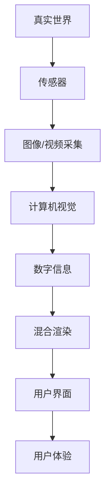

                 

# 增强现实创业：融合虚实的商业新机遇

> 关键词：增强现实, 创业, 融合虚实, 商业机遇, AR技术, 混合现实, 虚拟现实, 商业应用, 零售, 教育, 医疗, 游戏, 直播, 空间互动, 个性化推荐

## 1. 背景介绍

### 1.1 问题由来
随着科技的飞速发展，增强现实(Augmented Reality, AR)技术正在逐步从科研实验室走向大众视野。通过将数字信息融合到真实世界中，AR技术可以提升用户体验，提供沉浸式、交互式的新型服务。然而，尽管AR技术在多个领域展现出巨大的潜力，但其商业化进程仍面临诸多挑战。如何利用AR技术打造可持续发展的商业模型，是当前增强现实创业公司需要解决的核心问题。

### 1.2 问题核心关键点
为了解决上述问题，本文将详细探讨AR技术在多个行业中的融合应用，分析其中的商业机遇和挑战，并提出解决方案。具体来说，本文将从以下角度进行探讨：
- AR技术的核心概念和工作原理。
- AR技术在零售、教育、医疗、游戏、直播等多个行业的应用实例。
- 如何选择合适的商业模型，提升AR技术商业价值。
- 当前AR创业公司面临的技术、市场和资金挑战。
- AR技术的未来发展趋势和潜在机遇。

## 2. 核心概念与联系

### 2.1 核心概念概述

增强现实技术（AR）将数字信息与现实世界融合，使用户能够在物理环境中看到、听到、甚至触碰到虚拟对象。AR技术结合了计算机视觉、机器学习、图形渲染、传感器技术等多种先进技术，为用户提供更加沉浸、交互、智能的体验。

### 2.2 核心概念原理和架构的 Mermaid 流程图



此流程图展示AR技术的基本流程：
- 通过传感器获取真实世界的图像和视频数据。
- 使用计算机视觉技术对数据进行处理，识别并追踪用户和环境中的关键点。
- 根据用户和环境信息，在虚拟空间中生成数字信息。
- 将虚拟信息叠加到真实世界，通过混合渲染显示在用户屏幕上。
- 最终，用户通过交互界面与虚拟信息互动，获取沉浸式体验。

## 3. 核心算法原理 & 具体操作步骤

### 3.1 算法原理概述

AR技术的核心在于将虚拟信息与真实世界进行深度融合。这一过程涉及以下几个核心步骤：

1. **环境感知**：通过传感器采集真实世界的环境数据。
2. **目标识别**：使用计算机视觉技术识别用户和环境中的关键点。
3. **信息生成**：根据识别结果生成虚拟信息。
4. **混合渲染**：将虚拟信息与真实图像进行叠加，生成增强现实图像。
5. **交互反馈**：用户通过界面与虚拟信息互动，获取反馈。

### 3.2 算法步骤详解

以下是AR技术的详细算法步骤：

1. **环境感知**：使用摄像头、惯性传感器、GPS等设备采集真实环境数据。

2. **目标识别**：利用深度学习算法进行目标检测和追踪，例如YOLO、Faster R-CNN、SSD等算法。

3. **信息生成**：根据目标信息生成虚拟信息，如文字、图像、动画等。

4. **混合渲染**：将虚拟信息与真实图像进行叠加，生成增强现实图像。

5. **交互反馈**：用户通过触摸、手势、语音等方式与虚拟信息互动，获取反馈。

### 3.3 算法优缺点

AR技术的优点：
- **沉浸感**：增强现实将虚拟信息融合到真实世界中，提供沉浸式体验。
- **交互性**：用户可以与虚拟信息进行实时互动，提升参与度。
- **智能性**：通过机器学习算法，增强现实系统可以自适应环境和用户行为。

AR技术的缺点：
- **计算量大**：增强现实需要实时处理大量数据，对计算资源要求较高。
- **设备限制**：目前的AR设备主要依赖于智能手机、AR眼镜等设备，普及率不高。
- **感知限制**：目标识别和环境感知算法在弱光、遮挡等环境下可能表现不佳。

### 3.4 算法应用领域

增强现实技术在多个行业领域展现出广泛的应用前景，包括但不限于：

- **零售**：虚拟试衣、商品展示、个性化推荐等。
- **教育**：虚拟教室、互动教学、虚拟实验等。
- **医疗**：手术模拟、远程诊疗、康复训练等。
- **游戏**：AR游戏、虚拟现实游戏等。
- **直播**：增强现实主播、虚拟背景、实时互动等。

## 4. 数学模型和公式 & 详细讲解 & 举例说明

### 4.1 数学模型构建

增强现实技术的数学模型主要包括以下几个方面：

1. **目标检测**：使用YOLO、Faster R-CNN等算法进行目标检测。
2. **目标追踪**：使用卡尔曼滤波、粒子滤波等算法进行目标追踪。
3. **混合渲染**：使用OpenGL、DirectX等图形渲染技术进行混合渲染。

### 4.2 公式推导过程

以下是目标检测算法YOLO的公式推导过程：

$$
y_{pred} = \sigma(\mathbf{W}[\mathbf{F}(\mathbf{X}) + \mathbf{b}])
$$

其中：
- $y_{pred}$ 表示预测结果。
- $\sigma$ 表示Sigmoid函数。
- $\mathbf{W}$ 表示权重矩阵。
- $\mathbf{F}(\mathbf{X})$ 表示特征提取层。
- $\mathbf{b}$ 表示偏置向量。

### 4.3 案例分析与讲解

以零售行业的虚拟试衣为例，AR技术可以通过摄像头捕捉用户身形和服装数据，结合深度学习算法生成虚拟试衣效果。用户只需在虚拟环境中试穿，即可获取多角度的服装展示，提升购物体验。

## 5. 项目实践：代码实例和详细解释说明

### 5.1 开发环境搭建

要使用AR技术进行开发，需要安装以下工具和库：

- **OpenCV**：计算机视觉库，用于图像处理和特征提取。
- **TensorFlow** 或 **PyTorch**：深度学习框架，用于目标检测和图像处理。
- **OpenGL** 或 **DirectX**：图形渲染库，用于混合渲染。
- **Unity3D**：游戏引擎，支持AR开发。

### 5.2 源代码详细实现

以下是使用Python进行AR试衣开发的代码实现：

```python
import cv2
import numpy as np
import tensorflow as tf

# 加载目标检测模型
model = tf.keras.models.load_model('detector.h5')

# 加载摄像头
cap = cv2.VideoCapture(0)

while True:
    ret, frame = cap.read()
    if not ret:
        break
    
    # 预处理图像
    frame = cv2.cvtColor(frame, cv2.COLOR_BGR2RGB)
    frame = cv2.resize(frame, (224, 224))
    frame = np.expand_dims(frame, axis=0)
    frame = frame / 255.0

    # 目标检测
    preds = model.predict(frame)
    boxes = preds[0][:, 0:4]
    scores = preds[0][:, 4]
    labels = preds[0][:, 5]

    # 筛选出感兴趣的目标
    threshold = 0.5
    boxes = boxes[scores > threshold]
    labels = labels[scores > threshold]

    # 显示检测结果
    for box, label in zip(boxes, labels):
        x, y, w, h = box
        cv2.rectangle(frame, (int(x), int(y)), (int(x+w), int(y+h)), (0, 255, 0), 2)
        cv2.putText(frame, label, (int(x), int(y)), cv2.FONT_HERSHEY_SIMPLEX, 1, (0, 255, 0), 2)

    cv2.imshow('AR试衣', frame)
    if cv2.waitKey(1) & 0xFF == ord('q'):
        break

cap.release()
cv2.destroyAllWindows()
```

### 5.3 代码解读与分析

这段代码主要完成了以下步骤：
1. 加载目标检测模型。
2. 使用OpenCV捕捉摄像头图像。
3. 对图像进行预处理，包括转换为RGB格式、调整大小、归一化等。
4. 使用深度学习模型进行目标检测。
5. 筛选出感兴趣的目标，并在图像上绘制矩形框和标签。
6. 显示增强现实效果。

### 5.4 运行结果展示

运行上述代码，即可在摄像头上实时显示增强现实效果，用户可以看到虚拟试衣效果，提升购物体验。

## 6. 实际应用场景

### 6.1 零售

AR技术在零售行业中的应用主要体现在虚拟试衣、虚拟展示、个性化推荐等方面。通过AR技术，用户可以在家中试穿服装，获取更加真实的效果。商家可以通过虚拟展示增强商品吸引力，提高销售转化率。

### 6.2 教育

在教育领域，AR技术可以用于虚拟教室、互动教学、虚拟实验等。例如，学生可以通过AR设备在虚拟实验室中进行化学实验，提高实验安全性，降低成本。

### 6.3 医疗

AR技术在医疗领域的应用包括手术模拟、远程诊疗、康复训练等。医生可以通过AR技术进行手术模拟，提高手术成功率。患者可以通过远程诊疗系统与医生进行互动，提高诊疗效率。

### 6.4 游戏

AR游戏结合了现实世界和虚拟世界，为用户提供了全新的游戏体验。例如，Pokémon GO 和 Pokémon Go! 等游戏，用户可以在现实世界中捕捉虚拟角色，增加了游戏趣味性。

### 6.5 直播

增强现实主播可以在直播中展示虚拟背景、虚拟角色等，增强互动性。例如，Livestream 和 Facebook Live 等直播平台，主播可以通过AR技术与观众互动，提升观看体验。

### 6.6 空间互动

AR技术可以用于虚拟会议、虚拟展览、虚拟旅游等。例如，VR Convention 和 My Museum VR 等平台，用户可以在虚拟环境中进行互动，提升体验感。

## 7. 工具和资源推荐

### 7.1 学习资源推荐

- **《增强现实技术》**：详细介绍了AR技术的核心原理和应用场景。
- **《深度学习与增强现实》**：介绍了深度学习在AR技术中的应用。
- **《Unity AR开发指南》**：提供AR开发工具的详细介绍和开发实例。

### 7.2 开发工具推荐

- **Unity3D**：强大的游戏引擎，支持AR开发。
- **ARKit**：苹果公司提供的AR开发框架。
- **ARCore**：谷歌提供的AR开发框架。

### 7.3 相关论文推荐

- **《增强现实技术综述》**：综述了AR技术的研究进展和应用场景。
- **《AR技术在教育领域的应用》**：探讨了AR技术在教育中的应用案例和挑战。
- **《AR技术在医疗领域的应用》**：探讨了AR技术在医疗中的应用案例和挑战。

## 8. 总结：未来发展趋势与挑战

### 8.1 研究成果总结

增强现实技术已经在多个领域展现出广泛的应用前景，提高了用户体验，提升了业务效率。然而，AR技术在商业化进程中仍面临诸多挑战，如计算资源限制、设备普及率、感知算法限制等。未来，AR技术需要在这些方面取得进一步突破，才能实现商业化落地。

### 8.2 未来发展趋势

增强现实技术在未来将呈现出以下发展趋势：
- **计算性能提升**：随着计算资源和算法的不断优化，AR设备的计算性能将显著提升，用户体验将更加流畅。
- **设备普及率提高**：随着AR设备的普及，应用场景将更加广泛。
- **感知算法改进**：目标识别和环境感知算法将不断改进，提升AR系统的准确性和鲁棒性。

### 8.3 面临的挑战

增强现实技术在商业化进程中仍面临以下挑战：
- **计算资源限制**：AR技术对计算资源要求较高，需要在硬件和算法上进行优化。
- **设备普及率不高**：AR设备的普及率较低，限制了应用场景的拓展。
- **感知算法限制**：目标识别和环境感知算法在弱光、遮挡等环境下表现不佳，需要进一步改进。

### 8.4 研究展望

未来，增强现实技术需要在以下几个方面取得突破：
- **计算性能提升**：提高计算资源和算法的优化，提升AR设备的性能。
- **设备普及率提高**：增加AR设备的普及，拓展应用场景。
- **感知算法改进**：改进目标识别和环境感知算法，提升系统的准确性和鲁棒性。

总之，增强现实技术在多个领域展现出广泛的应用前景，但要在商业化进程中取得成功，需要在计算性能、设备普及率、感知算法等方面取得突破。只有在这些方面不断优化，增强现实技术才能真正实现大规模应用，为商业和社会带来新的机遇。

## 9. 附录：常见问题与解答

**Q1: AR技术在零售行业中的应用有哪些？**

A: AR技术在零售行业中的应用主要包括虚拟试衣、虚拟展示和个性化推荐等。例如，用户可以在家中试穿虚拟服装，获取更加真实的效果。商家可以通过虚拟展示增强商品吸引力，提高销售转化率。

**Q2: 如何选择合适的商业模型，提升AR技术的商业价值？**

A: 选择合适的商业模型需要综合考虑技术、市场和资金等因素。以下是一些常用的商业模型：
- **订阅制**：用户每月订阅AR服务，获取持续收益。
- **按需付费**：用户根据使用次数或时长支付费用。
- **广告分成**：通过展示广告获取收益。

**Q3: 当前AR创业公司面临的主要技术挑战有哪些？**

A: 当前AR创业公司面临的主要技术挑战包括计算性能、设备普及率、感知算法等。以下是一些具体的挑战：
- **计算性能**：AR技术需要实时处理大量数据，对计算资源要求较高。
- **设备普及率**：AR设备的普及率较低，限制了应用场景的拓展。
- **感知算法**：目标识别和环境感知算法在弱光、遮挡等环境下表现不佳，需要进一步改进。

**Q4: AR技术在教育领域的应用案例有哪些？**

A: AR技术在教育领域的应用包括虚拟教室、互动教学和虚拟实验等。例如，学生可以通过AR设备在虚拟实验室中进行化学实验，提高实验安全性，降低成本。

**Q5: AR技术在医疗领域的应用案例有哪些？**

A: AR技术在医疗领域的应用包括手术模拟、远程诊疗和康复训练等。例如，医生可以通过AR技术进行手术模拟，提高手术成功率。患者可以通过远程诊疗系统与医生进行互动，提高诊疗效率。

---

作者：禅与计算机程序设计艺术 / Zen and the Art of Computer Programming

