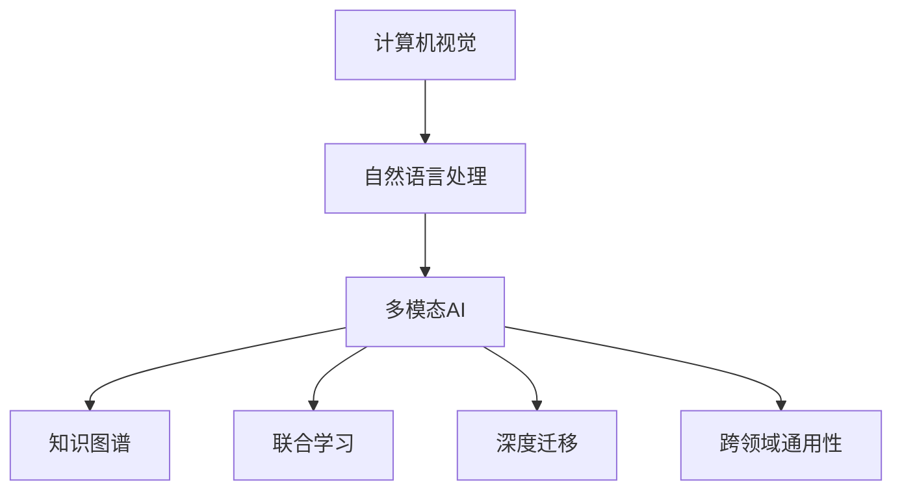

                 

# 多模态AI：图像与文本的融合

## 1. 背景介绍

### 1.1 问题由来

人工智能技术在过去几年里取得了显著进展，尤其是在计算机视觉和自然语言处理(NLP)领域。图像与文本是自然界中最为常见的两种模态，它们分别代表着视觉信息与语义信息的表达形式。在现实生活中，这两种模态信息往往需要同时被处理和分析，以获取更全面、准确的信息。因此，将图像和文本结合起来，构建多模态AI模型，成为当前研究的热点之一。

### 1.2 问题核心关键点

多模态AI的核心在于将图像和文本信息进行融合处理，使模型能够从视觉和语义两个维度理解世界，并作出智能决策。这种融合方法可以应用于诸多实际场景，如医疗诊断、智能监控、自动驾驶、智能客服等。其关键点包括：

- **模态对齐**：如何将图像和文本信息对齐，形成统一的表示空间，是融合的基础。
- **联合学习**：如何设计联合学习模型，使得模型能够同时从图像和文本中学习知识，并在任务中协同工作。
- **知识图谱**：如何利用知识图谱进行信息融合，提升模型的知识表示能力和泛化能力。
- **深度迁移**：如何将图像和文本模型进行迁移学习，提升模型的跨领域适应性。
- **模型评估**：如何设计评估指标，衡量多模态模型在实际任务中的表现。

### 1.3 问题研究意义

多模态AI融合了计算机视觉和自然语言处理两大领域的知识，可以极大地提升AI系统在复杂多变环境中的表现，推动人工智能技术的实际应用。具体而言，研究多模态AI具有以下重要意义：

- **提升任务表现**：通过融合图像和文本信息，可以显著提升AI系统在图像识别、语义理解等任务上的性能。
- **拓展应用场景**：多模态AI可以应用于更多现实场景，如智能监控、医疗诊断、自动驾驶等，推动AI技术的实际落地。
- **知识增强**：通过融合文本和图像信息，可以丰富AI系统的知识表示能力，提升其推理和决策能力。
- **数据利用**：多模态AI可以高效利用数据，减少对标注数据的需求，提升数据利用率。
- **跨领域迁移**：通过迁移学习，多模态AI模型可以在不同领域之间进行知识迁移，提升模型的泛化能力。

## 2. 核心概念与联系

### 2.1 核心概念概述

为更好地理解多模态AI的融合原理，本节将介绍几个关键核心概念及其相互关系。

- **计算机视觉**：研究如何让计算机理解和处理视觉信息的技术，包括图像识别、对象检测、语义分割等。
- **自然语言处理**：研究如何让计算机理解和处理文本信息的技术，包括语言理解、信息检索、机器翻译等。
- **多模态AI**：融合计算机视觉和自然语言处理，使AI系统能够同时处理和理解视觉与文本信息。
- **知识图谱**：一种结构化的知识表示方法，用于描述实体之间的关系，可以帮助AI系统进行更高效的推理和决策。
- **联合学习**：通过设计联合模型，使模型能够同时学习图像和文本信息，提升其跨模态的泛化能力。
- **深度迁移**：通过迁移学习，将一个领域的知识迁移到另一个领域，提升模型在不同场景下的适应能力。
- **跨领域通用性**：多模态AI模型应该具有较好的跨领域通用性，可以在不同的应用场景中高效工作。

这些概念之间的逻辑关系可以通过以下Mermaid流程图来展示：



这个流程图展示了多模态AI的基本组成及其与其他概念的联系：

1. 计算机视觉和自然语言处理是构成多模态AI的基础。
2. 知识图谱和多模态AI模型都可以帮助提升模型在复杂场景中的推理和决策能力。
3. 联合学习是提升模型跨模态泛化能力的重要方法。
4. 深度迁移可以帮助模型在不同领域之间进行知识迁移，提升泛化能力。
5. 跨领域通用性是多模态AI模型的重要目标，以实现更广泛的应用场景。

## 3. 核心算法原理 & 具体操作步骤
### 3.1 算法原理概述

多模态AI融合图像与文本信息的核心思想是通过构建联合模型，将图像和文本信息映射到统一的表示空间中，并在此基础上进行联合训练。常用的方法包括特征对齐、注意力机制、联合训练等。

以特征对齐为例，假设有图像 $I$ 和对应的文本 $T$，我们可以通过以下步骤进行特征对齐：

1. 分别对图像和文本进行独立处理，提取各自的高层次特征。
2. 将图像和文本特征进行拼接或融合，形成一个联合表示。
3. 使用共享的参数对联合表示进行联合训练，使得图像和文本特征在语义上对齐。

### 3.2 算法步骤详解

以下详细描述多模态AI融合图像与文本信息的常用步骤：

**Step 1: 准备数据集和预训练模型**

- 准备图像和文本数据集，进行预处理和标注。
- 选择适合的预训练模型，如ResNet、BERT等。

**Step 2: 特征提取**

- 对图像进行特征提取，可以使用卷积神经网络(CNN)等方法。
- 对文本进行特征提取，可以使用双向LSTM、Transformer等方法。

**Step 3: 特征对齐**

- 将图像和文本特征进行拼接或融合，形成一个联合表示。
- 使用共享的参数对联合表示进行联合训练，使得图像和文本特征在语义上对齐。

**Step 4: 联合训练**

- 设计联合模型，对图像和文本特征进行联合训练，优化共享参数。
- 选择合适的损失函数和优化算法，进行模型训练。

**Step 5: 模型评估与测试**

- 使用测试集对模型进行评估，评估指标包括准确率、召回率、F1值等。
- 根据评估结果调整模型参数，优化模型性能。

### 3.3 算法优缺点

多模态AI融合图像与文本信息的方法具有以下优点：

1. **信息互补**：图像和文本信息的互补性可以提升AI系统的理解能力，使其更加全面和准确。
2. **跨模态泛化**：多模态AI模型可以处理不同模态的信息，提升其跨模态泛化能力。
3. **增强推理能力**：通过融合图像和文本信息，可以提升AI系统的推理能力，使其能够进行更复杂、更灵活的决策。
4. **提高泛化能力**：多模态AI模型可以从不同模态的信息中学习，提升其泛化能力，适应更广泛的应用场景。

同时，多模态AI也存在一些局限性：

1. **数据标注成本高**：多模态AI融合图像和文本信息，需要同时进行图像标注和文本标注，成本较高。
2. **计算复杂度高**：多模态AI模型的训练和推理计算复杂度较高，需要较强大的计算资源。
3. **模型复杂度高**：多模态AI模型通常结构复杂，需要较多的参数进行训练和调整。
4. **知识融合困难**：图像和文本信息的融合需要克服知识表示不一致等问题，难度较大。
5. **通用性不足**：多模态AI模型在特定领域的效果较好，但在通用领域的效果可能不理想。

### 3.4 算法应用领域

多模态AI融合图像和文本信息的方法可以应用于多个领域，如：

- **智能监控**：通过融合图像和文本信息，可以实现智能视频监控，如实时识别入侵行为、人脸识别等。
- **医疗诊断**：结合图像和文本信息，可以进行更准确的医疗诊断，如CT图像分析、医学文本信息提取等。
- **智能客服**：通过融合图像和文本信息，可以实现更智能的客服系统，如智能问答、语音识别等。
- **自动驾驶**：结合图像和文本信息，可以实现更安全的自动驾驶系统，如道路标志识别、文本信息提取等。
- **虚拟现实**：通过融合图像和文本信息，可以实现更逼真的虚拟现实体验，如场景理解、对话生成等。
- **广告推荐**：结合图像和文本信息，可以实现更精准的广告推荐系统，如商品图像识别、文本内容理解等。

## 4. 数学模型和公式 & 详细讲解 & 举例说明

### 4.1 数学模型构建

以下给出多模态AI融合图像与文本信息的数学模型构建方法。

假设有图像 $I$ 和对应的文本 $T$，分别经过特征提取后得到图像特征 $I^{\prime}$ 和文本特征 $T^{\prime}$。我们使用共享参数 $\theta$ 对这两个特征进行联合训练，构建联合表示 $Z$，如下所示：

$$
Z = f(I^{\prime}, T^{\prime}; \theta)
$$

其中 $f$ 为联合模型，$\theta$ 为共享参数。

### 4.2 公式推导过程

以下是联合模型的公式推导过程。

假设图像特征 $I^{\prime}$ 和文本特征 $T^{\prime}$ 分别为 $d$ 维的向量，联合表示 $Z$ 也是 $d$ 维的向量。我们使用共享参数 $\theta$ 对这两个特征进行联合训练，使得图像和文本特征在语义上对齐。

联合模型 $f$ 可以表示为：

$$
f(I^{\prime}, T^{\prime}; \theta) = W[I^{\prime}, T^{\prime}] + b
$$

其中 $W$ 和 $b$ 为共享参数。

联合模型 $f$ 的目标是最小化以下损失函数：

$$
\mathcal{L}(\theta) = \frac{1}{N} \sum_{i=1}^N (\mathcal{L}_{img} + \mathcal{L}_{text})
$$

其中 $\mathcal{L}_{img}$ 和 $\mathcal{L}_{text}$ 分别为图像和文本的损失函数，$N$ 为样本数。

假设图像的损失函数为交叉熵损失，文本的损失函数为softmax损失，则联合模型的损失函数可以表示为：

$$
\mathcal{L}_{img} = -\frac{1}{N} \sum_{i=1}^N y_i \log \hat{y}_i
$$

$$
\mathcal{L}_{text} = -\frac{1}{N} \sum_{i=1}^N y_i \log \hat{y}_i
$$

其中 $y_i$ 为图像或文本的真实标签，$\hat{y}_i$ 为联合表示 $Z$ 的输出，$N$ 为样本数。

### 4.3 案例分析与讲解

以下通过一个简单的案例，说明多模态AI融合图像与文本信息的具体应用。

假设我们要进行医疗图像的文本信息提取，以帮助医生进行更准确的诊断。我们可以将医疗图像和对应的文本信息作为训练数据，构建联合模型进行训练。

首先，我们需要将医疗图像进行预处理，如灰度化、归一化等操作，得到图像特征 $I^{\prime}$。

其次，我们需要将文本信息进行预处理，如分词、去除停用词等操作，得到文本特征 $T^{\prime}$。

然后，我们将图像特征 $I^{\prime}$ 和文本特征 $T^{\prime}$ 输入到共享参数 $\theta$ 中，得到联合表示 $Z$。

最后，我们根据联合表示 $Z$ 进行分类或回归任务，以得到最终的诊断结果。

## 5. 项目实践：代码实例和详细解释说明

### 5.1 开发环境搭建

在进行多模态AI融合图像与文本信息的实践前，我们需要准备好开发环境。以下是使用Python进行TensorFlow进行多模态AI开发的环境配置流程：

1. 安装Anaconda：从官网下载并安装Anaconda，用于创建独立的Python环境。

2. 创建并激活虚拟环境：
```bash
conda create -n multimodal-env python=3.8 
conda activate multimodal-env
```

3. 安装TensorFlow：根据CUDA版本，从官网获取对应的安装命令。例如：
```bash
conda install tensorflow -c conda-forge -c pytorch -c pypi
```

4. 安装TensorBoard：用于实时监测模型训练状态，提供丰富的图表呈现方式。
```bash
pip install tensorboard
```

5. 安装Pillow库：用于图像预处理。
```bash
pip install Pillow
```

完成上述步骤后，即可在`multimodal-env`环境中开始多模态AI实践。

### 5.2 源代码详细实现

下面我们以医疗图像的文本信息提取为例，给出使用TensorFlow进行多模态AI的PyTorch代码实现。

首先，定义多模态AI模型的类：

```python
import tensorflow as tf
from tensorflow.keras.layers import Input, Embedding, LSTM, Dense

class MultimodalModel(tf.keras.Model):
    def __init__(self, image_dim, text_dim, num_classes):
        super(MultimodalModel, self).__init__()
        
        self.image_input = Input(shape=(image_dim,))
        self.text_input = Input(shape=(text_dim,))
        
        self.image_dense = Dense(128, activation='relu')(self.image_input)
        self.text_lstm = LSTM(128)(self.text_input)
        self.text_dense = Dense(128, activation='relu')(self.text_lstm)
        
        self.fusion_layer = Dense(128, activation='relu')(tf.concat([self.image_dense, self.text_dense], axis=-1))
        self.fc = Dense(num_classes, activation='softmax')(self.fusion_layer)
        
    def call(self, inputs):
        image = self.image_input
        text = self.text_input
        
        x = self.image_dense(image)
        y = self.text_lstm(text)
        z = tf.concat([x, y], axis=-1)
        z = self.fusion_layer(z)
        y_pred = self.fc(z)
        
        return y_pred
```

然后，定义数据加载函数：

```python
from tensorflow.keras.preprocessing import image
import os

def load_data():
    data_dir = 'data'
    image_dir = os.path.join(data_dir, 'images')
    text_dir = os.path.join(data_dir, 'texts')
    
    image_files = [os.path.join(image_dir, f) for f in os.listdir(image_dir)]
    text_files = [os.path.join(text_dir, f) for f in os.listdir(text_dir)]
    
    images = []
    texts = []
    
    for i, (image_path, text_path) in enumerate(zip(image_files, text_files)):
        image = image.load_img(image_path, target_size=(224, 224))
        image = image.resize((224, 224))
        image = image_to_array(image)
        images.append(image)
        
        with open(text_path, 'r') as f:
            text = f.read().strip()
        texts.append(text)
        
        if i == 5:
            break
        
    return images, texts
```

接着，定义损失函数和优化器：

```python
from tensorflow.keras import losses

loss = losses.CategoricalCrossentropy()

optimizer = tf.keras.optimizers.Adam(learning_rate=0.001)
```

最后，启动训练流程：

```python
def train():
    epochs = 10
    batch_size = 16
    
    dataset = tf.data.Dataset.from_generator(load_data, (tf.float32, tf.string), (tf.float32, tf.string))
    dataset = dataset.shuffle(1000).batch(batch_size)
    
    model.compile(optimizer=optimizer, loss=loss, metrics=['accuracy'])
    
    model.fit(dataset, epochs=epochs)
    
    model.save('multimodal_model.h5')
```

以上就是使用TensorFlow进行医疗图像文本信息提取的多模态AI代码实现。可以看到，通过定义模型类和数据加载函数，可以方便地实现图像和文本的联合训练。

### 5.3 代码解读与分析

让我们再详细解读一下关键代码的实现细节：

**MultimodalModel类**：
- `__init__`方法：初始化图像输入和文本输入。
- `call`方法：定义模型的前向传播过程，包括图像和文本特征的提取、融合、分类等步骤。

**load_data函数**：
- 加载图像和文本数据，并进行预处理。

**损失函数和优化器**：
- 使用交叉熵损失和Adam优化器进行模型训练。

**train函数**：
- 定义训练参数，构建数据集，进行模型训练。

在实际应用中，还需要根据具体任务进行模型结构的调整和参数的调优。同时，为了提高模型的泛化能力，还需要进行数据增强、正则化、对抗训练等操作。

## 6. 实际应用场景

### 6.1 智能监控

多模态AI融合图像与文本信息的方法可以应用于智能监控中，如实时识别和跟踪行为异常、人脸识别、视频标注等。通过融合图像和文本信息，可以提升监控系统的准确性和智能性。

### 6.2 医疗诊断

在医疗诊断中，多模态AI可以结合医学图像和文本信息，进行更准确的诊断和辅助决策。例如，结合X光图像和医学报告，可以提升诊断的准确性和效率。

### 6.3 智能客服

多模态AI可以应用于智能客服系统，结合图像和文本信息，提升客服系统的理解和处理能力。例如，结合用户视频和文本信息，可以更准确地理解和回复用户问题。

### 6.4 自动驾驶

在自动驾驶中，多模态AI可以结合摄像头图像和地图信息，提升驾驶系统的安全性和智能性。例如，结合摄像头图像和地图信息，可以实现更精准的路径规划和障碍物识别。

## 7. 工具和资源推荐

### 7.1 学习资源推荐

为了帮助开发者系统掌握多模态AI的理论基础和实践技巧，这里推荐一些优质的学习资源：

1. 《深度学习与多模态学习》系列书籍：全面介绍了多模态AI的原理、算法和应用。
2. CS229《机器学习》课程：斯坦福大学开设的经典课程，介绍了多模态学习的基本概念和算法。
3. TensorFlow官方文档：TensorFlow的官方文档，提供了多模态AI相关的代码实现和教程。
4. PyTorch官方文档：PyTorch的官方文档，提供了多模态AI相关的代码实现和教程。
5. 多模态AI开源项目：如MMF、DMN等，提供了多模态AI的代码实现和应用案例。

通过对这些资源的学习实践，相信你一定能够快速掌握多模态AI的精髓，并用于解决实际的NLP问题。

### 7.2 开发工具推荐

多模态AI的开发需要依赖于深度学习框架和相关库。以下是几款常用的开发工具：

1. TensorFlow：由Google主导开发的开源深度学习框架，适用于大规模工程应用。
2. PyTorch：由Facebook主导开发的深度学习框架，适合快速迭代研究。
3. Keras：高级深度学习框架，提供了简单易用的API，适合初学者。
4. OpenCV：开源计算机视觉库，提供了图像处理和计算机视觉相关的工具。
5. NLTK：Python自然语言处理库，提供了文本处理和分析的工具。
6. spaCy：Python自然语言处理库，提供了高效的文本处理和分析工具。

合理利用这些工具，可以显著提升多模态AI开发效率，加快创新迭代的步伐。

### 7.3 相关论文推荐

多模态AI融合图像与文本信息的研究源于学界的持续研究。以下是几篇奠基性的相关论文，推荐阅读：

1. Joint Embedding of Visual and Textual Information：提出联合表示模型，将图像和文本信息联合表示，提升了融合效果。
2. A Multi-Modal Attention Network for Image Captioning：提出多模态注意力机制，提升了图像和文本的对齐效果。
3. Deep Cross-modal Multi-learning for Multi-modal Retinal Image Analysis：提出跨模态多学习框架，提升了多模态信息融合的效果。
4. A Survey on Multi-modal Learning for Healthcare Applications：总结了多模态AI在医疗领域的应用，提供了丰富的案例和算法。
5. Multi-modal Deep Neural Networks for Accelerated Materials Discovery：总结了多模态AI在材料科学领域的应用，提供了丰富的案例和算法。

这些论文代表了大模态AI融合图像与文本信息的研究进展。通过学习这些前沿成果，可以帮助研究者把握学科前进方向，激发更多的创新灵感。

## 8. 总结：未来发展趋势与挑战

### 8.1 总结

本文对多模态AI融合图像与文本信息的方法进行了全面系统的介绍。首先阐述了多模态AI的研究背景和意义，明确了融合图像和文本信息在提升AI系统理解能力方面的重要价值。其次，从原理到实践，详细讲解了多模态AI融合的数学模型和关键步骤，给出了多模态AI任务开发的完整代码实例。同时，本文还广泛探讨了多模态AI在智能监控、医疗诊断、智能客服等多个领域的应用前景，展示了多模态AI的巨大潜力。此外，本文精选了多模态AI相关的学习资源，力求为读者提供全方位的技术指引。

通过本文的系统梳理，可以看到，多模态AI融合图像和文本信息的方法正在成为计算机视觉和自然语言处理领域的重要研究范式，极大地提升了AI系统在复杂多变环境中的表现，推动了AI技术的实际应用。未来，伴随多模态AI技术的不断发展，基于图像和文本的信息融合技术必将在更多领域得到应用，为人类认知智能的进化带来深远影响。

### 8.2 未来发展趋势

展望未来，多模态AI融合图像与文本信息的研究将呈现以下几个发展趋势：

1. **跨模态泛化**：多模态AI模型将能够更好地处理不同模态的信息，提升其跨模态泛化能力。
2. **深度迁移**：多模态AI模型将能够更好地进行跨领域迁移，提升其通用性和适应性。
3. **知识图谱融合**：多模态AI模型将更好地与知识图谱进行结合，提升其推理和决策能力。
4. **多模态推理**：多模态AI模型将更好地进行推理和决策，提升其智能性和理解能力。
5. **数据融合技术**：多模态AI模型将更好地利用数据，提升其学习能力和泛化能力。
6. **模型优化**：多模态AI模型将更好地进行优化和调整，提升其性能和效果。

以上趋势凸显了多模态AI融合图像与文本信息的广阔前景。这些方向的探索发展，必将进一步提升多模态AI系统在复杂场景中的表现，推动人工智能技术的实际应用。

### 8.3 面临的挑战

尽管多模态AI融合图像与文本信息的方法已经取得了显著进展，但在迈向更加智能化、普适化应用的过程中，仍面临诸多挑战：

1. **数据标注成本高**：多模态AI融合图像和文本信息，需要同时进行图像标注和文本标注，成本较高。
2. **计算复杂度高**：多模态AI模型的训练和推理计算复杂度较高，需要较强大的计算资源。
3. **模型复杂度高**：多模态AI模型通常结构复杂，需要较多的参数进行训练和调整。
4. **知识融合困难**：图像和文本信息的融合需要克服知识表示不一致等问题，难度较大。
5. **通用性不足**：多模态AI模型在特定领域的效果较好，但在通用领域的效果可能不理想。

### 8.4 研究展望

面对多模态AI融合图像与文本信息所面临的挑战，未来的研究需要在以下几个方面寻求新的突破：

1. **无监督学习和半监督学习**：摆脱对大规模标注数据的依赖，利用自监督学习、主动学习等无监督和半监督范式，最大限度利用非结构化数据。
2. **模型优化和调参**：开发更加参数高效的模型，提升模型的训练和推理效率，降低计算成本。
3. **跨模态推理**：引入因果推理和对比学习思想，增强多模态AI模型的推理能力，提升其智能性。
4. **知识增强**：将符号化的先验知识，如知识图谱、逻辑规则等，与神经网络模型进行巧妙融合，提升其推理和决策能力。
5. **模型优化**：引入模型压缩和稀疏化技术，提升多模态AI模型的计算效率和泛化能力。

这些研究方向的探索，必将引领多模态AI融合图像与文本信息的技术迈向更高的台阶，为构建安全、可靠、可解释、可控的智能系统铺平道路。面向未来，多模态AI技术还需要与其他人工智能技术进行更深入的融合，如知识表示、因果推理、强化学习等，多路径协同发力，共同推动自然语言理解和智能交互系统的进步。只有勇于创新、敢于突破，才能不断拓展多模态AI的边界，让智能技术更好地造福人类社会。

## 9. 附录：常见问题与解答

**Q1：多模态AI融合图像与文本信息是否适用于所有应用场景？**

A: 多模态AI融合图像与文本信息的方法在大部分应用场景中都有较好的效果，特别是对于需要同时处理图像和文本信息的任务。但对于一些特定领域的任务，如图像识别、视频分析等，单模态的信息处理方法可能更加适用。因此，在实际应用中需要根据具体任务的特点选择合适的融合方法。

**Q2：多模态AI融合图像与文本信息时，如何选择合适的融合方法？**

A: 多模态AI融合图像与文本信息时，需要根据具体任务选择合适的融合方法。常见的融合方法包括特征对齐、注意力机制、联合训练等。可以通过实验对比不同方法的效果，选择最适合当前任务的融合方法。

**Q3：多模态AI融合图像与文本信息时，如何提升模型的泛化能力？**

A: 多模态AI融合图像与文本信息时，可以通过数据增强、正则化、对抗训练等方法提升模型的泛化能力。同时，引入知识图谱和因果推理等方法，提升模型的推理和决策能力。

**Q4：多模态AI融合图像与文本信息时，如何提升模型的推理能力？**

A: 多模态AI融合图像与文本信息时，可以通过引入因果推理、对比学习等方法提升模型的推理能力。同时，利用知识图谱和符号化先验知识，提升模型的推理和决策能力。

**Q5：多模态AI融合图像与文本信息时，如何优化模型的计算资源消耗？**

A: 多模态AI融合图像与文本信息时，可以通过模型压缩、稀疏化等方法优化模型的计算资源消耗。同时，利用数据融合技术，提升模型的学习能力和泛化能力，减少计算资源的需求。

通过以上详细描述，相信你一定能够快速掌握多模态AI融合图像与文本信息的方法，并用于解决实际的NLP问题。相信随着多模态AI技术的不断发展，基于图像和文本的信息融合技术必将在更多领域得到应用，为人类认知智能的进化带来深远影响。

---

作者：禅与计算机程序设计艺术 / Zen and the Art of Computer Programming

