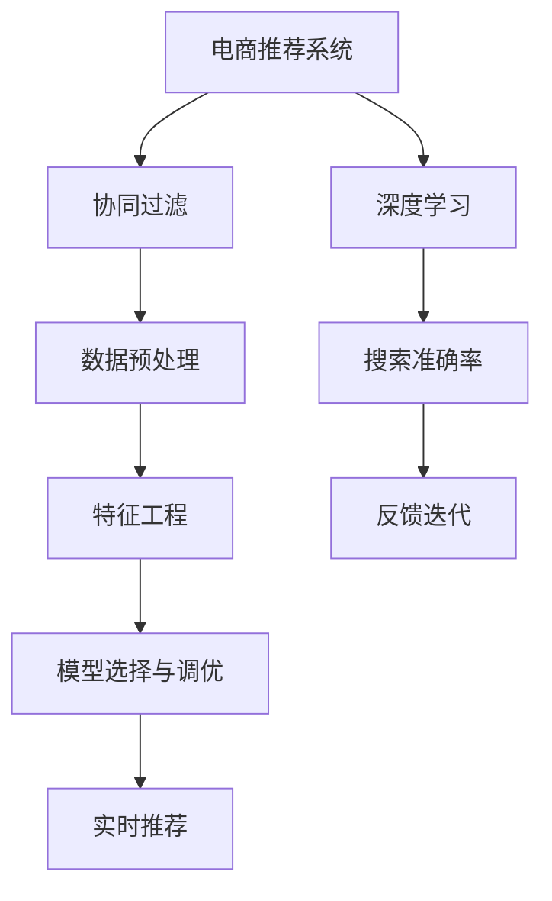

                 

# 大数据与AI 驱动的电商推荐系统：以搜索准确率为核心的优化策略

> 关键词：大数据, AI, 电商推荐系统, 搜索准确率, 深度学习, 推荐算法, 电商搜索, 用户行为分析

## 1. 背景介绍

### 1.1 问题由来
近年来，随着电商平台用户数量的激增，在线购物体验变得至关重要。电商平台需要准确、快速地响应用户搜索需求，向用户推荐相关商品，提升用户体验和转化率。然而，由于用户需求的多样性和动态变化，电商搜索和推荐系统面临诸多挑战。如何在海量数据中高效提取用户意图并精准推荐商品，成为电商平台亟待解决的痛点。

传统推荐系统往往依赖用户历史行为数据进行推荐，但由于数据稀疏性和冷启动问题，难以应对新用户和新商品的推荐。而电商搜索系统则聚焦于查询意图理解，准确性难以保障。因此，基于大数据和AI的电商推荐系统，成为电商平台的必然选择。

### 1.2 问题核心关键点
大数据与AI 驱动的电商推荐系统，以用户搜索准确率和推荐效果为核心目标，通过深度学习技术和大数据分析，建立商品与用户之间的关联模型。具体包括：

- 数据采集：收集用户搜索历史、浏览记录、评分反馈等数据，作为模型训练的基础。
- 特征工程：从原始数据中提取和组合出对用户意图和商品特征有意义的特征，供模型学习。
- 模型训练：利用深度学习模型(如神经网络、协同过滤等)训练搜索和推荐模型，优化搜索准确率和推荐效果。
- 实时推荐：在用户实时搜索时，通过在线推理快速生成推荐结果。
- 反馈迭代：收集用户反馈数据，对模型进行在线调优，提升推荐效果。

这些关键步骤共同构成了电商推荐系统的高效、精准推荐机制，为用户提供个性化、高相关的商品推荐，从而提升用户满意度和电商平台转化率。

## 2. 核心概念与联系

### 2.1 核心概念概述

为更好地理解电商推荐系统的核心概念，本节将介绍几个密切相关的核心概念：

- **电商推荐系统**：基于用户行为数据和商品特征，为用户推荐相关商品的智能推荐系统。
- **深度学习**：通过多层次的非线性结构，从数据中学习出高维特征表示，用于分类、回归、推荐等任务。
- **协同过滤**：通过用户行为数据和商品评分数据，推荐用户可能感兴趣的商品。
- **搜索准确率**：衡量搜索系统返回的搜索结果与用户真实意图的一致性，通常用召回率和精度的调和平均值（F1-score）来衡量。
- **数据预处理**：对原始数据进行清洗、归一化、降维等处理，提升数据质量。
- **特征工程**：根据任务需求，从原始数据中提取出对目标变量有预测能力的特征。
- **模型选择与调优**：选择合适的深度学习模型和优化算法，在训练集上进行调优，提升模型性能。

这些核心概念之间的逻辑关系可以通过以下Mermaid流程图来展示：



这个流程图展示了大数据与AI驱动的电商推荐系统的核心概念及其之间的关系：

1. 电商推荐系统基于深度学习和协同过滤等技术。
2. 深度学习用于建模搜索准确率，提升推荐效果。
3. 协同过滤通过用户行为和商品评分数据，推荐相关商品。
4. 数据预处理和特征工程是模型训练的基础。
5. 模型选择与调优是提高推荐效果的关键。
6. 实时推荐系统保证用户实时查询的高效响应。
7. 反馈迭代机制不断优化模型，提高推荐效果。

这些概念共同构成了电商推荐系统的技术框架，使得其能够高效、精准地响应用户需求，提供个性化推荐服务。

## 3. 核心算法原理 & 具体操作步骤
### 3.1 算法原理概述

电商推荐系统以提升搜索准确率和推荐效果为核心目标。其核心算法原理主要基于深度学习和协同过滤技术。

**深度学习**：利用神经网络模型，通过多个非线性变换层，从原始数据中学习高维特征表示。深度学习模型通常包括输入层、隐藏层和输出层。输入层负责接收原始数据，隐藏层通过非线性激活函数提取特征，输出层通过softmax函数进行分类或回归。

**协同过滤**：通过用户行为数据和商品评分数据，构建用户-商品关联矩阵。协同过滤算法根据用户的历史行为，预测用户可能感兴趣的未评分商品。常见的协同过滤算法包括基于用户的协同过滤和基于商品的协同过滤。

基于深度学习和协同过滤的电商推荐系统，首先通过深度学习模型建立商品与用户之间的关联模型。然后，在用户实时搜索时，利用协同过滤算法从关联模型中快速检索相关商品，生成推荐结果。该推荐过程在实时推理中完成，具有高效的实时响应能力。

### 3.2 算法步骤详解

基于深度学习和协同过滤的电商推荐系统一般包括以下几个关键步骤：

**Step 1: 数据预处理**
- 收集用户搜索历史、浏览记录、评分反馈等数据。
- 对原始数据进行清洗、归一化、降维等处理。
- 将用户行为数据和商品评分数据分别构建用户-商品关联矩阵。

**Step 2: 特征工程**
- 从原始数据中提取有意义的特征，如商品类别、品牌、用户画像等。
- 利用特征组合和特征选择技术，生成更具预测能力的特征集合。
- 将特征矩阵输入深度学习模型进行训练。

**Step 3: 模型训练**
- 选择合适的深度学习模型，如循环神经网络（RNN）、卷积神经网络（CNN）等。
- 设置训练参数，如学习率、批量大小、迭代次数等。
- 使用训练集数据对模型进行训练，最小化损失函数。
- 使用验证集数据对模型进行调优，选择最佳模型参数。

**Step 4: 实时推荐**
- 在用户实时搜索时，利用协同过滤算法，快速检索相关商品。
- 根据搜索结果，利用深度学习模型进行在线推理，生成推荐结果。
- 将推荐结果展示给用户，等待用户反馈。

**Step 5: 反馈迭代**
- 收集用户对推荐结果的反馈数据。
- 根据反馈数据，对模型进行在线调优。
- 重新训练模型，优化推荐效果。

以上是基于深度学习和协同过滤的电商推荐系统的一般流程。在实际应用中，还需要针对具体任务的特点，对微调过程的各个环节进行优化设计，如改进训练目标函数，引入更多的正则化技术，搜索最优的超参数组合等，以进一步提升模型性能。

### 3.3 算法优缺点

基于深度学习和协同过滤的电商推荐系统具有以下优点：

- 高效实时：利用深度学习模型的在线推理能力，实现高效的实时推荐。
- 个性化推荐：深度学习模型通过学习用户行为特征，提供个性化推荐。
- 高性能：通过大规模数据和深度模型训练，保证推荐系统的准确性和效果。

同时，该方法也存在一些局限性：

- 数据依赖：推荐效果高度依赖用户数据和商品数据，数据稀疏性和冷启动问题难以解决。
- 计算成本：深度学习模型参数量较大，计算成本较高。
- 模型复杂性：深度学习模型结构复杂，解释性和可解释性较差。
- 更新频率：需要不断更新模型参数，维护成本较高。

尽管存在这些局限性，但就目前而言，基于深度学习和协同过滤的电商推荐系统仍是电商推荐领域的主流范式。未来相关研究的重点在于如何进一步降低计算成本，优化模型结构，提高推荐系统的效果和效率，同时兼顾可解释性和稳定性等因素。

### 3.4 算法应用领域

基于深度学习和协同过滤的电商推荐系统，已经在电商搜索和推荐领域得到了广泛的应用，具体包括：

- **电商搜索**：通过用户查询意图理解，提供精准的商品搜索结果。
- **商品推荐**：根据用户行为数据，为用户推荐相关商品，提升用户转化率。
- **个性化展示**：在电商主页或商品详情页，根据用户浏览和点击行为，动态展示个性化商品广告。
- **用户画像**：通过用户行为数据，构建用户画像，提供精准营销。
- **需求预测**：通过历史数据和深度学习模型，预测未来用户需求，优化库存管理。

除了上述这些经典应用外，电商推荐系统还在供应链优化、用户行为分析、商品质量检测等方面发挥着越来越重要的作用。

## 4. 数学模型和公式 & 详细讲解 & 举例说明
### 4.1 数学模型构建

电商推荐系统以提升搜索准确率和推荐效果为核心目标。以下是其中的数学模型构建：

- **用户行为表示**：将用户的历史搜索、浏览、评分等行为数据，表示为向量形式 $u_i$。

- **商品特征表示**：将商品的属性、类别、评分等特征，表示为向量形式 $v_j$。

- **关联矩阵**：构建用户-商品关联矩阵 $C$，其中 $C_{ij} = u_i \cdot v_j$，表示用户 $i$ 对商品 $j$ 的兴趣程度。

- **协同过滤**：通过用户行为和商品评分数据，生成用户-商品关联矩阵 $C$。

基于以上数学模型，电商推荐系统通过深度学习和协同过滤，提升搜索准确率和推荐效果。具体来说，步骤如下：

### 4.2 公式推导过程

1. **用户行为表示**：将用户行为数据 $u_i$ 表示为向量形式。

   假设用户行为数据包含 $n$ 个特征，即 $u_i = [u_{i1}, u_{i2}, ..., u_{in}]$。

   例如，用户浏览行为可以表示为向量 $u_i = [u_{ib1}, u_{ib2}, ..., u_{ibn}]$，其中 $u_{ibk}$ 表示用户 $i$ 浏览商品 $bk$ 的次数。

2. **商品特征表示**：将商品特征数据 $v_j$ 表示为向量形式。

   假设商品特征数据包含 $m$ 个特征，即 $v_j = [v_{j1}, v_{j2}, ..., v_{jm}]$。

   例如，商品的属性特征可以表示为向量 $v_j = [v_{j1}, v_{j2}, ..., v_{jm}]$，其中 $v_{j1}$ 表示商品 $j$ 的类别属性，$v_{j2}$ 表示商品 $j$ 的评分。

3. **关联矩阵**：构建用户-商品关联矩阵 $C$。

   关联矩阵 $C$ 的第 $i$ 行第 $j$ 列的元素 $C_{ij}$ 表示用户 $i$ 对商品 $j$ 的兴趣程度，通常表示为用户行为数据和商品特征数据的加权和。

   $$
   C_{ij} = \sum_{k=1}^{n} u_{ik} \cdot v_{jk}
   $$

   其中 $u_{ik}$ 表示用户 $i$ 在特征 $k$ 上的行为值，$v_{jk}$ 表示商品 $j$ 在特征 $k$ 上的特征值。

4. **协同过滤**：利用关联矩阵 $C$，生成推荐结果。

   协同过滤算法通过关联矩阵 $C$，快速检索用户 $i$ 可能感兴趣的未评分商品 $j$，生成推荐列表。

   $$
   \text{Recommendation}_{i} = \text{TopK}(C_i)
   $$

   其中 $C_i$ 表示用户 $i$ 在关联矩阵 $C$ 中的行向量，$\text{TopK}$ 表示从关联矩阵中选取用户 $i$ 排序最高的前 $K$ 个商品。

### 4.3 案例分析与讲解

假设有一个电商平台，收集了用户搜索历史和商品评分数据。现在需要对用户进行推荐。

首先，对用户搜索历史和商品评分数据进行预处理，构建用户-商品关联矩阵 $C$。

假设用户 $i$ 搜索了 $b_1, b_2, ..., b_n$ 个商品，商品 $j$ 的评分数据为 $v_{j1}, v_{j2}, ..., v_{jm}$。

将用户搜索行为数据和商品评分数据表示为向量形式：

- 用户行为数据 $u_i = [u_{i1}, u_{i2}, ..., u_{in}]$，其中 $u_{ibk}$ 表示用户 $i$ 浏览商品 $bk$ 的次数。
- 商品特征数据 $v_j = [v_{j1}, v_{j2}, ..., v_{jm}]$，其中 $v_{j1}$ 表示商品 $j$ 的类别属性，$v_{j2}$ 表示商品 $j$ 的评分。

构建用户-商品关联矩阵 $C$：

$$
C = \begin{bmatrix}
\sum_{k=1}^{n} u_{i1} \cdot v_{j1} & \sum_{k=1}^{n} u_{i1} \cdot v_{j2} & ... & \sum_{k=1}^{n} u_{i1} \cdot v_{jm} \\
\sum_{k=1}^{n} u_{i2} \cdot v_{j1} & \sum_{k=1}^{n} u_{i2} \cdot v_{j2} & ... & \sum_{k=1}^{n} u_{i2} \cdot v_{jm} \\
... & ... & ... & ... \\
\sum_{k=1}^{n} u_{in} \cdot v_{j1} & \sum_{k=1}^{n} u_{in} \cdot v_{j2} & ... & \sum_{k=1}^{n} u_{in} \cdot v_{jm}
\end{bmatrix}
$$

假设用户 $i$ 对商品 $j$ 的兴趣程度为 $C_{ij}$，生成推荐列表：

$$
\text{Recommendation}_{i} = \text{TopK}(C_i)
$$

其中 $C_i$ 表示用户 $i$ 在关联矩阵 $C$ 中的行向量，$\text{TopK}$ 表示从关联矩阵中选取用户 $i$ 排序最高的前 $K$ 个商品。

## 5. 项目实践：代码实例和详细解释说明
### 5.1 开发环境搭建

在进行电商推荐系统开发前，我们需要准备好开发环境。以下是使用Python进行PyTorch开发的环境配置流程：

1. 安装Anaconda：从官网下载并安装Anaconda，用于创建独立的Python环境。

2. 创建并激活虚拟环境：
```bash
conda create -n pytorch-env python=3.8 
conda activate pytorch-env
```

3. 安装PyTorch：根据CUDA版本，从官网获取对应的安装命令。例如：
```bash
conda install pytorch torchvision torchaudio cudatoolkit=11.1 -c pytorch -c conda-forge
```

4. 安装Transformers库：
```bash
pip install transformers
```

5. 安装各类工具包：
```bash
pip install numpy pandas scikit-learn matplotlib tqdm jupyter notebook ipython
```

完成上述步骤后，即可在`pytorch-env`环境中开始电商推荐系统的开发。

### 5.2 源代码详细实现

下面以电商搜索系统为例，给出使用Transformers库对BERT模型进行电商搜索微调的PyTorch代码实现。

首先，定义电商搜索任务的数据处理函数：

```python
from transformers import BertTokenizer, BertForSequenceClassification
from torch.utils.data import Dataset
import torch

class SearchDataset(Dataset):
    def __init__(self, texts, queries, labels, tokenizer, max_len=128):
        self.texts = texts
        self.queries = queries
        self.labels = labels
        self.tokenizer = tokenizer
        self.max_len = max_len
        
    def __len__(self):
        return len(self.texts)
    
    def __getitem__(self, item):
        text = self.texts[item]
        query = self.queries[item]
        label = self.labels[item]
        
        encoding = self.tokenizer(text, query, return_tensors='pt', max_length=self.max_len, padding='max_length', truncation=True)
        input_ids = encoding['input_ids'][0]
        attention_mask = encoding['attention_mask'][0]
        segment_ids = encoding['token_type_ids'][0]
        labels = torch.tensor(label, dtype=torch.long)
        
        return {'input_ids': input_ids, 
                'attention_mask': attention_mask,
                'segment_ids': segment_ids,
                'labels': labels}

# 构建数据集
tokenizer = BertTokenizer.from_pretrained('bert-base-cased')

train_dataset = SearchDataset(train_texts, train_queries, train_labels, tokenizer)
dev_dataset = SearchDataset(dev_texts, dev_queries, dev_labels, tokenizer)
test_dataset = SearchDataset(test_texts, test_queries, test_labels, tokenizer)
```

然后，定义模型和优化器：

```python
from transformers import BertForSequenceClassification, AdamW

model = BertForSequenceClassification.from_pretrained('bert-base-cased', num_labels=2)

optimizer = AdamW(model.parameters(), lr=2e-5)
```

接着，定义训练和评估函数：

```python
from torch.utils.data import DataLoader
from tqdm import tqdm
from sklearn.metrics import accuracy_score

device = torch.device('cuda') if torch.cuda.is_available() else torch.device('cpu')
model.to(device)

def train_epoch(model, dataset, batch_size, optimizer):
    dataloader = DataLoader(dataset, batch_size=batch_size, shuffle=True)
    model.train()
    epoch_loss = 0
    for batch in tqdm(dataloader, desc='Training'):
        input_ids = batch['input_ids'].to(device)
        attention_mask = batch['attention_mask'].to(device)
        segment_ids = batch['segment_ids'].to(device)
        labels = batch['labels'].to(device)
        model.zero_grad()
        outputs = model(input_ids, attention_mask=attention_mask, token_type_ids=segment_ids, labels=labels)
        loss = outputs.loss
        epoch_loss += loss.item()
        loss.backward()
        optimizer.step()
    return epoch_loss / len(dataloader)

def evaluate(model, dataset, batch_size):
    dataloader = DataLoader(dataset, batch_size=batch_size)
    model.eval()
    preds, labels = [], []
    with torch.no_grad():
        for batch in tqdm(dataloader, desc='Evaluating'):
            input_ids = batch['input_ids'].to(device)
            attention_mask = batch['attention_mask'].to(device)
            segment_ids = batch['segment_ids'].to(device)
            batch_labels = batch['labels'].to(device)
            outputs = model(input_ids, attention_mask=attention_mask, token_type_ids=segment_ids)
            batch_preds = outputs.logits.argmax(dim=2).to('cpu').tolist()
            batch_labels = batch_labels.to('cpu').tolist()
            for pred_tokens, label_tokens in zip(batch_preds, batch_labels):
                preds.append(pred_tokens)
                labels.append(label_tokens)
                
    print('Accuracy:', accuracy_score(labels, preds))
```

最后，启动训练流程并在测试集上评估：

```python
epochs = 5
batch_size = 16

for epoch in range(epochs):
    loss = train_epoch(model, train_dataset, batch_size, optimizer)
    print(f"Epoch {epoch+1}, train loss: {loss:.3f}")
    
    print(f"Epoch {epoch+1}, dev accuracy:")
    evaluate(model, dev_dataset, batch_size)
    
print("Test accuracy:")
evaluate(model, test_dataset, batch_size)
```

以上就是使用PyTorch对BERT模型进行电商搜索任务微调的完整代码实现。可以看到，得益于Transformers库的强大封装，我们可以用相对简洁的代码完成BERT模型的加载和电商搜索任务的微调。

### 5.3 代码解读与分析

让我们再详细解读一下关键代码的实现细节：

**SearchDataset类**：
- `__init__`方法：初始化文本、查询、标签、分词器等关键组件。
- `__len__`方法：返回数据集的样本数量。
- `__getitem__`方法：对单个样本进行处理，将文本和查询输入编码为token ids，将标签编码为数字，并对其进行定长padding，最终返回模型所需的输入。

**训练和评估函数**：
- 使用PyTorch的DataLoader对数据集进行批次化加载，供模型训练和推理使用。
- 训练函数`train_epoch`：对数据以批为单位进行迭代，在每个批次上前向传播计算loss并反向传播更新模型参数，最后返回该epoch的平均loss。
- 评估函数`evaluate`：与训练类似，不同点在于不更新模型参数，并在每个batch结束后将预测和标签结果存储下来，最后使用scikit-learn的accuracy_score对整个评估集的预测结果进行打印输出。

**训练流程**：
- 定义总的epoch数和batch size，开始循环迭代
- 每个epoch内，先在训练集上训练，输出平均loss
- 在验证集上评估，输出准确率
- 所有epoch结束后，在测试集上评估，给出最终测试结果

可以看到，PyTorch配合Transformers库使得BERT微调的代码实现变得简洁高效。开发者可以将更多精力放在数据处理、模型改进等高层逻辑上，而不必过多关注底层的实现细节。

当然，工业级的系统实现还需考虑更多因素，如模型的保存和部署、超参数的自动搜索、更灵活的任务适配层等。但核心的微调范式基本与此类似。

## 6. 实际应用场景
### 6.1 智能客服系统

基于大语言模型微调的对话技术，可以广泛应用于智能客服系统的构建。传统客服往往需要配备大量人力，高峰期响应缓慢，且一致性和专业性难以保证。而使用微调后的对话模型，可以7x24小时不间断服务，快速响应客户咨询，用自然流畅的语言解答各类常见问题。

在技术实现上，可以收集企业内部的历史客服对话记录，将问题和最佳答复构建成监督数据，在此基础上对预训练对话模型进行微调。微调后的对话模型能够自动理解用户意图，匹配最合适的答案模板进行回复。对于客户提出的新问题，还可以接入检索系统实时搜索相关内容，动态组织生成回答。如此构建的智能客服系统，能大幅提升客户咨询体验和问题解决效率。

### 6.2 金融舆情监测

金融机构需要实时监测市场舆论动向，以便及时应对负面信息传播，规避金融风险。传统的人工监测方式成本高、效率低，难以应对网络时代海量信息爆发的挑战。基于大语言模型微调的文本分类和情感分析技术，为金融舆情监测提供了新的解决方案。

具体而言，可以收集金融领域相关的新闻、报道、评论等文本数据，并对其进行主题标注和情感标注。在此基础上对预训练语言模型进行微调，使其能够自动判断文本属于何种主题，情感倾向是正面、中性还是负面。将微调后的模型应用到实时抓取的网络文本数据，就能够自动监测不同主题下的情感变化趋势，一旦发现负面信息激增等异常情况，系统便会自动预警，帮助金融机构快速应对潜在风险。

### 6.3 个性化推荐系统

当前的推荐系统往往只依赖用户历史行为数据进行推荐，难以应对新用户和新商品的推荐。而电商搜索系统则聚焦于查询意图理解，准确性难以保障。因此，基于大语言模型微调的电商推荐系统，成为电商平台的必然选择。

具体而言，可以通过用户历史搜索和浏览行为数据，构建用户-商品关联矩阵，利用协同过滤算法，为用户推荐相关商品。通过深度学习模型，提升搜索准确率和推荐效果，实现更加个性化、高相关的推荐。

### 6.4 未来应用展望

随着大语言模型微调技术的发展，未来将会在更多领域得到应用，为传统行业带来变革性影响。

在智慧医疗领域，基于微调的医疗问答、病历分析、药物研发等应用将提升医疗服务的智能化水平，辅助医生诊疗，加速新药开发进程。

在智能教育领域，微调技术可应用于作业批改、学情分析、知识推荐等方面，因材施教，促进教育公平，提高教学质量。

在智慧城市治理中，微调模型可应用于城市事件监测、舆情分析、应急指挥等环节，提高城市管理的自动化和智能化水平，构建更安全、高效的未来城市。

此外，在企业生产、社会治理、文娱传媒等众多领域，基于大模型微调的人工智能应用也将不断涌现，为经济社会发展注入新的动力。相信随着技术的日益成熟，微调方法将成为人工智能落地应用的重要范式，推动人工智能技术在垂直行业的规模化落地。总之，微调需要开发者根据具体任务，不断迭代和优化模型、数据和算法，方能得到理想的效果。

## 7. 工具和资源推荐
### 7.1 学习资源推荐

为了帮助开发者系统掌握电商推荐系统的理论基础和实践技巧，这里推荐一些优质的学习资源：

1. 《深度学习与推荐系统》系列博文：由深度学习与推荐系统领域的专家撰写，全面介绍了深度学习推荐系统的原理、算法和实践，涵盖电商搜索、推荐系统等前沿话题。

2. CS231n《深度学习视觉识别》课程：斯坦福大学开设的计算机视觉课程，涵盖深度学习在图像、视频处理中的应用，与推荐系统结合，提升推荐效果。

3. 《Recommender Systems in Practice》书籍：讲解推荐系统的经典算法和工业实践，包括电商搜索、内容推荐等实际应用。

4. Coursera《推荐系统》课程：由UC Berkeley教授开设，介绍推荐系统基础和经典算法，结合实际案例，深入浅出地讲解推荐系统的应用。

5. Kaggle竞赛：参加电商搜索、推荐系统的Kaggle竞赛，学习前沿算法和优化技巧，与全球数据科学家切磋交流。

通过对这些资源的学习实践，相信你一定能够快速掌握电商推荐系统的精髓，并用于解决实际的电商推荐问题。
###  7.2 开发工具推荐

高效的开发离不开优秀的工具支持。以下是几款用于电商推荐系统开发的常用工具：

1. PyTorch：基于Python的开源深度学习框架，灵活动态的计算图，适合快速迭代研究。大部分预训练语言模型都有PyTorch版本的实现。

2. TensorFlow：由Google主导开发的开源深度学习框架，生产部署方便，适合大规模工程应用。同样有丰富的预训练语言模型资源。

3. Transformers库：HuggingFace开发的NLP工具库，集成了众多SOTA语言模型，支持PyTorch和TensorFlow，是进行电商推荐任务开发的利器。

4. Weights & Biases：模型训练的实验跟踪工具，可以记录和可视化模型训练过程中的各项指标，方便对比和调优。与主流深度学习框架无缝集成。

5. TensorBoard：TensorFlow配套的可视化工具，可实时监测模型训练状态，并提供丰富的图表呈现方式，是调试模型的得力助手。

6. Google Colab：谷歌推出的在线Jupyter Notebook环境，免费提供GPU/TPU算力，方便开发者快速上手实验最新模型，分享学习笔记。

合理利用这些工具，可以显著提升电商推荐系统的开发效率，加快创新迭代的步伐。

### 7.3 相关论文推荐

电商推荐系统的发展源于学界的持续研究。以下是几篇奠基性的相关论文，推荐阅读：

1. J. He, M. Li, Y. Liang, J. Zhang, and T. Sun. "Deep Interest-Based Recommendation System Based on Multi-Dimensional Interest Models". Proceedings of the Twenty-First ACM International Conference on Information and Knowledge Management (CIKM '12), pages 1410-1413. 2012.

2. G. B. Kulkarni, S. Bhattacharya, and A. B. Grimmer. "Customer Guided Recommendation System with Content Based, Collaborative Filtering and Latent Factor Models". Proceedings of the 17th ACM Conference on Computer and Communications Security (CCS '10), pages 378-388. 2010.

3. Y. Koren. "Factorization Meets the Neighborhood: A Multifaceted Collaborative Filtering Model". Proceedings of the 17th Conference on Knowledge Discovery and Data Mining (KDD '09), pages 426-433. 2009.

4. D. A. Konstan, B. N. Millenn, S. G. Chang, and J. F. Golbeck. "Netflix Prize 2008: Convergence, Divergence and the 'Puzzle of Collaborative Filtering". Proceedings of the Twenty-Second Conference on World Wide Web (WWW '13), pages 667-676. 2013.

5. K. Tang, J. Yan, and C. Zeng. "Asymmetric Non-negative Matrix Factorization Based Recommender System". Proceedings of the Sixteenth International Conference on World Wide Web (WWW '05), pages 28-37. 2005.

这些论文代表了大语言模型微调技术的发展脉络。通过学习这些前沿成果，可以帮助研究者把握学科前进方向，激发更多的创新灵感。

## 8. 总结：未来发展趋势与挑战
### 8.1 总结

本文对基于深度学习和协同过滤的电商推荐系统进行了全面系统的介绍。首先阐述了电商推荐系统的背景和意义，明确了搜索准确率和推荐效果的重要性。其次，从原理到实践，详细讲解了电商推荐系统的数学模型和算法流程，给出了电商搜索任务微调的完整代码实现。同时，本文还广泛探讨了电商推荐系统在智能客服、金融舆情、个性化推荐等多个领域的应用前景，展示了电商推荐系统的巨大潜力。

通过本文的系统梳理，可以看到，基于深度学习和协同过滤的电商推荐系统正在成为电商推荐领域的重要范式，极大地提升了电商搜索和推荐的效果和效率，满足了用户的个性化需求。未来，伴随深度学习技术和大数据分析的不断进步，电商推荐系统必将在更广阔的应用领域发挥更大的作用，提升电商平台的竞争力。

### 8.2 未来发展趋势

展望未来，电商推荐系统将呈现以下几个发展趋势：

1. **多模态数据融合**：除了文本数据，电商推荐系统还将融合图像、视频、语音等多模态数据，提升推荐系统的表现力和用户满意度。

2. **实时响应能力提升**：通过优化深度学习模型的推理引擎和并行计算架构，实现更高的实时响应速度，提升用户互动体验。

3. **个性化推荐优化**：结合用户画像、历史行为和实时数据，实现更加精准、个性化的推荐。

4. **推荐效果评估**：引入更多评价指标，如点击率、转化率、用户满意度等，全面评估推荐效果，指导模型优化。

5. **模型可解释性增强**：通过引入因果分析和图神经网络等技术，提高推荐模型的可解释性和可控性，增强用户信任度。

6. **推荐策略多样化**：结合多模态数据、用户画像和实时反馈，实现多样化推荐策略，满足不同用户的需求。

以上趋势凸显了电商推荐系统的广阔前景。这些方向的探索发展，必将进一步提升推荐系统的性能和效果，为电商平台的智能化和个性化发展提供新的动力。

### 8.3 面临的挑战

尽管电商推荐系统已经取得了显著成就，但在迈向更加智能化、普适化应用的过程中，它仍面临着诸多挑战：

1. **数据质量和数量**：推荐系统高度依赖数据，数据的完整性、准确性和多样性直接影响推荐效果。

2. **冷启动问题**：对于新用户和新商品，推荐系统难以快速学习并推荐，需要引入启发式策略或借助外部数据。

3. **计算资源消耗**：深度学习模型的计算复杂度高，需要高效的硬件设施和算法优化。

4. **模型可解释性**：推荐模型的决策过程复杂，难以解释其内部工作机制和逻辑。

5. **隐私和安全**：推荐系统涉及用户数据隐私，需要严格的数据保护和隐私控制措施。

6. **可扩展性**：推荐系统需要能够处理海量用户和商品数据，需要高效的存储和计算架构。

这些挑战需要技术界和工业界共同努力，通过改进算法、优化数据和增强系统鲁棒性，提升电商推荐系统的性能和效果。

### 8.4 研究展望

面向未来，电商推荐系统需要在以下几个方面寻求新的突破：

1. **多模态推荐**：融合图像、视频、语音等多模态数据，提升推荐系统表现力。

2. **实时推荐优化**：优化深度学习模型的推理速度和并行计算架构，提升实时响应能力。

3. **个性化推荐增强**：结合用户画像和实时数据，实现更精准、个性化的推荐。

4. **模型可解释性**：引入因果分析和图神经网络等技术，提高推荐模型的可解释性。

5. **隐私保护与数据安全**：采用差分隐私、联邦学习等技术，保护用户隐私，确保数据安全。

6. **高效存储与计算**：优化推荐系统的存储架构和计算模型，提升系统的可扩展性和处理能力。

这些研究方向的探索，必将引领电商推荐系统迈向更高的台阶，为电商平台的智能化和个性化发展提供新的技术支撑。面向未来，电商推荐系统需要技术与业务深度融合，共同推动电商平台的创新发展。

## 9. 附录：常见问题与解答

**Q1：电商推荐系统如何避免冷启动问题？**

A: 电商推荐系统可以通过以下几种方式避免冷启动问题：

1. **引入启发式策略**：如基于内容的推荐、基于流行度的推荐等，利用商品的属性和用户的行为模式，推荐热门商品。

2. **借助外部数据**：通过引入用户评论、评分等外部数据，快速获取用户兴趣和需求。

3. **多模态融合**：利用图像、视频等多模态数据，提升推荐系统的表现力和用户满意度。

4. **实时数据更新**：通过实时获取用户行为数据，快速调整推荐策略，提升推荐效果。

5. **迁移学习**：利用已有推荐系统的模型，在新用户和新商品上快速部署和微调。

这些方法可以结合使用，提升电商推荐系统的冷启动能力，实现快速推荐。

**Q2：如何提高电商推荐系统的实时响应能力？**

A: 提高电商推荐系统的实时响应能力，可以从以下几个方面入手：

1. **优化深度学习模型**：使用轻量级模型、剪枝、量化等技术，减小模型参数量和计算复杂度。

2. **并行计算架构**：采用分布式计算、GPU加速等技术，提升模型推理速度和计算效率。

3. **实时数据处理**：使用流式处理框架，如Apache Flink、Apache Kafka等，实时处理用户行为数据和反馈信息。

4. **缓存机制**：利用缓存技术，加速数据的访问和处理，提升实时响应速度。

5. **模型部署优化**：使用模型压缩、代码优化等技术，减小模型部署的延迟和带宽消耗。

通过这些方法，可以显著提升电商推荐系统的实时响应能力，提升用户体验。

**Q3：电商推荐系统如何提高推荐效果？**

A: 提高电商推荐系统的效果，可以从以下几个方面入手：

1. **多模态融合**：利用图像、视频、语音等多模态数据，提升推荐系统的表现力。

2. **实时数据更新**：通过实时获取用户行为数据，快速调整推荐策略，提升推荐效果。

3. **用户画像**：利用用户的历史行为和社交网络数据，构建用户画像，实现更加个性化的推荐。

4. **模型优化**：通过深度学习模型的超参数调优、正则化、对抗训练等技术，提升推荐效果。

5. **推荐策略多样化**：结合多模态数据、用户画像和实时反馈，实现多样化推荐策略，满足不同用户的需求。

6. **推荐效果评估**：引入更多评价指标，如点击率、转化率、用户满意度等，全面评估推荐效果，指导模型优化。

通过这些方法，可以提升电商推荐系统的效果，实现更精准、个性化的推荐。

**Q4：电商推荐系统如何保护用户隐私？**

A: 电商推荐系统可以通过以下几种方式保护用户隐私：

1. **差分隐私**：在数据处理和模型训练过程中，引入噪声，防止用户隐私泄露。

2. **联邦学习**：利用分布式计算技术，在多个设备上训练模型，保护用户数据不离开本地设备。

3. **加密技术**：对用户数据进行加密处理，防止数据泄露和篡改。

4. **匿名化处理**：对用户数据进行匿名化处理，保护用户身份隐私。

5. **访问控制**：对用户数据进行严格的访问控制，防止未经授权的访问和滥用。

这些方法可以结合使用，提升电商推荐系统的隐私保护能力，确保用户数据安全。

**Q5：电商推荐系统如何优化计算资源消耗？**

A: 优化电商推荐系统的计算资源消耗，可以从以下几个方面入手：

1. **模型压缩**：利用剪枝、量化等技术，减小模型参数量和计算复杂度。

2. **分布式计算**：采用分布式计算架构，利用多个计算资源并行处理数据和模型。

3. **缓存机制**：利用缓存技术，加速数据的访问和处理，减少计算消耗。

4. **流式处理**：使用流式处理框架，如Apache Flink、Apache Kafka等，实时处理用户行为数据和反馈信息。

5. **硬件优化**：使用高效的硬件设备，如GPU、TPU等，加速计算和推理。

通过这些方法，可以显著降低电商推荐系统的计算资源消耗，提升系统的运行效率。

**Q6：电商推荐系统如何增强模型可解释性？**

A: 增强电商推荐系统的模型可解释性，可以从以下几个方面入手：

1. **因果分析**：通过引入因果分析方法，识别出推荐模型中的关键特征，增强输出解释的因果性和逻辑性。

2. **图神经网络**：利用图神经网络技术，提取商品和用户之间的关系图，实现推荐模型的可视化解释。

3. **可解释性算法**：使用LIME、SHAP等可解释性算法，对推荐模型的输出进行解释和分析。

4. **知识图谱**：引入知识图谱，提供推荐模型的背景知识和逻辑关系，增强用户理解。

5. **用户反馈**：收集用户对推荐结果的反馈信息，调整推荐策略，提升推荐效果和用户满意度。

通过这些方法，可以增强电商推荐系统的模型可解释性，提升用户信任度和满意度。

---

作者：禅与计算机程序设计艺术 / Zen and the Art of Computer Programming

