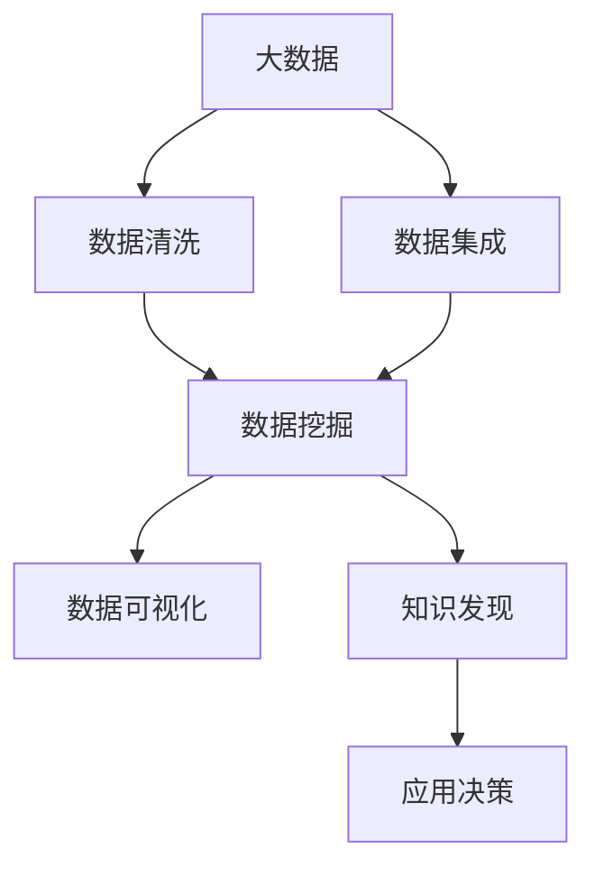

                 

# 大数据与知识发现：挖掘信息金矿的新方法

## 1. 背景介绍

### 1.1 问题由来

在当今数字化时代，数据已经成为了最宝贵的资产之一。从社交媒体、电子商务到金融交易、科学研究，大量的结构化和非结构化数据每天都在被生成。如何从这些数据中挖掘出有价值的信息，成为了企业和研究机构迫切需要解决的问题。

大数据和知识发现技术的兴起，提供了一种高效、准确的方法，从海量数据中提取出有用知识，为决策提供依据。通过数据清洗、数据集成、数据挖掘、数据可视化等步骤，我们可以从混乱的数据中发现规律，预测趋势，挖掘隐藏的模式和关系。

### 1.2 问题核心关键点

1. **数据量巨大**：数据的数量和种类越来越多，如何处理和分析这些数据是一个巨大的挑战。
2. **数据多样性**：数据包括结构化、半结构化和非结构化等多种形式，需要适应不同的数据类型。
3. **数据质量问题**：数据往往存在缺失、错误、噪声等问题，影响分析结果的准确性。
4. **实时性要求**：很多应用场景需要实时或近实时处理数据，对系统的响应速度和计算能力提出了高要求。
5. **可解释性需求**：数据挖掘的结果往往复杂难懂，需要提供易于理解的解释，帮助用户理解和使用结果。
6. **隐私和安全**：数据挖掘涉及大量敏感信息，必须确保数据的安全和隐私保护。

## 2. 核心概念与联系

### 2.1 核心概念概述

为更好地理解大数据与知识发现技术，本节将介绍几个关键概念：

- **大数据 (Big Data)**：指在传统数据处理应用软件无法有效处理的大规模、多样化、高速增长的数据集。通常包括结构化数据、半结构化数据和非结构化数据。
- **数据挖掘 (Data Mining)**：从数据集中自动发现模式、规则、异常和知识的过程。目标是从数据中提取有用的信息，辅助决策和优化。
- **知识发现 (Knowledge Discovery)**：通过数据挖掘获取的知识进行进一步分析和解释，最终形成可操作的商业或科学知识。
- **数据清洗 (Data Cleaning)**：处理缺失值、错误、噪声等数据质量问题，确保数据的一致性和准确性。
- **数据集成 (Data Integration)**：将不同来源的数据进行合并，统一数据格式和标准，构建统一的数据仓库。
- **数据可视化 (Data Visualization)**：将数据以图表、图形等形式展示出来，帮助用户更直观地理解数据。
- **机器学习 (Machine Learning)**：使用算法和统计模型，让计算机从数据中自动学习和推理，进行预测和分类。
- **深度学习 (Deep Learning)**：一种特殊的机器学习，通过多层神经网络模拟人脑处理信息的方式，处理更复杂的数据模式。

这些概念之间存在紧密的联系，通过数据清洗、集成、挖掘和可视化等步骤，最终形成知识，辅助决策和优化。机器学习和深度学习是数据挖掘和知识发现的重要技术手段。

### 2.2 核心概念原理和架构的 Mermaid 流程图



这个流程图展示了从大数据到知识发现的全过程：

1. **大数据**：从各种渠道收集数据。
2. **数据清洗**：处理数据中的缺失、错误和噪声。
3. **数据集成**：将不同来源的数据进行合并和统一。
4. **数据挖掘**：从数据中自动发现模式和知识。
5. **数据可视化**：将数据以图形形式展示出来。
6. **知识发现**：从数据挖掘结果中提取有用的知识。
7. **应用决策**：基于知识发现结果进行决策和优化。

## 3. 核心算法原理 & 具体操作步骤

### 3.1 算法原理概述

大数据与知识发现技术主要依赖数据挖掘算法，包括分类、聚类、关联规则、异常检测等。这些算法通过分析数据集中的模式和规律，提取有用的知识。常见的数据挖掘算法包括：

- **K-means**：一种聚类算法，将数据集分成K个簇，每个簇内数据的相似度较高。
- **决策树**：通过树形结构，对数据进行分类和预测。
- **支持向量机 (SVM)**：通过构造最优超平面，对数据进行分类。
- **朴素贝叶斯**：基于贝叶斯定理，对数据进行分类和预测。
- **Apriori算法**：用于挖掘关联规则，找出频繁出现的项集。
- **异常检测**：通过检测异常点，识别数据集中的离群值。

这些算法通过不同的模型和策略，从数据中提取有用的知识。

### 3.2 算法步骤详解

数据挖掘通常包括以下几个关键步骤：

**Step 1: 数据收集与预处理**
- 收集各种来源的数据，包括结构化、半结构化和非结构化数据。
- 对数据进行清洗和预处理，如去除重复数据、处理缺失值、纠正错误等。

**Step 2: 数据集成与转换**
- 将不同格式和来源的数据进行合并和转换，构建统一的数据集。
- 应用数据转换方法，如归一化、标准化、编码等，准备数据挖掘分析。

**Step 3: 数据挖掘与分析**
- 选择合适的数据挖掘算法，对数据集进行分析。
- 应用特征选择、特征提取等方法，提高数据挖掘的效果。
- 使用交叉验证等技术，评估和优化模型。

**Step 4: 结果解释与可视化**
- 对数据挖掘结果进行解释，提取有用的知识。
- 应用数据可视化技术，将结果以图形和图表形式展示出来。

**Step 5: 知识应用与优化**
- 将提取的知识应用到业务决策中，进行优化和改进。
- 定期更新数据和模型，确保数据的及时性和准确性。

### 3.3 算法优缺点

大数据与知识发现算法具有以下优点：

- **高效性**：能够处理大规模数据集，提供快速的分析结果。
- **自动化**：自动化地发现数据中的模式和规律，减轻人工分析的负担。
- **可解释性**：能够提供数据挖掘结果的解释，帮助用户理解和使用结果。
- **适用性广**：适用于各种类型的数据，包括结构化、半结构化和非结构化数据。

同时，这些算法也存在一些局限性：

- **数据依赖性强**：需要高质量的数据，才能得出准确的分析结果。
- **算法复杂度高**：部分算法复杂度高，计算成本高。
- **过拟合风险**：算法可能过度拟合训练数据，影响泛化能力。
- **可解释性不足**：部分算法结果复杂难懂，需要额外的解释技术。
- **隐私和安全问题**：处理敏感数据时，需要确保数据的安全和隐私保护。

### 3.4 算法应用领域

大数据与知识发现技术在多个领域得到了广泛应用，例如：

- **金融分析**：通过分析交易数据，发现市场趋势，预测股票价格。
- **市场营销**：通过分析消费者行为，制定个性化营销策略，提升销售额。
- **医疗健康**：通过分析患者数据，发现疾病模式，辅助医生诊断和治疗。
- **电子商务**：通过分析用户行为，推荐商品，提高用户体验和销售转化率。
- **物流管理**：通过分析物流数据，优化配送路线，提高配送效率和成本效益。
- **社交媒体分析**：通过分析用户评论和行为，挖掘社交网络中的模式和关系。
- **环境监测**：通过分析环境数据，预测气象变化，监测污染情况。

## 4. 数学模型和公式 & 详细讲解 & 举例说明

### 4.1 数学模型构建

数据挖掘的数学模型通常包括：

- **聚类模型**：如K-means算法，目标是最小化簇内平方和。
- **分类模型**：如决策树和朴素贝叶斯，目标是最大化分类准确率。
- **回归模型**：如线性回归和逻辑回归，目标是最小化预测误差。
- **关联规则模型**：如Apriori算法，目标是找出频繁出现的项集。

以K-means算法为例，其目标是最小化簇内平方和，公式如下：

$$
\min_{K,\mu_k} \sum_{i=1}^N \min_{k=1}^K \|x_i - \mu_k\|^2
$$

其中 $K$ 表示簇的数量，$\mu_k$ 表示第 $k$ 簇的中心，$x_i$ 表示数据点。

### 4.2 公式推导过程

以K-means算法为例，其基本思路是将数据点分成 $K$ 个簇，每个簇的中心是所有数据点在该簇的平均值。算法的步骤如下：

1. 随机选择 $K$ 个数据点作为初始中心。
2. 对于每个数据点，计算其到每个中心的距离，分配到距离最近的簇。
3. 对于每个簇，计算其新中心，即簇内数据点的平均值。
4. 重复步骤2和步骤3，直到簇中心不再变化或达到预设的迭代次数。

### 4.3 案例分析与讲解

以电商平台的客户分群为例，通过K-means算法将客户分为不同的群体，可以更好地进行个性化营销和优化服务。

- **Step 1: 数据收集与预处理**：收集客户的购买记录、浏览记录、人口统计信息等。对数据进行清洗和处理，去除重复数据和异常值。
- **Step 2: 数据集成与转换**：将所有数据进行合并和统一，准备分析。
- **Step 3: 数据挖掘与分析**：使用K-means算法对客户进行分群，发现不同的客户群体。
- **Step 4: 结果解释与可视化**：对分群结果进行解释，应用数据可视化技术，展示不同群体的特征。
- **Step 5: 知识应用与优化**：根据不同群体的特征，制定个性化营销策略，提升用户满意度和转化率。

## 5. 项目实践：代码实例和详细解释说明

### 5.1 开发环境搭建

在进行数据挖掘实践前，我们需要准备好开发环境。以下是使用Python进行Scikit-learn开发的环境配置流程：

1. 安装Anaconda：从官网下载并安装Anaconda，用于创建独立的Python环境。

2. 创建并激活虚拟环境：
```bash
conda create -n data-mining-env python=3.8 
conda activate data-mining-env
```

3. 安装Scikit-learn：
```bash
pip install scikit-learn
```

4. 安装其他工具包：
```bash
pip install numpy pandas matplotlib seaborn
```

完成上述步骤后，即可在`data-mining-env`环境中开始数据挖掘实践。

### 5.2 源代码详细实现

下面我们以K-means算法为例，给出使用Scikit-learn库对客户数据进行分群的Python代码实现。

```python
import numpy as np
import pandas as pd
from sklearn.cluster import KMeans
from sklearn.preprocessing import StandardScaler
import matplotlib.pyplot as plt

# 读取客户数据
data = pd.read_csv('customer_data.csv')

# 特征选择和标准化
features = ['age', 'income', 'education', 'purchases']
X = data[features].values
X = StandardScaler().fit_transform(X)

# 应用K-means算法进行分群
kmeans = KMeans(n_clusters=3, random_state=0).fit(X)
labels = kmeans.labels_

# 可视化分群结果
plt.scatter(X[:,0], X[:,1], c=labels)
plt.show()
```

在这个例子中，我们使用Scikit-learn库的KMeans算法对客户数据进行分群。代码实现包括以下步骤：

- 读取客户数据，并选择特征。
- 对特征进行标准化，准备数据挖掘。
- 应用K-means算法进行分群，得到每个客户的分群标签。
- 对分群结果进行可视化展示。

### 5.3 代码解读与分析

让我们再详细解读一下关键代码的实现细节：

- **数据读取与特征选择**：使用Pandas库读取客户数据，并选择需要进行分析的特征。
- **数据标准化**：使用StandardScaler库对特征进行标准化，确保不同特征的数值范围相近。
- **K-means算法应用**：使用Scikit-learn库的KMeans算法对数据进行分群，得到每个客户的分群标签。
- **可视化展示**：使用Matplotlib库将分群结果以散点图形式展示出来。

## 6. 实际应用场景

### 6.1 金融分析

在大数据与知识发现技术中，金融分析是一个典型的应用场景。通过分析金融数据，如交易记录、市场行情、公司财报等，可以发现潜在的投资机会和风险。

例如，银行可以使用大数据与知识发现技术，分析客户的历史交易数据和信用记录，预测客户的信用风险，制定相应的信贷策略。保险公司可以分析客户的历史健康数据和理赔记录，预测客户的风险，优化保险产品设计。

### 6.2 市场营销

市场营销中，大数据与知识发现技术可以帮助企业更好地了解消费者行为和需求，制定个性化的营销策略。

例如，电商平台可以通过分析用户的浏览和购买记录，发现用户的兴趣和偏好，推荐相应的商品。零售商可以使用大数据与知识发现技术，分析销售数据和市场趋势，制定库存和促销策略。

### 6.3 医疗健康

在医疗健康领域，大数据与知识发现技术可以帮助医疗机构提高诊断和治疗效果。

例如，医院可以通过分析患者的电子病历和历史诊疗记录，发现疾病的模式和趋势，辅助医生诊断和治疗。制药公司可以使用大数据与知识发现技术，分析临床试验数据和市场反馈，优化药物设计和开发。

### 6.4 电子商务

在电子商务领域，大数据与知识发现技术可以帮助企业提升用户体验和销售转化率。

例如，电商平台可以通过分析用户的行为数据，如浏览、点击、购买等，发现用户的兴趣和偏好，进行个性化推荐。物流公司可以使用大数据与知识发现技术，分析配送数据和路线信息，优化配送路线和提高配送效率。

## 7. 工具和资源推荐

### 7.1 学习资源推荐

为了帮助开发者系统掌握大数据与知识发现技术，这里推荐一些优质的学习资源：

1. 《Python数据科学手册》系列博文：由数据科学专家撰写，涵盖Python编程、数据清洗、数据可视化等基础知识。
2. Coursera《数据科学导论》课程：由约翰霍普金斯大学开设的在线课程，全面介绍了数据科学的理论和方法。
3. 《机器学习实战》书籍：机器学习经典教材，详细介绍了数据挖掘和知识发现的经典算法和案例。
4. Kaggle数据科学竞赛平台：提供大量真实数据集和竞赛任务，帮助开发者提升实战能力。
5. Hadoop、Spark、Flink等大数据技术官方文档：了解和掌握大数据处理和分析的核心技术。

通过对这些资源的学习实践，相信你一定能够快速掌握大数据与知识发现技术的精髓，并用于解决实际的商业问题。

### 7.2 开发工具推荐

高效的开发离不开优秀的工具支持。以下是几款用于数据挖掘开发的常用工具：

1. Python：一种通用编程语言，适合数据科学和数据挖掘。
2. R：一种专门用于统计分析和数据科学的语言，拥有丰富的数据科学库。
3. Scikit-learn：Python的数据挖掘库，提供了大量经典的算法和工具。
4. TensorFlow和PyTorch：用于深度学习的开源框架，支持分布式计算和自动化模型训练。
5. Apache Hadoop和Apache Spark：用于大数据处理和分析的开源框架，支持分布式计算和存储。
6. Jupyter Notebook：一种交互式编程环境，适合数据科学和机器学习的开发和调试。

合理利用这些工具，可以显著提升数据挖掘任务的开发效率，加快创新迭代的步伐。

### 7.3 相关论文推荐

大数据与知识发现技术的发展源于学界的持续研究。以下是几篇奠基性的相关论文，推荐阅读：

1. Jure Leskovec的《网络分析和建模》：介绍了网络分析和建模的基本方法和技术。
2. Jeffrey Bilmes的《统计学习基础》：介绍了统计学习的基本原理和算法。
3. David Rough的《知识发现与数据挖掘》：介绍了知识发现和数据挖掘的算法和技术。
4. Tony Joachims的《机器学习：数据挖掘、预测与统计学习》：介绍了机器学习和数据挖掘的经典算法。
5. Russel A. Myers的《数据库系统概念》：介绍了数据库系统和数据挖掘的基本原理。

这些论文代表了大数据与知识发现技术的发展脉络。通过学习这些前沿成果，可以帮助研究者把握学科前进方向，激发更多的创新灵感。

## 8. 总结：未来发展趋势与挑战

### 8.1 总结

本文对大数据与知识发现技术进行了全面系统的介绍。首先阐述了大数据和知识发现技术的背景和意义，明确了数据挖掘在实际应用中的重要性和挑战。其次，从原理到实践，详细讲解了数据挖掘的数学模型和算法步骤，给出了数据挖掘任务开发的完整代码实例。同时，本文还广泛探讨了数据挖掘方法在金融、市场营销、医疗健康、电子商务等多个行业领域的应用前景，展示了数据挖掘范式的巨大潜力。此外，本文精选了数据挖掘技术的各类学习资源，力求为读者提供全方位的技术指引。

通过本文的系统梳理，可以看到，大数据与知识发现技术正在成为数据驱动决策的重要手段，极大地拓展了数据分析的应用边界，为商业决策提供了有力支持。未来，伴随数据挖掘方法的持续演进，数据科学将迎来更广阔的发展空间，进一步推动各行各业的数字化转型。

### 8.2 未来发展趋势

展望未来，大数据与知识发现技术将呈现以下几个发展趋势：

1. **自动化程度提高**：自动化数据清洗、特征选择和模型优化，减轻人工干预的负担。
2. **实时分析能力增强**：支持实时数据处理和分析，提供近实时的决策支持。
3. **跨领域应用扩展**：从单一领域的应用，拓展到多个领域的综合应用，如金融、医疗、物流等。
4. **数据源多样化**：处理多种类型的数据，包括结构化、半结构化和非结构化数据。
5. **算法优化和创新**：引入新的算法和技术，提高数据挖掘的效果和精度。
6. **可解释性和透明性提升**：提供可解释的模型和算法，增强算法的透明性和可信度。
7. **安全性保障**：确保数据的安全和隐私保护，防止数据泄露和滥用。
8. **跨学科融合**：与其他学科，如数学、统计学、计算机科学等进行交叉融合，提升数据挖掘的深度和广度。

这些趋势凸显了大数据与知识发现技术的广阔前景。这些方向的探索发展，必将进一步提升数据挖掘的精度和效率，为商业决策提供更准确、更及时的支持。

### 8.3 面临的挑战

尽管大数据与知识发现技术已经取得了瞩目成就，但在迈向更加智能化、普适化应用的过程中，它仍面临着诸多挑战：

1. **数据质量问题**：数据往往存在缺失、错误、噪声等问题，影响分析结果的准确性。
2. **计算资源瓶颈**：处理大规模数据集需要高性能计算资源，如GPU和分布式计算。
3. **算法复杂度问题**：部分算法复杂度高，计算成本高，需要优化和改进。
4. **可解释性不足**：部分算法结果复杂难懂，需要额外的解释技术。
5. **隐私和安全问题**：处理敏感数据时，需要确保数据的安全和隐私保护。
6. **多源数据融合**：不同来源的数据格式和标准不一致，需要进行统一和转换。
7. **实时性要求**：需要支持实时数据处理和分析，对系统的响应速度和计算能力提出了高要求。

### 8.4 研究展望

面对大数据与知识发现技术所面临的挑战，未来的研究需要在以下几个方面寻求新的突破：

1. **数据清洗和预处理**：开发更加智能的数据清洗和预处理技术，自动处理数据中的缺失值、错误和噪声。
2. **计算资源优化**：优化算法和模型结构，提高计算效率和性能。
3. **算法复杂度降低**：简化算法和模型，降低计算成本，提高可扩展性。
4. **可解释性增强**：开发可解释的算法和模型，增强算法的透明性和可信度。
5. **隐私和安全保护**：引入隐私保护和加密技术，确保数据的安全和隐私保护。
6. **多源数据融合**：开发多源数据融合技术，统一不同来源的数据格式和标准。
7. **实时分析能力增强**：引入实时数据处理和分析技术，支持近实时的决策支持。

这些研究方向的探索，必将引领大数据与知识发现技术迈向更高的台阶，为构建智能化决策系统铺平道路。面向未来，大数据与知识发现技术还需要与其他人工智能技术进行更深入的融合，如深度学习、强化学习等，多路径协同发力，共同推动数据分析和商业决策的进步。只有勇于创新、敢于突破，才能不断拓展数据挖掘的边界，让数据分析技术更好地服务于人类的认知智能。

## 9. 附录：常见问题与解答

**Q1：大数据与知识发现是否适用于所有行业？**

A: 大数据与知识发现技术可以应用于多个行业，但不同行业的数据特征和应用场景存在差异。例如，金融行业的数据主要集中在交易记录和市场行情，医疗行业的数据主要集中在患者电子病历和实验室数据。因此，需要根据具体行业的需求，选择合适的数据挖掘算法和技术。

**Q2：如何选择合适的大数据与知识发现算法？**

A: 选择合适的大数据与知识发现算法需要考虑以下几个因素：
1. 数据类型：结构化、半结构化和非结构化数据的处理方式不同。
2. 问题类型：分类、聚类、回归、关联规则等不同的问题类型需要不同的算法。
3. 数据规模：大数据集需要高效的算法和分布式计算。
4. 可解释性需求：部分算法可解释性强，适合需要解释结果的场景。

例如，对于分类问题，可以使用决策树、朴素贝叶斯、支持向量机等算法。对于聚类问题，可以使用K-means、层次聚类、DBSCAN等算法。对于关联规则，可以使用Apriori、FP-growth等算法。

**Q3：如何提高数据挖掘模型的准确性？**

A: 提高数据挖掘模型的准确性需要从以下几个方面进行优化：
1. 数据预处理：清洗和处理数据中的缺失值、错误和噪声。
2. 特征选择和提取：选择合适的特征，提高算法的准确性。
3. 模型优化：应用交叉验证、正则化等技术，优化模型参数和结构。
4. 数据增强：通过数据增强技术，增加训练集的多样性。
5. 模型集成：将多个模型的预测结果进行集成，提高预测准确性。

**Q4：数据挖掘的结果如何应用于业务决策？**

A: 数据挖掘的结果需要经过以下几个步骤，才能应用于业务决策：
1. 结果解释：对数据挖掘结果进行解释，提取有用的知识和信息。
2. 可视化展示：将结果以图表和图形形式展示出来，帮助用户理解和使用结果。
3. 业务应用：将提取的知识和信息应用到业务决策中，进行优化和改进。
4. 反馈调整：根据业务反馈，调整和优化模型和算法，提高预测和决策的准确性。

**Q5：数据挖掘中如何处理数据隐私和安全问题？**

A: 在数据挖掘中，处理数据隐私和安全问题需要采取以下措施：
1. 数据匿名化：对敏感数据进行匿名化处理，防止数据泄露。
2. 访问控制：限制数据访问权限，确保只有授权人员才能访问数据。
3. 数据加密：对数据进行加密处理，防止数据被非法获取和篡改。
4. 合规性检查：确保数据挖掘过程符合相关法律法规，如GDPR、CCPA等。

通过以上措施，可以最大限度地保护数据隐私和安全，确保数据挖掘的合规性和可信度。

---

作者：禅与计算机程序设计艺术 / Zen and the Art of Computer Programming

