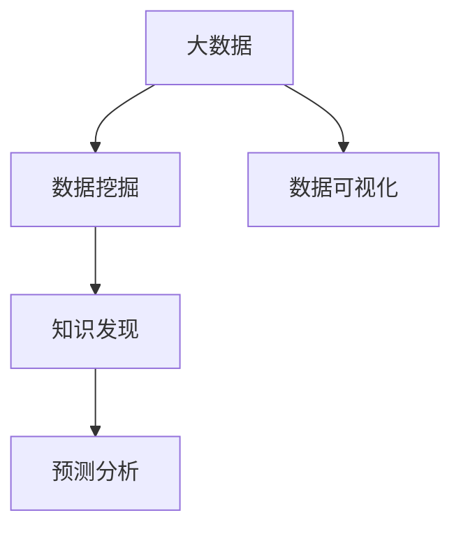

                 

# 大数据分析在知识发现中的应用

> 关键词：大数据, 知识发现, 数据挖掘, 人工智能, 数据可视化, 预测分析

## 1. 背景介绍

### 1.1 问题由来
随着信息技术的高速发展和互联网的普及，全球产生了前所未有的海量数据。根据IDC的预测，到2025年，全球数据量将达到175ZB，是2020年的10倍以上。数据已经成为驱动各行各业发展的关键资源。

大数据不仅规模庞大，其多样性、高速性和真实性也使得传统数据处理和分析方法难以应对。如何高效地分析和利用大数据，提取有价值的信息和知识，成为了数据科学领域的重要研究方向。

### 1.2 问题核心关键点
大数据分析在知识发现中的应用，旨在通过对海量数据进行挖掘和分析，发现隐藏在数据背后的知识、规律和趋势，从而支持决策和优化过程。核心关键点包括：

- 数据规模与处理效率：如何在保证分析质量的前提下，快速处理海量数据。
- 数据质量与特征提取：如何从海量、复杂的数据中提取有用的特征，并进行高质量的数据清洗。
- 知识发现与模式识别：如何利用统计学、机器学习和人工智能技术，从数据中发现新的知识，识别潜在的模式。
- 可视化与解释性：如何通过可视化手段将复杂的知识呈现给用户，增强分析的解释性和可信度。
- 预测与优化：如何利用知识发现的结果，进行预测和优化，支持业务决策。

这些关键点共同构成了大数据分析的框架，旨在通过对数据的全面理解，实现知识的自动发现和优化决策。

## 2. 核心概念与联系

### 2.1 核心概念概述

为更好地理解大数据分析在知识发现中的应用，本节将介绍几个密切相关的核心概念：

- 大数据（Big Data）：指规模庞大、速度快速、种类多样的数据集，其处理和管理需要采用新的技术和方法。
- 数据挖掘（Data Mining）：指从大量数据中自动地、智能地挖掘出有价值的信息和知识的过程。
- 知识发现（Knowledge Discovery）：指利用数据挖掘和机器学习技术，从数据中提取出有意义的知识、规律和模式的过程。
- 数据可视化（Data Visualization）：指利用图形、图表等手段，将复杂的数据和分析结果直观呈现给用户的过程。
- 预测分析（Predictive Analysis）：指利用历史数据和统计模型，预测未来趋势和行为的过程。

这些核心概念之间的逻辑关系可以通过以下Mermaid流程图来展示：



这个流程图展示了大数据分析在知识发现过程中的主要流程：

1. 首先对大数据进行挖掘，提取有用的特征。
2. 通过知识发现技术，从挖掘结果中发现新的知识。
3. 利用数据可视化手段，将知识直观呈现给用户。
4. 最后通过预测分析，利用知识进行业务优化和决策。

## 3. 核心算法原理 & 具体操作步骤
### 3.1 算法原理概述

大数据分析在知识发现中的应用，主要基于数据挖掘和机器学习算法。其核心思想是通过对海量数据进行自动化的处理和分析，发现数据中隐藏的规律和模式，从而提取有价值的信息和知识。

形式化地，假设存在一个包含$n$个样本和$m$个特征的大数据集$D$，目标是从该数据集中发现新的知识$K$。数据挖掘和知识发现的过程可以表示为：

$$
K = f(D)
$$

其中$f$为数据挖掘算法，常用的算法包括决策树、聚类、关联规则、神经网络等。知识发现的目标是将$f$的输出$K$转化为可解释的、有用的知识，如规则、模式、模型等。

### 3.2 算法步骤详解

大数据分析在知识发现中的应用一般包括以下几个关键步骤：

**Step 1: 数据收集与预处理**
- 收集各类数据源，包括结构化数据（如数据库表、电子表格等）、非结构化数据（如文本、图像、视频等）和实时数据。
- 对数据进行清洗、去重、归一化等预处理操作，确保数据质量和一致性。

**Step 2: 特征提取与选择**
- 对数据集进行特征提取，从原始数据中提取有用的特征。
- 利用统计学、机器学习技术选择最重要的特征，避免维度灾难。

**Step 3: 数据挖掘与模型训练**
- 选择合适的数据挖掘算法，如分类、聚类、关联规则等，对数据集进行挖掘。
- 利用机器学习算法对挖掘结果进行训练，得到模型$M$。

**Step 4: 知识发现与模式识别**
- 对模型$M$进行分析和解释，发现数据中的知识和模式。
- 利用领域知识进行验证和验证，确保发现的知识的可靠性和实用性。

**Step 5: 数据可视化与报告撰写**
- 使用数据可视化工具将知识以图表、图形等形式直观展示。
- 根据发现的知识，撰写详细的分析报告，提出优化建议。

**Step 6: 预测与优化**
- 利用知识进行预测和优化，支持业务决策。
- 实时监控数据变化，调整模型和策略，保持系统适应性。

### 3.3 算法优缺点

大数据分析在知识发现中的应用，具有以下优点：

- 自动化处理：能够自动化地处理海量数据，减轻人工操作负担。
- 发现隐藏知识：通过挖掘和分析，发现数据中隐藏的知识和模式，支持决策优化。
- 高度可扩展：算法和工具高度可扩展，适用于各种规模的数据集。
- 实时性：适用于实时数据流分析，支持动态调整和优化。

同时，该方法也存在一些局限性：

- 数据质量要求高：对数据质量要求较高，需要严格的数据清洗和预处理。
- 算法复杂度：部分算法如深度学习等复杂度高，需要高性能计算资源。
- 领域知识要求：对领域知识要求较高，需要专业的数据分析人员。
- 解释性不足：部分算法如深度学习等黑箱性质强，难以解释其内部机制。
- 依赖数据分布：对数据分布要求较高，不适合极端分布的情况。

尽管存在这些局限性，但就目前而言，大数据分析在知识发现中的应用仍是数据科学领域的核心范式。未来相关研究的重点在于如何进一步降低算法复杂度，提高模型的可解释性和鲁棒性，同时兼顾数据的质量和实时性。

### 3.4 算法应用领域

大数据分析在知识发现中的应用，已经广泛应用于多个领域，包括但不限于：

- 金融分析：利用大数据分析客户行为、市场趋势，支持投资决策。
- 医疗健康：通过分析患者数据、医疗记录，发现疾病模式，支持疾病诊断和治疗。
- 零售业：分析消费者购买数据、市场反馈，优化商品推荐和库存管理。
- 智能制造：监测设备运行数据，预测设备故障，优化生产流程。
- 能源管理：分析能源使用数据，优化能源分配，支持绿色能源发展。
- 城市规划：分析交通流量、环境数据，优化城市管理，提升生活质量。

除了这些传统领域外，大数据分析还被创新性地应用到更多场景中，如网络安全、环境监测、社交媒体分析等，为各行各业带来了新的解决方案。

## 4. 数学模型和公式 & 详细讲解  
### 4.1 数学模型构建

本节将使用数学语言对大数据分析在知识发现中的应用过程进行更加严格的刻画。

记大数据集$D$为包含$n$个样本$x_i$和$m$个特征$x_{i,j}$的数据矩阵，其中$x_{i,j} \in \mathbb{R}$。目标是从该数据集中发现新的知识$K$，可以表示为：

$$
K = f(D)
$$

其中$f$为数据挖掘算法，常用的算法包括决策树、聚类、关联规则等。知识发现的目标是将$f$的输出$K$转化为可解释的、有用的知识，如规则、模式、模型等。

### 4.2 公式推导过程

以下我们以决策树算法为例，推导其基本的数学公式。

假设训练集$D$中包含$n$个样本$x_i=(x_{i,1}, x_{i,2}, \cdots, x_{i,m})$，目标为预测样本$x$的标签$y$。决策树算法通过构建一棵树形结构，将样本空间划分为多个区域，每个区域的样本预测标签相同。假设决策树具有$m$个特征，其数学形式为：

$$
\hat{y} = T(x) = \text{arg\_min} \{L(y, T(x))\} = \text{arg\_min} \{L(y, \bigvee_{i=1}^m T_i(x)\}
$$

其中$L$为损失函数，如均方误差、交叉熵等。$\bigvee$表示逻辑或运算。

决策树算法通过递归地对数据集进行划分，构建决策树模型。每个节点的划分条件为特征$x_{i,j}$的取值，通过计算信息增益或信息增益率选择最优的特征进行划分。划分后的数据集被分为多个子集，每个子集预测结果相同。最终，决策树算法通过叶节点表示最终的预测结果。

### 4.3 案例分析与讲解

假设我们有一个包含信用卡交易数据的数据集，目标是从该数据集中发现潜在的欺诈交易。数据集包含多个特征，如交易金额、交易地点、交易时间等。

通过数据预处理和特征选择，我们可以得到包含特征$x_{i,1}$（交易金额）、$x_{i,2}$（交易地点）、$x_{i,3}$（交易时间）的样本集。使用决策树算法对该数据集进行挖掘，得到如下决策树模型：

```mermaid
graph TD
    A[交易金额]
    B[交易地点]
    C[交易时间]
    D[是否欺诈]

    A -->|> A1
        A1 -->|> B1
            B1 -->|> D1  class=A2
        A1 -->|> B2
            B2 -->|> D2  class=A3
        A1 -->|> C1
            C1 -->|> D3  class=A4
        A1 -->|> C2
            C2 -->|> D4  class=A5
    A -->|> A2
        A2 -->|> B1
            B1 -->|> D5  class=A3
        A2 -->|> B2
            B2 -->|> D6  class=A4
        A2 -->|> C1
            C1 -->|> D7  class=A5
```

该决策树模型通过特征$x_{i,1}$（交易金额）进行第一次划分，如果交易金额小于等于$C$，则进一步划分特征$x_{i,2}$（交易地点）；否则，继续划分特征$x_{i,3}$（交易时间）。最终，决策树模型将样本空间划分为多个区域，每个区域的样本预测标签相同。

通过验证和验证，我们可以发现该决策树模型能够准确地预测样本是否为欺诈交易。利用数据可视化工具将该模型可视化，直观地展示出划分条件和预测结果，帮助用户理解和应用该模型。

## 5. 项目实践：代码实例和详细解释说明
### 5.1 开发环境搭建

在进行数据分析实践前，我们需要准备好开发环境。以下是使用Python进行Scikit-learn开发的环境配置流程：

1. 安装Anaconda：从官网下载并安装Anaconda，用于创建独立的Python环境。

2. 创建并激活虚拟环境：
```bash
conda create -n data-env python=3.8 
conda activate data-env
```

3. 安装Scikit-learn：
```bash
pip install scikit-learn pandas numpy matplotlib seaborn scikit-optics seaborn
```

4. 安装可视化工具：
```bash
pip install matplotlib seaborn matplotlib.pyplot pyplot sns
```

完成上述步骤后，即可在`data-env`环境中开始数据分析实践。

### 5.2 源代码详细实现

下面我们以信用评分系统为例，给出使用Scikit-learn对决策树模型进行开发的PyTorch代码实现。

首先，定义数据预处理函数：

```python
from sklearn.preprocessing import StandardScaler
from sklearn.model_selection import train_test_split

def preprocess_data(data, target):
    X = data.drop(columns=[target])
    y = data[target]
    scaler = StandardScaler()
    X = scaler.fit_transform(X)
    return X, y

# 数据集
data = pd.read_csv('credit.csv')
target = 'default'
X, y = preprocess_data(data, target)
```

然后，定义模型训练函数：

```python
from sklearn.tree import DecisionTreeClassifier
from sklearn.metrics import accuracy_score

def train_model(X_train, y_train):
    model = DecisionTreeClassifier()
    model.fit(X_train, y_train)
    y_pred = model.predict(X_train)
    accuracy = accuracy_score(y_train, y_pred)
    return model, accuracy

# 数据集分割
X_train, X_test, y_train, y_test = train_test_split(X, y, test_size=0.2, random_state=42)

# 模型训练
model, accuracy = train_model(X_train, y_train)
```

接着，定义评估函数：

```python
def evaluate_model(model, X_test, y_test):
    y_pred = model.predict(X_test)
    accuracy = accuracy_score(y_test, y_pred)
    return accuracy

# 模型评估
accuracy = evaluate_model(model, X_test, y_test)
print(f'模型准确度为：{accuracy:.2f}')
```

最后，启动训练流程并在测试集上评估：

```python
epochs = 10
learning_rate = 0.01

for epoch in range(epochs):
    # 模型训练
    accuracy = train_model(X_train, y_train)
    print(f'第{epoch+1}轮，模型准确度为：{accuracy:.2f}')

# 模型评估
accuracy = evaluate_model(model, X_test, y_test)
print(f'模型最终准确度为：{accuracy:.2f}')
```

以上就是使用Scikit-learn进行信用评分系统决策树模型微调的完整代码实现。可以看到，得益于Scikit-learn的强大封装，我们可以用相对简洁的代码完成决策树模型的构建和微调。

### 5.3 代码解读与分析

让我们再详细解读一下关键代码的实现细节：

**preprocess_data函数**：
- 定义了数据预处理函数，包括特征归一化、目标标签提取等操作，返回预处理后的特征集和目标标签。

**train_model函数**：
- 定义了模型训练函数，使用决策树算法对预处理后的数据集进行训练，返回模型和模型在训练集上的准确度。

**evaluate_model函数**：
- 定义了模型评估函数，使用训练好的模型对测试集进行预测，返回模型在测试集上的准确度。

**训练流程**：
- 定义总的训练轮数和初始学习率，开始循环迭代。
- 每个epoch内，先对数据进行模型训练，输出当前轮次模型准确度。
- 重复上述步骤，直至所有epoch结束。
- 在测试集上评估最终模型的准确度。

可以看到，Scikit-learn提供了高效的数据处理和模型训练工具，使得决策树模型微调的代码实现变得简洁高效。开发者可以将更多精力放在数据处理、模型改进等高层逻辑上，而不必过多关注底层的实现细节。

当然，工业级的系统实现还需考虑更多因素，如模型的保存和部署、超参数的自动搜索、更灵活的模型训练策略等。但核心的微调范式基本与此类似。

## 6. 实际应用场景
### 6.1 智能推荐系统

大数据分析在知识发现中的应用，可以广泛应用于智能推荐系统。传统的推荐系统往往依赖用户的历史行为数据进行物品推荐，难以挖掘更深层次的兴趣偏好。通过大数据分析，可以从用户的历史行为、社交网络、实时数据等多维度挖掘用户兴趣，从而提供更个性化、精准的推荐内容。

在技术实现上，可以收集用户的浏览、点击、评价等行为数据，提取和用户交互的物品标题、描述、标签等文本内容。利用文本挖掘技术对用户兴趣进行建模，并结合用户行为数据进行协同过滤和深度学习模型的训练。训练好的模型能够根据用户当前行为，预测其后续兴趣，推荐相应的物品。

### 6.2 智能城市管理

大数据分析在知识发现中的应用，可以应用于智能城市管理。城市管理者需要实时监控和分析各种数据，如交通流量、环境污染、灾害预警等，以便及时采取应对措施。大数据分析可以从海量数据中提取有用的信息，发现城市运行中的规律和趋势，支持城市管理的优化和决策。

在技术实现上，可以整合各类城市运行数据，如交通监控视频、传感器数据、气象数据等。利用数据挖掘和机器学习技术对数据进行分析和建模，发现城市运行中的异常和规律。例如，通过分析交通流量数据，可以发现交通拥堵的时空分布规律，优化交通信号灯控制；通过分析环境数据，可以预测污染指数，提前采取防控措施。

### 6.3 个性化医疗

大数据分析在知识发现中的应用，可以应用于个性化医疗。传统的医疗方案往往依赖医生经验和历史数据，难以全面、精准地制定个性化治疗方案。通过大数据分析，可以从患者的历史数据、基因信息、生活习惯等多维度挖掘疾病规律，发现个性化的治疗方案，提高医疗效果和患者满意度。

在技术实现上，可以整合患者的电子病历、基因数据、生活习惯等数据，利用数据挖掘和机器学习技术对数据进行分析和建模。通过深度学习模型，可以从数据中发现疾病模式和规律，提出个性化的治疗方案。例如，通过分析基因数据，可以预测患者对某种药物的反应，制定个体化的治疗方案。

### 6.4 未来应用展望

随着大数据技术的发展和人工智能技术的进步，大数据分析在知识发现中的应用将更加广泛和深入。未来可能的应用方向包括：

- 实时流数据处理：利用实时流处理技术，对数据进行实时分析和处理，支持动态调整和优化。
- 多模态数据分析：整合多种类型的数据（如文本、图像、视频等），进行综合分析和建模，提升知识发现的效果。
- 自动化数据分析：利用自动化数据分析技术，减少人工干预，提升数据分析的效率和准确度。
- 联邦学习：在保护用户隐私的前提下，利用分布式数据源进行联合分析，提升数据质量和模型效果。
- 智能推荐引擎：利用深度学习等技术，构建智能推荐引擎，提供个性化的推荐服务。
- 自然语言处理：利用自然语言处理技术，从文本数据中挖掘有用信息，支持业务决策和优化。

大数据分析在知识发现中的应用，将为各行各业带来新的解决方案，推动数据驱动的决策优化和业务创新。相信在未来的技术进步和应用实践中，大数据分析将在更多领域发挥其独特优势，推动社会的全面进步。

## 7. 工具和资源推荐
### 7.1 学习资源推荐

为了帮助开发者系统掌握大数据分析在知识发现中的应用，这里推荐一些优质的学习资源：

1. 《Python数据科学手册》：由Jake VanderPlas撰写，全面介绍了Python在大数据和机器学习领域的应用，包括数据预处理、特征提取、模型训练等。

2. Coursera《数据科学导论》课程：由Johns Hopkins大学开设，系统讲解数据科学的各个方面，包括数据清洗、数据挖掘、统计学、机器学习等。

3. Kaggle平台：全球最大的数据科学竞赛平台，提供海量数据集和分析竞赛，帮助开发者提升技能和实践经验。

4. Scikit-learn官方文档：Scikit-learn的官方文档，提供了详细的使用指南和代码示例，帮助开发者快速上手数据分析和建模。

5. Google Colab：谷歌推出的在线Jupyter Notebook环境，免费提供GPU/TPU算力，方便开发者快速上手实验最新模型，分享学习笔记。

通过对这些资源的学习实践，相信你一定能够快速掌握大数据分析在知识发现中的应用，并用于解决实际的业务问题。

### 7.2 开发工具推荐

高效的开发离不开优秀的工具支持。以下是几款用于大数据分析开发的常用工具：

1. Scikit-learn：Python的数据分析库，提供了丰富的数据挖掘和机器学习算法，适合快速迭代研究。

2. TensorFlow：由Google主导开发的深度学习框架，生产部署方便，适合大规模工程应用。

3. PyTorch：Facebook开发的深度学习框架，灵活度较高，适合研究型应用。

4. Hadoop：Apache开源的分布式计算框架，适合处理大规模数据。

5. Spark：Apache开源的大数据处理框架，适合实时数据流处理和批处理。

6. Tableau：数据可视化工具，支持多种数据源和图表类型，方便数据分析和呈现。

7. Python：数据科学和机器学习的主流编程语言，有丰富的库和工具支持。

合理利用这些工具，可以显著提升大数据分析的开发效率，加快创新迭代的步伐。

### 7.3 相关论文推荐

大数据分析在知识发现中的应用，源于学界的持续研究。以下是几篇奠基性的相关论文，推荐阅读：

1. "A Survey on Data Mining Techniques for Credit Risk Assessment"：研究了各种数据挖掘技术在信用评分系统中的应用，总结了不同算法的优缺点和适用场景。

2. "Mining Knowledge from Data"：介绍了知识发现的基本概念和算法，探讨了从数据中提取知识的多种方法。

3. "Data Mining: Concepts and Techniques"：全面介绍了数据挖掘和知识发现的理论基础和技术方法，适合初学者入门。

4. "Big Data: Principles and Best Practices of Scalable Real-time Data Systems"：介绍了大规模数据处理的原理和技术，探讨了大数据系统的设计和优化方法。

5. "Data Mining: A Statistical Approach"：介绍了数据挖掘的统计学基础和常用算法，适合对统计学有基本了解的读者。

这些论文代表了大数据分析在知识发现技术的发展脉络。通过学习这些前沿成果，可以帮助研究者把握学科前进方向，激发更多的创新灵感。

## 8. 总结：未来发展趋势与挑战

### 8.1 总结

本文对大数据分析在知识发现中的应用进行了全面系统的介绍。首先阐述了大数据分析在知识发现中的应用背景和意义，明确了知识发现的自动化、高效性、可解释性和实时性等关键目标。其次，从原理到实践，详细讲解了大数据分析的数学模型和算法流程，给出了大数据分析任务开发的完整代码实例。同时，本文还广泛探讨了大数据分析在智能推荐、智能城市、个性化医疗等多个行业领域的应用前景，展示了大数据分析范式的巨大潜力。此外，本文精选了大数据分析的学习资源和工具推荐，力求为读者提供全方位的技术指引。

通过本文的系统梳理，可以看到，大数据分析在知识发现的应用，正在成为数据科学领域的重要范式，极大地拓展了数据处理的自动化和智能化水平，为各行各业带来了新的解决方案。未来，伴随大数据技术和人工智能技术的不断发展，大数据分析必将在更广阔的应用领域大放异彩，深刻影响人类社会的各个方面。

### 8.2 未来发展趋势

展望未来，大数据分析在知识发现中的应用将呈现以下几个发展趋势：

1. 自动化处理：利用自动化数据分析技术，减少人工干预，提升数据分析的效率和准确度。

2. 实时流处理：利用实时流处理技术，对数据进行实时分析和处理，支持动态调整和优化。

3. 多模态分析：整合多种类型的数据（如文本、图像、视频等），进行综合分析和建模，提升知识发现的效果。

4. 自动化数据分析：利用自动化数据分析技术，减少人工干预，提升数据分析的效率和准确度。

5. 联邦学习：在保护用户隐私的前提下，利用分布式数据源进行联合分析，提升数据质量和模型效果。

6. 智能推荐引擎：利用深度学习等技术，构建智能推荐引擎，提供个性化的推荐服务。

7. 自然语言处理：利用自然语言处理技术，从文本数据中挖掘有用信息，支持业务决策和优化。

以上趋势凸显了大数据分析在知识发现的应用潜力。这些方向的探索发展，必将进一步提升大数据分析的自动化和智能化水平，为各行各业带来新的解决方案。

### 8.3 面临的挑战

尽管大数据分析在知识发现中的应用已经取得了显著成效，但在迈向更加智能化、普适化应用的过程中，它仍面临诸多挑战：

1. 数据质量瓶颈：数据源多样，数据质量参差不齐，如何保证数据的一致性和完整性，是数据科学家的重要任务。

2. 算法复杂度：部分算法如深度学习等复杂度高，需要高性能计算资源，如何降低算法复杂度，提高算法的可解释性和可操作性，是未来的重要研究方向。

3. 领域知识要求：不同领域的数据和业务需求不同，如何利用领域知识，进行更有针对性的数据分析和建模，是数据分析的重要难点。

4. 模型可解释性：部分模型如深度学习等黑箱性质强，难以解释其内部机制，如何提升模型的可解释性，增强用户的信任感，是未来的重要研究方向。

5. 数据隐私和安全：在数据收集和分析过程中，如何保护用户隐私，确保数据安全和合规，是数据科学家的重要责任。

6. 数据处理速度：在大规模数据处理过程中，如何提升数据处理速度，提高系统的实时性，是未来研究的重点。

7. 跨领域融合：如何将不同领域的数据和业务需求进行融合，构建更加全面和智能的数据分析系统，是未来的研究方向。

正视大数据分析面临的这些挑战，积极应对并寻求突破，将是大数据分析走向成熟的必由之路。相信随着学界和产业界的共同努力，这些挑战终将一一被克服，大数据分析必将在构建智能系统、推动社会进步中扮演越来越重要的角色。

### 8.4 研究展望

面对大数据分析面临的种种挑战，未来的研究需要在以下几个方面寻求新的突破：

1. 探索无监督和半监督数据分析方法：摆脱对大规模标注数据的依赖，利用自监督学习、主动学习等无监督和半监督范式，最大限度利用非结构化数据，实现更加灵活高效的数据分析。

2. 研究参数高效和计算高效的分析方法：开发更加参数高效的分析方法，在固定大部分原始数据的情况下，只更新极少量的分析参数。同时优化分析模型的计算图，减少前向传播和反向传播的资源消耗，实现更加轻量级、实时性的部署。

3. 融合因果分析和博弈论工具：将因果分析方法引入数据分析模型，识别出模型决策的关键特征，增强输出解释的因果性和逻辑性。借助博弈论工具刻画人机交互过程，主动探索并规避模型的脆弱点，提高系统稳定性。

4. 纳入伦理道德约束：在数据分析目标中引入伦理导向的评估指标，过滤和惩罚有偏见、有害的输出倾向。同时加强人工干预和审核，建立数据分析的监管机制，确保数据使用的合法性和伦理性。

5. 开发自动化数据分析工具：利用自动化数据分析技术，减少人工干预，提升数据分析的效率和准确度。同时开发可视化工具，将复杂的数据和分析结果直观呈现给用户，增强分析的解释性和可信度。

这些研究方向的探索，必将引领大数据分析技术迈向更高的台阶，为构建智能系统、推动社会进步提供新的解决方案。面向未来，大数据分析技术还需要与其他人工智能技术进行更深入的融合，如知识表示、因果推理、强化学习等，多路径协同发力，共同推动数据分析技术的进步。只有勇于创新、敢于突破，才能不断拓展大数据分析的边界，让智能技术更好地造福人类社会。

## 9. 附录：常见问题与解答

**Q1：大数据分析在知识发现中面临哪些主要问题？**

A: 大数据分析在知识发现中面临的主要问题包括：

1. 数据质量：数据源多样，数据质量参差不齐，如何保证数据的一致性和完整性，是数据科学家的重要任务。

2. 算法复杂度：部分算法如深度学习等复杂度高，需要高性能计算资源，如何降低算法复杂度，提高算法的可解释性和可操作性，是未来的重要研究方向。

3. 领域知识要求：不同领域的数据和业务需求不同，如何利用领域知识，进行更有针对性的数据分析和建模，是数据分析的重要难点。

4. 模型可解释性：部分模型如深度学习等黑箱性质强，难以解释其内部机制，如何提升模型的可解释性，增强用户的信任感，是未来的重要研究方向。

5. 数据隐私和安全：在数据收集和分析过程中，如何保护用户隐私，确保数据安全和合规，是数据科学家的重要责任。

6. 数据处理速度：在大规模数据处理过程中，如何提升数据处理速度，提高系统的实时性，是未来研究的重点。

7. 跨领域融合：如何将不同领域的数据和业务需求进行融合，构建更加全面和智能的数据分析系统，是未来的研究方向。

这些问题的解决需要多学科的交叉合作，从技术、伦理、管理等多个层面进行综合考虑，才能实现数据的全面分析和智能利用。

**Q2：如何提高大数据分析的可解释性？**

A: 提高大数据分析的可解释性，可以从以下几个方面进行：

1. 选择合适的分析模型：选择易于解释的模型，如线性回归、决策树等，避免使用过于复杂的模型如深度学习。

2. 提供可视化解释：利用可视化工具将分析结果直观呈现给用户，如图表、图形等。

3. 进行特征解释：对模型中的特征进行解释，说明其对分析结果的影响。

4. 提供模型报告：在分析报告中详细描述分析方法、模型选择、参数设置等，帮助用户理解分析过程。

5. 引入领域知识：利用领域知识进行验证和解释，增强分析结果的可信度和解释性。

6. 提供决策支持：利用分析结果进行决策支持，提供用户可操作的建议和指导。

通过上述方法，可以提高大数据分析的可解释性，增强用户对分析结果的信任感。

**Q3：大数据分析在知识发现中的应用场景有哪些？**

A: 大数据分析在知识发现中的应用场景包括但不限于：

1. 金融分析：利用大数据分析客户行为、市场趋势，支持投资决策。

2. 医疗健康：通过分析患者数据、医疗记录，发现疾病模式，支持疾病诊断和治疗。

3. 零售业：分析消费者购买数据、市场反馈，优化商品推荐和库存管理。

4. 智能制造：监测设备运行数据，预测设备故障，优化生产流程。

5. 能源管理：分析能源使用数据，优化能源分配，支持绿色能源发展。

6. 城市规划：分析交通流量、环境数据，优化城市管理，提升生活质量。

7. 网络安全：分析网络流量、日志数据，发现潜在威胁，保障网络安全。

8. 社交媒体分析：分析用户行为数据，发现趋势和规律，支持业务决策。

9. 农业生产：分析气象数据、土壤数据，优化农业生产，提高农业生产效率。

通过上述应用场景，可以看到大数据分析在知识发现中具有广泛的应用前景，能够为各行各业带来新的解决方案。

**Q4：大数据分析在知识发现中需要注意哪些问题？**

A: 大数据分析在知识发现中需要注意以下几个问题：

1. 数据质量：保证数据的一致性和完整性，是数据分析的重要前提。

2. 数据隐私和安全：在数据收集和分析过程中，保护用户隐私，确保数据安全和合规。

3. 算法复杂度：部分算法如深度学习等复杂度高，需要高性能计算资源，如何降低算法复杂度，提高算法的可解释性和可操作性。

4. 模型可解释性：部分模型如深度学习等黑箱性质强，难以解释其内部机制，如何提升模型的可解释性，增强用户的信任感。

5. 领域知识要求：不同领域的数据和业务需求不同，如何利用领域知识，进行更有针对性的数据分析和建模。

6. 数据处理速度：在大规模数据处理过程中，提升数据处理速度，提高系统的实时性。

7. 跨领域融合：如何将不同领域的数据和业务需求进行融合，构建更加全面和智能的数据分析系统。

这些问题的解决需要多学科的交叉合作，从技术、伦理、管理等多个层面进行综合考虑，才能实现数据的全面分析和智能利用。

**Q5：大数据分析在知识发现中的应用有哪些具体案例？**

A: 大数据分析在知识发现中的应用有很多具体案例，以下是几个典型的案例：

1. 金融风控系统：利用大数据分析客户行为数据、市场数据，预测违约风险，优化信用评分模型。

2. 医疗疾病预测：通过分析患者电子病历、基因数据、生活习惯等，发现疾病模式，预测疾病发展趋势。

3. 智能推荐系统：利用大数据分析用户行为数据、商品数据，发现用户兴趣，推荐个性化商品。

4. 城市交通管理：通过分析交通流量数据、天气数据，优化交通信号灯控制，减少交通拥堵。

5. 网络安全防护：利用大数据分析网络流量、日志数据，发现潜在威胁，防范网络攻击。

6. 智慧能源管理：通过分析能源使用数据，优化能源分配，支持绿色能源发展。

这些案例展示了大数据分析在知识发现中的广泛应用，为各行各业带来了新的解决方案。

---

作者：禅与计算机程序设计艺术 / Zen and the Art of Computer Programming

