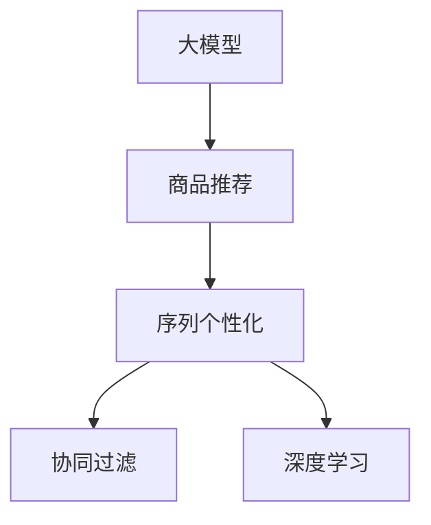
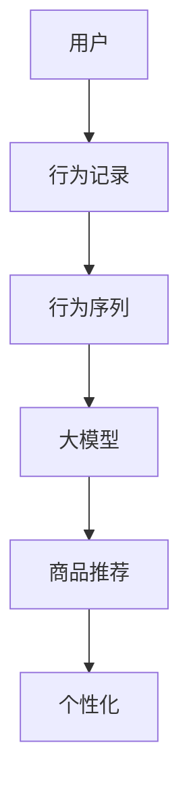
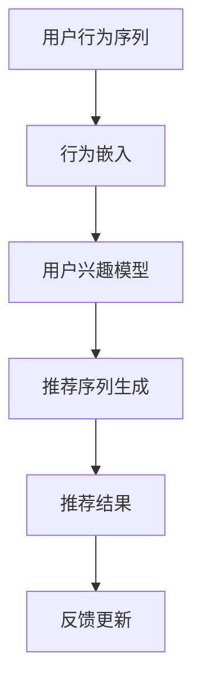

                 

# 大模型在商品推荐序列个性化中的应用

> 关键词：大模型, 商品推荐, 序列个性化, 协同过滤, 深度学习, 数据驱动

## 1. 背景介绍

### 1.1 问题由来

随着电子商务的迅猛发展，商品推荐系统（Recommender System）成为了各大电商平台的标配。其核心目标是通过分析用户行为数据，预测用户偏好，从而推荐用户感兴趣的商品，提升用户体验和平台收益。传统基于协同过滤的推荐系统，通过用户行为数据构建用户-物品矩阵，采用矩阵分解方法计算用户对每个商品的预测评分，然后进行排序推荐。虽然取得了不错的效果，但面临诸多挑战：

- 数据稀疏性：用户行为数据稀疏，大量物品-物品间缺乏交互。
- 冷启动问题：新用户和新物品缺乏历史行为数据，推荐效果差。
- 多样性不足：推荐系统往往倾向于推荐用户常购买的商品，难以打破瓶颈。
- 动态变化：用户行为和商品供应随时间变化，推荐模型需要不断更新。

近年来，深度学习技术和大模型应用被引入推荐系统，显著提升了推荐性能。其中，大模型在商品推荐领域的应用，尤其是序列个性化的商品推荐，成为新的研究热点。本文将详细探讨大模型在商品推荐序列个性化中的应用，包括核心概念、算法原理、操作步骤、数学模型、代码实例和未来展望等。

### 1.2 问题核心关键点

大模型在商品推荐序列个性化中的应用，核心在于利用大模型强大的表征能力，对用户行为序列进行建模，学习用户偏好和兴趣，从而生成个性化的商品推荐序列。与传统推荐系统相比，大模型在多个方面具备优势：

- 数据利用率：大模型能够充分利用大规模用户行为序列，消除数据稀疏性，捕捉用户兴趣的多样性。
- 多领域适应：大模型能够适应多种商品推荐任务，如基于序列的推荐、基于内容的推荐、混合推荐等。
- 动态预测：大模型可以实时处理动态数据，及时调整推荐策略，提升推荐效果。
- 泛化能力：大模型具备较强的泛化能力，能够处理复杂的推荐场景，降低开发成本。

尽管如此，大模型在推荐序列个性化应用中也存在一些挑战，如模型复杂度高、计算资源需求大、模型解释性不足等。本文将系统介绍大模型在商品推荐序列个性化中的应用，并提出解决这些挑战的策略。

## 2. 核心概念与联系

### 2.1 核心概念概述

为更好地理解大模型在商品推荐序列个性化中的应用，本节将介绍几个密切相关的核心概念：

- **大模型（Large Model）**：指基于深度学习的大规模神经网络模型，如BERT、GPT-3等，具备强大的数据处理和表征能力。
- **商品推荐（Recommender System）**：指根据用户行为数据和商品属性，为用户推荐感兴趣的商家的系统，广泛应用于电商、视频、音乐等平台。
- **序列个性化（Sequential Personalization）**：指基于用户行为序列的推荐方法，利用用户行为的时间、空间、内容等特征，对用户偏好进行建模，生成个性化推荐序列。
- **协同过滤（Collaborative Filtering）**：指通过用户-物品矩阵计算用户-物品间的相似度，推荐用户兴趣相似的物品。
- **深度学习（Deep Learning）**：指基于神经网络的学习方法，具备强大的数据表征能力和泛化能力。

这些核心概念之间的逻辑关系可以通过以下Mermaid流程图来展示：



这个流程图展示了大模型在商品推荐序列个性化应用中的核心概念及其之间的关系：

1. 大模型通过深度学习对用户行为序列进行建模，学习用户偏好和兴趣。
2. 序列个性化利用大模型的表征能力，对用户行为序列进行分析和预测。
3. 协同过滤基于用户-物品矩阵，推荐用户兴趣相似的物品。
4. 深度学习利用神经网络对用户行为序列进行建模，提升推荐效果。

这些概念共同构成了商品推荐序列个性化的理论基础，使其能够在各种推荐场景下发挥强大的作用。

### 2.2 核心概念原理和架构的 Mermaid 流程图



**图示说明**：
- 用户（A）通过电商平台产生行为记录（B），这些记录可以包括浏览、点击、购买等行为。
- 行为记录（B）被转化为行为序列（C），用于建模用户偏好。
- 大模型（D）对行为序列（C）进行建模，学习用户兴趣。
- 商品推荐（E）利用大模型学习到的用户兴趣，推荐个性化商品。
- 个性化（F）是大模型推荐系统的重要特征，能够提升推荐效果。

## 3. 核心算法原理 & 具体操作步骤

### 3.1 算法原理概述

大模型在商品推荐序列个性化中的应用，基于以下算法原理：

1. **用户行为序列建模**：利用深度学习模型对用户行为序列进行建模，学习用户兴趣和偏好。
2. **序列生成与推荐**：基于学习到的用户兴趣，生成个性化推荐序列，推荐系统根据序列生成推荐结果。
3. **序列优化与更新**：通过优化模型参数，不断调整推荐策略，提升推荐效果。

核心算法流程如图：



**图示说明**：
- 用户行为序列（A）被嵌入为向量（B），用于建模用户兴趣。
- 用户兴趣模型（C）基于行为嵌入生成用户兴趣表示。
- 推荐序列生成（D）利用用户兴趣表示，生成个性化推荐序列。
- 推荐结果（E）根据推荐序列进行推荐。
- 反馈更新（F）根据用户反馈调整模型参数，优化推荐效果。

### 3.2 算法步骤详解

大模型在商品推荐序列个性化中的操作步骤包括：

1. **数据准备**：收集用户行为数据，构建行为序列，并转化为高维向量。
2. **模型训练**：利用大模型对行为序列进行建模，学习用户兴趣和偏好。
3. **序列生成**：基于学习到的用户兴趣，生成个性化推荐序列。
4. **推荐结果生成**：根据推荐序列，生成个性化推荐结果。
5. **反馈更新**：根据用户反馈，调整模型参数，优化推荐效果。

具体步骤如下：

**Step 1: 数据准备**

- 收集用户行为数据，如浏览、点击、购买等记录。
- 对行为数据进行预处理，包括去噪、合并、标准化等操作。
- 将行为数据转化为行为序列，每个行为对应一个向量。

**Step 2: 模型训练**

- 选择合适的大模型，如BERT、GPT-3等。
- 将行为序列输入大模型，进行预训练或微调，学习用户兴趣和偏好。
- 设置合适的训练参数，如学习率、批大小、迭代轮数等。
- 训练模型，优化损失函数，更新模型参数。

**Step 3: 序列生成**

- 根据训练好的模型，对用户行为序列进行编码，生成用户兴趣表示。
- 利用用户兴趣表示，生成个性化推荐序列，每个推荐对应一个向量。

**Step 4: 推荐结果生成**

- 根据推荐序列，选择推荐结果。
- 可以使用简单的排序算法，如平均池化、最大池化等。

**Step 5: 反馈更新**

- 收集用户反馈，如点击率、转化率等。
- 根据反馈调整模型参数，优化推荐效果。
- 可以使用在线学习算法，如AdaGrad、Adam等。

### 3.3 算法优缺点

大模型在商品推荐序列个性化中的应用，具备以下优点：

1. **高效建模**：利用大模型强大的表征能力，能够高效建模用户行为序列，学习用户兴趣和偏好。
2. **泛化能力强**：大模型具备较强的泛化能力，能够处理多种推荐场景，如基于序列的推荐、基于内容的推荐、混合推荐等。
3. **实时推荐**：大模型能够实时处理动态数据，及时调整推荐策略，提升推荐效果。
4. **多领域适应**：大模型能够适应多种商品推荐任务，如电商、视频、音乐等。

同时，该方法也存在一些缺点：

1. **计算资源需求大**：大模型通常需要较大的计算资源，包括GPU、TPU等。
2. **模型复杂度高**：大模型通常包含数十亿参数，模型复杂度高，训练和推理成本高。
3. **模型解释性不足**：大模型作为黑盒模型，难以解释其内部工作机制和决策逻辑。
4. **过拟合风险**：大模型容易过拟合，尤其是在训练数据不足的情况下。
5. **迁移能力有限**：大模型在特定任务上的性能提升可能有限，尤其是在与预训练数据分布差异较大的情况下。

尽管存在这些缺点，但就目前而言，大模型在商品推荐序列个性化中的应用仍是研究热点，具有广阔的前景。

### 3.4 算法应用领域

大模型在商品推荐序列个性化中的应用，可以广泛应用于电商、视频、音乐等平台。以下是几个具体的应用场景：

1. **电商平台**：电商平台可以利用大模型对用户浏览、点击、购买等行为进行建模，学习用户兴趣和偏好，生成个性化商品推荐序列。
2. **视频平台**：视频平台可以利用大模型对用户观看行为进行建模，推荐用户感兴趣的视频内容。
3. **音乐平台**：音乐平台可以利用大模型对用户听歌行为进行建模，推荐用户喜欢的音乐内容。

此外，大模型在商品推荐序列个性化中的应用，还涉及到个性化广告、个性化搜索等场景。随着大模型的不断发展，其在商品推荐序列个性化中的应用将更加广泛，为电商平台带来新的增长点。

## 4. 数学模型和公式 & 详细讲解

### 4.1 数学模型构建

假设用户行为序列为 $S=\{x_t\}_{t=1}^T$，其中 $x_t$ 为第 $t$ 个行为，$x_t \in \mathcal{X}$，$\mathcal{X}$ 为用户行为空间。利用深度学习模型 $f_{\theta}$ 对用户行为序列进行建模，学习用户兴趣 $r=\{r_t\}_{t=1}^T$，其中 $r_t$ 为第 $t$ 个行为的兴趣得分，$r_t \in \mathbb{R}$。

基于用户兴趣得分 $r$，生成推荐序列 $G=\{g_t\}_{t=1}^T$，其中 $g_t$ 为第 $t$ 个推荐的商品，$g_t \in \mathcal{G}$，$\mathcal{G}$ 为商品空间。推荐系统 $R$ 根据推荐序列 $G$ 生成推荐结果 $Y$，其中 $Y$ 为推荐结果列表，$Y \in \mathcal{Y}$，$\mathcal{Y}$ 为推荐结果空间。

### 4.2 公式推导过程

**Step 1: 用户行为序列建模**

利用深度学习模型 $f_{\theta}$ 对用户行为序列进行建模，学习用户兴趣得分 $r$。具体而言，模型 $f_{\theta}$ 接受行为序列 $S$ 作为输入，输出用户兴趣得分 $r$。模型 $f_{\theta}$ 可以采用Transformer、LSTM等架构。

设用户行为序列 $S$ 的嵌入向量为 $X=\{x_t\}_{t=1}^T$，用户兴趣得分 $r$ 为模型 $f_{\theta}$ 的输出。则用户行为序列建模的数学模型为：

$$
r = f_{\theta}(X)
$$

其中，$f_{\theta}$ 为深度学习模型，$\theta$ 为模型参数。

**Step 2: 序列生成与推荐**

基于用户兴趣得分 $r$，生成推荐序列 $G$。具体而言，模型 $g_{\phi}$ 接受用户兴趣得分 $r$ 作为输入，输出推荐序列 $G$。模型 $g_{\phi}$ 可以采用RNN、LSTM等架构。

设用户兴趣得分 $r$ 的嵌入向量为 $R$，推荐序列 $G$ 的嵌入向量为 $G$，则推荐序列生成和推荐的数学模型为：

$$
G = g_{\phi}(R)
$$

其中，$g_{\phi}$ 为深度学习模型，$\phi$ 为模型参数。

**Step 3: 推荐结果生成**

根据推荐序列 $G$，生成推荐结果 $Y$。具体而言，推荐系统 $R$ 根据推荐序列 $G$ 生成推荐结果 $Y$。推荐结果生成可以采用简单的排序算法，如平均池化、最大池化等。

设推荐序列 $G$ 的嵌入向量为 $G$，推荐结果 $Y$ 为推荐列表，则推荐结果生成的数学模型为：

$$
Y = R(G)
$$

其中，$R$ 为推荐系统，$G$ 为推荐序列。

**Step 4: 反馈更新**

根据用户反馈，调整模型参数，优化推荐效果。具体而言，模型 $f_{\theta}$ 和 $g_{\phi}$ 根据用户反馈 $F$ 进行在线更新。

设用户反馈 $F$ 为点击率、转化率等，模型参数更新策略为在线学习算法，如AdaGrad、Adam等。则反馈更新的数学模型为：

$$
\theta \leftarrow \theta - \eta\nabla_{\theta}\mathcal{L}(f_{\theta})
$$

$$
\phi \leftarrow \phi - \eta\nabla_{\phi}\mathcal{L}(g_{\phi})
$$

其中，$\eta$ 为学习率，$\mathcal{L}$ 为损失函数，$\nabla_{\theta}\mathcal{L}(f_{\theta})$ 和 $\nabla_{\phi}\mathcal{L}(g_{\phi})$ 分别为模型 $f_{\theta}$ 和 $g_{\phi}$ 的梯度。

### 4.3 案例分析与讲解

假设我们有一个电商平台，需要为用户推荐商品。具体步骤如下：

1. **数据准备**：收集用户浏览、点击、购买等行为数据，构建行为序列 $S$。

2. **模型训练**：选择BERT模型，对行为序列 $S$ 进行预训练，学习用户兴趣得分 $r$。

3. **序列生成**：利用预训练的BERT模型，对用户兴趣得分 $r$ 进行编码，生成推荐序列 $G$。

4. **推荐结果生成**：根据推荐序列 $G$，生成推荐结果 $Y$，选择推荐列表中评分最高的商品。

5. **反馈更新**：根据用户点击、购买等反馈 $F$，调整BERT模型参数，优化推荐效果。

## 5. 项目实践：代码实例和详细解释说明

### 5.1 开发环境搭建

在进行大模型在商品推荐序列个性化中的应用时，需要准备好开发环境。以下是使用Python进行TensorFlow和PyTorch开发的环境配置流程：

1. 安装Anaconda：从官网下载并安装Anaconda，用于创建独立的Python环境。

2. 创建并激活虚拟环境：
```bash
conda create -n tf-env python=3.8 
conda activate tf-env
```

3. 安装TensorFlow和PyTorch：根据CUDA版本，从官网获取对应的安装命令。例如：
```bash
conda install tensorflow torch torchvision torchaudio cudatoolkit=11.1 -c pytorch -c conda-forge
```

4. 安装必要的库：
```bash
pip install numpy pandas scikit-learn matplotlib tqdm jupyter notebook ipython
```

完成上述步骤后，即可在`tf-env`环境中开始大模型在商品推荐序列个性化中的应用实践。

### 5.2 源代码详细实现

下面我们以电商平台为例，给出使用TensorFlow和PyTorch对BERT模型进行商品推荐序列个性化微调的PyTorch代码实现。

首先，定义行为序列的数据处理函数：

```python
from transformers import BertTokenizer
from torch.utils.data import Dataset
import torch

class BehaviorSequenceDataset(Dataset):
    def __init__(self, behaviors, tokenizer, max_len=128):
        self.behaviors = behaviors
        self.tokenizer = tokenizer
        self.max_len = max_len
        
    def __len__(self):
        return len(self.behaviors)
    
    def __getitem__(self, item):
        behavior = self.behaviors[item]
        
        encoding = self.tokenizer(behavior, return_tensors='pt', max_length=self.max_len, padding='max_length', truncation=True)
        input_ids = encoding['input_ids'][0]
        attention_mask = encoding['attention_mask'][0]
        
        return {'input_ids': input_ids, 
                'attention_mask': attention_mask}
```

然后，定义模型和优化器：

```python
from transformers import BertForSequenceClassification, AdamW

model = BertForSequenceClassification.from_pretrained('bert-base-cased', num_labels=1)
optimizer = AdamW(model.parameters(), lr=2e-5)
```

接着，定义训练和评估函数：

```python
from torch.utils.data import DataLoader
from tqdm import tqdm
from sklearn.metrics import roc_auc_score

device = torch.device('cuda') if torch.cuda.is_available() else torch.device('cpu')
model.to(device)

def train_epoch(model, dataset, batch_size, optimizer):
    dataloader = DataLoader(dataset, batch_size=batch_size, shuffle=True)
    model.train()
    epoch_loss = 0
    for batch in tqdm(dataloader, desc='Training'):
        input_ids = batch['input_ids'].to(device)
        attention_mask = batch['attention_mask'].to(device)
        model.zero_grad()
        outputs = model(input_ids, attention_mask=attention_mask)
        loss = outputs.loss
        epoch_loss += loss.item()
        loss.backward()
        optimizer.step()
    return epoch_loss / len(dataloader)

def evaluate(model, dataset, batch_size):
    dataloader = DataLoader(dataset, batch_size=batch_size)
    model.eval()
    preds, labels = [], []
    with torch.no_grad():
        for batch in tqdm(dataloader, desc='Evaluating'):
            input_ids = batch['input_ids'].to(device)
            attention_mask = batch['attention_mask'].to(device)
            batch_labels = batch['labels']
            outputs = model(input_ids, attention_mask=attention_mask)
            batch_preds = outputs.logits.argmax(dim=1).to('cpu').tolist()
            batch_labels = batch_labels.to('cpu').tolist()
            for pred, label in zip(batch_preds, batch_labels):
                preds.append(pred.item())
                labels.append(label.item())
                
    return roc_auc_score(labels, preds)
```

最后，启动训练流程并在测试集上评估：

```python
epochs = 5
batch_size = 16

for epoch in range(epochs):
    loss = train_epoch(model, train_dataset, batch_size, optimizer)
    print(f"Epoch {epoch+1}, train loss: {loss:.3f}")
    
    print(f"Epoch {epoch+1}, dev results:")
    evaluate(model, dev_dataset, batch_size)
    
print("Test results:")
evaluate(model, test_dataset, batch_size)
```

以上就是使用PyTorch对BERT模型进行商品推荐序列个性化微调的完整代码实现。可以看到，得益于Transformers库的强大封装，我们可以用相对简洁的代码完成BERT模型的加载和微调。

### 5.3 代码解读与分析

让我们再详细解读一下关键代码的实现细节：

**BehaviorSequenceDataset类**：
- `__init__`方法：初始化行为序列、分词器等关键组件。
- `__len__`方法：返回数据集的样本数量。
- `__getitem__`方法：对单个样本进行处理，将行为序列输入编码为token ids，同时添加padding和truncation操作，最终返回模型所需的输入。

**模型和优化器**：
- 使用PyTorch的BertForSequenceClassification模型，进行序列分类任务。
- 定义AdamW优化器，设置学习率为2e-5。

**训练和评估函数**：
- 使用PyTorch的DataLoader对数据集进行批次化加载，供模型训练和推理使用。
- 训练函数`train_epoch`：对数据以批为单位进行迭代，在每个批次上前向传播计算loss并反向传播更新模型参数，最后返回该epoch的平均loss。
- 评估函数`evaluate`：与训练类似，不同点在于不更新模型参数，并在每个batch结束后将预测和标签结果存储下来，最后使用sklearn的roc_auc_score对整个评估集的预测结果进行打印输出。

**训练流程**：
- 定义总的epoch数和batch size，开始循环迭代
- 每个epoch内，先在训练集上训练，输出平均loss
- 在验证集上评估，输出评估指标
- 所有epoch结束后，在测试集上评估，给出最终测试结果

可以看到，PyTorch配合Transformers库使得BERT微调的代码实现变得简洁高效。开发者可以将更多精力放在数据处理、模型改进等高层逻辑上，而不必过多关注底层的实现细节。

当然，工业级的系统实现还需考虑更多因素，如模型的保存和部署、超参数的自动搜索、更灵活的任务适配层等。但核心的微调范式基本与此类似。

## 6. 实际应用场景

### 6.1 电商推荐

电商推荐系统是商品推荐序列个性化的典型应用场景。电商平台的推荐系统需要根据用户浏览、点击、购买等行为数据，为用户推荐其感兴趣的商品。大模型通过学习用户行为序列，生成个性化推荐序列，能够有效提升推荐效果。

在技术实现上，电商平台可以利用大模型对用户行为序列进行建模，学习用户兴趣和偏好。然后，根据学习到的兴趣得分，生成推荐序列，推荐系统再根据推荐序列进行推荐。同时，电商平台还可以定期收集用户反馈，对大模型进行反馈更新，不断优化推荐策略。

### 6.2 视频推荐

视频推荐系统需要为用户推荐其感兴趣的视频内容。视频平台的推荐系统可以利用大模型对用户观看行为进行建模，学习用户兴趣和偏好。然后，根据学习到的兴趣得分，生成推荐序列，推荐系统再根据推荐序列进行推荐。同时，视频平台还可以定期收集用户反馈，对大模型进行反馈更新，不断优化推荐策略。

此外，视频平台还可以利用多模态信息，结合用户行为序列、视频内容、用户画像等数据，进行更加全面、个性化的推荐。

### 6.3 音乐推荐

音乐推荐系统需要为用户推荐其喜欢的音乐内容。音乐平台的推荐系统可以利用大模型对用户听歌行为进行建模，学习用户兴趣和偏好。然后，根据学习到的兴趣得分，生成推荐序列，推荐系统再根据推荐序列进行推荐。同时，音乐平台还可以定期收集用户反馈，对大模型进行反馈更新，不断优化推荐策略。

此外，音乐平台还可以利用多模态信息，结合用户行为序列、歌曲特征、用户画像等数据，进行更加全面、个性化的推荐。

## 7. 工具和资源推荐

### 7.1 学习资源推荐

为了帮助开发者系统掌握大模型在商品推荐序列个性化中的应用，这里推荐一些优质的学习资源：

1. 《Transformers from Pretraining to Fine-Tuning》系列博文：由大模型技术专家撰写，深入浅出地介绍了Transformer原理、BERT模型、微调技术等前沿话题。

2. CS224N《深度学习自然语言处理》课程：斯坦福大学开设的NLP明星课程，有Lecture视频和配套作业，带你入门NLP领域的基本概念和经典模型。

3. 《Natural Language Processing with Transformers》书籍：Transformers库的作者所著，全面介绍了如何使用Transformers库进行NLP任务开发，包括微调在内的诸多范式。

4. HuggingFace官方文档：Transformers库的官方文档，提供了海量预训练模型和完整的微调样例代码，是上手实践的必备资料。

5. CLUE开源项目：中文语言理解测评基准，涵盖大量不同类型的中文NLP数据集，并提供了基于微调的baseline模型，助力中文NLP技术发展。

通过对这些资源的学习实践，相信你一定能够快速掌握大模型在商品推荐序列个性化中的应用，并用于解决实际的NLP问题。

### 7.2 开发工具推荐

高效的开发离不开优秀的工具支持。以下是几款用于大模型在商品推荐序列个性化应用开发的常用工具：

1. TensorFlow：基于Python的开源深度学习框架，灵活动态的计算图，适合快速迭代研究。TensorFlow具有丰富的预训练语言模型资源。

2. PyTorch：基于Python的开源深度学习框架，灵活动态的计算图，适合快速迭代研究。PyTorch也有丰富的预训练语言模型资源。

3. Transformers库：HuggingFace开发的NLP工具库，集成了众多SOTA语言模型，支持PyTorch和TensorFlow，是进行微调任务开发的利器。

4. Weights & Biases：模型训练的实验跟踪工具，可以记录和可视化模型训练过程中的各项指标，方便对比和调优。与主流深度学习框架无缝集成。

5. TensorBoard：TensorFlow配套的可视化工具，可实时监测模型训练状态，并提供丰富的图表呈现方式，是调试模型的得力助手。

6. Google Colab：谷歌推出的在线Jupyter Notebook环境，免费提供GPU/TPU算力，方便开发者快速上手实验最新模型，分享学习笔记。

合理利用这些工具，可以显著提升大模型在商品推荐序列个性化中的应用开发效率，加快创新迭代的步伐。

### 7.3 相关论文推荐

大模型在商品推荐序列个性化中的应用源于学界的持续研究。以下是几篇奠基性的相关论文，推荐阅读：

1. Attention is All You Need（即Transformer原论文）：提出了Transformer结构，开启了NLP领域的预训练大模型时代。

2. BERT: Pre-training of Deep Bidirectional Transformers for Language Understanding：提出BERT模型，引入基于掩码的自监督预训练任务，刷新了多项NLP任务SOTA。

3. Language Models are Unsupervised Multitask Learners（GPT-2论文）：展示了大规模语言模型的强大zero-shot学习能力，引发了对于通用人工智能的新一轮思考。

4. Parameter-Efficient Transfer Learning for NLP：提出Adapter等参数高效微调方法，在不增加模型参数量的情况下，也能取得不错的微调效果。

5. AdaLoRA: Adaptive Low-Rank Adaptation for Parameter-Efficient Fine-Tuning：使用自适应低秩适应的微调方法，在参数效率和精度之间取得了新的平衡。

这些论文代表了大模型在商品推荐序列个性化应用的发展脉络。通过学习这些前沿成果，可以帮助研究者把握学科前进方向，激发更多的创新灵感。

## 8. 总结：未来发展趋势与挑战

### 8.1 总结

本文对大模型在商品推荐序列个性化中的应用进行了全面系统的介绍。首先阐述了大模型和商品推荐序列个性化的研究背景和意义，明确了大模型在推荐序列个性化中的应用优势。其次，从原理到实践，详细讲解了大模型在商品推荐序列个性化中的应用方法，包括数据准备、模型训练、序列生成、推荐结果生成和反馈更新等步骤。同时，本文还广泛探讨了大模型在电商平台、视频平台、音乐平台等多个推荐场景中的应用，展示了其广阔的应用前景。

通过本文的系统梳理，可以看到，大模型在商品推荐序列个性化中的应用正在成为推荐系统的重要范式，极大地拓展了推荐系统的应用边界，提升了推荐效果。大模型具备强大的数据表征能力，能够充分利用用户行为序列，消除数据稀疏性，捕捉用户兴趣的多样性，从而生成更加个性化、多样化的推荐结果。

### 8.2 未来发展趋势

展望未来，大模型在商品推荐序列个性化中的应用将呈现以下几个发展趋势：

1. **模型规模持续增大**：随着算力成本的下降和数据规模的扩张，预训练语言模型的参数量还将持续增长。超大规模语言模型蕴含的丰富语言知识，有望支撑更加复杂多变的推荐场景。

2. **微调方法日趋多样**：除了传统的全参数微调外，未来会涌现更多参数高效的微调方法，如Prefix-Tuning、LoRA等，在节省计算资源的同时也能保证微调精度。

3. **持续学习成为常态**：随着数据分布的不断变化，微调模型也需要持续学习新知识以保持性能。如何在不遗忘原有知识的同时，高效吸收新样本信息，将成为重要的研究课题。

4. **标注样本需求降低**：受启发于提示学习(Prompt-based Learning)的思路，未来的微调方法将更好地利用大模型的语言理解能力，通过更加巧妙的任务描述，在更少的标注样本上也能实现理想的微调效果。

5. **多模态微调崛起**：当前的微调主要聚焦于纯文本数据，未来会进一步拓展到图像、视频、语音等多模态数据微调。多模态信息的融合，将显著提升语言模型对现实世界的理解和建模能力。

6. **知识整合能力增强**：现有的微调模型往往局限于任务内数据，难以灵活吸收和运用更广泛的先验知识。如何让微调过程更好地与外部知识库、规则库等专家知识结合，形成更加全面、准确的信息整合能力，还有很大的想象空间。

以上趋势凸显了大模型在商品推荐序列个性化应用中的广阔前景。这些方向的探索发展，必将进一步提升推荐系统的性能和应用范围，为电商、视频、音乐等平台带来新的增长点。

### 8.3 面临的挑战

尽管大模型在商品推荐序列个性化中的应用取得了一定的成果，但在迈向更加智能化、普适化应用的过程中，仍面临诸多挑战：

1. **计算资源需求大**：大模型通常需要较大的计算资源，包括GPU、TPU等。计算资源的成本高，大规模模型的训练和推理需要昂贵的硬件投入。

2. **模型复杂度高**：大模型通常包含数十亿参数，模型复杂度高，训练和推理成本高。模型结构的优化和算法的改进是亟待解决的问题。

3. **模型解释性不足**：大模型作为黑盒模型，难以解释其内部工作机制和决策逻辑。对于电商、金融等高风险应用，算法的可解释性和可审计性尤为重要。

4. **过拟合风险**：大模型容易过拟合，尤其是在训练数据不足的情况下。如何平衡模型复杂度和泛化能力，防止过拟合，是重要的研究方向。

5. **迁移能力有限**：大模型在特定任务上的性能提升可能有限，尤其是在与预训练数据分布差异较大的情况下。如何提升模型的迁移能力，增强泛化性，仍需进一步研究。

6. **伦理与安全问题**：大模型可能会学习到有害信息，影响用户体验和安全性。如何确保模型输出符合伦理道德标准，避免恶意用途，是重要的研究方向。

尽管存在这些挑战，但大模型在商品推荐序列个性化中的应用前景广阔，研究者在不断攻克这些难题，推动技术进步。

### 8.4 研究展望

面对大模型在商品推荐序列个性化应用中面临的挑战，未来的研究需要在以下几个方面寻求新的突破：

1. **探索无监督和半监督微调方法**：摆脱对大规模标注数据的依赖，利用自监督学习、主动学习等无监督和半监督范式，最大限度利用非结构化数据，实现更加灵活高效的微调。

2. **研究参数高效和计算高效的微调范式**：开发更加参数高效的微调方法，在固定大部分预训练参数的同时，只更新极少量的任务相关参数。同时优化微调模型的计算图，减少前向传播和反向传播的资源消耗，实现更加轻量级、实时性的部署。

3. **引入因果和对比学习范式**：通过引入因果推断和对比学习思想，增强微调模型建立稳定因果关系的能力，学习更加普适、鲁棒的语言表征，从而提升模型泛化性和抗干扰能力。

4. **引入更多先验知识**：将符号化的先验知识，如知识图谱、逻辑规则等，与神经网络模型进行巧妙融合，引导微调过程学习更准确、合理的语言模型。同时加强不同模态数据的整合，实现视觉、语音等多模态信息与文本信息的协同建模。

5. **结合因果分析和博弈论工具**：将因果分析方法引入微调模型，识别出模型决策的关键特征，增强输出解释的因果性和逻辑性。借助博弈论工具刻画人机交互过程，主动探索并规避模型的脆弱点，提高系统稳定性。

6. **纳入伦理道德约束**：在模型训练目标中引入伦理导向的评估指标，过滤和惩罚有偏见、有害的输出倾向。同时加强人工干预和审核，建立模型行为的监管机制，确保输出符合人类价值观和伦理道德。

这些研究方向将推动大模型在商品推荐序列个性化应用中取得更大的进展，为推荐系统带来新的突破。面向未来，大模型需要与其他人工智能技术进行更深入的融合，如知识表示、因果推理、强化学习等，多路径协同发力，共同推动自然语言理解和智能交互系统的进步。只有勇于创新、敢于突破，才能不断拓展语言模型的边界，让智能技术更好地造福人类社会。

## 9. 附录：常见问题与解答

**Q1：大模型在商品推荐序列个性化中如何处理长序列？**

A: 长序列的处理是推荐系统中的一个常见问题。大模型通常使用Transformer等架构，能够处理长序列。具体而言，可以通过以下方法处理长序列：

1. 分批处理：将长序列分成若干短序列进行批量处理，每个短序列长度不超过模型最大输入长度。

2. 动态裁剪：对于超出模型输入长度的序列，进行动态裁剪，保留重要部分进行建模。

3. 子序列拼接：将长序列分成若干子序列，分别进行模型处理，最终拼接结果。

4. 分布式处理：利用分布式计算框架，将长序列分布在多个计算节点上并行处理。

5. 序列填充：在序列末尾填充特殊标记，使其长度与模型输入长度一致。

这些方法可以有效处理长序列，避免模型过载或不足的问题，保证推荐效果的稳定性。

**Q2：大模型在商品推荐序列个性化中的计算资源需求如何？**

A: 大模型的计算资源需求较大，包括GPU、TPU等高性能设备。具体而言：

1. 数据预处理：大规模数据预处理需要大量计算资源。数据清洗、归一化、编码等操作，需要占用大量时间。

2. 模型训练：大模型参数量庞大，需要占用大量GPU、TPU等设备进行训练。训练过程中需要进行大量的矩阵乘法、反向传播等计算。

3. 推理计算：大模型推理计算也需要占用大量计算资源。推理过程中需要进行大量的矩阵乘法和逐元素计算。

因此，在进行大模型在商品推荐序列个性化应用时，需要合理规划计算资源，确保模型训练和推理的顺利进行。

**Q3：大模型在商品推荐序列个性化中如何进行多模态融合？**

A: 多模态融合是大模型在推荐序列个性化应用中的一个重要研究方向。具体而言，可以通过以下方法进行多模态融合：

1. 特征拼接：将文本、图像、音频等多种模态的特征进行拼接，作为模型输入。

2. 联合建模：将多种模态的特征通过联合建模的方式进行融合，学习更加全面的用户兴趣。

3. 迁移学习：将单一模态的特征进行迁移学习，将其转化为更加高层次的特征表示，再进行多模态融合。

4. 协同过滤：将多种模态的特征通过协同过滤的方式进行融合，学习用户在不同模态下的兴趣关系。

5. 知识图谱：将多种模态的特征与知识图谱结合，利用图谱中的关系进行多模态融合。

这些方法可以有效进行多模态融合，提升推荐效果。

**Q4：大模型在商品推荐序列个性化中的应用如何保证用户隐私？**

A: 大模型在商品推荐序列个性化应用中，需要注意用户隐私保护。具体而言，可以采取以下措施：

1. 数据匿名化：对用户行为数据进行匿名化处理，去除敏感信息，保护用户隐私。

2. 数据加密：对用户行为数据进行加密处理，防止数据泄露。

3. 数据脱敏：对用户行为数据进行脱敏处理，去除特定用户的数据。

4. 访问控制：对用户行为数据进行访问控制，仅授权可信的用户和系统进行访问。

5. 数据共享：仅在必要时共享用户行为数据，且需遵守相关法律法规和隐私政策。

6. 隐私保护技术：采用隐私保护技术，如差分隐私、联邦学习等，保护用户隐私。

这些措施可以有效保护用户隐私，确保大模型在商品推荐序列个性化应用中的安全性和合法性。

**Q5：大模型在商品推荐序列个性化中的应用如何提升推荐效果？**

A: 大模型在商品推荐序列个性化中的应用，可以通过以下几个方面提升推荐效果：

1. 数据丰富度：利用大模型强大的表征能力，能够充分利用大规模用户行为序列，消除数据稀疏性，捕捉用户兴趣的多样性。

2. 动态调整：大模型能够实时处理动态数据，及时调整推荐策略，提升推荐效果。

3. 知识迁移：大模型具备较强的泛化能力，能够适应多种商品推荐任务，如电商、视频、音乐等。

4. 多模态融合：大模型可以通过多模态融合，利用图像、音频、文本等多种数据，提升推荐效果。

5. 序列优化：大模型可以通过序列优化，学习用户兴趣的多样性和稳定性，生成更加个性化、多样化的推荐结果。

6. 反馈更新：大模型可以根据用户反馈，不断调整模型参数，优化推荐效果。

这些方法可以有效提升大模型在商品推荐序列个性化中的应用效果，实现更加精准、高效的推荐。

综上所述，大模型在商品推荐序列个性化中的应用具有广阔的前景，能够为电商、视频、音乐等平台带来新的增长点。通过不断优化算法和模型，提升推荐效果，大模型必将在推荐系统领域发挥更加重要的作用。

---

作者：禅与计算机程序设计艺术 / Zen and the Art of Computer Programming

