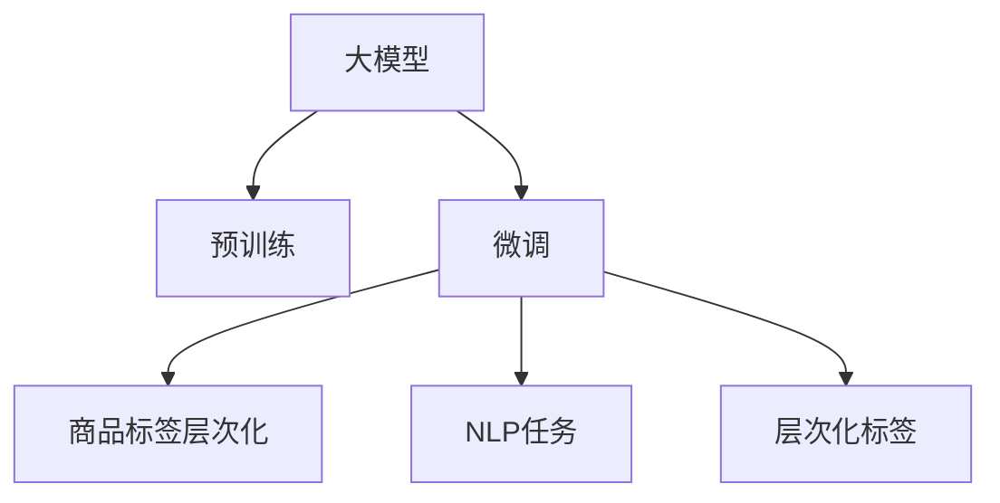

                 

# 大模型在商品标签层次化中的应用

> 关键词：大模型,商品标签,层次化,预训练,微调,深度学习,自然语言处理,NLP

## 1. 背景介绍

### 1.1 问题由来
在电商领域，商品标签体系是商品信息组织和检索的重要基础。通过将商品映射到不同的标签集合中，商家能够方便地组织商品信息，消费者也能够通过关键词搜索或标签过滤快速找到符合需求的商品。但传统的商品标签体系往往结构单一，缺乏层次关系，无法充分表达商品的丰富特征。

近年来，随着自然语言处理（NLP）技术的发展，大模型在商品标签体系中的应用得到了广泛关注。通过在大模型上进行预训练，可以学习到丰富的语言知识，利用这些知识对商品标签进行层次化表示，进一步提升商品信息的组织和检索效率。

### 1.2 问题核心关键点
大模型在商品标签层次化中的应用，主要是通过利用大模型的语言理解能力，对商品描述、评论等自然语言文本进行语义分析，从而对商品进行多维度、多层次的特征标注。该方法的核心在于如何将大模型的预训练知识与具体任务（商品标签层次化）进行有效结合，以及如何处理大规模自然语言数据。

## 2. 核心概念与联系

### 2.1 核心概念概述

为了更好地理解大模型在商品标签层次化中的应用，本节将介绍几个密切相关的核心概念：

- 大模型：以BERT、GPT-3为代表的预训练语言模型。通过在大规模无标签文本数据上进行预训练，学习到丰富的语言知识和语义信息，具备强大的自然语言处理能力。

- 预训练(Pre-training)：指在大规模无标签文本数据上，通过自监督学习任务训练通用语言模型的过程。常见的预训练任务包括掩码语言模型、下一句预测等。

- 微调(Fine-tuning)：指在预训练模型的基础上，使用下游任务的少量标注数据，通过有监督学习优化模型在特定任务上的性能。

- 自然语言处理(NLP)：研究如何让计算机理解和生成自然语言的技术，包括文本分类、语义分析、机器翻译等任务。

- 层次化(Hierarchical)：指将商品标签按照一定的结构组织起来，形成树状、网状等层次关系，使得标签体系更丰富、更易于理解。

这些核心概念之间的逻辑关系可以通过以下Mermaid流程图来展示：



这个流程图展示了大模型的核心概念及其之间的关系：

1. 大模型通过预训练获得基础能力。
2. 微调是对预训练模型进行任务特定的优化，使得模型能够适应具体任务。
3. 层次化商品标签体系能够将商品特征组织起来，形成更丰富的标签结构。
4. 微调后的模型能够更好地处理自然语言数据，为标签层次化任务提供支持。

## 3. 核心算法原理 & 具体操作步骤
### 3.1 算法原理概述

大模型在商品标签层次化中的应用，主要包括以下几个关键步骤：

1. 利用预训练大模型对商品描述、评论等自然语言文本进行语义分析，提取商品的多维度特征。
2. 对提取的特征进行层次化处理，形成结构化的商品标签体系。
3. 利用微调后的模型对商品进行多层次标签的标注。
4. 利用标签层次化信息提升商品信息的检索和推荐效率。

形式化地，假设大模型为 $M_{\theta}$，其中 $\theta$ 为模型参数。给定商品描述 $\textit{desc}_i$，模型输出的商品特征表示为 $f_i$。则层次化商品标签体系可以表示为：

$$
\textit{label}_i = \{L_k(f_i)\}_{k=1}^n
$$

其中 $L_k$ 为第 $k$ 层的标签处理函数，$f_i$ 为模型输出的商品特征向量，$n$ 为标签体系的层次数。

### 3.2 算法步骤详解

大模型在商品标签层次化中的应用主要包括以下几个步骤：

**Step 1: 准备预训练模型和数据集**

1. 选择合适的预训练语言模型，如BERT、GPT等。
2. 准备商品描述和评论数据集，进行清洗、分词等预处理。

**Step 2: 模型特征提取**

1. 使用预训练模型对商品描述和评论进行编码，提取商品的多维度特征。
2. 使用Encoder-Decoder结构或Transformer模型对特征进行向量表示。

**Step 3: 标签层次化处理**

1. 根据商品特征向量，利用层次化标签体系的定义，构建多层次的标签表示。
2. 可以使用层次聚类、特征提取等方法，形成标签体系的层次结构。

**Step 4: 模型微调**

1. 定义模型输出为层次化标签的表示。
2. 选择合适的优化算法，如AdamW，设置学习率、批大小、迭代轮数等超参数。
3. 在标注数据上执行微调，优化模型对层次化标签的预测能力。

**Step 5: 标签生成与检索**

1. 使用微调后的模型对商品进行多层次标签的预测。
2. 将预测结果与商品描述、评论等自然语言数据结合，提升商品信息的检索和推荐效果。

### 3.3 算法优缺点

大模型在商品标签层次化中的应用具有以下优点：

1. 丰富商品信息表达。利用大模型的语言理解能力，可以充分提取商品的多维度特征，形成更加丰富的标签体系。
2. 提高检索效率。层次化的标签体系能够提升商品信息的检索和推荐效率，帮助用户快速找到符合需求的商品。
3. 泛化能力更强。大模型的预训练知识可以提升模型对新数据的适应能力，提高标签层次化的效果。

同时，该方法也存在一定的局限性：

1. 依赖高质量标注数据。微调过程需要高质量的商品标签数据，标注成本较高。
2. 模型资源占用较大。大模型的参数量较大，需要较强的计算资源和存储能力。
3. 模型难以解释。微调后的模型通常缺乏可解释性，难以理解模型的决策过程。

尽管存在这些局限性，但就目前而言，大模型在商品标签层次化中的应用范式仍然是大规模商品信息组织和检索的重要手段。未来相关研究的重点在于如何进一步降低标注数据的需求，提高模型的可解释性，以及探索更多优化方向。

### 3.4 算法应用领域

大模型在商品标签层次化中的应用，已经在电商领域得到了广泛的应用，覆盖了商品推荐、搜索排序、广告投放等多个环节，为电商平台带来了显著的性能提升和经济效益。

- **商品推荐**：利用层次化商品标签体系，对商品进行多维度特征标注，提升推荐系统的精准度和覆盖面。
- **商品搜索排序**：通过层次化标签体系，对商品进行多层次相关性排序，提升用户搜索体验和满意度。
- **广告投放**：根据商品标签层次化信息，进行精准广告定向投放，提升广告点击率和转化率。

除了上述这些经典应用外，大模型在商品标签层次化中的应用还在个性化推荐、用户行为分析、库存管理等更多场景中得到创新性应用，为电商平台的智能化转型提供了新的技术路径。

## 4. 数学模型和公式 & 详细讲解  
### 4.1 数学模型构建

本节将使用数学语言对大模型在商品标签层次化中的应用过程进行更加严格的刻画。

假设商品描述为 $x_i$，其特征表示为 $f_i \in \mathbb{R}^d$，利用大模型 $M_{\theta}$ 提取特征，则有：

$$
f_i = M_{\theta}(x_i)
$$

层次化标签体系可以表示为：

$$
\textit{label}_i = \{L_k(f_i)\}_{k=1}^n
$$

其中 $L_k$ 为第 $k$ 层的标签处理函数，可以是分类、聚类、回归等模型。

### 4.2 公式推导过程

以下我们以层次聚类为例，推导层次化标签体系的定义。

假设 $f_i$ 为商品 $i$ 的特征向量，$L_k(f_i)$ 表示第 $k$ 层的标签表示。层次聚类将 $f_i$ 按照一定的规则，逐步合并成更高级别的标签表示。

具体而言，假设 $L_k(f_i)$ 表示第 $k$ 层的标签表示，$L_{k+1}(f_i)$ 表示第 $k+1$ 层的标签表示。则有：

$$
L_{k+1}(f_i) = \{\textit{cluster}_k(L_k(f_i))\}_{i=1}^{n_k}
$$

其中 $\textit{cluster}_k$ 为第 $k$ 层的聚类函数，可以将 $L_k(f_i)$ 合并成更高级别的标签表示。

根据层次聚类的定义，$L_{k+1}(f_i)$ 的维度小于 $L_k(f_i)$ 的维度，层次化标签体系形成一个树状结构。

### 4.3 案例分析与讲解

以商品推荐系统为例，说明层次化标签体系的应用。

假设商品 $i$ 的特征向量为 $f_i$，层次化标签体系为 $\textit{label}_i = \{L_k(f_i)\}_{k=1}^3$。其中 $L_1$ 表示商品类别，$L_2$ 表示品牌，$L_3$ 表示商品属性。

使用层次聚类方法对 $L_1$ 进行聚类，得到类别 $\{\textit{category}_1, \textit{category}_2, \textit{category}_3\}$。对 $L_2$ 进行聚类，得到品牌 $\{\textit{brand}_1, \textit{brand}_2, \textit{brand}_3\}$。对 $L_3$ 进行聚类，得到属性 $\{\textit{attr}_1, \textit{attr}_2, \textit{attr}_3\}$。

则层次化标签体系为 $\textit{label}_i = \{\textit{category}_1, \textit{category}_2, \textit{category}_3, \textit{brand}_1, \textit{brand}_2, \textit{brand}_3, \textit{attr}_1, \textit{attr}_2, \textit{attr}_3\}$。

使用微调后的模型，对每个层次的标签进行预测，可以得到商品 $i$ 的推荐列表。将推荐结果与用户的浏览历史、点击行为等数据结合，可以提升推荐系统的个性化和精准度。

## 5. 项目实践：代码实例和详细解释说明
### 5.1 开发环境搭建

在进行大模型商品标签层次化应用的实践前，我们需要准备好开发环境。以下是使用Python进行PyTorch开发的环境配置流程：

1. 安装Anaconda：从官网下载并安装Anaconda，用于创建独立的Python环境。

2. 创建并激活虚拟环境：
```bash
conda create -n pytorch-env python=3.8 
conda activate pytorch-env
```

3. 安装PyTorch：根据CUDA版本，从官网获取对应的安装命令。例如：
```bash
conda install pytorch torchvision torchaudio cudatoolkit=11.1 -c pytorch -c conda-forge
```

4. 安装Transformers库：
```bash
pip install transformers
```

5. 安装各类工具包：
```bash
pip install numpy pandas scikit-learn matplotlib tqdm jupyter notebook ipython
```

完成上述步骤后，即可在`pytorch-env`环境中开始大模型商品标签层次化应用的实践。

### 5.2 源代码详细实现

下面我们以层次聚类为例，给出使用PyTorch进行层次化商品标签体系构建的代码实现。

首先，定义层次化商品标签体系的数据处理函数：

```python
import torch
import torch.nn as nn
from transformers import BertTokenizer, BertModel

class HierarchicalLabelingDataset(Dataset):
    def __init__(self, texts, labels, tokenizer, max_len=128):
        self.texts = texts
        self.labels = labels
        self.tokenizer = tokenizer
        self.max_len = max_len
        
    def __len__(self):
        return len(self.texts)
    
    def __getitem__(self, item):
        text = self.texts[item]
        label = self.labels[item]
        
        encoding = self.tokenizer(text, return_tensors='pt', max_length=self.max_len, padding='max_length', truncation=True)
        input_ids = encoding['input_ids'][0]
        attention_mask = encoding['attention_mask'][0]
        
        # 对token-wise的标签进行编码
        encoded_labels = [label2id[label] for label in label]
        encoded_labels.extend([label2id['O']] * (self.max_len - len(encoded_labels)))
        labels = torch.tensor(encoded_labels, dtype=torch.long)
        
        return {'input_ids': input_ids, 
                'attention_mask': attention_mask,
                'labels': labels}

# 标签与id的映射
label2id = {'O': 0, 'category1': 1, 'category2': 2, 'category3': 3, 
            'brand1': 4, 'brand2': 5, 'brand3': 6, 'attr1': 7, 'attr2': 8, 'attr3': 9}
id2label = {v: k for k, v in label2id.items()}

# 创建dataset
tokenizer = BertTokenizer.from_pretrained('bert-base-cased')

train_dataset = HierarchicalLabelingDataset(train_texts, train_labels, tokenizer)
dev_dataset = HierarchicalLabelingDataset(dev_texts, dev_labels, tokenizer)
test_dataset = HierarchicalLabelingDataset(test_texts, test_labels, tokenizer)
```

然后，定义模型和优化器：

```python
from transformers import BertForTokenClassification, AdamW

model = BertForTokenClassification.from_pretrained('bert-base-cased', num_labels=len(label2id))

optimizer = AdamW(model.parameters(), lr=2e-5)
```

接着，定义训练和评估函数：

```python
from torch.utils.data import DataLoader
from tqdm import tqdm
from sklearn.metrics import classification_report

device = torch.device('cuda') if torch.cuda.is_available() else torch.device('cpu')
model.to(device)

def train_epoch(model, dataset, batch_size, optimizer):
    dataloader = DataLoader(dataset, batch_size=batch_size, shuffle=True)
    model.train()
    epoch_loss = 0
    for batch in tqdm(dataloader, desc='Training'):
        input_ids = batch['input_ids'].to(device)
        attention_mask = batch['attention_mask'].to(device)
        labels = batch['labels'].to(device)
        model.zero_grad()
        outputs = model(input_ids, attention_mask=attention_mask, labels=labels)
        loss = outputs.loss
        epoch_loss += loss.item()
        loss.backward()
        optimizer.step()
    return epoch_loss / len(dataloader)

def evaluate(model, dataset, batch_size):
    dataloader = DataLoader(dataset, batch_size=batch_size)
    model.eval()
    preds, labels = [], []
    with torch.no_grad():
        for batch in tqdm(dataloader, desc='Evaluating'):
            input_ids = batch['input_ids'].to(device)
            attention_mask = batch['attention_mask'].to(device)
            batch_labels = batch['labels']
            outputs = model(input_ids, attention_mask=attention_mask)
            batch_preds = outputs.logits.argmax(dim=2).to('cpu').tolist()
            batch_labels = batch_labels.to('cpu').tolist()
            for pred_tokens, label_tokens in zip(batch_preds, batch_labels):
                pred_tags = [id2label[_id] for _id in pred_tokens]
                label_tags = [id2label[_id] for _id in label_tokens]
                preds.append(pred_tags[:len(label_tags)])
                labels.append(label_tags)
                
    print(classification_report(labels, preds))
```

最后，启动训练流程并在测试集上评估：

```python
epochs = 5
batch_size = 16

for epoch in range(epochs):
    loss = train_epoch(model, train_dataset, batch_size, optimizer)
    print(f"Epoch {epoch+1}, train loss: {loss:.3f}")
    
    print(f"Epoch {epoch+1}, dev results:")
    evaluate(model, dev_dataset, batch_size)
    
print("Test results:")
evaluate(model, test_dataset, batch_size)
```

以上就是使用PyTorch对BERT进行层次化商品标签体系构建的完整代码实现。可以看到，得益于Transformers库的强大封装，我们可以用相对简洁的代码完成BERT模型的加载和微调。

### 5.3 代码解读与分析

让我们再详细解读一下关键代码的实现细节：

**HierarchicalLabelingDataset类**：
- `__init__`方法：初始化文本、标签、分词器等关键组件。
- `__len__`方法：返回数据集的样本数量。
- `__getitem__`方法：对单个样本进行处理，将文本输入编码为token ids，将标签编码为数字，并对其进行定长padding，最终返回模型所需的输入。

**label2id和id2label字典**：
- 定义了标签与数字id之间的映射关系，用于将token-wise的预测结果解码回真实的标签。

**训练和评估函数**：
- 使用PyTorch的DataLoader对数据集进行批次化加载，供模型训练和推理使用。
- 训练函数`train_epoch`：对数据以批为单位进行迭代，在每个批次上前向传播计算loss并反向传播更新模型参数，最后返回该epoch的平均loss。
- 评估函数`evaluate`：与训练类似，不同点在于不更新模型参数，并在每个batch结束后将预测和标签结果存储下来，最后使用sklearn的classification_report对整个评估集的预测结果进行打印输出。

**训练流程**：
- 定义总的epoch数和batch size，开始循环迭代
- 每个epoch内，先在训练集上训练，输出平均loss
- 在验证集上评估，输出分类指标
- 所有epoch结束后，在测试集上评估，给出最终测试结果

可以看到，PyTorch配合Transformers库使得BERT层次化商品标签体系的构建代码实现变得简洁高效。开发者可以将更多精力放在数据处理、模型改进等高层逻辑上，而不必过多关注底层的实现细节。

当然，工业级的系统实现还需考虑更多因素，如模型的保存和部署、超参数的自动搜索、更灵活的任务适配层等。但核心的微调范式基本与此类似。

## 6. 实际应用场景
### 6.1 智能客服系统

基于大模型层次化商品标签体系的商品推荐，可以广泛应用于智能客服系统的构建。传统客服往往需要配备大量人力，高峰期响应缓慢，且一致性和专业性难以保证。而使用层次化商品标签体系的推荐模型，可以7x24小时不间断服务，快速响应客户咨询，用推荐结果辅助客户选择商品。

在技术实现上，可以收集客户的历史浏览记录和偏好数据，构建商品标签层次化体系，对商品进行多层次特征标注。在客户询问时，使用微调后的模型对商品进行推荐，客户可以根据推荐结果选择商品。对于新客户，可以通过推荐列表引导客户快速找到合适的商品。

### 6.2 个性化推荐系统

传统的个性化推荐系统往往只依赖用户的历史行为数据进行物品推荐，无法深入理解用户的真实兴趣偏好。基于层次化商品标签体系的大模型推荐系统，可以更好地挖掘用户行为背后的语义信息，从而对用户进行多维度、多层次的特征标注，提供更精准、多样的推荐内容。

在实践中，可以收集用户浏览、点击、评论、分享等行为数据，提取和用户交互的物品标题、描述、标签等文本内容。将文本内容作为模型输入，用户的后续行为（如是否点击、购买等）作为监督信号，在此基础上微调预训练语言模型。微调后的模型能够从文本内容中准确把握用户的兴趣点。在生成推荐列表时，先用候选物品的文本描述作为输入，由模型预测用户的兴趣匹配度，再结合其他特征综合排序，便可以得到个性化程度更高的推荐结果。

### 6.3 未来应用展望

随着大模型和微调方法的不断发展，基于层次化商品标签体系的应用场景也将更加丰富。

在智慧医疗领域，利用层次化商品标签体系，可以对药品、医疗设备等商品进行多层次特征标注，提升医疗服务的智能化水平，辅助医生诊疗，加速新药研发进程。

在智能教育领域，基于层次化商品标签体系，可以对教材、教具等商品进行多维度特征标注，因材施教，促进教育公平，提高教学质量。

在智慧城市治理中，利用层次化商品标签体系，对城市事件、公共服务、应急物资等进行多层次特征标注，提高城市管理的自动化和智能化水平，构建更安全、高效的未来城市。

除了上述这些经典应用外，基于大模型层次化商品标签体系的应用还在更多场景中得到创新性应用，为各行各业带来变革性影响。相信随着技术的日益成熟，层次化商品标签体系必将在构建人机协同的智能系统、推动社会经济发展方面发挥更加重要的作用。

## 7. 工具和资源推荐
### 7.1 学习资源推荐

为了帮助开发者系统掌握大模型在商品标签层次化中的应用理论基础和实践技巧，这里推荐一些优质的学习资源：

1. 《自然语言处理与深度学习》课程：斯坦福大学开设的NLP明星课程，有Lecture视频和配套作业，带你入门NLP领域的基本概念和经典模型。

2. 《深度学习与自然语言处理》书籍：深度学习与自然语言处理领域的经典著作，系统介绍了大模型在NLP任务中的应用。

3. 《大模型在电商中的应用》论文：介绍了大模型在商品推荐、搜索排序等电商任务中的应用，涵盖了层次化商品标签体系的应用实例。

4. CLUE开源项目：中文语言理解测评基准，涵盖大量不同类型的中文NLP数据集，并提供了基于大模型的层次化商品标签体系应用baseline模型，助力中文NLP技术发展。

通过对这些资源的学习实践，相信你一定能够快速掌握大模型在商品标签层次化中的应用精髓，并用于解决实际的NLP问题。
###  7.2 开发工具推荐

高效的开发离不开优秀的工具支持。以下是几款用于大模型层次化商品标签体系开发的常用工具：

1. PyTorch：基于Python的开源深度学习框架，灵活动态的计算图，适合快速迭代研究。大部分预训练语言模型都有PyTorch版本的实现。

2. TensorFlow：由Google主导开发的开源深度学习框架，生产部署方便，适合大规模工程应用。同样有丰富的预训练语言模型资源。

3. Transformers库：HuggingFace开发的NLP工具库，集成了众多SOTA语言模型，支持PyTorch和TensorFlow，是进行层次化商品标签体系构建的利器。

4. Weights & Biases：模型训练的实验跟踪工具，可以记录和可视化模型训练过程中的各项指标，方便对比和调优。与主流深度学习框架无缝集成。

5. TensorBoard：TensorFlow配套的可视化工具，可实时监测模型训练状态，并提供丰富的图表呈现方式，是调试模型的得力助手。

6. Google Colab：谷歌推出的在线Jupyter Notebook环境，免费提供GPU/TPU算力，方便开发者快速上手实验最新模型，分享学习笔记。

合理利用这些工具，可以显著提升大模型层次化商品标签体系应用的开发效率，加快创新迭代的步伐。

### 7.3 相关论文推荐

大模型层次化商品标签体系的应用源于学界的持续研究。以下是几篇奠基性的相关论文，推荐阅读：

1. Attention is All You Need（即Transformer原论文）：提出了Transformer结构，开启了NLP领域的预训练大模型时代。

2. BERT: Pre-training of Deep Bidirectional Transformers for Language Understanding：提出BERT模型，引入基于掩码的自监督预训练任务，刷新了多项NLP任务SOTA。

3. 层次聚类在自然语言处理中的应用：研究了层次聚类在自然语言处理中的应用，包括文本分类、情感分析、实体识别等任务。

4. 大模型在电商推荐系统中的应用：研究了大模型在电商推荐系统中的应用，包括商品推荐、广告投放等任务。

5. 层次化商品标签体系在智慧医疗中的应用：研究了层次化商品标签体系在智慧医疗领域的应用，包括药品推荐、医疗设备推荐等任务。

这些论文代表了大模型层次化商品标签体系的应用发展脉络。通过学习这些前沿成果，可以帮助研究者把握学科前进方向，激发更多的创新灵感。

## 8. 总结：未来发展趋势与挑战

### 8.1 总结

本文对大模型在商品标签层次化中的应用进行了全面系统的介绍。首先阐述了大模型和层次化商品标签体系的研究背景和意义，明确了层次化商品标签体系在商品信息组织和检索中的重要性。其次，从原理到实践，详细讲解了大模型层次化商品标签体系的应用过程，给出了层次化商品标签体系构建的完整代码实例。同时，本文还广泛探讨了大模型在商品标签层次化应用中的未来发展趋势，展示了其广阔的应用前景。

通过本文的系统梳理，可以看到，大模型层次化商品标签体系的应用范式已经成为商品信息组织和检索的重要手段，极大地提升了电商平台的智能化水平和用户体验。未来，伴随大模型的不断发展和优化，层次化商品标签体系将迎来更多创新性应用，为电商平台的智能化转型提供新的技术路径。

### 8.2 未来发展趋势

展望未来，大模型层次化商品标签体系的应用将呈现以下几个发展趋势：

1. 模型规模持续增大。随着算力成本的下降和数据规模的扩张，预训练语言模型的参数量还将持续增长。超大规模语言模型蕴含的丰富语言知识，有望支撑更加复杂多变的商品标签层次化任务。

2. 层次化更加精细化。未来将探索更多的层次化处理方法，如层次聚类、图结构表示等，使得标签体系更加精细化，更能够表达商品的丰富特征。

3. 跨模态融合。大模型层次化商品标签体系将融合视觉、语音、文字等多模态信息，实现跨模态融合的商品信息表示，提升商品信息的丰富性和多样性。

4. 个性化推荐优化。基于层次化商品标签体系的商品推荐系统，将更好地挖掘用户的兴趣点，提供更加个性化的推荐服务。

5. 实时推荐系统。未来的商品推荐系统将实现实时推荐，通过层次化商品标签体系实时更新推荐结果，提升用户购物体验。

6. 跨领域应用推广。层次化商品标签体系的应用将不仅仅局限于电商领域，还将推广到智慧医疗、智能教育、智慧城市等更多领域，为各行业的智能化转型提供新的技术路径。

以上趋势凸显了大模型层次化商品标签体系应用的广阔前景。这些方向的探索发展，必将进一步提升商品信息的检索和推荐效率，促进各行业的智能化转型。

### 8.3 面临的挑战

尽管大模型层次化商品标签体系的应用已经取得了显著成效，但在迈向更加智能化、普适化应用的过程中，它仍面临诸多挑战：

1. 标注成本瓶颈。层次化商品标签体系的构建需要高质量的商品标签数据，标注成本较高。如何进一步降低标注数据的需求，将是一大难题。

2. 模型资源占用较大。大模型的参数量较大，需要较强的计算资源和存储能力。如何优化模型结构和压缩存储空间，提升系统效率，还需要更多研究和实践。

3. 模型难以解释。微调后的模型通常缺乏可解释性，难以理解模型的决策过程。如何赋予层次化商品标签体系更加可解释性和可控性，是未来需要解决的重要问题。

4. 多模态数据融合。层次化商品标签体系的应用往往涉及多模态数据的融合，如视觉、语音、文字等。如何有效融合这些数据，形成一致的商品表示，仍需进一步探索。

5. 实时推荐系统挑战。实时推荐系统需要高效计算和实时更新推荐结果，如何优化算法和硬件配置，提升系统响应速度，是未来需要解决的重要问题。

6. 跨领域应用推广。层次化商品标签体系的应用将推广到更多领域，如智慧医疗、智能教育、智慧城市等。如何在不同领域中推广应用，解决具体领域的挑战，还需要进一步探索和实践。

### 8.4 研究展望

面对层次化商品标签体系应用所面临的挑战，未来的研究需要在以下几个方面寻求新的突破：

1. 探索无监督和半监督学习范式。摆脱对大规模标注数据的依赖，利用自监督学习、主动学习等无监督和半监督范式，最大限度利用非结构化数据，实现更加灵活高效的层次化商品标签体系构建。

2. 研究参数高效和计算高效的微调方法。开发更加参数高效的微调方法，在固定大部分预训练参数的同时，只更新极少量的任务相关参数。同时优化微调模型的计算图，减少前向传播和反向传播的资源消耗，实现更加轻量级、实时性的部署。

3. 引入更多先验知识。将符号化的先验知识，如知识图谱、逻辑规则等，与神经网络模型进行巧妙融合，引导层次化商品标签体系构建过程学习更准确、合理的商品表示。同时加强不同模态数据的整合，实现视觉、语音等多模态信息与文本信息的协同建模。

4. 结合因果分析和博弈论工具。将因果分析方法引入层次化商品标签体系构建，识别出模型决策的关键特征，增强推荐结果的因果性和逻辑性。借助博弈论工具刻画人机交互过程，主动探索并规避模型的脆弱点，提高系统稳定性。

5. 纳入伦理道德约束。在层次化商品标签体系构建目标中引入伦理导向的评估指标，过滤和惩罚有偏见、有害的输出倾向。同时加强人工干预和审核，建立模型行为的监管机制，确保输出符合人类价值观和伦理道德。

这些研究方向的探索，必将引领大模型层次化商品标签体系的应用走向更高的台阶，为电商平台的智能化转型、各行业的智能化转型提供新的技术路径。

## 9. 附录：常见问题与解答

**Q1：层次化商品标签体系如何构建？**

A: 层次化商品标签体系的构建，需要经历以下步骤：

1. 收集商品数据：收集商品描述、评论等自然语言文本数据。
2. 数据预处理：对数据进行清洗、分词、去停用词等预处理操作。
3. 特征提取：使用预训练大模型，对商品文本进行编码，提取商品的多维度特征。
4. 标签定义：根据商品特征，定义层次化的标签体系。
5. 层次化处理：对商品特征向量进行层次化处理，形成多层次的标签表示。
6. 模型微调：利用微调后的模型，对层次化标签进行预测和标注。

**Q2：层次化商品标签体系在实际应用中如何优化？**

A: 层次化商品标签体系在实际应用中，可以通过以下方法进行优化：

1. 数据增强：通过回译、近义替换等方式扩充训练集。
2. 正则化：使用L2正则、Dropout、Early Stopping等避免过拟合。
3. 对抗训练：引入对抗样本，提高模型鲁棒性。
4. 参数高效微调：只调整少量参数(如Adapter、Prefix等)，减小过拟合风险。
5. 多模型集成：训练多个层次化标签模型，取平均输出，抑制过拟合。

**Q3：层次化商品标签体系在电商推荐系统中如何应用？**

A: 层次化商品标签体系在电商推荐系统中，可以通过以下方法应用：

1. 商品特征提取：使用预训练大模型，对商品描述、评论等自然语言文本进行编码，提取商品的多维度特征。
2. 层次化标签体系定义：根据商品特征，定义层次化的标签体系。
3. 层次化处理：对商品特征向量进行层次化处理，形成多层次的标签表示。
4. 模型微调：利用微调后的模型，对层次化标签进行预测和标注。
5. 推荐生成：使用层次化商品标签体系，对商品进行多维度、多层次的特征标注，提升推荐系统的精准度和覆盖面。

**Q4：层次化商品标签体系在推荐系统中的应用前景如何？**

A: 层次化商品标签体系在推荐系统中的应用前景广阔：

1. 提高推荐效率：层次化的标签体系能够提升商品信息的检索和推荐效率，帮助用户快速找到符合需求的商品。
2. 提升推荐精准度：层次化标签体系能够捕捉商品的丰富特征，提升推荐系统的精准度。
3. 降低推荐成本：层次化标签体系可以自动化生成商品标签，降低推荐系统的人力成本。
4. 增强推荐个性化：层次化标签体系能够对用户行为进行多维度、多层次的特征标注，提供更加个性化的推荐服务。

**Q5：层次化商品标签体系在跨模态融合中的应用如何？**

A: 层次化商品标签体系在跨模态融合中的应用，可以通过以下方法实现：

1. 数据融合：将视觉、语音、文字等多模态数据进行融合，形成一致的商品表示。
2. 特征提取：使用预训练大模型，对多模态数据进行编码，提取多模态特征。
3. 层次化处理：对多模态特征进行层次化处理，形成多层次的标签表示。
4. 模型微调：利用微调后的模型，对层次化标签进行预测和标注。
5. 推荐生成：使用层次化商品标签体系，对多模态数据进行多维度、多层次的特征标注，提升推荐系统的精准度和覆盖面。

---

作者：禅与计算机程序设计艺术 / Zen and the Art of Computer Programming

