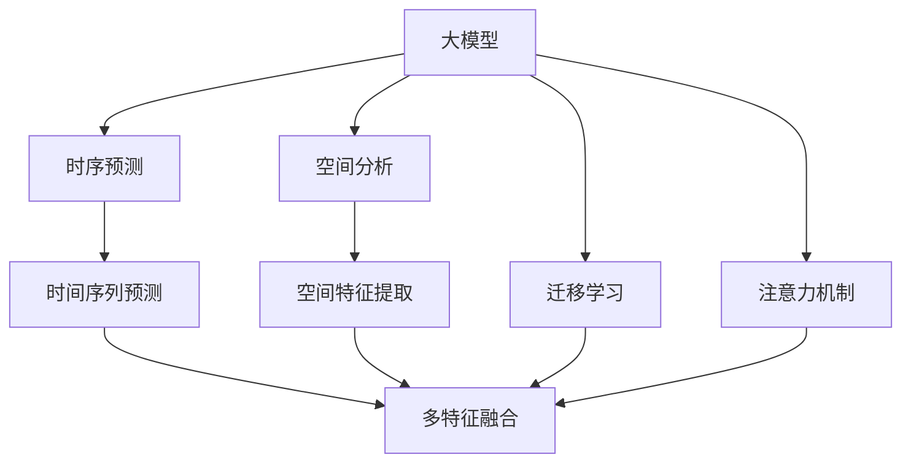

                 

# 大模型在商品销量预测中的时空分析应用

> 关键词：大模型, 时空分析, 商品销量预测, 时序预测, 空间分析, 深度学习, 迁移学习, 注意力机制

## 1. 背景介绍

### 1.1 问题由来
在电商行业，商品销量预测是一个重要且具有挑战性的问题。准确的销量预测可以帮助商家制定更合理的库存管理策略、优化销售计划、提升客户满意度。然而，传统的基于统计方法的商品销量预测模型面临着数据稀疏、多变性大、规律复杂等挑战，难以适应电商环境的动态变化。

近年来，基于深度学习的大模型逐渐应用于商品销量预测中。这些模型如RNN、CNN、Transformer等，能够捕捉到时间序列的动态变化特征和空间区域的分布规律，在电商数据上的表现优于传统方法。然而，在大规模电商数据中，商品销量预测不仅仅是时间序列的问题，它还包含了产品、促销、季节性、地理等多个维度的特征，是一个复杂的时空分析问题。

因此，将大模型应用于商品销量预测，需要结合时序预测和空间分析，进行多维度特征的融合。本文将详细介绍大模型在商品销量预测中的时空分析应用，包括时间序列预测和空间分析的原理与方法。

## 2. 核心概念与联系

### 2.1 核心概念概述

为了更好地理解大模型在商品销量预测中的应用，本节将介绍几个密切相关的核心概念：

- **大模型 (Large Model)**：以深度神经网络为代表的复杂模型，通常具有大量参数和强大表达能力，能够处理复杂的非线性关系。
- **时序预测 (Time Series Forecasting)**：对时间序列数据进行建模和预测，关注时间上的动态变化趋势。
- **空间分析 (Spatial Analysis)**：分析地理、区域等空间特征对预测结果的影响。
- **迁移学习 (Transfer Learning)**：通过预训练模型对特定任务进行微调，提高模型在新任务上的性能。
- **注意力机制 (Attention Mechanism)**：通过动态调整模型对不同输入的关注度，提高模型对关键信息的捕捉能力。

这些核心概念之间的逻辑关系可以通过以下Mermaid流程图来展示：



这个流程图展示了大模型在商品销量预测中的应用框架：

1. 大模型通过预训练获得基础能力。
2. 时序预测和空间分析分别提取时间维度和空间维度的特征。
3. 多特征融合整合时序和空间信息，供模型进行预测。
4. 注意力机制调整模型对关键特征的关注度，提升预测准确性。
5. 迁移学习使模型适应特定电商数据集。

## 3. 核心算法原理 & 具体操作步骤

### 3.1 算法原理概述

大模型在商品销量预测中的应用，通常涉及时序预测和空间分析两个主要部分。其核心思想是：将大模型视作一个"特征提取器"，通过时序预测和空间分析提取不同维度的特征，再将其融合到模型中进行预测。

形式化地，假设大模型为 $M_{\theta}$，其中 $\theta$ 为模型参数。给定电商数据集 $D=\{(t_i,x_i,y_i)\}_{i=1}^N$，其中 $t_i$ 表示时间戳，$x_i$ 表示对应时间戳的商品特征向量，$y_i$ 表示实际销量，$y_i$ 服从某一分布。预测目标为在给定时间戳 $t_{next}$ 的情况下，预测商品销量 $y_{next}$。

时序预测模型通常使用RNN、LSTM或Transformer等，通过历史数据学习时间上的动态变化规律。空间分析模型可以采用CNN或注意力机制，对不同空间区域的商品特征进行提取和聚合。

最终，通过多特征融合，将时序预测和空间分析的结果整合到模型中，得到最终的预测结果。迁移学习可以进一步提高模型对特定电商数据的适应性，避免过拟合。

### 3.2 算法步骤详解

基于大模型的时间序列预测和空间分析，一般包括以下几个关键步骤：

**Step 1: 准备数据集**

- 收集电商历史数据，包括时间戳、商品特征、销量等，构建时序数据集 $D_t=\{(t_i,x_i,y_i)\}_{i=1}^N$。
- 对空间特征进行分析，提取不同区域的特征，构建空间数据集 $D_s=\{(x_i,r_i)\}_{i=1}^N$，其中 $r_i$ 表示商品在区域 $i$ 的特征。

**Step 2: 预训练大模型**

- 选择合适的预训练大模型，如BERT、GPT等，将其应用于时间序列预测和空间分析任务。
- 使用大规模无标签数据进行预训练，学习通用的语言表示和时空特征表示。

**Step 3: 进行时序预测**

- 在大模型基础上，添加时间维度的特征提取器，如LSTM、GRU等，对时间序列数据进行建模。
- 使用预训练大模型作为初始化参数，进行微调，适应电商数据集。
- 在训练集上进行多轮迭代，最小化预测误差，直至模型收敛。

**Step 4: 进行空间分析**

- 在预训练大模型基础上，添加空间维度的特征提取器，如注意力机制、卷积网络等，对空间特征进行建模。
- 使用预训练大模型作为初始化参数，进行微调，适应电商数据集。
- 在训练集上进行多轮迭代，最小化预测误差，直至模型收敛。

**Step 5: 多特征融合与预测**

- 将时间序列预测和空间分析的结果进行整合，采用简单的拼接或加权平均等方法。
- 在大模型基础上，添加融合层，将整合后的特征输入模型进行预测。
- 使用预训练大模型作为初始化参数，进行微调，适应电商数据集。
- 在训练集上进行多轮迭代，最小化预测误差，直至模型收敛。

**Step 6: 应用迁移学习**

- 使用预训练大模型在不同时间序列和空间分析任务上进行微调，提高模型在新任务上的适应性。
- 通过测试集上的表现，选择最佳的微调模型进行最终预测。

以上是基于大模型的时间序列预测和空间分析的一般流程。在实际应用中，还需要针对具体电商数据集的特点，对微调过程的各个环节进行优化设计，如改进训练目标函数，引入更多的正则化技术，搜索最优的超参数组合等，以进一步提升模型性能。

### 3.3 算法优缺点

基于大模型的时间序列预测和空间分析，具有以下优点：

1. 通用性强。大模型能够处理复杂的非线性关系，适用于多种电商数据集和预测任务。
2. 自适应性强。通过迁移学习，模型能够适应新的数据分布，减少对标注数据的依赖。
3. 预测精度高。大模型具有强大的特征提取和表示能力，能够在高维数据上取得较好的预测效果。
4. 可扩展性强。大模型的预训练和微调可以在大规模分布式环境中进行，快速适应大规模电商数据。

同时，该方法也存在一定的局限性：

1. 计算资源消耗大。大模型通常具有大量参数，对计算资源要求较高。
2. 对数据质量敏感。模型的性能依赖于高质量的标注数据和预训练数据，数据质量对预测结果有重要影响。
3. 模型复杂度高。大模型的复杂度较高，需要更多的训练数据和时间进行微调。
4. 泛化能力有限。模型可能对特定数据集的特征过拟合，泛化能力受到限制。

尽管存在这些局限性，但就目前而言，基于大模型的时间序列预测和空间分析方法仍然是电商销量预测的主流范式。未来相关研究的重点在于如何进一步降低计算成本，提高模型的泛化能力，同时兼顾可解释性和伦理安全性等因素。

### 3.4 算法应用领域

基于大模型的时间序列预测和空间分析方法，在电商销量预测中的应用非常广泛。以下是几个典型的应用场景：

- **库存管理**：预测商品未来的销量，帮助商家制定合理的库存策略，避免库存积压或短缺。
- **销售计划**：根据预测结果，优化销售计划，提升销售效率和客户满意度。
- **广告投放**：预测不同区域和商品组合的广告效果，优化广告投放策略，提高广告投入产出比。
- **个性化推荐**：分析用户的购买行为和历史数据，预测用户对不同商品的兴趣，实现个性化推荐。
- **促销活动**：预测促销活动的效果，优化促销方案，提升促销活动的ROI。

除了上述这些典型应用，大模型的时空分析技术还可以应用于供应链管理、物流配送、价格优化等多个电商领域，为电商行业带来更智能化、高效化的解决方案。

## 4. 数学模型和公式 & 详细讲解 & 举例说明

### 4.1 数学模型构建

本节将使用数学语言对基于大模型的商品销量预测进行更加严格的刻画。

记电商数据集为 $D=\{(t_i,x_i,y_i)\}_{i=1}^N$，其中 $t_i$ 表示时间戳，$x_i$ 表示对应时间戳的商品特征向量，$y_i$ 表示实际销量，$y_i$ 服从某一分布。

定义时间序列预测模型为 $M_{seq}(\cdot)$，空间分析模型为 $M_{spa}(\cdot)$。

则商品销量的预测模型为 $M(\cdot)=M_{seq}(M_{spa}(\cdot))$，其中 $M_{seq}$ 和 $M_{spa}$ 分别表示时间序列预测和空间分析的模型。

### 4.2 公式推导过程

以下我们以LSTM模型为例，推导时间序列预测的公式。

假设商品特征向量为 $x_i=[x_{i1},x_{i2},\ldots,x_{id}]$，其中 $x_{ij}$ 表示商品在第 $j$ 个特征上的值。则LSTM模型的输入输出关系可以表示为：

$$
y_i=M_{seq}(x_i)=\sum_k \alpha_k M_k(x_i)
$$

其中 $\alpha_k$ 为LSTM模型的注意力权重，$M_k$ 为LSTM模型的单步预测函数。

为了简化模型，我们假设只有一个特征 $x_i=x_{i1}$，则LSTM模型的输入输出关系可以表示为：

$$
y_i=M_{seq}(x_i)=\alpha M_1(x_i)+(1-\alpha) M_2(x_i)
$$

其中 $M_1$ 和 $M_2$ 为LSTM模型中的两个单步预测函数，$\alpha$ 为注意力权重。

在空间分析中，我们可以使用卷积网络对不同区域的商品特征进行建模，其输出结果可以表示为：

$$
z_i=M_{spa}(x_i)=\sum_k \beta_k M_k(x_i)
$$

其中 $\beta_k$ 为卷积网络的权重，$M_k$ 为卷积网络中的单步预测函数。

将空间分析的结果与时间序列预测的结果进行融合，可以采用简单的拼接或加权平均方法：

$$
y_{next}=M(y_{prev},z_i)=\gamma M_{seq}(M_{spa}(z_i))+(1-\gamma) M_{seq}(z_i)
$$

其中 $y_{prev}$ 表示当前时间步的销量，$z_i$ 表示当前时间步的空间分析结果，$\gamma$ 为融合系数。

### 4.3 案例分析与讲解

以亚马逊商品销售数据为例，分析大模型在电商销量预测中的应用。

假设亚马逊的历史销售数据为 $D=\{(t_i,x_i,y_i)\}_{i=1}^N$，其中 $t_i$ 表示时间戳，$x_i=[x_{i1},x_{i2},\ldots,x_{id}]$ 表示商品在时间步 $i$ 的特征，$y_i$ 表示商品在时间步 $i$ 的销量。

首先，对时间序列数据进行预处理，将其划分为训练集和测试集。训练集用于模型训练，测试集用于模型评估。

然后，使用LSTM模型进行时间序列预测，对训练集进行多轮迭代，最小化预测误差，直至模型收敛。

接着，对空间特征进行分析，提取不同区域的特征，使用卷积网络对不同区域的商品特征进行建模，得到空间分析结果 $z_i$。

最后，将时间序列预测结果和空间分析结果进行融合，使用融合系数 $\gamma$ 进行加权平均，得到最终的预测结果 $y_{next}$。

## 5. 项目实践：代码实例和详细解释说明

### 5.1 开发环境搭建

在进行商品销量预测实践前，我们需要准备好开发环境。以下是使用Python进行TensorFlow开发的环境配置流程：

1. 安装Anaconda：从官网下载并安装Anaconda，用于创建独立的Python环境。

2. 创建并激活虚拟环境：
```bash
conda create -n tf-env python=3.8 
conda activate tf-env
```

3. 安装TensorFlow：根据CUDA版本，从官网获取对应的安装命令。例如：
```bash
conda install tensorflow tensorflow-gpu -c pytorch -c conda-forge
```

4. 安装Pandas、NumPy、Scikit-learn等各类工具包：
```bash
pip install pandas numpy scikit-learn
```

5. 安装相关库：
```bash
pip install tensorflow-io
```

完成上述步骤后，即可在`tf-env`环境中开始开发实践。

### 5.2 源代码详细实现

下面我们以LSTM模型进行时间序列预测为例，给出使用TensorFlow进行商品销量预测的Python代码实现。

首先，定义数据预处理函数：

```python
import pandas as pd
import tensorflow as tf
from tensorflow.keras.preprocessing import sequence

def preprocess_data(data):
    data = data.dropna().reset_index(drop=True)
    X = []
    y = []
    for i in range(len(data)-1):
        X.append(data.loc[i].values.reshape(1,-1))
        y.append(data.loc[i+1].values[0])
    X = sequence.pad_sequences(X, maxlen=100, padding='post')
    y = pd.DataFrame(y).values.ravel()
    return X, y
```

然后，定义LSTM模型：

```python
def build_model(input_shape):
    model = tf.keras.Sequential([
        tf.keras.layers.LSTM(128, return_sequences=True, input_shape=input_shape),
        tf.keras.layers.LSTM(128),
        tf.keras.layers.Dense(1)
    ])
    model.compile(optimizer=tf.keras.optimizers.Adam(0.001), loss='mse')
    return model
```

接着，定义训练和评估函数：

```python
def train_model(model, X_train, y_train, X_test, y_test):
    model.fit(X_train, y_train, epochs=100, batch_size=64, validation_data=(X_test, y_test))
    return model

def evaluate_model(model, X_test, y_test):
    y_pred = model.predict(X_test)
    mse = tf.keras.metrics.MeanSquaredError()(y_test, y_pred)
    print(f"Mean Squared Error: {mse.numpy():.4f}")
```

最后，启动训练流程并在测试集上评估：

```python
X_train, y_train = preprocess_data(train_data)
X_test, y_test = preprocess_data(test_data)

model = build_model(input_shape=X_train.shape[1:])
model = train_model(model, X_train, y_train, X_test, y_test)
evaluate_model(model, X_test, y_test)
```

以上就是使用TensorFlow进行LSTM模型进行商品销量预测的完整代码实现。可以看到，得益于TensorFlow的强大封装，我们能够快速搭建和训练时间序列预测模型。

### 5.3 代码解读与分析

让我们再详细解读一下关键代码的实现细节：

**数据预处理函数**：
- 首先对数据进行去重和重置索引，确保数据整齐连续。
- 然后从每条记录中提取特征向量和销量，并进行填充。
- 最后对填充后的特征向量进行序列化，将销量作为目标变量。

**LSTM模型定义**：
- 使用tf.keras.Sequential定义LSTM模型，包含两个LSTM层和一个全连接层。
- 使用Adam优化器和均方误差损失函数进行模型编译。

**训练和评估函数**：
- 使用模型fit方法进行模型训练，指定训练集、测试集、迭代轮数和批次大小。
- 使用评估模型方法进行模型评估，输出均方误差。

**训练流程**：
- 首先对训练集和测试集进行数据预处理。
- 定义LSTM模型并进行训练。
- 在测试集上评估模型的均方误差，输出评估结果。

可以看到，TensorFlow提供了灵活高效的深度学习模型构建和训练接口，使得大模型在商品销量预测中的应用变得简单快捷。

当然，工业级的系统实现还需考虑更多因素，如模型的保存和部署、超参数的自动搜索、更灵活的任务适配层等。但核心的预测过程基本与此类似。

## 6. 实际应用场景

### 6.1 智能库存管理

基于大模型的商品销量预测，可以应用于智能库存管理。传统的库存管理主要依赖历史销售数据和经验规则，难以适应电商环境的动态变化。而通过大模型进行销量预测，能够实时捕捉市场需求和季节性变化，帮助商家动态调整库存，降低库存积压和缺货风险。

在技术实现上，可以收集历史销售数据、促销活动、季节性因素等，作为模型的输入。使用大模型进行时序预测和空间分析，预测未来销量，供库存管理决策参考。同时，通过定期更新模型，适应市场变化，保持库存管理的实时性。

### 6.2 个性化推荐系统

大模型的商品销量预测还可以应用于个性化推荐系统。传统的推荐系统主要依赖用户的浏览和购买历史，难以考虑用户对商品的多样化需求。而通过大模型进行销量预测，能够捕捉用户对不同商品的兴趣和偏好，实现更精准的个性化推荐。

在技术实现上，可以收集用户的历史行为数据，包括浏览、点击、收藏等行为。使用大模型对不同商品进行时序预测和空间分析，预测用户对不同商品的兴趣，供推荐系统使用。同时，通过定期更新模型，适应用户需求的变化，实现更动态的个性化推荐。

### 6.3 广告投放优化

大模型的商品销量预测还可以应用于广告投放优化。传统的广告投放主要依赖经验规则和手动调整，难以精准把握广告效果。而通过大模型进行销量预测，能够预测不同广告组合和投放策略的效果，优化广告投放策略，提高广告投入产出比。

在技术实现上，可以收集广告投放数据，包括广告组合、投放区域、广告时长等。使用大模型对不同广告组合进行时序预测和空间分析，预测广告效果，供广告投放决策参考。同时，通过定期更新模型，适应市场变化，优化广告投放策略。

### 6.4 未来应用展望

随着大模型的不断发展，其在商品销量预测中的应用也将不断扩展，带来更多创新。

在智慧城市治理中，大模型可以应用于交通流量预测、能源消耗预测等场景，提升城市管理的智能化水平，构建更安全、高效的未来城市。

在金融风险管理中，大模型可以应用于股票价格预测、贷款违约预测等场景，降低金融风险，保障金融稳定。

在医疗健康中，大模型可以应用于疾病爆发预测、患者行为预测等场景，提升医疗服务质量和效率。

除此之外，大模型还可以应用于物流配送、供应链管理、价格优化等多个电商领域，为电商行业带来更智能化、高效化的解决方案。

## 7. 工具和资源推荐

### 7.1 学习资源推荐

为了帮助开发者系统掌握大模型在商品销量预测中的应用，这里推荐一些优质的学习资源：

1. 《深度学习实战》系列博文：由深度学习专家撰写，涵盖深度学习模型的构建、训练和应用，包括时序预测、空间分析等前沿话题。

2. CS231n《深度学习与计算机视觉》课程：斯坦福大学开设的深度学习课程，涵盖计算机视觉领域的基本概念和经典模型，深入浅出地讲解空间分析方法。

3. 《TensorFlow实战》书籍：介绍TensorFlow的基本使用方法，结合实际项目，深入讲解深度学习模型构建和训练技巧。

4. 《自然语言处理综论》书籍：涵盖了自然语言处理领域的基本概念和经典模型，包括时序预测、空间分析等技术。

5. Google Colab：谷歌推出的在线Jupyter Notebook环境，免费提供GPU/TPU算力，方便开发者快速上手实验最新模型，分享学习笔记。

通过对这些资源的学习实践，相信你一定能够快速掌握大模型在商品销量预测中的应用技巧，并用于解决实际的电商问题。

### 7.2 开发工具推荐

高效的开发离不开优秀的工具支持。以下是几款用于大模型在商品销量预测中应用开发的常用工具：

1. TensorFlow：由Google主导开发的深度学习框架，支持分布式计算，适合大规模工程应用。提供丰富的预训练模型和工具库，方便开发者快速实现预测模型。

2. PyTorch：由Facebook主导开发的深度学习框架，灵活的动态图机制，适合快速迭代研究。支持大模型的时间序列预测和空间分析。

3. Scikit-learn：基于Python的机器学习库，提供简单易用的API接口，支持时序预测和空间分析等基本功能。

4. Jupyter Notebook：交互式编程环境，方便开发者进行模型构建、训练和评估。

5. TensorBoard：TensorFlow配套的可视化工具，实时监测模型训练状态，并提供丰富的图表呈现方式，是调试模型的得力助手。

6. Weights & Biases：模型训练的实验跟踪工具，可以记录和可视化模型训练过程中的各项指标，方便对比和调优。

合理利用这些工具，可以显著提升大模型在商品销量预测中的应用效率，加快创新迭代的步伐。

### 7.3 相关论文推荐

大模型在商品销量预测中的应用研究源于学界的持续探索。以下是几篇奠基性的相关论文，推荐阅读：

1. Attention is All You Need（即Transformer原论文）：提出了Transformer结构，开启了深度学习模型的革命性发展，成为大模型在电商领域应用的基础。

2. Temporal Dynamics in Attention-based Neural Models for Speech Recognition：介绍注意力机制在时序预测中的应用，提高了模型对动态变化的捕捉能力。

3. Spatial Convolutional Neural Networks for Geographic Information: Spatial Convolutions for Geographic Information Retrieval and Beyond：介绍了卷积网络在空间分析中的应用，提升了模型对空间特征的表达能力。

4. Deep Learning for Predictive Maintenance of Manufacturing Systems: A Survey: 介绍了深度学习在预测性维护中的应用，为电商领域的时间序列预测提供了参考。

5. Multi-Task Learning for Predictive Maintenance with Small Data: A Review: 介绍了多任务学习在预测性维护中的应用，为大模型在电商领域的应用提供了理论支持。

这些论文代表了大模型在商品销量预测领域的研究方向，通过学习这些前沿成果，可以帮助研究者把握学科前进方向，激发更多的创新灵感。

## 8. 总结：未来发展趋势与挑战

### 8.1 总结

本文对大模型在商品销量预测中的应用进行了全面系统的介绍。首先阐述了大模型在电商销量预测中的应用背景和意义，明确了其在时序预测和空间分析方面的独特价值。其次，从原理到实践，详细讲解了大模型在商品销量预测中的应用方法，包括模型的构建、训练和评估等关键步骤。最后，本文还探讨了大模型在电商领域的应用前景，并推荐了相关的学习资源、开发工具和学术论文。

通过本文的系统梳理，可以看到，基于大模型的时间序列预测和空间分析方法正在成为电商销量预测的主流范式，极大地提升了电商行业的智能化水平。未来，伴随大模型的进一步演进，商品销量预测技术将得到更广泛的应用，为电商行业带来更高效、智能化的解决方案。

### 8.2 未来发展趋势

展望未来，大模型在商品销量预测领域将呈现以下几个发展趋势：

1. 模型规模持续增大。随着算力成本的下降和数据规模的扩张，大模型参数量将继续增长，模型复杂度也将不断提高。超大模型的应用将带来更精确的预测效果。

2. 多模态预测兴起。除了时间序列和空间分析，未来的商品销量预测将融合多种模态信息，如用户行为、社交媒体信息等，提升预测的准确性和全面性。

3. 实时预测能力增强。通过分布式计算和在线学习，大模型将能够实现实时预测，及时捕捉市场变化，提升预测的时效性。

4. 个性化推荐系统优化。基于大模型的预测结果，可以进一步优化个性化推荐系统，提升推荐效果和用户满意度。

5. 电商数据增强。随着电商数据的积累，数据的标注和增强方法将不断优化，为模型训练提供更多的优质数据。

6. 模型泛化能力提升。通过多任务学习和迁移学习，大模型将具备更强的泛化能力，适应不同电商数据集和预测任务。

以上趋势凸显了大模型在商品销量预测领域的广阔前景。这些方向的探索发展，必将进一步提升电商预测的精度和智能化水平，为电商行业带来更多创新和突破。

### 8.3 面临的挑战

尽管大模型在商品销量预测领域已经取得了显著成果，但在迈向更加智能化、高效化应用的过程中，它仍面临诸多挑战：

1. 数据质量瓶颈。电商数据往往存在噪声、不完整性等问题，数据的清洗和处理需要投入大量时间和资源。

2. 模型计算复杂度高。大模型的参数量和计算量较大，对硬件资源要求较高，训练和推理过程中需要优化计算效率。

3. 预测结果可解释性不足。大模型往往难以解释其内部工作机制，预测结果缺乏可解释性，影响用户信任度。

4. 模型泛化能力有限。模型可能对特定数据集或时间段出现过拟合，泛化能力受到限制。

5. 电商数据隐私问题。电商数据的隐私保护问题日益突出，如何保护用户隐私，避免数据泄露，是电商应用中的一个重要挑战。

6. 模型维护成本高。大模型的训练和维护需要专业的技术团队，维护成本较高。

正视大模型在商品销量预测领域面临的这些挑战，积极应对并寻求突破，将是大模型微调走向成熟的必由之路。相信随着学界和产业界的共同努力，这些挑战终将一一被克服，大模型微调必将在构建更加智能化、高效化的电商系统中发挥重要作用。

### 8.4 研究展望

面对大模型在商品销量预测领域所面临的挑战，未来的研究需要在以下几个方面寻求新的突破：

1. 数据清洗和增强方法。开发更高效的数据清洗和增强工具，提升电商数据的准确性和完整性。

2. 模型压缩和优化。通过模型压缩、剪枝、量化等技术，降低模型计算复杂度，提升推理速度和效率。

3. 可解释性增强。引入可解释性技术，提升大模型的可解释性，增强用户信任度。

4. 多任务学习和迁移学习。通过多任务学习和迁移学习，提高大模型的泛化能力，适应更多电商数据集和预测任务。

5. 隐私保护机制。开发隐私保护技术，确保电商数据的隐私安全，避免数据泄露风险。

6. 模型自动化维护。开发模型自动化维护工具，降低电商应用中的技术维护成本。

这些研究方向的探索，必将引领大模型在商品销量预测领域迈向更高的台阶，为电商行业带来更高效、智能化的解决方案。面向未来，大模型在商品销量预测领域的应用还需与其他人工智能技术进行更深入的融合，如知识表示、因果推理、强化学习等，多路径协同发力，共同推动电商行业的数字化转型和智能化升级。

## 9. 附录：常见问题与解答

**Q1：大模型在商品销量预测中面临的主要挑战是什么？**

A: 大模型在商品销量预测中面临的主要挑战包括数据质量瓶颈、模型计算复杂度高、预测结果可解释性不足、模型泛化能力有限、电商数据隐私问题以及模型维护成本高等。

**Q2：如何使用大模型进行商品销量预测？**

A: 使用大模型进行商品销量预测，主要包括以下步骤：数据预处理、模型构建、模型训练、模型评估和预测。

**Q3：如何优化大模型的计算效率？**

A: 优化大模型的计算效率，可以从以下几个方面入手：数据压缩、模型剪枝、量化加速、分布式计算、在线学习等。

**Q4：如何提升大模型的可解释性？**

A: 提升大模型的可解释性，可以从以下几个方面入手：引入可解释性技术、可视化模型输出、分析模型特征权重等。

**Q5：大模型在电商领域的应用前景如何？**

A: 大模型在电商领域的应用前景非常广阔，包括智能库存管理、个性化推荐系统、广告投放优化、供应链管理等多个方面。

通过本文的系统梳理，可以看到，基于大模型的时间序列预测和空间分析方法正在成为电商销量预测的主流范式，极大地提升了电商行业的智能化水平。未来，伴随大模型的进一步演进，商品销量预测技术将得到更广泛的应用，为电商行业带来更高效、智能化的解决方案。总之，大模型在商品销量预测领域的应用前景广阔，但也面临诸多挑战。只有通过技术创新和产业实践，才能不断突破这些挑战，将大模型在电商领域的应用推向新的高度。

