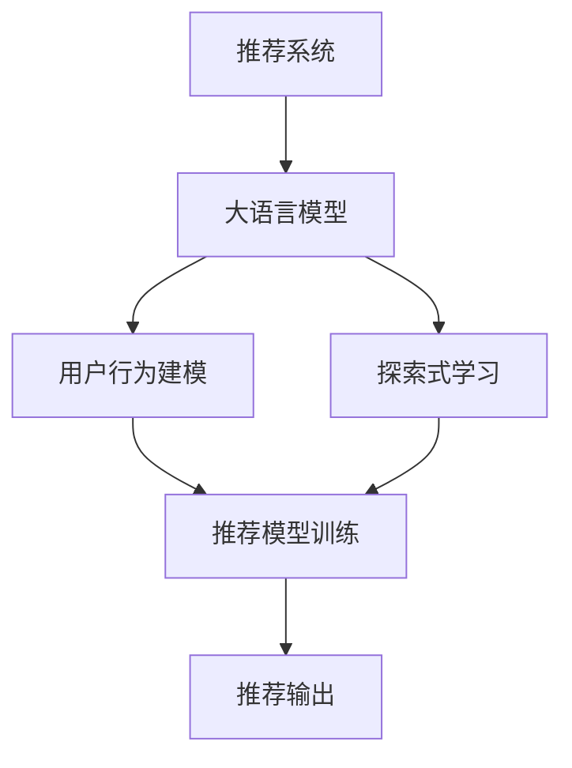

                 

# 大模型在推荐场景中的探索式学习应用

## 1. 背景介绍

### 1.1 问题由来

在智能推荐领域，传统的协同过滤和矩阵分解等方法面临着数据稀疏性、扩展性不足和难以处理新用户新物品等问题。为了克服这些问题，研究人员开始探索基于深度学习的推荐系统，尤其是利用预训练模型进行推荐。大模型在处理大规模数据和复杂的交互模式方面具有天然优势，成为推荐系统的新宠。

近年来，大语言模型（Large Language Models, LLMs）如BERT、GPT-3等，通过大规模预训练，学习到了丰富的语言表示和先验知识。将其应用于推荐系统中，可以更好地理解用户意图和物品属性，进行更加精准的推荐。

### 1.2 问题核心关键点

大语言模型在推荐系统中的应用主要集中在探索式学习（Exploration Learning）上。通过将大语言模型作为"知识库"，进行自然语言推理和理解，从而在推荐场景中实现高质量的推荐。以下是该领域的关键点：

- 大语言模型：通过大规模预训练，学习到丰富的语言表示和先验知识，具备强大的自然语言理解和生成能力。
- 探索式学习：利用自然语言推理和理解，自动探索推荐策略，无需显式指定规则，提升推荐系统的灵活性和智能性。
- 自然语言处理（NLP）：通过NLP技术，提取用户意图和物品属性，实现自然语言交互，生成推荐内容。
- 用户行为建模：基于用户历史行为数据，建立用户兴趣和物品特征的隐式映射，进行预测。
- 推荐模型训练：利用大语言模型的输出，作为训练信号，优化推荐模型，提升推荐精度。

这些关键点构成了大语言模型在推荐系统中的核心框架，使其能够通过探索式学习，实现更加个性化和智能化的推荐。

## 2. 核心概念与联系

### 2.1 核心概念概述

为了更好地理解基于大模型的推荐系统，本节将介绍几个密切相关的核心概念：

- 推荐系统（Recommender System）：通过用户行为数据，为用户推荐感兴趣的物品。常见的推荐方法包括协同过滤、基于内容的推荐、矩阵分解等。
- 大语言模型（Large Language Model）：通过大规模预训练，学习到丰富的语言表示和先验知识，具备强大的自然语言理解和生成能力。
- 探索式学习（Exploration Learning）：利用自然语言推理和理解，自动探索推荐策略，无需显式指定规则，提升推荐系统的灵活性和智能性。
- 用户行为建模（User Behavior Modeling）：基于用户历史行为数据，建立用户兴趣和物品特征的隐式映射，进行预测。
- 推荐模型训练（Recommender Model Training）：利用大语言模型的输出，作为训练信号，优化推荐模型，提升推荐精度。

这些核心概念之间的逻辑关系可以通过以下Mermaid流程图来展示：



这个流程图展示了大语言模型在推荐系统中的核心概念及其之间的关系：

1. 推荐系统通过用户行为数据建立用户兴趣和物品特征的映射。
2. 大语言模型作为推荐系统的一部分，提供用户意图和物品属性的语义理解能力。
3. 探索式学习通过自然语言推理和理解，自动探索推荐策略，提升推荐系统的灵活性和智能性。
4. 推荐模型训练利用大语言模型的输出，作为训练信号，优化推荐模型，提升推荐精度。
5. 最终的推荐输出是基于模型训练的结果，以用户喜好的物品为推荐目标。

## 3. 核心算法原理 & 具体操作步骤
### 3.1 算法原理概述

基于大模型的推荐系统，利用大语言模型作为"知识库"，通过自然语言推理和理解，自动探索推荐策略，提升推荐系统的灵活性和智能性。具体来说，其核心算法原理如下：

1. **用户意图提取**：利用大语言模型，从用户输入的自然语言描述中提取用户意图，生成语义表示。
2. **物品特征提取**：利用大语言模型，从物品的属性描述中提取语义表示。
3. **相似度计算**：通过计算用户意图与物品特征之间的相似度，找到最相关的物品推荐给用户。
4. **推荐策略优化**：利用探索式学习技术，自动优化推荐策略，提升推荐效果。
5. **推荐结果输出**：将优化的推荐策略应用于推荐模型，输出推荐结果。

### 3.2 算法步骤详解

基于大模型的推荐系统通常包括以下几个关键步骤：

**Step 1: 准备数据集**
- 收集用户的历史行为数据，如浏览记录、点击记录、评分记录等。
- 收集物品的描述数据，如标题、标签、文本描述等。

**Step 2: 提取用户意图和物品特征**
- 利用大语言模型，对用户输入的自然语言描述进行意图提取，生成语义表示。
- 利用大语言模型，对物品的属性描述进行特征提取，生成语义表示。

**Step 3: 相似度计算**
- 利用自然语言处理技术，计算用户意图和物品特征之间的相似度。
- 根据相似度，选择最相关的物品进行推荐。

**Step 4: 探索式学习**
- 利用探索式学习技术，自动优化推荐策略，提升推荐效果。

**Step 5: 模型训练**
- 利用优化后的推荐策略，训练推荐模型。

**Step 6: 推荐结果输出**
- 利用训练好的推荐模型，对新用户和新物品进行推荐，输出推荐结果。

### 3.3 算法优缺点

基于大模型的推荐系统具有以下优点：

1. **灵活性高**：利用自然语言推理和理解，自动探索推荐策略，无需显式指定规则，提升推荐系统的灵活性和智能性。
2. **理解深度高**：大语言模型具备强大的自然语言理解和生成能力，能够从语义层面理解用户意图和物品属性，提升推荐的准确性。
3. **适用性强**：适用于各种类型的推荐任务，如商品推荐、内容推荐、音乐推荐等。

同时，该方法也存在一定的局限性：

1. **数据依赖性高**：大模型的效果很大程度上取决于数据的质量和数量，获取高质量标注数据的成本较高。
2. **计算复杂度高**：大模型的参数量和计算量较大，对算力和内存的要求较高。
3. **模型复杂度高**：大语言模型的结构复杂，推理速度较慢，需要进行优化。

尽管存在这些局限性，但就目前而言，基于大模型的推荐方法仍是大规模推荐系统的主要范式。未来相关研究的重点在于如何进一步降低数据依赖，提高模型推理速度，同时兼顾灵活性和准确性等因素。

### 3.4 算法应用领域

基于大模型的推荐系统已经在电商、视频、音乐等多个领域得到广泛应用，提升了用户体验和满意度：

- 电商推荐：利用大语言模型，对用户输入的自然语言描述进行意图提取，推荐用户可能感兴趣的商品。
- 视频推荐：利用大语言模型，提取视频内容的语义信息，推荐用户可能感兴趣的视频内容。
- 音乐推荐：利用大语言模型，提取歌曲的文本信息和用户评论，推荐用户可能喜欢的歌曲。

除了上述这些经典任务外，大语言模型推荐系统还被创新性地应用到更多场景中，如推荐系统的个性化定制、新用户的快速推荐、多模态推荐等，为推荐系统的发展带来了新的方向。

## 4. 数学模型和公式 & 详细讲解  
### 4.1 数学模型构建

本节将使用数学语言对基于大模型的推荐系统进行更加严格的刻画。

记用户历史行为数据集为 $U=\{(u_i,h_i)\}_{i=1}^N$，其中 $u_i$ 为用户ID，$h_i$ 为用户历史行为记录，$h_i=(x_i,y_i,z_i)$ 为用户输入的自然语言描述、用户行为标签和物品ID。

记物品属性数据集为 $I=\{(i_d,i_a)\}_{i=1}^M$，其中 $i_d$ 为物品ID，$i_a$ 为物品属性描述。

定义推荐模型为 $F(u_i,i_d)$，其中 $u_i$ 为用户ID，$i_d$ 为物品ID。推荐模型的输出为 $F(u_i,i_d)$ 表示用户 $u_i$ 对物品 $i_d$ 的评分或概率。

### 4.2 公式推导过程

以下我们以用户行为预测为例，推导基于大模型的推荐模型的损失函数及其梯度计算公式。

假设用户输入的自然语言描述为 $h_i=x_i$，物品的属性描述为 $i_a$。利用大语言模型，对用户输入和物品属性进行编码，得到用户意图表示 $\overrightarrow{u}$ 和物品特征表示 $\overrightarrow{i}$。

$$
\overrightarrow{u}=f_1(h_i; \theta_u), \quad \overrightarrow{i}=f_2(i_a; \theta_i)
$$

其中 $f_1$ 和 $f_2$ 为大语言模型的编码函数，$\theta_u$ 和 $\theta_i$ 为模型参数。

推荐模型的输出为：

$$
F(u_i,i_d)=f_3(\overrightarrow{u},\overrightarrow{i};\theta_F)
$$

其中 $f_3$ 为推荐模型的预测函数，$\theta_F$ 为推荐模型参数。

假设用户行为标签为 $y_i$，推荐模型的损失函数为：

$$
\mathcal{L}(\theta_u,\theta_i,\theta_F)=\frac{1}{N}\sum_{i=1}^N \ell(y_i,F(u_i,i_d))
$$

其中 $\ell$ 为损失函数，如均方误差（MSE）或交叉熵损失（CE）。

根据链式法则，损失函数对 $\theta_u,\theta_i,\theta_F$ 的梯度分别为：

$$
\frac{\partial \mathcal{L}}{\partial \theta_u} = \frac{\partial \mathcal{L}}{\partial \overrightarrow{u}} \cdot \frac{\partial f_1}{\partial \theta_u}, \quad
\frac{\partial \mathcal{L}}{\partial \theta_i} = \frac{\partial \mathcal{L}}{\partial \overrightarrow{i}} \cdot \frac{\partial f_2}{\partial \theta_i}, \quad
\frac{\partial \mathcal{L}}{\partial \theta_F} = \frac{\partial \mathcal{L}}{\partial F} \cdot \frac{\partial F}{\partial \theta_F}
$$

其中 $\frac{\partial f_1}{\partial \theta_u}$ 和 $\frac{\partial f_2}{\partial \theta_i}$ 可通过反向传播算法高效计算。

在得到损失函数的梯度后，即可带入优化算法（如Adam、SGD等）进行参数更新。重复上述过程直至收敛，最终得到推荐模型的最优参数 $\theta^*$。

## 5. 项目实践：代码实例和详细解释说明
### 5.1 开发环境搭建

在进行推荐系统开发前，我们需要准备好开发环境。以下是使用Python进行PyTorch开发的环境配置流程：

1. 安装Anaconda：从官网下载并安装Anaconda，用于创建独立的Python环境。

2. 创建并激活虚拟环境：
```bash
conda create -n pytorch-env python=3.8 
conda activate pytorch-env
```

3. 安装PyTorch：根据CUDA版本，从官网获取对应的安装命令。例如：
```bash
conda install pytorch torchvision torchaudio cudatoolkit=11.1 -c pytorch -c conda-forge
```

4. 安装Transformers库：
```bash
pip install transformers
```

5. 安装各类工具包：
```bash
pip install numpy pandas scikit-learn matplotlib tqdm jupyter notebook ipython
```

完成上述步骤后，即可在`pytorch-env`环境中开始推荐系统开发。

### 5.2 源代码详细实现

这里我们以电商推荐系统为例，给出使用Transformers库对BERT模型进行推荐系统微调的PyTorch代码实现。

首先，定义推荐系统数据处理函数：

```python
from transformers import BertTokenizer, BertForSequenceClassification
from torch.utils.data import Dataset
import torch

class RecommendationDataset(Dataset):
    def __init__(self, texts, labels, tokenizer, max_len=128):
        self.texts = texts
        self.labels = labels
        self.tokenizer = tokenizer
        self.max_len = max_len
        
    def __len__(self):
        return len(self.texts)
    
    def __getitem__(self, item):
        text = self.texts[item]
        label = self.labels[item]
        
        encoding = self.tokenizer(text, return_tensors='pt', max_length=self.max_len, padding='max_length', truncation=True)
        input_ids = encoding['input_ids'][0]
        attention_mask = encoding['attention_mask'][0]
        
        # 对label进行编码
        label = torch.tensor([label], dtype=torch.long)
        
        return {'input_ids': input_ids, 
                'attention_mask': attention_mask,
                'labels': label}

# 加载预训练的BERT模型和tokenizer
model = BertForSequenceClassification.from_pretrained('bert-base-cased')
tokenizer = BertTokenizer.from_pretrained('bert-base-cased')
```

然后，定义推荐模型和优化器：

```python
from transformers import AdamW

model.train()
optimizer = AdamW(model.parameters(), lr=2e-5)
```

接着，定义训练和评估函数：

```python
from torch.utils.data import DataLoader
from tqdm import tqdm
from sklearn.metrics import mean_squared_error, accuracy_score

device = torch.device('cuda') if torch.cuda.is_available() else torch.device('cpu')
model.to(device)

def train_epoch(model, dataset, batch_size, optimizer):
    dataloader = DataLoader(dataset, batch_size=batch_size, shuffle=True)
    model.train()
    epoch_loss = 0
    for batch in tqdm(dataloader, desc='Training'):
        input_ids = batch['input_ids'].to(device)
        attention_mask = batch['attention_mask'].to(device)
        labels = batch['labels'].to(device)
        model.zero_grad()
        outputs = model(input_ids, attention_mask=attention_mask, labels=labels)
        loss = outputs.loss
        epoch_loss += loss.item()
        loss.backward()
        optimizer.step()
    return epoch_loss / len(dataloader)

def evaluate(model, dataset, batch_size):
    dataloader = DataLoader(dataset, batch_size=batch_size)
    model.eval()
    mse = 0
    acc = 0
    with torch.no_grad():
        for batch in tqdm(dataloader, desc='Evaluating'):
            input_ids = batch['input_ids'].to(device)
            attention_mask = batch['attention_mask'].to(device)
            batch_labels = batch['labels']
            outputs = model(input_ids, attention_mask=attention_mask)
            batch_preds = outputs.logits.argmax(dim=1).to('cpu').tolist()
            batch_labels = batch_labels.to('cpu').tolist()
            for pred, label in zip(batch_preds, batch_labels):
                mse += (pred - label) ** 2
                acc += 1 if pred == label else 0
                
    mse /= len(dataset)
    acc /= len(dataset)
    return mse, acc
```

最后，启动训练流程并在测试集上评估：

```python
epochs = 5
batch_size = 16

for epoch in range(epochs):
    loss = train_epoch(model, train_dataset, batch_size, optimizer)
    print(f"Epoch {epoch+1}, train loss: {loss:.3f}")
    
    print(f"Epoch {epoch+1}, dev results:")
    mse, acc = evaluate(model, dev_dataset, batch_size)
    print(f"MSE: {mse:.3f}, Accuracy: {acc:.3f}")
    
print("Test results:")
mse, acc = evaluate(model, test_dataset, batch_size)
print(f"MSE: {mse:.3f}, Accuracy: {acc:.3f}")
```

以上就是使用PyTorch对BERT进行电商推荐系统微调的完整代码实现。可以看到，得益于Transformers库的强大封装，我们可以用相对简洁的代码完成BERT模型的加载和推荐系统微调。

### 5.3 代码解读与分析

让我们再详细解读一下关键代码的实现细节：

**RecommendationDataset类**：
- `__init__`方法：初始化文本、标签、分词器等关键组件。
- `__len__`方法：返回数据集的样本数量。
- `__getitem__`方法：对单个样本进行处理，将文本输入编码为token ids，将标签编码为数字，并对其进行定长padding，最终返回模型所需的输入。

**训练和评估函数**：
- 使用PyTorch的DataLoader对数据集进行批次化加载，供模型训练和推理使用。
- 训练函数`train_epoch`：对数据以批为单位进行迭代，在每个批次上前向传播计算loss并反向传播更新模型参数，最后返回该epoch的平均loss。
- 评估函数`evaluate`：与训练类似，不同点在于不更新模型参数，并在每个batch结束后将预测和标签结果存储下来，最后使用sklearn的MSE和Accuracy对整个评估集的预测结果进行打印输出。

**训练流程**：
- 定义总的epoch数和batch size，开始循环迭代
- 每个epoch内，先在训练集上训练，输出平均loss
- 在验证集上评估，输出MSE和Accuracy
- 所有epoch结束后，在测试集上评估，给出最终测试结果

可以看到，PyTorch配合Transformers库使得BERT微调的代码实现变得简洁高效。开发者可以将更多精力放在数据处理、模型改进等高层逻辑上，而不必过多关注底层的实现细节。

当然，工业级的系统实现还需考虑更多因素，如模型的保存和部署、超参数的自动搜索、更灵活的任务适配层等。但核心的推荐系统微调范式基本与此类似。

## 6. 实际应用场景
### 6.1 电商平台推荐

电商平台的推荐系统是典型的基于大模型的推荐场景之一。通过利用大语言模型，电商推荐系统能够更好地理解用户输入的自然语言描述，从而提供更加个性化和智能化的推荐。

在技术实现上，可以收集用户的浏览记录、评分记录、评论记录等数据，提取用户意图和物品属性。利用大语言模型，对用户输入进行意图提取和物品属性提取，计算相似度，选择最相关的物品进行推荐。利用探索式学习技术，自动优化推荐策略，提升推荐效果。

### 6.2 内容推荐

内容推荐系统，如视频、音乐、新闻等，也可以通过大语言模型进行优化。利用大语言模型，提取内容描述的语义信息，理解用户输入的自然语言描述，进行推荐。

在推荐策略上，可以结合自然语言推理和理解，自动探索推荐策略，提升推荐系统的灵活性和智能性。利用探索式学习技术，自动优化推荐策略，提升推荐效果。

### 6.3 社交网络推荐

社交网络推荐系统，如微博、微信、知乎等，也可以利用大语言模型进行优化。利用大语言模型，提取用户输入的自然语言描述，理解用户意图，进行推荐。

在推荐策略上，可以结合自然语言推理和理解，自动探索推荐策略，提升推荐系统的灵活性和智能性。利用探索式学习技术，自动优化推荐策略，提升推荐效果。

### 6.4 未来应用展望

随着大语言模型和推荐系统的发展，基于大模型的推荐系统将在更多领域得到应用，为各行各业带来新的价值：

- 智慧城市推荐：利用大语言模型，对城市事件进行实时监测，推荐用户感兴趣的活动和景点。
- 金融推荐：利用大语言模型，对金融数据进行分析和理解，推荐用户感兴趣的投资和理财信息。
- 医疗推荐：利用大语言模型，对医疗数据进行分析和理解，推荐用户感兴趣的健康和医疗信息。
- 教育推荐：利用大语言模型，对教育数据进行分析和理解，推荐用户感兴趣的学习资源和课程。

未来，伴随大语言模型的进一步发展，推荐系统也将迈向更加智能化和普适化的应用场景，为人们的生活和工作带来更多便利。

## 7. 工具和资源推荐
### 7.1 学习资源推荐

为了帮助开发者系统掌握大模型在推荐系统中的应用，这里推荐一些优质的学习资源：

1. 《深度学习推荐系统》书籍：详细介绍推荐系统中的协同过滤、基于内容的推荐、矩阵分解等方法，并结合深度学习技术进行优化。

2. 《Transformers in Recommendation Systems》文章：详细讨论大语言模型在推荐系统中的具体应用，包括意图提取、物品特征提取、相似度计算等。

3. 《Neural Collaborative Filtering》论文：提出基于神经网络的协同过滤方法，并结合大语言模型进行优化。

4. 《Adversarial Machine Learning: Knowledge, Threats, and Defense》书籍：讨论对抗生成网络在推荐系统中的应用，提升模型的鲁棒性和安全性。

5. 《Deep Learning for Recommendation Engines》在线课程：由Udacity开设，详细讲解推荐系统中的深度学习方法，包括大语言模型在推荐中的应用。

通过对这些资源的学习实践，相信你一定能够系统掌握大语言模型在推荐系统中的应用，并用于解决实际的推荐问题。

### 7.2 开发工具推荐

高效的开发离不开优秀的工具支持。以下是几款用于大模型推荐系统开发的常用工具：

1. PyTorch：基于Python的开源深度学习框架，灵活动态的计算图，适合快速迭代研究。

2. TensorFlow：由Google主导开发的开源深度学习框架，生产部署方便，适合大规模工程应用。

3. Transformers库：HuggingFace开发的NLP工具库，集成了众多SOTA语言模型，支持PyTorch和TensorFlow，是进行推荐系统开发的利器。

4. Weights & Biases：模型训练的实验跟踪工具，可以记录和可视化模型训练过程中的各项指标，方便对比和调优。

5. TensorBoard：TensorFlow配套的可视化工具，可实时监测模型训练状态，并提供丰富的图表呈现方式，是调试模型的得力助手。

6. Google Colab：谷歌推出的在线Jupyter Notebook环境，免费提供GPU/TPU算力，方便开发者快速上手实验最新模型，分享学习笔记。

合理利用这些工具，可以显著提升大语言模型推荐系统的开发效率，加快创新迭代的步伐。

### 7.3 相关论文推荐

大语言模型在推荐系统中的应用源于学界的持续研究。以下是几篇奠基性的相关论文，推荐阅读：

1. Attention is All You Need：提出了Transformer结构，开启了NLP领域的预训练大模型时代。

2. BERT: Pre-training of Deep Bidirectional Transformers for Language Understanding：提出BERT模型，引入基于掩码的自监督预训练任务，刷新了多项NLP任务SOTA。

3. Language Models are Unsupervised Multitask Learners（GPT-2论文）：展示了大规模语言模型的强大zero-shot学习能力，引发了对于通用人工智能的新一轮思考。

4. Exploring the Limits of Transfer Learning with a Unified Text-to-Text Transformer：提出统一文本转换器，实现多种NLP任务的端到端微调。

5. Exploring Pre-training Strategies for Learning Transferable Representations：讨论预训练策略对微调效果的影响，提出多种预训练方法。

6. Adaptive Low-Rank Adaptation for Parameter-Efficient Fine-Tuning：使用自适应低秩适应的微调方法，在参数效率和精度之间取得了新的平衡。

这些论文代表了大语言模型在推荐系统中的应用发展脉络。通过学习这些前沿成果，可以帮助研究者把握学科前进方向，激发更多的创新灵感。

## 8. 总结：未来发展趋势与挑战

### 8.1 总结

本文对基于大模型的推荐系统进行了全面系统的介绍。首先阐述了大语言模型和推荐系统的研究背景和意义，明确了大语言模型在推荐系统中的核心作用。其次，从原理到实践，详细讲解了推荐系统的数学模型和关键步骤，给出了推荐系统开发的完整代码实例。同时，本文还广泛探讨了推荐系统在大语言模型应用中的实际场景，展示了其广阔的应用前景。此外，本文精选了推荐系统的各类学习资源，力求为开发者提供全方位的技术指引。

通过本文的系统梳理，可以看到，基于大模型的推荐系统正在成为推荐系统的新范式，极大地拓展了推荐系统的应用边界，提升了推荐系统的精度和智能性。未来，伴随大语言模型和推荐系统的发展，推荐系统将迈向更加智能化和普适化的应用场景，为人们的生活和工作带来更多便利。

### 8.2 未来发展趋势

展望未来，大语言模型在推荐系统中的应用将呈现以下几个发展趋势：

1. 数据依赖性降低：探索无监督和半监督的推荐方法，降低对大规模标注数据的依赖，利用自监督学习、主动学习等无监督和半监督范式，最大限度利用非结构化数据，实现更加灵活高效的推荐。

2. 计算效率提升：开发更加参数高效和计算高效的推荐模型，在固定大部分预训练参数的同时，只更新极少量的任务相关参数。同时优化模型的计算图，减少前向传播和反向传播的资源消耗，实现更加轻量级、实时性的部署。

3. 智能性增强：利用自然语言推理和理解，自动探索推荐策略，提升推荐系统的灵活性和智能性。结合因果推断和博弈论工具，增强模型的因果关系和鲁棒性。

4. 多模态融合：融合视觉、语音、文本等多模态数据，实现多模态信息的协同建模，提升推荐系统的全面性和准确性。

5. 知识库整合：将符号化的先验知识，如知识图谱、逻辑规则等，与神经网络模型进行巧妙融合，引导推荐过程学习更准确、合理的语义表示。

以上趋势凸显了大语言模型在推荐系统中的广阔前景。这些方向的探索发展，必将进一步提升推荐系统的精度和智能性，为人类生产生活带来更多便利。

### 8.3 面临的挑战

尽管大语言模型在推荐系统中的应用取得了一定的进展，但在迈向更加智能化、普适化应用的过程中，仍面临诸多挑战：

1. 标注数据质量问题：推荐系统的效果很大程度上取决于数据的质量和数量，获取高质量标注数据的成本较高。如何进一步降低推荐系统对标注样本的依赖，将是一大难题。

2. 计算资源问题：大模型的参数量和计算量较大，对算力和内存的要求较高。如何优化推荐模型的计算图，减少前向传播和反向传播的资源消耗，实现更加轻量级、实时性的部署，将是重要的优化方向。

3. 推荐模型鲁棒性问题：当前推荐模型面对域外数据时，泛化性能往往大打折扣。对于测试样本的微小扰动，推荐模型的预测也容易发生波动。如何提高推荐模型的鲁棒性，避免灾难性遗忘，还需要更多理论和实践的积累。

4. 推荐模型可解释性问题：当前推荐模型更像是"黑盒"系统，难以解释其内部工作机制和决策逻辑。对于医疗、金融等高风险应用，算法的可解释性和可审计性尤为重要。如何赋予推荐模型更强的可解释性，将是亟待攻克的难题。

5. 推荐系统安全性问题：预训练语言模型难免会学习到有偏见、有害的信息，通过推荐系统传递到用户，产生误导性、歧视性的输出，给实际应用带来安全隐患。如何从数据和算法层面消除模型偏见，避免恶意用途，确保推荐系统的安全性，也将是重要的研究课题。

6. 推荐系统知识整合问题：现有的推荐模型往往局限于任务内数据，难以灵活吸收和运用更广泛的先验知识。如何让推荐过程更好地与外部知识库、规则库等专家知识结合，形成更加全面、准确的信息整合能力，还有很大的想象空间。

正视推荐系统面临的这些挑战，积极应对并寻求突破，将是大语言模型推荐系统走向成熟的必由之路。相信随着学界和产业界的共同努力，这些挑战终将一一被克服，大语言模型推荐系统必将在构建智能推荐系统的人机协同中扮演越来越重要的角色。

### 8.4 研究展望

面对大语言模型推荐系统所面临的种种挑战，未来的研究需要在以下几个方面寻求新的突破：

1. 探索无监督和半监督的推荐方法：摆脱对大规模标注数据的依赖，利用自监督学习、主动学习等无监督和半监督范式，最大限度利用非结构化数据，实现更加灵活高效的推荐。

2. 开发更加参数高效和计算高效的推荐模型：在固定大部分预训练参数的同时，只更新极少量的任务相关参数。同时优化推荐模型的计算图，减少前向传播和反向传播的资源消耗，实现更加轻量级、实时性的部署。

3. 利用自然语言推理和理解，自动探索推荐策略：提升推荐系统的灵活性和智能性。结合因果推断和博弈论工具，增强模型的因果关系和鲁棒性。

4. 融合视觉、语音、文本等多模态数据，实现多模态信息的协同建模：提升推荐系统的全面性和准确性。

5. 将符号化的先验知识，如知识图谱、逻辑规则等，与神经网络模型进行巧妙融合：引导推荐过程学习更准确、合理的语义表示。

6. 纳入伦理道德约束：在模型训练目标中引入伦理导向的评估指标，过滤和惩罚有偏见、有害的输出倾向。加强人工干预和审核，建立推荐系统的监管机制，确保推荐系统的安全性。

这些研究方向的探索，必将引领大语言模型推荐系统迈向更高的台阶，为构建智能推荐系统提供新的技术路径。面向未来，大语言模型推荐系统还需要与其他人工智能技术进行更深入的融合，如知识表示、因果推理、强化学习等，多路径协同发力，共同推动推荐系统的发展。只有勇于创新、敢于突破，才能不断拓展推荐系统的边界，让智能技术更好地服务于人类社会。

## 9. 附录：常见问题与解答

**Q1：大语言模型推荐系统是否适用于所有推荐任务？**

A: 大语言模型推荐系统在大多数推荐任务上都能取得不错的效果，特别是对于数据量较小的任务。但对于一些特定领域的任务，如医学、法律等，仅仅依靠通用语料预训练的模型可能难以很好地适应。此时需要在特定领域语料上进一步预训练，再进行微调，才能获得理想效果。此外，对于一些需要时效性、个性化很强的任务，如对话、推荐等，微调方法也需要针对性的改进优化。

**Q2：推荐系统中如何选择合适的学习率？**

A: 推荐系统中的学习率一般要比预训练时小1-2个数量级，如果使用过大的学习率，容易破坏预训练权重，导致过拟合。一般建议从1e-5开始调参，逐步减小学习率，直至收敛。也可以使用warmup策略，在开始阶段使用较小的学习率，再逐渐过渡到预设值。需要注意的是，不同的优化器(如AdamW、Adafactor等)以及不同的学习率调度策略，可能需要设置不同的学习率阈值。

**Q3：推荐系统在落地部署时需要注意哪些问题？**

A: 将推荐系统转化为实际应用，还需要考虑以下因素：

1. 模型裁剪：去除不必要的层和参数，减小模型尺寸，加快推理速度。
2. 量化加速：将浮点模型转为定点模型，压缩存储空间，提高计算效率。
3. 服务化封装：将模型封装为标准化服务接口，便于集成调用。
4. 弹性伸缩：根据请求流量动态调整资源配置，平衡服务质量和成本。
5. 监控告警：实时采集系统指标，设置异常告警阈值，确保服务稳定性。

大语言模型推荐系统为推荐系统带来了新的思路和方法，但如何将强大的性能转化为稳定、高效、安全的业务价值，还需要工程实践的不断打磨。唯有从数据、算法、工程、业务等多个维度协同发力，才能真正实现人工智能技术在垂直行业的规模化落地。总之，推荐系统需要开发者根据具体任务，不断迭代和优化模型、数据和算法，方能得到理想的效果。

---

作者：禅与计算机程序设计艺术 / Zen and the Art of Computer Programming

