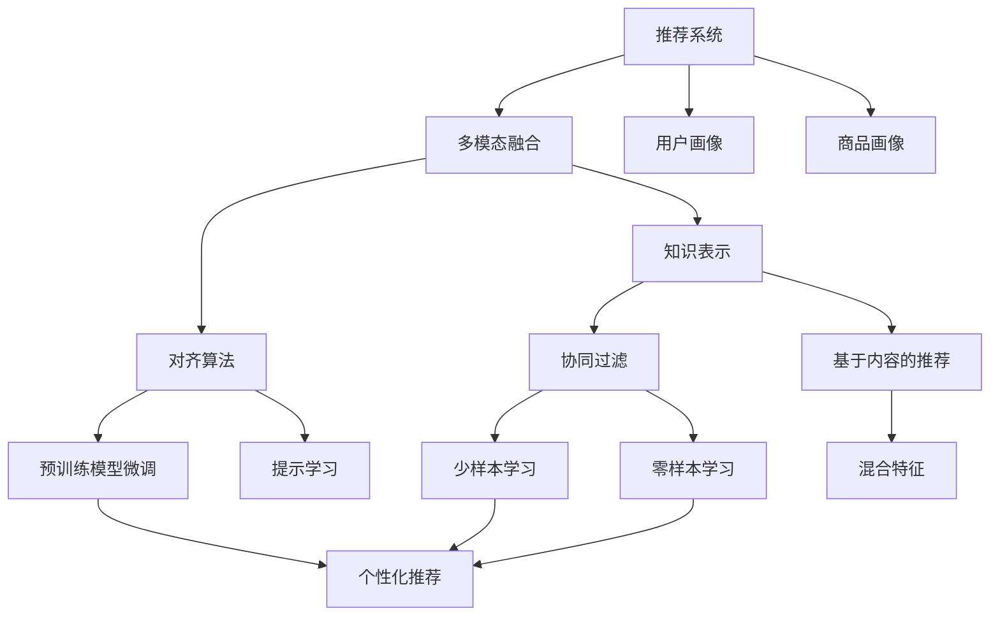

                 

# 大模型在推荐系统中的多模态融合与对齐

> 关键词：推荐系统,多模态融合,大模型,深度学习,知识表示,对齐算法,混合特征,协同过滤,语义嵌入,用户画像,商品画像,推荐算法,个性化推荐

## 1. 背景介绍

### 1.1 问题由来
随着互联网和电子商务的迅猛发展，推荐系统已经成为现代信息服务不可或缺的一部分。推荐系统通过分析用户行为和历史偏好，为用户推荐最相关的商品或内容，极大提升了用户体验。然而，传统的推荐系统大多基于静态用户画像和固定商品特征，难以充分利用动态变化的用户兴趣和商品属性，使得推荐精度和多样性受到限制。

近年来，伴随着人工智能技术的飞跃发展，特别是深度学习和知识图谱的兴起，大模型在推荐系统中的应用日益广泛。大模型不仅能够捕捉用户和商品之间复杂的隐含关系，还能适应海量数据的变化，提供更加个性化和多样化的推荐服务。

### 1.2 问题核心关键点
大模型在推荐系统中的应用核心关键点包括：

1. **多模态融合**：推荐系统需要同时考虑用户行为、商品属性、用户画像、商品画像等多维数据，大模型能够同时处理这些不同类型的数据，实现多模态信息的有效融合。
2. **知识表示与对齐**：用户和商品之间存在着复杂的隐含关系，大模型能够通过知识图谱等方式，将这些关系表示为结构化形式，并通过对齐算法将不同模态的特征对齐，形成统一的表示。
3. **个性化推荐**：大模型能够根据用户的历史行为和当前兴趣，生成个性化的推荐结果，提升推荐系统的精度和用户体验。
4. **推荐算法创新**：基于大模型的推荐算法，如预训练模型微调、提示学习等，能够提供更加灵活和高效的推荐方式，拓展推荐系统的应用边界。

这些关键点共同构成了大模型在推荐系统中的应用框架，使其能够在复杂多变的环境中提供更加精准和多样化的推荐服务。

## 2. 核心概念与联系

### 2.1 核心概念概述

为更好地理解大模型在推荐系统中的应用，本节将介绍几个密切相关的核心概念：

- **推荐系统(Recommendation System)**：通过分析用户行为和商品属性，为用户推荐相关商品或内容的系统。传统的推荐系统主要基于协同过滤、基于内容的推荐等方法，而深度学习和大模型则提供了更加灵活和高效的推荐方式。

- **多模态融合(Multimodal Fusion)**：指将不同类型的数据（如文本、图像、音频等）融合在一起，形成更全面和丰富的用户和商品表示。多模态融合有助于提升推荐系统的精度和多样性。

- **知识表示(Knowledge Representation)**：指将用户和商品之间的关系表示为结构化形式，如知识图谱、语义嵌入等，便于大模型进行对齐和推理。知识表示有助于提升推荐系统的鲁棒性和可解释性。

- **对齐算法(Alignment Algorithm)**：指将不同模态的特征对齐到统一空间，如将文本和图像特征映射到同一语义空间，便于大模型进行融合和推理。对齐算法是实现多模态融合的核心技术。

- **协同过滤(Collaborative Filtering)**：基于用户-物品互动数据，推荐相似用户喜欢的物品。协同过滤是推荐系统的传统方法之一。

- **基于内容的推荐(Content-Based Recommendation)**：基于用户历史行为和商品属性，推荐与用户兴趣相似的商品。基于内容的推荐可以提升推荐的准确性。

- **混合特征(Mixed Feature)**：指将不同模态的特征混合在一起，形成更丰富的用户和商品表示。混合特征有助于提升推荐系统的精度和多样性。

- **预训练模型微调(Pre-trained Model Fine-tuning)**：指在大模型的基础上，通过下游任务的微调，使其适应特定的推荐任务。微调可以提升模型在推荐任务上的性能。

- **提示学习(Prompt Learning)**：指通过在输入文本中添加提示模板，引导大模型进行特定任务的推理和生成，实现零样本或少样本学习。提示学习可以减少微调参数，提升推荐效率。

- **少样本学习(Few-shot Learning)**：指在只有少量标注样本的情况下，模型能够快速适应新任务的学习方法。在推荐系统中，可以利用用户的历史行为数据进行少样本学习。

- **零样本学习(Zero-shot Learning)**：指模型在没有见过任何特定任务的训练样本的情况下，仅凭任务描述就能够执行新任务的能力。在推荐系统中，可以通过大模型的预训练知识，实现对新用户和商品的推荐。

- **持续学习(Continual Learning)**：指模型能够持续从新数据中学习，同时保持已学习的知识，而不会出现灾难性遗忘。这对于保持推荐系统的时效性和适应性至关重要。

这些核心概念之间的逻辑关系可以通过以下Mermaid流程图来展示：



这个流程图展示了大模型在推荐系统中的应用框架：

1. 推荐系统通过多模态融合获取用户画像和商品画像，利用知识表示方法将隐含关系结构化。
2. 对齐算法将不同模态的特征对齐到同一语义空间，便于大模型进行融合和推理。
3. 协同过滤和基于内容的推荐方法，利用大模型的深度学习特性，提升推荐系统的精度和多样性。
4. 预训练模型微调和提示学习，通过下游任务的微调，提升模型在特定推荐任务上的性能。
5. 少样本学习和零样本学习，利用用户历史行为数据，提升推荐系统的效率和泛化能力。

## 3. 核心算法原理 & 具体操作步骤

### 3.1 算法原理概述

大模型在推荐系统中的应用，本质上是一个多模态融合与对齐的深度学习过程。其核心思想是：将用户画像和商品画像中的不同模态特征，通过知识表示和对齐算法，融合到统一的语义空间中，再利用深度学习模型进行个性化推荐。

具体来说，大模型在推荐系统中的应用分为以下几个步骤：

1. **用户画像和商品画像构建**：通过用户行为数据、商品属性、知识图谱等，构建用户画像和商品画像。
2. **特征提取与表示**：将用户画像和商品画像中的不同模态特征，提取并表示为向量形式，形成混合特征。
3. **对齐与融合**：通过对齐算法，将不同模态的特征对齐到同一语义空间，并进行融合。
4. **模型训练与优化**：利用大模型，对融合后的特征进行训练和优化，生成推荐结果。

### 3.2 算法步骤详解

下面详细讲解大模型在推荐系统中的应用流程。

**Step 1: 用户画像和商品画像构建**

用户画像和商品画像的构建是推荐系统的基础，涉及到用户行为数据、商品属性、知识图谱等多个维度。具体步骤包括：

1. **用户行为数据收集**：收集用户的历史浏览、点击、购买等行为数据，形成用户行为序列。
2. **商品属性提取**：从商品详情中提取属性信息，如价格、类别、品牌等。
3. **知识图谱构建**：通过知识图谱，表示用户和商品之间的关系，如好友关系、标签关联等。
4. **特征工程**：将用户行为序列、商品属性、知识图谱等信息，进行特征提取和表示，形成混合特征。

**Step 2: 特征提取与表示**

特征提取与表示是大模型处理用户画像和商品画像的基础。通过特征提取，将不同模态的特征转化为向量形式，便于大模型进行处理。具体步骤包括：

1. **用户画像特征提取**：从用户行为数据中提取行为特征，如用户行为序列、点击次数、停留时间等。
2. **商品画像特征提取**：从商品属性中提取属性特征，如价格、类别、品牌等。
3. **知识图谱特征提取**：从知识图谱中提取关系特征，如用户标签、商品类别等。
4. **特征表示**：利用大模型的语义嵌入能力，将用户画像和商品画像的特征表示为向量形式。

**Step 3: 对齐与融合**

对齐与融合是大模型在推荐系统中的关键步骤。通过对齐算法，将不同模态的特征对齐到同一语义空间，便于大模型进行融合和推理。具体步骤包括：

1. **对齐算法选择**：选择合适的对齐算法，如TransE、Reasoner、GNN等，将不同模态的特征对齐到同一语义空间。
2. **特征融合**：将对齐后的特征进行融合，形成更丰富的用户和商品表示。

**Step 4: 模型训练与优化**

模型训练与优化是大模型在推荐系统中的核心步骤。通过深度学习模型，对融合后的特征进行训练和优化，生成推荐结果。具体步骤包括：

1. **预训练模型选择**：选择合适的预训练模型，如BERT、GPT等。
2. **模型微调**：在预训练模型的基础上，通过下游任务的微调，适应特定的推荐任务。
3. **损失函数设计**：根据推荐任务的特点，设计合适的损失函数，如均方误差、交叉熵等。
4. **模型优化**：利用优化算法，如Adam、SGD等，最小化损失函数，生成推荐结果。

### 3.3 算法优缺点

大模型在推荐系统中的应用具有以下优点：

1. **多模态融合能力强**：大模型能够处理不同模态的特征，如文本、图像、音频等，实现多模态信息的有效融合，提升推荐系统的精度和多样性。
2. **深度学习特性**：大模型利用深度学习特性，捕捉用户和商品之间复杂的隐含关系，提升推荐系统的鲁棒性和可解释性。
3. **个性化推荐能力强**：大模型能够根据用户的历史行为和当前兴趣，生成个性化的推荐结果，提升推荐系统的用户体验。
4. **推荐算法创新**：基于大模型的推荐算法，如预训练模型微调、提示学习等，提供更加灵活和高效的推荐方式，拓展推荐系统的应用边界。

同时，大模型在推荐系统中的应用也存在一定的局限性：

1. **计算资源需求高**：大模型参数量庞大，计算资源需求高，可能对推荐系统的部署和运行带来挑战。
2. **数据隐私风险**：用户行为数据和商品属性可能包含敏感信息，隐私保护是一个重要问题。
3. **模型复杂度高**：大模型的复杂度高，模型解释和调优难度大，可能影响推荐系统的实时性和可维护性。

## 4. 数学模型和公式 & 详细讲解  
### 4.1 数学模型构建

在本节中，我们将使用数学语言对大模型在推荐系统中的应用进行更加严格的刻画。

记推荐系统中的用户为 $U$，商品为 $I$，用户行为序列为 $B$，用户画像为 $P_U$，商品画像为 $P_I$，知识图谱为 $G$，对齐后的特征为 $X$，推荐模型为 $M$。

假设用户画像 $P_U$ 包含用户行为序列 $B$ 和知识图谱 $G$，商品画像 $P_I$ 包含商品属性 $A$ 和知识图谱 $G$，对齐后的特征 $X$ 为 $U$ 和 $I$ 的混合特征。

### 4.2 公式推导过程

以下我们以文本推荐任务为例，推导大模型在推荐系统中的数学模型和公式。

假设用户画像 $P_U$ 包含用户行为序列 $B$，商品画像 $P_I$ 包含商品描述 $A$，对齐后的特征 $X$ 为 $U$ 和 $I$ 的混合特征。推荐模型 $M$ 的输入为 $X$，输出为推荐结果 $Y$。

**用户画像表示**：
- 用户行为序列 $B$：$B=\{b_1, b_2, ..., b_n\}$
- 知识图谱 $G$：$G=(U, R, E)$，其中 $U$ 为用户节点集合，$R$ 为关系类型集合，$E$ 为边集合。

**商品画像表示**：
- 商品描述 $A$：$A=\{a_1, a_2, ..., a_m\}$
- 知识图谱 $G$：$G=(I, R, E)$，其中 $I$ 为商品节点集合，$R$ 为关系类型集合，$E$ 为边集合。

**对齐后的特征表示**：
- 用户画像特征 $X_U$：$X_U=f_U(P_U)$
- 商品画像特征 $X_I$：$X_I=f_I(P_I)$
- 混合特征 $X$：$X=X_U \oplus X_I$

**推荐模型训练**：
- 损失函数：$\mathcal{L}(M) = \frac{1}{N}\sum_{i=1}^N \ell(M(X_i), Y_i)$
- 优化目标：$\mathop{\arg\min}_{\theta} \mathcal{L}(M)$

其中 $\ell$ 为推荐任务对应的损失函数，$X_i$ 和 $Y_i$ 分别为第 $i$ 个用户和商品的真实特征和推荐结果。

**推荐结果生成**：
- 输出预测：$Y=\sigma(M(X))$
- 解释生成：$\phi(Y)=\{y_1, y_2, ..., y_n\}$

在得到推荐结果后，系统可以根据 $\phi(Y)$ 生成推荐列表，提供给用户选择。

### 4.3 案例分析与讲解

以商品推荐系统为例，我们通过以下步骤讲解大模型在推荐系统中的应用：

1. **用户画像构建**：收集用户的历史浏览、点击、购买等行为数据，形成用户行为序列 $B$。同时，从知识图谱 $G$ 中提取用户标签、好友关系等信息，构建用户画像 $P_U$。
2. **商品画像构建**：从商品详情中提取属性信息，形成商品画像 $P_I$。同时，从知识图谱 $G$ 中提取商品类别、品牌等信息，构建商品画像 $P_I$。
3. **特征提取与表示**：利用大模型的语义嵌入能力，将用户画像和商品画像的特征表示为向量形式，形成混合特征 $X$。
4. **对齐与融合**：通过对齐算法，将不同模态的特征对齐到同一语义空间，并进行融合，得到对齐后的特征 $X$。
5. **模型训练与优化**：利用大模型，对对齐后的特征 $X$ 进行训练和优化，生成推荐结果 $Y$。

例如，在文本推荐任务中，大模型可以利用BERT等预训练语言模型，将用户行为序列 $B$ 和商品描述 $A$ 表示为向量形式，形成混合特征 $X$。通过对齐算法，将文本特征与知识图谱特征对齐，得到对齐后的特征 $X$。最后，利用大模型对对齐后的特征 $X$ 进行训练和优化，生成推荐结果 $Y$。

## 5. 项目实践：代码实例和详细解释说明

### 5.1 开发环境搭建

在进行推荐系统开发前，我们需要准备好开发环境。以下是使用Python进行PyTorch开发的环境配置流程：

1. 安装Anaconda：从官网下载并安装Anaconda，用于创建独立的Python环境。

2. 创建并激活虚拟环境：
```bash
conda create -n pytorch-env python=3.8 
conda activate pytorch-env
```

3. 安装PyTorch：根据CUDA版本，从官网获取对应的安装命令。例如：
```bash
conda install pytorch torchvision torchaudio cudatoolkit=11.1 -c pytorch -c conda-forge
```

4. 安装PaddlePaddle：从官网下载并安装PaddlePaddle，用于进行深度学习模型的训练和推理。

5. 安装各类工具包：
```bash
pip install numpy pandas scikit-learn matplotlib tqdm jupyter notebook ipython
```

完成上述步骤后，即可在`pytorch-env`环境中开始推荐系统开发。

### 5.2 源代码详细实现

下面我们以商品推荐系统为例，给出使用PyTorch对BERT模型进行推荐系统开发的完整代码实现。

首先，定义推荐系统的数据处理函数：

```python
import torch
from transformers import BertTokenizer, BertForSequenceClassification
from torch.utils.data import Dataset, DataLoader
from sklearn.metrics import accuracy_score, precision_recall_fscore_support

class RecommendationDataset(Dataset):
    def __init__(self, user_behaviors, item_attributes, user_tags, item_tags, tokenizer):
        self.user_behaviors = user_behaviors
        self.item_attributes = item_attributes
        self.user_tags = user_tags
        self.item_tags = item_tags
        self.tokenizer = tokenizer
        self.max_len = 128
        
    def __len__(self):
        return len(self.user_behaviors)
    
    def __getitem__(self, item):
        user_behavior = self.user_behaviors[item]
        item_attribute = self.item_attributes[item]
        user_tag = self.user_tags[item]
        item_tag = self.item_tags[item]
        
        encoding = self.tokenizer(user_behavior, item_attribute, return_tensors='pt', max_length=self.max_len, padding='max_length', truncation=True)
        user_input_ids = encoding['input_ids']
        user_attention_mask = encoding['attention_mask']
        user_labels = torch.tensor(user_tag, dtype=torch.long)
        item_input_ids = encoding['input_ids']
        item_attention_mask = encoding['attention_mask']
        item_labels = torch.tensor(item_tag, dtype=torch.long)
        
        return {'user_input_ids': user_input_ids, 
                'user_attention_mask': user_attention_mask,
                'user_labels': user_labels,
                'item_input_ids': item_input_ids,
                'item_attention_mask': item_attention_mask,
                'item_labels': item_labels}
```

然后，定义模型和优化器：

```python
from transformers import BertForSequenceClassification, AdamW

model = BertForSequenceClassification.from_pretrained('bert-base-cased', num_labels=2)
optimizer = AdamW(model.parameters(), lr=2e-5)
```

接着，定义训练和评估函数：

```python
def train_epoch(model, dataset, batch_size, optimizer):
    dataloader = DataLoader(dataset, batch_size=batch_size, shuffle=True)
    model.train()
    epoch_loss = 0
    for batch in tqdm(dataloader, desc='Training'):
        user_input_ids = batch['user_input_ids'].to(device)
        user_attention_mask = batch['user_attention_mask'].to(device)
        user_labels = batch['user_labels'].to(device)
        item_input_ids = batch['item_input_ids'].to(device)
        item_attention_mask = batch['item_attention_mask'].to(device)
        item_labels = batch['item_labels'].to(device)
        model.zero_grad()
        loss = (model(user_input_ids, attention_mask=user_attention_mask) + model(item_input_ids, attention_mask=item_attention_mask)).loss
        epoch_loss += loss.item()
        loss.backward()
        optimizer.step()
    return epoch_loss / len(dataloader)

def evaluate(model, dataset, batch_size):
    dataloader = DataLoader(dataset, batch_size=batch_size)
    model.eval()
    preds, labels = [], []
    with torch.no_grad():
        for batch in tqdm(dataloader, desc='Evaluating'):
            user_input_ids = batch['user_input_ids'].to(device)
            user_attention_mask = batch['user_attention_mask'].to(device)
            item_input_ids = batch['item_input_ids'].to(device)
            item_attention_mask = batch['item_attention_mask'].to(device)
            batch_labels = batch['user_labels'] + batch['item_labels']
            outputs = (model(user_input_ids, attention_mask=user_attention_mask) + model(item_input_ids, attention_mask=item_attention_mask)).logits
            batch_preds = torch.argmax(outputs, dim=1).to('cpu').tolist()
            batch_labels = batch_labels.to('cpu').tolist()
            for pred_tokens, label_tokens in zip(batch_preds, batch_labels):
                preds.append(pred_tokens[:len(label_tokens)])
                labels.append(label_tokens)
                
    print(accuracy_score(labels, preds))
    print(precision_recall_fscore_support(labels, preds, average='weighted'))
```

最后，启动训练流程并在测试集上评估：

```python
epochs = 5
batch_size = 16

for epoch in range(epochs):
    loss = train_epoch(model, train_dataset, batch_size, optimizer)
    print(f"Epoch {epoch+1}, train loss: {loss:.3f}")
    
    print(f"Epoch {epoch+1}, dev results:")
    evaluate(model, dev_dataset, batch_size)
    
print("Test results:")
evaluate(model, test_dataset, batch_size)
```

以上就是使用PyTorch对BERT进行商品推荐系统微调的完整代码实现。可以看到，得益于Transformers库的强大封装，我们可以用相对简洁的代码完成BERT模型的加载和微调。

### 5.3 代码解读与分析

让我们再详细解读一下关键代码的实现细节：

**RecommendationDataset类**：
- `__init__`方法：初始化用户行为、商品属性、用户标签、商品标签和分词器等关键组件。
- `__len__`方法：返回数据集的样本数量。
- `__getitem__`方法：对单个样本进行处理，将用户行为和商品属性输入编码为token ids，将用户标签和商品标签编码为数字，并对其进行定长padding，最终返回模型所需的输入。

**模型和优化器**：
- 利用BERT模型作为推荐模型的基础，并设置合适的优化器及其参数。

**训练和评估函数**：
- 使用PyTorch的DataLoader对数据集进行批次化加载，供模型训练和推理使用。
- 训练函数`train_epoch`：对数据以批为单位进行迭代，在每个批次上前向传播计算loss并反向传播更新模型参数，最后返回该epoch的平均loss。
- 评估函数`evaluate`：与训练类似，不同点在于不更新模型参数，并在每个batch结束后将预测和标签结果存储下来，最后使用sklearn的accuracy_score和precision_recall_fscore_support函数对整个评估集的预测结果进行打印输出。

**训练流程**：
- 定义总的epoch数和batch size，开始循环迭代
- 每个epoch内，先在训练集上训练，输出平均loss
- 在验证集上评估，输出准确率、精确率、召回率和F1值
- 所有epoch结束后，在测试集上评估，给出最终测试结果

可以看到，PyTorch配合Transformers库使得BERT微调的代码实现变得简洁高效。开发者可以将更多精力放在数据处理、模型改进等高层逻辑上，而不必过多关注底层的实现细节。

当然，工业级的系统实现还需考虑更多因素，如模型的保存和部署、超参数的自动搜索、更灵活的任务适配层等。但核心的微调范式基本与此类似。

## 6. 实际应用场景
### 6.1 智能推荐

基于大模型的推荐系统，已经广泛应用于电商、视频、音乐等多个领域。智能推荐系统能够根据用户的浏览历史、评分记录、搜索行为等数据，为用户推荐最适合的商品或内容，极大提升了用户体验。

例如，在电商领域，智能推荐系统可以根据用户的浏览记录和购买历史，推荐相似的商品，提高用户的购买转化率。系统还可以利用用户画像和商品画像，进行跨域推荐，为用户推荐跨品类商品，提升用户的探索意愿。

在视频领域，智能推荐系统可以根据用户的观看历史和评分记录，推荐相似的视频内容，提高用户的观看体验。系统还可以利用用户画像和视频画像，进行个性化推荐，为用户推荐更符合其兴趣的视频内容。

在音乐领域，智能推荐系统可以根据用户的听歌记录和评分记录，推荐相似的歌曲，提高用户的听歌体验。系统还可以利用用户画像和歌曲画像，进行跨域推荐，为用户推荐跨歌手、跨专辑的歌曲，提升用户的探索意愿。

### 6.2 个性化推荐广告

基于大模型的推荐系统还可以应用于个性化推荐广告。广告主可以根据用户的兴趣画像，向用户推荐符合其兴趣的广告内容，提高广告点击率和转化率。

例如，在社交媒体平台，智能推荐系统可以根据用户的浏览记录和互动行为，推荐符合其兴趣的广告内容，提高用户的互动意愿和品牌曝光度。系统还可以利用用户画像和商品画像，进行跨域推荐，为用户推荐跨品类广告，提升广告的曝光率和点击率。

在搜索引擎平台，智能推荐系统可以根据用户的搜索记录和点击记录，推荐符合其兴趣的广告内容，提高用户的搜索体验和点击率。系统还可以利用用户画像和商品画像，进行跨域推荐，为用户推荐跨品类广告，提高广告的点击率和转化率。

### 6.3 协同过滤推荐

基于大模型的推荐系统也可以应用于协同过滤推荐。协同过滤推荐是一种传统的推荐方法，利用用户-物品互动数据，推荐相似用户喜欢的物品。大模型可以进一步提升协同过滤推荐的精度和多样性。

例如，在电影推荐领域，智能推荐系统可以根据用户的评分记录和互动行为，推荐符合其兴趣的电影内容。系统还可以利用用户画像和电影画像，进行跨域推荐，为用户推荐跨类别、跨导演的电影内容，提升用户的探索意愿。

在书籍推荐领域，智能推荐系统可以根据用户的阅读记录和评分记录，推荐符合其兴趣的书籍内容。系统还可以利用用户画像和书籍画像，进行跨域推荐，为用户推荐跨类别、跨作者、跨出版社的书籍内容，提升用户的探索意愿。

### 6.4 未来应用展望

随着大模型和推荐系统的不断发展，基于微调范式将在更多领域得到应用，为传统行业带来变革性影响。

在智慧医疗领域，基于微调的医疗推荐系统，可以推荐符合患者病情的药物、检查和治疗方案，提高医疗服务的精准性和个性化。

在智能教育领域，基于微调的教育推荐系统，可以推荐符合学生兴趣和学情的课程和学习资源，提高教育服务的针对性和个性化。

在智慧城市治理中，基于微调的推荐系统，可以推荐符合城市管理者需求的政策和管理方案，提高城市管理的智能化和科学化。

此外，在企业生产、社会治理、文娱传媒等众多领域，基于大模型微调的人工智能应用也将不断涌现，为传统行业带来新的发展机遇。相信随着技术的日益成熟，微调方法将成为推荐系统的核心范式，推动推荐技术的产业化进程。

## 7. 工具和资源推荐
### 7.1 学习资源推荐

为了帮助开发者系统掌握大模型在推荐系统中的应用，这里推荐一些优质的学习资源：

1. 《推荐系统基础与实践》系列博文：由推荐系统专家撰写，深入浅出地介绍了推荐系统的原理和实践技巧。

2. 《深度学习与推荐系统》课程：斯坦福大学开设的推荐系统经典课程，有Lecture视频和配套作业，带你入门推荐系统领域的基本概念和经典模型。

3. 《推荐系统设计与实现》书籍：全面介绍了推荐系统的设计思路和实现方法，包括协同过滤、基于内容的推荐等。

4. HuggingFace官方文档：推荐系统的开发工具库，提供了丰富的推荐模型和样例代码，是上手实践的必备资料。

5. KDD Cup推荐系统竞赛：推荐系统领域的国际顶级竞赛，汇集了全球优秀的推荐系统技术和算法，带你见识推荐系统的前沿发展。

通过对这些资源的学习实践，相信你一定能够快速掌握大模型在推荐系统中的应用精髓，并用于解决实际的推荐问题。
###  7.2 开发工具推荐

高效的开发离不开优秀的工具支持。以下是几款用于推荐系统开发的常用工具：

1. PyTorch：基于Python的开源深度学习框架，灵活动态的计算图，适合快速迭代研究。推荐系统中有大量预训练模型和样例代码。

2. TensorFlow：由Google主导开发的开源深度学习框架，生产部署方便，适合大规模工程应用。推荐系统中有丰富的预训练语言模型资源。

3. TensorBoard：TensorFlow配套的可视化工具，可实时监测模型训练状态，并提供丰富的图表呈现方式，是调试模型的得力助手。

4. HuggingFace Transformers库：推荐系统的开发工具库，集成了众多预训练语言模型和推荐模型，支持PyTorch和TensorFlow，是推荐系统微调任务开发的利器。

5. Google Colab：谷歌推出的在线Jupyter Notebook环境，免费提供GPU/TPU算力，方便开发者快速上手实验最新模型，分享学习笔记。

合理利用这些工具，可以显著提升推荐系统微调的开发效率，加快创新迭代的步伐。

### 7.3 相关论文推荐

大模型在推荐系统中的应用源于学界的持续研究。以下是几篇奠基性的相关论文，推荐阅读：

1. Deep collaborative filtering for learning 2D representation and recommendation（深度协同过滤）：提出了基于协同过滤的推荐系统方法，利用深度学习特性提升推荐精度。

2. Factorization Machines with Graph Structure for Recommender Systems（基于图结构的因子分解机）：提出了一种结合图结构与协同过滤的推荐系统方法，提升了推荐系统的精度和多样性。

3. Attention is all you need（Transformer原论文）：提出了Transformer结构，开启了NLP领域的预训练大模型时代，同样适用于推荐系统的特征提取和表示。

4. Multi-view Learning for Recommender Systems（推荐系统多视图学习）：提出了一种多视图融合的推荐系统方法，提升了推荐系统的精度和鲁棒性。

5. Knowledge-aware Deep Matrix Factorization（知识引导的深度矩阵分解）：提出了一种结合知识图谱与协同过滤的推荐系统方法，提升了推荐系统的精度和可解释性。

6. Hierarchical Attention Networks for Document Classification（文档分类的层次化注意力网络）：提出了一种基于注意力机制的推荐系统方法，提升了推荐系统的精度和多样性。

这些论文代表了大模型在推荐系统中的应用方向。通过学习这些前沿成果，可以帮助研究者把握学科前进方向，激发更多的创新灵感。

## 8. 总结：未来发展趋势与挑战

### 8.1 总结

本文对大模型在推荐系统中的应用进行了全面系统的介绍。首先阐述了大模型和推荐系统的发展背景和意义，明确了微调在拓展预训练模型应用、提升推荐系统性能方面的独特价值。其次，从原理到实践，详细讲解了推荐系统微调的数学原理和关键步骤，给出了推荐系统微调的完整代码实例。同时，本文还广泛探讨了推荐系统微调方法在多个行业领域的应用前景，展示了微调范式的巨大潜力。

通过本文的系统梳理，可以看到，基于大模型的推荐系统微调方法正在成为推荐系统的重要范式，极大地拓展了推荐系统的应用边界，催生了更多的落地场景。受益于预训练大模型的强大深度学习特性，推荐系统能够处理更多维度、更多类型的数据，提供更加精准和多样化的推荐服务。未来，伴随大模型和推荐系统技术的不断演进，基于微调范式的推荐系统必将在更广阔的应用领域大放异彩，深刻影响人类的生产生活方式。

### 8.2 未来发展趋势

展望未来，大模型在推荐系统中的应用将呈现以下几个发展趋势：

1. **多模态融合能力强**：大模型能够处理更多维度、更多类型的数据，实现多模态信息的有效融合，提升推荐系统的精度和多样性。

2. **深度学习特性强**：大模型利用深度学习特性，捕捉用户和商品之间复杂的隐含关系，提升推荐系统的鲁棒性和可解释性。

3. **个性化推荐能力强**：大模型能够根据用户的历史行为和当前兴趣，生成个性化的推荐结果，提升推荐系统的用户体验。

4. **推荐算法创新**：基于大模型的推荐算法，如预训练模型微调、提示学习等，提供更加灵活和高效的推荐方式，拓展推荐系统的应用边界。

5. **模型规模持续增大**：随着算力成本的下降和数据规模的扩张，预训练语言模型的参数量还将持续增长。超大规模语言模型蕴含的丰富语言知识，有望支撑更加复杂多变的推荐任务。

6. **持续学习成为常态**：随着数据分布的不断变化，推荐系统也需要持续学习新知识以保持性能。如何在不遗忘原有知识的同时，高效吸收新样本信息，将成为重要的研究课题。

7. **标注样本需求降低**：受启发于提示学习(Prompt-based Learning)的思路，未来的推荐系统微调方法将更好地利用大模型的语言理解能力，通过更加巧妙的任务描述，在更少的标注样本上也能实现理想的微调效果。

8. **推荐系统与外部知识结合**：将符号化的先验知识，如知识图谱、逻辑规则等，与神经网络模型进行巧妙融合，引导微调过程学习更准确、合理的推荐结果。

9. **推荐系统与外部知识结合**：将符号化的先验知识，如知识图谱、逻辑规则等，与神经网络模型进行巧妙融合，引导微调过程学习更准确、合理的推荐结果。

这些趋势凸显了大模型在推荐系统中的应用前景。这些方向的探索发展，必将进一步提升推荐系统的性能和用户体验，为各行各业带来变革性影响。

### 8.3 面临的挑战

尽管大模型在推荐系统中的应用已经取得了瞩目成就，但在迈向更加智能化、普适化应用的过程中，它仍面临着诸多挑战：

1. **计算资源需求高**：大模型参数量庞大，计算资源需求高，可能对推荐系统的部署和运行带来挑战。

2. **数据隐私风险**：用户行为数据和商品属性可能包含敏感信息，隐私保护是一个重要问题。

3. **模型复杂度高**：大模型的复杂度高，模型解释和调优难度大，可能影响推荐系统的实时性和可维护性。

4. **推荐算法创新难度大**：基于大模型的推荐算法需要结合多学科知识，创新难度大。

5. **模型效果受数据质量影响**：推荐系统依赖高质量的数据进行训练，数据质量对推荐效果有显著影响。

6. **推荐系统鲁棒性不足**：当前推荐系统面对域外数据时，泛化性能往往大打折扣，鲁棒性有待提高。

7. **推荐系统可解释性不足**：推荐系统的决策过程难以解释，影响用户信任和接受度。

8. **推荐系统安全性不足**：推荐系统容易受到恶意攻击和误导性推荐的影响，安全性有待加强。

9. **推荐系统公平性不足**：推荐系统可能存在偏见，导致某些用户或商品被忽视，公平性有待提升。

这些挑战亟需技术界和产业界的共同努力，通过持续研究和技术创新，逐步克服。

### 8.4 研究展望

面对大模型在推荐系统中的应用面临的挑战，未来的研究需要在以下几个方面寻求新的突破：

1. **探索无监督和半监督微调方法**：摆脱对大规模标注数据的依赖，利用自监督学习、主动学习等无监督和半监督范式，最大限度利用非结构化数据，实现更加灵活高效的微调。

2. **研究参数高效和计算高效的微调范式**：开发更加参数高效的微调方法，在固定大部分预训练参数的同时，只更新极少量的任务相关参数。同时优化微调模型的计算图，减少前向传播和反向传播的资源消耗，实现更加轻量级、实时性的部署。

3. **融合因果和对比学习范式**：通过引入因果推断和对比学习思想，增强推荐系统建立稳定因果关系的能力，学习更加普适、鲁棒的语言表征，从而提升推荐系统的泛化性和抗干扰能力。

4. **引入更多先验知识**：将符号化的先验知识，如知识图谱、逻辑规则等，与神经网络模型进行巧妙融合，引导微调过程学习更准确、合理的推荐结果。同时加强不同模态数据的整合，实现视觉、语音等多模态信息与文本信息的协同建模。

5. **结合因果分析和博弈论工具**：将因果分析方法引入推荐系统，识别出推荐系统决策的关键特征，增强输出解释的因果性和逻辑性。借助博弈论工具刻画人机交互过程，主动探索并规避推荐系统的脆弱点，提高系统稳定性。

6. **纳入伦理道德约束**：在模型训练目标中引入伦理导向的评估指标，过滤和惩罚有偏见、有害的输出倾向。同时加强人工干预和审核，建立推荐系统的监管机制，确保推荐结果符合人类价值观和伦理道德。

这些研究方向的探索，必将引领推荐系统微调技术迈向更高的台阶，为构建安全、可靠、可解释、可控的推荐系统铺平道路。面向未来，推荐系统需要与其他人工智能技术进行更深入的融合，如知识表示、因果推理、强化学习等，多路径协同发力，共同推动推荐技术的产业化进程。只有勇于创新、敢于突破，才能不断拓展推荐系统的边界，让智能技术更好地服务于人类。

## 9. 附录：常见问题与解答

**Q1：推荐系统微调是否适用于所有推荐任务？**

A: 推荐系统微调在大多数推荐任务上都能取得不错的效果，特别是对于数据量较小的任务。但对于一些特定领域的任务，如医学、法律等，仅仅依靠通用语料预训练的模型可能难以很好地适应。此时需要在特定领域语料上进一步预训练，再进行微调，才能获得理想效果。此外，对于一些需要时效性、个性化很强的任务，如对话推荐、实时推荐等，微调方法也需要针对性的改进优化。

**Q2：推荐系统微调过程中如何选择合适的学习率？**

A: 推荐系统微调的学习率一般要比预训练时小1-2个数量级，如果使用过大的学习率，容易破坏预训练权重，导致过拟合。一般建议从1e-5开始调参，逐步减小学习率，直至收敛。也可以使用warmup策略，在开始阶段使用较小的学习率，再逐渐过渡到预设值。需要注意的是，不同的优化器(如AdamW、Adafactor等)以及不同的学习率调度策略，可能需要设置不同的学习率阈值。

**Q3：推荐系统微调过程中如何缓解过拟合问题？**

A: 推荐系统微调过程中，过拟合是一个常见问题，特别是在数据量较小的情况下。常见的缓解策略包括：
1. 数据增强：通过回译、近义替换等方式扩充训练集。
2. 正则化：使用L2正则、Dropout、Early Stopping等防止模型过度适应小规模训练集。
3. 对抗训练：加入对抗样本，提高模型鲁棒性。
4. 参数高效微调：只调整少量参数(如Adapter、Prefix等)，减小过拟合风险。
5. 多模型集成：训练多个微调模型，取平均输出，抑制过拟合。

这些策略往往需要根据具体任务和数据特点进行灵活组合。只有在数据、模型、训练、推理等各环节进行全面优化，才能最大限度地发挥推荐系统微调的威力。

**Q4：推荐系统微调过程中如何进行特征提取与表示？**

A: 推荐系统微调中的特征提取与表示是大模型处理用户画像和商品画像的基础。具体步骤如下：
1. 用户行为序列：从用户行为数据中提取行为特征，如用户行为序列、点击次数、停留时间等。
2. 商品属性：从商品详情中提取属性信息，如价格、类别、品牌等。
3. 知识图谱：从知识图谱中提取关系特征，如用户标签、商品类别等。
4. 特征表示：利用大模型的语义嵌入能力，将用户画像和商品画像的特征表示为向量形式，形成混合特征。

在得到特征表示后，可以进一步利用对齐算法，将不同模态的特征对齐到同一语义空间，并进行融合。

**Q5：推荐系统微调过程中如何进行模型训练与优化？**

A: 推荐系统微调的模型训练与优化是大模型在推荐系统中的核心步骤。具体步骤如下：
1. 预训练模型选择：选择合适的预训练模型，如BERT、GPT等。
2. 模型微调：在预训练模型的基础上，通过下游任务的微调，适应特定的推荐任务。
3. 损失函数设计：根据推荐任务的特点，设计合适的损失函数，如均方误差、交叉熵等。
4. 模型优化：利用优化算法，如Adam、SGD等，最小化损失函数，生成推荐结果。

在得到推荐结果后，系统可以根据生成的推荐列表，提供给用户选择。

---

作者：禅与计算机程序设计艺术 / Zen and the Art of Computer Programming

