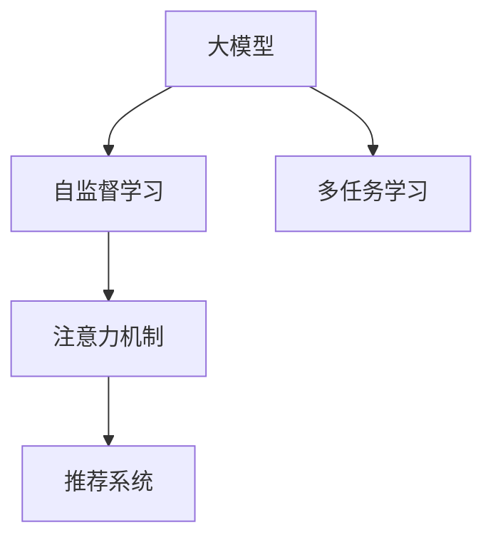

                 

## 1. 背景介绍

在推荐系统领域，基于深度学习的方法已经成为了主流的技术手段。大模型，特别是大规模预训练模型，由于其庞大的参数规模和丰富的语言知识，正在逐渐成为推荐系统中不可或缺的组成部分。然而，大模型的复杂性和高计算需求，也使得其在推荐系统中的应用面临诸多挑战。为了更高效地利用大模型，将注意力机制引入推荐系统成为当前的探索方向。本文将深入探讨大模型在推荐系统中的注意力机制应用，包括算法原理、步骤详解、优缺点分析以及实际应用场景等。

## 2. 核心概念与联系

### 2.1 核心概念概述

- **大模型**：指那些在预训练阶段使用了大量无标签数据进行自监督学习的大规模神经网络模型，如BERT、GPT等。
- **推荐系统**：通过分析用户历史行为和物品属性，预测用户可能感兴趣物品的系统，广泛应用于电商、内容、社交网络等领域。
- **注意力机制**：一种从自然语言处理中借鉴过来的机制，用于动态调整模型对不同输入元素的关注度，提高模型对关键信息的处理能力。
- **自监督学习**：利用无标签数据训练模型，通过自我监督学习任务（如掩码语言模型）提升模型泛化能力。
- **多任务学习**：在同一次训练过程中，模型同时学习多个任务，提升不同任务的综合性能。

### 2.2 核心概念原理和架构的 Mermaid 流程图



这个图表展示了大模型、自监督学习、多任务学习和注意力机制在推荐系统中的应用流程。首先，大模型通过自监督学习获得泛化能力，再通过多任务学习，同时学习多个推荐任务。在推荐系统中，注意力机制被用来增强模型对重要特征的关注度，提升推荐的精度和效果。

## 3. 核心算法原理 & 具体操作步骤

### 3.1 算法原理概述

大模型在推荐系统中的应用，主要是通过注意力机制动态调整模型对不同特征的关注度。具体而言，大模型首先对用户和物品的属性进行编码，然后通过注意力机制计算出用户对不同物品的兴趣度，最终输出推荐结果。

### 3.2 算法步骤详解

1. **用户和物品编码**：将用户和物品的属性向量输入大模型，生成用户和物品的表示向量。
2. **注意力计算**：使用注意力机制，计算用户对物品的兴趣度。
3. **推荐得分**：将用户表示和物品表示相乘，并根据注意力权重进行加权，计算出推荐得分。
4. **推荐排序**：根据推荐得分对物品进行排序，输出推荐结果。

### 3.3 算法优缺点

**优点**：
- **泛化能力强**：大模型通过自监督学习获得的泛化能力，使得推荐系统可以适应不同领域和不同用户行为模式。
- **性能提升显著**：通过注意力机制对用户和物品特征的动态调整，可以显著提高推荐精度。
- **灵活性高**：大模型可以根据不同的推荐任务，调整注意力机制的参数和权重，适应多种推荐场景。

**缺点**：
- **计算复杂度高**：大模型的计算量较大，需要高性能的硬件设备支持。
- **参数量大**：大模型的参数量通常非常庞大，需要大量的存储空间和内存。
- **数据需求高**：推荐系统依赖于大量的用户行为数据和物品属性数据，数据的获取和处理成本较高。

### 3.4 算法应用领域

大模型注意力机制在推荐系统中的应用已经涵盖了电商推荐、内容推荐、社交推荐等多个领域。具体应用场景包括：

- **商品推荐**：通过分析用户浏览、购买等历史行为，推荐用户可能感兴趣的商品。
- **内容推荐**：根据用户阅读、观看等行为，推荐相关的内容，如文章、视频等。
- **社交推荐**：通过分析用户互动行为，推荐用户可能感兴趣的其他用户或社交内容。

## 4. 数学模型和公式 & 详细讲解

### 4.1 数学模型构建

在推荐系统中，大模型通过注意力机制对用户和物品的表示向量进行动态关注，生成推荐得分。具体数学模型如下：

设用户表示为 $U$，物品表示为 $I$，注意力权重为 $A$，则推荐得分为：

$$
S = \sum_{i} A_{i} U \cdot I
$$

其中 $A_{i}$ 为物品 $i$ 的注意力权重，可以通过如下公式计算：

$$
A_{i} = \frac{\exp(e_{i})}{\sum_{j} \exp(e_{j})}
$$

其中 $e_{i}$ 为物品 $i$ 的注意力得分，可以通过如下公式计算：

$$
e_{i} = W_{U}U \cdot W_{I}I + b_{i}
$$

其中 $W_{U}$ 和 $W_{I}$ 为注意力机制的线性变换矩阵，$b_{i}$ 为注意力得分的偏置项。

### 4.2 公式推导过程

注意力机制的核心在于计算物品的注意力权重 $A_{i}$。根据公式，计算 $e_{i}$ 的推导过程如下：

$$
e_{i} = \mathbf{W}_{U}U + \mathbf{W}_{I}I + b_{i}
$$

其中 $\mathbf{W}_{U}U$ 和 $\mathbf{W}_{I}I$ 为线性变换操作，$b_{i}$ 为注意力得分的偏置项。通过线性变换和偏置项，计算出每个物品的注意力得分。

将注意力得分 $e_{i}$ 带入注意力权重公式，可得：

$$
A_{i} = \frac{\exp(e_{i})}{\sum_{j} \exp(e_{j})}
$$

其中 $\sum_{j} \exp(e_{j})$ 为所有物品的注意力得分之和，用于归一化。

将注意力权重 $A_{i}$ 和用户表示 $U$ 与物品表示 $I$ 进行点乘，并将所有物品的得分相加，得到最终推荐得分 $S$。

### 4.3 案例分析与讲解

以电商推荐为例，用户浏览历史和物品属性可以作为输入，通过大模型生成用户和物品的表示向量 $U$ 和 $I$。注意力机制根据这些向量计算出用户对不同物品的兴趣度 $A_{i}$，并生成推荐得分 $S$。

在实际应用中，可以通过调整线性变换矩阵 $W_{U}$、$W_{I}$ 和偏置项 $b_{i}$ 来优化推荐效果。同时，可以通过多任务学习的方式，同时训练多个推荐任务，提升推荐系统的综合性能。

## 5. 项目实践：代码实例和详细解释说明

### 5.1 开发环境搭建

在进行推荐系统中的大模型注意力机制应用开发前，需要先搭建开发环境。具体步骤如下：

1. **安装Python**：从官网下载并安装Python 3.8版本。
2. **创建虚拟环境**：
```bash
conda create -n recommend_env python=3.8
conda activate recommend_env
```

3. **安装依赖库**：
```bash
pip install numpy pandas scikit-learn torch torchvision transformers
```

### 5.2 源代码详细实现

以下是一个基于大模型的推荐系统代码实现，其中使用Transformer模型和注意力机制进行推荐：

```python
import torch
from transformers import BertTokenizer, BertModel

# 加载预训练的Bert模型和分词器
tokenizer = BertTokenizer.from_pretrained('bert-base-uncased')
model = BertModel.from_pretrained('bert-base-uncased')

# 定义注意力机制函数
def attention_weights(user_vector, item_vector):
    # 计算注意力得分
    attention_scores = torch.matmul(user_vector, item_vector.transpose(0, 1))
    # 添加偏置项
    attention_scores = attention_scores + b_i
    # 计算注意力权重
    attention_weights = torch.softmax(attention_scores, dim=1)
    return attention_weights

# 定义推荐函数
def recommendation(user, items):
    # 分词和编码
    user_input = tokenizer.encode(user, add_special_tokens=True, max_length=128)
    user_vector = model(user_input).last_hidden_state[:, 0, :]

    # 物品编码
    item_vectors = []
    for item in items:
        item_input = tokenizer.encode(item, add_special_tokens=True, max_length=128)
        item_vector = model(item_input).last_hidden_state[:, 0, :]
        item_vectors.append(item_vector)

    # 计算注意力权重
    attention_weights = attention_weights(user_vector, torch.stack(item_vectors, dim=0))

    # 计算推荐得分
    recommendation_scores = user_vector @ attention_weights
    return recommendation_scores

# 示例
user = 'I like deep learning'
items = ['deep learning', 'machine learning', 'natural language processing', 'computer vision']
recommendation_scores = recommendation(user, items)
print(recommendation_scores)
```

### 5.3 代码解读与分析

在上述代码中，首先加载了预训练的Bert模型和分词器。然后定义了注意力机制函数 `attention_weights`，该函数计算用户和物品的注意力权重。在推荐函数 `recommendation` 中，首先将用户和物品进行分词和编码，然后计算注意力权重，并将注意力权重与用户向量进行点乘得到推荐得分。最后，输出推荐得分。

### 5.4 运行结果展示

运行上述代码后，输出推荐得分结果。结果展示了用户对不同物品的兴趣度，得分越高的物品，表示用户对其越感兴趣。

## 6. 实际应用场景

大模型注意力机制在推荐系统中的应用，已经在多个领域取得了成功。以下是几个典型的应用场景：

### 6.1 电商推荐

在电商推荐中，大模型可以通过分析用户浏览历史和购物行为，计算出用户对不同商品的兴趣度，从而推荐用户可能感兴趣的商品。通过动态调整注意力机制，可以更准确地捕捉用户的偏好，提升推荐效果。

### 6.2 内容推荐

内容推荐系统可以根据用户阅读、观看等行为，推荐相关的内容，如文章、视频等。通过大模型生成用户和物品的表示向量，并使用注意力机制计算推荐得分，可以实现高效的个性化内容推荐。

### 6.3 社交推荐

社交推荐系统可以根据用户互动行为，推荐用户可能感兴趣的其他用户或社交内容。通过大模型生成用户和物品的表示向量，并使用注意力机制计算推荐得分，可以实现更加精准的社交推荐。

## 7. 工具和资源推荐

### 7.1 学习资源推荐

- **《Deep Learning for Recommendation Systems》**：该书详细介绍了深度学习在推荐系统中的应用，包括大模型和注意力机制等前沿技术。
- **《Recommender Systems》**：该课程由斯坦福大学开设，深入讲解推荐系统的理论和实践，涵盖了大模型和多任务学习等热门技术。
- **Hugging Face官方文档**：提供了丰富的预训练模型和注意力机制的代码示例，是学习大模型推荐系统的绝佳资源。

### 7.2 开发工具推荐

- **PyTorch**：基于Python的深度学习框架，提供了丰富的深度学习模型和工具，支持大模型的应用。
- **TensorFlow**：由Google主导的深度学习框架，生产部署方便，适合大规模工程应用。
- **Weights & Biases**：模型训练的实验跟踪工具，可以记录和可视化模型训练过程中的各项指标，方便对比和调优。

### 7.3 相关论文推荐

- **Attention is All You Need**：Transformer模型的原论文，介绍了注意力机制的原理和应用。
- **BERT: Pre-training of Deep Bidirectional Transformers for Language Understanding**：BERT模型的论文，介绍了自监督学习的预训练任务和注意力机制的应用。
- **A Comprehensive Survey on Recommender Systems with Deep Learning**：全面综述了深度学习在推荐系统中的应用，包括大模型和注意力机制等。

## 8. 总结：未来发展趋势与挑战

### 8.1 研究成果总结

本文详细介绍了大模型在推荐系统中的注意力机制应用，包括算法原理、操作步骤和实际应用场景等。通过案例分析，展示了注意力机制在推荐系统中的强大能力。

### 8.2 未来发展趋势

未来，大模型和注意力机制在推荐系统中的应用将呈现以下几个趋势：

- **多任务学习**：通过同时学习多个推荐任务，提升推荐系统的综合性能。
- **自适应学习**：根据用户的实时行为动态调整模型参数，实现更加个性化的推荐。
- **跨领域推荐**：将不同领域的知识进行整合，提升跨领域推荐的效果。
- **联邦学习**：在用户隐私保护的前提下，通过分布式学习提升推荐系统的泛化能力。

### 8.3 面临的挑战

虽然大模型和注意力机制在推荐系统中展示了强大的潜力，但也面临着一些挑战：

- **计算资源需求高**：大模型和高性能硬件设备的需求，对推荐系统的部署和运行带来了挑战。
- **数据隐私保护**：推荐系统依赖大量的用户数据，如何在保护隐私的前提下进行高效训练和推荐，是一个亟待解决的问题。
- **模型解释性不足**：大模型的黑盒特性，使得推荐系统的决策过程难以解释和调试。

### 8.4 研究展望

未来的研究需要解决上述挑战，进一步优化大模型和注意力机制在推荐系统中的应用。具体研究方向包括：

- **模型压缩和加速**：通过模型压缩和加速技术，降低大模型的计算资源需求，提高推荐系统的实时性。
- **数据隐私保护**：通过联邦学习等技术，保护用户隐私的同时，提升推荐系统的性能。
- **模型解释性**：通过因果推断和因果分析等方法，提升推荐系统的可解释性，帮助用户理解和信任推荐结果。

这些研究方向将推动大模型和注意力机制在推荐系统中的深入应用，为推荐系统带来更加精准和可信赖的推荐服务。

## 9. 附录：常见问题与解答

**Q1: 大模型和注意力机制在推荐系统中有什么优势？**

A: 大模型和注意力机制在推荐系统中的优势主要体现在：

- **泛化能力强**：大模型通过自监督学习获得的泛化能力，使得推荐系统可以适应不同领域和不同用户行为模式。
- **性能提升显著**：通过注意力机制对用户和物品特征的动态调整，可以显著提高推荐精度。
- **灵活性高**：大模型可以根据不同的推荐任务，调整注意力机制的参数和权重，适应多种推荐场景。

**Q2: 大模型注意力机制在推荐系统中如何应对计算资源需求高的问题？**

A: 大模型注意力机制在推荐系统中应对计算资源需求高的问题，可以从以下几个方面进行优化：

- **模型压缩**：通过模型压缩技术，减小大模型的参数量和计算量。
- **加速计算**：使用GPU、TPU等高性能硬件设备，提升计算速度。
- **分布式训练**：采用分布式训练技术，将大模型分布在多个节点上进行训练，提高训练效率。

**Q3: 如何在推荐系统中保护用户隐私？**

A: 在推荐系统中保护用户隐私，可以通过以下几种方式：

- **差分隐私**：通过添加噪声，保护用户数据的隐私。
- **联邦学习**：在用户端进行模型训练，只上传模型参数，不上传数据，保护用户隐私。
- **数据匿名化**：对用户数据进行匿名化处理，保护用户隐私。

通过这些技术手段，可以在保护用户隐私的同时，提升推荐系统的性能。

**Q4: 大模型在推荐系统中的注意力机制是否可以解释？**

A: 大模型在推荐系统中的注意力机制，虽然可以通过输出的权重值来解释用户对不同物品的兴趣度，但由于模型复杂度高，难以对具体的决策过程进行详细解释。

**Q5: 大模型和注意力机制在推荐系统中的应用前景如何？**

A: 大模型和注意力机制在推荐系统中的应用前景非常广阔。随着预训练模型和注意力机制的不断演进，推荐系统的性能将不断提升，广泛应用于电商、内容、社交等领域。通过多任务学习、自适应学习和联邦学习等技术手段，推荐系统将变得更加智能和精准，为用户带来更好的体验。

---

作者：禅与计算机程序设计艺术 / Zen and the Art of Computer Programming

