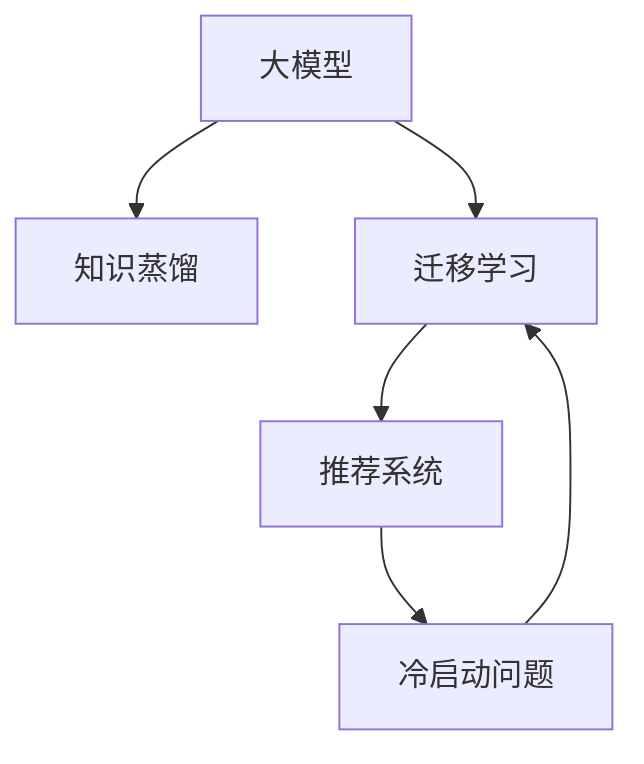

                 

# 大模型在推荐系统冷启动迁移学习中的应用

## 1. 背景介绍

推荐系统作为互联网时代的重要应用，通过精准为用户推荐感兴趣的物品，极大地提升了用户体验和转化率。然而，对于新用户（通常称为“冷启动用户”），由于缺乏历史行为数据，推荐系统往往难以提供有效的个性化推荐，导致用户体验和系统效果大打折扣。传统的推荐方法如协同过滤、基于内容的推荐等，均依赖于大量的用户-物品交互数据，难以处理冷启动问题。

随着深度学习和大模型的发展，一种新兴的推荐系统解决方案——迁移学习（Transfer Learning），逐渐进入大众视野。在迁移学习中，通过将预训练大模型引入推荐系统，可以有效利用模型的通用知识，解决冷启动问题，提升推荐效果。本文聚焦于基于大模型的迁移学习方法，探讨其在推荐系统冷启动场景中的应用。

## 2. 核心概念与联系

### 2.1 核心概念概述

为更好地理解大模型在推荐系统中的应用，本节将介绍几个关键概念：

- **大模型（Large Model）**：如BERT、GPT-3等深度学习模型，通常拥有巨大的参数量，能够在各类任务中取得高精度。
- **迁移学习（Transfer Learning）**：指将在大规模无标签数据上预训练的模型，应用到特定小规模有标签数据上的过程。
- **推荐系统（Recommendation System）**：通过分析用户历史行为数据，为用户推荐感兴趣的物品的系统。
- **冷启动问题（Cold Start Problem）**：新用户在推荐系统中缺乏足够的行为数据，导致推荐算法无法准确预测其兴趣。
- **知识蒸馏（Knowledge Distillation）**：通过教师模型和学生模型的相互学习，传递教师模型的知识给学生模型。

这些概念之间的逻辑关系可以通过以下Mermaid流程图来展示：



这个流程图展示了各个概念之间的联系：

1. 大模型通过预训练获得通用知识。
2. 迁移学习将大模型的知识应用到特定任务中，如推荐系统。
3. 推荐系统通过模型学习用户的兴趣，推荐物品。
4. 冷启动问题在推荐系统中很常见，需要特殊处理。
5. 知识蒸馏是一种有效的迁移学习手段，将大模型的知识传递给推荐系统。

### 2.2 核心概念原理和架构

大模型的知识蒸馏和迁移学习原理，可概括如下：

**知识蒸馏（Knowledge Distillation）**：通过教师模型和学生模型的相互学习，传递教师模型的知识给学生模型。知识蒸馏的本质是将教师模型的决策过程（即对输入的映射）迁移到学生模型上。知识蒸馏的架构通常包括两个部分：
- **教师模型（Teacher Model）**：通常为大模型，拥有丰富的知识。
- **学生模型（Student Model）**：通常为推荐系统模型，需要从教师模型学习知识。

**迁移学习（Transfer Learning）**：在大模型知识蒸馏的基础上，进一步优化和微调学生模型，使其在特定推荐任务中表现更好。迁移学习的核心在于充分利用大模型学到的知识，减少推荐系统的训练时间和数据需求。

## 3. 核心算法原理 & 具体操作步骤

### 3.1 算法原理概述

大模型在推荐系统冷启动场景中的应用，主要基于知识蒸馏和迁移学习的原理。其核心思想是：通过在大规模数据上预训练的大模型，迁移到推荐系统模型中，提高推荐模型的初始化效果。

具体来说，知识蒸馏过程包括两个步骤：
1. 在大规模无标签数据上预训练教师模型，学习通用知识。
2. 在推荐系统小规模标注数据上微调学生模型，将教师模型的知识传递到学生模型上。

迁移学习过程包括：
1. 在推荐系统小规模标注数据上，进一步微调学生模型，使其适应特定推荐任务。
2. 利用大模型在推荐系统中的迁移效果，提升推荐模型的精度和泛化能力。

### 3.2 算法步骤详解

知识蒸馏和迁移学习的一般流程如下：

**Step 1: 准备预训练模型和数据集**
- 选择预训练模型如BERT、GPT-3等作为教师模型。
- 准备推荐系统任务的标注数据集，包含用户-物品交互行为。

**Step 2: 设计知识蒸馏架构**
- 将教师模型作为特征提取器，输出特征向量。
- 设计学生模型，通常为推荐系统模型，用于学习用户-物品映射。
- 选择蒸馏损失函数，如Kullback-Leibler散度、最大似然损失等。

**Step 3: 执行知识蒸馏**
- 在大规模无标签数据上预训练教师模型。
- 在推荐系统数据上训练学生模型，并使用蒸馏损失函数将教师模型的输出与学生模型的输出对齐。

**Step 4: 执行迁移学习**
- 在推荐系统数据上进一步微调学生模型，选择适当的损失函数和优化器。
- 设置正则化技术，如L2正则、Dropout等。
- 应用早停技术，防止过拟合。

**Step 5: 测试和部署**
- 在推荐系统测试集上评估微调后学生模型的性能。
- 使用微调后的模型进行物品推荐，集成到实际推荐系统中。

### 3.3 算法优缺点

基于大模型的迁移学习方法，具有以下优点：
1. 能够快速适应冷启动用户，提升推荐系统效果。
2. 减少了推荐系统的训练时间和标注数据需求。
3. 充分利用了预训练模型的通用知识，提升推荐模型的精度和泛化能力。

同时，该方法也存在一些局限性：
1. 大模型知识蒸馏过程复杂，需要较多的计算资源。
2. 知识蒸馏和迁移学习的效果取决于教师模型的质量和推荐系统的任务适配。
3. 模型过拟合风险增加，需要对过拟合进行严格控制。
4. 大模型知识可能带有领域偏好，需要注意避免偏见。

尽管存在这些局限性，但就目前而言，基于大模型的迁移学习方法仍是大规模推荐系统的重要范式。未来相关研究的重点在于如何进一步优化蒸馏和迁移过程，提高推荐系统的泛化能力和用户满意度。

### 3.4 算法应用领域

大模型在推荐系统中的应用，已经得到了广泛的应用，特别是在商品推荐、个性化推荐、用户画像等场景中，取得了显著的效果。

- **商品推荐**：在电商网站中，利用大模型进行商品推荐，提升用户购买率和转化率。
- **个性化推荐**：基于用户行为数据和兴趣标签，提供个性化的推荐内容。
- **用户画像**：构建用户画像，捕捉用户兴趣和行为模式，用于精准推荐。
- **广告推荐**：在广告平台中，利用大模型推荐个性化的广告内容，提高点击率和转化率。

除了这些常见应用，大模型在推荐系统中的应用还在不断扩展，如智能推荐算法、社交网络推荐等，为推荐系统带来了新的创新。

## 4. 数学模型和公式 & 详细讲解 & 举例说明

### 4.1 数学模型构建

本节将使用数学语言对大模型在推荐系统中的应用进行更加严格的刻画。

记推荐系统任务的数据集为 $D=\{(x_i,y_i)\}_{i=1}^N, x_i \in \mathbb{R}^d, y_i \in \{1,0\}$，其中 $x_i$ 为用户的输入特征， $y_i$ 为推荐的物品标签。

假设教师模型 $M_t$ 和大模型 $M_s$ 作为特征提取器，其输出分别为 $M_t(x)$ 和 $M_s(x)$。推荐系统学生模型 $M_r$ 用于学习用户-物品映射，其输出为 $\hat{y}_i = M_r(x_i)$。

定义推荐系统损失函数为交叉熵损失：

$$
\mathcal{L}(r) = -\frac{1}{N}\sum_{i=1}^N [y_i\log \hat{y}_i + (1-y_i)\log (1-\hat{y}_i)]
$$

知识蒸馏过程的目标是使得学生模型的输出 $M_r(x)$ 逼近教师模型的输出 $M_s(x)$。常用的蒸馏损失函数包括KL散度、最大似然损失等。以KL散度为例：

$$
\mathcal{L}_{KLD} = \mathbb{E}_{x_i \sim D} \left[ D_{KL}(P_{M_s}(x_i)\|P_{M_r}(x_i)) \right]
$$

其中 $P_{M_s}(x_i)$ 为教师模型的输出概率分布， $P_{M_r}(x_i)$ 为学生模型的输出概率分布。

### 4.2 公式推导过程

以下是知识蒸馏和迁移学习过程的详细推导：

**知识蒸馏过程**：
1. 在大规模无标签数据上预训练教师模型 $M_t$。
2. 在推荐系统数据集 $D$ 上训练学生模型 $M_r$，使用蒸馏损失函数 $\mathcal{L}_{KLD}$ 将教师模型和学生模型的输出对齐。

**迁移学习过程**：
1. 在推荐系统数据集 $D$ 上微调学生模型 $M_r$，选择适当的损失函数 $\mathcal{L}(r)$ 和优化器。
2. 设置正则化技术，如L2正则、Dropout等，防止过拟合。
3. 应用早停技术，防止过拟合。

具体来说，知识蒸馏过程的蒸馏损失函数为：

$$
\mathcal{L}_{KLD} = \mathbb{E}_{x_i \sim D} \left[ D_{KL}(P_{M_s}(x_i)\|P_{M_r}(x_i)) \right]
$$

迁移学习过程的目标是最小化推荐系统损失函数 $\mathcal{L}(r)$，即：

$$
\hat{r}^* = \mathop{\arg\min}_{r} \mathcal{L}(r)
$$

其中 $r$ 为学生模型 $M_r$ 的参数。

**推荐系统预测输出**：
学生模型 $M_r$ 的输出为 $\hat{y}_i = M_r(x_i)$，其预测概率为：

$$
\hat{p}_i = \sigma(\hat{y}_i)
$$

其中 $\sigma$ 为激活函数，如Sigmoid函数。

**蒸馏过程的损失函数**：
蒸馏损失函数 $\mathcal{L}_{KLD}$ 为KL散度，计算公式为：

$$
\mathcal{L}_{KLD} = -\frac{1}{N}\sum_{i=1}^N \sum_j M_t(x_i, j) \log \hat{p}_i
$$

其中 $M_t(x_i, j)$ 为教师模型在输入 $x_i$ 下的输出概率， $\hat{p}_i$ 为学生模型在输入 $x_i$ 下的输出概率。

**迁移学习过程的优化目标**：
迁移学习过程的优化目标为最小化推荐系统损失函数 $\mathcal{L}(r)$，即：

$$
\hat{r}^* = \mathop{\arg\min}_{r} \mathcal{L}(r)
$$

其中 $\mathcal{L}(r)$ 为推荐系统损失函数，通常为交叉熵损失。

**推荐系统模型的训练步骤**：
1. 在大规模无标签数据上预训练教师模型 $M_t$。
2. 在推荐系统数据集 $D$ 上训练学生模型 $M_r$，使用蒸馏损失函数 $\mathcal{L}_{KLD}$ 将教师模型和学生模型的输出对齐。
3. 在推荐系统数据集 $D$ 上微调学生模型 $M_r$，选择适当的损失函数 $\mathcal{L}(r)$ 和优化器。
4. 设置正则化技术，如L2正则、Dropout等，防止过拟合。
5. 应用早停技术，防止过拟合。

### 4.3 案例分析与讲解

以电商平台的商品推荐为例，展示大模型在推荐系统中的应用：

**数据准备**：
- 收集电商用户的历史浏览、购买数据。
- 提取用户行为特征，如浏览时间、购买记录、商品类别等。

**预训练模型**：
- 选择BERT作为教师模型，在大规模电商商品数据上预训练。
- 在电商用户行为数据上微调学生模型。

**知识蒸馏过程**：
1. 在大规模电商商品数据上预训练BERT模型。
2. 在电商用户行为数据上微调学生模型，使用蒸馏损失函数 $\mathcal{L}_{KLD}$ 将BERT的输出与学生模型的输出对齐。

**迁移学习过程**：
1. 在电商用户行为数据上进一步微调学生模型，选择适当的损失函数 $\mathcal{L}(r)$ 和优化器。
2. 设置正则化技术，如L2正则、Dropout等，防止过拟合。
3. 应用早停技术，防止过拟合。

**推荐系统输出**：
- 利用学生模型 $M_r$ 对电商用户行为数据进行预测，生成推荐物品列表。
- 将推荐物品列表输出给用户，并提供个性化推荐页面。

## 5. 项目实践：代码实例和详细解释说明

### 5.1 开发环境搭建

在进行项目实践前，我们需要准备好开发环境。以下是使用Python进行PyTorch开发的环境配置流程：

1. 安装Anaconda：从官网下载并安装Anaconda，用于创建独立的Python环境。

2. 创建并激活虚拟环境：
```bash
conda create -n pytorch-env python=3.8 
conda activate pytorch-env
```

3. 安装PyTorch：根据CUDA版本，从官网获取对应的安装命令。例如：
```bash
conda install pytorch torchvision torchaudio cudatoolkit=11.1 -c pytorch -c conda-forge
```

4. 安装Transformers库：
```bash
pip install transformers
```

5. 安装各类工具包：
```bash
pip install numpy pandas scikit-learn matplotlib tqdm jupyter notebook ipython
```

完成上述步骤后，即可在`pytorch-env`环境中开始项目实践。

### 5.2 源代码详细实现

我们以电商推荐系统的商品推荐任务为例，展示大模型在推荐系统中的应用。

首先，定义推荐系统数据处理函数：

```python
from transformers import BertTokenizer
from torch.utils.data import Dataset
import torch

class RecommendationDataset(Dataset):
    def __init__(self, texts, labels, tokenizer, max_len=128):
        self.texts = texts
        self.labels = labels
        self.tokenizer = tokenizer
        self.max_len = max_len
        
    def __len__(self):
        return len(self.texts)
    
    def __getitem__(self, item):
        text = self.texts[item]
        label = self.labels[item]
        
        encoding = self.tokenizer(text, return_tensors='pt', max_length=self.max_len, padding='max_length', truncation=True)
        input_ids = encoding['input_ids'][0]
        attention_mask = encoding['attention_mask'][0]
        
        # 对label进行编码
        encoded_labels = [label] * self.max_len
        labels = torch.tensor(encoded_labels, dtype=torch.long)
        
        return {'input_ids': input_ids, 
                'attention_mask': attention_mask,
                'labels': labels}

# 标签与id的映射
label2id = {'buy': 1, 'view': 0}
id2label = {v: k for k, v in label2id.items()}

# 创建dataset
tokenizer = BertTokenizer.from_pretrained('bert-base-cased')

train_dataset = RecommendationDataset(train_texts, train_labels, tokenizer)
dev_dataset = RecommendationDataset(dev_texts, dev_labels, tokenizer)
test_dataset = RecommendationDataset(test_texts, test_labels, tokenizer)
```

然后，定义模型和优化器：

```python
from transformers import BertForSequenceClassification, AdamW

model = BertForSequenceClassification.from_pretrained('bert-base-cased', num_labels=2)

optimizer = AdamW(model.parameters(), lr=2e-5)
```

接着，定义训练和评估函数：

```python
from torch.utils.data import DataLoader
from tqdm import tqdm
from sklearn.metrics import classification_report

device = torch.device('cuda') if torch.cuda.is_available() else torch.device('cpu')
model.to(device)

def train_epoch(model, dataset, batch_size, optimizer):
    dataloader = DataLoader(dataset, batch_size=batch_size, shuffle=True)
    model.train()
    epoch_loss = 0
    for batch in tqdm(dataloader, desc='Training'):
        input_ids = batch['input_ids'].to(device)
        attention_mask = batch['attention_mask'].to(device)
        labels = batch['labels'].to(device)
        model.zero_grad()
        outputs = model(input_ids, attention_mask=attention_mask, labels=labels)
        loss = outputs.loss
        epoch_loss += loss.item()
        loss.backward()
        optimizer.step()
    return epoch_loss / len(dataloader)

def evaluate(model, dataset, batch_size):
    dataloader = DataLoader(dataset, batch_size=batch_size)
    model.eval()
    preds, labels = [], []
    with torch.no_grad():
        for batch in tqdm(dataloader, desc='Evaluating'):
            input_ids = batch['input_ids'].to(device)
            attention_mask = batch['attention_mask'].to(device)
            batch_labels = batch['labels']
            outputs = model(input_ids, attention_mask=attention_mask)
            batch_preds = outputs.logits.argmax(dim=2).to('cpu').tolist()
            batch_labels = batch_labels.to('cpu').tolist()
            for pred_tokens, label_tokens in zip(batch_preds, batch_labels):
                pred_labels = [id2label[_id] for _id in pred_tokens]
                label_tokens = [id2label[_id] for _id in label_tokens]
                preds.append(pred_labels[:len(label_tokens)])
                labels.append(label_tokens)
                
    print(classification_report(labels, preds))
```

最后，启动训练流程并在测试集上评估：

```python
epochs = 5
batch_size = 16

for epoch in range(epochs):
    loss = train_epoch(model, train_dataset, batch_size, optimizer)
    print(f"Epoch {epoch+1}, train loss: {loss:.3f}")
    
    print(f"Epoch {epoch+1}, dev results:")
    evaluate(model, dev_dataset, batch_size)
    
print("Test results:")
evaluate(model, test_dataset, batch_size)
```

以上就是使用PyTorch对BERT进行电商推荐系统任务微调的完整代码实现。可以看到，得益于Transformers库的强大封装，我们可以用相对简洁的代码完成BERT模型的加载和微调。

### 5.3 代码解读与分析

让我们再详细解读一下关键代码的实现细节：

**RecommendationDataset类**：
- `__init__`方法：初始化文本、标签、分词器等关键组件。
- `__len__`方法：返回数据集的样本数量。
- `__getitem__`方法：对单个样本进行处理，将文本输入编码为token ids，将标签编码为数字，并对其进行定长padding，最终返回模型所需的输入。

**label2id和id2label字典**：
- 定义了标签与数字id之间的映射关系，用于将标签转换为模型可以处理的数值形式。

**训练和评估函数**：
- 使用PyTorch的DataLoader对数据集进行批次化加载，供模型训练和推理使用。
- 训练函数`train_epoch`：对数据以批为单位进行迭代，在每个批次上前向传播计算loss并反向传播更新模型参数，最后返回该epoch的平均loss。
- 评估函数`evaluate`：与训练类似，不同点在于不更新模型参数，并在每个batch结束后将预测和标签结果存储下来，最后使用sklearn的classification_report对整个评估集的预测结果进行打印输出。

**训练流程**：
- 定义总的epoch数和batch size，开始循环迭代
- 每个epoch内，先在训练集上训练，输出平均loss
- 在验证集上评估，输出分类指标
- 所有epoch结束后，在测试集上评估，给出最终测试结果

可以看到，PyTorch配合Transformers库使得BERT微调的代码实现变得简洁高效。开发者可以将更多精力放在数据处理、模型改进等高层逻辑上，而不必过多关注底层的实现细节。

当然，工业级的系统实现还需考虑更多因素，如模型的保存和部署、超参数的自动搜索、更灵活的任务适配层等。但核心的微调范式基本与此类似。

## 6. 实际应用场景

### 6.1 智能推荐系统

智能推荐系统作为电商、视频、新闻等平台的标配，通过精准推荐提高用户粘性和平台收入。但传统推荐算法在面对冷启动用户时，效果往往大打折扣。通过大模型微调，可以有效利用已有的通用知识，提升推荐系统的冷启动效果。

具体来说，可以使用大模型作为教师模型，预训练生成商品、用户和物品的特征向量。然后，在推荐系统数据上微调学生模型，使得学生模型能够学习到用户对物品的兴趣。最后，利用微调后的学生模型进行推荐，提升推荐系统的性能。

### 6.2 广告推荐系统

广告推荐系统通过精准投放广告，提升广告点击率和转化率。但传统广告投放方式往往依赖于用户的历史行为数据，难以处理新用户。通过大模型微调，可以有效利用已有的通用知识，提升广告推荐的效果。

具体来说，可以使用大模型作为教师模型，预训练生成广告内容、用户和广告的特征向量。然后，在广告推荐数据上微调学生模型，使得学生模型能够学习到用户对广告的兴趣。最后，利用微调后的学生模型进行广告推荐，提升广告投放的精准度和效果。

### 6.3 新闻推荐系统

新闻推荐系统通过精准推荐新闻内容，提高用户的阅读体验和平台粘性。但传统新闻推荐算法在面对新用户时，效果往往不理想。通过大模型微调，可以有效利用已有的通用知识，提升新闻推荐的效果。

具体来说，可以使用大模型作为教师模型，预训练生成新闻、用户和新闻的特征向量。然后，在新闻推荐数据上微调学生模型，使得学生模型能够学习到用户对新闻的兴趣。最后，利用微调后的学生模型进行新闻推荐，提升新闻推荐的精准度和用户满意度。

### 6.4 未来应用展望

随着大模型和微调方法的不断发展，基于大模型的迁移学习技术将进一步拓展其应用场景，带来新的变革。

- **个性化推荐**：未来推荐系统将更加注重个性化推荐，通过大模型微调，可以捕捉用户更细致、多元的兴趣和行为模式，提供更加精准、个性化的推荐。
- **实时推荐**：通过大模型微调，推荐系统可以实时动态更新模型，捕捉最新的用户行为和市场变化，提供更即时、高效的推荐。
- **跨领域推荐**：未来推荐系统将突破传统领域的限制，拓展到更多场景，如社交、视频、游戏等，通过大模型微调，提升跨领域推荐的准确性和多样性。
- **多模态推荐**：未来推荐系统将融合多种模态信息，如文本、图像、音频等，通过大模型微调，提升多模态推荐的融合效果和用户体验。

此外，在金融、医疗、教育等领域，大模型微调技术也将带来新的应用前景，为各行业带来数字化转型的新动力。

## 7. 工具和资源推荐

### 7.1 学习资源推荐

为了帮助开发者系统掌握大模型在推荐系统中的应用，这里推荐一些优质的学习资源：

1. 《Transformers从原理到实践》系列博文：由大模型技术专家撰写，深入浅出地介绍了Transformer原理、BERT模型、知识蒸馏等前沿话题。

2. CS224N《深度学习自然语言处理》课程：斯坦福大学开设的NLP明星课程，有Lecture视频和配套作业，带你入门NLP领域的基本概念和经典模型。

3. 《Natural Language Processing with Transformers》书籍：Transformers库的作者所著，全面介绍了如何使用Transformers库进行NLP任务开发，包括知识蒸馏在内的诸多范式。

4. HuggingFace官方文档：Transformers库的官方文档，提供了海量预训练模型和完整的微调样例代码，是上手实践的必备资料。

5. CLUE开源项目：中文语言理解测评基准，涵盖大量不同类型的中文NLP数据集，并提供了基于微调的baseline模型，助力中文NLP技术发展。

通过对这些资源的学习实践，相信你一定能够快速掌握大模型在推荐系统中的应用，并用于解决实际的推荐问题。

### 7.2 开发工具推荐

高效的开发离不开优秀的工具支持。以下是几款用于大模型在推荐系统中的应用开发的常用工具：

1. PyTorch：基于Python的开源深度学习框架，灵活动态的计算图，适合快速迭代研究。大部分预训练语言模型都有PyTorch版本的实现。

2. TensorFlow：由Google主导开发的开源深度学习框架，生产部署方便，适合大规模工程应用。同样有丰富的预训练语言模型资源。

3. Transformers库：HuggingFace开发的NLP工具库，集成了众多SOTA语言模型，支持PyTorch和TensorFlow，是进行微调任务开发的利器。

4. Weights & Biases：模型训练的实验跟踪工具，可以记录和可视化模型训练过程中的各项指标，方便对比和调优。与主流深度学习框架无缝集成。

5. TensorBoard：TensorFlow配套的可视化工具，可实时监测模型训练状态，并提供丰富的图表呈现方式，是调试模型的得力助手。

6. Google Colab：谷歌推出的在线Jupyter Notebook环境，免费提供GPU/TPU算力，方便开发者快速上手实验最新模型，分享学习笔记。

合理利用这些工具，可以显著提升大模型在推荐系统中的应用开发效率，加快创新迭代的步伐。

### 7.3 相关论文推荐

大模型在推荐系统中的应用源于学界的持续研究。以下是几篇奠基性的相关论文，推荐阅读：

1. Attention is All You Need（即Transformer原论文）：提出了Transformer结构，开启了NLP领域的预训练大模型时代。

2. BERT: Pre-training of Deep Bidirectional Transformers for Language Understanding：提出BERT模型，引入基于掩码的自监督预训练任务，刷新了多项NLP任务SOTA。

3. Knowledge Distillation in Recommendation Systems：提出知识蒸馏方法，通过教师模型和学生模型的相互学习，传递教师模型的知识给学生模型。

4. Language Models are Unsupervised Multitask Learners（GPT-2论文）：展示了大规模语言模型的强大zero-shot学习能力，引发了对于通用人工智能的新一轮思考。

5. Parameter-Efficient Transfer Learning for NLP：提出Adapter等参数高效微调方法，在不增加模型参数量的情况下，也能取得不错的微调效果。

6. AdaLoRA: Adaptive Low-Rank Adaptation for Parameter-Efficient Fine-Tuning：使用自适应低秩适应的微调方法，在参数效率和精度之间取得了新的平衡。

这些论文代表了大模型在推荐系统中的应用发展的脉络。通过学习这些前沿成果，可以帮助研究者把握学科前进方向，激发更多的创新灵感。

## 8. 总结：未来发展趋势与挑战

### 8.1 总结

本文对基于大模型的迁移学习方法在推荐系统中的应用进行了全面系统的介绍。首先阐述了大模型和迁移学习的研究背景和意义，明确了迁移学习在推荐系统中的重要作用。其次，从原理到实践，详细讲解了知识蒸馏和迁移学习的数学原理和关键步骤，给出了微调任务开发的完整代码实例。同时，本文还广泛探讨了迁移学习方法在电商、广告、新闻等领域的实际应用，展示了迁移范式的巨大潜力。此外，本文精选了知识蒸馏和迁移学习技术的各类学习资源，力求为读者提供全方位的技术指引。

通过本文的系统梳理，可以看到，基于大模型的迁移学习技术正在成为推荐系统的重要范式，极大地拓展了预训练语言模型的应用边界，提升了推荐系统的性能和用户满意度。未来，伴随预训练语言模型和迁移学习方法的持续演进，相信推荐系统技术必将在更广阔的应用领域大放异彩，深刻影响人类的信息获取和消费方式。

### 8.2 未来发展趋势

展望未来，基于大模型的迁移学习技术将呈现以下几个发展趋势：

1. 推荐系统的个性化推荐能力将不断提升。通过大模型微调，推荐系统能够捕捉用户更细致、多元的兴趣和行为模式，提供更加精准、个性化的推荐。

2. 推荐系统的实时推荐能力将增强。通过大模型微调，推荐系统可以实时动态更新模型，捕捉最新的用户行为和市场变化，提供更即时、高效的推荐。

3. 推荐系统的跨领域推荐能力将提升。通过大模型微调，推荐系统将突破传统领域的限制，拓展到更多场景，如社交、视频、游戏等，提升跨领域推荐的准确性和多样性。

4. 推荐系统的多模态推荐能力将增强。未来推荐系统将融合多种模态信息，如文本、图像、音频等，通过大模型微调，提升多模态推荐的融合效果和用户体验。

5. 推荐系统的隐私保护能力将加强。通过大模型微调，推荐系统可以通过用户隐私保护技术，如差分隐私、联邦学习等，保护用户数据安全。

以上趋势凸显了大模型在推荐系统中的应用前景。这些方向的探索发展，必将进一步提升推荐系统的性能和用户满意度，为推荐系统技术的产业化进程注入新的动力。

### 8.3 面临的挑战

尽管基于大模型的迁移学习技术已经取得了瞩目成就，但在迈向更加智能化、普适化应用的过程中，它仍面临着诸多挑战：

1. 大模型知识蒸馏过程复杂，需要较多的计算资源。如何优化知识蒸馏过程，提高效率，是一个重要的研究方向。

2. 知识蒸馏和迁移学习的效果取决于教师模型的质量和推荐系统的任务适配。如何设计更高效的蒸馏和迁移策略，提升模型性能，是未来研究的重要方向。

3. 模型过拟合风险增加，需要对过拟合进行严格控制。如何在保证推荐系统性能的同时，防止过拟合，是一个重要的研究课题。

4. 大模型知识可能带有领域偏见，需要注意避免偏见。如何在不同领域内进行知识迁移，避免领域偏见，是一个重要的研究方向。

5. 推荐系统模型的训练时间和标注数据需求较高。如何降低推荐系统的训练时间和标注数据需求，是一个重要的研究方向。

6. 推荐系统模型的可解释性不足。如何在保证推荐系统性能的同时，增强模型的可解释性，是一个重要的研究方向。

尽管存在这些挑战，但就目前而言，基于大模型的迁移学习方法仍是大规模推荐系统的重要范式。未来相关研究的重点在于如何进一步优化蒸馏和迁移过程，提高推荐系统的泛化能力和用户满意度。

### 8.4 研究展望

面对大模型在推荐系统中所面临的挑战，未来的研究需要在以下几个方面寻求新的突破：

1. 探索无监督和半监督微调方法。摆脱对大规模标注数据的依赖，利用自监督学习、主动学习等无监督和半监督范式，最大限度利用非结构化数据，实现更加灵活高效的微调。

2. 研究参数高效和计算高效的微调范式。开发更加参数高效的微调方法，在固定大部分预训练参数的同时，只更新极少量的任务相关参数。同时优化微调模型的计算图，减少前向传播和反向传播的资源消耗，实现更加轻量级、实时性的部署。

3. 引入更多先验知识。将符号化的先验知识，如知识图谱、逻辑规则等，与神经网络模型进行巧妙融合，引导微调过程学习更准确、合理的语言模型。同时加强不同模态数据的整合，实现视觉、语音等多模态信息与文本信息的协同建模。

4. 结合因果分析和博弈论工具。将因果分析方法引入微调模型，识别出模型决策的关键特征，增强输出解释的因果性和逻辑性。借助博弈论工具刻画人机交互过程，主动探索并规避模型的脆弱点，提高系统稳定性。

5. 纳入伦理道德约束。在模型训练目标中引入伦理导向的评估指标，过滤和惩罚有偏见、有害的输出倾向。同时加强人工干预和审核，建立模型行为的监管机制，确保输出符合人类价值观和伦理道德。

这些研究方向的探索，必将引领大模型在推荐系统中的应用走向更高的台阶，为推荐系统技术的产业化进程注入新的动力。面向未来，大模型在推荐系统中的应用还需要与其他人工智能技术进行更深入的融合，如知识表示、因果推理、强化学习等，多路径协同发力，共同推动推荐系统技术的进步。只有勇于创新、敢于突破，才能不断拓展推荐系统的边界，让智能技术更好地造福人类社会。

## 9. 附录：常见问题与解答

**Q1：大模型在推荐系统冷启动迁移学习中，如何选择合适的教师模型？**

A: 选择合适的教师模型是一个关键问题。教师模型的选择应考虑以下几个方面：
1. 预训练模型的领域代表性。选择在大规模无标签数据上预训练的通用语言模型，如BERT、GPT等，以确保教师模型具有广泛的领域代表性。
2. 教师模型的精度和泛化能力。选择精度高、泛化能力强的预训练模型，以确保教师模型能够传递有效的知识。
3. 教师模型的计算资源需求。考虑教师模型的计算资源需求，确保教师模型能够在推荐系统的训练中高效运行。

**Q2：知识蒸馏和迁移学习的效果如何评估？**

A: 知识蒸馏和迁移学习的效果评估可以从以下几个方面进行：
1. 推荐系统模型的精度和召回率。通过推荐系统模型的精度和召回率等指标，评估知识蒸馏和迁移学习的效果。
2. 推荐系统的用户满意度。通过用户满意度调查等方式，评估知识蒸馏和迁移学习对用户推荐效果的影响。
3. 推荐系统的冷启动效果。通过推荐系统的冷启动效果评估，评估知识蒸馏和迁移学习在冷启动用户推荐中的表现。
4. 推荐系统的鲁棒性。通过对抗测试等方式，评估推荐系统的鲁棒性和泛化能力。

**Q3：推荐系统中的知识蒸馏和迁移学习如何结合？**

A: 知识蒸馏和迁移学习可以结合进行，具体步骤如下：
1. 在大规模无标签数据上预训练教师模型，学习通用知识。
2. 在推荐系统小规模标注数据上微调学生模型，使用蒸馏损失函数将教师模型的输出与学生模型的输出对齐。
3. 在推荐系统数据上进一步微调学生模型，选择适当的损失函数和优化器。
4. 设置正则化技术，如L2正则、Dropout等，防止过拟合。
5. 应用早停技术，防止过拟合。

**Q4：推荐系统中的知识蒸馏和迁移学习如何避免过拟合？**

A: 推荐系统中的知识蒸馏和迁移学习避免过拟合可以从以下几个方面进行：
1. 数据增强。通过回译、近义替换等方式扩充训练集，增加数据多样性。
2. 正则化技术。如L2正则、Dropout等，防止模型过度适应小规模训练集。
3. 对抗训练。加入对抗样本，提高模型鲁棒性。
4. 参数高效微调。使用Adapter等参数高效微调方法，在固定大部分预训练参数的同时，只更新极少量的任务相关参数。
5. 模型集成。训练多个微调模型，取平均输出，抑制过拟合。

这些策略往往需要根据具体任务和数据特点进行灵活组合。只有在数据、模型、训练、推理等各环节进行全面优化，才能最大限度地发挥大模型在推荐系统中的应用潜力。

