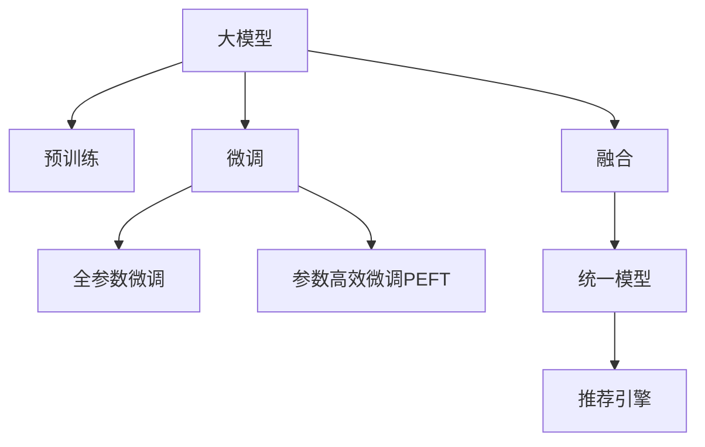

                 

# 大模型在推荐系统的未来发展：统一与融合趋势

> 关键词：大模型,推荐系统,统一模型,融合,神经网络,强化学习

## 1. 背景介绍

### 1.1 问题由来
随着互联网技术的发展，推荐系统已经成为现代信息系统中不可或缺的重要组成部分。推荐系统通过分析用户的浏览历史、点击行为、评分记录等数据，为用户推荐可能感兴趣的物品，从而提升用户体验和满意度。传统的推荐系统以协同过滤和基于内容的推荐为主，但随着用户数据量的增加，传统的推荐算法在计算复杂度和精度上都受到了挑战。

近年来，大模型在自然语言处理和计算机视觉等领域取得了巨大的成功，逐渐引起了推荐系统的研究者们的关注。利用大模型的自适应和泛化能力，推荐系统可以更全面地理解用户需求，提供更精准的个性化推荐。大模型推荐系统研究也成为新的热门方向，有望推动推荐系统的跨越式发展。

### 1.2 问题核心关键点
大模型在推荐系统中的应用，主要是通过在大规模无标签数据上进行预训练，学习用户和物品的表征，然后在特定任务上进行微调，构建推荐模型。这一过程被称为大模型推荐系统的统一与融合范式，其关键点在于：

- **预训练**：利用大规模无标签数据进行自监督学习，学习用户和物品的语义表征。
- **微调**：根据特定任务（如点击率预测、评分预测）的标注数据，对预训练模型进行有监督学习，微调模型参数。
- **融合**：将多个大模型进行组合，利用各自的优势，形成统一的推荐引擎。

这种统一与融合的范式，通过将大规模预训练和下游任务微调相结合，可以有效提升推荐系统的精度和多样性，实现更好的用户体验。

### 1.3 问题研究意义
研究大模型在推荐系统中的应用，对于推动推荐系统的智能化和个性化，具有重要的意义：

1. **提升推荐精度**：大模型的预训练和微调过程，可以学习到更加全面的用户和物品表征，提升推荐的准确性。
2. **增强推荐多样性**：大模型可以学习到更多的语义信息，帮助推荐系统提供更多元、更丰富的推荐内容。
3. **降低计算成本**：相对于传统推荐算法，大模型可以高效利用预训练过程，降低微调时的计算复杂度。
4. **促进跨领域应用**：大模型可以应用于多种推荐任务，如图文推荐、多模态推荐等，拓宽推荐系统的应用范围。
5. **推动产业化进程**：大模型推荐系统的研究成果可以转化为可商业化的算法和产品，加速推荐技术的产业化进程。

## 2. 核心概念与联系

### 2.1 核心概念概述

为更好地理解大模型在推荐系统中的应用，本节将介绍几个密切相关的核心概念：

- **大模型**：以自回归(如GPT)或自编码(如BERT)模型为代表的大规模预训练语言模型。通过在大规模无标签文本语料上进行预训练，学习通用的语言知识和常识，具备强大的语义理解能力。
- **预训练**：指在大规模无标签文本语料上，通过自监督学习任务训练通用语言模型的过程。常见的预训练任务包括言语建模、遮挡语言模型等。
- **微调**：指在预训练模型的基础上，使用下游任务的少量标注数据，通过有监督学习优化模型在特定任务上的性能。通常只需要调整顶层分类器或解码器，并以较小的学习率更新全部或部分的模型参数。
- **融合**：指将多个大模型进行组合，利用各自的优势，形成统一的推荐引擎。可以通过并行、串行、加权等不同方式进行模型融合。
- **统一模型**：指将预训练和微调过程统一起来，通过统一的模型结构进行推荐。常见的统一模型包括BERT、GPT等。

这些核心概念之间的逻辑关系可以通过以下Mermaid流程图来展示：



这个流程图展示了大模型的核心概念及其之间的关系：

1. 大模型通过预训练获得基础能力。
2. 微调是对预训练模型进行任务特定的优化，可以分为全参数微调和参数高效微调（PEFT）。
3. 融合将多个大模型进行组合，形成统一的推荐引擎。
4. 统一模型整合了预训练和微调过程，形成统一的推荐模型。

这些概念共同构成了大模型在推荐系统中的学习和应用框架，使其能够在各种推荐任务中发挥强大的语义理解能力。通过理解这些核心概念，我们可以更好地把握大模型在推荐系统中的工作原理和优化方向。

## 3. 核心算法原理 & 具体操作步骤
### 3.1 算法原理概述

大模型在推荐系统中的应用，本质上是一个有监督的细粒度迁移学习过程。其核心思想是：将预训练的大模型视作一个强大的"特征提取器"，通过在特定推荐任务上对预训练模型进行微调，使得模型输出能够匹配推荐标签，从而获得针对特定任务优化的模型。

形式化地，假设预训练模型为 $M_{\theta}$，其中 $\theta$ 为预训练得到的模型参数。给定推荐任务 $T$ 的标注数据集 $D=\{(x_i, y_i)\}_{i=1}^N$，微调的目标是找到新的模型参数 $\hat{\theta}$，使得：

$$
\hat{\theta}=\mathop{\arg\min}_{\theta} \mathcal{L}(M_{\theta},D)
$$

其中 $\mathcal{L}$ 为针对任务 $T$ 设计的损失函数，用于衡量模型预测输出与真实标签之间的差异。常见的损失函数包括交叉熵损失、均方误差损失等。

通过梯度下降等优化算法，微调过程不断更新模型参数 $\theta$，最小化损失函数 $\mathcal{L}$，使得模型输出逼近真实标签。由于 $\theta$ 已经通过预训练获得了较好的初始化，因此即便在推荐任务的标注数据集较小的情况下，也能较快收敛到理想的模型参数 $\hat{\theta}$。

### 3.2 算法步骤详解

大模型在推荐系统中的应用，一般包括以下几个关键步骤：

**Step 1: 准备预训练模型和数据集**
- 选择合适的预训练语言模型 $M_{\theta}$ 作为初始化参数，如 BERT、GPT 等。
- 准备推荐任务 $T$ 的标注数据集 $D$，划分为训练集、验证集和测试集。一般要求标注数据与预训练数据的分布不要差异过大。

**Step 2: 添加任务适配层**
- 根据推荐任务类型，在预训练模型顶层设计合适的输出层和损失函数。
- 对于点击率预测任务，通常在顶层添加线性分类器和交叉熵损失函数。
- 对于评分预测任务，通常使用回归损失函数，如均方误差损失。

**Step 3: 设置微调超参数**
- 选择合适的优化算法及其参数，如 AdamW、SGD 等，设置学习率、批大小、迭代轮数等。
- 设置正则化技术及强度，包括权重衰减、Dropout、Early Stopping 等。
- 确定冻结预训练参数的策略，如仅微调顶层，或全部参数都参与微调。

**Step 4: 执行梯度训练**
- 将训练集数据分批次输入模型，前向传播计算损失函数。
- 反向传播计算参数梯度，根据设定的优化算法和学习率更新模型参数。
- 周期性在验证集上评估模型性能，根据性能指标决定是否触发 Early Stopping。
- 重复上述步骤直到满足预设的迭代轮数或 Early Stopping 条件。

**Step 5: 测试和部署**
- 在测试集上评估微调后模型 $M_{\hat{\theta}}$ 的性能，对比微调前后的精度提升。
- 使用微调后的模型对新物品进行推荐，集成到实际的应用系统中。
- 持续收集新的推荐反馈，定期重新微调模型，以适应数据分布的变化。

以上是使用大模型进行推荐任务微调的完整流程。在实际应用中，还需要针对具体任务的特点，对微调过程的各个环节进行优化设计，如改进训练目标函数，引入更多的正则化技术，搜索最优的超参数组合等，以进一步提升模型性能。

### 3.3 算法优缺点

大模型在推荐系统中的应用，具有以下优点：
1. 简单高效。只需准备少量标注数据，即可对预训练模型进行快速适配，获得较大的性能提升。
2. 通用适用。适用于各种推荐任务，包括点击率预测、评分预测、行为推荐等，设计简单的任务适配层即可实现微调。
3. 参数高效。利用参数高效微调技术，在固定大部分预训练权重不变的情况下，仍可取得不错的提升。
4. 效果显著。在学术界和工业界的诸多任务上，基于微调的方法已经刷新了最先进的性能指标。

同时，该方法也存在一定的局限性：
1. 依赖标注数据。微调的效果很大程度上取决于标注数据的质量和数量，获取高质量标注数据的成本较高。
2. 迁移能力有限。当目标任务与预训练数据的分布差异较大时，微调的性能提升有限。
3. 负面效果传递。预训练模型的固有偏见、有害信息等，可能通过微调传递到下游任务，造成负面影响。
4. 可解释性不足。微调模型的决策过程通常缺乏可解释性，难以对其推理逻辑进行分析和调试。

尽管存在这些局限性，但就目前而言，大模型推荐系统仍然是推荐系统领域的主流范式。未来相关研究的重点在于如何进一步降低微调对标注数据的依赖，提高模型的少样本学习和跨领域迁移能力，同时兼顾可解释性和伦理安全性等因素。

### 3.4 算法应用领域

大模型在推荐系统中的应用，已经在多个领域得到了广泛的应用，包括但不限于：

- 电商推荐：根据用户的历史购买记录和浏览行为，为用户推荐可能感兴趣的商品。通过微调获得高精度的商品推荐模型。
- 音乐推荐：根据用户的听歌记录和评分，为用户推荐可能喜欢的音乐。通过微调优化模型预测准确度。
- 视频推荐：根据用户的观看历史和评分，为用户推荐可能感兴趣的视频。通过微调提升推荐系统的个性化和多样化。
- 新闻推荐：根据用户的新闻阅读记录和评分，为用户推荐可能感兴趣的新闻。通过微调提升新闻推荐的个性化和多样性。
- 游戏推荐：根据用户的游戏行为数据，为用户推荐可能感兴趣的游戏。通过微调优化游戏推荐系统的准确性和多样性。

除了上述这些经典应用外，大模型在推荐系统的应用也在不断扩展，如个性化广告、内容推荐、产品定价等，为推荐技术带来了新的突破。

## 4. 数学模型和公式 & 详细讲解  
### 4.1 数学模型构建

本节将使用数学语言对使用大模型进行推荐任务微调的过程进行更加严格的刻画。

记预训练语言模型为 $M_{\theta}$，其中 $\theta$ 为预训练得到的模型参数。假设推荐任务为 $T$，训练集为 $D=\{(x_i,y_i)\}_{i=1}^N, x_i \in \mathcal{X}, y_i \in \mathcal{Y}$。

定义模型 $M_{\theta}$ 在数据样本 $(x,y)$ 上的损失函数为 $\ell(M_{\theta}(x),y)$，则在数据集 $D$ 上的经验风险为：

$$
\mathcal{L}(\theta) = \frac{1}{N} \sum_{i=1}^N \ell(M_{\theta}(x_i),y_i)
$$

微调的优化目标是最小化经验风险，即找到最优参数：

$$
\theta^* = \mathop{\arg\min}_{\theta} \mathcal{L}(\theta)
$$

在实践中，我们通常使用基于梯度的优化算法（如SGD、Adam等）来近似求解上述最优化问题。设 $\eta$ 为学习率，$\lambda$ 为正则化系数，则参数的更新公式为：

$$
\theta \leftarrow \theta - \eta \nabla_{\theta}\mathcal{L}(\theta) - \eta\lambda\theta
$$

其中 $\nabla_{\theta}\mathcal{L}(\theta)$ 为损失函数对参数 $\theta$ 的梯度，可通过反向传播算法高效计算。

### 4.2 公式推导过程

以下我们以点击率预测任务为例，推导交叉熵损失函数及其梯度的计算公式。

假设模型 $M_{\theta}$ 在输入 $x$ 上的输出为 $\hat{y}=M_{\theta}(x) \in [0,1]$，表示用户点击的概率。真实标签 $y \in \{0,1\}$。则二分类交叉熵损失函数定义为：

$$
\ell(M_{\theta}(x),y) = -[y\log \hat{y} + (1-y)\log (1-\hat{y})]
$$

将其代入经验风险公式，得：

$$
\mathcal{L}(\theta) = -\frac{1}{N}\sum_{i=1}^N [y_i\log M_{\theta}(x_i)+(1-y_i)\log(1-M_{\theta}(x_i))]
$$

根据链式法则，损失函数对参数 $\theta_k$ 的梯度为：

$$
\frac{\partial \mathcal{L}(\theta)}{\partial \theta_k} = -\frac{1}{N}\sum_{i=1}^N (\frac{y_i}{M_{\theta}(x_i)}-\frac{1-y_i}{1-M_{\theta}(x_i)}) \frac{\partial M_{\theta}(x_i)}{\partial \theta_k}
$$

其中 $\frac{\partial M_{\theta}(x_i)}{\partial \theta_k}$ 可进一步递归展开，利用自动微分技术完成计算。

在得到损失函数的梯度后，即可带入参数更新公式，完成模型的迭代优化。重复上述过程直至收敛，最终得到适应推荐任务的最优模型参数 $\theta^*$。

## 5. 项目实践：代码实例和详细解释说明
### 5.1 开发环境搭建

在进行推荐任务微调实践前，我们需要准备好开发环境。以下是使用Python进行PyTorch开发的环境配置流程：

1. 安装Anaconda：从官网下载并安装Anaconda，用于创建独立的Python环境。

2. 创建并激活虚拟环境：
```bash
conda create -n pytorch-env python=3.8 
conda activate pytorch-env
```

3. 安装PyTorch：根据CUDA版本，从官网获取对应的安装命令。例如：
```bash
conda install pytorch torchvision torchaudio cudatoolkit=11.1 -c pytorch -c conda-forge
```

4. 安装TensorFlow：
```bash
conda install tensorflow -c conda-forge
```

5. 安装PyTorch Transformers库：
```bash
pip install transformers
```

6. 安装各类工具包：
```bash
pip install numpy pandas scikit-learn matplotlib tqdm jupyter notebook ipython
```

完成上述步骤后，即可在`pytorch-env`环境中开始推荐任务微调的实践。

### 5.2 源代码详细实现

这里我们以电商推荐任务为例，给出使用Transformers库对BERT模型进行点击率预测任务的微调的PyTorch代码实现。

首先，定义推荐任务的数据处理函数：

```python
from transformers import BertTokenizer
from torch.utils.data import Dataset
import torch

class RecommendationDataset(Dataset):
    def __init__(self, user_ids, item_ids, user_item_interactions, tokenizer, max_len=128):
        self.user_ids = user_ids
        self.item_ids = item_ids
        self.user_item_interactions = user_item_interactions
        self.tokenizer = tokenizer
        self.max_len = max_len
        
    def __len__(self):
        return len(self.user_item_interactions)
    
    def __getitem__(self, item):
        user_id, item_id, interaction = self.user_item_interactions[item]
        
        encoding = self.tokenizer([f"click {user_id} {item_id}"], return_tensors='pt', max_length=self.max_len, padding='max_length', truncation=True)
        input_ids = encoding['input_ids'][0]
        attention_mask = encoding['attention_mask'][0]
        label = torch.tensor(interaction == 1, dtype=torch.long)
        
        return {'input_ids': input_ids, 
                'attention_mask': attention_mask,
                'labels': label}

# 用户和物品id的列表
user_ids = [1, 2, 3, 4, 5]
item_ids = [6, 7, 8, 9, 10]
interactions = [1, 0, 1, 0, 1]
# 将用户和物品id组合成json格式的输入
user_item_interactions = [(user_id, item_id, interaction) for user_id in user_ids for item_id in item_ids for interaction in interactions]

# 创建dataset
tokenizer = BertTokenizer.from_pretrained('bert-base-cased')

train_dataset = RecommendationDataset(user_ids, item_ids, user_item_interactions, tokenizer)
test_dataset = RecommendationDataset(user_ids, item_ids, user_item_interactions, tokenizer)
```

然后，定义模型和优化器：

```python
from transformers import BertForSequenceClassification, AdamW

model = BertForSequenceClassification.from_pretrained('bert-base-cased', num_labels=2)

optimizer = AdamW(model.parameters(), lr=2e-5)
```

接着，定义训练和评估函数：

```python
from torch.utils.data import DataLoader
from tqdm import tqdm
from sklearn.metrics import classification_report

device = torch.device('cuda') if torch.cuda.is_available() else torch.device('cpu')
model.to(device)

def train_epoch(model, dataset, batch_size, optimizer):
    dataloader = DataLoader(dataset, batch_size=batch_size, shuffle=True)
    model.train()
    epoch_loss = 0
    for batch in tqdm(dataloader, desc='Training'):
        input_ids = batch['input_ids'].to(device)
        attention_mask = batch['attention_mask'].to(device)
        labels = batch['labels'].to(device)
        model.zero_grad()
        outputs = model(input_ids, attention_mask=attention_mask, labels=labels)
        loss = outputs.loss
        epoch_loss += loss.item()
        loss.backward()
        optimizer.step()
    return epoch_loss / len(dataloader)

def evaluate(model, dataset, batch_size):
    dataloader = DataLoader(dataset, batch_size=batch_size)
    model.eval()
    preds, labels = [], []
    with torch.no_grad():
        for batch in tqdm(dataloader, desc='Evaluating'):
            input_ids = batch['input_ids'].to(device)
            attention_mask = batch['attention_mask'].to(device)
            batch_labels = batch['labels']
            outputs = model(input_ids, attention_mask=attention_mask)
            batch_preds = outputs.logits.argmax(dim=2).to('cpu').tolist()
            batch_labels = batch_labels.to('cpu').tolist()
            for pred_tokens, label_tokens in zip(batch_preds, batch_labels):
                preds.append(pred_tokens[:len(label_tokens)])
                labels.append(label_tokens)
                
    print(classification_report(labels, preds))
```

最后，启动训练流程并在测试集上评估：

```python
epochs = 5
batch_size = 16

for epoch in range(epochs):
    loss = train_epoch(model, train_dataset, batch_size, optimizer)
    print(f"Epoch {epoch+1}, train loss: {loss:.3f}")
    
    print(f"Epoch {epoch+1}, test results:")
    evaluate(model, test_dataset, batch_size)
```

以上就是使用PyTorch对BERT进行点击率预测任务微调的完整代码实现。可以看到，得益于Transformers库的强大封装，我们可以用相对简洁的代码完成BERT模型的加载和微调。

### 5.3 代码解读与分析

让我们再详细解读一下关键代码的实现细节：

**RecommendationDataset类**：
- `__init__`方法：初始化用户id、物品id、用户物品交互记录、分词器等关键组件。
- `__len__`方法：返回数据集的样本数量。
- `__getitem__`方法：对单个样本进行处理，将输入转化为token ids，进行定长padding，并返回模型所需的输入和标签。

**用户和物品id列表**：
- 定义用户id、物品id列表，并构造出用户和物品的交互记录。

**训练和评估函数**：
- 使用PyTorch的DataLoader对数据集进行批次化加载，供模型训练和推理使用。
- 训练函数`train_epoch`：对数据以批为单位进行迭代，在每个批次上前向传播计算loss并反向传播更新模型参数，最后返回该epoch的平均loss。
- 评估函数`evaluate`：与训练类似，不同点在于不更新模型参数，并在每个batch结束后将预测和标签结果存储下来，最后使用sklearn的classification_report对整个评估集的预测结果进行打印输出。

**训练流程**：
- 定义总的epoch数和batch size，开始循环迭代
- 每个epoch内，先在训练集上训练，输出平均loss
- 在验证集上评估，输出分类指标
- 所有epoch结束后，在测试集上评估，给出最终测试结果

可以看到，PyTorch配合Transformers库使得BERT微调的代码实现变得简洁高效。开发者可以将更多精力放在数据处理、模型改进等高层逻辑上，而不必过多关注底层的实现细节。

当然，工业级的系统实现还需考虑更多因素，如模型的保存和部署、超参数的自动搜索、更灵活的任务适配层等。但核心的微调范式基本与此类似。

## 6. 实际应用场景
### 6.1 电商推荐系统

基于大模型推荐系统，电商推荐系统可以实现更智能、更个性化的商品推荐。传统推荐系统往往只能依据用户的浏览历史和购买行为进行推荐，难以捕捉用户的深度兴趣和潜在需求。而使用大模型推荐系统，可以通过分析用户的语义信息，更全面地理解用户需求，提供更精准的个性化推荐。

在技术实现上，可以收集用户的购物评论、商品描述、浏览行为等文本数据，将文本内容作为模型输入，模型的输出即为推荐结果。通过微调优化模型的预测能力，可以在更少的标注样本上实现良好的推荐效果。微调后的模型可以集成到电商平台的推荐引擎中，实现商品的精准推荐。

### 6.2 音乐推荐系统

音乐推荐系统是大模型在推荐系统中的另一重要应用场景。传统推荐系统通过分析用户的听歌记录和评分进行推荐，但对于用户的音乐品味和喜好，往往缺乏深入的理解。利用大模型的语义表征能力，可以更全面地挖掘用户的音乐兴趣和个性化需求。

在实践应用中，可以收集用户的听歌记录、评论、打分等数据，构造标注样本。使用大模型进行预训练，并通过微调优化模型的预测能力。微调后的模型可以实时分析和推荐用户可能喜欢的音乐，提高用户满意度和音乐推荐的多样性。

### 6.3 视频推荐系统

视频推荐系统需要处理多模态数据，如视频内容、用户评论、评分等。传统推荐系统通常只考虑单一模态，无法充分利用多模态数据带来的信息增益。利用大模型的语义表征能力，可以更全面地分析视频内容和用户行为，提供更准确、更多样化的推荐结果。

在技术实现上，可以使用大模型进行预训练，并通过微调优化模型的预测能力。微调后的模型可以融合多模态数据，生成高质量的视频推荐结果，提升用户的观看体验。

### 6.4 未来应用展望

随着大模型推荐系统的不断演进，其在推荐系统中的应用前景将更加广阔，具有以下几个趋势：

1. **多模态推荐**：大模型可以处理文本、图像、视频等多种模态数据，将多模态数据融合到推荐模型中，提升推荐的丰富性和多样性。
2. **实时推荐**：大模型可以实现实时推荐，对用户的即时行为进行快速分析和响应，提高推荐的时效性和精准性。
3. **多领域推荐**：大模型可以应用于多种推荐任务，如电商推荐、音乐推荐、视频推荐等，拓展推荐系统的应用范围。
4. **统一模型**：大模型通过统一模型结构，可以更全面地融合预训练和微调过程，提升推荐的泛化能力和效果。
5. **跨平台推荐**：大模型可以实现跨平台推荐，将不同平台的推荐结果进行融合，提升用户的多平台体验。

以上趋势凸显了大模型在推荐系统中的巨大潜力，预示着未来推荐系统将向着更智能、更全面、更个性化的方向发展。

## 7. 工具和资源推荐
### 7.1 学习资源推荐

为了帮助开发者系统掌握大模型在推荐系统中的应用，这里推荐一些优质的学习资源：

1. 《深度学习推荐系统》书籍：介绍了深度学习在推荐系统中的应用，包括基于神经网络、基于大模型的推荐系统。
2. 《大模型推荐系统》课程：由知名专家开设的深度学习推荐系统课程，涵盖深度学习基础、大模型推荐系统等内容。
3. 《推荐系统实践》书籍：介绍了推荐系统的经典算法和最新进展，包含基于大模型的推荐系统。
4. Weights & Biases：模型训练的实验跟踪工具，可以记录和可视化模型训练过程中的各项指标，方便对比和调优。
5. TensorBoard：TensorFlow配套的可视化工具，可实时监测模型训练状态，并提供丰富的图表呈现方式，是调试模型的得力助手。

通过对这些资源的学习实践，相信你一定能够快速掌握大模型在推荐系统中的应用精髓，并用于解决实际的推荐问题。
###  7.2 开发工具推荐

高效的开发离不开优秀的工具支持。以下是几款用于大模型推荐系统开发的常用工具：

1. PyTorch：基于Python的开源深度学习框架，灵活动态的计算图，适合快速迭代研究。
2. TensorFlow：由Google主导开发的开源深度学习框架，生产部署方便，适合大规模工程应用。
3. Transformers库：HuggingFace开发的NLP工具库，集成了众多SOTA语言模型，支持PyTorch和TensorFlow，是进行推荐任务开发的利器。
4. Weights & Biases：模型训练的实验跟踪工具，可以记录和可视化模型训练过程中的各项指标，方便对比和调优。
5. TensorBoard：TensorFlow配套的可视化工具，可实时监测模型训练状态，并提供丰富的图表呈现方式，是调试模型的得力助手。

合理利用这些工具，可以显著提升大模型推荐系统的开发效率，加快创新迭代的步伐。

### 7.3 相关论文推荐

大模型在推荐系统中的应用源于学界的持续研究。以下是几篇奠基性的相关论文，推荐阅读：

1. Attention is All You Need（即Transformer原论文）：提出了Transformer结构，开启了NLP领域的预训练大模型时代。
2. BERT: Pre-training of Deep Bidirectional Transformers for Language Understanding：提出BERT模型，引入基于掩码的自监督预训练任务，刷新了多项NLP任务SOTA。
3. MAML: A Method for Multi-task Learning Using Unlabelled Data and Deep Neural Networks：提出了多任务学习(Meta Learning)的方法，为基于大模型的推荐系统提供了新的思路。
4. Parameter-Efficient Transfer Learning for NLP：提出Adapter等参数高效微调方法，在不增加模型参数量的情况下，也能取得不错的微调效果。
5. Hierarchical Attention Networks for Document Classification：提出层次化注意力网络，结合大模型的表征能力，提升了文本分类的精度。

这些论文代表了大模型推荐系统的研究进展，通过学习这些前沿成果，可以帮助研究者把握学科前进方向，激发更多的创新灵感。

## 8. 总结：未来发展趋势与挑战
### 8.1 总结

本文对大模型在推荐系统中的应用进行了全面系统的介绍。首先阐述了大模型推荐系统的研究背景和意义，明确了其在推荐系统中的独特价值。其次，从原理到实践，详细讲解了大模型在推荐任务上的微调过程，给出了推荐任务开发的完整代码实例。同时，本文还广泛探讨了大模型推荐系统在电商、音乐、视频等多个领域的应用前景，展示了其巨大的潜力。此外，本文精选了大模型推荐系统的各类学习资源，力求为读者提供全方位的技术指引。

通过本文的系统梳理，可以看到，大模型在推荐系统中的应用，能够显著提升推荐系统的智能化和个性化水平，降低推荐系统的计算复杂度，拓展推荐系统的应用范围。得益于大模型强大的语义理解能力，未来推荐系统将向着更智能、更全面、更个性化的方向发展，成为智能化信息服务的重要组成部分。

### 8.2 未来发展趋势

展望未来，大模型在推荐系统中的应用将呈现以下几个发展趋势：

1. **多模态推荐**：随着多模态数据采集技术的进步，大模型可以更好地融合文本、图像、视频等多种模态信息，提供更全面、更丰富的推荐结果。
2. **实时推荐**：随着计算能力的提升和模型压缩技术的进步，大模型可以实现实时推荐，对用户的即时行为进行快速分析和响应。
3. **跨领域推荐**：大模型可以应用于多种推荐任务，如电商推荐、音乐推荐、视频推荐等，拓展推荐系统的应用范围。
4. **统一模型**：大模型通过统一模型结构，可以更全面地融合预训练和微调过程，提升推荐的泛化能力和效果。
5. **跨平台推荐**：大模型可以实现跨平台推荐，将不同平台的推荐结果进行融合，提升用户的多平台体验。

以上趋势凸显了大模型在推荐系统中的巨大潜力，预示着未来推荐系统将向着更智能、更全面、更个性化的方向发展。

### 8.3 面临的挑战

尽管大模型在推荐系统中的应用已经取得了瞩目成就，但在迈向更加智能化、普适化应用的过程中，仍面临诸多挑战：

1. **数据成本瓶颈**：获取高质量标注数据仍然需要大量的人力物力，标注数据的获取成本较高。如何降低微调对标注数据的依赖，是大模型推荐系统需要解决的重要问题。
2. **模型鲁棒性不足**：当前大模型推荐系统在面对新数据时，泛化性能往往大打折扣。如何提高模型的鲁棒性，避免灾难性遗忘，还需要更多理论和实践的积累。
3. **推理效率有待提高**：大模型的推理速度较慢，内存占用大，难以满足实际应用的需求。如何优化大模型的推理效率，实现轻量级的部署，是大模型推荐系统面临的挑战之一。
4. **可解释性亟需加强**：大模型的决策过程缺乏可解释性，难以对其推理逻辑进行分析和调试。对于金融、医疗等高风险应用，模型的可解释性尤为重要。
5. **安全性有待保障**：预训练语言模型难免会学习到有偏见、有害的信息，通过微调传递到下游任务，可能造成误导性、歧视性的输出，给实际应用带来安全隐患。

尽管存在这些挑战，但大模型推荐系统作为推荐系统的未来方向，正在不断得到学术界和工业界的关注。相信随着技术的不断进步和应用场景的不断拓展，大模型推荐系统将在推荐系统中发挥越来越重要的作用。

### 8.4 研究展望

面向未来，大模型在推荐系统中的应用研究可以从以下几个方向进行探索：

1. **少样本学习和迁移学习**：在微调过程中，如何通过迁移学习、少样本学习等方式，利用预训练模型的知识，减少对标注样本的依赖。
2. **多任务学习和联合训练**：如何在大模型推荐系统中，利用多任务学习、联合训练等技术，提升模型的泛化能力和效果。
3. **强化学习与推荐结合**：如何利用强化学习算法，进一步优化推荐系统的推荐策略，提升用户体验。
4. **因果推理与推荐**：如何在大模型推荐系统中引入因果推理思想，提升推荐模型的鲁棒性和解释性。
5. **跨领域知识融合**：如何在大模型推荐系统中，将外部知识库、规则库等与神经网络模型进行融合，提升推荐模型的信息整合能力。

这些研究方向的探索，必将引领大模型推荐系统迈向更高的台阶，为构建更加智能化、普适化的推荐系统提供新的思路和工具。面向未来，大模型推荐系统需要与其他人工智能技术进行更深入的融合，共同推动推荐系统的跨越式发展。

## 9. 附录：常见问题与解答

**Q1：大模型推荐系统是否适用于所有推荐任务？**

A: 大模型推荐系统在大多数推荐任务上都能取得不错的效果，特别是对于数据量较小的任务。但对于一些特定领域的任务，如医学、法律等，仅仅依靠通用语料预训练的模型可能难以很好地适应。此时需要在特定领域语料上进一步预训练，再进行微调，才能获得理想效果。此外，对于一些需要时效性、个性化很强的任务，如对话、推荐等，微调方法也需要针对性的改进优化。

**Q2：微调过程中如何选择合适的学习率？**

A: 微调的学习率一般要比预训练时小1-2个数量级，如果使用过大的学习率，容易破坏预训练权重，导致过拟合。一般建议从1e-5开始调参，逐步减小学习率，直至收敛。也可以使用warmup策略，在开始阶段使用较小的学习率，再逐渐过渡到预设值。需要注意的是，不同的优化器(如AdamW、Adafactor等)以及不同的学习率调度策略，可能需要设置不同的学习率阈值。

**Q3：采用大模型推荐时会面临哪些资源瓶颈？**

A: 目前主流的预训练大模型动辄以亿计的参数规模，对算力、内存、存储都提出了很高的要求。GPU/TPU等高性能设备是必不可少的，但即便如此，超大批次的训练和推理也可能遇到显存不足的问题。因此需要采用一些资源优化技术，如梯度积累、混合精度训练、模型并行等，来突破硬件瓶颈。同时，模型的存储和读取也可能占用大量时间和空间，需要采用模型压缩、稀疏化存储等方法进行优化。

**Q4：如何缓解微调过程中的过拟合问题？**

A: 过拟合是微调面临的主要挑战，尤其是在标注数据不足的情况下。常见的缓解策略包括：
1. 数据增强：通过回译、近义替换等方式扩充训练集
2. 正则化：使用L2正则、Dropout、Early Stopping等避免过拟合
3. 对抗训练：引入对抗样本，提高模型鲁棒性
4. 参数高效微调：只调整少量参数(如Adapter、Prefix等)，减小过拟合风险
5. 多模型集成：训练多个微调模型，取平均输出，抑制过拟合

这些策略往往需要根据具体任务和数据特点进行灵活组合。只有在数据、模型、训练、推理等各环节进行全面优化，才能最大限度地发挥大模型推荐系统的威力。

**Q5：微调模型在落地部署时需要注意哪些问题？**

A: 将微调模型转化为实际应用，还需要考虑以下因素：
1. 模型裁剪：去除不必要的层和参数，减小模型尺寸，加快推理速度
2. 量化加速：将浮点模型转为定点模型，压缩存储空间，提高计算效率
3. 服务化封装：将模型封装为标准化服务接口，便于集成调用
4. 弹性伸缩：根据请求流量动态调整资源配置，平衡服务质量和成本
5. 监控告警：实时采集系统指标，设置异常告警阈值，确保服务稳定性
6. 安全防护：采用访问鉴权、数据脱敏等措施，保障数据和模型安全

大模型推荐系统为推荐系统带来了新的突破，但如何将强大的性能转化为稳定、高效、安全的业务价值，还需要工程实践的不断打磨。唯有从数据、算法、工程、业务等多个维度协同发力，才能真正实现人工智能技术在垂直行业的规模化落地。总之，微调需要开发者根据具体任务，不断迭代和优化模型、数据和算法，方能得到理想的效果。

---

作者：禅与计算机程序设计艺术 / Zen and the Art of Computer Programming

