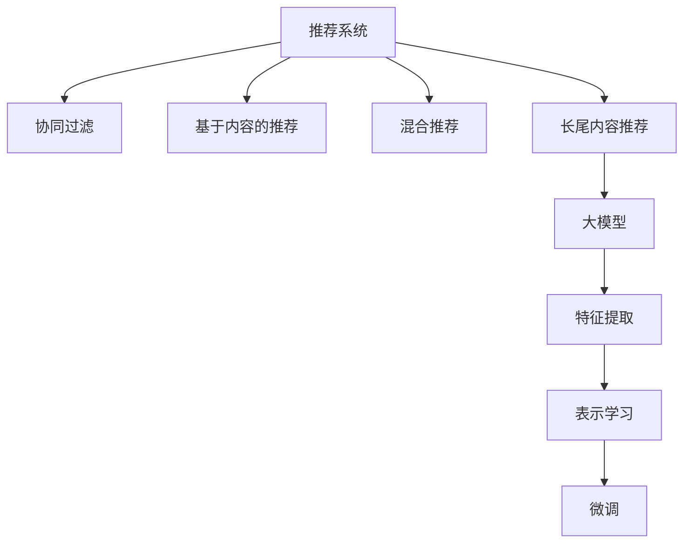

                 

# 大模型在推荐系统长尾内容推荐中的作用

## 1. 背景介绍

### 1.1 问题由来

推荐系统（Recommendation System）是信息时代的一个核心应用，帮助用户在海量信息中找到最符合自身需求和偏好的内容。随着互联网的迅猛发展和数据的不断积累，推荐系统逐渐从面向大众的普适性推荐，发展到聚焦个性化、差异化的精准推荐，特别是长尾内容的推荐。

长尾内容推荐指的是在推荐系统中，对于那些不为大众所熟知，但可能对某些用户有较高价值的内容进行推荐。由于这些内容在整体数据中的分布稀疏、用户需求差异巨大，其推荐策略设计和模型训练相比大众内容，更加复杂和困难。

近年来，深度学习技术在推荐系统中的广泛应用，推动了推荐技术的革新。以Transformer为代表的大模型（Large Model）在推荐系统中的应用，为解决长尾内容推荐提供了新的契机。本文将探讨大模型在推荐系统中，特别是长尾内容推荐中的作用，希望能为推荐系统开发者提供参考。

### 1.2 问题核心关键点

大模型在推荐系统中的应用，主要关注以下几个核心关键点：

- 大模型的预训练与微调：通过大规模数据集预训练，大模型获得丰富的语言表示，然后通过微调优化其适应特定推荐场景的能力。
- 长尾内容的表示学习：大模型能够从文本中学习到更为丰富的特征，提升对长尾内容的识别和推荐。
- 自适应与个性化推荐：大模型可以适应不同用户的个性化需求，提供更精准的推荐内容。
- 计算效率与资源优化：考虑到大模型的参数规模巨大，如何在保持性能的同时降低计算成本，是应用大模型时的重要挑战。

## 2. 核心概念与联系

### 2.1 核心概念概述

以下是推荐系统和大模型在长尾内容推荐中的几个关键概念：

- **推荐系统（Recommendation System）**：利用用户行为数据，通过算法为用户推荐内容的技术，分为协同过滤、基于内容的推荐、混合推荐等不同类型。
- **长尾内容（Long-tail Content）**：在数据集中分布稀疏、用户需求差异大、曝光度低的内容，通常具有较高的潜在价值。
- **大模型（Large Model）**：指具有亿级以上参数的深度学习模型，如BERT、GPT等，具有强大的表示学习能力。
- **微调（Fine-Tuning）**：通过有限数据集对大模型进行优化，使其能够适应特定的推荐任务。
- **特征提取与表示学习**：大模型通过学习输入数据中的特征，产生高质量的向量表示，用于推荐系统中的用户和内容建模。

这些概念之间的关系可以通过以下Mermaid流程图来展示：



这个流程图展示了推荐系统的核心组件及其之间的关系：

1. 推荐系统由多种推荐方法组成，包括协同过滤、基于内容的推荐、混合推荐等。
2. 长尾内容推荐是大模型在推荐系统中的一个重要应用领域。
3. 大模型通过特征提取和表示学习，提取输入数据的特征，生成向量表示。
4. 微调优化大模型，使其适应特定推荐任务，提升推荐效果。

## 3. 核心算法原理 & 具体操作步骤

### 3.1 算法原理概述

大模型在推荐系统中的应用，主要基于以下原理：

1. **预训练与微调**：大模型通过大规模无标签数据集进行预训练，学习到广泛的语义表示。微调则是通过有标签数据，针对特定推荐场景优化模型，使其能够更好地适应长尾内容的推荐。

2. **长尾内容表示学习**：大模型能够学习到更丰富的特征表示，尤其是对于那些分布稀疏的长尾内容，通过学习其特征，生成高质量的向量表示，提升推荐效果。

3. **自适应与个性化推荐**：大模型能够根据用户的个性化需求，动态调整模型参数，生成符合用户偏好的推荐内容。

### 3.2 算法步骤详解

大模型在推荐系统中的应用，主要分为以下几个步骤：

**Step 1: 数据准备**
- 收集用户行为数据，包括点击、浏览、评分等，用于训练和评估推荐模型。
- 收集长尾内容数据，包括文本、图片、视频等，用于大模型的预训练和微调。

**Step 2: 预训练大模型**
- 使用大规模无标签数据集对大模型进行预训练，学习语言的通用表示。
- 常见的预训练任务包括语言建模、掩码语言模型等。

**Step 3: 特征提取与表示学习**
- 利用大模型提取用户和内容的特征，生成高维向量表示。
- 通常采用双向编码器、多头自注意力机制等，生成丰富的语义表示。

**Step 4: 微调优化**
- 根据特定推荐场景，在微调数据集上训练大模型，优化模型参数。
- 通过设置适当的超参数（如学习率、批大小、迭代轮数等），最小化损失函数。

**Step 5: 部署与评估**
- 将微调后的大模型部署到推荐系统中，实时生成推荐结果。
- 使用推荐系统的评估指标（如准确率、召回率、点击率等）评估推荐效果。

### 3.3 算法优缺点

大模型在推荐系统中的应用，具有以下优点：

- **高表现力**：大模型能够学习到丰富的语义表示，提升长尾内容的识别和推荐。
- **自适应性强**：大模型可以根据用户的个性化需求，动态调整模型参数，提供更精准的推荐。
- **泛化能力强**：大模型具有较强的泛化能力，能够适应不同领域的推荐场景。

但同时，大模型在推荐系统中的应用也存在一些缺点：

- **计算成本高**：大模型的参数规模巨大，训练和推理成本较高。
- **过拟合风险**：长尾内容分布稀疏，容易发生过拟合。
- **模型复杂度高**：大模型的结构复杂，训练和优化难度大。

### 3.4 算法应用领域

大模型在推荐系统中的应用，主要集中在以下几个领域：

- **电商推荐**：通过学习用户购买行为和商品描述，推荐个性化的长尾商品。
- **新闻推荐**：利用文本数据，推荐用户感兴趣的长尾新闻文章。
- **视频推荐**：从视频描述和用户行为中学习特征，推荐个性化视频内容。
- **音乐推荐**：通过分析歌词和用户评分，推荐长尾音乐内容。
- **个性化服务**：推荐系统的长尾内容推荐，可以应用于个性化推荐、内容生成、智能客服等多个领域。

## 4. 数学模型和公式 & 详细讲解 & 举例说明

### 4.1 数学模型构建

大模型在推荐系统中的应用，主要基于以下数学模型：

1. **用户-商品矩阵**：通过用户行为数据，构建用户-商品矩阵 $U \in R^{N \times M}$，其中 $N$ 为用户数，$M$ 为商品数。每个元素 $U_{ui}$ 表示用户 $u$ 对商品 $i$ 的评分。

2. **特征向量表示**：利用大模型提取用户和商品的特征向量，生成高维向量表示 $u \in R^d$ 和 $i \in R^d$，其中 $d$ 为特征维度。

3. **用户-商品评分矩阵**：根据特征向量，计算用户和商品的评分矩阵 $P \in R^{N \times M}$，其中 $P_{ui} = u^T \cdot i$。

4. **推荐目标函数**：通过最小化用户-商品评分矩阵与真实评分矩阵 $U$ 的误差，优化推荐模型。

### 4.2 公式推导过程

假设用户 $u$ 对商品 $i$ 的真实评分和预测评分分别为 $y_{ui}$ 和 $\hat{y}_{ui}$，根据上述模型，可以建立推荐目标函数：

$$
\min_{P_{ui}} \frac{1}{N} \sum_{u,i} || P_{ui} - y_{ui} ||^2
$$

其中，$P_{ui}$ 为用户 $u$ 对商品 $i$ 的预测评分。

具体推导过程如下：

1. 将用户和商品的特征向量 $u$ 和 $i$ 代入评分矩阵 $P$ 中，得到预测评分 $P_{ui} = u^T \cdot i$。
2. 根据实际评分 $y_{ui}$ 和预测评分 $P_{ui}$，计算误差 $\delta_{ui} = y_{ui} - P_{ui}$。
3. 最小化误差平方和，得到推荐目标函数。

### 4.3 案例分析与讲解

以音乐推荐为例，分析大模型在推荐系统中的应用。

假设我们有一首新的长尾歌曲 $i$，用户 $u$ 对其的评分未知。为了推荐给用户，我们需要：

1. 收集用户 $u$ 的历史听歌行为数据，提取歌曲 $i$ 的特征，使用大模型提取用户和歌曲的特征向量。
2. 利用用户和歌曲的特征向量，计算预测评分 $P_{ui} = u^T \cdot i$。
3. 在音乐推荐数据集上微调大模型，优化预测评分。
4. 根据预测评分和真实评分，调整推荐策略，提升推荐效果。

## 5. 项目实践：代码实例和详细解释说明

### 5.1 开发环境搭建

在进行大模型在推荐系统中的应用实践前，我们需要准备好开发环境。以下是使用Python进行PyTorch开发的环境配置流程：

1. 安装Anaconda：从官网下载并安装Anaconda，用于创建独立的Python环境。

2. 创建并激活虚拟环境：
```bash
conda create -n pytorch-env python=3.8 
conda activate pytorch-env
```

3. 安装PyTorch：根据CUDA版本，从官网获取对应的安装命令。例如：
```bash
conda install pytorch torchvision torchaudio cudatoolkit=11.1 -c pytorch -c conda-forge
```

4. 安装Transformers库：
```bash
pip install transformers
```

5. 安装各类工具包：
```bash
pip install numpy pandas scikit-learn matplotlib tqdm jupyter notebook ipython
```

完成上述步骤后，即可在`pytorch-env`环境中开始推荐系统实践。

### 5.2 源代码详细实现

以下是一个基于PyTorch和Transformers库的推荐系统代码实现示例：

```python
import torch
import torch.nn as nn
from transformers import BertForSequenceClassification, BertTokenizer

# 加载预训练BERT模型和分词器
model = BertForSequenceClassification.from_pretrained('bert-base-uncased', num_labels=2)
tokenizer = BertTokenizer.from_pretrained('bert-base-uncased')

# 加载推荐数据集
train_dataset = ...
test_dataset = ...

# 定义特征提取器
class FeatureExtractor:
    def __init__(self, model, tokenizer):
        self.model = model
        self.tokenizer = tokenizer
    
    def __call__(self, input_ids, attention_mask):
        return self.model(input_ids, attention_mask=attention_mask)

# 定义用户-商品评分矩阵
class UserItemMatrix(nn.Module):
    def __init__(self, dim, num_items):
        super(UserItemMatrix, self).__init__()
        self.dim = dim
        self.num_items = num_items
        self.w = nn.Parameter(torch.randn(self.dim, num_items))
    
    def forward(self, features):
        return torch.matmul(features, self.w.t())

# 定义推荐模型
class RecommendationModel(nn.Module):
    def __init__(self, dim, num_items):
        super(RecommendationModel, self).__init__()
        self.encoder = FeatureExtractor(model, tokenizer)
        self.rm = UserItemMatrix(dim, num_items)
    
    def forward(self, user, item):
        features = self.encoder(user, item)
        return self.rm(features)

# 定义推荐系统训练函数
def train_model(model, train_dataset, test_dataset, num_epochs=10, batch_size=64):
    model.train()
    optimizer = torch.optim.Adam(model.parameters(), lr=1e-5)
    criterion = nn.MSELoss()
    
    for epoch in range(num_epochs):
        train_loss = 0
        train_correct = 0
        for batch in train_dataset:
            user, item, label = batch
            features = self.encoder(user, item)
            prediction = model(features)
            loss = criterion(prediction, label)
            optimizer.zero_grad()
            loss.backward()
            optimizer.step()
            train_loss += loss.item()
            train_correct += (prediction.argmax(dim=1) == label).sum().item()
        train_loss /= len(train_dataset)
        train_acc = train_correct / len(train_dataset)
        print(f'Epoch {epoch+1}, train loss: {train_loss:.4f}, train acc: {train_acc:.4f}')
    
    test_loss = 0
    test_correct = 0
    model.eval()
    with torch.no_grad():
        for batch in test_dataset:
            user, item, label = batch
            features = self.encoder(user, item)
            prediction = model(features)
            loss = criterion(prediction, label)
            test_loss += loss.item()
            test_correct += (prediction.argmax(dim=1) == label).sum().item()
        test_loss /= len(test_dataset)
        test_acc = test_correct / len(test_dataset)
        print(f'Epoch {epoch+1}, test loss: {test_loss:.4f}, test acc: {test_acc:.4f}')

# 使用推荐模型进行推荐
user = ...
item = ...
features = self.encoder(user, item)
prediction = model(features)
idx = prediction.argmax(dim=1).item()
print(f'Recommend item {idx} to user {user}')
```

### 5.3 代码解读与分析

让我们再详细解读一下关键代码的实现细节：

**FeatureExtractor类**：
- 定义了特征提取器，用于将用户和商品的数据转换为大模型所需的输入格式。
- `__init__`方法：初始化模型和分词器。
- `__call__`方法：将输入数据转换为特征向量。

**UserItemMatrix类**：
- 定义了用户-商品评分矩阵，用于计算预测评分。
- `__init__`方法：初始化矩阵维度和商品数。
- `forward`方法：计算预测评分。

**RecommendationModel类**：
- 定义了推荐模型，将用户和商品的特征向量输入大模型，计算预测评分。
- `__init__`方法：初始化特征提取器和评分矩阵。
- `forward`方法：计算预测评分。

**train_model函数**：
- 定义了推荐模型的训练函数，包括数据加载、模型前向传播、损失计算、参数更新等步骤。
- 使用Adam优化器和均方误差损失函数进行训练。
- 在每个epoch结束时，评估模型在训练集和测试集上的性能。

**推荐过程**：
- 使用训练好的推荐模型进行预测，计算预测评分。
- 选择预测评分最高的商品作为推荐结果。

## 6. 实际应用场景

### 6.1 电商推荐

电商推荐是大模型在推荐系统中的一个重要应用领域。电商平台上，用户对商品的评分和购买行为数据丰富，适合使用大模型进行推荐。

具体应用如下：

1. **长尾商品推荐**：利用大模型提取商品描述和用户行为特征，生成商品和用户的向量表示，通过微调优化模型，提升长尾商品的推荐效果。
2. **个性化推荐**：根据用户历史行为数据，使用大模型提取用户和商品的特征向量，生成预测评分，动态调整推荐策略，提升个性化推荐效果。

### 6.2 新闻推荐

新闻推荐利用用户对新闻文章的评分和点击行为数据，使用大模型进行推荐。

具体应用如下：

1. **长尾文章推荐**：利用大模型提取新闻文章和用户行为的特征向量，通过微调优化模型，提升长尾文章的推荐效果。
2. **多模态推荐**：结合文本和图像等多模态信息，使用大模型提取综合特征，提升推荐效果。

### 6.3 视频推荐

视频推荐利用用户对视频的评分和观看行为数据，使用大模型进行推荐。

具体应用如下：

1. **长尾视频推荐**：利用大模型提取视频描述和用户行为特征，生成视频和用户的向量表示，通过微调优化模型，提升长尾视频的推荐效果。
2. **多模态推荐**：结合视频和音频等多模态信息，使用大模型提取综合特征，提升推荐效果。

### 6.4 音乐推荐

音乐推荐利用用户对歌曲的评分和听歌行为数据，使用大模型进行推荐。

具体应用如下：

1. **长尾歌曲推荐**：利用大模型提取歌词和用户行为的特征向量，通过微调优化模型，提升长尾歌曲的推荐效果。
2. **多模态推荐**：结合歌词和演唱者等多模态信息，使用大模型提取综合特征，提升推荐效果。

### 6.5 未来应用展望

随着大模型的不断发展，其在推荐系统中的应用也将更加广泛和深入。未来可能的应用方向包括：

1. **跨域推荐**：结合不同领域的用户和商品数据，使用大模型进行跨域推荐，提升推荐效果。
2. **多任务学习**：在推荐系统训练中，同时学习多个推荐任务，提升整体推荐效果。
3. **自适应推荐**：根据用户行为变化，动态调整模型参数，实现自适应推荐。
4. **多模态融合**：结合图像、视频、音频等多模态信息，使用大模型提取综合特征，提升推荐效果。
5. **因果推断**：使用因果推断方法，识别推荐过程中的关键因素，提升推荐效果。

## 7. 工具和资源推荐

### 7.1 学习资源推荐

为了帮助开发者系统掌握大模型在推荐系统中的应用，这里推荐一些优质的学习资源：

1. 《推荐系统实战》一书：系统介绍了推荐系统的基本概念和算法，适合入门和进阶读者。
2. Coursera《推荐系统》课程：斯坦福大学的推荐系统课程，讲解了推荐系统的基本原理和算法。
3 Arxiv论文：推荐系统的最新研究论文，涵盖各种推荐方法和技术。
4 Kaggle竞赛：参加推荐系统的Kaggle竞赛，锻炼实际应用能力。

### 7.2 开发工具推荐

高效的开发离不开优秀的工具支持。以下是几款用于推荐系统开发的大模型工具：

1. PyTorch：基于Python的开源深度学习框架，灵活动态的计算图，适合快速迭代研究。
2 TensorFlow：由Google主导开发的开源深度学习框架，生产部署方便，适合大规模工程应用。
3 HuggingFace Transformers库：提供了大量预训练模型和微调API，方便开发者进行推荐系统开发。
4 Weights & Biases：模型训练的实验跟踪工具，可以记录和可视化模型训练过程中的各项指标，方便对比和调优。
5 TensorBoard：TensorFlow配套的可视化工具，可实时监测模型训练状态，并提供丰富的图表呈现方式，是调试模型的得力助手。

### 7.3 相关论文推荐

大模型在推荐系统中的应用，已经取得了许多重要研究成果，以下是几篇奠基性的相关论文，推荐阅读：

1. Attention is All You Need：提出了Transformer结构，开启了NLP领域的预训练大模型时代。
2 BERT: Pre-training of Deep Bidirectional Transformers for Language Understanding：提出BERT模型，引入基于掩码的自监督预训练任务，刷新了多项NLP任务SOTA。
3 AdaLoRA: Adaptive Low-Rank Adaptation for Parameter-Efficient Fine-Tuning：使用自适应低秩适应的微调方法，在参数效率和精度之间取得了新的平衡。
4 Prefix-Tuning: Optimizing Continuous Prompts for Generation：引入基于连续型Prompt的微调范式，为如何充分利用预训练知识提供了新的思路。

这些论文代表了大模型在推荐系统中的发展脉络，通过学习这些前沿成果，可以帮助研究者把握学科前进方向，激发更多的创新灵感。

## 8. 总结：未来发展趋势与挑战

### 8.1 总结

本文对大模型在推荐系统长尾内容推荐中的作用进行了全面系统的介绍。首先阐述了大模型在推荐系统中的应用背景，明确了其在长尾内容推荐中的独特价值。其次，从原理到实践，详细讲解了大模型微调的具体步骤，给出了推荐系统开发的完整代码实例。同时，本文还探讨了大模型在电商、新闻、视频、音乐等多个推荐场景中的应用，展示了其在推荐系统中的广泛应用前景。

通过本文的系统梳理，可以看到，大模型在推荐系统中的应用，正在推动推荐技术从大众推荐向长尾推荐、个性化推荐等方向深入发展。受益于大规模语料的预训练和丰富的语义表示，大模型能够提升长尾内容的识别和推荐效果，为推荐系统带来新的突破。未来，伴随大模型的不断演进和推荐技术的持续优化，推荐系统必将能够提供更加精准、个性化的服务，为人类创造更多价值。

### 8.2 未来发展趋势

展望未来，大模型在推荐系统中的应用将呈现以下几个发展趋势：

1. **跨域推荐**：结合不同领域的用户和商品数据，使用大模型进行跨域推荐，提升推荐效果。
2. **多任务学习**：在推荐系统训练中，同时学习多个推荐任务，提升整体推荐效果。
3. **自适应推荐**：根据用户行为变化，动态调整模型参数，实现自适应推荐。
4. **多模态融合**：结合图像、视频、音频等多模态信息，使用大模型提取综合特征，提升推荐效果。
5. **因果推断**：使用因果推断方法，识别推荐过程中的关键因素，提升推荐效果。

以上趋势凸显了大模型在推荐系统中的应用潜力，这些方向的探索发展，必将进一步提升推荐系统的性能和应用范围，为人类创造更多价值。

### 8.3 面临的挑战

尽管大模型在推荐系统中的应用已经取得了显著成果，但在迈向更加智能化、普适化应用的过程中，它仍面临诸多挑战：

1. **数据质量和标注成本**：长尾内容推荐需要高质量的标注数据，但数据获取和标注成本较高。如何降低标注成本，提升数据质量，是一个重要挑战。
2. **计算资源消耗**：大模型的参数规模巨大，训练和推理成本较高。如何在保证性能的同时，降低计算成本，是一个重要挑战。
3. **模型复杂度和稳定性**：大模型的结构复杂，训练和优化难度大。如何在保证模型效果的同时，提高模型的稳定性和泛化能力，是一个重要挑战。
4. **用户隐私保护**：推荐系统需要处理大量用户数据，如何保护用户隐私，是一个重要挑战。

### 8.4 研究展望

面对大模型在推荐系统中的诸多挑战，未来的研究需要在以下几个方面寻求新的突破：

1. **无监督学习**：摆脱对大规模标注数据的依赖，利用自监督学习、主动学习等无监督范式，最大限度利用非结构化数据，实现更加灵活高效的推荐。
2. **计算效率优化**：开发更加参数高效的微调方法，在固定大部分预训练参数的同时，只更新极少量的任务相关参数。同时优化微调模型的计算图，减少前向传播和反向传播的资源消耗，实现更加轻量级、实时性的部署。
3. **模型复杂度优化**：结合因果推断和对比学习思想，增强模型建立稳定因果关系的能力，学习更加普适、鲁棒的语言表征，从而提升模型泛化性和抗干扰能力。
4. **多模态融合**：结合图像、视频、音频等多模态信息，使用大模型提取综合特征，提升推荐效果。
5. **用户隐私保护**：结合隐私保护技术，如差分隐私、联邦学习等，保护用户隐私，提升推荐系统的可信度。

这些研究方向将推动大模型在推荐系统中的应用，推动推荐技术向更高层次发展，为人类创造更多价值。

## 9. 附录：常见问题与解答

**Q1：长尾内容推荐和大众内容推荐有什么区别？**

A: 长尾内容推荐和大众内容推荐的主要区别在于数据分布和推荐目标。大众内容推荐通常关注高曝光度的热门内容，而长尾内容推荐则关注那些分布稀疏、用户需求差异大的内容。

**Q2：大模型在推荐系统中如何处理长尾内容？**

A: 大模型通过学习大量的文本数据，能够学习到丰富的语义表示。在推荐系统中，可以使用大模型提取长尾内容的特征向量，生成高质量的向量表示，提升推荐效果。

**Q3：长尾内容推荐中如何处理数据稀疏性？**

A: 长尾内容推荐中的数据稀疏性是一个重要挑战。一种常用的方法是利用生成对抗网络（GAN）等模型，生成人工样本，增加训练集的多样性。此外，也可以使用稀疏编码等方法，处理稀疏数据。

**Q4：大模型在推荐系统中的计算效率问题如何解决？**

A: 大模型在推荐系统中的计算效率问题，可以通过以下几个方法解决：
1. 使用分布式训练，加快训练速度。
2. 利用模型压缩技术，如知识蒸馏、剪枝等，减少模型参数量。
3. 使用混合精度训练，降低计算资源消耗。

**Q5：推荐系统中的用户隐私保护问题如何解决？**

A: 推荐系统中的用户隐私保护问题，可以通过以下几个方法解决：
1. 使用差分隐私技术，保护用户数据的隐私性。
2. 采用联邦学习技术，在本地设备上进行训练，减少数据泄露风险。
3. 使用匿名化技术，去除用户标识信息，保护用户隐私。

---

作者：禅与计算机程序设计艺术 / Zen and the Art of Computer Programming

