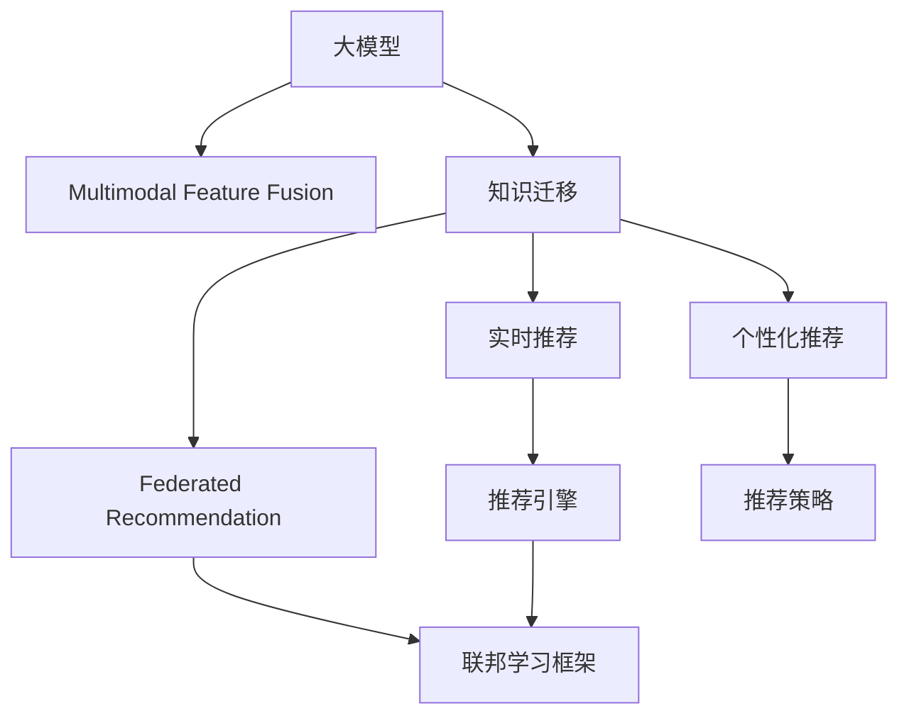

                 

# 大模型在推荐：统一与融合

## 1. 背景介绍

### 1.1 问题由来

推荐系统在电商、新闻、社交网络等诸多互联网应用中，已经取得了广泛的应用。通过挖掘用户行为数据，推荐系统能够预测用户对未见过的商品、文章、视频等的兴趣，从而提升用户体验和业务收益。然而，传统的推荐算法往往只能捕捉用户短期的、局部的兴趣偏好，难以捕捉长期的、全局性的模式。

近年来，基于深度学习的大模型推荐技术迅速发展，极大提升了推荐系统的性能。大模型通过在大规模数据上预训练，学习到丰富的知识表示，能够从不同模态、不同来源的数据中提取复杂特征，进行多任务的联合建模。这些特征与用户的交互行为结合起来，经过微调后形成精确的推荐结果。

尽管如此，大模型推荐系统仍存在诸多挑战。数据质量、模型复杂度、计算资源、用户体验等方面的问题，阻碍了其大规模部署和应用。如何在大模型基础上，实现推荐模型的统一与融合，构建更加智能、高效的推荐系统，成为当前研究的热点。

### 1.2 问题核心关键点

大模型推荐系统的核心问题在于如何实现推荐模型的统一与融合。具体而言，包括以下几个方面：

- **多模态特征融合**：如何将来自不同模态（如文本、图像、音频等）的数据特征融合到统一的空间中进行推荐。
- **跨领域知识迁移**：如何通过知识迁移，将一个领域学到的知识迁移到另一个领域，提高推荐的泛化能力。
- **实时推荐与个性化**：如何在保证实时性的前提下，实现个性化的推荐服务，满足用户不断变化的兴趣需求。
- **推荐模型优化**：如何通过优化模型结构、调整超参数、引入正则化等方法，提高推荐模型的性能和泛化能力。
- **联邦推荐与隐私保护**：如何在联邦学习框架下，保护用户隐私的前提下，实现分布式推荐模型的训练与推理。

解决这些问题将大幅提升推荐系统的智能程度和用户体验，从而加速人工智能技术在更多场景中的应用。

## 2. 核心概念与联系

### 2.1 核心概念概述

为更好地理解大模型在推荐系统的统一与融合方法，本节将介绍几个密切相关的核心概念：

- **大模型(Deep Model)**：基于深度学习的大规模模型，通过在大规模数据上预训练学习丰富的知识表示，适用于多种NLP任务。
- **多模态特征融合(Multimodal Feature Fusion)**：将来自不同模态的数据特征融合到统一空间中，以提升推荐模型的性能。
- **知识迁移(Knowledge Transfer)**：将一个领域学到的知识迁移到另一个领域，通过迁移学习提高模型泛化能力。
- **实时推荐(Real-time Recommendation)**：在用户实时请求下，即时生成个性化推荐结果，提升用户体验。
- **个性化推荐(Personalized Recommendation)**：根据用户历史行为数据，预测用户对新内容或商品的兴趣，实现量身定制的推荐。
- **联邦推荐(Federated Recommendation)**：在分布式环境中，保护用户隐私的前提下，实现多用户数据的联合建模。

这些核心概念之间的逻辑关系可以通过以下Mermaid流程图来展示：



这个流程图展示了核心概念之间的联系，通过融合多模态特征、知识迁移、实时推荐、个性化推荐和联邦推荐等技术，大模型可以构建高性能的推荐系统。

## 3. 核心算法原理 & 具体操作步骤

### 3.1 算法原理概述

基于大模型推荐系统的统一与融合，本质上是一个多任务学习(Multi-task Learning, MTL)的框架。其核心思想是：将多个推荐任务联合建模，在统一的大模型上进行多任务的联合优化，从而实现不同推荐场景的性能提升。

形式化地，假设不同推荐任务 $T_k$ 的标注数据集为 $D_k=\{(x_i,y_i)\}_{i=1}^N, x_i \in \mathcal{X}, y_i \in \mathcal{Y}$，其中 $\mathcal{X}$ 为输入空间，$\mathcal{Y}$ 为输出空间。在多任务学习的框架下，微调优化目标为：

$$
\hat{\theta}=\mathop{\arg\min}_{\theta} \sum_{k} \mathcal{L}_k(M_{\theta},D_k)
$$

其中 $\mathcal{L}_k$ 为任务 $T_k$ 的损失函数，用于衡量模型在特定任务上的性能。

通过联合优化多个推荐任务，大模型可以充分捕捉用户在不同场景下的多维兴趣，提升推荐模型的泛化能力和个性化程度。同时，通过引入多任务学习，还可以进一步降低标注样本的需求，提升推荐模型的训练效率。

### 3.2 算法步骤详解

基于多任务学习的大模型推荐系统一般包括以下几个关键步骤：

**Step 1: 准备数据集**

- 准备多个推荐任务 $T_k$ 的标注数据集 $D_k$，并划分为训练集、验证集和测试集。

**Step 2: 设计任务适配层**

- 根据不同推荐任务，设计合适的任务适配层，并将任务适配层添加到预训练模型顶层。

**Step 3: 设置微调超参数**

- 选择合适的优化算法及其参数，如 AdamW、SGD 等，设置学习率、批大小、迭代轮数等。

**Step 4: 多任务联合训练**

- 将多个任务的数据集 $D_k$ 在模型上进行联合训练，同时优化各个任务的损失函数 $\mathcal{L}_k$。

**Step 5: 模型评估与部署**

- 在测试集上评估多任务联合训练后的模型性能，对比微调前后的精度提升。
- 使用微调后的模型对新样本进行推理预测，集成到实际的应用系统中。

### 3.3 算法优缺点

基于大模型推荐系统的统一与融合方法具有以下优点：

- **泛化能力强**：通过联合优化多个任务，大模型能够更好地捕捉用户多维兴趣，提升推荐模型的泛化能力和个性化程度。
- **训练效率高**：多任务学习可以降低对标注数据的需求，提升推荐模型的训练效率。
- **性能提升显著**：多任务学习使得模型能够更好地适应多场景推荐任务，提升推荐效果。

同时，该方法也存在一定的局限性：

- **任务适配复杂**：不同的推荐任务需要设计合适的任务适配层，增加了系统实现的复杂度。
- **超参数调节困难**：多任务联合训练涉及多个任务的超参数，调节难度较大。
- **模型复杂度较高**：联合优化多个任务，增加了模型复杂度，对计算资源和硬件设施的要求较高。

尽管如此，多任务学习在大模型推荐中的应用已经成为当前研究的热点，未来相关研究的重点在于如何进一步降低多任务联合训练的复杂度，提高模型的训练和推理效率，同时兼顾多任务间的数据和知识共享，实现更加高效、智能的推荐系统。

### 3.4 算法应用领域

基于大模型推荐系统的统一与融合方法，在电商、新闻、社交网络等多个推荐场景中已经得到了广泛应用，覆盖了绝大多数的推荐任务，例如：

- 商品推荐：根据用户浏览、购买历史，推荐相关商品。
- 文章推荐：根据用户阅读历史，推荐相关文章。
- 视频推荐：根据用户观看历史，推荐相关视频。
- 新闻推荐：根据用户点击行为，推荐相关新闻。
- 社交推荐：根据用户互动行为，推荐相关人物或内容。

除了这些经典任务外，大模型推荐还创新性地应用于更多场景中，如个性化音乐推荐、个性化出行路线规划、个性化健康管理等，为推荐系统带来了全新的突破。随着大模型和推荐技术的不断发展，相信推荐系统必将在更广阔的应用领域大放异彩。

## 4. 数学模型和公式 & 详细讲解  
### 4.1 数学模型构建

本节将使用数学语言对基于大模型的多任务推荐过程进行更加严格的刻画。

记多任务推荐系统中的预训练模型为 $M_{\theta}:\mathcal{X} \rightarrow \mathcal{Y}$，其中 $\mathcal{X}$ 为输入空间，$\mathcal{Y}$ 为输出空间，$\theta \in \mathbb{R}^d$ 为模型参数。假设不同推荐任务 $T_k$ 的标注数据集为 $D_k=\{(x_i,y_i)\}_{i=1}^N, x_i \in \mathcal{X}, y_i \in \mathcal{Y}$。

定义模型 $M_{\theta}$ 在数据样本 $(x,y)$ 上的损失函数为 $\ell(M_{\theta}(x),y)$，则在数据集 $D_k$ 上的经验风险为：

$$
\mathcal{L}_k(\theta) = \frac{1}{N}\sum_{i=1}^N \ell(M_{\theta}(x_i),y_i)
$$

多任务学习的优化目标是最小化各个任务的经验风险之和，即找到最优参数：

$$
\theta^* = \mathop{\arg\min}_{\theta} \sum_k \mathcal{L}_k(\theta)
$$

在实践中，我们通常使用基于梯度的优化算法（如SGD、Adam等）来近似求解上述最优化问题。设 $\eta$ 为学习率，$\lambda$ 为正则化系数，则参数的更新公式为：

$$
\theta \leftarrow \theta - \eta \sum_k \nabla_{\theta}\mathcal{L}_k(\theta) - \eta\lambda\theta
$$

其中 $\nabla_{\theta}\mathcal{L}_k(\theta)$ 为损失函数对参数 $\theta$ 的梯度，可通过反向传播算法高效计算。

### 4.2 公式推导过程

以下我们以二分类任务为例，推导多任务学习下的交叉熵损失函数及其梯度的计算公式。

假设模型 $M_{\theta}$ 在输入 $x$ 上的输出为 $\hat{y}=M_{\theta}(x) \in [0,1]$，表示样本属于正类的概率。真实标签 $y \in \{0,1\}$。则二分类交叉熵损失函数定义为：

$$
\ell(M_{\theta}(x),y) = -[y\log \hat{y} + (1-y)\log (1-\hat{y})]
$$

将其代入经验风险公式，得：

$$
\mathcal{L}_k(\theta) = -\frac{1}{N}\sum_{i=1}^N [y_i\log M_{\theta}(x_i)+(1-y_i)\log(1-M_{\theta}(x_i))]
$$

根据链式法则，损失函数对参数 $\theta_k$ 的梯度为：

$$
\frac{\partial \mathcal{L}_k(\theta)}{\partial \theta_k} = -\frac{1}{N}\sum_{i=1}^N (\frac{y_i}{M_{\theta}(x_i)}-\frac{1-y_i}{1-M_{\theta}(x_i)}) \frac{\partial M_{\theta}(x_i)}{\partial \theta_k}
$$

其中 $\frac{\partial M_{\theta}(x_i)}{\partial \theta_k}$ 可进一步递归展开，利用自动微分技术完成计算。

在得到损失函数的梯度后，即可带入参数更新公式，完成模型的迭代优化。重复上述过程直至收敛，最终得到适应多个推荐任务的最优模型参数 $\theta^*$。

## 5. 项目实践：代码实例和详细解释说明
### 5.1 开发环境搭建

在进行推荐系统开发前，我们需要准备好开发环境。以下是使用Python进行PyTorch开发的环境配置流程：

1. 安装Anaconda：从官网下载并安装Anaconda，用于创建独立的Python环境。

2. 创建并激活虚拟环境：
```bash
conda create -n pytorch-env python=3.8 
conda activate pytorch-env
```

3. 安装PyTorch：根据CUDA版本，从官网获取对应的安装命令。例如：
```bash
conda install pytorch torchvision torchaudio cudatoolkit=11.1 -c pytorch -c conda-forge
```

4. 安装Transformers库：
```bash
pip install transformers
```

5. 安装各类工具包：
```bash
pip install numpy pandas scikit-learn matplotlib tqdm jupyter notebook ipython
```

完成上述步骤后，即可在`pytorch-env`环境中开始推荐系统开发。

### 5.2 源代码详细实现

这里我们以商品推荐任务为例，给出使用Transformers库对BERT模型进行微调的PyTorch代码实现。

首先，定义推荐任务的数据处理函数：

```python
from transformers import BertTokenizer
from torch.utils.data import Dataset
import torch

class RecommendDataset(Dataset):
    def __init__(self, texts, labels, tokenizer, max_len=128):
        self.texts = texts
        self.labels = labels
        self.tokenizer = tokenizer
        self.max_len = max_len
        
    def __len__(self):
        return len(self.texts)
    
    def __getitem__(self, item):
        text = self.texts[item]
        label = self.labels[item]
        
        encoding = self.tokenizer(text, return_tensors='pt', max_length=self.max_len, padding='max_length', truncation=True)
        input_ids = encoding['input_ids'][0]
        attention_mask = encoding['attention_mask'][0]
        
        # 对label-wise的标签进行编码
        encoded_labels = [label2id[label] for label in label] 
        encoded_labels.extend([label2id['none']] * (self.max_len - len(encoded_labels)))
        labels = torch.tensor(encoded_labels, dtype=torch.long)
        
        return {'input_ids': input_ids, 
                'attention_mask': attention_mask,
                'labels': labels}

# 标签与id的映射
label2id = {'good': 0, 'bad': 1, 'none': 2}
id2label = {v: k for k, v in label2id.items()}

# 创建dataset
tokenizer = BertTokenizer.from_pretrained('bert-base-cased')

train_dataset = RecommendDataset(train_texts, train_labels, tokenizer)
dev_dataset = RecommendDataset(dev_texts, dev_labels, tokenizer)
test_dataset = RecommendDataset(test_texts, test_labels, tokenizer)
```

然后，定义模型和优化器：

```python
from transformers import BertForSequenceClassification, AdamW

model = BertForSequenceClassification.from_pretrained('bert-base-cased', num_labels=len(label2id))

optimizer = AdamW(model.parameters(), lr=2e-5)
```

接着，定义训练和评估函数：

```python
from torch.utils.data import DataLoader
from tqdm import tqdm
from sklearn.metrics import accuracy_score

device = torch.device('cuda') if torch.cuda.is_available() else torch.device('cpu')
model.to(device)

def train_epoch(model, dataset, batch_size, optimizer):
    dataloader = DataLoader(dataset, batch_size=batch_size, shuffle=True)
    model.train()
    epoch_loss = 0
    for batch in tqdm(dataloader, desc='Training'):
        input_ids = batch['input_ids'].to(device)
        attention_mask = batch['attention_mask'].to(device)
        labels = batch['labels'].to(device)
        model.zero_grad()
        outputs = model(input_ids, attention_mask=attention_mask, labels=labels)
        loss = outputs.loss
        epoch_loss += loss.item()
        loss.backward()
        optimizer.step()
    return epoch_loss / len(dataloader)

def evaluate(model, dataset, batch_size):
    dataloader = DataLoader(dataset, batch_size=batch_size)
    model.eval()
    preds, labels = [], []
    with torch.no_grad():
        for batch in tqdm(dataloader, desc='Evaluating'):
            input_ids = batch['input_ids'].to(device)
            attention_mask = batch['attention_mask'].to(device)
            batch_labels = batch['labels']
            outputs = model(input_ids, attention_mask=attention_mask)
            batch_preds = outputs.logits.argmax(dim=2).to('cpu').tolist()
            batch_labels = batch_labels.to('cpu').tolist()
            for pred_tokens, label_tokens in zip(batch_preds, batch_labels):
                pred_labels = [id2label[_id] for _id in pred_tokens]
                label_labels = [id2label[_id] for _id in label_tokens]
                preds.append(pred_labels[:len(label_labels)])
                labels.append(label_labels)
                
    return accuracy_score(labels, preds)
```

最后，启动训练流程并在测试集上评估：

```python
epochs = 5
batch_size = 16

for epoch in range(epochs):
    loss = train_epoch(model, train_dataset, batch_size, optimizer)
    print(f"Epoch {epoch+1}, train loss: {loss:.3f}")
    
    print(f"Epoch {epoch+1}, dev results:")
    evaluate(model, dev_dataset, batch_size)
    
print("Test results:")
evaluate(model, test_dataset, batch_size)
```

以上就是使用PyTorch对BERT进行商品推荐任务微调的完整代码实现。可以看到，得益于Transformers库的强大封装，我们可以用相对简洁的代码完成BERT模型的加载和微调。

### 5.3 代码解读与分析

让我们再详细解读一下关键代码的实现细节：

**RecommendDataset类**：
- `__init__`方法：初始化文本、标签、分词器等关键组件。
- `__len__`方法：返回数据集的样本数量。
- `__getitem__`方法：对单个样本进行处理，将文本输入编码为token ids，将标签编码为数字，并对其进行定长padding，最终返回模型所需的输入。

**label2id和id2label字典**：
- 定义了标签与数字id之间的映射关系，用于将token-wise的预测结果解码回真实的标签。

**训练和评估函数**：
- 使用PyTorch的DataLoader对数据集进行批次化加载，供模型训练和推理使用。
- 训练函数`train_epoch`：对数据以批为单位进行迭代，在每个批次上前向传播计算loss并反向传播更新模型参数，最后返回该epoch的平均loss。
- 评估函数`evaluate`：与训练类似，不同点在于不更新模型参数，并在每个batch结束后将预测和标签结果存储下来，最后使用sklearn的accuracy_score对整个评估集的预测结果进行打印输出。

**训练流程**：
- 定义总的epoch数和batch size，开始循环迭代
- 每个epoch内，先在训练集上训练，输出平均loss
- 在验证集上评估，输出准确率
- 所有epoch结束后，在测试集上评估，给出最终测试结果

可以看到，PyTorch配合Transformers库使得BERT微调的代码实现变得简洁高效。开发者可以将更多精力放在数据处理、模型改进等高层逻辑上，而不必过多关注底层的实现细节。

当然，工业级的系统实现还需考虑更多因素，如模型的保存和部署、超参数的自动搜索、更灵活的任务适配层等。但核心的微调范式基本与此类似。

## 6. 实际应用场景
### 6.1 电商推荐

基于大模型推荐系统的方法，已经在电商推荐系统中得到了广泛应用。通过收集用户的浏览、点击、购买等行为数据，可以构建一个包含多种推荐任务的系统。例如：

- **商品推荐**：根据用户的浏览历史，推荐相关商品。
- **个性化推荐**：根据用户的购买历史，推荐相关商品。
- **关联推荐**：根据用户购买的商品，推荐相关商品。

系统通过在大模型上进行联合训练，能够在不同任务间进行知识共享和迁移，提升推荐效果。例如，通过在商品推荐任务中引入用户购买历史的标签，可以提升个性化推荐的效果。

### 6.2 新闻推荐

在新闻推荐中，大模型可以通过联合优化多种任务，提升推荐的准确性和多样性。例如：

- **新闻分类**：将新闻内容分类到不同的主题中。
- **相关性推荐**：根据用户的历史阅读记录，推荐相关新闻。
- **热门推荐**：推荐当前热门的新闻。

系统通过在大模型上进行联合训练，可以充分利用不同任务间的知识，提升推荐的全面性和时效性。例如，通过在新闻分类任务中引入用户的阅读历史，可以提升相关性推荐的效果。

### 6.3 音乐推荐

在音乐推荐中，大模型可以通过联合优化多种任务，提升推荐的个性化程度。例如：

- **音乐分类**：将音乐内容分类到不同的流派中。
- **相似性推荐**：根据用户的历史听歌记录，推荐相似的音乐。
- **热门推荐**：推荐当前热门的音乐。

系统通过在大模型上进行联合训练，可以充分利用不同任务间的知识，提升推荐的个性化程度。例如，通过在音乐分类任务中引入用户的听歌历史，可以提升相似性推荐的效果。

### 6.4 未来应用展望

随着大模型和推荐技术的不断发展，基于大模型的推荐系统将有更广阔的应用前景。例如：

- **个性化视频推荐**：通过联合优化多种视频相关任务，提升视频的推荐效果。
- **个性化出行路线规划**：通过联合优化多种出行相关任务，提升路线的推荐效果。
- **个性化健康管理**：通过联合优化多种健康相关任务，提升健康管理的推荐效果。

未来，随着大模型的进一步发展，推荐系统必将在更多领域得到应用，为人类社会带来更多便捷和智慧。

## 7. 工具和资源推荐
### 7.1 学习资源推荐

为了帮助开发者系统掌握大模型推荐系统的理论基础和实践技巧，这里推荐一些优质的学习资源：

1. 《Deep Learning for Recommendation Systems》书籍：由深度学习领域顶级专家撰写，系统介绍了深度学习在推荐系统中的应用。

2. 《Reinforcement Learning for Recommendation Systems》书籍：介绍了强化学习在推荐系统中的应用，涵盖了多种推荐算法和模型。

3. 《Large-Scale Multi-Task Learning with TensorFlow》博文：介绍了TensorFlow在多任务学习中的应用，展示了多任务学习的工程实践。

4. 《Transformers: From Theory to Practice》书籍：由Transformers库的作者撰写，全面介绍了Transformer的原理和应用。

5. 《Recommendation System Design Patterns》书籍：介绍了推荐系统设计的多种模式和最佳实践。

通过对这些资源的学习实践，相信你一定能够快速掌握大模型推荐系统的精髓，并用于解决实际的推荐问题。

### 7.2 开发工具推荐

高效的开发离不开优秀的工具支持。以下是几款用于大模型推荐系统开发的常用工具：

1. PyTorch：基于Python的开源深度学习框架，灵活动态的计算图，适合快速迭代研究。大多数预训练语言模型都有PyTorch版本的实现。

2. TensorFlow：由Google主导开发的开源深度学习框架，生产部署方便，适合大规模工程应用。同样有丰富的预训练语言模型资源。

3. Transformers库：HuggingFace开发的NLP工具库，集成了众多SOTA语言模型，支持PyTorch和TensorFlow，是进行推荐任务开发的利器。

4. Weights & Biases：模型训练的实验跟踪工具，可以记录和可视化模型训练过程中的各项指标，方便对比和调优。与主流深度学习框架无缝集成。

5. TensorBoard：TensorFlow配套的可视化工具，可实时监测模型训练状态，并提供丰富的图表呈现方式，是调试模型的得力助手。

6. Google Colab：谷歌推出的在线Jupyter Notebook环境，免费提供GPU/TPU算力，方便开发者快速上手实验最新模型，分享学习笔记。

合理利用这些工具，可以显著提升大模型推荐系统的开发效率，加快创新迭代的步伐。

### 7.3 相关论文推荐

大模型推荐系统的发展源于学界的持续研究。以下是几篇奠基性的相关论文，推荐阅读：

1. Learning to Recommend by Directly Targeting User Interest: A Deep Learning Approach（深度学习推荐系统）：介绍了深度学习在推荐系统中的应用，展示了多任务学习在推荐系统中的优势。

2. Transfer Learning for Multi-Task Multi-Domain Recommendation（跨领域迁移学习推荐系统）：提出了一种跨领域迁移学习的推荐系统，提升了推荐系统的泛化能力。

3. Multi-Task Sequence to Sequence Learning with Different Tasks and Different Languages for Domain Adaptation in Recommendation Systems（多任务序列到序列学习）：提出了一种跨语言的多任务学习推荐系统，提升了推荐系统的跨语言泛化能力。

4. Multi-Task Learning for Personalized Recommendation（多任务学习推荐系统）：介绍了多任务学习在推荐系统中的应用，展示了多任务学习在推荐系统中的优势。

5. Multi-Task Transfer Learning for Recommendation Systems（多任务迁移学习推荐系统）：提出了一种多任务迁移学习的推荐系统，提升了推荐系统的跨领域泛化能力。

这些论文代表了大模型推荐系统的发展脉络。通过学习这些前沿成果，可以帮助研究者把握学科前进方向，激发更多的创新灵感。

## 8. 总结：未来发展趋势与挑战

### 8.1 总结

本文对基于大模型的推荐系统进行了全面系统的介绍。首先阐述了大模型和推荐系统的发展背景和意义，明确了多任务学习在推荐系统中的应用价值。其次，从原理到实践，详细讲解了基于大模型的多任务推荐过程，给出了推荐系统开发的完整代码实例。同时，本文还广泛探讨了推荐系统在电商、新闻、音乐等多个场景中的实际应用，展示了推荐系统在多模态、多领域、个性化推荐等方面的巨大潜力。

通过本文的系统梳理，可以看到，基于大模型的推荐系统已经成为推荐领域的重要范式，极大地提升了推荐模型的泛化能力和个性化程度，为推荐系统在多场景应用中带来了新的突破。未来，伴随大模型的进一步发展，推荐系统必将在更多领域得到应用，为人类社会带来更多便捷和智慧。

### 8.2 未来发展趋势

展望未来，大模型推荐系统将呈现以下几个发展趋势：

1. **多模态融合**：结合文本、图像、视频等多模态数据，提升推荐的全面性和准确性。
2. **跨领域迁移**：通过跨领域迁移学习，提升推荐系统的泛化能力和鲁棒性。
3. **实时推荐**：在用户实时请求下，即时生成个性化推荐结果，提升用户体验。
4. **个性化推荐**：根据用户历史行为数据，预测用户对新内容或商品的兴趣，实现量身定制的推荐。
5. **联邦推荐**：在分布式环境中，保护用户隐私的前提下，实现多用户数据的联合建模。
6. **多任务学习**：联合优化多个推荐任务，提升推荐模型的泛化能力和个性化程度。

以上趋势凸显了大模型推荐系统的广阔前景。这些方向的探索发展，必将进一步提升推荐系统的智能程度和用户体验，从而加速人工智能技术在更多场景中的应用。

### 8.3 面临的挑战

尽管大模型推荐系统已经取得了显著成果，但在迈向更加智能化、普适化应用的过程中，它仍面临诸多挑战：

1. **数据质量和多样性**：推荐系统依赖于用户的历史行为数据，数据质量不高或用户行为单一，都会影响推荐效果。如何提升数据质量和多样性，获取更多用户行为数据，是大模型推荐系统面临的重要问题。
2. **模型复杂度**：大模型推荐系统涉及多种推荐任务，模型复杂度较高，对计算资源和硬件设施的要求较高。如何降低模型复杂度，提升模型训练和推理效率，是未来的重要研究方向。
3. **用户隐私保护**：推荐系统需要收集用户的行为数据，如何保护用户隐私，避免数据泄露，是大模型推荐系统面临的重要挑战。
4. **鲁棒性和公平性**：推荐系统可能会受到对抗攻击或数据偏见的影响，如何提升模型的鲁棒性和公平性，是大模型推荐系统面临的重要问题。

正视推荐系统面临的这些挑战，积极应对并寻求突破，将是大模型推荐系统走向成熟的必由之路。相信随着学界和产业界的共同努力，这些挑战终将一一被克服，大模型推荐系统必将在构建智能推荐系统、提升用户体验方面发挥更大的作用。

### 8.4 研究展望

面对大模型推荐系统所面临的诸多挑战，未来的研究需要在以下几个方面寻求新的突破：

1. **数据增强和合成**：通过数据增强和合成，提升数据质量和多样性，获取更多用户行为数据。
2. **模型压缩和加速**：通过模型压缩和加速技术，降低模型复杂度，提升模型训练和推理效率。
3. **隐私保护和联邦学习**：在保护用户隐私的前提下，实现多用户数据的联合建模，提升推荐系统的鲁棒性和公平性。
4. **多模态融合和跨领域迁移**：结合多模态数据和多领域知识，提升推荐系统的泛化能力和全面性。
5. **对抗攻击和鲁棒性**：提升推荐系统的鲁棒性和公平性，抵御对抗攻击，避免数据偏见的影响。
6. **用户交互和反馈**：通过用户交互和反馈，优化推荐算法和模型，提升推荐系统的个性化程度和用户体验。

这些研究方向的探索，必将引领大模型推荐系统向更高的台阶，为构建智能推荐系统、提升用户体验提供新的思路和方法。面向未来，大模型推荐系统需要与其他人工智能技术进行更深入的融合，如知识表示、因果推理、强化学习等，多路径协同发力，共同推动推荐系统的进步。只有勇于创新、敢于突破，才能不断拓展推荐系统的边界，让智能技术更好地造福人类社会。

## 9. 附录：常见问题与解答

**Q1：大模型推荐系统是否适用于所有推荐场景？**

A: 大模型推荐系统在绝大多数推荐场景中都能取得不错的效果，但并不是所有场景都适用。对于一些特殊场景，如医疗、法律等，大模型推荐系统可能需要进行预训练和微调，才能获得理想的效果。此外，对于一些需要实时性、个性化很强的场景，如在线广告、推荐引擎等，大模型推荐系统也需要针对性的改进优化。

**Q2：如何选择合适的预训练模型和任务适配层？**

A: 选择合适的预训练模型和任务适配层需要根据具体的推荐任务和数据特点来决定。一般来说，可以根据以下步骤进行选择：

1. 确定推荐任务的类型，是分类任务还是排序任务。
2. 选择与任务类型匹配的预训练模型，如BERT、GPT等。
3. 设计合适的任务适配层，将预训练模型与推荐任务关联起来。

可以通过阅读相关论文和实践案例，了解不同预训练模型和任务适配层的适用场景和效果。

**Q3：在推荐系统开发中，如何评估推荐模型的性能？**

A: 在推荐系统开发中，可以使用以下几种指标来评估推荐模型的性能：

1. 准确率：衡量推荐模型预测结果与实际结果的匹配程度。
2. 召回率：衡量推荐模型能否覆盖大部分相关结果。
3. 平均准确率（MRR）：衡量推荐模型在所有测试样本上的平均准确率。
4. 召回率-准确率曲线（Precision-Recall Curve）：衡量推荐模型在不同召回率下的准确率变化。
5. 平均召回率（nDCG）：衡量推荐模型在所有测试样本上的平均召回率。

可以使用这些指标来评估推荐模型的性能，并根据评估结果进行优化和改进。

**Q4：推荐系统在部署时需要注意哪些问题？**

A: 推荐系统在部署时需要注意以下问题：

1. 推荐模型裁剪：去除不必要的层和参数，减小模型尺寸，加快推理速度。
2. 模型压缩：将浮点模型转为定点模型，压缩存储空间，提高计算效率。
3. 服务化封装：将推荐模型封装为标准化服务接口，便于集成调用。
4. 弹性伸缩：根据请求流量动态调整资源配置，平衡服务质量和成本。
5. 监控告警：实时采集系统指标，设置异常告警阈值，确保服务稳定性。
6. 隐私保护：采用访问鉴权、数据脱敏等措施，保障数据和模型安全。

合理利用这些技术手段，可以保证推荐系统在实际部署中的稳定性和安全性，提升用户体验。

---

作者：禅与计算机程序设计艺术 / Zen and the Art of Computer Programming

