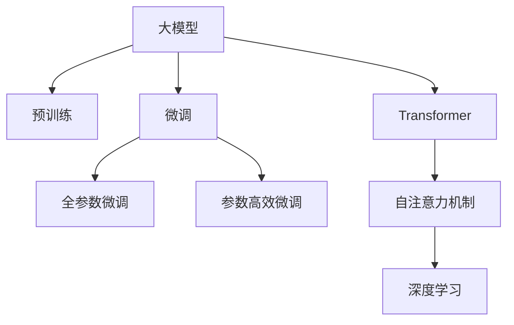

                 

# 大模型在用户兴趣理解方面的优势

> 关键词：用户兴趣理解,大模型,用户行为分析,个性化推荐,情感分析,预训练,微调,Transformer,深度学习

## 1. 背景介绍

在当今互联网时代，个性化推荐系统已经成为各大平台提升用户体验、增加用户粘性的重要手段。用户兴趣理解作为个性化推荐的基础，其准确性和全面性直接决定了推荐系统的推荐效果。然而，传统基于统计学和机器学习的用户兴趣理解方法，往往难以处理海量的数据和复杂的用户行为模式。近年来，基于深度学习的大模型技术，特别是预训练语言模型，逐渐成为用户兴趣理解的新宠。

### 1.1 问题由来

传统的用户兴趣理解方法，通常基于用户历史行为数据，通过统计学方法或机器学习算法，挖掘用户的行为模式和偏好，并构建用户画像。但这些方法存在以下局限：

- **数据量依赖大**：需要收集大量的用户行为数据，才能训练出较为准确的模型。
- **模式识别能力有限**：传统方法难以捕捉用户行为中的深层次模式和潜在关联。
- **计算成本高**：大数据量的特征工程和模型训练，对计算资源有较高的要求。

深度学习技术和大模型的出现，使得这些问题得到了极大的缓解。预训练语言模型，通过在大规模无标签数据上进行预训练，学习到丰富的语言知识和上下文信息，具备强大的文本处理能力。在微调过程中，大模型可以轻松适应特定任务，从而实现更加精准的用户兴趣理解。

## 2. 核心概念与联系

### 2.1 核心概念概述

为更好地理解大模型在用户兴趣理解方面的优势，本节将介绍几个关键概念：

- **大模型(Large Model)**：以自回归或自编码模型为代表的大规模预训练模型。通过在大规模无标签文本语料上进行预训练，学习通用的语言表示。
- **预训练(Pre-training)**：指在大规模无标签文本语料上，通过自监督学习任务训练通用语言模型的过程。常见的预训练任务包括言语建模、遮挡语言模型等。
- **微调(Fine-tuning)**：指在预训练模型的基础上，使用下游任务的少量标注数据，通过有监督地训练来优化模型在特定任务上的性能。通常只需要调整顶层分类器或解码器，并以较小的学习率更新全部或部分的模型参数。
- **Transformer**：一种自注意力机制的神经网络架构，广泛应用于大模型的预训练和微调。
- **深度学习**：基于多层神经网络结构的学习范式，以端到端的学习方式，实现复杂的模式识别和预测。

这些核心概念之间的逻辑关系可以通过以下Mermaid流程图来展示：



这个流程图展示了大模型的核心概念及其之间的关系：

1. 大模型通过预训练获得基础能力。
2. 微调是对预训练模型进行任务特定的优化，可以分为全参数微调和参数高效微调（PEFT）。
3. Transformer是一种关键架构，具有强大的自注意力机制。
4. 深度学习是基于神经网络的学习范式，构建了大模型的核心结构。

这些概念共同构成了大模型在用户兴趣理解方面的学习框架，使其能够更好地适应复杂的用户行为模式和深度语义信息。

## 3. 核心算法原理 & 具体操作步骤
### 3.1 算法原理概述

大模型在用户兴趣理解方面的优势，主要体现在其强大的预训练能力和泛化能力上。通过大规模无标签数据的预训练，大模型可以学习到丰富的语言知识，捕捉用户行为中的深层次模式。在微调过程中，通过针对特定任务进行参数更新，大模型能够快速适应新任务，并提高预测的准确性。

具体而言，大模型在用户兴趣理解方面的算法原理如下：

1. **预训练**：在大规模无标签数据上，通过自监督学习任务（如掩码语言模型、下一句预测等）训练大模型，学习到通用的语言表示和上下文信息。

2. **微调**：针对特定任务，如推荐、情感分析等，在预训练模型基础上进行微调，更新部分或全部模型参数，使其能够适应新任务。

3. **推理**：使用微调后的模型对用户输入的文本或行为数据进行推理，提取用户兴趣特征，并应用于推荐系统、情感分析等场景。

### 3.2 算法步骤详解

基于深度学习的大模型用户兴趣理解，主要包括以下几个关键步骤：

**Step 1: 准备数据集**
- 收集用户行为数据，如浏览记录、点击行为、评价信息等。
- 将用户行为数据进行预处理，如去除噪音、归一化等。
- 将用户行为数据划分为训练集、验证集和测试集。

**Step 2: 选择预训练模型**
- 选择合适的预训练语言模型，如BERT、GPT、T5等，作为初始化参数。
- 根据需要选择合适的网络结构和超参数。

**Step 3: 设计微调任务**
- 根据具体任务需求，设计微调的目标函数和损失函数。
- 选择合适的模型结构和参数更新策略。

**Step 4: 执行微调**
- 使用训练集进行模型训练，逐步优化模型参数。
- 在验证集上评估模型性能，调整超参数。
- 在测试集上评估模型效果，验证微调效果。

**Step 5: 应用推理**
- 将微调后的模型应用于实际业务场景，如推荐系统、情感分析等。
- 实时收集用户反馈，进一步优化模型参数和推理逻辑。

### 3.3 算法优缺点

大模型在用户兴趣理解方面的微调方法具有以下优点：

1. **泛化能力强**：预训练语言模型具有强大的泛化能力，能够在各种新任务上快速适应，提升模型效果。
2. **参数高效**：通过参数高效微调方法，在固定大部分预训练参数的情况下，仍可实现较好的微调效果。
3. **模型灵活性高**：模型结构灵活，适用于多种不同类型的任务，如推荐、情感分析、文本分类等。
4. **实时性好**：模型推理速度快，能够实时响应用户请求，提高用户体验。

但该方法也存在一定的局限性：

1. **数据量需求大**：预训练模型需要大量的无标签数据，预训练和微调过程计算成本较高。
2. **模型复杂度高**：大模型参数量庞大，推理和存储开销较大。
3. **模型解释性差**：大模型作为黑盒模型，其决策过程难以解释和调试。
4. **模型泛化能力受限**：预训练数据和微调任务之间的差异可能会影响模型的泛化能力。

尽管存在这些局限性，但就目前而言，基于深度学习的大模型微调方法仍是大模型在用户兴趣理解方面的主要手段。未来相关研究的重点在于如何进一步降低数据需求和计算成本，提高模型的实时性和可解释性，以及增强模型的泛化能力。

### 3.4 算法应用领域

大模型在用户兴趣理解方面的应用非常广泛，以下是几个典型的应用领域：

- **个性化推荐系统**：利用用户行为数据，通过微调大模型，分析用户兴趣和行为模式，实现个性化推荐。
- **情感分析**：通过分析用户评论和反馈，使用微调后的模型进行情感分类，了解用户对产品或服务的情感倾向。
- **文本分类**：将用户文本数据输入微调后的模型，进行分类预测，如新闻分类、广告分类等。
- **问答系统**：基于用户查询，使用微调后的模型生成相关回答，提升问答系统的准确性和自然度。
- **用户行为分析**：分析用户行为数据，使用微调后的模型进行用户画像构建，深入理解用户需求和行为模式。

## 4. 数学模型和公式 & 详细讲解  
### 4.1 数学模型构建

大模型在用户兴趣理解方面的数学模型构建，主要包括以下几个步骤：

1. **预训练模型选择**：选择预训练语言模型，如BERT、GPT、T5等。
2. **微调任务定义**：根据具体任务需求，设计微调的目标函数和损失函数。
3. **模型参数更新**：使用梯度下降等优化算法，更新模型参数。

### 4.2 公式推导过程

以下我们以推荐系统为例，推导微调的数学模型和公式。

假设用户行为数据集为 $D=\{(x_i,y_i)\}_{i=1}^N, x_i \in \mathbb{R}^d, y_i \in \{1,0\}$，其中 $y_i$ 表示用户是否对 $x_i$ 感兴趣。推荐系统的目标是最小化预测误差，即：

$$
\min_{\theta} \frac{1}{N}\sum_{i=1}^N \mathcal{L}(y_i, f_{\theta}(x_i))
$$

其中，$f_{\theta}(x)$ 为微调后的推荐模型，$\mathcal{L}$ 为目标函数，如交叉熵损失、均方误差等。

对于推荐系统，常用的微调目标函数为交叉熵损失：

$$
\mathcal{L}(y_i, f_{\theta}(x_i)) = -y_i \log f_{\theta}(x_i) - (1-y_i) \log (1-f_{\theta}(x_i))
$$

将目标函数带入损失函数，得：

$$
\mathcal{L}(\theta) = -\frac{1}{N}\sum_{i=1}^N [y_i\log f_{\theta}(x_i)+(1-y_i)\log(1-f_{\theta}(x_i))]
$$

模型的预测输出 $f_{\theta}(x)$ 可以使用微调后的BERT模型，其输出为 $f_{\theta}(x) = \text{softmax}(\theta^T \cdot \text{BERT}(x))$。

### 4.3 案例分析与讲解

以下以推荐系统为例，具体说明如何构建和使用数学模型。

假设我们有一个包含用户行为数据的数据集 $D=\{(x_i,y_i)\}_{i=1}^N$，其中 $x_i$ 为物品描述，$y_i$ 为用户是否购买该物品。我们选择微调后的BERT模型作为推荐模型。

1. **模型选择**：
   - 使用BERT模型作为初始化参数，$\theta$ 为预训练权重。

2. **目标函数**：
   - 使用交叉熵损失函数，$f_{\theta}(x) = \text{softmax}(\theta^T \cdot \text{BERT}(x))$。

3. **损失函数**：
   - $\mathcal{L}(\theta) = -\frac{1}{N}\sum_{i=1}^N [y_i\log f_{\theta}(x_i)+(1-y_i)\log(1-f_{\theta}(x_i))]$。

4. **优化算法**：
   - 使用AdamW优化算法，学习率设为 $2e-5$，迭代次数为1000次。

5. **训练过程**：
   - 使用训练集 $D_{train}$ 进行模型训练，验证集 $D_{valid}$ 进行模型评估。
   - 在测试集 $D_{test}$ 上评估模型效果，得到推荐准确率等指标。

在实际应用中，还需要根据具体任务的需求，调整模型的结构、损失函数、优化器等超参数，才能得到最优的微调效果。

## 5. 项目实践：代码实例和详细解释说明
### 5.1 开发环境搭建

在进行微调实践前，我们需要准备好开发环境。以下是使用Python进行PyTorch开发的环境配置流程：

1. 安装Anaconda：从官网下载并安装Anaconda，用于创建独立的Python环境。

2. 创建并激活虚拟环境：
```bash
conda create -n pytorch-env python=3.8 
conda activate pytorch-env
```

3. 安装PyTorch：根据CUDA版本，从官网获取对应的安装命令。例如：
```bash
conda install pytorch torchvision torchaudio cudatoolkit=11.1 -c pytorch -c conda-forge
```

4. 安装Transformers库：
```bash
pip install transformers
```

5. 安装各类工具包：
```bash
pip install numpy pandas scikit-learn matplotlib tqdm jupyter notebook ipython
```

完成上述步骤后，即可在`pytorch-env`环境中开始微调实践。

### 5.2 源代码详细实现

下面我们以推荐系统为例，给出使用Transformers库对BERT模型进行微调的PyTorch代码实现。

首先，定义推荐系统数据处理函数：

```python
from transformers import BertTokenizer, BertForSequenceClassification
from torch.utils.data import Dataset, DataLoader
import torch
import numpy as np

class RecommendationDataset(Dataset):
    def __init__(self, items, users, user interests, ratings, tokenizer):
        self.items = items
        self.users = users
        self.user_interests = user interests
        self.ratings = ratings
        self.tokenizer = tokenizer
        self.max_len = 128
        
    def __len__(self):
        return len(self.items)
    
    def __getitem__(self, item):
        item_id = self.items[item]
        user_id = self.users[item]
        user_interests = self.user_interests[item]
        rating = self.ratings[item]
        
        encoded_item = self.tokenizer(item_id, return_tensors='pt', max_length=self.max_len, padding='max_length', truncation=True)
        encoded_user = self.tokenizer(str(user_id), return_tensors='pt', max_length=self.max_len, padding='max_length', truncation=True)
        encoded_interests = [self.tokenizer(interest, return_tensors='pt', max_length=self.max_len, padding='max_length', truncation=True) for interest in user_interests]
        
        item_input_ids = encoded_item['input_ids'][0]
        user_input_ids = encoded_user['input_ids'][0]
        interest_input_ids = [input_ids[0] for input_ids in encoded_interests]
        
        item_mask = encoded_item['attention_mask'][0]
        user_mask = encoded_user['attention_mask'][0]
        interest_masks = [mask[0] for mask in [input['attention_mask'][0] for input in encoded_interests]]
        
        return {'item_input_ids': item_input_ids, 
                'user_input_ids': user_input_ids,
                'item_masks': item_mask,
                'user_masks': user_mask,
                'interest_input_ids': interest_input_ids,
                'interest_masks': interest_masks,
                'rating': torch.tensor(rating, dtype=torch.float32)}
```

然后，定义模型和优化器：

```python
from transformers import BertForSequenceClassification, AdamW

model = BertForSequenceClassification.from_pretrained('bert-base-cased', num_labels=2)
optimizer = AdamW(model.parameters(), lr=2e-5)
```

接着，定义训练和评估函数：

```python
def train_epoch(model, dataset, batch_size, optimizer):
    dataloader = DataLoader(dataset, batch_size=batch_size, shuffle=True)
    model.train()
    epoch_loss = 0
    for batch in dataloader:
        item_input_ids = batch['item_input_ids'].to(device)
        user_input_ids = batch['user_input_ids'].to(device)
        item_masks = batch['item_masks'].to(device)
        user_masks = batch['user_masks'].to(device)
        interest_input_ids = batch['interest_input_ids'].to(device)
        interest_masks = batch['interest_masks'].to(device)
        rating = batch['rating'].to(device)
        
        model.zero_grad()
        outputs = model(item_input_ids, user_input_ids, attention_mask=item_masks, 
                       label=rating, interest_input_ids=interest_input_ids,
                       attention_mask=interest_masks)
        loss = outputs.loss
        epoch_loss += loss.item()
        loss.backward()
        optimizer.step()
    return epoch_loss / len(dataloader)

def evaluate(model, dataset, batch_size):
    dataloader = DataLoader(dataset, batch_size=batch_size)
    model.eval()
    preds, labels = [], []
    with torch.no_grad():
        for batch in dataloader:
            item_input_ids = batch['item_input_ids'].to(device)
            user_input_ids = batch['user_input_ids'].to(device)
            item_masks = batch['item_masks'].to(device)
            user_masks = batch['user_masks'].to(device)
            interest_input_ids = batch['interest_input_ids'].to(device)
            interest_masks = batch['interest_masks'].to(device)
            rating = batch['rating'].to(device)
            
            output = model(item_input_ids, user_input_ids, attention_mask=item_masks, 
                          label=rating, interest_input_ids=interest_input_ids,
                          attention_mask=interest_masks)
            preds.append(output.logits.argmax(dim=1).cpu().numpy())
            labels.append(rating.cpu().numpy())
            
    print(classification_report(labels, preds))
```

最后，启动训练流程并在测试集上评估：

```python
epochs = 5
batch_size = 16

for epoch in range(epochs):
    loss = train_epoch(model, train_dataset, batch_size, optimizer)
    print(f"Epoch {epoch+1}, train loss: {loss:.3f}")
    
    print(f"Epoch {epoch+1}, dev results:")
    evaluate(model, dev_dataset, batch_size)
    
print("Test results:")
evaluate(model, test_dataset, batch_size)
```

以上就是使用PyTorch对BERT进行推荐系统任务微调的完整代码实现。可以看到，得益于Transformers库的强大封装，我们可以用相对简洁的代码完成BERT模型的加载和微调。

### 5.3 代码解读与分析

让我们再详细解读一下关键代码的实现细节：

**RecommendationDataset类**：
- `__init__`方法：初始化物品、用户、用户兴趣、评分等关键组件。
- `__len__`方法：返回数据集的样本数量。
- `__getitem__`方法：对单个样本进行处理，将物品、用户、用户兴趣转换为token ids，将评分作为标签，并对其进行定长padding，最终返回模型所需的输入。

**训练和评估函数**：
- 使用PyTorch的DataLoader对数据集进行批次化加载，供模型训练和推理使用。
- 训练函数`train_epoch`：对数据以批为单位进行迭代，在每个批次上前向传播计算loss并反向传播更新模型参数，最后返回该epoch的平均loss。
- 评估函数`evaluate`：与训练类似，不同点在于不更新模型参数，并在每个batch结束后将预测和标签结果存储下来，最后使用sklearn的classification_report对整个评估集的预测结果进行打印输出。

**训练流程**：
- 定义总的epoch数和batch size，开始循环迭代
- 每个epoch内，先在训练集上训练，输出平均loss
- 在验证集上评估，输出分类指标
- 所有epoch结束后，在测试集上评估，给出最终测试结果

可以看到，PyTorch配合Transformers库使得BERT微调的代码实现变得简洁高效。开发者可以将更多精力放在数据处理、模型改进等高层逻辑上，而不必过多关注底层的实现细节。

当然，工业级的系统实现还需考虑更多因素，如模型的保存和部署、超参数的自动搜索、更灵活的任务适配层等。但核心的微调范式基本与此类似。

## 6. 实际应用场景
### 6.1 智能客服系统

基于大模型微调的对话技术，可以广泛应用于智能客服系统的构建。传统客服往往需要配备大量人力，高峰期响应缓慢，且一致性和专业性难以保证。而使用微调后的对话模型，可以7x24小时不间断服务，快速响应客户咨询，用自然流畅的语言解答各类常见问题。

在技术实现上，可以收集企业内部的历史客服对话记录，将问题和最佳答复构建成监督数据，在此基础上对预训练对话模型进行微调。微调后的对话模型能够自动理解用户意图，匹配最合适的答案模板进行回复。对于客户提出的新问题，还可以接入检索系统实时搜索相关内容，动态组织生成回答。如此构建的智能客服系统，能大幅提升客户咨询体验和问题解决效率。

### 6.2 金融舆情监测

金融机构需要实时监测市场舆论动向，以便及时应对负面信息传播，规避金融风险。传统的人工监测方式成本高、效率低，难以应对网络时代海量信息爆发的挑战。基于大语言模型微调的文本分类和情感分析技术，为金融舆情监测提供了新的解决方案。

具体而言，可以收集金融领域相关的新闻、报道、评论等文本数据，并对其进行主题标注和情感标注。在此基础上对预训练语言模型进行微调，使其能够自动判断文本属于何种主题，情感倾向是正面、中性还是负面。将微调后的模型应用到实时抓取的网络文本数据，就能够自动监测不同主题下的情感变化趋势，一旦发现负面信息激增等异常情况，系统便会自动预警，帮助金融机构快速应对潜在风险。

### 6.3 个性化推荐系统

当前的推荐系统往往只依赖用户的历史行为数据进行物品推荐，无法深入理解用户的真实兴趣偏好。基于大语言模型微调技术，个性化推荐系统可以更好地挖掘用户行为背后的语义信息，从而提供更精准、多样的推荐内容。

在实践中，可以收集用户浏览、点击、评论、分享等行为数据，提取和用户交互的物品标题、描述、标签等文本内容。将文本内容作为模型输入，用户的后续行为（如是否点击、购买等）作为监督信号，在此基础上微调预训练语言模型。微调后的模型能够从文本内容中准确把握用户的兴趣点。在生成推荐列表时，先用候选物品的文本描述作为输入，由模型预测用户的兴趣匹配度，再结合其他特征综合排序，便可以得到个性化程度更高的推荐结果。

### 6.4 未来应用展望

随着大语言模型微调技术的发展，基于微调范式将在更多领域得到应用，为传统行业带来变革性影响。

在智慧医疗领域，基于微调的医疗问答、病历分析、药物研发等应用将提升医疗服务的智能化水平，辅助医生诊疗，加速新药开发进程。

在智能教育领域，微调技术可应用于作业批改、学情分析、知识推荐等方面，因材施教，促进教育公平，提高教学质量。

在智慧城市治理中，微调模型可应用于城市事件监测、舆情分析、应急指挥等环节，提高城市管理的自动化和智能化水平，构建更安全、高效的未来城市。

此外，在企业生产、社会治理、文娱传媒等众多领域，基于大模型微调的人工智能应用也将不断涌现，为经济社会发展注入新的动力。相信随着技术的日益成熟，微调方法将成为人工智能落地应用的重要范式，推动人工智能技术在垂直行业的规模化落地。总之，微调需要开发者根据具体任务，不断迭代和优化模型、数据和算法，方能得到理想的效果。

## 7. 工具和资源推荐
### 7.1 学习资源推荐

为了帮助开发者系统掌握大语言模型微调的理论基础和实践技巧，这里推荐一些优质的学习资源：

1. 《Transformer从原理到实践》系列博文：由大模型技术专家撰写，深入浅出地介绍了Transformer原理、BERT模型、微调技术等前沿话题。

2. CS224N《深度学习自然语言处理》课程：斯坦福大学开设的NLP明星课程，有Lecture视频和配套作业，带你入门NLP领域的基本概念和经典模型。

3. 《Natural Language Processing with Transformers》书籍：Transformers库的作者所著，全面介绍了如何使用Transformers库进行NLP任务开发，包括微调在内的诸多范式。

4. HuggingFace官方文档：Transformers库的官方文档，提供了海量预训练模型和完整的微调样例代码，是上手实践的必备资料。

5. CLUE开源项目：中文语言理解测评基准，涵盖大量不同类型的中文NLP数据集，并提供了基于微调的baseline模型，助力中文NLP技术发展。

通过对这些资源的学习实践，相信你一定能够快速掌握大语言模型微调的精髓，并用于解决实际的NLP问题。
###  7.2 开发工具推荐

高效的开发离不开优秀的工具支持。以下是几款用于大语言模型微调开发的常用工具：

1. PyTorch：基于Python的开源深度学习框架，灵活动态的计算图，适合快速迭代研究。大部分预训练语言模型都有PyTorch版本的实现。

2. TensorFlow：由Google主导开发的开源深度学习框架，生产部署方便，适合大规模工程应用。同样有丰富的预训练语言模型资源。

3. Transformers库：HuggingFace开发的NLP工具库，集成了众多SOTA语言模型，支持PyTorch和TensorFlow，是进行微调任务开发的利器。

4. Weights & Biases：模型训练的实验跟踪工具，可以记录和可视化模型训练过程中的各项指标，方便对比和调优。与主流深度学习框架无缝集成。

5. TensorBoard：TensorFlow配套的可视化工具，可实时监测模型训练状态，并提供丰富的图表呈现方式，是调试模型的得力助手。

6. Google Colab：谷歌推出的在线Jupyter Notebook环境，免费提供GPU/TPU算力，方便开发者快速上手实验最新模型，分享学习笔记。

合理利用这些工具，可以显著提升大语言模型微调任务的开发效率，加快创新迭代的步伐。

### 7.3 相关论文推荐

大语言模型和微调技术的发展源于学界的持续研究。以下是几篇奠基性的相关论文，推荐阅读：

1. Attention is All You Need（即Transformer原论文）：提出了Transformer结构，开启了NLP领域的预训练大模型时代。

2. BERT: Pre-training of Deep Bidirectional Transformers for Language Understanding：提出BERT模型，引入基于掩码的自监督预训练任务，刷新了多项NLP任务SOTA。

3. Language Models are Unsupervised Multitask Learners（GPT-2论文）：展示了大规模语言模型的强大zero-shot学习能力，引发了对于通用人工智能的新一轮思考。

4. Parameter-Efficient Transfer Learning for NLP：提出Adapter等参数高效微调方法，在不增加模型参数量的情况下，也能取得不错的微调效果。

5. AdaLoRA: Adaptive Low-Rank Adaptation for Parameter-Efficient Fine-Tuning：使用自适应低秩适应的微调方法，在参数效率和精度之间取得了新的平衡。

这些论文代表了大语言模型微调技术的发展脉络。通过学习这些前沿成果，可以帮助研究者把握学科前进方向，激发更多的创新灵感。

## 8. 总结：未来发展趋势与挑战
### 8.1 总结

本文对基于深度学习的大模型在用户兴趣理解方面的优势进行了全面系统的介绍。首先阐述了预训练语言模型和大模型微调的基本概念和重要性，明确了其在大规模数据处理和复杂模式识别方面的独特优势。其次，从原理到实践，详细讲解了预训练-微调的基本步骤，给出了微调任务开发的完整代码实例。同时，本文还广泛探讨了大模型在智能客服、金融舆情、个性化推荐等多个领域的应用前景，展示了其广泛的应用潜力。

通过本文的系统梳理，可以看到，基于大模型的微调方法正在成为用户兴趣理解领域的重要手段，其强大的预训练能力和泛化能力，使其能够在复杂多变的用户行为模式中，准确捕捉用户的深层次兴趣和需求。未来，随着大模型技术的不断演进，基于微调的用户兴趣理解将实现更加精准、全面的推荐效果，深刻影响用户的数字化生活体验。

### 8.2 未来发展趋势

展望未来，大模型在用户兴趣理解方面的微调技术将呈现以下几个发展趋势：

1. **多模态融合**：未来的大模型将更加注重多模态数据的整合，如文本、图像、视频、语音等，通过跨模态学习提升用户兴趣理解的准确性和全面性。

2. **深度学习范式改进**：未来将探索更多深度学习范式，如生成对抗网络(GAN)、变分自编码器(VAE)等，以提升模型的表达能力和鲁棒性。

3. **预训练数据多样性**：未来预训练数据的获取将更加多样化，包括更多来源、多语种、跨领域数据，以增强模型泛化能力和适应性。

4. **参数高效微调方法**：未来将发展更多参数高效微调方法，如LoRA、Pitcher等，在减少计算资源消耗的同时，提高微调效果。

5. **实时计算优化**：未来将更加注重模型的实时计算优化，如使用GPU/TPU加速、量化压缩等技术，提升微调模型的推理速度和资源利用率。

6. **模型可解释性**：未来将提升模型的可解释性，通过符号化表示和可解释性增强技术，让用户更好地理解模型的工作机制和决策逻辑。

### 8.3 面临的挑战

尽管大模型在用户兴趣理解方面具有显著优势，但其应用过程中仍面临以下挑战：

1. **数据隐私和安全**：用户行为数据的收集和处理，需严格遵守数据隐私法规，保障用户隐私安全。

2. **计算成本高**：大规模预训练和大模型微调需消耗大量的计算资源，企业需要投入大量人力物力。

3. **模型过拟合**：大模型在特定数据集上的微调，可能出现过拟合现象，降低泛化能力。

4. **模型泛化能力**：预训练数据和微调任务之间的差异，可能影响模型的泛化能力，需在实际应用中持续优化。

5. **用户信任和接受度**：用户对于AI技术的信任和接受度，直接影响其应用效果和推广速度。

### 8.4 研究展望

面对大模型在用户兴趣理解方面所面临的挑战，未来的研究需要在以下几个方面寻求新的突破：

1. **联邦学习**：通过联邦学习技术，在保护用户隐私的前提下，利用分布式计算资源进行模型训练和微调。

2. **对抗性训练**：引入对抗性训练方法，增强模型鲁棒性，避免过拟合。

3. **自监督预训练**：探索更多自监督预训练方法，减少对标注数据的依赖，降低微调计算成本。

4. **模型压缩**：开发更高效的模型压缩技术，如剪枝、量化、蒸馏等，降低模型推理开销。

5. **知识增强**：结合外部知识库和规则库，增强模型的知识整合能力和可解释性。

6. **人机协同**：探索人机协同的交互方式，提升用户对AI系统的信任和接受度。

这些研究方向将为大模型在用户兴趣理解方面的应用带来新的突破，推动其进一步向实用化和普及化发展。相信随着技术研究的深入，大模型将在用户兴趣理解领域发挥更大的作用，为数字时代的人类生活带来更多的便利和惊喜。

## 9. 附录：常见问题与解答

**Q1：大模型在用户兴趣理解方面是否适合所有应用场景？**

A: 大模型在用户兴趣理解方面具有强大的预训练能力和泛化能力，但并不是所有应用场景都适合使用大模型。对于一些小规模、特定领域的应用，如个性化广告、语音识别等，传统的机器学习方法可能更加适用。而对于大规模、复杂多变的数据，如推荐系统、情感分析等，大模型的微调技术则更能发挥其优势。

**Q2：如何选择合适的预训练模型？**

A: 选择预训练模型时，应考虑以下几个因素：
1. 任务类型：不同类型的任务适合不同类型的预训练模型，如BERT适用于情感分析，GPT适用于对话生成。
2. 数据规模：数据规模较大的任务适合使用较大的预训练模型，数据规模较小的任务则选择较小的模型即可。
3. 计算资源：计算资源较少的场景选择较小的模型，计算资源充足的场景则可以使用较大的模型。
4. 精度需求：对于需要高精度的任务，应选择精度较高的预训练模型。

**Q3：大模型的微调效果如何？**

A: 大模型的微调效果通常较好，特别是当微调数据集与预训练数据集具有相似的语言特征时。但微调效果也受到以下因素影响：
1. 微调数据量：数据量越大，微调效果越好。
2. 数据质量：数据质量越高，微调效果越好。
3. 模型复杂度：模型复杂度越高，微调效果越好。
4. 微调策略：选择合适的微调策略和超参数，可显著提升微调效果。

**Q4：大模型的微调计算成本如何？**

A: 大模型的微调计算成本较高，主要体现在以下几个方面：
1. 计算资源需求大：大模型参数量庞大，计算资源消耗较大。
2. 计算时间较长：大模型微调需较长时间，需进行分布式计算。
3. 硬件成本高：大模型微调需使用GPU/TPU等高性能设备，硬件成本较高。

**Q5：如何缓解大模型的过拟合问题？**

A: 缓解大模型的过拟合问题，可以采取以下策略：
1. 数据增强：通过回译、近义替换等方式扩充训练集，增加数据多样性。
2. 正则化：使用L2正则、Dropout等技术，防止模型过拟合。
3. 对抗训练：引入对抗样本，提高模型鲁棒性。
4. 参数高效微调：只调整少量参数，保留大部分预训练权重。
5. 多模型集成：训练多个微调模型，取平均输出，抑制过拟合。

这些策略往往需要根据具体任务和数据特点进行灵活组合，以达到最佳微调效果。

**Q6：大模型的可解释性如何？**

A: 大模型作为黑盒模型，其决策过程难以解释和调试。为提升大模型的可解释性，可以采取以下策略：
1. 符号化表示：使用符号化表示，将模型的中间表示和输出进行可视化，便于理解和解释。
2. 可解释性增强：引入可解释性增强技术，如LIME、SHAP等，分析模型的决策过程和重要性。
3. 人工干预：结合人工干预和专家知识，增强模型的可解释性和可理解性。

大模型的可解释性问题仍是一个待解决的问题，但随着可解释性增强技术的发展，相信未来的模型将具备更强的可解释性。

**Q7：大模型的参数高效微调方法有哪些？**

A: 大模型的参数高效微调方法主要包括：
1. Adapter：只更新微调任务相关的少量参数，保留大部分预训练权重。
2. LoRA：通过低秩矩阵近似方式，减少微调过程中的参数更新量。
3. Pitcher：使用模块化设计，只更新微调任务相关的参数模块，保留其他模块权重不变。

这些方法可以在保持模型性能的同时，减少计算资源消耗，提升微调效率。

---

作者：禅与计算机程序设计艺术 / Zen and the Art of Computer Programming

