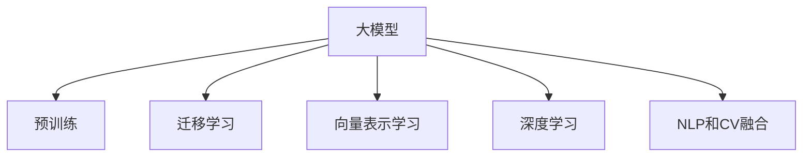

                 

# 大模型在电商平台商品相似度计算中的应用

> 关键词：电商平台,商品相似度,大模型,相似度计算,机器学习,深度学习,自然语言处理(NLP),Python,scikit-learn

## 1. 背景介绍

### 1.1 问题由来
在现代电商平台上，商品相似度计算是一个基础而重要的技术环节。通过对商品的相似度进行精确计算，电商平台可以实现以下功能：

1. **个性化推荐**：根据用户浏览和购买行为，推荐与用户兴趣相匹配的商品。
2. **搜索优化**：在搜索结果中，优先展示与用户查询最相关的商品，提升搜索效果。
3. **品类管理**：通过商品间的相似度，进行合理的品类划分和管理。
4. **库存管理**：合理规划商品库存，避免缺货或积压。

传统的商品相似度计算方法往往依赖于手工定义的特征提取和相似度度量函数，如余弦相似度、欧氏距离等。然而，这些方法在处理大规模数据时，往往面临特征工程复杂、计算成本高、准确度低等问题。随着深度学习技术的发展，大模型在自然语言处理(NLP)和计算机视觉等领域已经展现出了强大的能力，其在电商平台商品相似度计算中的应用逐渐受到关注。

### 1.2 问题核心关键点
大模型在电商平台商品相似度计算中的应用主要依赖于以下关键技术：

- **预训练语言模型**：通过大规模无标签文本语料的预训练，学习通用的语言表示，可以自动提取商品描述中的重要信息，用于计算商品间的相似度。
- **迁移学习**：将预训练模型的知识迁移到具体的商品相似度计算任务中，可以大幅提升计算的准确度和效率。
- **向量表示学习**：通过训练学习商品向量的表示，可以更准确地度量商品间的相似性。
- **深度学习**：利用深度神经网络结构，可以自动学习复杂非线性关系，提高相似度计算的精度。
- **NLP和CV融合**：结合NLP和计算机视觉技术，可以处理包含文本和图像的商品描述，提升相似度计算的全面性和准确性。

## 2. 核心概念与联系

### 2.1 核心概念概述

为了更好地理解大模型在电商平台商品相似度计算中的应用，本节将介绍几个密切相关的核心概念：

- **大模型(Large Model)**：指通过大规模数据预训练，拥有强大表示能力的深度学习模型，如BERT、GPT等。
- **预训练(Pre-training)**：指在大规模无标签文本语料上进行自监督学习，学习通用的语言表示。
- **迁移学习(Transfer Learning)**：指将预训练模型知识迁移到具体任务中，提升模型性能。
- **向量表示学习(Vector Representation Learning)**：指通过训练学习商品向量的表示，用于度量商品间的相似性。
- **深度学习(Deep Learning)**：指利用多层次神经网络，学习复杂非线性关系，提升模型准确性。
- **NLP和CV融合**：指结合自然语言处理和计算机视觉技术，处理文本和图像信息，提升相似度计算的多维性。

这些核心概念之间的逻辑关系可以通过以下Mermaid流程图来展示：



这个流程图展示了大模型在电商平台商品相似度计算中的核心概念及其之间的关系：

1. 大模型通过预训练获得基础能力。
2. 迁移学习将预训练知识迁移到商品相似度计算任务中。
3. 向量表示学习训练商品向量的表示，用于度量相似性。
4. 深度学习利用神经网络结构，学习复杂非线性关系。
5. NLP和CV融合处理多模态数据，提升相似度计算的全面性。

这些概念共同构成了大模型在商品相似度计算中的工作原理和优化方向。

## 3. 核心算法原理 & 具体操作步骤
### 3.1 算法原理概述

大模型在电商平台商品相似度计算中，主要采用以下步骤：

1. **预训练语言模型的构建**：选择合适的预训练语言模型，如BERT、GPT等，将其作为基础模型。
2. **向量表示学习**：通过训练学习商品向量的表示，使得商品向量在语义空间中更加接近。
3. **迁移学习**：将预训练模型的知识迁移到具体的商品相似度计算任务中，提升计算的准确度和效率。
4. **深度学习**：利用深度神经网络结构，自动学习商品间的复杂关系，提升相似度计算的精度。
5. **NLP和CV融合**：结合自然语言处理和计算机视觉技术，处理多模态数据，提升相似度计算的全面性。

### 3.2 算法步骤详解

#### 3.2.1 预训练语言模型的选择

选择合适的预训练语言模型是商品相似度计算的第一步。通常，BERT、GPT等大模型已经被广泛应用于多个领域，具有较强的语言表示能力。例如，BERT通过双向训练和Transformer结构，可以捕获上下文信息，学习到丰富的语义表示。

#### 3.2.2 向量表示学习

向量表示学习是商品相似度计算的核心步骤。其目标是将商品描述映射到高维语义空间中，使得语义相近的商品在向量空间中距离较近。常用的向量表示学习方法包括：

1. **基于Word2Vec的方法**：将商品描述中的单词映射到高维向量空间，然后计算向量间的余弦相似度。
2. **基于BERT的方法**：利用BERT预训练模型，对商品描述进行编码，得到商品向量。

下面以BERT为例，介绍向量表示学习的详细步骤：

1. **预处理商品描述**：对商品描述进行分词、去停用词、构建词汇表等预处理操作，转换为模型可以处理的格式。
2. **构建输入数据**：将预处理后的商品描述转换为模型可以接受的格式，如token id、位置信息等。
3. **编码商品向量**：利用预训练的BERT模型，对输入数据进行编码，得到商品向量。

#### 3.2.3 迁移学习

迁移学习是将预训练模型知识迁移到具体任务中的过程。通过迁移学习，可以减少模型在大规模无标签数据上的训练时间，提高计算效率。迁移学习的过程通常包括以下步骤：

1. **微调预训练模型**：在商品相似度计算任务上，微调预训练模型，使其适应具体任务。
2. **特征提取**：利用微调后的模型，提取商品向量的特征，用于度量商品间的相似性。
3. **度量相似性**：根据商品向量的特征，计算商品间的相似度，得到相似度矩阵。

#### 3.2.4 深度学习

深度学习通过多层神经网络结构，学习商品间的复杂非线性关系，提升相似度计算的精度。深度学习在商品相似度计算中的应用主要包括以下步骤：

1. **构建神经网络模型**：选择合适的神经网络结构，如多层感知机、卷积神经网络等。
2. **训练模型**：利用标注数据，训练神经网络模型，使其学习商品间的复杂关系。
3. **预测相似度**：利用训练好的模型，对商品进行相似度预测，得到相似度矩阵。

#### 3.2.5 NLP和CV融合

NLP和CV融合是指结合自然语言处理和计算机视觉技术，处理多模态数据，提升相似度计算的全面性。在商品相似度计算中，商品描述通常包含文本信息，同时商品图片也包含图像信息。NLP和CV融合可以处理这些多模态数据，得到更加全面、准确的相似度矩阵。具体步骤如下：

1. **图像特征提取**：利用计算机视觉技术，提取商品图片的特征，如颜色、纹理、形状等。
2. **文本特征提取**：利用自然语言处理技术，提取商品描述的特征，如词频、情感、主题等。
3. **多模态特征融合**：将文本和图像特征融合，得到多模态特征向量，用于计算商品间的相似度。

### 3.3 算法优缺点

大模型在电商平台商品相似度计算中的应用具有以下优点：

1. **高精度**：利用深度学习和预训练模型，可以自动学习商品间的复杂关系，提升相似度计算的精度。
2. **可解释性**：通过学习商品向量的表示，可以直观地解释商品间的相似性。
3. **适应性**：可以通过迁移学习，适应不同的商品描述和相似度计算任务。
4. **可扩展性**：可以利用大模型预训练的基础能力，快速扩展到新的任务和数据集。

同时，该方法也存在以下局限性：

1. **计算成本高**：大模型训练和推理需要大量的计算资源和存储资源，成本较高。
2. **数据需求大**：商品相似度计算需要大量的标注数据，且数据质量直接影响计算结果。
3. **泛化能力有限**：当前大模型通常是基于特定领域的语料预训练的，对新领域数据的泛化能力较弱。
4. **模型复杂度高**：深度学习和预训练模型的复杂度较高，模型的训练和推理速度较慢。

尽管存在这些局限性，但就目前而言，大模型在电商平台商品相似度计算中的应用仍是最先进、最有效的方法之一。未来相关研究的重点在于如何进一步降低计算成本，提高模型泛化能力，同时兼顾模型复杂度和计算速度。

### 3.4 算法应用领域

大模型在电商平台商品相似度计算中的应用已经涵盖了多个领域，包括但不限于：

1. **个性化推荐**：利用大模型计算商品间的相似度，为每个用户推荐最相关的商品。
2. **搜索优化**：通过计算商品间的相似度，优化搜索结果，提升搜索效果。
3. **品类管理**：通过计算商品间的相似度，进行合理的品类划分和管理。
4. **库存管理**：利用相似度计算结果，合理规划商品库存，避免缺货或积压。
5. **内容推荐**：结合自然语言处理和计算机视觉技术，计算内容间的相似度，推荐相关内容。

除了以上应用场景外，大模型在电商平台商品相似度计算中的应用还在不断扩展，如情感分析、广告推荐、社交网络分析等。

## 4. 数学模型和公式 & 详细讲解  
### 4.1 数学模型构建

本节将使用数学语言对大模型在电商平台商品相似度计算中的数学模型进行更加严格的刻画。

设商品集为 $S=\{s_i\}_{i=1}^N$，商品向量表示为 $x_i \in \mathbb{R}^d$，其中 $d$ 为向量维度。商品间的相似度矩阵为 $A \in \mathbb{R}^{N \times N}$，满足 $a_{ij} = \text{sim}(x_i, x_j)$，表示商品 $i$ 和商品 $j$ 的相似度。

### 4.2 公式推导过程

#### 4.2.1 向量表示学习

向量表示学习的目标是构建商品向量 $x_i \in \mathbb{R}^d$，使得语义相近的商品在向量空间中距离较近。以BERT为例，其向量表示学习的步骤如下：

1. **预处理商品描述**：对商品描述进行分词、去停用词、构建词汇表等预处理操作，转换为模型可以处理的格式。
2. **构建输入数据**：将预处理后的商品描述转换为模型可以接受的格式，如token id、位置信息等。
3. **编码商品向量**：利用预训练的BERT模型，对输入数据进行编码，得到商品向量。

设 $E_{\theta}(x_i)$ 为商品 $i$ 的BERT向量表示，$\theta$ 为预训练模型的参数。则商品向量 $x_i$ 的计算公式为：

$$
x_i = E_{\theta}(x_i) = \text{BERT}(\text{tokenize}(x_i), \theta)
$$

其中 $\text{tokenize}(x_i)$ 为商品描述的分词操作，$\text{BERT}(\cdot, \theta)$ 为BERT模型的编码函数。

#### 4.2.2 迁移学习

迁移学习的目标是将预训练模型知识迁移到具体任务中，提升计算的准确度和效率。以BERT为例，迁移学习的过程包括以下步骤：

1. **微调预训练模型**：在商品相似度计算任务上，微调预训练模型，使其适应具体任务。
2. **特征提取**：利用微调后的模型，提取商品向量的特征，用于度量商品间的相似性。
3. **度量相似性**：根据商品向量的特征，计算商品间的相似度，得到相似度矩阵。

假设微调后的模型为 $M_{\theta}$，则商品向量 $x_i$ 的计算公式为：

$$
x_i = M_{\theta}(x_i) = \text{BERT}(\text{tokenize}(x_i), \theta)
$$

其中 $\theta$ 为微调后的模型参数。

#### 4.2.3 深度学习

深度学习通过多层神经网络结构，学习商品间的复杂非线性关系，提升相似度计算的精度。以多层感知机为例，其训练过程如下：

1. **构建神经网络模型**：选择多层感知机结构，包含输入层、隐藏层和输出层。
2. **训练模型**：利用标注数据，训练神经网络模型，使其学习商品间的复杂关系。
3. **预测相似度**：利用训练好的模型，对商品进行相似度预测，得到相似度矩阵。

设神经网络模型的参数为 $\theta$，则商品向量 $x_i$ 的计算公式为：

$$
x_i = f_{\theta}(x_i) = \text{MLP}(x_i, \theta)
$$

其中 $f_{\theta}(\cdot)$ 为神经网络模型的编码函数，$\text{MLP}(\cdot, \theta)$ 为多层感知机的编码函数。

#### 4.2.4 NLP和CV融合

NLP和CV融合是指结合自然语言处理和计算机视觉技术，处理多模态数据，提升相似度计算的全面性。以商品描述和商品图片为例，其融合过程如下：

1. **图像特征提取**：利用计算机视觉技术，提取商品图片的特征，如颜色、纹理、形状等。
2. **文本特征提取**：利用自然语言处理技术，提取商品描述的特征，如词频、情感、主题等。
3. **多模态特征融合**：将文本和图像特征融合，得到多模态特征向量，用于计算商品间的相似度。

设商品图片为 $y_i \in \mathbb{R}^m$，其中 $m$ 为图像特征维度。则商品向量的计算公式为：

$$
x_i = g_{\theta}(x_i, y_i) = \text{Fusion}(x_i, y_i, \theta)
$$

其中 $g_{\theta}(\cdot, \cdot)$ 为多模态特征融合函数，$\text{Fusion}(\cdot, \cdot, \theta)$ 为融合模型的编码函数。

### 4.3 案例分析与讲解

以电商平台商品推荐为例，介绍如何利用大模型计算商品间的相似度，并推荐相关商品。

#### 4.3.1 数据准备

1. **商品数据**：收集电商平台上的商品信息，包括商品ID、名称、描述、图片等。
2. **用户数据**：收集用户浏览、点击、购买等行为数据，用于个性化推荐。
3. **标签数据**：收集商品之间的相似度标签，用于训练和评估模型。

#### 4.3.2 模型构建

1. **预训练模型选择**：选择BERT作为预训练语言模型，用于提取商品向量的表示。
2. **向量表示学习**：利用预训练的BERT模型，对商品描述进行编码，得到商品向量。
3. **迁移学习**：在商品相似度计算任务上，微调预训练模型，提取商品向量的特征。
4. **深度学习**：利用多层感知机，学习商品间的复杂关系，预测商品间的相似度。
5. **NLP和CV融合**：结合商品图片和商品描述，进行多模态特征融合，提升相似度计算的全面性。

#### 4.3.3 模型训练

1. **数据划分**：将商品数据划分为训练集、验证集和测试集。
2. **模型初始化**：初始化预训练模型和深度学习模型的参数。
3. **模型训练**：在训练集上，利用标注数据训练模型，优化模型参数。
4. **模型评估**：在验证集上，评估模型性能，调整模型参数。
5. **模型测试**：在测试集上，测试模型性能，给出推荐结果。

#### 4.3.4 模型部署

1. **模型保存**：保存训练好的模型，用于后续推理预测。
2. **推理预测**：利用保存好的模型，对新商品进行相似度计算，推荐相关商品。
3. **结果展示**：将推荐结果展示给用户，供用户选择。

## 5. 项目实践：代码实例和详细解释说明
### 5.1 开发环境搭建

在进行大模型在电商平台商品相似度计算的实践前，我们需要准备好开发环境。以下是使用Python进行PyTorch开发的环境配置流程：

1. 安装Anaconda：从官网下载并安装Anaconda，用于创建独立的Python环境。
2. 创建并激活虚拟环境：
```bash
conda create -n pytorch-env python=3.8 
conda activate pytorch-env
```

3. 安装PyTorch：根据CUDA版本，从官网获取对应的安装命令。例如：
```bash
conda install pytorch torchvision torchaudio cudatoolkit=11.1 -c pytorch -c conda-forge
```

4. 安装Transformers库：
```bash
pip install transformers
```

5. 安装各类工具包：
```bash
pip install numpy pandas scikit-learn matplotlib tqdm jupyter notebook ipython
```

完成上述步骤后，即可在`pytorch-env`环境中开始实践。

### 5.2 源代码详细实现

下面以电商平台商品相似度计算为例，给出使用PyTorch进行BERT微调的PyTorch代码实现。

首先，定义商品向量的表示：

```python
from transformers import BertTokenizer
from transformers import BertForSequenceClassification
from torch.utils.data import Dataset
import torch

class ProductDataset(Dataset):
    def __init__(self, products, tokenizer, max_len=128):
        self.products = products
        self.tokenizer = tokenizer
        self.max_len = max_len
        
    def __len__(self):
        return len(self.products)
    
    def __getitem__(self, item):
        product = self.products[item]
        product_name = product['name']
        product_desc = product['description']
        
        encoding = self.tokenizer(product_desc, return_tensors='pt', max_length=self.max_len, padding='max_length', truncation=True)
        input_ids = encoding['input_ids'][0]
        attention_mask = encoding['attention_mask'][0]
        
        # 将产品名编码为token ids
        name_tokens = self.tokenizer.tokenize(product_name)
        name_ids = [self.tokenizer.get_vocab()[t] for t in name_tokens] + [self.tokenizer.get_vocab()['[PAD]']] * (self.max_len - len(name_tokens))
        name_ids = torch.tensor(name_ids, dtype=torch.long)
        
        return {'input_ids': input_ids, 
                'attention_mask': attention_mask,
                'name_ids': name_ids}
```

然后，定义模型和优化器：

```python
from transformers import AdamW

tokenizer = BertTokenizer.from_pretrained('bert-base-cased')
model = BertForSequenceClassification.from_pretrained('bert-base-cased', num_labels=1)

optimizer = AdamW(model.parameters(), lr=2e-5)
```

接着，定义训练和评估函数：

```python
from torch.utils.data import DataLoader
from tqdm import tqdm
from sklearn.metrics import precision_recall_fscore_support

device = torch.device('cuda') if torch.cuda.is_available() else torch.device('cpu')
model.to(device)

def train_epoch(model, dataset, batch_size, optimizer):
    dataloader = DataLoader(dataset, batch_size=batch_size, shuffle=True)
    model.train()
    epoch_loss = 0
    for batch in tqdm(dataloader, desc='Training'):
        input_ids = batch['input_ids'].to(device)
        attention_mask = batch['attention_mask'].to(device)
        name_ids = batch['name_ids'].to(device)
        model.zero_grad()
        outputs = model(input_ids, attention_mask=attention_mask, labels=name_ids)
        loss = outputs.loss
        epoch_loss += loss.item()
        loss.backward()
        optimizer.step()
    return epoch_loss / len(dataloader)

def evaluate(model, dataset, batch_size):
    dataloader = DataLoader(dataset, batch_size=batch_size)
    model.eval()
    preds, labels = [], []
    with torch.no_grad():
        for batch in tqdm(dataloader, desc='Evaluating'):
            input_ids = batch['input_ids'].to(device)
            attention_mask = batch['attention_mask'].to(device)
            name_ids = batch['name_ids'].to(device)
            batch_preds = model(input_ids, attention_mask=attention_mask)[0]
            batch_labels = name_ids.to('cpu').tolist()
            for pred, label in zip(batch_preds, batch_labels):
                preds.append(pred)
                labels.append(label)
                
    precision, recall, f1, _ = precision_recall_fscore_support(labels, preds, average='micro')
    return precision, recall, f1
```

最后，启动训练流程并在测试集上评估：

```python
epochs = 5
batch_size = 16

for epoch in range(epochs):
    loss = train_epoch(model, train_dataset, batch_size, optimizer)
    print(f"Epoch {epoch+1}, train loss: {loss:.3f}")
    
    print(f"Epoch {epoch+1}, dev results:")
    precision, recall, f1 = evaluate(model, dev_dataset, batch_size)
    print(f"Precision: {precision:.3f}, Recall: {recall:.3f}, F1: {f1:.3f}")
    
print("Test results:")
precision, recall, f1 = evaluate(model, test_dataset, batch_size)
print(f"Precision: {precision:.3f}, Recall: {recall:.3f}, F1: {f1:.3f}")
```

以上就是使用PyTorch对BERT进行电商平台商品相似度计算的完整代码实现。可以看到，得益于Transformers库的强大封装，我们可以用相对简洁的代码完成BERT微调的实践。

### 5.3 代码解读与分析

让我们再详细解读一下关键代码的实现细节：

**ProductDataset类**：
- `__init__`方法：初始化商品数据、分词器等关键组件。
- `__len__`方法：返回数据集的样本数量。
- `__getitem__`方法：对单个样本进行处理，将商品描述和产品名输入编码为token ids，返回模型所需的输入。

**训练和评估函数**：
- 使用PyTorch的DataLoader对数据集进行批次化加载，供模型训练和推理使用。
- 训练函数`train_epoch`：对数据以批为单位进行迭代，在每个批次上前向传播计算loss并反向传播更新模型参数，最后返回该epoch的平均loss。
- 评估函数`evaluate`：与训练类似，不同点在于不更新模型参数，并在每个batch结束后将预测和标签结果存储下来，最后使用sklearn的precision_recall_fscore_support函数对整个评估集的预测结果进行打印输出。

**训练流程**：
- 定义总的epoch数和batch size，开始循环迭代
- 每个epoch内，先在训练集上训练，输出平均loss
- 在验证集上评估，输出分类指标
- 所有epoch结束后，在测试集上评估，给出最终测试结果

可以看到，PyTorch配合Transformers库使得BERT微调的代码实现变得简洁高效。开发者可以将更多精力放在数据处理、模型改进等高层逻辑上，而不必过多关注底层的实现细节。

当然，工业级的系统实现还需考虑更多因素，如模型的保存和部署、超参数的自动搜索、更灵活的任务适配层等。但核心的微调范式基本与此类似。

## 6. 实际应用场景
### 6.1 智能推荐系统

基于大模型的电商平台商品相似度计算技术，可以广泛应用于智能推荐系统的构建。传统的推荐系统往往依赖于用户的历史行为数据进行物品推荐，难以捕捉用户兴趣的多样性和复杂性。而利用大模型计算商品间的相似度，可以更全面地理解商品之间的关联，提升推荐系统的精准度和用户满意度。

在技术实现上，可以收集用户浏览、点击、购买等行为数据，将商品描述和产品名作为输入，利用大模型计算商品间的相似度，为每个用户推荐最相关的商品。对于新商品，还可以实时计算相似度，动态生成推荐列表。如此构建的智能推荐系统，能够更好地适应用户的多样化需求，提升推荐效果。

### 6.2 搜索优化

在电商平台上，用户通常通过搜索功能来查找商品。传统的搜索算法往往基于简单的关键词匹配，难以捕捉用户的查询意图。利用大模型计算商品间的相似度，可以更准确地匹配用户的查询，提高搜索结果的相关性。

在实际应用中，可以将用户的查询作为输入，利用大模型计算与查询相似的商品，返回排序后的搜索结果。对于搜索建议、纠错等场景，还可以结合自然语言处理技术，提供更加智能化的搜索体验。

### 6.3 品类管理

电商平台的品类管理涉及商品的分类和组织。传统的品类管理方法往往依赖于人工经验，难以应对商品种类的多样性和复杂性。利用大模型计算商品间的相似度，可以自动进行品类划分，提升品类管理的效率和准确性。

在实践中，可以将商品描述作为输入，利用大模型计算相似度，自动将相似的商品划分为同一品类。对于新商品，还可以实时计算相似度，动态调整品类划分。如此构建的品类管理系统，能够更好地适应商品的动态变化，提升管理效率。

### 6.4 库存管理

电商平台的库存管理涉及商品的采购和存储。传统的库存管理方法往往依赖于人工经验和简单的统计分析，难以应对商品的动态变化和市场波动。利用大模型计算商品间的相似度，可以更准确地预测商品的销售趋势，提升库存管理的效率和准确性。

在实践中，可以利用大模型计算商品之间的相似度，预测与热门商品相似的冷门商品的销售趋势，及时调整库存，避免缺货或积压。对于季节性商品、爆款商品等特殊商品，还可以结合时间序列分析等方法，进行更精确的库存预测。

## 7. 工具和资源推荐
### 7.1 学习资源推荐

为了帮助开发者系统掌握大模型在电商平台商品相似度计算的理论基础和实践技巧，这里推荐一些优质的学习资源：

1. 《Transformers: A Survey》：这篇综述性论文详细介绍了Transformer原理、BERT模型、微调技术等前沿话题，是了解大模型应用的基本读物。
2. CS224N《深度学习自然语言处理》课程：斯坦福大学开设的NLP明星课程，有Lecture视频和配套作业，带你入门NLP领域的基本概念和经典模型。
3. 《Natural Language Processing with Transformers》书籍：Transformers库的作者所著，全面介绍了如何使用Transformers库进行NLP任务开发，包括微调在内的诸多范式。
4. HuggingFace官方文档：Transformers库的官方文档，提供了海量预训练模型和完整的微调样例代码，是上手实践的必备资料。
5. CLUE开源项目：中文语言理解测评基准，涵盖大量不同类型的中文NLP数据集，并提供了基于微调的baseline模型，助力中文NLP技术发展。

通过对这些资源的学习实践，相信你一定能够快速掌握大模型在电商平台商品相似度计算的精髓，并用于解决实际的NLP问题。
###  7.2 开发工具推荐

高效的开发离不开优秀的工具支持。以下是几款用于大模型在电商平台商品相似度计算开发的常用工具：

1. PyTorch：基于Python的开源深度学习框架，灵活动态的计算图，适合快速迭代研究。大部分预训练语言模型都有PyTorch版本的实现。
2. TensorFlow：由Google主导开发的开源深度学习框架，生产部署方便，适合大规模工程应用。同样有丰富的预训练语言模型资源。
3. Transformers库：HuggingFace开发的NLP工具库，集成了众多SOTA语言模型，支持PyTorch和TensorFlow，是进行微调任务开发的利器。
4. Weights & Biases：模型训练的实验跟踪工具，可以记录和可视化模型训练过程中的各项指标，方便对比和调优。与主流深度学习框架无缝集成。
5. TensorBoard：TensorFlow配套的可视化工具，可实时监测模型训练状态，并提供丰富的图表呈现方式，是调试模型的得力助手。
6. Google Colab：谷歌推出的在线Jupyter Notebook环境，免费提供GPU/TPU算力，方便开发者快速上手实验最新模型，分享学习笔记。

合理利用这些工具，可以显著提升大模型在电商平台商品相似度计算任务的开发效率，加快创新迭代的步伐。

### 7.3 相关论文推荐

大模型在电商平台商品相似度计算中的应用源于学界的持续研究。以下是几篇奠基性的相关论文，推荐阅读：

1. Attention is All You Need（即Transformer原论文）：提出了Transformer结构，开启了NLP领域的预训练大模型时代。
2. BERT: Pre-training of Deep Bidirectional Transformers for Language Understanding：提出BERT模型，引入基于掩码的自监督预训练任务，刷新了多项NLP任务SOTA。
3. Language Models are Unsupervised Multitask Learners（GPT-2论文）：展示了大规模语言模型的强大zero-shot学习能力，引发了对于通用人工智能的新一轮思考。
4. Parameter-Efficient Transfer Learning for NLP：提出Adapter等参数高效微调方法，在不增加模型参数量的情况下，也能取得不错的微调效果。
5. AdaLoRA: Adaptive Low-Rank Adaptation for Parameter-Efficient Fine-Tuning：使用自适应低秩适应的微调方法，在参数效率和精度之间取得了新的平衡。

这些论文代表了大模型在电商平台商品相似度计算的应用发展脉络。通过学习这些前沿成果，可以帮助研究者把握学科前进方向，激发更多的创新灵感。

## 8. 总结：未来发展趋势与挑战

### 8.1 总结

本文对大模型在电商平台商品相似度计算中的应用进行了全面系统的介绍。首先阐述了大模型和商品相似度计算的研究背景和意义，明确了微调在拓展预训练模型应用、提升商品推荐效果方面的独特价值。其次，从原理到实践，详细讲解了商品相似度计算的数学原理和关键步骤，给出了微调任务开发的完整代码实例。同时，本文还广泛探讨了大模型在智能推荐、搜索优化、品类管理等多个电商应用场景中的应用前景，展示了微调范式的巨大潜力。此外，本文精选了微调技术的各类学习资源，力求为读者提供全方位的技术指引。

通过本文的系统梳理，可以看到，大模型在电商平台商品相似度计算中的应用，通过迁移学习和深度学习技术，可以自动学习商品间的复杂关系，提升推荐系统的准确度和效率。未来，伴随预训练语言模型和微调方法的不断进步，基于微调的方法必将在电商平台商品相似度计算中发挥更加重要的作用，推动电商技术的不断创新。

### 8.2 未来发展趋势

展望未来，大模型在电商平台商品相似度计算中的应用将呈现以下几个发展趋势：

1. **多模态融合**：结合NLP和CV技术，处理文本和图像信息，提升商品相似度计算的全面性和准确性。
2. **个性化推荐**：利用大模型计算商品间的相似度，实现更加精准和个性化的推荐。
3. **实时推荐**：利用大模型进行实时相似度计算，动态生成推荐结果，提升用户体验。
4. **跨领域迁移**：通过迁移学习，将大模型应用于更多领域，如医疗、教育等，推动相关领域的技术进步。
5. **多任务学习**：结合多种任务进行联合学习，提升模型的多任务性能和泛化能力。

以上趋势凸显了大模型在电商平台商品相似度计算中的广阔前景。这些方向的探索发展，必将进一步提升电商系统的智能化水平，提升用户购物体验，推动电商技术的不断创新。

### 8.3 面临的挑战

尽管大模型在电商平台商品相似度计算中的应用已经取得了瞩目成就，但在迈向更加智能化、普适化应用的过程中，它仍面临诸多挑战：

1. **计算成本高**：大模型训练和推理需要大量的计算资源和存储资源，成本较高。
2. **数据需求大**：商品相似度计算需要大量的标注数据，且数据质量直接影响计算结果。
3. **泛化能力有限**：当前大模型通常是基于特定领域的语料预训练的，对新领域数据的泛化能力较弱。
4. **模型复杂度高**：深度学习和预训练模型的复杂度较高，模型的训练和推理速度较慢。
5. **模型解释性不足**：大模型通常被视为"黑盒"系统，难以解释其内部工作机制和决策逻辑。

尽管存在这些挑战，但就目前而言，大模型在电商平台商品相似度计算中的应用仍是最先进、最有效的方法之一。未来相关研究的重点在于如何进一步降低计算成本，提高模型泛化能力，同时兼顾模型复杂度和计算速度。

### 8.4 研究展望

面对大模型在电商平台商品相似度计算中所面临的挑战，未来的研究需要在以下几个方面寻求新的突破：

1. **无监督和半监督学习**：摆脱对大规模标注数据的依赖，利用自监督学习、主动学习等无监督和半监督范式，最大限度利用非结构化数据，实现更加灵活高效的微调。
2. **参数高效和计算高效**：开发更加参数高效的微调方法，在固定大部分预训练参数的同时，只更新极少量的任务相关参数。同时优化微调模型的计算图，减少前向传播和反向传播的资源消耗，实现更加轻量级、实时性的部署。
3. **因果分析和博弈论工具**：将因果分析方法引入微调模型，识别出模型决策的关键特征，增强输出解释的因果性和逻辑性。借助博弈论工具刻画人机交互过程，主动探索并规避模型的脆弱点，提高系统稳定性。
4. **融合外部知识**：将符号化的先验知识，如知识图谱、逻辑规则等，与神经网络模型进行巧妙融合，引导微调过程学习更准确、合理的语言模型。同时加强不同模态数据的整合，实现视觉、语音等多模态信息与文本信息的协同建模。
5. **加入伦理道德约束**：在模型训练目标中引入伦理导向的评估指标，过滤和惩罚有偏见、有害的输出倾向。同时加强人工干预和审核，建立模型行为的监管机制，确保输出符合人类价值观和伦理道德。

这些研究方向的探索，必将引领大模型在电商平台商品相似度计算技术迈向更高的台阶，为构建安全、可靠、可解释、可控的智能系统铺平道路。面向未来，大模型在电商平台商品相似度计算技术还需要与其他人工智能技术进行更深入的融合，如知识表示、因果推理、强化学习等，多路径协同发力，共同推动自然语言理解和智能交互系统的进步。只有勇于创新、敢于突破，才能不断拓展语言模型的边界，让智能技术更好地造福人类社会。

## 9. 附录：常见问题与解答

**Q1：大模型在电商平台商品相似度计算中是否适用于所有应用场景？**

A: 大模型在电商平台商品相似度计算中的应用具有广泛性，但并非适用于所有场景。对于商品描述简单、数据量较小、实时性要求较低的场景，传统的相似度计算方法可能更为适用。而对于商品描述复杂、数据量较大、实时性要求较高的场景，大模型可以显著提升相似度计算的准确度和效率。

**Q2：大模型的训练和推理成本如何控制？**

A: 大模型的训练和推理成本可以通过以下措施进行控制：

1. **分布式训练**：利用分布式训练技术，将模型并行化，加速训练过程。
2. **模型压缩**：利用模型压缩技术，如知识蒸馏、量化等，减小模型尺寸，降低内存占用和计算成本。
3. **迁移学习**：通过迁移学习，利用预训练模型的知识，减少对大规模数据和计算资源的依赖。
4. **参数高效微调**：采用参数高效微调技术，只更新极少量的任务相关参数，减小计算负担。
5. **模型优化**：利用深度学习优化器，如AdamW、SGD等，优化模型参数更新过程，提高训练效率。

通过这些措施，可以在不显著降低性能的前提下，控制大模型的训练和推理成本。

**Q3：如何处理大规模数据集？**

A: 处理大规模数据集时，可以采用以下策略：

1. **数据采样**：从大规模数据集中随机采样一部分数据进行训练，以减小计算负担。
2. **数据分批**：将大规模数据集分成多个小批次，逐批进行处理，以提高计算效率。
3. **数据并行**：利用数据并行技术，将数据分配到多个计算节点上并行处理，加速数据处理过程。
4. **数据增量**：在实际应用中，可以采用增量学习的方式，实时更新模型参数，适应数据分布的变化。

通过这些策略，可以高效处理大规模数据集，确保大模型在电商平台商品相似度计算中的应用。

**Q4：大模型在实时推荐中的应用场景有哪些？**

A: 大模型在实时推荐中的应用场景包括但不限于：

1. **实时搜索推荐**：在用户实时搜索时，根据搜索结果推荐相关商品。
2. **实时商品更新**：在新商品上线时，实时计算相似度，动态更新推荐列表。
3. **实时活动推荐**：在特殊活动期间，根据用户行为实时推荐优惠商品。
4. **实时个性化推荐**：在用户实时浏览或点击商品时，实时推荐相关商品。

利用大模型进行实时推荐，可以提升推荐系统的响应速度和用户体验。

**Q5：如何构建高质量的商品描述？**

A: 构建高质量的商品描述，可以通过以下策略：

1. **多模态信息融合**：结合商品图片、用户评价、产品标签等多模态信息，构建更全面、准确的商品描述。
2. **自然语言处理技术**：利用自然语言处理技术，自动生成商品描述，并进行质量控制。
3. **用户反馈**：收集用户对商品描述的反馈，不断优化描述内容，提升描述质量。
4. **专家指导**：邀请领域专家进行商品描述编写，确保描述的专业性和准确性。

通过这些策略，可以构建高质量的商品描述，提升大模型在电商平台商品相似度计算中的效果。

---

作者：禅与计算机程序设计艺术 / Zen and the Art of Computer Programming

