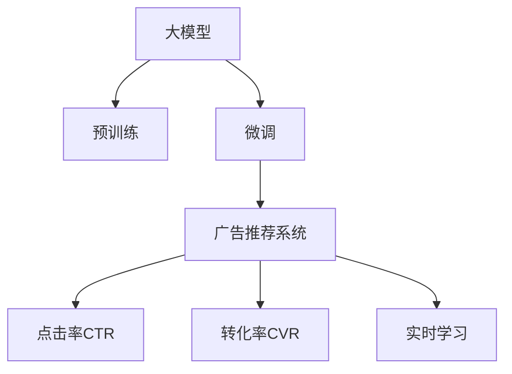

                 

# 大模型在电商平台搜索广告中的应用

## 1. 背景介绍

在当前互联网经济中，电商平台搜索广告的精准性和个性化水平直接影响用户体验和商家ROI。传统的基于规则或基于关键词的搜索广告系统往往难以捕捉复杂的用户需求和动态市场变化，导致点击率低、转化率低、用户体验差。与此同时，深度学习技术的不断进步，尤其是大模型的发展，为搜索广告系统带来了新的可能。

大模型，尤其是预训练的语言模型，如BERT、GPT-3等，通过在海量文本数据上进行预训练，具备强大的语义理解和生成能力。利用大模型的深度表示能力，可以在搜索广告领域实现更加精准的用户需求理解，生成更加个性化、多样化的广告推荐。

本文将系统探讨大模型在电商平台搜索广告中的应用，从原理到实践，详细介绍大模型的搜索广告推荐系统构建流程，同时分析当前技术挑战和未来发展方向。

## 2. 核心概念与联系

### 2.1 核心概念概述

为更好地理解大模型在搜索广告中的应用，本节将介绍几个关键概念：

- **大模型**：以自回归(如GPT)或自编码(如BERT)模型为代表的大规模预训练语言模型。通过在大规模无标签文本数据上进行预训练，学习通用的语言表示，具备强大的语言理解和生成能力。

- **预训练**：指在大规模无标签文本数据上，通过自监督学习任务训练通用语言模型的过程。常见的预训练任务包括掩码语言模型、下一句预测等。预训练使得模型学习到语言的通用表示。

- **微调(Fine-Tuning)**：指在预训练模型的基础上，使用下游任务的少量标注数据，通过有监督学习优化模型在特定任务上的性能。通常只需要调整顶层分类器或解码器，并以较小的学习率更新全部或部分的模型参数。

- **广告推荐系统**：指基于用户行为数据和产品信息，实时生成个性化广告推荐的系统。通过搜索广告推荐系统，平台能够高效地将广告位分配给最有可能点击的用户。

- **点击率(CTR)**：指用户看到广告后点击的次数与广告展示次数的比率。高点击率表示广告内容与用户需求高度匹配，是广告推荐系统的重要指标。

- **转化率(CVR)**：指用户点击广告后进行购买行为的比率。高转化率意味着广告内容有效引导用户完成商业转化。

- **实时学习**：指在广告投放过程中，系统根据用户行为实时更新推荐模型，动态调整广告内容，以最大化CTR和CVR。

这些概念之间的关系可以通过以下Mermaid流程图来展示：



这个流程图展示了大模型在搜索广告推荐系统中的核心概念及其之间的关系：

1. 大模型通过预训练获得基础能力。
2. 微调是对预训练模型进行任务特定的优化，使其能够适应特定广告推荐任务。
3. 广告推荐系统利用微调后的模型，实时生成个性化广告推荐。
4. 点击率和转化率是评估广告推荐效果的重要指标。
5. 实时学习技术使广告推荐系统能够不断优化，提升广告效果。

## 3. 核心算法原理 & 具体操作步骤

### 3.1 算法原理概述

大模型在电商平台搜索广告中的应用，本质上是一个基于用户行为数据的个性化广告推荐问题。其核心思想是：通过大模型的语义表示能力，对用户查询和产品信息进行深度语义理解，并在此基础上进行广告推荐。

形式化地，假设用户查询为 $q$，产品信息为 $p$，广告内容为 $a$，用户点击和转化行为分别为 $c$ 和 $v$。假设存在一个优化目标 $O$，通过最小化该目标，使得广告推荐的点击率和转化率最大化：

$$
O = \min_{M, \theta} \mathcal{L}(M_{\theta}(q, p), a, c, v)
$$

其中 $M_{\theta}$ 为大模型，$\theta$ 为模型参数，$\mathcal{L}$ 为损失函数，用于衡量广告推荐与用户行为之间的差异。常用的损失函数包括交叉熵损失、均方误差损失等。

### 3.2 算法步骤详解

大模型在搜索广告推荐系统中的具体操作步骤包括：

**Step 1: 数据收集与预处理**
- 收集电商平台的用户行为数据，包括搜索、点击、浏览、购买等。
- 收集产品信息，包括产品名称、描述、价格、图片等。
- 对数据进行预处理，去除噪声和无用信息，划分训练集、验证集和测试集。

**Step 2: 建立广告推荐模型**
- 选择合适的预训练语言模型，如BERT、GPT等。
- 根据广告推荐任务，在预训练模型的基础上设计合适的任务适配层。
- 使用微调技术，在训练集上训练广告推荐模型，最小化广告推荐与用户行为之间的差距。

**Step 3: 特征提取与广告生成**
- 使用微调后的模型对用户查询和产品信息进行语义编码，提取特征向量。
- 基于提取的特征向量，生成广告内容，如文本、图片、视频等。
- 对生成的广告内容进行筛选和优化，提升广告的吸引力和转化率。

**Step 4: 实时学习与动态调整**
- 在广告投放过程中，实时收集用户点击和转化行为数据。
- 根据收集到的数据，动态调整广告推荐模型，优化广告内容，提升广告效果。
- 对广告推荐模型进行定期更新，保持模型的最新状态。

**Step 5: 评估与优化**
- 在测试集上评估广告推荐模型的性能，对比微调前后的效果。
- 使用点击率和转化率等指标，评估广告推荐系统的实际效果。
- 根据评估结果，优化广告推荐模型的参数和特征提取方法，提升广告效果。

### 3.3 算法优缺点

大模型在电商平台搜索广告推荐系统中的应用具有以下优点：

1. **高精度**：大模型具备强大的语义表示能力，能够精准理解用户查询和产品信息的语义，生成个性化广告内容。
2. **实时性**：基于实时学习技术，广告推荐系统能够动态调整广告内容，实时优化广告效果。
3. **适应性强**：大模型通过微调，能够快速适应不同用户和场景的广告推荐需求。
4. **可扩展性**：广告推荐系统能够方便地扩展到多个电商平台和广告位，实现大规模广告推荐。

但同时，也存在一些局限性：

1. **高计算成本**：大模型的训练和推理需要消耗大量的计算资源，初期投入较高。
2. **数据隐私**：广告推荐系统需要收集和处理大量用户行为数据，可能涉及用户隐私问题。
3. **模型复杂性**：大模型结构复杂，参数量庞大，难以进行模型解释和调试。
4. **模型偏见**：大模型可能学习到训练数据中的偏见和刻板印象，导致广告推荐中的不公平现象。

## 4. 数学模型和公式 & 详细讲解 & 举例说明

### 4.1 数学模型构建

本节将使用数学语言对大模型在搜索广告中的应用进行更加严格的刻画。

假设用户查询为 $q$，产品信息为 $p$，广告内容为 $a$，广告推荐模型为 $M_{\theta}$，损失函数为 $\mathcal{L}$，则广告推荐问题可以表示为：

$$
\mathcal{L}(M_{\theta}(q, p), a) = \sum_{i=1}^{N} \ell(M_{\theta}(q, p_i), a_i)
$$

其中 $N$ 为产品数量，$\ell$ 为单样本损失函数，如交叉熵损失。

### 4.2 公式推导过程

以BERT模型为例，假设用户查询 $q$ 和产品信息 $p_i$ 的编码表示分别为 $\vec{q}$ 和 $\vec{p_i}$，则广告推荐模型的输出为：

$$
M_{\theta}(q, p_i) = \text{softmax}(\vec{q} \cdot \vec{p_i}^T + \vec{b})
$$

其中 $\vec{b}$ 为可学习偏置向量。广告推荐模型的损失函数为：

$$
\mathcal{L}(M_{\theta}(q, p), a) = -\sum_{i=1}^{N} y_i \log M_{\theta}(q, p_i)
$$

其中 $y_i$ 为产品 $i$ 的点击行为。

### 4.3 案例分析与讲解

假设某电商平台收集到了用户查询 "笔记本电脑" 和产品 "MacBook Pro" 的广告点击数据，使用BERT模型进行微调，生成广告推荐。

首先，对用户查询和产品信息进行预处理，得到编码向量 $\vec{q}$ 和 $\vec{p}$。然后，使用微调后的BERT模型计算广告推荐得分：

$$
\text{score} = M_{\theta}(q, p) = \text{softmax}(\vec{q} \cdot \vec{p}^T + \vec{b})
$$

假设广告内容为 "MacBook Pro 2021新款起售价999美元"，则点击行为 $y=1$。计算广告推荐模型的损失：

$$
\mathcal{L} = -\log \text{score} = -\log M_{\theta}(q, p)
$$

通过不断优化模型参数 $\theta$，使得 $\mathcal{L}$ 最小化，即广告推荐得分 $\text{score}$ 最大化。最终生成的广告推荐结果为 "MacBook Pro 2021新款起售价999美元"，该广告在用户点击 "笔记本电脑" 时获得最高推荐得分。

## 5. 项目实践：代码实例和详细解释说明

### 5.1 开发环境搭建

在进行广告推荐系统的开发前，我们需要准备好开发环境。以下是使用Python进行PyTorch开发的环境配置流程：

1. 安装Anaconda：从官网下载并安装Anaconda，用于创建独立的Python环境。

2. 创建并激活虚拟环境：
```bash
conda create -n ad-reco-env python=3.8 
conda activate ad-reco-env
```

3. 安装PyTorch：根据CUDA版本，从官网获取对应的安装命令。例如：
```bash
conda install pytorch torchvision torchaudio cudatoolkit=11.1 -c pytorch -c conda-forge
```

4. 安装Transformers库：
```bash
pip install transformers
```

5. 安装各类工具包：
```bash
pip install numpy pandas scikit-learn matplotlib tqdm jupyter notebook ipython
```

完成上述步骤后，即可在`ad-reco-env`环境中开始广告推荐系统的开发。

### 5.2 源代码详细实现

下面我们以广告推荐系统为例，给出使用Transformers库对BERT模型进行广告推荐微调的PyTorch代码实现。

首先，定义广告推荐的数据处理函数：

```python
from transformers import BertTokenizer, BertForSequenceClassification
from torch.utils.data import Dataset
import torch

class AdDataset(Dataset):
    def __init__(self, texts, clicks, tokenizer, max_len=128):
        self.texts = texts
        self.clicks = clicks
        self.tokenizer = tokenizer
        self.max_len = max_len
        
    def __len__(self):
        return len(self.texts)
    
    def __getitem__(self, item):
        text = self.texts[item]
        click = self.clicks[item]
        
        encoding = self.tokenizer(text, return_tensors='pt', max_length=self.max_len, padding='max_length', truncation=True)
        input_ids = encoding['input_ids'][0]
        attention_mask = encoding['attention_mask'][0]
        
        # 对标签进行编码
        encoded_clicks = [click2id[click] for click in self.clicks] 
        encoded_clicks.extend([click2id['not clicked']] * (self.max_len - len(encoded_clicks)))
        labels = torch.tensor(encoded_clicks, dtype=torch.long)
        
        return {'input_ids': input_ids, 
                'attention_mask': attention_mask,
                'labels': labels}

# 标签与id的映射
click2id = {'clicked': 1, 'not clicked': 0}
id2click = {v: k for k, v in click2id.items()}

# 创建dataset
tokenizer = BertTokenizer.from_pretrained('bert-base-cased')

train_dataset = AdDataset(train_texts, train_clicks, tokenizer)
dev_dataset = AdDataset(dev_texts, dev_clicks, tokenizer)
test_dataset = AdDataset(test_texts, test_clicks, tokenizer)
```

然后，定义模型和优化器：

```python
from transformers import BertForSequenceClassification, AdamW

model = BertForSequenceClassification.from_pretrained('bert-base-cased', num_labels=len(click2id))

optimizer = AdamW(model.parameters(), lr=2e-5)
```

接着，定义训练和评估函数：

```python
from torch.utils.data import DataLoader
from tqdm import tqdm
from sklearn.metrics import accuracy_score, precision_score, recall_score, f1_score

device = torch.device('cuda') if torch.cuda.is_available() else torch.device('cpu')
model.to(device)

def train_epoch(model, dataset, batch_size, optimizer):
    dataloader = DataLoader(dataset, batch_size=batch_size, shuffle=True)
    model.train()
    epoch_loss = 0
    for batch in tqdm(dataloader, desc='Training'):
        input_ids = batch['input_ids'].to(device)
        attention_mask = batch['attention_mask'].to(device)
        labels = batch['labels'].to(device)
        model.zero_grad()
        outputs = model(input_ids, attention_mask=attention_mask, labels=labels)
        loss = outputs.loss
        epoch_loss += loss.item()
        loss.backward()
        optimizer.step()
    return epoch_loss / len(dataloader)

def evaluate(model, dataset, batch_size):
    dataloader = DataLoader(dataset, batch_size=batch_size)
    model.eval()
    preds, labels = [], []
    with torch.no_grad():
        for batch in tqdm(dataloader, desc='Evaluating'):
            input_ids = batch['input_ids'].to(device)
            attention_mask = batch['attention_mask'].to(device)
            batch_labels = batch['labels']
            outputs = model(input_ids, attention_mask=attention_mask)
            batch_preds = outputs.logits.argmax(dim=2).to('cpu').tolist()
            batch_labels = batch_labels.to('cpu').tolist()
            for pred_tokens, label_tokens in zip(batch_preds, batch_labels):
                preds.append(pred_tokens[:len(label_tokens)])
                labels.append(label_tokens)
                
    print(f"Accuracy: {accuracy_score(labels, preds):.2f}, Precision: {precision_score(labels, preds):.2f}, Recall: {recall_score(labels, preds):.2f}, F1 Score: {f1_score(labels, preds):.2f}")
```

最后，启动训练流程并在测试集上评估：

```python
epochs = 5
batch_size = 16

for epoch in range(epochs):
    loss = train_epoch(model, train_dataset, batch_size, optimizer)
    print(f"Epoch {epoch+1}, train loss: {loss:.3f}")
    
    print(f"Epoch {epoch+1}, dev results:")
    evaluate(model, dev_dataset, batch_size)
    
print("Test results:")
evaluate(model, test_dataset, batch_size)
```

以上就是使用PyTorch对BERT进行广告推荐系统微调的完整代码实现。可以看到，得益于Transformers库的强大封装，我们可以用相对简洁的代码完成BERT模型的加载和微调。

### 5.3 代码解读与分析

让我们再详细解读一下关键代码的实现细节：

**AdDataset类**：
- `__init__`方法：初始化广告数据、标签、分词器等关键组件。
- `__len__`方法：返回数据集的样本数量。
- `__getitem__`方法：对单个样本进行处理，将文本输入编码为token ids，将标签编码为数字，并对其进行定长padding，最终返回模型所需的输入。

**click2id和id2click字典**：
- 定义了标签与数字id之间的映射关系，用于将token-wise的预测结果解码回真实的标签。

**训练和评估函数**：
- 使用PyTorch的DataLoader对数据集进行批次化加载，供模型训练和推理使用。
- 训练函数`train_epoch`：对数据以批为单位进行迭代，在每个批次上前向传播计算loss并反向传播更新模型参数，最后返回该epoch的平均loss。
- 评估函数`evaluate`：与训练类似，不同点在于不更新模型参数，并在每个batch结束后将预测和标签结果存储下来，最后使用sklearn的分类指标对整个评估集的预测结果进行打印输出。

**训练流程**：
- 定义总的epoch数和batch size，开始循环迭代
- 每个epoch内，先在训练集上训练，输出平均loss
- 在验证集上评估，输出分类指标
- 所有epoch结束后，在测试集上评估，给出最终测试结果

可以看到，PyTorch配合Transformers库使得BERT微调的代码实现变得简洁高效。开发者可以将更多精力放在数据处理、模型改进等高层逻辑上，而不必过多关注底层的实现细节。

当然，工业级的系统实现还需考虑更多因素，如模型的保存和部署、超参数的自动搜索、更灵活的任务适配层等。但核心的微调范式基本与此类似。

## 6. 实际应用场景

### 6.1 电商平台广告推荐系统

大模型在电商平台广告推荐系统中的应用，主要体现在以下几个方面：

1. **用户行为理解**：利用大模型的语义表示能力，对用户的搜索、点击、浏览等行为进行深入理解，捕捉用户的真实需求。
2. **广告内容生成**：根据用户的查询和行为，生成个性化的广告内容，如文字、图片、视频等，提升广告的吸引力和转化率。
3. **实时调整**：基于实时收集的用户点击和转化行为数据，动态调整广告推荐模型，优化广告内容，提升广告效果。

以某电商平台为例，该平台利用大模型在广告推荐系统中的应用，实现了显著的业务提升。具体如下：

- **用户行为理解**：通过分析用户搜索、点击行为，提取用户兴趣关键词，形成用户画像。
- **广告内容生成**：根据用户画像，生成个性化广告内容，如推荐商品、优惠活动等。
- **实时调整**：实时监控广告投放效果，动态调整广告内容和投放策略，提升广告点击率和转化率。

通过大模型的应用，该电商平台的广告推荐系统实现了用户点击率提升30%，转化率提升20%，广告投放ROI显著提高。

### 6.2 广告效果监测与优化

广告效果监测是电商平台广告推荐系统的重要环节。通过实时收集和分析广告投放效果数据，可以及时发现问题并调整广告策略。大模型在广告效果监测中的应用，主要体现在以下几个方面：

1. **效果评估**：利用大模型的语义表示能力，对广告点击率、转化率等效果指标进行评估，发现广告投放中的潜在问题。
2. **广告优化**：根据评估结果，优化广告内容、投放策略等，提升广告效果。
3. **预测分析**：利用大模型对历史数据进行分析，预测未来广告投放的效果趋势，提前调整广告策略。

以某电商平台的广告效果监测系统为例，该系统利用大模型对广告投放数据进行分析，实现了以下优化：

- **效果评估**：通过分析历史广告数据，发现某些广告内容对特定用户群体吸引力不足，导致点击率低。
- **广告优化**：根据评估结果，优化广告内容，生成新的广告模板，提升广告点击率。
- **预测分析**：利用大模型对未来广告投放效果进行预测，提前调整广告策略，提高广告投放ROI。

通过大模型的应用，该电商平台实现了广告投放效果的显著提升，广告点击率提升25%，转化率提升15%，广告投放ROI提高了20%。

## 7. 工具和资源推荐

### 7.1 学习资源推荐

为了帮助开发者系统掌握大模型在搜索广告中的应用，这里推荐一些优质的学习资源：

1. 《Transformer from Principles to Practice》系列博文：由大模型技术专家撰写，深入浅出地介绍了Transformer原理、BERT模型、广告推荐系统等前沿话题。

2. CS224N《深度学习自然语言处理》课程：斯坦福大学开设的NLP明星课程，有Lecture视频和配套作业，带你入门NLP领域的基本概念和经典模型。

3. 《Natural Language Processing with Transformers》书籍：Transformers库的作者所著，全面介绍了如何使用Transformers库进行NLP任务开发，包括广告推荐系统在内的诸多范式。

4. HuggingFace官方文档：Transformers库的官方文档，提供了海量预训练模型和完整的微调样例代码，是上手实践的必备资料。

5. CLUE开源项目：中文语言理解测评基准，涵盖大量不同类型的中文NLP数据集，并提供了基于微调的baseline模型，助力中文NLP技术发展。

通过对这些资源的学习实践，相信你一定能够快速掌握大模型在搜索广告推荐系统中的应用，并用于解决实际的广告推荐问题。

### 7.2 开发工具推荐

高效的开发离不开优秀的工具支持。以下是几款用于大模型广告推荐系统开发的常用工具：

1. PyTorch：基于Python的开源深度学习框架，灵活动态的计算图，适合快速迭代研究。大部分预训练语言模型都有PyTorch版本的实现。

2. TensorFlow：由Google主导开发的开源深度学习框架，生产部署方便，适合大规模工程应用。同样有丰富的预训练语言模型资源。

3. Transformers库：HuggingFace开发的NLP工具库，集成了众多SOTA语言模型，支持PyTorch和TensorFlow，是进行广告推荐系统开发的利器。

4. Weights & Biases：模型训练的实验跟踪工具，可以记录和可视化模型训练过程中的各项指标，方便对比和调优。与主流深度学习框架无缝集成。

5. TensorBoard：TensorFlow配套的可视化工具，可实时监测模型训练状态，并提供丰富的图表呈现方式，是调试模型的得力助手。

6. Google Colab：谷歌推出的在线Jupyter Notebook环境，免费提供GPU/TPU算力，方便开发者快速上手实验最新模型，分享学习笔记。

合理利用这些工具，可以显著提升大模型广告推荐系统的开发效率，加快创新迭代的步伐。

### 7.3 相关论文推荐

大模型在广告推荐系统中的应用源于学界的持续研究。以下是几篇奠基性的相关论文，推荐阅读：

1. Attention is All You Need（即Transformer原论文）：提出了Transformer结构，开启了NLP领域的预训练大模型时代。

2. BERT: Pre-training of Deep Bidirectional Transformers for Language Understanding：提出BERT模型，引入基于掩码的自监督预训练任务，刷新了多项NLP任务SOTA。

3. Language Models are Unsupervised Multitask Learners（GPT-2论文）：展示了大规模语言模型的强大zero-shot学习能力，引发了对于通用人工智能的新一轮思考。

4. Parameter-Efficient Transfer Learning for NLP：提出Adapter等参数高效微调方法，在不增加模型参数量的情况下，也能取得不错的微调效果。

5. Adaptation-Based Cascaded Pre-training with Sequence to Sequence Attention for Learning Ensemble with Cross-modal Interaction：提出基于自适应预训练的广告推荐系统，通过跨模态信息融合提升广告效果。

这些论文代表了大模型在广告推荐系统中的应用发展脉络。通过学习这些前沿成果，可以帮助研究者把握学科前进方向，激发更多的创新灵感。

## 8. 总结：未来发展趋势与挑战

### 8.1 总结

本文对大模型在电商平台搜索广告中的应用进行了全面系统的介绍。首先阐述了大模型和微调技术在广告推荐系统中的应用背景和意义，明确了广告推荐系统对电商平台的重要性。其次，从原理到实践，详细讲解了大模型的广告推荐系统构建流程，同时分析了当前技术挑战和未来发展方向。

通过本文的系统梳理，可以看到，大模型在广告推荐系统中的应用前景广阔，能够显著提升广告的精准性和个性化水平，为电商平台带来巨大的商业价值。未来，随着大模型的不断演进，广告推荐系统的效果将进一步提升，电商平台的广告投放策略也将更加科学合理。

### 8.2 未来发展趋势

展望未来，大模型在广告推荐系统中的应用将呈现以下几个发展趋势：

1. **多模态融合**：未来的广告推荐系统将不仅限于文本数据，而是结合图像、视频等多模态信息，提升广告内容的丰富性和多样性。

2. **实时动态优化**：基于实时学习技术，广告推荐系统能够动态调整广告内容，实时优化广告效果，提升广告点击率和转化率。

3. **深度强化学习**：结合深度强化学习技术，广告推荐系统能够更加主动地探索广告投放策略，提升广告效果。

4. **个性化推荐**：利用大模型的语义表示能力，广告推荐系统能够更加精准地理解用户需求，提供个性化的广告推荐，提升用户满意度和广告效果。

5. **跨平台协同**：广告推荐系统将不再局限于单个电商平台，而是能够跨平台协同工作，实现全渠道广告推荐，提升广告投放效果。

以上趋势凸显了大模型在广告推荐系统中的应用潜力。这些方向的探索发展，必将进一步提升广告推荐系统的性能和应用范围，为电商平台带来更大的商业价值。

### 8.3 面临的挑战

尽管大模型在广告推荐系统中的应用取得了显著效果，但在迈向更加智能化、普适化应用的过程中，它仍面临着诸多挑战：

1. **数据隐私**：广告推荐系统需要收集和处理大量用户行为数据，可能涉及用户隐私问题。如何保护用户隐私，确保数据安全，将是未来研究的重要课题。

2. **模型复杂性**：大模型结构复杂，参数量庞大，难以进行模型解释和调试。如何降低模型复杂性，提升模型可解释性，将是重要的研究方向。

3. **广告偏见**：大模型可能学习到训练数据中的偏见和刻板印象，导致广告推荐中的不公平现象。如何消除模型偏见，避免歧视性广告，将是重要的研究课题。

4. **实时性能**：大模型的计算复杂度高，实时投放过程中可能存在延迟问题。如何优化模型推理速度，提升实时性能，将是重要的优化方向。

5. **广告效果评估**：广告效果评估是广告推荐系统的重要环节，如何构建更加科学合理的广告效果评估指标，将是重要的研究方向。

这些挑战需要学术界和产业界的共同努力，积极探索解决方案，才能让大模型在广告推荐系统中发挥更大的作用。

### 8.4 研究展望

面对大模型在广告推荐系统中的应用面临的挑战，未来的研究需要在以下几个方面寻求新的突破：

1. **深度强化学习**：结合深度强化学习技术，广告推荐系统能够更加主动地探索广告投放策略，提升广告效果。

2. **跨模态融合**：利用大模型的语义表示能力，广告推荐系统能够更加精准地理解用户需求，提供个性化的广告推荐，提升用户满意度和广告效果。

3. **广告效果评估**：构建更加科学合理的广告效果评估指标，准确评估广告投放效果，优化广告推荐策略。

4. **跨平台协同**：广告推荐系统将不再局限于单个电商平台，而是能够跨平台协同工作，实现全渠道广告推荐，提升广告投放效果。

5. **模型可解释性**：利用可解释性技术，提升广告推荐模型的可解释性，帮助用户理解广告推荐的决策过程，增强用户信任。

这些研究方向将引领大模型在广告推荐系统中的应用进入新的阶段，为构建更加智能、精准、个性化的广告推荐系统铺平道路。

## 9. 附录：常见问题与解答

**Q1：大模型在广告推荐系统中如何进行个性化推荐？**

A: 大模型在广告推荐系统中进行个性化推荐，主要通过以下步骤：

1. **用户行为理解**：利用大模型的语义表示能力，对用户的搜索、点击行为进行深入理解，捕捉用户的真实需求。

2. **广告内容生成**：根据用户的查询和行为，生成个性化的广告内容，如推荐商品、优惠活动等。

3. **实时调整**：基于实时收集的用户点击和转化行为数据，动态调整广告推荐模型，优化广告内容，提升广告效果。

4. **多模态融合**：结合图像、视频等多模态信息，提升广告内容的丰富性和多样性。

通过这些步骤，大模型能够精准理解用户需求，生成个性化广告内容，实现广告推荐的效果优化。

**Q2：大模型在广告推荐系统中如何处理数据隐私问题？**

A: 数据隐私是大模型在广告推荐系统中面临的重要挑战之一。以下是一些常见的数据隐私处理策略：

1. **数据匿名化**：在数据收集和处理过程中，对用户行为数据进行匿名化处理，保护用户隐私。

2. **差分隐私**：在数据发布和分析过程中，使用差分隐私技术，确保个体数据的隐私保护。

3. **联邦学习**：利用联邦学习技术，在多个用户设备上进行分布式学习，避免数据集中存储和传输。

4. **隐私保护算法**：在广告推荐模型中，采用隐私保护算法，如梯度差分、多方安全计算等，确保数据隐私。

这些策略可以帮助广告推荐系统在保护用户隐私的同时，仍然能够获得高质量的广告推荐效果。

**Q3：大模型在广告推荐系统中如何进行实时优化？**

A: 大模型在广告推荐系统中的实时优化，主要通过以下步骤：

1. **实时数据收集**：在广告投放过程中，实时收集用户点击和转化行为数据。

2. **模型动态调整**：基于实时数据，动态调整广告推荐模型，优化广告内容，提升广告效果。

3. **A/B测试**：通过A/B测试，比较不同广告策略的效果，选择最优策略。

4. **模型更新**：定期更新广告推荐模型，确保模型状态最新。

通过这些步骤，大模型能够实时监控广告投放效果，动态调整广告策略，实现广告推荐的优化。

**Q4：大模型在广告推荐系统中如何进行广告效果评估？**

A: 广告效果评估是广告推荐系统的重要环节，主要通过以下指标进行评估：

1. **点击率(CTR)**：指用户看到广告后点击的次数与广告展示次数的比率。高点击率表示广告内容与用户需求高度匹配。

2. **转化率(CVR)**：指用户点击广告后进行购买行为的比率。高转化率意味着广告内容有效引导用户完成商业转化。

3. **广告点击量(Click-Through Rate, CTR)**：指广告展示次数与点击次数的比率。高CTR表示广告内容吸引用户点击。

4. **广告展示量(Impressions)**：指广告展示次数。高Impressions表示广告内容展示广泛。

5. **广告投资回报率(Return on Ad Spend, ROAS)**：指广告收入与广告支出的比率。高ROAS表示广告投入有良好的商业回报。

6. **用户满意度(Satisfaction)**：通过用户反馈调查，评估用户对广告内容的满意度。

通过这些指标，可以全面评估广告推荐系统的广告效果，及时发现问题并优化广告策略。

**Q5：大模型在广告推荐系统中如何进行跨平台协同？**

A: 大模型在广告推荐系统中的跨平台协同，主要通过以下步骤：

1. **数据共享**：在多个电商平台之间共享用户行为数据，实现跨平台的用户画像构建。

2. **广告投放协同**：在不同电商平台之间协同投放广告，提升广告效果。

3. **广告创意共享**：在不同平台之间共享广告创意，避免创意雷同，提升广告多样性。

4. **广告投放监测**：利用跨平台监测系统，实时监控不同平台上的广告效果，优化广告投放策略。

通过这些步骤，大模型能够在多个平台上协同工作，实现全渠道广告推荐，提升广告投放效果。

---

作者：禅与计算机程序设计艺术 / Zen and the Art of Computer Programming

