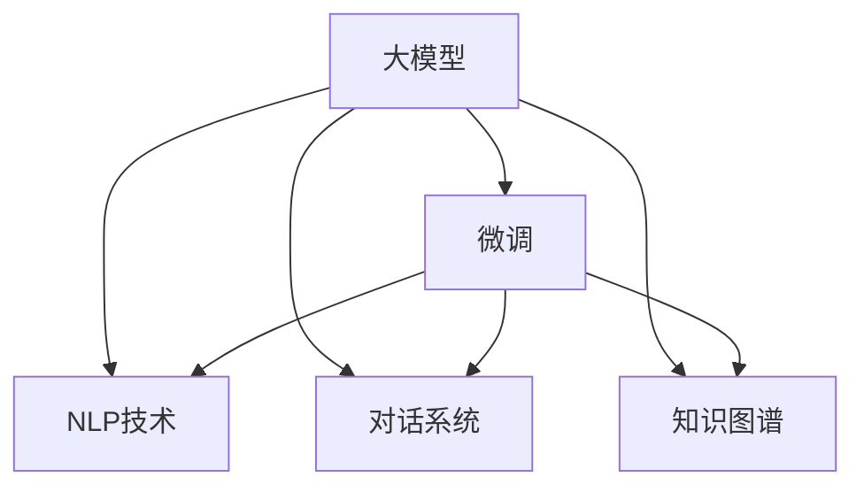

                 

# 大模型在电商平台智能客服中的应用

> 关键词：大模型, 智能客服, 电商平台, 自然语言处理, 深度学习, 对话系统, 微调, 算法, 部署, 优化

## 1. 背景介绍

### 1.1 问题由来
随着电子商务的飞速发展，电商平台面临巨大的客户服务挑战。传统的客服模式依赖于人工客服，成本高、效率低、响应速度慢。为了提升客户体验和运营效率，电商平台纷纷引入智能客服系统。

智能客服系统通常基于自然语言处理(NLP)技术，利用大模型进行文本理解和生成，自动处理客户的咨询和投诉。大模型，特别是基于Transformer结构的语言模型，具备强大的语言理解和生成能力，在智能客服领域显示出巨大的潜力。

### 1.2 问题核心关键点
大模型在智能客服系统中的应用，主要包括以下几个关键点：

1. **客户意图识别**：大模型通过训练，能够理解客户提出的问题和语义，自动判断客户意图。
2. **上下文感知**：智能客服系统需要具备上下文感知能力，能够记住对话历史，提供更连贯的回复。
3. **多模态融合**：除了文本信息，客户服务往往涉及图片、语音等多种模态，大模型需要能够融合多模态信息。
4. **知识图谱结合**：客服系统需要整合商品信息、用户画像、售后服务规则等知识图谱信息，提供准确可靠的解决方案。
5. **低成本高效率**：智能客服系统能够24/7不间断服务，大幅降低人力成本，提高响应效率。

这些关键点决定了大模型在智能客服中的应用必须综合考虑文本理解、多模态融合、知识整合等多方面技术，实现高效、准确、自然的服务体验。

## 2. 核心概念与联系

### 2.1 核心概念概述

为更好地理解大模型在智能客服系统中的应用，本节将介绍几个密切相关的核心概念：

- **大模型(Large Model)**：以自回归(如GPT)或自编码(如BERT)模型为代表的大规模预训练语言模型。通过在大规模无标签文本语料上进行预训练，学习通用的语言表示，具备强大的语言理解和生成能力。

- **微调(Fine-Tuning)**：指在预训练模型的基础上，使用下游任务的少量标注数据，通过有监督学习优化模型在特定任务上的性能。通常只需要调整顶层分类器或解码器，并以较小的学习率更新全部或部分的模型参数。

- **自然语言处理(NLP)**：研究如何使计算机理解、处理和生成自然语言的技术，包括文本分类、信息抽取、机器翻译、文本生成等任务。

- **对话系统(Chatbot)**：能够通过文本或语音与用户进行自然对话的系统，旨在解决用户提出的问题和提供信息。

- **知识图谱(Knowledge Graph)**：通过图结构表示实体及其关系的语义网络，常用于整合和推理结构化知识。

这些核心概念之间的逻辑关系可以通过以下Mermaid流程图来展示：



这个流程图展示了大模型在智能客服中的应用场景：

1. 大模型通过预训练获得基础能力。
2. 微调用于适配具体客服任务，优化模型性能。
3. NLP技术实现文本处理和意图识别。
4. 对话系统进行文本生成和回复。
5. 知识图谱整合结构化知识，辅助决策。

## 3. 核心算法原理 & 具体操作步骤
### 3.1 算法原理概述

大模型在智能客服系统中的应用，本质上是一个有监督的微调过程。其核心思想是：将预训练的大模型视作一个强大的"特征提取器"，通过在客服任务的标注数据上进行有监督的微调，使得模型输出能够匹配客服任务的目标。

形式化地，假设预训练模型为 $M_{\theta}$，其中 $\theta$ 为预训练得到的模型参数。给定客服任务的标注数据集 $D=\{(x_i,y_i)\}_{i=1}^N$，微调的目标是找到新的模型参数 $\hat{\theta}$，使得：

$$
\hat{\theta}=\mathop{\arg\min}_{\theta} \mathcal{L}(M_{\theta},D)
$$

其中 $\mathcal{L}$ 为针对客服任务设计的损失函数，用于衡量模型预测输出与真实标签之间的差异。常见的损失函数包括交叉熵损失、均方误差损失等。

通过梯度下降等优化算法，微调过程不断更新模型参数 $\theta$，最小化损失函数 $\mathcal{L}$，使得模型输出逼近真实标签。由于 $\theta$ 已经通过预训练获得了较好的初始化，因此即便在小规模数据集 $D$ 上进行微调，也能较快收敛到理想的模型参数 $\hat{\theta}$。

### 3.2 算法步骤详解

大模型在智能客服系统中的应用，通常遵循以下步骤：

**Step 1: 准备预训练模型和数据集**
- 选择合适的预训练语言模型 $M_{\theta}$ 作为初始化参数，如 BERT、GPT等。
- 准备客服任务的标注数据集 $D$，划分为训练集、验证集和测试集。一般要求标注数据与预训练数据的分布不要差异过大。

**Step 2: 添加客服任务适配层**
- 根据客服任务类型，在预训练模型顶层设计合适的输出层和损失函数。
- 对于分类任务，通常在顶层添加线性分类器和交叉熵损失函数。
- 对于生成任务，通常使用语言模型的解码器输出概率分布，并以负对数似然为损失函数。

**Step 3: 设置微调超参数**
- 选择合适的优化算法及其参数，如 AdamW、SGD 等，设置学习率、批大小、迭代轮数等。
- 设置正则化技术及强度，包括权重衰减、Dropout、Early Stopping等。
- 确定冻结预训练参数的策略，如仅微调顶层，或全部参数都参与微调。

**Step 4: 执行梯度训练**
- 将训练集数据分批次输入模型，前向传播计算损失函数。
- 反向传播计算参数梯度，根据设定的优化算法和学习率更新模型参数。
- 周期性在验证集上评估模型性能，根据性能指标决定是否触发 Early Stopping。
- 重复上述步骤直到满足预设的迭代轮数或 Early Stopping 条件。

**Step 5: 测试和部署**
- 在测试集上评估微调后模型 $M_{\hat{\theta}}$ 的性能，对比微调前后的精度提升。
- 使用微调后的模型对新样本进行推理预测，集成到实际的应用系统中。
- 持续收集新的数据，定期重新微调模型，以适应数据分布的变化。

以上是基于监督学习微调大模型的一般流程。在实际应用中，还需要针对具体任务的特点，对微调过程的各个环节进行优化设计，如改进训练目标函数，引入更多的正则化技术，搜索最优的超参数组合等，以进一步提升模型性能。

### 3.3 算法优缺点

大模型在智能客服系统中的应用具有以下优点：

1. **高效性**：基于大模型微调的客服系统能够24/7不间断服务，大幅度降低人力成本。
2. **灵活性**：大模型能够适应各种客服场景，从简单的问答到复杂的场景处理，都能提供高效支持。
3. **可解释性**：微调后的模型可以提供推理过程的解释，有助于用户理解客服系统的决策逻辑。
4. **语义理解能力**：大模型具备强大的语言理解能力，能够处理复杂的语义和上下文信息。

同时，该方法也存在一定的局限性：

1. **数据质量要求高**：微调效果很大程度上取决于标注数据的质量和数量，获取高质量标注数据的成本较高。
2. **泛化能力有限**：当目标任务与预训练数据的分布差异较大时，微调的性能提升有限。
3. **维护成本高**：客服系统需要定期更新知识图谱和对话模板，维护成本较高。

尽管存在这些局限性，但就目前而言，基于大模型的微调方法仍是大规模客服系统的核心技术。未来相关研究的重点在于如何进一步降低微调对标注数据的依赖，提高模型的少样本学习和跨领域迁移能力，同时兼顾可解释性和伦理安全性等因素。

### 3.4 算法应用领域

大模型在智能客服系统中的应用已经广泛应用于各大电商平台，以下是几个典型的应用场景：

1. **客户咨询解答**：电商平台的客服系统能够自动回答客户的各种问题，如商品信息、价格、退换货政策等。
2. **订单处理**：智能客服系统能够处理订单状态查询、退换货申请等业务，提供快速响应。
3. **个性化推荐**：根据客户的咨询记录和购买历史，智能客服系统能够推荐相关商品，提升用户体验。
4. **智能问答**：针对用户的复杂问题，智能客服系统能够提供多轮对话，逐步引导用户找到解决方案。
5. **情感分析**：通过对客服对话的情感分析，电商平台能够及时发现和解决用户的情绪问题，提升客户满意度。

除了上述这些经典应用外，大模型在智能客服系统的创新应用还在不断涌现，如语音客服、虚拟主播、客服机器人等，为电商平台的客户服务提供了更加智能化、个性化的解决方案。

## 4. 数学模型和公式 & 详细讲解  
### 4.1 数学模型构建

本节将使用数学语言对大模型在智能客服系统中的应用过程进行更加严格的刻画。

记预训练语言模型为 $M_{\theta}$，其中 $\theta$ 为预训练得到的模型参数。假设客服任务的训练集为 $D=\{(x_i,y_i)\}_{i=1}^N, x_i \in \mathcal{X}, y_i \in \mathcal{Y}$。

定义模型 $M_{\theta}$ 在输入 $x$ 上的损失函数为 $\ell(M_{\theta}(x),y)$，则在数据集 $D$ 上的经验风险为：

$$
\mathcal{L}(\theta) = \frac{1}{N} \sum_{i=1}^N \ell(M_{\theta}(x_i),y_i)
$$

微调的优化目标是最小化经验风险，即找到最优参数：

$$
\theta^* = \mathop{\arg\min}_{\theta} \mathcal{L}(\theta)
$$

在实践中，我们通常使用基于梯度的优化算法（如SGD、Adam等）来近似求解上述最优化问题。设 $\eta$ 为学习率，$\lambda$ 为正则化系数，则参数的更新公式为：

$$
\theta \leftarrow \theta - \eta \nabla_{\theta}\mathcal{L}(\theta) - \eta\lambda\theta
$$

其中 $\nabla_{\theta}\mathcal{L}(\theta)$ 为损失函数对参数 $\theta$ 的梯度，可通过反向传播算法高效计算。

### 4.2 公式推导过程

以下我们以客服分类任务为例，推导交叉熵损失函数及其梯度的计算公式。

假设模型 $M_{\theta}$ 在输入 $x$ 上的输出为 $\hat{y}=M_{\theta}(x) \in [0,1]$，表示客户咨询属于某一类别的概率。真实标签 $y \in \{0,1\}$。则二分类交叉熵损失函数定义为：

$$
\ell(M_{\theta}(x),y) = -[y\log \hat{y} + (1-y)\log (1-\hat{y})]
$$

将其代入经验风险公式，得：

$$
\mathcal{L}(\theta) = -\frac{1}{N}\sum_{i=1}^N [y_i\log M_{\theta}(x_i)+(1-y_i)\log(1-M_{\theta}(x_i))]
$$

根据链式法则，损失函数对参数 $\theta_k$ 的梯度为：

$$
\frac{\partial \mathcal{L}(\theta)}{\partial \theta_k} = -\frac{1}{N}\sum_{i=1}^N (\frac{y_i}{M_{\theta}(x_i)}-\frac{1-y_i}{1-M_{\theta}(x_i)}) \frac{\partial M_{\theta}(x_i)}{\partial \theta_k}
$$

其中 $\frac{\partial M_{\theta}(x_i)}{\partial \theta_k}$ 可进一步递归展开，利用自动微分技术完成计算。

在得到损失函数的梯度后，即可带入参数更新公式，完成模型的迭代优化。重复上述过程直至收敛，最终得到适应客服任务的最优模型参数 $\theta^*$。

## 5. 项目实践：代码实例和详细解释说明
### 5.1 开发环境搭建

在进行客服系统微调实践前，我们需要准备好开发环境。以下是使用Python进行PyTorch开发的环境配置流程：

1. 安装Anaconda：从官网下载并安装Anaconda，用于创建独立的Python环境。

2. 创建并激活虚拟环境：
```bash
conda create -n pytorch-env python=3.8 
conda activate pytorch-env
```

3. 安装PyTorch：根据CUDA版本，从官网获取对应的安装命令。例如：
```bash
conda install pytorch torchvision torchaudio cudatoolkit=11.1 -c pytorch -c conda-forge
```

4. 安装Transformers库：
```bash
pip install transformers
```

5. 安装各类工具包：
```bash
pip install numpy pandas scikit-learn matplotlib tqdm jupyter notebook ipython
```

完成上述步骤后，即可在`pytorch-env`环境中开始微调实践。

### 5.2 源代码详细实现

下面我们以客服分类任务为例，给出使用Transformers库对BERT模型进行微调的PyTorch代码实现。

首先，定义客服分类任务的数据处理函数：

```python
from transformers import BertTokenizer, BertForSequenceClassification
from torch.utils.data import Dataset
import torch

class CustomerSupportDataset(Dataset):
    def __init__(self, texts, labels, tokenizer, max_len=128):
        self.texts = texts
        self.labels = labels
        self.tokenizer = tokenizer
        self.max_len = max_len
        
    def __len__(self):
        return len(self.texts)
    
    def __getitem__(self, item):
        text = self.texts[item]
        label = self.labels[item]
        
        encoding = self.tokenizer(text, return_tensors='pt', max_length=self.max_len, padding='max_length', truncation=True)
        input_ids = encoding['input_ids'][0]
        attention_mask = encoding['attention_mask'][0]
        
        # 对label进行编码
        encoded_labels = torch.tensor(label, dtype=torch.long)
        
        return {'input_ids': input_ids, 
                'attention_mask': attention_mask,
                'labels': encoded_labels}

# 标签编码
label2id = {'Positive': 1, 'Negative': 0}
id2label = {v: k for k, v in label2id.items()}

# 创建dataset
tokenizer = BertTokenizer.from_pretrained('bert-base-cased')

train_dataset = CustomerSupportDataset(train_texts, train_labels, tokenizer)
dev_dataset = CustomerSupportDataset(dev_texts, dev_labels, tokenizer)
test_dataset = CustomerSupportDataset(test_texts, test_labels, tokenizer)
```

然后，定义模型和优化器：

```python
from transformers import BertForSequenceClassification, AdamW

model = BertForSequenceClassification.from_pretrained('bert-base-cased', num_labels=2)

optimizer = AdamW(model.parameters(), lr=2e-5)
```

接着，定义训练和评估函数：

```python
from torch.utils.data import DataLoader
from tqdm import tqdm
from sklearn.metrics import classification_report

device = torch.device('cuda') if torch.cuda.is_available() else torch.device('cpu')
model.to(device)

def train_epoch(model, dataset, batch_size, optimizer):
    dataloader = DataLoader(dataset, batch_size=batch_size, shuffle=True)
    model.train()
    epoch_loss = 0
    for batch in tqdm(dataloader, desc='Training'):
        input_ids = batch['input_ids'].to(device)
        attention_mask = batch['attention_mask'].to(device)
        labels = batch['labels'].to(device)
        model.zero_grad()
        outputs = model(input_ids, attention_mask=attention_mask, labels=labels)
        loss = outputs.loss
        epoch_loss += loss.item()
        loss.backward()
        optimizer.step()
    return epoch_loss / len(dataloader)

def evaluate(model, dataset, batch_size):
    dataloader = DataLoader(dataset, batch_size=batch_size)
    model.eval()
    preds, labels = [], []
    with torch.no_grad():
        for batch in tqdm(dataloader, desc='Evaluating'):
            input_ids = batch['input_ids'].to(device)
            attention_mask = batch['attention_mask'].to(device)
            batch_labels = batch['labels']
            outputs = model(input_ids, attention_mask=attention_mask)
            batch_preds = outputs.logits.argmax(dim=1).to('cpu').tolist()
            batch_labels = batch_labels.to('cpu').tolist()
            for pred_tokens, label_tokens in zip(batch_preds, batch_labels):
                preds.append(pred_tokens)
                labels.append(label_tokens)
                
    print(classification_report(labels, preds))
```

最后，启动训练流程并在测试集上评估：

```python
epochs = 5
batch_size = 16

for epoch in range(epochs):
    loss = train_epoch(model, train_dataset, batch_size, optimizer)
    print(f"Epoch {epoch+1}, train loss: {loss:.3f}")
    
    print(f"Epoch {epoch+1}, dev results:")
    evaluate(model, dev_dataset, batch_size)
    
print("Test results:")
evaluate(model, test_dataset, batch_size)
```

以上就是使用PyTorch对BERT进行客服分类任务微调的完整代码实现。可以看到，得益于Transformers库的强大封装，我们可以用相对简洁的代码完成BERT模型的加载和微调。

### 5.3 代码解读与分析

让我们再详细解读一下关键代码的实现细节：

**CustomerSupportDataset类**：
- `__init__`方法：初始化文本、标签、分词器等关键组件。
- `__len__`方法：返回数据集的样本数量。
- `__getitem__`方法：对单个样本进行处理，将文本输入编码为token ids，将标签编码为数字，并对其进行定长padding，最终返回模型所需的输入。

**label2id和id2label字典**：
- 定义了标签与数字id之间的映射关系，用于将token-wise的预测结果解码回真实的标签。

**训练和评估函数**：
- 使用PyTorch的DataLoader对数据集进行批次化加载，供模型训练和推理使用。
- 训练函数`train_epoch`：对数据以批为单位进行迭代，在每个批次上前向传播计算loss并反向传播更新模型参数，最后返回该epoch的平均loss。
- 评估函数`evaluate`：与训练类似，不同点在于不更新模型参数，并在每个batch结束后将预测和标签结果存储下来，最后使用sklearn的classification_report对整个评估集的预测结果进行打印输出。

**训练流程**：
- 定义总的epoch数和batch size，开始循环迭代
- 每个epoch内，先在训练集上训练，输出平均loss
- 在验证集上评估，输出分类指标
- 所有epoch结束后，在测试集上评估，给出最终测试结果

可以看到，PyTorch配合Transformers库使得BERT微调的代码实现变得简洁高效。开发者可以将更多精力放在数据处理、模型改进等高层逻辑上，而不必过多关注底层的实现细节。

当然，工业级的系统实现还需考虑更多因素，如模型的保存和部署、超参数的自动搜索、更灵活的任务适配层等。但核心的微调范式基本与此类似。

## 6. 实际应用场景
### 6.1 智能客服系统

基于大模型微调的对话技术，可以广泛应用于智能客服系统的构建。传统客服往往需要配备大量人力，高峰期响应缓慢，且一致性和专业性难以保证。而使用微调后的对话模型，可以7x24小时不间断服务，快速响应客户咨询，用自然流畅的语言解答各类常见问题。

在技术实现上，可以收集企业内部的历史客服对话记录，将问题和最佳答复构建成监督数据，在此基础上对预训练对话模型进行微调。微调后的对话模型能够自动理解用户意图，匹配最合适的答案模板进行回复。对于客户提出的新问题，还可以接入检索系统实时搜索相关内容，动态组织生成回答。如此构建的智能客服系统，能大幅提升客户咨询体验和问题解决效率。

### 6.2 金融舆情监测

金融机构需要实时监测市场舆论动向，以便及时应对负面信息传播，规避金融风险。传统的人工监测方式成本高、效率低，难以应对网络时代海量信息爆发的挑战。基于大语言模型微调的文本分类和情感分析技术，为金融舆情监测提供了新的解决方案。

具体而言，可以收集金融领域相关的新闻、报道、评论等文本数据，并对其进行主题标注和情感标注。在此基础上对预训练语言模型进行微调，使其能够自动判断文本属于何种主题，情感倾向是正面、中性还是负面。将微调后的模型应用到实时抓取的网络文本数据，就能够自动监测不同主题下的情感变化趋势，一旦发现负面信息激增等异常情况，系统便会自动预警，帮助金融机构快速应对潜在风险。

### 6.3 个性化推荐系统

当前的推荐系统往往只依赖用户的历史行为数据进行物品推荐，无法深入理解用户的真实兴趣偏好。基于大语言模型微调技术，个性化推荐系统可以更好地挖掘用户行为背后的语义信息，从而提供更精准、多样的推荐内容。

在实践中，可以收集用户浏览、点击、评论、分享等行为数据，提取和用户交互的物品标题、描述、标签等文本内容。将文本内容作为模型输入，用户的后续行为（如是否点击、购买等）作为监督信号，在此基础上微调预训练语言模型。微调后的模型能够从文本内容中准确把握用户的兴趣点。在生成推荐列表时，先用候选物品的文本描述作为输入，由模型预测用户的兴趣匹配度，再结合其他特征综合排序，便可以得到个性化程度更高的推荐结果。

### 6.4 未来应用展望

随着大语言模型微调技术的发展，基于微调范式将在更多领域得到应用，为传统行业带来变革性影响。

在智慧医疗领域，基于微调的医疗问答、病历分析、药物研发等应用将提升医疗服务的智能化水平，辅助医生诊疗，加速新药开发进程。

在智能教育领域，微调技术可应用于作业批改、学情分析、知识推荐等方面，因材施教，促进教育公平，提高教学质量。

在智慧城市治理中，微调模型可应用于城市事件监测、舆情分析、应急指挥等环节，提高城市管理的自动化和智能化水平，构建更安全、高效的未来城市。

此外，在企业生产、社会治理、文娱传媒等众多领域，基于大模型微调的人工智能应用也将不断涌现，为经济社会发展注入新的动力。相信随着技术的日益成熟，微调方法将成为人工智能落地应用的重要范式，推动人工智能技术在垂直行业的规模化落地。总之，微调需要开发者根据具体任务，不断迭代和优化模型、数据和算法，方能得到理想的效果。

## 7. 工具和资源推荐
### 7.1 学习资源推荐

为了帮助开发者系统掌握大模型微调的理论基础和实践技巧，这里推荐一些优质的学习资源：

1. 《Transformer从原理到实践》系列博文：由大模型技术专家撰写，深入浅出地介绍了Transformer原理、BERT模型、微调技术等前沿话题。

2. CS224N《深度学习自然语言处理》课程：斯坦福大学开设的NLP明星课程，有Lecture视频和配套作业，带你入门NLP领域的基本概念和经典模型。

3. 《Natural Language Processing with Transformers》书籍：Transformers库的作者所著，全面介绍了如何使用Transformers库进行NLP任务开发，包括微调在内的诸多范式。

4. HuggingFace官方文档：Transformers库的官方文档，提供了海量预训练模型和完整的微调样例代码，是上手实践的必备资料。

5. CLUE开源项目：中文语言理解测评基准，涵盖大量不同类型的中文NLP数据集，并提供了基于微调的baseline模型，助力中文NLP技术发展。

通过对这些资源的学习实践，相信你一定能够快速掌握大模型微调的精髓，并用于解决实际的NLP问题。
###  7.2 开发工具推荐

高效的开发离不开优秀的工具支持。以下是几款用于大模型微调开发的常用工具：

1. PyTorch：基于Python的开源深度学习框架，灵活动态的计算图，适合快速迭代研究。大部分预训练语言模型都有PyTorch版本的实现。

2. TensorFlow：由Google主导开发的开源深度学习框架，生产部署方便，适合大规模工程应用。同样有丰富的预训练语言模型资源。

3. Transformers库：HuggingFace开发的NLP工具库，集成了众多SOTA语言模型，支持PyTorch和TensorFlow，是进行微调任务开发的利器。

4. Weights & Biases：模型训练的实验跟踪工具，可以记录和可视化模型训练过程中的各项指标，方便对比和调优。与主流深度学习框架无缝集成。

5. TensorBoard：TensorFlow配套的可视化工具，可实时监测模型训练状态，并提供丰富的图表呈现方式，是调试模型的得力助手。

6. Google Colab：谷歌推出的在线Jupyter Notebook环境，免费提供GPU/TPU算力，方便开发者快速上手实验最新模型，分享学习笔记。

合理利用这些工具，可以显著提升大语言模型微调任务的开发效率，加快创新迭代的步伐。

### 7.3 相关论文推荐

大语言模型和微调技术的发展源于学界的持续研究。以下是几篇奠基性的相关论文，推荐阅读：

1. Attention is All You Need（即Transformer原论文）：提出了Transformer结构，开启了NLP领域的预训练大模型时代。

2. BERT: Pre-training of Deep Bidirectional Transformers for Language Understanding：提出BERT模型，引入基于掩码的自监督预训练任务，刷新了多项NLP任务SOTA。

3. Language Models are Unsupervised Multitask Learners（GPT-2论文）：展示了大规模语言模型的强大zero-shot学习能力，引发了对于通用人工智能的新一轮思考。

4. Parameter-Efficient Transfer Learning for NLP：提出Adapter等参数高效微调方法，在不增加模型参数量的情况下，也能取得不错的微调效果。

5. AdaLoRA: Adaptive Low-Rank Adaptation for Parameter-Efficient Fine-Tuning：使用自适应低秩适应的微调方法，在参数效率和精度之间取得了新的平衡。

这些论文代表了大语言模型微调技术的发展脉络。通过学习这些前沿成果，可以帮助研究者把握学科前进方向，激发更多的创新灵感。

## 8. 总结：未来发展趋势与挑战

### 8.1 总结

本文对大模型在电商平台智能客服中的应用进行了全面系统的介绍。首先阐述了智能客服系统在大电商平台的价值和挑战，明确了基于大模型的微调方法在提升客户体验和运营效率方面的独特优势。其次，从原理到实践，详细讲解了微调的数学原理和关键步骤，给出了微调任务开发的完整代码实例。同时，本文还广泛探讨了微调方法在智能客服系统中的应用场景，展示了微调范式的广泛适用性。

通过本文的系统梳理，可以看到，基于大模型的微调方法在智能客服系统中的应用正逐渐成熟，为电商平台提供了高效、智能、个性化的客户服务解决方案。未来，随着大语言模型的不断进步和微调技术的深入研究，智能客服系统将能够提供更优质、更智能的客户体验，为电商平台的竞争力和客户满意度带来新的提升。

### 8.2 未来发展趋势

展望未来，大模型在智能客服系统中的应用将呈现以下几个发展趋势：

1. **个性化推荐**：智能客服系统将不仅仅局限于简单的问答，而是通过深度学习技术，进行多轮对话和推荐，提供更加个性化的服务体验。
2. **情感分析与用户画像**：智能客服系统将进一步整合用户的情感数据和画像信息，提供更加精准的情感分析和个性化推荐。
3. **多模态融合**：除了文本信息，智能客服系统将进一步整合语音、图像等多种模态信息，提供更加自然、直观的交互体验。
4. **知识图谱结合**：智能客服系统将更紧密地结合商品信息、售后服务规则等知识图谱信息，提供更加准确、可靠的解决方案。
5. **低成本高效率**：随着模型的不断优化和部署技术的提升，智能客服系统将进一步降低维护成本，提升服务效率。

以上趋势凸显了大模型在智能客服系统中的应用前景。这些方向的探索发展，必将进一步提升智能客服系统的智能化水平，为电商平台的客户服务带来新的突破。

### 8.3 面临的挑战

尽管大模型在智能客服系统中的应用已经取得了一定的进展，但在迈向更加智能化、普适化应用的过程中，它仍面临着诸多挑战：

1. **数据质量问题**：智能客服系统依赖大量标注数据进行微调，而标注数据的质量和数量往往受限于人工标注的时间和成本，影响模型的性能。
2. **模型泛化能力**：智能客服系统面临的客户问题复杂多样，模型的泛化能力决定了其对新问题的处理能力。
3. **交互体验**：智能客服系统的用户体验与人工客服的流畅度和自然度仍有一定差距，需要通过多轮对话设计和情感分析等技术进一步优化。
4. **安全性与隐私**：智能客服系统处理大量的用户隐私信息，需要确保数据安全和用户隐私保护。
5. **模型维护与更新**：智能客服系统需要持续维护和更新，确保其知识库和模型参数的实时性。

尽管存在这些挑战，但通过不断优化和创新，大模型在智能客服系统中的应用将不断提升。未来，随着技术进步和行业标准的制定，这些问题有望得到解决，智能客服系统将能够提供更加高效、智能、安全的客户服务。

### 8.4 研究展望

面对智能客服系统面临的诸多挑战，未来的研究需要在以下几个方面寻求新的突破：

1. **多轮对话设计与优化**：研究更加自然、连贯的多轮对话设计，通过上下文感知和逻辑推理，提高智能客服系统的交互体验。
2. **情感分析与用户画像**：开发更加精准的情感分析算法和用户画像技术，提升智能客服系统的情感识别和个性化推荐能力。
3. **多模态融合技术**：研究语音识别、图像识别等多模态融合技术，提升智能客服系统的自然交互能力。
4. **知识图谱结合**：探索更加高效的知识图谱整合方法，提升智能客服系统的知识检索和推理能力。
5. **低成本高效率的部署技术**：研究模型裁剪、量化加速等技术，提升智能客服系统的部署效率和资源利用率。

这些研究方向将推动智能客服系统向更加智能化、普适化、个性化的方向发展，为电商平台的客户服务带来新的突破。总之，大模型在智能客服系统中的应用将不断提升，为电商平台带来更优质的客户体验和更高的运营效率。

## 9. 附录：常见问题与解答

**Q1：智能客服系统如何理解用户意图？**

A: 智能客服系统通过微调后的语言模型进行意图识别，将用户输入的文本编码为向量，输入到模型中进行推理。模型通过学习大量标注数据，能够识别出用户的主要意图，并根据意图进行相应的回答。

**Q2：智能客服系统如何保证回答的准确性？**

A: 智能客服系统通过多轮对话设计和情感分析技术，能够理解用户的情感状态和上下文信息，提高回答的准确性。同时，系统能够动态更新知识图谱和对话模板，确保回答的时效性和准确性。

**Q3：智能客服系统如何处理多轮对话？**

A: 智能客服系统通过上下文感知技术，能够记住对话历史，根据上下文信息进行多轮对话设计。系统在每一轮对话中，根据用户的问题，动态调整回答策略，提供更加连贯、自然的回答。

**Q4：智能客服系统如何保证数据安全和用户隐私？**

A: 智能客服系统通过加密传输、数据脱敏等技术，保护用户的隐私信息。同时，系统采用严格的访问控制和安全策略，确保数据的安全性。

**Q5：智能客服系统如何维护和更新？**

A: 智能客服系统需要持续维护和更新，定期重新微调模型，更新知识图谱和对话模板。系统还应该设置自动化监控和报警机制，及时发现和处理异常情况。

通过不断优化和创新，智能客服系统将能够提供更加高效、智能、安全的客户服务，为电商平台带来新的竞争优势。总之，大模型在智能客服系统中的应用将不断提升，为电商平台的客户服务带来新的突破。

