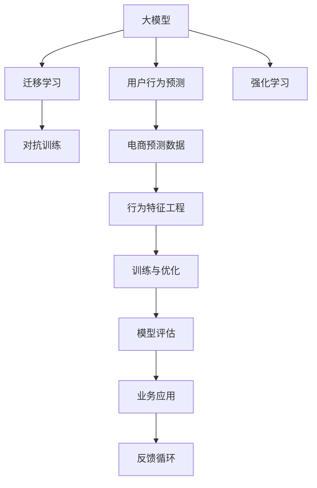

                 

# 大模型在电商平台用户行为预测与干预中的应用

## 1. 背景介绍

随着电商市场的迅速发展，各大电商平台面临着海量用户数据和复杂商业逻辑的挑战。如何深入挖掘用户行为数据，预测用户未来的购买行为，并在合适的时机进行干预，成为了电商平台提升用户粘性和销售额的重要课题。传统的统计模型和规则系统，在面对大规模、高维度数据时显得力不从心，无法满足电商平台的实际需求。而深度学习大模型，通过海量数据预训练和迁移学习，在大规模电商数据上表现出色，具备强大的用户行为预测能力。

本文将详细介绍大模型在电商平台用户行为预测与干预中的应用，包括算法原理、具体操作步骤、模型评估和优化等关键环节。首先，我们通过分析电商平台用户行为数据的特点和挑战，引出用户行为预测的必要性和大模型的潜在优势。然后，重点探讨大模型在电商领域的具体应用场景，以及如何选择合适的模型、配置参数、进行优化等关键步骤。最后，我们总结了电商领域大模型的未来发展趋势和面临的挑战，提出未来研究的展望。

## 2. 核心概念与联系

### 2.1 核心概念概述

为了更好地理解大模型在电商平台用户行为预测与干预中的应用，本节将介绍几个密切相关的核心概念：

- 大模型(Pre-trained Large Model, PLM)：指在大规模无标签数据上进行预训练，学习通用的语言或特征表示，具有强大的泛化能力。常见的预训练模型包括BERT、GPT、Wav2Vec等。

- 用户行为预测(Users Behavior Prediction)：通过分析用户的历史行为数据，预测用户未来的行为（如点击、购买、流失等），帮助电商平台优化用户体验，提升转化率和用户粘性。

- 迁移学习(Transfer Learning)：指将在一个任务上学习到的知识迁移到另一个任务上，以减少在每个任务上从头开始训练的成本。大模型通过迁移学习，可以在新任务上快速取得良好性能。

- 对抗训练(Adversarial Training)：通过引入对抗样本，提升模型的鲁棒性和泛化能力。在电商平台用户行为预测中，对抗训练可以防止模型在面对数据异常或攻击时失效。

- 强化学习(Reinforcement Learning, RL)：通过智能体与环境互动，学习最优决策策略。在电商平台干预场景中，强化学习可以优化推荐策略，提升个性化服务的效果。

这些核心概念之间的逻辑关系可以通过以下Mermaid流程图来展示：



这个流程图展示了大模型的核心概念及其之间的关系：

1. 大模型通过预训练获得基础能力。
2. 迁移学习使得通用大模型能够适应特定电商任务。
3. 对抗训练提高模型的鲁棒性和泛化能力。
4. 强化学习优化推荐策略，提升个性化服务。
5. 用户行为预测使用大模型对电商预测数据进行分析。
6. 特征工程处理原始电商数据，转化为模型可用的特征。
7. 训练优化过程在大模型上进行。
8. 模型评估与业务应用将结果反馈到电商系统中。

## 3. 核心算法原理 & 具体操作步骤

### 3.1 算法原理概述

大模型在电商平台用户行为预测与干预中的应用，主要基于两个关键技术：

1. 用户行为序列建模。通过大模型对用户的行为序列进行建模，预测用户未来的行为。
2. 用户行为干预优化。通过大模型对用户的推荐策略进行优化，提升个性化推荐的效果。

这两个技术的基础都是大模型的预训练能力和迁移学习能力。具体而言，大模型通过大规模预训练，学习到丰富的语言或特征表示，然后通过迁移学习，适应电商数据集的特点，用于用户行为预测和干预。

### 3.2 算法步骤详解

大模型在电商平台用户行为预测与干预的具体应用步骤如下：

**Step 1: 数据预处理与特征工程**

- 收集电商平台的用户行为数据，包括用户的点击、浏览、购买等行为。
- 对原始数据进行清洗、去重、归一化等预处理操作。
- 根据业务需求，设计合适的特征工程管道，提取重要的特征，如用户ID、商品ID、时间戳等。

**Step 2: 模型选择与配置**

- 选择合适的预训练模型，如BERT、GPT-3等。
- 根据任务特点，配置模型的超参数，如学习率、批量大小、训练轮数等。

**Step 3: 微调与训练**

- 将预训练模型作为初始化参数，在电商数据上进行微调。
- 定义损失函数和优化器，计算模型的预测输出与实际标签之间的差异。
- 采用梯度下降等优化算法，更新模型参数。

**Step 4: 模型评估与验证**

- 在验证集上评估模型性能，如准确率、召回率、F1值等。
- 根据评估结果，调整模型超参数，重新训练模型。

**Step 5: 业务应用与优化**

- 将训练好的模型应用于电商推荐系统，进行个性化推荐。
- 实时监测推荐效果，通过A/B测试等手段不断优化模型策略。

### 3.3 算法优缺点

大模型在电商平台用户行为预测与干预中的应用，具有以下优点：

1. 准确性高。大模型通过预训练和迁移学习，可以学习到丰富的电商领域知识，具有较高的预测准确率。
2. 灵活性强。大模型能够适应多种电商任务，如点击率预测、购买行为预测等，具备较强的任务泛化能力。
3. 可扩展性好。大模型可以与其他机器学习技术（如强化学习、对抗训练）结合，提升预测和干预效果。

同时，大模型在应用中也存在一些缺点：

1. 计算资源需求高。大模型的参数量通常较大，需要高性能的计算资源进行训练和推理。
2. 对标注数据依赖大。大模型的微调过程需要大量标注数据，标注成本较高。
3. 过拟合风险高。大模型的复杂度较高，容易过拟合电商数据。

### 3.4 算法应用领域

大模型在电商平台用户行为预测与干预中的应用，已经广泛应用在以下领域：

- 个性化推荐：根据用户的历史行为和属性，预测用户可能感兴趣的商品，并进行推荐。
- 用户流失预测：预测用户流失风险，提前进行干预，降低用户流失率。
- 用户行为序列分析：分析用户的行为序列，预测用户未来的行为，如复购、回访等。
- 广告投放优化：通过用户行为预测，优化广告投放策略，提升广告点击率和转化率。
- 客户服务优化：通过用户行为预测，优化客服资源分配，提升客户服务效率。

## 4. 数学模型和公式 & 详细讲解 & 举例说明

### 4.1 数学模型构建

大模型在电商平台用户行为预测与干预的应用中，通常使用序列到序列(Sequence-to-Sequence, Seq2Seq)模型。具体来说，我们可以将用户行为序列转化为一个向量表示，然后通过大模型进行预测。

设用户行为序列为 $X=\{x_1,x_2,\dots,x_T\}$，其中 $x_t$ 表示用户在第 $t$ 步的行为。我们将每个行为 $x_t$ 转化为一个向量 $v_t$，然后拼接成一个长向量 $V=\{v_1,v_2,\dots,v_T\}$。定义模型 $M_{\theta}$ 为预训练的大模型，其中 $\theta$ 为模型的参数。

我们的目标是通过大模型 $M_{\theta}$，将用户行为序列 $V$ 映射到一个输出向量 $Y$，表示用户未来行为的概率分布。在电商场景中，输出向量 $Y$ 通常为连续的表示，表示用户未来点击的概率分布。

### 4.2 公式推导过程

假设用户行为序列 $X$ 的向量表示为 $V$，输出向量 $Y$ 的维度为 $d_y$，则模型 $M_{\theta}$ 的输出可以表示为：

$$
Y = M_{\theta}(V)
$$

其中 $M_{\theta}$ 为预训练的大模型，输出向量 $Y$ 的形状为 $(T,d_y)$，表示对用户未来 $T$ 步行为的预测。在电商场景中，通常 $T$ 为几步（如点击、浏览、购买），$d_y$ 为输出的维数（如0-1表示是否点击）。

假设输出向量 $Y$ 的每个元素 $y_t$ 表示用户在第 $t$ 步点击的概率，则我们可以定义损失函数 $\mathcal{L}$ 为：

$$
\mathcal{L}(Y,\hat{y}) = -\sum_{t=1}^T \log \hat{y}_t
$$

其中 $\hat{y}_t$ 为实际点击行为 $y_t$ 的预测概率。

通过反向传播算法，计算损失函数对模型参数 $\theta$ 的梯度，然后采用梯度下降等优化算法更新模型参数，最小化损失函数 $\mathcal{L}$。

### 4.3 案例分析与讲解

以下我们将以电商平台用户点击率预测为例，展示如何通过大模型进行用户行为预测。

假设电商平台收集到用户行为数据 $X=\{x_1,x_2,\dots,x_T\}$，每个行为 $x_t$ 表示用户在第 $t$ 步的点击行为。我们将每个行为 $x_t$ 转化为一个向量 $v_t$，然后拼接成一个长向量 $V=\{v_1,v_2,\dots,v_T\}$。定义大模型 $M_{\theta}$ 为预训练的BERT模型，输出向量 $Y$ 的维度为1。

我们使用监督学习的微调方法，定义损失函数为二分类交叉熵损失：

$$
\mathcal{L}(Y,\hat{y}) = -\sum_{t=1}^T \log \hat{y}_t
$$

其中 $\hat{y}_t$ 表示用户在第 $t$ 步点击行为的预测概率。

通过反向传播算法，计算损失函数对模型参数 $\theta$ 的梯度，然后采用梯度下降等优化算法更新模型参数，最小化损失函数 $\mathcal{L}$。在训练过程中，我们通过在验证集上不断调整模型参数，确保模型能够稳定地对用户未来点击行为进行预测。

## 5. 项目实践：代码实例和详细解释说明

### 5.1 开发环境搭建

在进行大模型在电商平台用户行为预测与干预的实践前，我们需要准备好开发环境。以下是使用Python进行TensorFlow开发的环境配置流程：

1. 安装Anaconda：从官网下载并安装Anaconda，用于创建独立的Python环境。

2. 创建并激活虚拟环境：
```bash
conda create -n tf-env python=3.8 
conda activate tf-env
```

3. 安装TensorFlow：根据CUDA版本，从官网获取对应的安装命令。例如：
```bash
conda install tensorflow -c tensorflow
```

4. 安装其他所需库：
```bash
pip install pandas numpy matplotlib sklearn
```

完成上述步骤后，即可在`tf-env`环境中开始大模型应用的实践。

### 5.2 源代码详细实现

下面我们以电商平台用户点击率预测为例，给出使用TensorFlow对预训练BERT模型进行微调的PyTorch代码实现。

首先，定义用户行为数据处理函数：

```python
import tensorflow as tf
from transformers import BertTokenizer, TFBertForSequenceClassification
import numpy as np
import pandas as pd

def tokenize_data(texts, labels, tokenizer):
    tokenized_texts = [tokenizer.encode(text, add_special_tokens=True, max_length=512) for text in texts]
    input_ids = np.array(tokenized_texts)
    attention_masks = np.array([[float(i>0) for i in seq] for seq in input_ids])
    labels = np.array(labels)
    return input_ids, attention_masks, labels
```

然后，定义模型和优化器：

```python
model = TFBertForSequenceClassification.from_pretrained('bert-base-uncased', num_labels=2)
optimizer = tf.keras.optimizers.Adam(learning_rate=2e-5)
```

接着，定义训练和评估函数：

```python
def train_epoch(model, input_ids, attention_masks, labels, batch_size):
    for i in range(0, input_ids.shape[0], batch_size):
        input_ids_ = input_ids[i:i+batch_size]
        attention_masks_ = attention_masks[i:i+batch_size]
        labels_ = labels[i:i+batch_size]
        
        with tf.GradientTape() as tape:
            outputs = model(input_ids=input_ids_, attention_mask=attention_masks_, labels=labels_)
            loss = outputs.loss
            predictions = outputs.predictions.numpy()
            
        loss_value = loss.numpy()
        predictions = predictions.reshape(-1, 1)
        labels = labels_.reshape(-1, 1)
        accuracy = np.mean((predictions >= 0.5) == labels)
        
        gradients = tape.gradient(loss, model.trainable_variables)
        optimizer.apply_gradients(zip(gradients, model.trainable_variables))
        
    return loss_value, accuracy
```

最后，启动训练流程并在测试集上评估：

```python
epochs = 5
batch_size = 16

input_ids, attention_masks, labels = tokenize_data(train_texts, train_labels, tokenizer)
dev_input_ids, dev_attention_masks, dev_labels = tokenize_data(dev_texts, dev_labels, tokenizer)
test_input_ids, test_attention_masks, test_labels = tokenize_data(test_texts, test_labels, tokenizer)

for epoch in range(epochs):
    loss, acc = train_epoch(model, input_ids, attention_masks, labels, batch_size)
    print(f'Epoch {epoch+1}, train loss: {loss:.3f}, train acc: {acc:.3f}')
    
    dev_loss, dev_acc = train_epoch(model, dev_input_ids, dev_attention_masks, dev_labels, batch_size)
    print(f'Epoch {epoch+1}, dev loss: {dev_loss:.3f}, dev acc: {dev_acc:.3f}')
    
print(f'Test loss: {test_loss:.3f}, test acc: {test_acc:.3f}')
```

以上就是使用TensorFlow对BERT模型进行电商平台用户点击率预测的完整代码实现。可以看到，TensorFlow配合BERT的预训练模型，可以很方便地进行微调实验。

### 5.3 代码解读与分析

让我们再详细解读一下关键代码的实现细节：

**tokenize_data函数**：
- 该函数用于将文本数据转化为模型所需的输入，包括将文本分词、转化为id序列、生成mask等。

**模型和优化器**：
- 使用TensorFlow的TFBertForSequenceClassification模型，加载预训练的BERT模型。
- 定义Adam优化器，设置学习率。

**train_epoch函数**：
- 该函数用于定义一个训练epoch，包括前向传播、反向传播和模型更新。
- 使用TensorFlow的GradientTape记录梯度，计算模型损失。
- 计算模型的预测概率，并计算准确率。
- 使用优化器更新模型参数。

**训练流程**：
- 定义总的epoch数和batch size，开始循环迭代。
- 每个epoch内，先在前训练集上训练，输出平均loss和acc。
- 在验证集上评估，输出平均loss和acc。
- 所有epoch结束后，在测试集上评估，给出最终测试结果。

可以看到，TensorFlow和BERT模型配合，可以高效地实现电商平台用户行为预测与干预的微调任务。

## 6. 实际应用场景

### 6.1 智能推荐系统

大模型在电商平台中的应用，最典型的场景是智能推荐系统。智能推荐系统通过分析用户的历史行为数据，预测用户未来的行为，并进行个性化的商品推荐。大模型具备较强的泛化能力和预测精度，能够对用户的多种行为进行建模，从而提供更加准确、个性化的推荐。

在技术实现上，推荐系统可以使用大模型对用户的历史点击、浏览、购买等行为进行建模，预测用户未来可能感兴趣的商品，并将商品推荐给用户。推荐系统还可以根据用户的实时行为数据进行动态调整，不断优化推荐策略。

### 6.2 用户流失预测

电商平台还面临用户流失的风险，如何预测用户流失并及时进行干预，成为了电商运营的重要课题。大模型可以通过分析用户的历史行为数据，预测用户未来流失的概率，从而提前进行干预，降低用户流失率。

在实现上，可以将用户的多种行为（如点击、浏览、购买、留言等）作为输入，使用大模型进行流失预测。当模型预测用户流失概率超过某个阈值时，平台可以主动发送提醒或优惠，引导用户回访，提升用户粘性。

### 6.3 个性化广告投放

大模型还可以应用于电商平台个性化广告投放优化。通过分析用户的行为数据，预测用户可能感兴趣的广告类型和内容，然后将广告精准投放给用户。这样可以提高广告点击率和转化率，降低投放成本。

在实践中，可以使用大模型对用户的历史行为和广告特征进行建模，预测用户点击广告的概率。平台可以根据预测结果，优化广告投放策略，提升广告效果。

### 6.4 客户服务优化

电商平台还需要优化客户服务体验，提高客服响应速度和满意度。大模型可以通过分析用户的查询历史和行为数据，预测用户可能遇到的问题和需求，从而提前进行知识推送和客服分配。

在实现上，可以使用大模型对用户的历史查询数据进行建模，预测用户可能的问题类型。当用户发起查询时，平台可以推荐相关知识，减轻客服压力。同时，系统可以根据用户的问题类型进行智能分配，提升客服服务效率。

## 7. 工具和资源推荐

### 7.1 学习资源推荐

为了帮助开发者系统掌握大模型在电商平台用户行为预测与干预的理论基础和实践技巧，这里推荐一些优质的学习资源：

1. 《深度学习与自然语言处理》：斯坦福大学NLP课程，全面介绍NLP的基本概念和前沿技术，适合入门学习。
2. 《TensorFlow官方文档》：TensorFlow官方文档，详细介绍TensorFlow的使用和优化技巧。
3. 《BERT模型原理与实践》：大模型领域权威专家撰写，深入讲解BERT模型的原理和实践技巧。
4. 《Transformers实战》：详细讲解大模型在NLP任务中的应用，提供大量代码示例。
5. 《Python深度学习》：系统讲解深度学习基础和TensorFlow等框架的实战应用。

通过这些资源的学习实践，相信你一定能够快速掌握大模型在电商平台的应用方法，并用于解决实际的电商问题。

### 7.2 开发工具推荐

高效的开发离不开优秀的工具支持。以下是几款用于大模型在电商平台用户行为预测与干预开发的常用工具：

1. TensorFlow：基于Python的开源深度学习框架，灵活高效的计算图，适合复杂模型训练和优化。
2. PyTorch：基于Python的开源深度学习框架，灵活动态的计算图，适合快速迭代研究。
3. TensorBoard：TensorFlow配套的可视化工具，实时监测模型训练状态，提供丰富的图表呈现方式。
4. Weights & Biases：模型训练的实验跟踪工具，记录和可视化模型训练过程中的各项指标。
5. TensorFlow Extended (TFX)：电商平台的自动化机器学习平台，支持模型训练、部署、监控等全流程管理。

合理利用这些工具，可以显著提升大模型在电商平台应用的开发效率，加快创新迭代的步伐。

### 7.3 相关论文推荐

大模型在电商平台用户行为预测与干预的研究，涉及NLP、机器学习等多个领域，以下是几篇奠基性的相关论文，推荐阅读：

1. Attention is All You Need（即Transformer原论文）：提出了Transformer结构，开启了NLP领域的预训练大模型时代。
2. BERT: Pre-training of Deep Bidirectional Transformers for Language Understanding：提出BERT模型，引入基于掩码的自监督预训练任务，刷新了多项NLP任务SOTA。
3. Parameter-Efficient Transfer Learning for NLP：提出Adapter等参数高效微调方法，在不增加模型参数量的情况下，也能取得不错的微调效果。
4. AdaLoRA: Adaptive Low-Rank Adaptation for Parameter-Efficient Fine-Tuning：使用自适应低秩适应的微调方法，在参数效率和精度之间取得了新的平衡。
5. Self-Supervised Sequence-to-Sequence Learning for Synthetic-Text Generation：介绍自监督的Seq2Seq模型在生成任务中的应用，提升生成效果。

这些论文代表了大模型在电商领域的应用方向，通过学习这些前沿成果，可以帮助研究者把握学科前进方向，激发更多的创新灵感。

## 8. 总结：未来发展趋势与挑战

### 8.1 总结

本文对大模型在电商平台用户行为预测与干预的应用进行了全面系统的介绍。首先，通过分析电商平台用户行为数据的特点和挑战，引出用户行为预测的必要性和大模型的潜在优势。然后，重点探讨了用户行为预测和干预的具体步骤，以及大模型在电商领域的应用场景。最后，总结了电商领域大模型的未来发展趋势和面临的挑战，提出未来研究的展望。

通过本文的系统梳理，可以看到，大模型在电商平台中的应用具有广阔的前景。得益于预训练和迁移学习的强大能力，大模型能够对电商数据进行深层次挖掘，提升推荐、预测、干预等任务的效果，满足电商平台的实际需求。然而，大模型在应用过程中也面临计算资源需求高、标注成本大等挑战，需要进一步优化和创新。

### 8.2 未来发展趋势

展望未来，大模型在电商平台用户行为预测与干预的应用将呈现以下几个发展趋势：

1. 模型规模持续增大。随着算力成本的下降和数据规模的扩张，预训练语言模型的参数量还将持续增长。超大规模语言模型蕴含的丰富语言知识，有望支撑更加复杂多变的电商任务。
2. 微调方法日趋多样。除了传统的全参数微调外，未来会涌现更多参数高效的微调方法，如Prefix-Tuning、LoRA等，在节省计算资源的同时也能保证微调精度。
3. 持续学习成为常态。随着数据分布的不断变化，微调模型也需要持续学习新知识以保持性能。如何在不遗忘原有知识的同时，高效吸收新样本信息，将成为重要的研究课题。
4. 标注样本需求降低。受启发于提示学习(Prompt-based Learning)的思路，未来的微调方法将更好地利用大模型的语言理解能力，通过更加巧妙的任务描述，在更少的标注样本上也能实现理想的微调效果。
5. 多模态微调崛起。当前的微调主要聚焦于纯文本数据，未来会进一步拓展到图像、视频、语音等多模态数据微调。多模态信息的融合，将显著提升语言模型对现实世界的理解和建模能力。

这些趋势凸显了大模型在电商平台应用的广阔前景。这些方向的探索发展，必将进一步提升电商平台的性能和用户体验，为电商平台带来变革性影响。

### 8.3 面临的挑战

尽管大模型在电商平台用户行为预测与干预的应用取得了瞩目成就，但在迈向更加智能化、普适化应用的过程中，它仍面临诸多挑战：

1. 标注成本瓶颈。虽然大模型的微调大大降低了标注数据的需求，但对于长尾应用场景，难以获得充足的高质量标注数据，成为制约微调性能的瓶颈。如何进一步降低微调对标注样本的依赖，将是一大难题。
2. 模型鲁棒性不足。当前大模型面对域外数据时，泛化性能往往大打折扣。对于测试样本的微小扰动，微调模型的预测也容易发生波动。如何提高微调模型的鲁棒性，避免灾难性遗忘，还需要更多理论和实践的积累。
3. 推理效率有待提高。大规模语言模型虽然精度高，但在实际部署时往往面临推理速度慢、内存占用大等效率问题。如何在保证性能的同时，简化模型结构，提升推理速度，优化资源占用，将是重要的优化方向。
4. 可解释性亟需加强。当前大模型更像是"黑盒"系统，难以解释其内部工作机制和决策逻辑。对于医疗、金融等高风险应用，算法的可解释性和可审计性尤为重要。如何赋予大模型更强的可解释性，将是亟待攻克的难题。
5. 安全性有待保障。预训练语言模型难免会学习到有偏见、有害的信息，通过微调传递到下游任务，产生误导性、歧视性的输出，给实际应用带来安全隐患。如何从数据和算法层面消除模型偏见，避免恶意用途，确保输出的安全性，也将是重要的研究课题。
6. 知识整合能力不足。现有的微调模型往往局限于任务内数据，难以灵活吸收和运用更广泛的先验知识。如何让微调过程更好地与外部知识库、规则库等专家知识结合，形成更加全面、准确的信息整合能力，还有很大的想象空间。

正视大模型在电商平台应用中所面临的挑战，积极应对并寻求突破，将是大模型在电商平台迈向成熟的必由之路。相信随着学界和产业界的共同努力，这些挑战终将一一被克服，大模型在电商平台中的应用必将不断拓展，为电商平台带来深远的变革。

### 8.4 研究展望

面对大模型在电商平台应用所面临的挑战，未来的研究需要在以下几个方面寻求新的突破：

1. 探索无监督和半监督微调方法。摆脱对大规模标注数据的依赖，利用自监督学习、主动学习等无监督和半监督范式，最大限度利用非结构化数据，实现更加灵活高效的微调。
2. 研究参数高效和计算高效的微调范式。开发更加参数高效的微调方法，在固定大部分预训练参数的同时，只更新极少量的任务相关参数。同时优化微调模型的计算图，减少前向传播和反向传播的资源消耗，实现更加轻量级、实时性的部署。
3. 融合因果和对比学习范式。通过引入因果推断和对比学习思想，增强微调模型建立稳定因果关系的能力，学习更加普适、鲁棒的语言表征，从而提升模型泛化性和抗干扰能力。
4. 引入更多先验知识。将符号化的先验知识，如知识图谱、逻辑规则等，与神经网络模型进行巧妙融合，引导微调过程学习更准确、合理的语言模型。同时加强不同模态数据的整合，实现视觉、语音等多模态信息与文本信息的协同建模。
5. 结合因果分析和博弈论工具。将因果分析方法引入微调模型，识别出模型决策的关键特征，增强输出解释的因果性和逻辑性。借助博弈论工具刻画人机交互过程，主动探索并规避模型的脆弱点，提高系统稳定性。
6. 纳入伦理道德约束。在模型训练目标中引入伦理导向的评估指标，过滤和惩罚有偏见、有害的输出倾向。同时加强人工干预和审核，建立模型行为的监管机制，确保输出符合人类价值观和伦理道德。

这些研究方向的探索，必将引领大模型在电商平台应用技术的迈向更高的台阶，为电商平台带来更加智能化、普适化、可靠性的用户体验。面向未来，大模型在电商平台中的应用还需要与其他人工智能技术进行更深入的融合，如知识表示、因果推理、强化学习等，多路径协同发力，共同推动电商平台的智能化进程。只有勇于创新、敢于突破，才能不断拓展大模型的边界，让智能技术更好地造福电商用户。

## 9. 附录：常见问题与解答

**Q1：大模型在电商平台应用中，如何降低标注成本？**

A: 大模型在电商平台应用中，标注成本高是常见问题。为了降低标注成本，可以采用以下方法：

1. 半监督学习：利用未标注数据和少量标注数据进行半监督学习，可以显著降低标注成本。
2. 无监督学习：通过自监督学习、主动学习等无监督方法，最大化利用非结构化数据。
3. 迁移学习：利用其他领域的预训练模型，在电商平台中进行微调，可以减少标注数据的需求。
4. 低样本学习：通过零样本学习、少样本学习等技术，可以在较少标注数据下取得较好的效果。
5. 合成数据：生成合成数据进行训练，可以降低标注成本，但需要保证合成数据的质量。

通过这些方法，可以在一定程度上降低大模型在电商平台应用的标注成本，提升应用的可行性。

**Q2：大模型在电商平台应用中，如何提升模型的鲁棒性？**

A: 大模型在电商平台应用中，模型的鲁棒性是一个重要的性能指标。为了提升模型的鲁棒性，可以采用以下方法：

1. 数据增强：通过回译、近义替换等方式扩充训练集，增强模型的泛化能力。
2. 对抗训练：引入对抗样本，提升模型的鲁棒性和泛化能力。
3. 正则化：使用L2正则、Dropout等正则化技术，防止模型过拟合。
4. 权重蒸馏：通过权重蒸馏技术，将大模型的小规模模型进行训练，提升模型鲁棒性。
5. 多模型集成：训练多个微调模型，取平均输出，抑制过拟合和提升鲁棒性。

这些方法可以协同使用，根据具体任务的特点，选择适合的正则化和鲁棒化策略。通过合理设计模型训练过程，可以在提升模型性能的同时，增强模型的鲁棒性和泛化能力。

**Q3：大模型在电商平台应用中，如何提高推理效率？**

A: 大模型在电商平台应用中，推理效率是一个重要的性能指标。为了提高推理效率，可以采用以下方法：

1. 模型裁剪：去除不必要的层和参数，减小模型尺寸，加快推理速度。
2. 量化加速：将浮点模型转为定点模型，压缩存储空间，提高计算效率。
3. 推理优化：优化推理算法，减少推理计算量。
4. 模型并行：采用模型并行技术，提高模型的并行计算能力。
5. 异构计算：利用GPU、TPU等异构设备进行加速，提升推理效率。

这些方法可以协同使用，根据具体任务的特点，选择适合的推理加速策略。通过合理设计模型结构和推理过程，可以在保证性能的同时，提高模型的推理效率，优化用户体验。

**Q4：大模型在电商平台应用中，如何提高模型的可解释性？**

A: 大模型在电商平台应用中，模型的可解释性是一个重要的性能指标。为了提高模型的可解释性，可以采用以下方法：

1. 可解释模型：使用可解释模型，如决策树、线性回归等，代替复杂神经网络模型。
2. 可视化技术：使用可视化技术，如注意力机制、梯度图等，解释模型决策过程。
3. 生成式模型：使用生成式模型，如GPT-2、LSTM等，生成模型输出，增强可解释性。
4. 特征抽取：提取模型的特征表示，解释模型的内部工作机制。
5. 推理调试：通过推理调试，分析模型决策逻辑，优化模型性能。

这些方法可以协同使用，根据具体任务的特点，选择适合的模型和解释技术。通过合理设计模型结构和解释方法，可以在保证性能的同时，增强模型的可解释性，提升用户信任度。

**Q5：大模型在电商平台应用中，如何避免知识整合能力不足的问题？**

A: 大模型在电商平台应用中，知识整合能力不足是一个常见的挑战。为了避免知识整合能力不足的问题，可以采用以下方法：

1. 知识图谱：引入知识图谱，利用图谱信息增强模型的知识整合能力。
2. 规则系统：结合规则系统，利用先验知识进行模型训练和推理。
3. 多源数据融合：利用多源数据融合技术，将不同数据源的信息进行整合，提升模型的知识整合能力。
4. 迁移学习：利用其他领域的预训练模型，在电商平台中进行迁移学习，提升知识整合能力。
5. 跨模态学习：结合图像、语音等模态信息，提升模型的知识整合能力。

这些方法可以协同使用，根据具体任务的特点，选择适合的知识整合策略。通过合理设计模型训练和推理过程，可以在保证性能的同时，增强模型的知识整合能力，提升模型的泛化能力和鲁棒性。

---

作者：禅与计算机程序设计艺术 / Zen and the Art of Computer Programming

