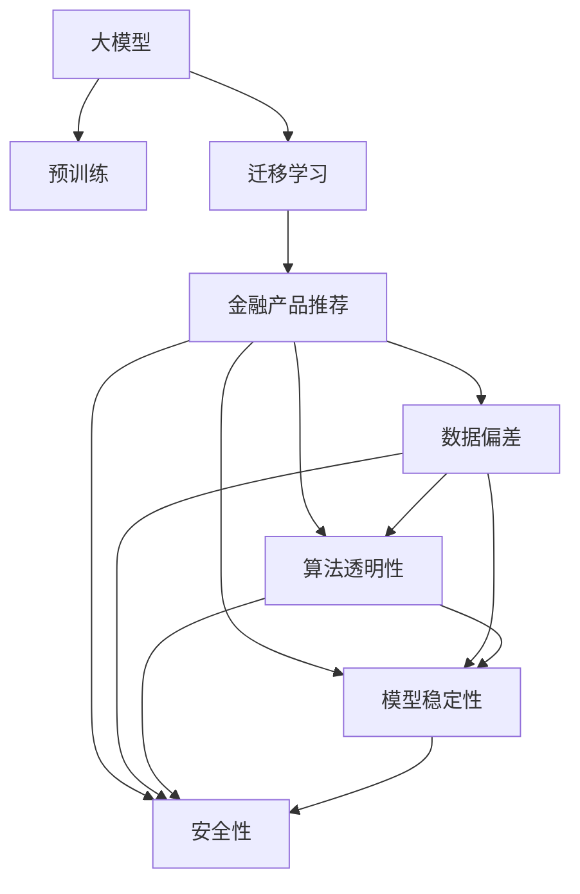

                 

# 大模型在金融产品推荐中的应用与风险

## 1. 背景介绍

### 1.1 问题由来
近年来，随着金融科技的飞速发展，金融产品推荐系统在金融风控、风险评估、市场营销等领域发挥了重要作用。传统的推荐系统多依赖于基于协同过滤、深度学习等方法，随着深度学习技术的广泛应用，大模型在金融产品推荐中也逐渐被引入。

大模型在金融领域的应用具有显著的优势：
1. **海量数据处理能力**：大模型能够处理海量历史数据，从中提取出与金融产品相关的重要特征。
2. **复杂非线性建模能力**：大模型可以学习到更为复杂的非线性关系，提升推荐精度和鲁棒性。
3. **跨领域迁移能力**：大模型经过预训练后，可以在不同的金融领域间进行迁移，提升模型的泛化能力和应用灵活性。

然而，大模型在金融产品推荐中也有其独特的风险，主要体现在以下几个方面：
1. **数据偏差与歧视**：大模型可能会学习到数据中的偏见，导致推荐结果存在歧视性。
2. **算法透明性与公平性**：大模型的决策过程复杂，难以解释其内部机制，影响算法的透明性与公平性。
3. **模型稳定性与安全性**：大模型可能面临过度拟合、对抗攻击等问题，影响推荐系统的稳定性和安全性。

本文将系统阐述大模型在金融产品推荐中的应用，并探讨其潜在风险及应对策略。

## 2. 核心概念与联系

### 2.1 核心概念概述

为更好地理解大模型在金融产品推荐中的应用与风险，本节将介绍几个核心概念：

- **大模型(Large Model)**：指具有亿级别参数规模，通过预训练在巨大数据集上获得丰富知识表示的深度学习模型，如BERT、GPT、GPT-3等。
- **预训练(Pre-training)**：指在无标签数据上进行自监督学习，学习通用的语言表示，提升模型的泛化能力。
- **迁移学习(Transfer Learning)**：指在预训练模型的基础上，使用下游任务的少量标签数据进行微调，提升模型在特定任务上的表现。
- **金融产品推荐(Financial Product Recommendation)**：指根据用户的历史行为和属性，推荐其可能感兴趣的金融产品，如股票、基金、保险等。
- **数据偏差(Data Bias)**：指数据集中存在的系统性偏差，导致模型学习到的偏见。
- **算法透明性(Algorithm Transparency)**：指模型决策过程的可解释性和公平性，避免算法黑箱化。
- **模型稳定性(Model Stability)**：指模型在面对不同数据和场景时，输出的稳定性。
- **安全性(Security)**：指模型在面对对抗攻击等威胁时，仍能保持正常工作的能力。

这些核心概念之间的逻辑关系可以通过以下Mermaid流程图来展示：



这个流程图展示了大模型在金融产品推荐中的核心概念及其之间的联系：

1. 大模型通过预训练获得基础能力。
2. 迁移学习使得大模型能够在金融领域进行微调，获得特定任务上的表现。
3. 金融产品推荐是迁移学习的重要应用场景。
4. 数据偏差、算法透明性、模型稳定性、安全性是金融产品推荐系统面临的主要风险和挑战。

## 3. 核心算法原理 & 具体操作步骤
### 3.1 算法原理概述

基于大模型的金融产品推荐系统，本质上是一个深度学习模型在金融领域的应用实例。其核心思想是：将预训练的大模型作为特征提取器，通过迁移学习，将其应用到金融产品推荐这一特定任务上，从而获得优异的推荐效果。

形式化地，假设金融产品推荐任务为 $T$，训练集为 $D=\{(x_i,y_i)\}_{i=1}^N, x_i \in \mathbb{R}^d, y_i \in \{0,1\}$，其中 $y_i=1$ 表示用户 $x_i$ 对产品 $y_i$ 感兴趣。目标是最小化经验风险：

$$
\mathcal{L}(\theta) = \frac{1}{N}\sum_{i=1}^N \ell(M_{\theta}(x_i),y_i)
$$

其中，$\ell$ 为二元交叉熵损失函数，$M_{\theta}$ 为模型，$\theta$ 为模型参数。通过梯度下降等优化算法，最小化经验风险，得到最优参数 $\hat{\theta}$：

$$
\hat{\theta}=\mathop{\arg\min}_{\theta} \mathcal{L}(\theta)
$$

### 3.2 算法步骤详解

基于大模型的金融产品推荐系统的一般步骤如下：

**Step 1: 准备预训练模型和数据集**
- 选择合适的预训练模型，如BERT、GPT-3等，作为初始化参数。
- 收集金融产品的历史数据集 $D$，包括用户行为、属性、交易记录等，划分为训练集、验证集和测试集。

**Step 2: 添加任务适配层**
- 根据金融产品推荐任务，在预训练模型的基础上设计合适的任务适配层，包括输入层、输出层和损失函数。

**Step 3: 设置微调超参数**
- 选择合适的优化算法及其参数，如AdamW、SGD等，设置学习率、批大小、迭代轮数等。
- 设置正则化技术及强度，包括权重衰减、Dropout、Early Stopping等。
- 确定冻结预训练参数的策略，如仅微调顶层，或全部参数都参与微调。

**Step 4: 执行梯度训练**
- 将训练集数据分批次输入模型，前向传播计算损失函数。
- 反向传播计算参数梯度，根据设定的优化算法和学习率更新模型参数。
- 周期性在验证集上评估模型性能，根据性能指标决定是否触发 Early Stopping。
- 重复上述步骤直到满足预设的迭代轮数或 Early Stopping 条件。

**Step 5: 测试和部署**
- 在测试集上评估微调后模型 $M_{\hat{\theta}}$ 的性能，对比微调前后的精度提升。
- 使用微调后的模型对新样本进行推理预测，集成到实际的应用系统中。
- 持续收集新的数据，定期重新微调模型，以适应数据分布的变化。

### 3.3 算法优缺点

基于大模型的金融产品推荐方法具有以下优点：
1. **高效处理海量数据**：大模型能够高效处理金融产品的海量历史数据，提取特征表示。
2. **提升推荐精度**：大模型的非线性建模能力能够学习更为复杂的推荐关系，提升推荐精度。
3. **泛化能力强**：大模型经过预训练后在不同金融产品推荐场景下具有较好的泛化能力，减少数据标注的依赖。

同时，该方法也存在一定的局限性：
1. **数据偏差与歧视**：大模型可能会学习到数据中的偏见，导致推荐结果存在歧视性。
2. **算法透明性与公平性**：大模型的决策过程复杂，难以解释其内部机制，影响算法的透明性与公平性。
3. **模型稳定性与安全性**：大模型可能面临过度拟合、对抗攻击等问题，影响推荐系统的稳定性和安全性。

尽管存在这些局限性，但就目前而言，基于大模型的金融产品推荐方法仍是一种高效的推荐方式。未来相关研究的重点在于如何进一步降低推荐系统的风险，提高模型的少样本学习和跨领域迁移能力，同时兼顾可解释性和伦理安全性等因素。

### 3.4 算法应用领域

基于大模型的金融产品推荐方法在金融领域已经得到了广泛的应用，覆盖了金融产品推荐、风险评估、风控决策等多个方面，如：

1. **金融产品推荐**：根据用户的历史行为和属性，推荐其可能感兴趣的金融产品，如股票、基金、保险等。
2. **信用评估**：通过用户的历史交易记录和行为数据，预测其信用评分，评估其还款能力。
3. **风险预警**：分析用户的行为数据，及时发现潜在的风险信号，进行风险预警和控制。
4. **合规检测**：检测用户的交易行为是否符合法律法规，避免违规操作。

除了上述这些经典应用外，大模型在金融领域的应用还在不断拓展，如基于大模型的情感分析、舆情监测、自动化交易等，为金融技术的发展提供了新的动力。

## 4. 数学模型和公式 & 详细讲解
### 4.1 数学模型构建

本节将使用数学语言对基于大模型的金融产品推荐过程进行更加严格的刻画。

假设金融产品推荐模型为 $M_{\theta}:\mathcal{X} \rightarrow \mathcal{Y}$，其中 $\mathcal{X}$ 为输入空间，$\mathcal{Y}$ 为输出空间，$\theta \in \mathbb{R}^d$ 为模型参数。

定义模型 $M_{\theta}$ 在输入 $x$ 上的输出为 $\hat{y}=M_{\theta}(x) \in [0,1]$，表示用户对产品 $y$ 感兴趣的概率。真实标签 $y \in \{0,1\}$。则二元交叉熵损失函数定义为：

$$
\ell(M_{\theta}(x),y) = -[y\log \hat{y} + (1-y)\log (1-\hat{y})]
$$

将其代入经验风险公式，得：

$$
\mathcal{L}(\theta) = -\frac{1}{N}\sum_{i=1}^N [y_i\log M_{\theta}(x_i)+(1-y_i)\log(1-M_{\theta}(x_i))]
$$

根据链式法则，损失函数对参数 $\theta_k$ 的梯度为：

$$
\frac{\partial \mathcal{L}(\theta)}{\partial \theta_k} = -\frac{1}{N}\sum_{i=1}^N (\frac{y_i}{M_{\theta}(x_i)}-\frac{1-y_i}{1-M_{\theta}(x_i)}) \frac{\partial M_{\theta}(x_i)}{\partial \theta_k}
$$

其中 $\frac{\partial M_{\theta}(x_i)}{\partial \theta_k}$ 可进一步递归展开，利用自动微分技术完成计算。

### 4.2 公式推导过程

以下我们以金融产品推荐为例，推导二元交叉熵损失函数及其梯度的计算公式。

假设模型 $M_{\theta}$ 在输入 $x$ 上的输出为 $\hat{y}=M_{\theta}(x) \in [0,1]$，表示用户对产品 $y$ 感兴趣的概率。真实标签 $y \in \{0,1\}$。则二元交叉熵损失函数定义为：

$$
\ell(M_{\theta}(x),y) = -[y\log \hat{y} + (1-y)\log (1-\hat{y})]
$$

将其代入经验风险公式，得：

$$
\mathcal{L}(\theta) = -\frac{1}{N}\sum_{i=1}^N [y_i\log M_{\theta}(x_i)+(1-y_i)\log(1-M_{\theta}(x_i))]
$$

根据链式法则，损失函数对参数 $\theta_k$ 的梯度为：

$$
\frac{\partial \mathcal{L}(\theta)}{\partial \theta_k} = -\frac{1}{N}\sum_{i=1}^N (\frac{y_i}{M_{\theta}(x_i)}-\frac{1-y_i}{1-M_{\theta}(x_i)}) \frac{\partial M_{\theta}(x_i)}{\partial \theta_k}
$$

其中 $\frac{\partial M_{\theta}(x_i)}{\partial \theta_k}$ 可进一步递归展开，利用自动微分技术完成计算。

在得到损失函数的梯度后，即可带入参数更新公式，完成模型的迭代优化。重复上述过程直至收敛，最终得到适应金融产品推荐任务的最优模型参数 $\theta^*$。

## 5. 项目实践：代码实例和详细解释说明
### 5.1 开发环境搭建

在进行金融产品推荐实践前，我们需要准备好开发环境。以下是使用Python进行PyTorch开发的环境配置流程：

1. 安装Anaconda：从官网下载并安装Anaconda，用于创建独立的Python环境。

2. 创建并激活虚拟环境：
```bash
conda create -n pytorch-env python=3.8 
conda activate pytorch-env
```

3. 安装PyTorch：根据CUDA版本，从官网获取对应的安装命令。例如：
```bash
conda install pytorch torchvision torchaudio cudatoolkit=11.1 -c pytorch -c conda-forge
```

4. 安装Transformers库：
```bash
pip install transformers
```

5. 安装各类工具包：
```bash
pip install numpy pandas scikit-learn matplotlib tqdm jupyter notebook ipython
```

完成上述步骤后，即可在`pytorch-env`环境中开始金融产品推荐实践。

### 5.2 源代码详细实现

下面我们以金融产品推荐为例，给出使用Transformers库对BERT模型进行微调的PyTorch代码实现。

首先，定义金融产品推荐任务的数据处理函数：

```python
from transformers import BertTokenizer
from torch.utils.data import Dataset
import torch

class FinanceProductDataset(Dataset):
    def __init__(self, texts, labels, tokenizer, max_len=128):
        self.texts = texts
        self.labels = labels
        self.tokenizer = tokenizer
        self.max_len = max_len
        
    def __len__(self):
        return len(self.texts)
    
    def __getitem__(self, item):
        text = self.texts[item]
        label = self.labels[item]
        
        encoding = self.tokenizer(text, return_tensors='pt', max_length=self.max_len, padding='max_length', truncation=True)
        input_ids = encoding['input_ids'][0]
        attention_mask = encoding['attention_mask'][0]
        
        # 对label进行编码
        encoded_label = [1 if label == '1' else 0]
        encoded_label.extend([0] * (self.max_len - len(encoded_label)))
        labels = torch.tensor(encoded_label, dtype=torch.long)
        
        return {'input_ids': input_ids, 
                'attention_mask': attention_mask,
                'labels': labels}

# 标签与id的映射
label2id = {'1': 1, '0': 0}
id2label = {v: k for k, v in label2id.items()}

# 创建dataset
tokenizer = BertTokenizer.from_pretrained('bert-base-cased')

train_dataset = FinanceProductDataset(train_texts, train_labels, tokenizer)
dev_dataset = FinanceProductDataset(dev_texts, dev_labels, tokenizer)
test_dataset = FinanceProductDataset(test_texts, test_labels, tokenizer)
```

然后，定义模型和优化器：

```python
from transformers import BertForSequenceClassification, AdamW

model = BertForSequenceClassification.from_pretrained('bert-base-cased', num_labels=2)

optimizer = AdamW(model.parameters(), lr=2e-5)
```

接着，定义训练和评估函数：

```python
from torch.utils.data import DataLoader
from tqdm import tqdm
from sklearn.metrics import classification_report

device = torch.device('cuda') if torch.cuda.is_available() else torch.device('cpu')
model.to(device)

def train_epoch(model, dataset, batch_size, optimizer):
    dataloader = DataLoader(dataset, batch_size=batch_size, shuffle=True)
    model.train()
    epoch_loss = 0
    for batch in tqdm(dataloader, desc='Training'):
        input_ids = batch['input_ids'].to(device)
        attention_mask = batch['attention_mask'].to(device)
        labels = batch['labels'].to(device)
        model.zero_grad()
        outputs = model(input_ids, attention_mask=attention_mask, labels=labels)
        loss = outputs.loss
        epoch_loss += loss.item()
        loss.backward()
        optimizer.step()
    return epoch_loss / len(dataloader)

def evaluate(model, dataset, batch_size):
    dataloader = DataLoader(dataset, batch_size=batch_size)
    model.eval()
    preds, labels = [], []
    with torch.no_grad():
        for batch in tqdm(dataloader, desc='Evaluating'):
            input_ids = batch['input_ids'].to(device)
            attention_mask = batch['attention_mask'].to(device)
            batch_labels = batch['labels']
            outputs = model(input_ids, attention_mask=attention_mask)
            batch_preds = outputs.logits.argmax(dim=2).to('cpu').tolist()
            batch_labels = batch_labels.to('cpu').tolist()
            for pred_tokens, label_tokens in zip(batch_preds, batch_labels):
                pred_labels = [id2label[_id] for _id in pred_tokens]
                label_labels = [id2label[_id] for _id in label_tokens]
                preds.append(pred_labels[:len(label_labels)])
                labels.append(label_labels)
                
    print(classification_report(labels, preds))
```

最后，启动训练流程并在测试集上评估：

```python
epochs = 5
batch_size = 16

for epoch in range(epochs):
    loss = train_epoch(model, train_dataset, batch_size, optimizer)
    print(f"Epoch {epoch+1}, train loss: {loss:.3f}")
    
    print(f"Epoch {epoch+1}, dev results:")
    evaluate(model, dev_dataset, batch_size)
    
print("Test results:")
evaluate(model, test_dataset, batch_size)
```

以上就是使用PyTorch对BERT进行金融产品推荐任务微调的完整代码实现。可以看到，得益于Transformers库的强大封装，我们可以用相对简洁的代码完成BERT模型的加载和微调。

### 5.3 代码解读与分析

让我们再详细解读一下关键代码的实现细节：

**FinanceProductDataset类**：
- `__init__`方法：初始化文本、标签、分词器等关键组件。
- `__len__`方法：返回数据集的样本数量。
- `__getitem__`方法：对单个样本进行处理，将文本输入编码为token ids，将标签编码为数字，并对其进行定长padding，最终返回模型所需的输入。

**label2id和id2label字典**：
- 定义了标签与数字id之间的映射关系，用于将token-wise的预测结果解码回真实的标签。

**训练和评估函数**：
- 使用PyTorch的DataLoader对数据集进行批次化加载，供模型训练和推理使用。
- 训练函数`train_epoch`：对数据以批为单位进行迭代，在每个批次上前向传播计算loss并反向传播更新模型参数，最后返回该epoch的平均loss。
- 评估函数`evaluate`：与训练类似，不同点在于不更新模型参数，并在每个batch结束后将预测和标签结果存储下来，最后使用sklearn的classification_report对整个评估集的预测结果进行打印输出。

**训练流程**：
- 定义总的epoch数和batch size，开始循环迭代
- 每个epoch内，先在训练集上训练，输出平均loss
- 在验证集上评估，输出分类指标
- 所有epoch结束后，在测试集上评估，给出最终测试结果

可以看到，PyTorch配合Transformers库使得BERT微调的代码实现变得简洁高效。开发者可以将更多精力放在数据处理、模型改进等高层逻辑上，而不必过多关注底层的实现细节。

当然，工业级的系统实现还需考虑更多因素，如模型的保存和部署、超参数的自动搜索、更灵活的任务适配层等。但核心的微调范式基本与此类似。

## 6. 实际应用场景
### 6.1 智能理财顾问

基于大模型的金融产品推荐系统，可以构建智能理财顾问，帮助用户规划和管理财务。智能理财顾问通过分析用户的收入、支出、储蓄、投资等财务数据，推荐最适合其风险偏好的金融产品。

在技术实现上，可以收集用户的银行账户交易记录、理财产品的历史表现数据，将数据构建为金融产品推荐任务的数据集。在微调后的大模型基础上，对用户输入的财务数据进行编码，预测用户可能感兴趣的金融产品，并进行实时推荐。

### 6.2 风险预警系统

金融产品推荐系统不仅可以推荐产品，还能通过分析用户的交易行为，及时发现风险信号，进行预警。例如，如果用户频繁进行高风险交易，系统可以自动预警，提醒用户注意资金安全。

在实现上，可以设计多个风险指标，如交易频率、交易金额、交易时间等。在微调后的模型基础上，分析用户的行为数据，检测是否存在异常行为，并及时预警。

### 6.3 精准营销平台

金融产品推荐系统还可以应用于精准营销，帮助金融机构精准触达目标用户。通过分析用户的兴趣和需求，推荐最合适的金融产品，提高营销效果和客户满意度。

在实现上，可以收集用户的浏览、点击、下载等行为数据，构建行为向量，在微调后的模型上进行推荐。同时，还可以根据用户的互动反馈，不断优化推荐算法，提升个性化推荐的效果。

### 6.4 未来应用展望

随着大模型和微调技术的不断发展，基于微调范式的金融产品推荐系统将在更多领域得到应用，为金融科技的创新发展提供新动力。

在智慧金融领域，智能理财顾问、风险预警系统、精准营销平台等应用将为用户的金融生活带来便利和保障。

在保险行业，基于大模型的保险理赔、风险评估、产品推荐等应用将提升保险服务的智能化水平，降低保险公司运营成本。

在普惠金融领域，通过微调技术的应用，可以进一步提升金融服务的覆盖面和可及性，帮助更多人群获得金融支持。

此外，在金融科技的各个环节，大模型微调的应用都将不断拓展，为金融科技的智能化、个性化、精准化发展提供重要支撑。相信随着技术的日益成熟，基于微调范式的人工智能技术将在金融领域带来更深远的影响。

## 7. 工具和资源推荐
### 7.1 学习资源推荐

为了帮助开发者系统掌握大模型在金融产品推荐中的应用，这里推荐一些优质的学习资源：

1. 《深度学习在金融科技中的应用》课程：Coursera上由斯坦福大学和Quantopian合作推出的金融科技深度学习课程，系统介绍了深度学习在金融领域的应用。

2. 《金融科技与大数据》书籍：该书详细介绍了金融科技领域的技术应用，包括机器学习、深度学习等。

3. 《金融产品推荐系统设计》博客系列：通过一系列博客，介绍了金融产品推荐系统的设计和实现，包括数据处理、模型选择、评估等环节。

4. 《自然语言处理与金融产品推荐》论文：研究将自然语言处理技术应用于金融产品推荐，提升推荐精度和公平性。

5. 《金融科技创新与大数据应用》论文：通过大数据和人工智能技术，实现金融产品的精准推荐和风险预警。

通过对这些资源的学习实践，相信你一定能够快速掌握大模型在金融产品推荐中的应用，并用于解决实际的金融产品推荐问题。
### 7.2 开发工具推荐

高效的开发离不开优秀的工具支持。以下是几款用于金融产品推荐系统开发的常用工具：

1. PyTorch：基于Python的开源深度学习框架，灵活动态的计算图，适合快速迭代研究。大部分预训练语言模型都有PyTorch版本的实现。

2. TensorFlow：由Google主导开发的开源深度学习框架，生产部署方便，适合大规模工程应用。同样有丰富的预训练语言模型资源。

3. Transformers库：HuggingFace开发的NLP工具库，集成了众多SOTA语言模型，支持PyTorch和TensorFlow，是进行金融产品推荐系统开发的利器。

4. Weights & Biases：模型训练的实验跟踪工具，可以记录和可视化模型训练过程中的各项指标，方便对比和调优。与主流深度学习框架无缝集成。

5. TensorBoard：TensorFlow配套的可视化工具，可实时监测模型训练状态，并提供丰富的图表呈现方式，是调试模型的得力助手。

6. Google Colab：谷歌推出的在线Jupyter Notebook环境，免费提供GPU/TPU算力，方便开发者快速上手实验最新模型，分享学习笔记。

合理利用这些工具，可以显著提升金融产品推荐系统的开发效率，加快创新迭代的步伐。

### 7.3 相关论文推荐

大模型在金融产品推荐领域的应用源于学界的持续研究。以下是几篇奠基性的相关论文，推荐阅读：

1. Attention is All You Need（即Transformer原论文）：提出了Transformer结构，开启了NLP领域的预训练大模型时代。

2. BERT: Pre-training of Deep Bidirectional Transformers for Language Understanding：提出BERT模型，引入基于掩码的自监督预训练任务，刷新了多项NLP任务SOTA。

3. Financial Product Recommendation with Graph Neural Networks：引入图神经网络，提升金融产品推荐的准确性和可解释性。

4. Enhancing Robustness of Deep Learning-based Financial Recommendation Systems with Synthetic Data：使用合成数据增强金融推荐系统的鲁棒性。

5. A Hybrid Method of Financial Product Recommendation Based on Deep Learning and Semantic Analysis：结合深度学习和语义分析，提升金融产品推荐效果。

这些论文代表了大模型在金融产品推荐领域的发展脉络。通过学习这些前沿成果，可以帮助研究者把握学科前进方向，激发更多的创新灵感。

## 8. 总结：未来发展趋势与挑战

### 8.1 总结

本文对基于大模型的金融产品推荐方法进行了全面系统的介绍。首先阐述了金融产品推荐在金融科技中的重要性和大模型的应用优势，明确了微调在金融产品推荐系统中的应用价值。其次，从原理到实践，详细讲解了金融产品推荐数学模型和微调步骤，给出了微调任务开发的完整代码实例。同时，本文还广泛探讨了金融产品推荐系统面临的风险和挑战，并给出了相应的解决策略。

通过本文的系统梳理，可以看到，基于大模型的金融产品推荐系统具有高效处理海量数据、提升推荐精度等优势，但也面临着数据偏差、算法透明性、模型稳定性、安全性等挑战。未来研究需要在降低风险、提升鲁棒性和可解释性等方面不断创新突破，才能更好地应用于金融科技的各个环节。

### 8.2 未来发展趋势

展望未来，大模型在金融产品推荐系统的应用将呈现以下几个发展趋势：

1. **多模态融合**：金融数据通常包括文本、图像、音频等多种模态，未来金融产品推荐系统将融合多种模态数据，提升推荐精度和鲁棒性。

2. **个性化推荐**：基于用户画像和行为数据，进行个性化金融产品推荐，提升用户体验。

3. **动态调整**：金融市场瞬息万变，未来金融产品推荐系统将具备动态调整能力，实时调整推荐策略，适应市场变化。

4. **跨领域迁移**：在多个金融领域间进行知识迁移，提升推荐系统的泛化能力和应用灵活性。

5. **风险控制**：在推荐系统中加入风险控制机制，及时发现和预警风险信号，保障金融安全。

6. **隐私保护**：在数据收集和处理过程中，采用隐私保护技术，保障用户隐私安全。

这些趋势凸显了大模型在金融产品推荐系统中的应用前景，将为金融科技带来更智能、更精准、更安全的推荐服务。

### 8.3 面临的挑战

尽管大模型在金融产品推荐系统中的应用取得了显著成效，但仍面临以下挑战：

1. **数据偏差与歧视**：金融数据可能存在偏差，导致模型推荐结果存在歧视性。

2. **算法透明性与公平性**：大模型的决策过程复杂，难以解释其内部机制，影响算法的透明性与公平性。

3. **模型稳定性与安全性**：大模型可能面临过度拟合、对抗攻击等问题，影响推荐系统的稳定性和安全性。

4. **隐私保护与数据安全**：金融数据涉及用户的敏感信息，如何在数据收集和处理过程中保障用户隐私，是大模型应用的重要挑战。

5. **资源消耗**：大模型参数量大，对计算资源、存储资源和网络带宽等资源消耗较大，需要进行优化和压缩。

6. **模型解释性与可解释性**：大模型决策过程复杂，如何提升模型的解释性和可解释性，是未来研究的重要方向。

尽管存在这些挑战，但通过不断优化模型、算法和工程实践，相信大模型在金融产品推荐系统中的应用将会不断提升，为金融科技带来更深远的影响。

### 8.4 研究展望

未来研究需要在以下几个方面寻求新的突破：

1. **无监督和半监督学习**：探索无监督和半监督学习范式，减少对标注数据的依赖，提升模型泛化能力。

2. **多模态推荐**：结合文本、图像、音频等多种模态数据，提升推荐精度和鲁棒性。

3. **跨领域迁移**：在多个金融领域间进行知识迁移，提升推荐系统的泛化能力和应用灵活性。

4. **动态调整与优化**：设计动态调整和优化机制，及时适应市场变化，提升推荐系统效果。

5. **隐私保护**：采用隐私保护技术，保障用户隐私安全。

6. **解释性与可解释性**：提升模型的解释性和可解释性，增强算法透明性与公平性。

通过不断创新和突破，相信大模型在金融产品推荐系统的应用将不断提升，为金融科技的智能化、精准化、安全化发展提供重要支撑。

## 9. 附录：常见问题与解答

**Q1：金融产品推荐系统如何处理多模态数据？**

A: 金融产品推荐系统通常会处理文本、图像、音频等多种模态数据。处理多模态数据的常用方法包括：

1. **数据融合**：将不同模态的数据进行融合，形成综合特征表示，提升推荐精度。

2. **模型融合**：设计多模态融合模型，如注意力机制、残差连接等，提升模型的综合能力。

3. **模态自编码器**：对不同模态的数据进行自编码器编码，提取特征，进行融合。

4. **跨模态学习**：在多模态数据间进行联合训练，提升模型的跨模态表征能力。

这些方法可以结合使用，提升金融产品推荐系统的综合能力。

**Q2：金融产品推荐系统如何应对数据偏差与歧视？**

A: 数据偏差与歧视是金融产品推荐系统面临的主要问题之一。应对数据偏差与歧视的方法包括：

1. **数据清洗与处理**：对数据进行清洗和预处理，去除噪音和异常值，提升数据质量。

2. **数据增强**：通过数据增强技术，增加数据多样性，减少偏差影响。

3. **公平性约束**：在损失函数中加入公平性约束，避免推荐结果存在歧视性。

4. **解释性与可解释性**：通过提升模型的解释性和可解释性，增强算法的透明性与公平性。

5. **公平性评估**：引入公平性评估指标，评估模型的公平性，并进行优化。

这些方法可以结合使用，提升金融产品推荐系统的公平性和透明性。

**Q3：金融产品推荐系统如何保障用户隐私？**

A: 金融产品推荐系统涉及用户的敏感信息，保障用户隐私是重要的研究课题。保障用户隐私的方法包括：

1. **差分隐私**：通过差分隐私技术，保护用户隐私，避免个人信息泄露。

2. **联邦学习**：在本地设备上训练模型，避免将用户数据上传至云端。

3. **匿名化处理**：对用户数据进行匿名化处理，保护用户隐私。

4. **隐私保护算法**：采用隐私保护算法，如DP-SGD等，保护用户隐私。

这些方法可以结合使用，保障用户隐私安全。

**Q4：金融产品推荐系统如何提高算法的透明性与公平性？**

A: 金融产品推荐系统中的大模型决策过程复杂，难以解释其内部机制，影响算法的透明性与公平性。提高算法的透明性与公平性的方法包括：

1. **模型解释性**：提升模型的解释性，增强算法的透明性。

2. **公平性约束**：在损失函数中加入公平性约束，避免推荐结果存在歧视性。

3. **可解释性算法**：采用可解释性算法，如LIME、SHAP等，提升模型的可解释性。

4. **公平性评估**：引入公平性评估指标，评估模型的公平性，并进行优化。

5. **数据多样性**：增加数据多样性，提升模型的泛化能力，避免偏见。

这些方法可以结合使用，提升金融产品推荐系统的透明性和公平性。

**Q5：金融产品推荐系统如何降低资源消耗？**

A: 金融产品推荐系统中的大模型参数量大，对计算资源、存储资源和网络带宽等资源消耗较大，需要进行优化和压缩。降低资源消耗的方法包括：

1. **参数剪枝**：剪枝掉模型中不必要的参数，减小模型尺寸。

2. **模型压缩**：使用模型压缩技术，如知识蒸馏、剪枝、量化等，减小模型尺寸。

3. **高效计算**：采用高效计算技术，如量化加速、混合精度计算等，提升计算效率。

4. **分布式计算**：采用分布式计算技术，利用多个计算资源，提升计算效率。

5. **模型简化**：简化模型的结构和复杂度，提升计算效率。

这些方法可以结合使用，降低金融产品推荐系统的资源消耗。

---

作者：禅与计算机程序设计艺术 / Zen and the Art of Computer Programming

