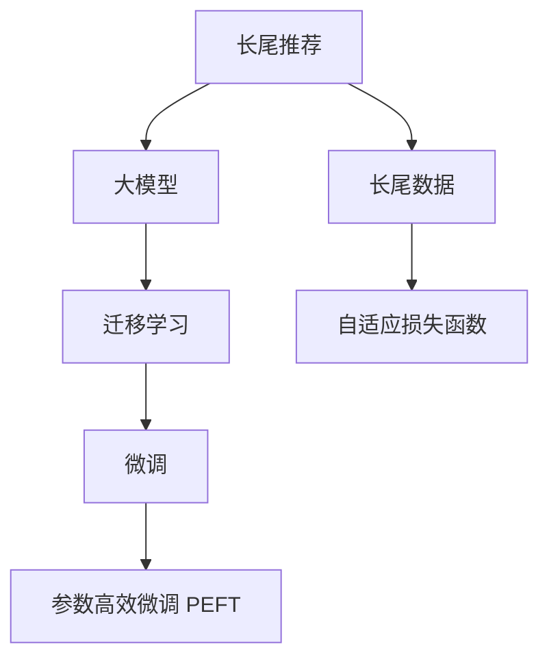

                 

# 大模型在长尾推荐问题中的应用

> 关键词：长尾推荐,大模型,迁移学习,微调,FINE-TUNING

## 1. 背景介绍

### 1.1 问题由来

推荐系统已成为电子商务、内容服务、智能广告等多个领域的重要基础设施，为数亿用户提供了个性化服务。传统的推荐算法主要依赖用户历史行为数据，进行基于相似度的推荐，但随着用户行为的复杂化，难以覆盖长尾领域的需求。例如，小众商品、特定兴趣内容等，用户互动次数较低，但具有独特价值，这类推荐需求被称之为长尾推荐(Long Tail Recommendation)。

长尾推荐问题具有以下特点：
- 长尾用户占总体用户比例较高，但互动次数少。
- 长尾物品需求量较低，市场竞争较少。
- 推荐模型需要准确识别出长尾需求，提升长尾商品的曝光率。
- 长尾推荐通常需要更少的数据和更复杂的技术才能实现，是推荐系统中的难点。

为应对长尾推荐问题，近年来基于大模型的推荐技术逐渐兴起。通过迁移学习和微调技术，利用预训练模型的知识，在长尾数据上获得更优推荐效果，成为了新的研究热点。

### 1.2 问题核心关键点

长尾推荐问题的解决主要依赖于大模型迁移学习和微调技术，以下是几个关键点：
1. **预训练模型的知识迁移**：利用通用大模型在大规模数据上的知识，提升长尾领域模型的泛化能力。
2. **参数高效微调**：在长尾领域的数据集上，参数高效的微调方法可提高模型的泛化性能。
3. **小样本微调**：长尾领域数据量少，通过小样本微调可有效提升模型的表现。
4. **自适应损失函数**：针对长尾数据的特点，设计自适应损失函数，解决长尾数据稀疏性的问题。

## 2. 核心概念与联系

### 2.1 核心概念概述

为更好地理解大模型在长尾推荐中的应用，本节将介绍几个密切相关的核心概念：

- 长尾推荐(Long Tail Recommendation)：指推荐系统中那些不常出现的、需求量较低的商品或内容。长尾推荐通过精准推荐，提升用户满意度和商家的曝光率。
- 大模型(Large Model)：指包含亿级参数的深度学习模型，如BERT、GPT-3等。大模型通过大规模无标签数据预训练，学习到丰富的语言知识，可应用于各种下游任务。
- 迁移学习(Transfer Learning)：指将一个领域学习到的知识，迁移应用到另一个不同但相关的领域的学习范式。大模型的预训练-微调过程即是一种典型的迁移学习方式。
- 微调(Fine-Tuning)：指在预训练模型的基础上，使用下游任务的少量标注数据，通过有监督学习优化模型在该任务上的性能。
- 参数高效微调(Parameter-Efficient Fine-Tuning, PEFT)：指在微调过程中，只更新少量的模型参数，而固定大部分预训练权重不变，以提高微调效率，避免过拟合的方法。
- 长尾数据(Long Tail Data)：指那些稀疏且低频的训练数据，数量较少但包含重要长尾物品信息。
- 自适应损失函数(Adaptive Loss Function)：指针对长尾数据特性设计的损失函数，解决长尾数据稀疏性的问题。

这些核心概念之间的逻辑关系可以通过以下Mermaid流程图来展示：



这个流程图展示了大模型在长尾推荐问题中的核心概念及其之间的关系：

1. 长尾推荐问题主要依赖大模型的知识进行迁移学习。
2. 迁移学习将大模型的知识应用于长尾领域，提升模型泛化能力。
3. 微调是利用长尾数据进一步优化模型性能。
4. 参数高效微调是优化长尾数据微调效率，避免过拟合。
5. 长尾数据需要设计自适应损失函数，解决数据稀疏性问题。

## 3. 核心算法原理 & 具体操作步骤
### 3.1 算法原理概述

大模型在长尾推荐问题中的应用，本质上是一个有监督的迁移学习过程。其核心思想是：利用通用大模型的知识，在长尾领域数据上进一步微调，优化模型在该领域上的性能，从而实现更精准的长尾推荐。

形式化地，假设预训练语言模型为 $M_{\theta}$，其中 $\theta$ 为预训练得到的模型参数。给定长尾推荐任务 $T$ 的少量标注数据集 $D=\{(x_i, y_i)\}_{i=1}^N, x_i \in \mathcal{X}, y_i \in \mathcal{Y}$。长尾推荐微调的目标是找到新的模型参数 $\hat{\theta}$，使得：

$$
\hat{\theta}=\mathop{\arg\min}_{\theta} \mathcal{L}(M_{\theta},D)
$$

其中 $\mathcal{L}$ 为针对长尾推荐任务设计的损失函数，用于衡量模型预测输出与真实标签之间的差异。常见的损失函数包括交叉熵损失、均方误差损失等。

通过梯度下降等优化算法，微调过程不断更新模型参数 $\theta$，最小化损失函数 $\mathcal{L}$，使得模型输出逼近真实标签。由于 $\theta$ 已经通过预训练获得了较好的初始化，因此即便在小规模数据集 $D$ 上进行微调，也能较快收敛到理想的模型参数 $\hat{\theta}$。

### 3.2 算法步骤详解

大模型在长尾推荐问题中的应用，通常包括以下几个关键步骤：

**Step 1: 准备预训练模型和数据集**
- 选择合适的预训练语言模型 $M_{\theta}$ 作为初始化参数，如 BERT、GPT-3等。
- 准备长尾推荐任务的少量标注数据集 $D$，划分为训练集、验证集和测试集。一般要求标注数据与预训练数据的分布不要差异过大。

**Step 2: 设计长尾推荐任务**
- 根据长尾推荐任务，设计合适的输出层和损失函数。
- 对于评分预测任务，通常在顶层添加线性回归器或交叉熵损失函数。
- 对于多标签分类任务，可以采用多标签分类损失函数。

**Step 3: 设置微调超参数**
- 选择合适的优化算法及其参数，如 AdamW、SGD 等，设置学习率、批大小、迭代轮数等。
- 设置正则化技术及强度，包括权重衰减、Dropout、Early Stopping等。
- 确定冻结预训练参数的策略，如仅微调顶层，或全部参数都参与微调。

**Step 4: 执行梯度训练**
- 将训练集数据分批次输入模型，前向传播计算损失函数。
- 反向传播计算参数梯度，根据设定的优化算法和学习率更新模型参数。
- 周期性在验证集上评估模型性能，根据性能指标决定是否触发 Early Stopping。
- 重复上述步骤直到满足预设的迭代轮数或 Early Stopping 条件。

**Step 5: 测试和部署**
- 在测试集上评估微调后模型 $M_{\hat{\theta}}$ 的性能，对比微调前后的推荐效果。
- 使用微调后的模型对新样本进行推荐，集成到实际的应用系统中。
- 持续收集新的数据，定期重新微调模型，以适应数据分布的变化。

以上是基于大模型微调的长尾推荐流程。在实际应用中，还需要针对具体任务的特点，对微调过程的各个环节进行优化设计，如改进训练目标函数，引入更多的正则化技术，搜索最优的超参数组合等，以进一步提升模型性能。

### 3.3 算法优缺点

大模型在长尾推荐中的应用具有以下优点：
1. 泛化能力强。利用大模型的知识进行迁移学习，在长尾领域也能取得不错的推荐效果。
2. 推荐结果多样。大模型可以灵活处理复杂的多标签推荐问题，提升推荐的多样性。
3. 参数效率高。通过参数高效微调方法，在固定大部分预训练参数的情况下，仍可取得不错的提升。
4. 可解释性强。大模型的复杂结构和多层次推理过程，提供了更丰富的推荐理由。

同时，该方法也存在一定的局限性：
1. 数据需求高。长尾推荐需要大量的标注数据，数据收集成本较高。
2. 对长尾数据的泛化能力有限。当长尾数据与预训练数据的分布差异较大时，微调的性能提升有限。
3. 对长尾数据的处理复杂。长尾数据往往不平衡，如何设计合适的损失函数和优化策略，是一个重要的挑战。

尽管存在这些局限性，但就目前而言，基于大模型微调的长尾推荐方法仍是一种高效实用的推荐技术。未来相关研究的重点在于如何进一步降低数据需求，提高模型的少样本学习和跨领域迁移能力，同时兼顾可解释性和效率等因素。

### 3.4 算法应用领域

基于大模型微调的长尾推荐方法，在电商、内容推荐、广告投放等诸多推荐领域中得到了广泛的应用，以下是几个典型应用：

1. **电子商务推荐**：电商平台需要推荐大量低频长尾商品给长尾用户，提高用户满意度。通过预训练大模型的迁移学习，提升长尾商品的曝光率，实现个性化推荐。

2. **内容服务推荐**：新闻、视频、音乐等平台需要推荐大量低频长尾内容给特定兴趣用户。利用大模型的知识迁移，优化推荐模型，提升长尾内容推荐效果。

3. **广告投放推荐**：广告商需要精准投放长尾广告，提升广告转化率。通过大模型的知识迁移和微调，提升长尾广告的点击率和转化率。

4. **个性化定制推荐**：生产商需要为小众客户定制长尾产品，提升客户满意度。利用大模型的知识迁移，实现定制化推荐，满足个性化需求。

5. **垂直领域推荐**：特定领域的推荐需求，如法律、医学、科研等，利用大模型的知识迁移，提升专业领域的推荐精度。

## 4. 数学模型和公式 & 详细讲解  
### 4.1 数学模型构建

本节将使用数学语言对基于大模型的长尾推荐问题进行更加严格的刻画。

记预训练语言模型为 $M_{\theta}$，其中 $\theta$ 为模型参数。假设长尾推荐任务 $T$ 的训练集为 $D=\{(x_i,y_i)\}_{i=1}^N, x_i \in \mathcal{X}, y_i \in \mathcal{Y}$。定义模型 $M_{\theta}$ 在数据样本 $(x,y)$ 上的损失函数为 $\ell(M_{\theta}(x),y)$，则在数据集 $D$ 上的经验风险为：

$$
\mathcal{L}(\theta) = \frac{1}{N} \sum_{i=1}^N \ell(M_{\theta}(x_i),y_i)
$$

长尾推荐微调的目标是最小化经验风险，即找到最优参数：

$$
\theta^* = \mathop{\arg\min}_{\theta} \mathcal{L}(\theta)
$$

在实践中，我们通常使用基于梯度的优化算法（如SGD、Adam等）来近似求解上述最优化问题。设 $\eta$ 为学习率，$\lambda$ 为正则化系数，则参数的更新公式为：

$$
\theta \leftarrow \theta - \eta \nabla_{\theta}\mathcal{L}(\theta) - \eta\lambda\theta
$$

其中 $\nabla_{\theta}\mathcal{L}(\theta)$ 为损失函数对参数 $\theta$ 的梯度，可通过反向传播算法高效计算。

### 4.2 公式推导过程

以下我们以评分预测任务为例，推导交叉熵损失函数及其梯度的计算公式。

假设模型 $M_{\theta}$ 在输入 $x$ 上的输出为 $\hat{y}=M_{\theta}(x) \in [0,1]$，表示样本属于正面推荐的概率。真实标签 $y \in \{0,1\}$。则二分类交叉熵损失函数定义为：

$$
\ell(M_{\theta}(x),y) = -[y\log \hat{y} + (1-y)\log (1-\hat{y})]
$$

将其代入经验风险公式，得：

$$
\mathcal{L}(\theta) = -\frac{1}{N}\sum_{i=1}^N [y_i\log M_{\theta}(x_i)+(1-y_i)\log(1-M_{\theta}(x_i))]
$$

根据链式法则，损失函数对参数 $\theta_k$ 的梯度为：

$$
\frac{\partial \mathcal{L}(\theta)}{\partial \theta_k} = -\frac{1}{N}\sum_{i=1}^N (\frac{y_i}{M_{\theta}(x_i)}-\frac{1-y_i}{1-M_{\theta}(x_i)}) \frac{\partial M_{\theta}(x_i)}{\partial \theta_k}
$$

其中 $\frac{\partial M_{\theta}(x_i)}{\partial \theta_k}$ 可进一步递归展开，利用自动微分技术完成计算。

## 5. 项目实践：代码实例和详细解释说明
### 5.1 开发环境搭建

在进行长尾推荐问题实践前，我们需要准备好开发环境。以下是使用Python进行PyTorch开发的环境配置流程：

1. 安装Anaconda：从官网下载并安装Anaconda，用于创建独立的Python环境。

2. 创建并激活虚拟环境：
```bash
conda create -n pytorch-env python=3.8 
conda activate pytorch-env
```

3. 安装PyTorch：根据CUDA版本，从官网获取对应的安装命令。例如：
```bash
conda install pytorch torchvision torchaudio cudatoolkit=11.1 -c pytorch -c conda-forge
```

4. 安装Transformers库：
```bash
pip install transformers
```

5. 安装各类工具包：
```bash
pip install numpy pandas scikit-learn matplotlib tqdm jupyter notebook ipython
```

完成上述步骤后，即可在`pytorch-env`环境中开始长尾推荐实践。

### 5.2 源代码详细实现

下面我们以长尾商品推荐任务为例，给出使用Transformers库对BERT模型进行微调的PyTorch代码实现。

首先，定义长尾商品推荐任务的数据处理函数：

```python
from transformers import BertTokenizer
from torch.utils.data import Dataset
import torch

class LongTailDataset(Dataset):
    def __init__(self, texts, labels, tokenizer, max_len=128):
        self.texts = texts
        self.labels = labels
        self.tokenizer = tokenizer
        self.max_len = max_len
        
    def __len__(self):
        return len(self.texts)
    
    def __getitem__(self, item):
        text = self.texts[item]
        label = self.labels[item]
        
        encoding = self.tokenizer(text, return_tensors='pt', max_length=self.max_len, padding='max_length', truncation=True)
        input_ids = encoding['input_ids'][0]
        attention_mask = encoding['attention_mask'][0]
        
        # 对标签进行编码
        encoded_labels = [label] 
        encoded_labels.extend([0.] * (self.max_len - len(encoded_labels)))
        labels = torch.tensor(encoded_labels, dtype=torch.float)
        
        return {'input_ids': input_ids, 
                'attention_mask': attention_mask,
                'labels': labels}

# 标签与id的映射
label2id = {0: 'not recommended', 1: 'recommended'}
id2label = {v: k for k, v in label2id.items()}

# 创建dataset
tokenizer = BertTokenizer.from_pretrained('bert-base-cased')

train_dataset = LongTailDataset(train_texts, train_labels, tokenizer)
dev_dataset = LongTailDataset(dev_texts, dev_labels, tokenizer)
test_dataset = LongTailDataset(test_texts, test_labels, tokenizer)
```

然后，定义模型和优化器：

```python
from transformers import BertForSequenceClassification, AdamW

model = BertForSequenceClassification.from_pretrained('bert-base-cased', num_labels=2)

optimizer = AdamW(model.parameters(), lr=2e-5)
```

接着，定义训练和评估函数：

```python
from torch.utils.data import DataLoader
from tqdm import tqdm
from sklearn.metrics import classification_report

device = torch.device('cuda') if torch.cuda.is_available() else torch.device('cpu')
model.to(device)

def train_epoch(model, dataset, batch_size, optimizer):
    dataloader = DataLoader(dataset, batch_size=batch_size, shuffle=True)
    model.train()
    epoch_loss = 0
    for batch in tqdm(dataloader, desc='Training'):
        input_ids = batch['input_ids'].to(device)
        attention_mask = batch['attention_mask'].to(device)
        labels = batch['labels'].to(device)
        model.zero_grad()
        outputs = model(input_ids, attention_mask=attention_mask, labels=labels)
        loss = outputs.loss
        epoch_loss += loss.item()
        loss.backward()
        optimizer.step()
    return epoch_loss / len(dataloader)

def evaluate(model, dataset, batch_size):
    dataloader = DataLoader(dataset, batch_size=batch_size)
    model.eval()
    preds, labels = [], []
    with torch.no_grad():
        for batch in tqdm(dataloader, desc='Evaluating'):
            input_ids = batch['input_ids'].to(device)
            attention_mask = batch['attention_mask'].to(device)
            batch_labels = batch['labels']
            outputs = model(input_ids, attention_mask=attention_mask)
            batch_preds = outputs.logits.argmax(dim=1).to('cpu').tolist()
            batch_labels = batch_labels.to('cpu').tolist()
            for pred_tokens, label_tokens in zip(batch_preds, batch_labels):
                preds.append(pred_tokens)
                labels.append(label_tokens)
                
    print(classification_report(labels, preds))
```

最后，启动训练流程并在测试集上评估：

```python
epochs = 5
batch_size = 16

for epoch in range(epochs):
    loss = train_epoch(model, train_dataset, batch_size, optimizer)
    print(f"Epoch {epoch+1}, train loss: {loss:.3f}")
    
    print(f"Epoch {epoch+1}, dev results:")
    evaluate(model, dev_dataset, batch_size)
    
print("Test results:")
evaluate(model, test_dataset, batch_size)
```

以上就是使用PyTorch对BERT进行长尾商品推荐任务微调的完整代码实现。可以看到，得益于Transformers库的强大封装，我们可以用相对简洁的代码完成BERT模型的加载和微调。

### 5.3 代码解读与分析

让我们再详细解读一下关键代码的实现细节：

**LongTailDataset类**：
- `__init__`方法：初始化文本、标签、分词器等关键组件。
- `__len__`方法：返回数据集的样本数量。
- `__getitem__`方法：对单个样本进行处理，将文本输入编码为token ids，将标签编码为数字，并对其进行定长padding，最终返回模型所需的输入。

**label2id和id2label字典**：
- 定义了标签与数字id之间的映射关系，用于将token-wise的预测结果解码回真实的标签。

**训练和评估函数**：
- 使用PyTorch的DataLoader对数据集进行批次化加载，供模型训练和推理使用。
- 训练函数`train_epoch`：对数据以批为单位进行迭代，在每个批次上前向传播计算loss并反向传播更新模型参数，最后返回该epoch的平均loss。
- 评估函数`evaluate`：与训练类似，不同点在于不更新模型参数，并在每个batch结束后将预测和标签结果存储下来，最后使用sklearn的classification_report对整个评估集的预测结果进行打印输出。

**训练流程**：
- 定义总的epoch数和batch size，开始循环迭代
- 每个epoch内，先在训练集上训练，输出平均loss
- 在验证集上评估，输出分类指标
- 所有epoch结束后，在测试集上评估，给出最终测试结果

可以看到，PyTorch配合Transformers库使得BERT微调的代码实现变得简洁高效。开发者可以将更多精力放在数据处理、模型改进等高层逻辑上，而不必过多关注底层的实现细节。

当然，工业级的系统实现还需考虑更多因素，如模型的保存和部署、超参数的自动搜索、更灵活的任务适配层等。但核心的微调范式基本与此类似。

## 6. 实际应用场景
### 6.1 电子商务推荐

长尾推荐问题在电子商务领域尤为显著。由于电商用户的多样性和个性化需求，传统基于用户行为的推荐算法难以全面覆盖长尾商品。利用大模型进行迁移学习和微调，能够有效提升长尾商品的曝光率和用户满意度。

具体而言，电商平台可以收集用户浏览、点击、购买等行为数据，将其作为标注数据对大模型进行微调。微调后的模型能够更加准确地识别用户的长尾需求，推荐出更多的长尾商品，提高用户粘性和购物体验。

### 6.2 内容服务推荐

内容服务如视频、音乐、文章等，同样面临长尾推荐问题。用户个性化需求的多样性导致内容推荐算法需要覆盖更多的长尾内容，以满足用户多样化的兴趣。

利用大模型进行内容推荐，能够有效提升长尾内容的曝光率，推荐出更多的长尾内容。例如，视频平台可以通过分析用户观看历史和评分数据，训练出一个能够推荐长尾视频内容的模型。这不仅能够丰富用户的内容体验，也能够增加平台长尾内容的价值。

### 6.3 广告投放推荐

广告商需要精准投放长尾广告，提升广告转化率。传统广告投放算法往往难以覆盖长尾广告，导致资源浪费和广告效果不佳。利用大模型的知识迁移，能够提升长尾广告的点击率和转化率。

广告商可以收集用户在平台上的浏览和点击数据，训练出一个能够推荐长尾广告的模型。模型能够精准识别用户对长尾广告的兴趣，提高广告的曝光率和转化率，优化广告投放策略。

### 6.4 个性化定制推荐

生产商需要为小众客户定制长尾产品，提升客户满意度。传统推荐算法难以覆盖长尾领域，难以提供个性化定制推荐。利用大模型进行知识迁移和微调，能够提升长尾产品的曝光率，满足个性化需求。

例如，定制服装、家居用品等行业，通过分析用户个性化需求和历史数据，训练出一个能够推荐长尾定制产品的模型。模型能够精准识别用户的定制需求，提供个性化定制推荐，提升用户满意度。

## 7. 工具和资源推荐
### 7.1 学习资源推荐

为了帮助开发者系统掌握大模型在长尾推荐中的应用，这里推荐一些优质的学习资源：

1. 《Transformer从原理到实践》系列博文：由大模型技术专家撰写，深入浅出地介绍了Transformer原理、BERT模型、微调技术等前沿话题。

2. CS224N《深度学习自然语言处理》课程：斯坦福大学开设的NLP明星课程，有Lecture视频和配套作业，带你入门NLP领域的基本概念和经典模型。

3. 《Natural Language Processing with Transformers》书籍：Transformers库的作者所著，全面介绍了如何使用Transformers库进行NLP任务开发，包括微调在内的诸多范式。

4. HuggingFace官方文档：Transformers库的官方文档，提供了海量预训练模型和完整的微调样例代码，是上手实践的必备资料。

5. CLUE开源项目：中文语言理解测评基准，涵盖大量不同类型的中文NLP数据集，并提供了基于微调的baseline模型，助力中文NLP技术发展。

通过对这些资源的学习实践，相信你一定能够快速掌握大模型在长尾推荐中的应用，并用于解决实际的推荐问题。
###  7.2 开发工具推荐

高效的开发离不开优秀的工具支持。以下是几款用于长尾推荐任务开发的常用工具：

1. PyTorch：基于Python的开源深度学习框架，灵活动态的计算图，适合快速迭代研究。大部分预训练语言模型都有PyTorch版本的实现。

2. TensorFlow：由Google主导开发的开源深度学习框架，生产部署方便，适合大规模工程应用。同样有丰富的预训练语言模型资源。

3. Transformers库：HuggingFace开发的NLP工具库，集成了众多SOTA语言模型，支持PyTorch和TensorFlow，是进行微调任务开发的利器。

4. Weights & Biases：模型训练的实验跟踪工具，可以记录和可视化模型训练过程中的各项指标，方便对比和调优。与主流深度学习框架无缝集成。

5. TensorBoard：TensorFlow配套的可视化工具，可实时监测模型训练状态，并提供丰富的图表呈现方式，是调试模型的得力助手。

6. Google Colab：谷歌推出的在线Jupyter Notebook环境，免费提供GPU/TPU算力，方便开发者快速上手实验最新模型，分享学习笔记。

合理利用这些工具，可以显著提升长尾推荐任务的开发效率，加快创新迭代的步伐。

### 7.3 相关论文推荐

长尾推荐问题的解决主要依赖于大模型的迁移学习和微调技术，以下是几篇奠基性的相关论文，推荐阅读：

1. Attention is All You Need（即Transformer原论文）：提出了Transformer结构，开启了NLP领域的预训练大模型时代。

2. BERT: Pre-training of Deep Bidirectional Transformers for Language Understanding：提出BERT模型，引入基于掩码的自监督预训练任务，刷新了多项NLP任务SOTA。

3. Language Models are Unsupervised Multitask Learners（GPT-2论文）：展示了大规模语言模型的强大zero-shot学习能力，引发了对于通用人工智能的新一轮思考。

4. Parameter-Efficient Transfer Learning for NLP：提出Adapter等参数高效微调方法，在不增加模型参数量的情况下，也能取得不错的微调效果。

5. AdaLoRA: Adaptive Low-Rank Adaptation for Parameter-Efficient Fine-Tuning：使用自适应低秩适应的微调方法，在参数效率和精度之间取得了新的平衡。

这些论文代表了大模型在长尾推荐问题中的应用，研究者可从中学习到具体的模型架构和微调策略。

## 8. 总结：未来发展趋势与挑战

### 8.1 总结

本文对基于大模型的长尾推荐问题进行了全面系统的介绍。首先阐述了长尾推荐问题的研究背景和意义，明确了长尾推荐在推荐系统中的重要地位和挑战。其次，从原理到实践，详细讲解了长尾推荐任务的数学原理和关键步骤，给出了长尾推荐任务开发的完整代码实例。同时，本文还广泛探讨了长尾推荐问题在电子商务、内容服务、广告投放等领域的实际应用，展示了长尾推荐范式的巨大潜力。此外，本文精选了长尾推荐技术的各类学习资源，力求为读者提供全方位的技术指引。

通过本文的系统梳理，可以看到，基于大模型的长尾推荐方法正在成为推荐系统的重要范式，极大地拓展了长尾领域的推荐能力，带来了更多的推荐多样化。受益于大规模语料的预训练，长尾推荐模型以更低的时间和标注成本，在长尾领域取得了不错的效果，有力推动了推荐系统的产业化进程。未来，伴随预训练语言模型和微调方法的持续演进，相信长尾推荐技术还将进一步提升推荐系统的推荐效果和用户满意度。

### 8.2 未来发展趋势

展望未来，长尾推荐技术将呈现以下几个发展趋势：

1. **模型规模持续增大**：随着算力成本的下降和数据规模的扩张，预训练语言模型的参数量还将持续增长。超大规模语言模型蕴含的丰富语言知识，有望支撑更加复杂多变的推荐任务。

2. **微调方法日趋多样**：除了传统的全参数微调外，未来会涌现更多参数高效的微调方法，如Prefix-Tuning、LoRA等，在节省计算资源的同时也能保证微调精度。

3. **持续学习成为常态**：随着数据分布的不断变化，长尾推荐模型也需要持续学习新知识以保持性能。如何在不遗忘原有知识的同时，高效吸收新样本信息，将成为重要的研究课题。

4. **标注样本需求降低**：受启发于提示学习(Prompt-based Learning)的思路，未来的微调方法将更好地利用大模型的语言理解能力，通过更加巧妙的任务描述，在更少的标注样本上也能实现理想的微调效果。

5. **多模态微调崛起**：当前的推荐主要聚焦于纯文本数据，未来会进一步拓展到图像、视频、语音等多模态数据微调。多模态信息的融合，将显著提升推荐模型对现实世界的理解和建模能力。

6. **自适应损失函数**：针对长尾数据特性设计的自适应损失函数，将解决长尾数据稀疏性的问题，提升长尾推荐的效果。

以上趋势凸显了长尾推荐技术的广阔前景。这些方向的探索发展，必将进一步提升推荐系统的性能和用户体验，为智能推荐系统的未来发展奠定坚实基础。

### 8.3 面临的挑战

尽管长尾推荐技术已经取得了一定的成果，但在迈向更加智能化、普适化应用的过程中，它仍面临着诸多挑战：

1. **标注成本瓶颈**：长尾推荐需要大量的标注数据，数据收集成本较高。如何降低标注成本，是未来研究的重要方向。

2. **模型鲁棒性不足**：长尾数据与预训练数据的分布差异较大，微调的性能提升有限。如何提高长尾推荐模型的鲁棒性，是一个重要的挑战。

3. **推荐结果多样性不足**：长尾推荐模型容易陷入局部最优解，推荐结果多样性不足。如何增强模型的泛化能力和多样性，仍需进一步探索。

4. **推荐算法复杂性**：长尾推荐模型往往需要复杂的训练和推理算法，如何简化算法实现，提升效率，仍需进一步研究。

5. **长尾用户需求理解**：长尾推荐模型如何更准确地理解用户的长尾需求，仍需进一步探索。

6. **推荐结果的可解释性**：长尾推荐模型往往难以解释推荐结果的推理过程，如何增强推荐结果的可解释性，仍需进一步研究。

尽管存在这些挑战，但就目前而言，基于大模型微调的长尾推荐方法仍是一种高效实用的推荐技术。未来相关研究的重点在于如何进一步降低数据需求，提高模型的少样本学习和跨领域迁移能力，同时兼顾可解释性和效率等因素。

### 8.4 未来突破

面对长尾推荐技术所面临的种种挑战，未来的研究需要在以下几个方面寻求新的突破：

1. **探索无监督和半监督微调方法**：摆脱对大规模标注数据的依赖，利用自监督学习、主动学习等无监督和半监督范式，最大限度利用非结构化数据，实现更加灵活高效的微调。

2. **研究参数高效和计算高效的微调范式**：开发更加参数高效的微调方法，在固定大部分预训练参数的情况下，仍可取得不错的提升。同时优化微调模型的计算图，减少前向传播和反向传播的资源消耗，实现更加轻量级、实时性的部署。

3. **引入因果推断和对比学习**：通过引入因果推断和对比学习思想，增强长尾推荐模型建立稳定因果关系的能力，学习更加普适、鲁棒的语言表征，从而提升模型泛化性和抗干扰能力。

4. **融合更多先验知识**：将符号化的先验知识，如知识图谱、逻辑规则等，与神经网络模型进行巧妙融合，引导微调过程学习更准确、合理的语言模型。同时加强不同模态数据的整合，实现视觉、语音等多模态信息与文本信息的协同建模。

5. **结合因果分析和博弈论工具**：将因果分析方法引入长尾推荐模型，识别出模型决策的关键特征，增强输出解释的因果性和逻辑性。借助博弈论工具刻画人机交互过程，主动探索并规避模型的脆弱点，提高系统稳定性。

6. **纳入伦理道德约束**：在模型训练目标中引入伦理导向的评估指标，过滤和惩罚有偏见、有害的输出倾向。同时加强人工干预和审核，建立模型行为的监管机制，确保输出符合人类价值观和伦理道德。

这些研究方向的探索，必将引领长尾推荐技术迈向更高的台阶，为构建安全、可靠、可解释、可控的智能系统铺平道路。面向未来，长尾推荐技术还需要与其他人工智能技术进行更深入的融合，如知识表示、因果推理、强化学习等，多路径协同发力，共同推动推荐系统的进步。只有勇于创新、敢于突破，才能不断拓展长尾推荐模型的边界，让智能技术更好地服务于推荐系统。

## 9. 附录：常见问题与解答

**Q1：长尾推荐与传统推荐有何不同？**

A: 长尾推荐与传统推荐的主要区别在于推荐对象的覆盖范围和推荐频率。传统推荐侧重于推荐热门商品，覆盖面广，但容易陷入推荐同质化。长尾推荐侧重于推荐长尾商品，覆盖面窄，但能够满足更多个性化需求。

**Q2：长尾推荐需要多少标注数据？**

A: 长尾推荐需要相对较多的标注数据，因为长尾物品的曝光率较低，标注数据的收集成本较高。一般在几千到几万条标注数据下，长尾推荐模型才能取得不错的效果。

**Q3：长尾推荐如何处理长尾数据的稀疏性？**

A: 长尾数据通常具有稀疏性，需要通过设计自适应损失函数和优化策略，提升长尾推荐模型的泛化能力。常见的策略包括加入正则化、使用更灵活的损失函数、引入对抗训练等。

**Q4：长尾推荐的效果如何衡量？**

A: 长尾推荐的效果可以从多个指标进行衡量，包括点击率、转化率、曝光率、用户满意度等。通过综合考虑这些指标，可以评估长尾推荐模型的性能。

**Q5：长尾推荐是否适用于所有推荐系统？**

A: 长尾推荐适用于具有较多长尾需求的应用场景，如电子商务、内容服务、广告投放等。对于需求较为集中、热门推荐占主导的推荐系统，长尾推荐可能不是最佳选择。

**Q6：长尾推荐的应用场景有哪些？**

A: 长尾推荐在电子商务、内容服务、广告投放、个性化定制推荐等多个领域具有广泛的应用前景。通过优化长尾推荐模型，可以有效提升长尾物品的曝光率和用户体验。

通过本文的系统梳理，可以看到，基于大模型的长尾推荐方法正在成为推荐系统的重要范式，极大地拓展了长尾领域的推荐能力，带来了更多的推荐多样化。受益于大规模语料的预训练，长尾推荐模型以更低的时间和标注成本，在长尾领域取得了不错的效果，有力推动了推荐系统的产业化进程。未来，伴随预训练语言模型和微调方法的持续演进，相信长尾推荐技术还将进一步提升推荐系统的推荐效果和用户满意度。

---

作者：禅与计算机程序设计艺术 / Zen and the Art of Computer Programming

