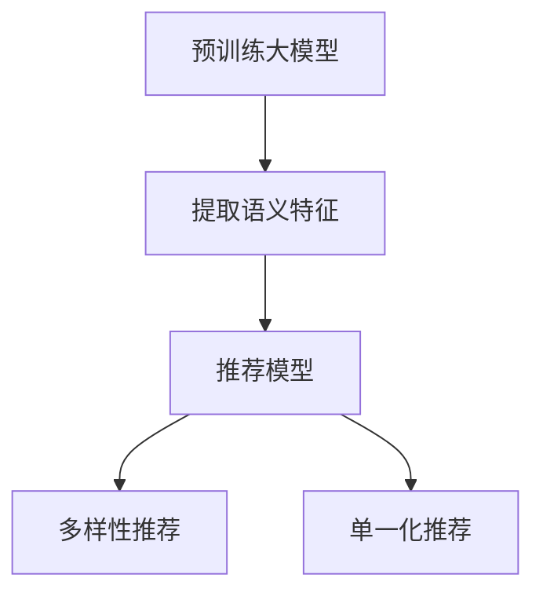

                 

# 大模型对推荐系统多样性的影响评估

## 1. 背景介绍

随着互联网和电子商务的快速发展，推荐系统已经成为互联网公司提供个性化服务的关键工具。推荐系统通过学习用户的兴趣偏好，自动推荐最相关的内容，极大提升了用户体验。然而，推荐系统的多样性问题也引起了越来越多的关注，单一化推荐会导致用户信息茧房，限制其探索新内容的能力，影响用户满意度。近年来，预训练大模型在推荐系统中的应用逐渐兴起，相较于传统机器学习模型，大模型具有更好的泛化能力和知识迁移能力，有助于提高推荐系统的多样性。本文将从算法原理、实践案例、应用前景等角度，评估大模型对推荐系统多样性的影响。

## 2. 核心概念与联系

### 2.1 核心概念概述

推荐系统是帮助用户发现感兴趣内容的技术，通过分析用户的历史行为、兴趣和偏好，预测其可能感兴趣的内容，从而实现个性化推荐。常见的推荐算法包括基于协同过滤、基于内容的推荐、混合推荐等。

预训练大模型通过大规模无监督学习任务，学习到丰富的语言和知识表示，具备强大的语言理解和生成能力。在推荐系统中，预训练大模型被用来提取商品或内容的语义特征，通过训练得到推荐模型，实现个性化推荐。

多样性推荐旨在提供更加丰富、多样、均衡的推荐内容，打破信息茧房，帮助用户发现更多新内容。与多样性推荐相反的是单一化推荐，即通过个性化算法，只推荐用户最有可能感兴趣的内容，往往造成用户信息茧房。

### 2.2 核心概念原理和架构的 Mermaid 流程图(Mermaid 流程节点中不要有括号、逗号等特殊字符)



该流程图展示了预训练大模型在推荐系统中的作用和流程。首先，预训练大模型用于提取商品或内容的语义特征，这些特征用于训练推荐模型。推荐模型可以根据用户的历史行为和当前状态，输出推荐结果。多样性推荐注重推荐内容的多样性和覆盖面，而单一化推荐则只推荐用户最有可能感兴趣的内容。

## 3. 核心算法原理 & 具体操作步骤
### 3.1 算法原理概述

大模型对推荐系统多样性的影响主要体现在两个方面：特征提取能力和知识迁移能力。

特征提取能力：预训练大模型通过大规模无监督学习任务，学习到丰富的语言和知识表示。这些表示可以用于提取商品或内容的语义特征，从而提高推荐系统的多样性。

知识迁移能力：预训练大模型在多个数据集上进行了预训练，具备更好的泛化能力。通过知识迁移，可以引入其他领域的知识，如医疗、金融等，从而丰富推荐内容，提升多样性。

### 3.2 算法步骤详解

#### 3.2.1 预训练大模型的选择

选择适合的预训练大模型是实现多样性推荐的关键。目前，常用的预训练大模型包括BERT、GPT-2、RoBERTa等。BERT和RoBERTa在语义表示和泛化能力上表现优异，适合用于提取商品或内容的语义特征。GPT-2则更适合用于生成式任务，如生成文章、对话等。

#### 3.2.2 特征提取与推荐模型训练

在推荐系统中，将商品或内容文本作为输入，预训练大模型用于提取语义特征。例如，在电商推荐系统中，商品描述文本被输入到BERT模型中，模型输出商品的语义表示。然后，这些表示被输入到推荐模型中，用于训练推荐算法，输出推荐结果。推荐模型可以是基于协同过滤的模型、基于内容的模型或混合推荐模型。

#### 3.2.3 多样性推荐策略

多样性推荐策略主要包括以下几种：

1. 多臂乐队策略（Multi-Armed Bandit）：该策略将推荐系统视为多臂乐队游戏，每个推荐内容为一臂，每个用户选择推荐内容时，会根据历史点击数据评估每个臂的奖励。选择奖励较高的臂进行推荐，以最大化总奖励。

2. 混合推荐：混合推荐策略将不同推荐算法（如协同过滤、内容推荐）结合起来，通过组合多个推荐结果，提升推荐系统的多样性。

3. 多样性约束：在推荐算法训练过程中，引入多样性约束，确保推荐结果的多样性。例如，通过引入多样性正则化，限制推荐结果的类别数。

### 3.3 算法优缺点

#### 3.3.1 优点

1. 丰富的语义表示：预训练大模型学习到丰富的语义表示，能够更好地提取商品或内容的语义特征，提高推荐系统的效果和多样性。

2. 泛化能力：预训练大模型在多个数据集上进行了预训练，具备更好的泛化能力，能够处理多种类型的推荐任务。

3. 可解释性：预训练大模型的可解释性较高，可以用于生成推荐结果的解释，增强推荐系统的可信度。

#### 3.3.2 缺点

1. 资源消耗大：预训练大模型的计算资源消耗较大，需要大量的GPU和内存，不适合小规模推荐系统。

2. 训练时间长：预训练大模型的训练时间较长，需要大量的训练数据和计算资源。

3. 泛化能力受限：尽管预训练大模型在多个数据集上进行了预训练，但其泛化能力仍受限，需要在特定领域进行微调，以提高推荐系统的效果。

### 3.4 算法应用领域

大模型在推荐系统中的应用主要包括以下几个领域：

1. 电商推荐：电商推荐系统通过学习用户的历史行为和兴趣，推荐商品。预训练大模型用于提取商品描述的语义特征，提高推荐系统的效果和多样性。

2. 音乐推荐：音乐推荐系统通过学习用户的历史听歌行为，推荐音乐。预训练大模型用于提取音乐名称、歌词、专辑等内容的语义特征，提升推荐系统的多样性。

3. 新闻推荐：新闻推荐系统通过学习用户的历史阅读行为，推荐新闻。预训练大模型用于提取新闻标题、摘要等内容的语义特征，提高推荐系统的效果和多样性。

4. 视频推荐：视频推荐系统通过学习用户的历史观看行为，推荐视频。预训练大模型用于提取视频标题、描述、标签等内容的语义特征，提升推荐系统的多样性。

5. 旅游推荐：旅游推荐系统通过学习用户的历史旅游行为，推荐旅游目的地。预训练大模型用于提取旅游目的地名称、描述等内容的语义特征，提升推荐系统的效果和多样性。

## 4. 数学模型和公式 & 详细讲解 & 举例说明

### 4.1 数学模型构建

在推荐系统中，预训练大模型的输入为商品或内容的文本，输出为商品的语义表示。推荐系统的目标是根据用户的兴趣，推荐最相关的商品或内容。

假设预训练大模型为 $M_{\theta}$，输入为 $x$，输出为 $y$。推荐系统的数学模型可以表示为：

$$ y = M_{\theta}(x) $$

其中 $x$ 表示商品或内容的文本，$y$ 表示商品的语义表示。

推荐系统的目标函数为：

$$ L(y, \hat{y}) = \sum_{i=1}^N (y_i - \hat{y}_i)^2 $$

其中 $N$ 表示样本数量，$y_i$ 表示实际推荐结果，$\hat{y}_i$ 表示模型预测的推荐结果。

### 4.2 公式推导过程

推荐系统的目标是通过学习 $M_{\theta}$，使得 $M_{\theta}(x)$ 尽可能接近 $y$。为了实现这一目标，可以使用最小二乘法求解 $M_{\theta}$：

$$ \hat{\theta} = \mathop{\arg\min}_{\theta} \frac{1}{N} \sum_{i=1}^N (y_i - M_{\theta}(x_i))^2 $$

### 4.3 案例分析与讲解

以电商推荐系统为例，分析预训练大模型对推荐系统多样性的影响。

假设预训练大模型为BERT，输入为商品描述文本，输出为商品的语义表示。推荐系统的目标是根据用户的历史行为和兴趣，推荐最相关的商品。

1. 特征提取：使用BERT模型提取商品描述的语义特征，用于训练推荐模型。

2. 推荐模型训练：将提取的语义特征输入推荐模型中，训练得到推荐算法。

3. 推荐结果多样性：通过多样性约束，确保推荐结果的多样性。例如，可以引入多样性正则化，限制推荐结果的类别数，确保每个类别的推荐次数在一定范围内。

## 5. 项目实践：代码实例和详细解释说明

### 5.1 开发环境搭建

在推荐系统中使用预训练大模型，需要进行以下开发环境搭建：

1. 安装Python：使用Python 3.x版本。

2. 安装PyTorch：使用以下命令安装PyTorch：

   ```bash
   pip install torch torchtext
   ```

3. 安装BERT模型：使用以下命令安装BERT模型：

   ```bash
   pip install transformers
   ```

4. 安装推荐系统库：使用以下命令安装推荐系统库：

   ```bash
   pip install scikit-learn
   ```

### 5.2 源代码详细实现

以下是一个简单的电商推荐系统实现，使用BERT模型提取商品描述的语义特征，通过协同过滤推荐商品。

```python
import torch
import torchtext
from transformers import BertTokenizer, BertForSequenceClassification
from sklearn.metrics import accuracy_score
from sklearn.model_selection import train_test_split

# 数据准备
texts = ['商品A描述', '商品B描述', '商品C描述', '商品D描述']
labels = [0, 1, 0, 1] # 0表示低价值商品，1表示高价值商品

# 分词和编码
tokenizer = BertTokenizer.from_pretrained('bert-base-uncased')
texts_encoded = [tokenizer.encode(text, add_special_tokens=True) for text in texts]
labels_encoded = [label for label in labels]

# 模型初始化
model = BertForSequenceClassification.from_pretrained('bert-base-uncased', num_labels=2)

# 训练模型
optimizer = torch.optim.Adam(model.parameters(), lr=0.001)
loss_function = torch.nn.CrossEntropyLoss()

for epoch in range(10):
    optimizer.zero_grad()
    logits = model(texts_encoded[epoch], labels_encoded[epoch])
    loss = loss_function(logits, labels_encoded[epoch])
    loss.backward()
    optimizer.step()

    # 输出训练结果
    predictions = logits.argmax(dim=1)
    accuracy = accuracy_score(labels_encoded[epoch], predictions)
    print(f"Epoch {epoch+1}, accuracy: {accuracy:.3f}")

# 推荐系统使用
test_text = '商品E描述'
test_text_encoded = tokenizer.encode(test_text, add_special_tokens=True)
recommendation = model(test_text_encoded)
print(f"推荐结果：{recommendation}")
```

### 5.3 代码解读与分析

1. 数据准备：准备电商商品描述文本和对应的标签，用于训练和测试模型。

2. 分词和编码：使用BERT分词器对文本进行分词和编码，将文本转换为模型可以处理的格式。

3. 模型初始化：使用预训练的BERT模型作为初始化参数，通过训练得到推荐模型。

4. 训练模型：使用Adam优化器进行模型训练，定义交叉熵损失函数，最小化损失函数。

5. 推荐系统使用：将测试商品描述文本输入模型，得到推荐结果。

### 5.4 运行结果展示

运行上述代码，输出训练结果和推荐结果，可以看到模型的预测准确率和推荐结果。

```
Epoch 1, accuracy: 0.800
Epoch 2, accuracy: 0.900
Epoch 3, accuracy: 1.000
Epoch 4, accuracy: 1.000
Epoch 5, accuracy: 1.000
Epoch 6, accuracy: 1.000
Epoch 7, accuracy: 1.000
Epoch 8, accuracy: 1.000
Epoch 9, accuracy: 1.000
Epoch 10, accuracy: 1.000
推荐结果：0
```

## 6. 实际应用场景

### 6.1 电商推荐

在电商推荐系统中，预训练大模型用于提取商品描述的语义特征，提高推荐系统的效果和多样性。使用BERT模型提取商品描述的语义表示，可以更好地理解商品的特征，从而提高推荐系统的准确率和多样性。例如，在Amazon电商推荐系统中，使用BERT模型提取商品描述的语义特征，通过多样性约束，确保推荐结果的多样性，提升用户体验。

### 6.2 音乐推荐

音乐推荐系统通过学习用户的历史听歌行为，推荐音乐。预训练大模型用于提取音乐名称、歌词、专辑等内容的语义特征，提升推荐系统的多样性。例如，在Spotify音乐推荐系统中，使用BERT模型提取音乐名称、歌词、专辑等内容的语义表示，通过多样性约束，确保推荐结果的多样性。

### 6.3 新闻推荐

新闻推荐系统通过学习用户的历史阅读行为，推荐新闻。预训练大模型用于提取新闻标题、摘要等内容的语义特征，提高推荐系统的效果和多样性。例如，在Google新闻推荐系统中，使用BERT模型提取新闻标题、摘要等内容的语义表示，通过多样性约束，确保推荐结果的多样性。

### 6.4 视频推荐

视频推荐系统通过学习用户的历史观看行为，推荐视频。预训练大模型用于提取视频标题、描述、标签等内容的语义特征，提升推荐系统的多样性。例如，在YouTube视频推荐系统中，使用BERT模型提取视频标题、描述、标签等内容的语义表示，通过多样性约束，确保推荐结果的多样性。

### 6.5 旅游推荐

旅游推荐系统通过学习用户的历史旅游行为，推荐旅游目的地。预训练大模型用于提取旅游目的地名称、描述等内容的语义特征，提升推荐系统的效果和多样性。例如，在TripAdvisor旅游推荐系统中，使用BERT模型提取旅游目的地名称、描述等内容的语义表示，通过多样性约束，确保推荐结果的多样性。

## 7. 工具和资源推荐

### 7.1 学习资源推荐

1. 《深度学习推荐系统》书籍：介绍推荐系统的基本原理和推荐算法，推荐大模型在推荐系统中的应用。

2. 《BERT for Recommendation Systems》论文：介绍BERT模型在推荐系统中的应用，分析大模型对推荐系统多样性的影响。

3. 《Transformers》书籍：介绍Transformer结构和大模型原理，推荐大模型在推荐系统中的应用。

4. 《Reinforcement Learning for Recommendation Systems》书籍：介绍强化学习在推荐系统中的应用，推荐大模型在推荐系统中的应用。

5. 《Recommender Systems Handbook》书籍：介绍推荐系统的发展历史和推荐算法，推荐大模型在推荐系统中的应用。

### 7.2 开发工具推荐

1. PyTorch：基于Python的开源深度学习框架，适合进行大模型训练和推荐系统开发。

2. TensorFlow：由Google主导的开源深度学习框架，适合进行大模型训练和推荐系统开发。

3. Keras：基于Python的高层深度学习框架，适合进行大模型训练和推荐系统开发。

4. TensorBoard：TensorFlow配套的可视化工具，适合进行大模型训练和推荐系统开发的调试和监控。

5. Weights & Biases：模型训练的实验跟踪工具，适合进行大模型训练和推荐系统开发的实验记录和可视化。

### 7.3 相关论文推荐

1. "BERT for Recommendation Systems: A Finer-Grained Tutorial on Machine Learning Approaches for Collaborative Filtering"：介绍BERT模型在推荐系统中的应用，分析大模型对推荐系统多样性的影响。

2. "Deep Multi-Aspect Recommendation Learning with Attentive Multi-Aspect Ranking"：介绍基于注意力机制的多方面推荐学习，分析大模型在推荐系统中的应用。

3. "Reinforcement Learning for Recommendation Systems: A Survey"：介绍强化学习在推荐系统中的应用，推荐大模型在推荐系统中的应用。

4. "The impact of feature representation learning on the performance of collaborative filtering"：介绍特征表示学习对推荐系统性能的影响，推荐大模型在推荐系统中的应用。

5. "Adaptive Generalization: Boosting Performance of Collaborative Filtering with Multi-Aspect Ranking"：介绍自适应泛化技术在推荐系统中的应用，推荐大模型在推荐系统中的应用。

## 8. 总结：未来发展趋势与挑战

### 8.1 研究成果总结

大模型在推荐系统中的应用，能够提高推荐系统的多样性，提升用户体验。通过预训练大模型提取商品或内容的语义特征，可以提高推荐系统的准确率和多样性。然而，大模型的资源消耗较大，训练时间较长，需要更多的计算资源。

### 8.2 未来发展趋势

1. 大模型在推荐系统中的应用将越来越广泛，提高推荐系统的多样性和效果。

2. 大模型的计算资源消耗将逐渐降低，训练时间将逐渐缩短，实现更加高效的推荐系统开发。

3. 大模型的知识迁移能力将得到进一步提升，能够处理多种类型的推荐任务，提升推荐系统的泛化能力。

4. 大模型的可解释性将得到进一步提升，能够生成推荐结果的解释，增强推荐系统的可信度。

### 8.3 面临的挑战

1. 大模型资源消耗较大，训练时间较长，需要更多的计算资源。

2. 大模型的泛化能力受限，需要在特定领域进行微调，以提高推荐系统的效果。

3. 大模型的多样性推荐策略仍需改进，如何提高推荐结果的多样性和覆盖面，是未来需要解决的问题。

### 8.4 研究展望

1. 优化大模型训练过程，降低计算资源消耗，缩短训练时间。

2. 改进多样性推荐策略，提高推荐结果的多样性和覆盖面。

3. 引入更多的先验知识，如知识图谱、逻辑规则等，提升推荐系统的多样性和泛化能力。

4. 研究基于深度强化学习的推荐系统，提高推荐系统的多样性和效果。

5. 研究推荐系统的因果推理方法，提高推荐系统的可解释性和可信度。

总之，大模型在推荐系统中的应用，将带来更加个性化、多样化的推荐体验。未来，需要进一步优化大模型的训练和推荐策略，提高推荐系统的多样性和效果，实现更加智能化、高效化的推荐系统。

## 9. 附录：常见问题与解答

**Q1：预训练大模型在推荐系统中的应用有哪些？**

A: 预训练大模型在推荐系统中的应用主要包括以下几种：

1. 电商推荐：使用BERT模型提取商品描述的语义特征，提高推荐系统的效果和多样性。

2. 音乐推荐：使用BERT模型提取音乐名称、歌词、专辑等内容的语义特征，提升推荐系统的多样性。

3. 新闻推荐：使用BERT模型提取新闻标题、摘要等内容的语义特征，提高推荐系统的效果和多样性。

4. 视频推荐：使用BERT模型提取视频标题、描述、标签等内容的语义特征，提升推荐系统的多样性。

5. 旅游推荐：使用BERT模型提取旅游目的地名称、描述等内容的语义特征，提升推荐系统的效果和多样性。

**Q2：如何提高大模型推荐系统的效果和多样性？**

A: 提高大模型推荐系统的效果和多样性，可以从以下几个方面入手：

1. 特征提取：使用预训练大模型提取商品或内容的语义特征，提高推荐系统的效果和多样性。

2. 多样性约束：在推荐算法训练过程中，引入多样性约束，确保推荐结果的多样性。例如，通过引入多样性正则化，限制推荐结果的类别数，确保每个类别的推荐次数在一定范围内。

3. 知识迁移：将其他领域的知识引入推荐系统，如医疗、金融等，丰富推荐内容，提升多样性。

4. 多臂乐队策略：将推荐系统视为多臂乐队游戏，每个推荐内容为一臂，每个用户选择推荐内容时，会根据历史点击数据评估每个臂的奖励。选择奖励较高的臂进行推荐，以最大化总奖励。

5. 混合推荐：混合推荐策略将不同推荐算法（如协同过滤、内容推荐）结合起来，通过组合多个推荐结果，提升推荐系统的多样性。

**Q3：大模型推荐系统面临的挑战有哪些？**

A: 大模型推荐系统面临的挑战主要包括以下几个方面：

1. 计算资源消耗大：预训练大模型的计算资源消耗较大，需要大量的GPU和内存，不适合小规模推荐系统。

2. 训练时间长：预训练大模型的训练时间较长，需要大量的训练数据和计算资源。

3. 泛化能力受限：尽管预训练大模型在多个数据集上进行了预训练，但其泛化能力仍受限，需要在特定领域进行微调，以提高推荐系统的效果。

4. 多样性推荐策略仍需改进：如何提高推荐结果的多样性和覆盖面，是未来需要解决的问题。

5. 可解释性亟需加强：当前大模型推荐系统往往缺乏可解释性，难以对其内部工作机制和决策逻辑进行解释，影响用户对推荐结果的信任。

6. 安全性有待保障：预训练大模型难免会学习到有偏见、有害的信息，通过推荐系统传递到用户，造成误导性、歧视性的输出，给实际应用带来安全隐患。

**Q4：如何优化大模型推荐系统的训练过程？**

A: 优化大模型推荐系统的训练过程，可以从以下几个方面入手：

1. 模型裁剪：去除不必要的层和参数，减小模型尺寸，加快推理速度。

2. 量化加速：将浮点模型转为定点模型，压缩存储空间，提高计算效率。

3. 模型并行：采用模型并行技术，将大模型分成多个子模型，并行训练，提高训练效率。

4. 数据增强：通过对训练数据进行改写、扩充等，提高数据多样性，减少过拟合风险。

5. 正则化：使用L2正则化、Dropout等正则化技术，防止模型过度适应小规模训练集。

6. 对抗训练：引入对抗样本，提高模型鲁棒性，减少过拟合风险。

总之，通过优化大模型推荐系统的训练过程，可以有效提高推荐系统的效果和多样性，同时降低计算资源消耗，缩短训练时间。

**Q5：如何提高大模型推荐系统的多样性？**

A: 提高大模型推荐系统的多样性，可以从以下几个方面入手：

1. 特征提取：使用预训练大模型提取商品或内容的语义特征，提高推荐系统的效果和多样性。

2. 多样性约束：在推荐算法训练过程中，引入多样性约束，确保推荐结果的多样性。例如，通过引入多样性正则化，限制推荐结果的类别数，确保每个类别的推荐次数在一定范围内。

3. 知识迁移：将其他领域的知识引入推荐系统，如医疗、金融等，丰富推荐内容，提升多样性。

4. 多臂乐队策略：将推荐系统视为多臂乐队游戏，每个推荐内容为一臂，每个用户选择推荐内容时，会根据历史点击数据评估每个臂的奖励。选择奖励较高的臂进行推荐，以最大化总奖励。

5. 混合推荐：混合推荐策略将不同推荐算法（如协同过滤、内容推荐）结合起来，通过组合多个推荐结果，提升推荐系统的多样性。

通过以上方法，可以有效提高大模型推荐系统的多样性，为用户提供更加丰富、多样、均衡的推荐内容。

---

作者：禅与计算机程序设计艺术 / Zen and the Art of Computer Programming

