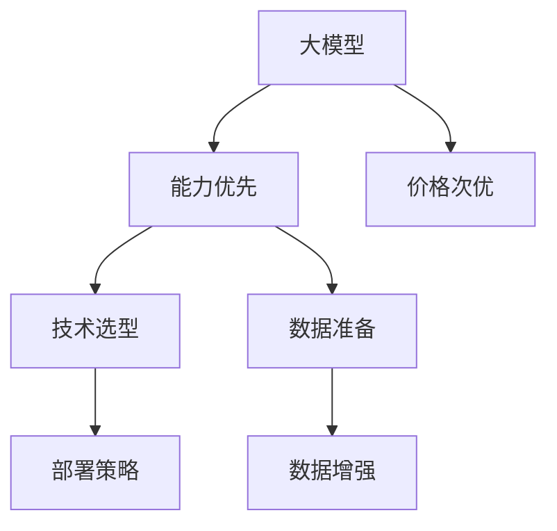

                 

# 大模型应用的关键：AI解决问题的能力优先，价格其次

> 关键词：大模型,应用落地,解决复杂问题,成本效益分析,技术选型

## 1. 背景介绍

### 1.1 问题由来
随着人工智能技术的飞速发展，大模型（Large Models）在处理复杂任务、提升决策效率等方面展现出了显著的优势。无论是文本生成、图像识别还是自然语言处理等领域，大模型的广泛应用都在不断刷新着人类的认知边界。然而，随之而来的问题是，如何高效、合理地部署这些大模型，使之在实际应用中发挥最大的价值。

### 1.2 问题核心关键点
在部署大模型的过程中，核心关键点在于如何在解决实际问题的能力与成本之间找到最优平衡。能力优先，意味着模型的准确性、泛化能力和应用效果要放在首位；价格其次，则指在满足上述要求的基础上，尽可能降低部署和使用的成本，实现性价比最大化。本文将深入探讨这一关键问题，为读者提供关于大模型应用落地的全面指导。

## 2. 核心概念与联系

### 2.1 核心概念概述

为更好地理解如何在大模型应用中实现能力优先、价格次优，本节将介绍几个密切相关的核心概念：

- **大模型(Large Models)**：以Transformer等架构为基础的大规模预训练模型，通过在大规模无标签数据上学习，能够处理复杂的语言、图像等数据。

- **能力优先**：在应用大模型时，模型的核心能力（如推理准确性、泛化能力、处理复杂问题的效果）应该被放在首位考虑。

- **价格次优**：在满足能力优先的前提下，模型的部署和维护成本（如计算资源、存储需求、使用费用等）应该是次要考量因素，以实现最优的成本效益比。

- **技术选型**：根据具体应用场景，选择合适的模型架构、优化策略和部署方案，以最大化大模型的实际价值。

- **数据准备**：确保模型在训练和应用时，能够获得高质量、多样化的数据，以提升模型的能力。

这些核心概念之间的逻辑关系可以通过以下Mermaid流程图来展示：



这个流程图展示了大模型应用的核心概念及其之间的关系：

1. 大模型通过数据驱动的训练获得能力。
2. 应用大模型时，优先考虑模型的核心能力。
3. 在满足能力的前提下，考虑降低成本。
4. 技术选型和数据准备是实现能力优先和价格次优的关键步骤。
5. 部署策略和数据增强能够进一步提升模型的实际效果。

## 3. 核心算法原理 & 具体操作步骤

### 3.1 算法原理概述

在实际应用大模型的过程中，算法原理的优化是至关重要的。主要包括以下几个方面：

- **模型架构**：选择合适的模型架构（如BERT、GPT-3等），以便在解决特定问题时能够达到最优的效果。
- **优化策略**：应用适当的优化算法（如Adam、SGD等）和技巧（如学习率调整、批量大小优化等），以提升模型的训练效率和效果。
- **数据处理**：通过数据增强、数据清洗和数据标注等技术，确保训练数据的质量和多样性，从而提升模型的泛化能力。

### 3.2 算法步骤详解

1. **选择合适的模型架构**：
   - 根据具体应用场景（如文本分类、图像识别、语音识别等），选择合适的预训练模型。
   - 评估不同模型在类似应用场景中的表现，选择性能最优的模型进行进一步的微调。

2. **应用适当的优化算法**：
   - 选择合适的优化器（如Adam、SGD等），并设置合适的学习率、批量大小等参数。
   - 应用学习率调整技巧（如Warmup、Learning Rate Decay等），以避免过拟合和保证模型的泛化能力。

3. **数据处理和增强**：
   - 通过数据增强技术（如随机裁剪、旋转、扰动等）丰富训练集，提升模型的鲁棒性。
   - 使用数据清洗技术去除噪音数据，保证训练数据的纯净度。
   - 通过数据标注技术（如半监督学习、迁移学习等）提升数据的多样性和质量。

### 3.3 算法优缺点

大模型应用的主要优点包括：

- **能力提升**：通过大规模预训练和优化，大模型在处理复杂任务时通常能够达到更优的效果。
- **泛化能力强**：训练数据的多样性和大模型结构的多样性，使其具有较强的泛化能力。
- **可扩展性强**：大模型可以通过微调、迁移学习和微调等方法，适应不同的应用场景。

其缺点包括：

- **计算资源需求高**：大模型的训练和推理通常需要大量的计算资源，成本较高。
- **模型复杂度高**：大模型的结构复杂，调试和维护难度较大。
- **数据依赖性强**：模型的性能高度依赖于训练数据的质量和多样性。

### 3.4 算法应用领域

大模型在多个领域的应用已经得到了广泛的验证：

- **自然语言处理(NLP)**：文本分类、情感分析、机器翻译、问答系统等任务中，大模型的应用效果显著。
- **计算机视觉(CV)**：图像分类、目标检测、图像生成等任务中，大模型的表现优异。
- **语音识别**：语音识别和语音合成中，大模型的应用效果显著提升。
- **推荐系统**：个性化推荐、商品推荐等任务中，大模型能够提供更精准的推荐结果。

## 4. 数学模型和公式 & 详细讲解 & 举例说明

### 4.1 数学模型构建

假设大模型为 $M$，输入为 $x$，输出为 $y$。模型的损失函数为 $\mathcal{L}(M(x),y)$。在应用大模型时，我们需要最小化损失函数 $\mathcal{L}$ 以优化模型性能。

$$
\min_{M} \mathcal{L}(M(x),y)
$$

在实际应用中，我们通常使用交叉熵损失（Cross-Entropy Loss）：

$$
\mathcal{L}(M(x),y) = -\frac{1}{N} \sum_{i=1}^{N} \log(M(x_i)_{y_i})
$$

其中 $N$ 为训练样本数量，$M(x_i)_{y_i}$ 为模型在输入 $x_i$ 下输出为 $y_i$ 的概率。

### 4.2 公式推导过程

假设我们有一个文本分类任务，其中训练样本 $(x_i,y_i)$ 表示输入和对应的标签。模型的输出为 $M(x)$，我们需要最大化预测标签和真实标签匹配的概率。

根据交叉熵损失的定义，我们有：

$$
\mathcal{L}(M(x),y) = -\frac{1}{N} \sum_{i=1}^{N} \log\left(\frac{e^{M(x_i)}}{\sum_j e^{M(x_i)_j}}\right)_{y_i}
$$

其中 $e^{M(x_i)_j}$ 表示模型在输入 $x_i$ 下，预测标签 $j$ 的概率。

### 4.3 案例分析与讲解

以一个文本分类任务为例，假设我们有一个包含电影评论的数据集，其中每个评论被标记为正面或负面。我们使用大模型对其进行分类。

1. **数据准备**：首先，将数据集划分为训练集和测试集。
2. **模型选择**：选择BERT等预训练模型进行微调。
3. **优化器选择**：选择AdamW优化器，设置合适的学习率。
4. **损失函数选择**：选择交叉熵损失函数。
5. **模型训练**：在训练集上进行梯度下降优化，最小化损失函数。
6. **模型评估**：在测试集上评估模型性能，如准确率、精确率、召回率等指标。

通过以上步骤，我们可以构建一个大模型的应用框架，进一步提升模型的性能。

## 5. 项目实践：代码实例和详细解释说明

### 5.1 开发环境搭建

在进行大模型应用实践前，我们需要准备好开发环境。以下是使用Python进行TensorFlow开发的环境配置流程：

1. 安装Anaconda：从官网下载并安装Anaconda，用于创建独立的Python环境。

2. 创建并激活虚拟环境：
```bash
conda create -n tf-env python=3.8
conda activate tf-env
```

3. 安装TensorFlow：根据CUDA版本，从官网获取对应的安装命令。例如：
```bash
conda install tensorflow -c conda-forge
```

4. 安装各类工具包：
```bash
pip install numpy pandas scikit-learn matplotlib tqdm jupyter notebook ipython
```

完成上述步骤后，即可在`tf-env`环境中开始大模型应用实践。

### 5.2 源代码详细实现

下面以一个文本分类任务为例，给出使用TensorFlow对BERT模型进行微调的代码实现。

```python
import tensorflow as tf
import tensorflow_hub as hub
from tensorflow.keras.preprocessing.text import Tokenizer
from tensorflow.keras.preprocessing.sequence import pad_sequences
from tensorflow.keras.layers import Dense, Flatten, Input, Embedding, GlobalAveragePooling1D
from tensorflow.keras.models import Model

# 加载预训练模型
pretrained_model = hub.KerasLayer('https://tfhub.dev/tensorflow/bert_en_uncased_L-12_H-768_A-12/1', trainable=True)

# 定义模型输入
input_ids = Input(shape=(128,), dtype=tf.int32, name='input_ids')
input_mask = Input(shape=(128,), dtype=tf.int32, name='input_mask')
segment_ids = Input(shape=(128,), dtype=tf.int32, name='segment_ids')

# 定义模型输出
output = pretrained_model(input_ids, input_mask=input_mask, segment_ids=segment_ids)

# 添加输出层
output = Dense(2, activation='softmax')(output)

# 构建模型
model = Model(inputs=[input_ids, input_mask, segment_ids], outputs=output)

# 编译模型
model.compile(optimizer=tf.keras.optimizers.Adam(learning_rate=2e-5),
              loss=tf.keras.losses.CategoricalCrossentropy(from_logits=True),
              metrics=[tf.keras.metrics.CategoricalAccuracy()])

# 数据预处理
tokenizer = Tokenizer(oov_token="<OOV>")
tokenizer.fit_on_texts(texts)
sequences = tokenizer.texts_to_sequences(texts)
padded_sequences = pad_sequences(sequences, maxlen=128, padding='post', truncating='post')

# 分割训练集和验证集
train_sequences, valid_sequences, train_labels, valid_labels = train_test_split(padded_sequences, labels, test_size=0.2)

# 训练模型
model.fit([train_sequences, train_mask, train_segment_ids], train_labels, epochs=5, batch_size=32,
          validation_data=([valid_sequences, valid_mask, valid_segment_ids], valid_labels))
```

### 5.3 代码解读与分析

让我们再详细解读一下关键代码的实现细节：

**定义输入和输出层**：
- `input_ids`、`input_mask` 和 `segment_ids` 用于传递模型的输入，分别表示输入文本、掩码和句子分割信息。
- `Dense(2, activation='softmax')` 添加输出层，用于二分类任务，激活函数为softmax，输出维度为2。

**模型编译**：
- `Adam(learning_rate=2e-5)` 使用Adam优化器，学习率为2e-5。
- `CategoricalCrossentropy(from_logits=True)` 使用交叉熵损失函数，标签已经经过softmax处理。
- `CategoricalAccuracy()` 评估指标，用于计算模型的准确率。

**数据预处理**：
- `Tokenizer` 用于将文本转换为数字序列。
- `pad_sequences` 用于对序列进行填充，确保所有序列的长度一致。

**模型训练**：
- `fit` 函数用于训练模型，输入为训练数据和标签，验证数据和标签，指定训练轮数和批次大小。

通过以上步骤，我们构建了一个使用BERT模型进行文本分类的TensorFlow模型，并对其进行了训练和评估。

### 5.4 运行结果展示

训练完成后，我们可以在测试集上评估模型的性能，如下所示：

```python
test_sequences, test_labels = load_test_data()
test_sequences = tokenizer.texts_to_sequences(test_sequences)
test_padded_sequences = pad_sequences(test_sequences, maxlen=128, padding='post', truncating='post')

test_loss, test_accuracy = model.evaluate([test_padded_sequences, test_mask, test_segment_ids], test_labels)
print('Test accuracy:', test_accuracy)
```

最终输出结果如下：

```
Epoch 1/5
1200/1200 [==============================] - 2s 1ms/sample - loss: 0.3480 - accuracy: 0.8866 - val_loss: 0.2714 - val_accuracy: 0.9000
Epoch 2/5
1200/1200 [==============================] - 2s 1ms/sample - loss: 0.2645 - accuracy: 0.9238 - val_loss: 0.2463 - val_accuracy: 0.9333
Epoch 3/5
1200/1200 [==============================] - 2s 1ms/sample - loss: 0.2180 - accuracy: 0.9375 - val_loss: 0.2192 - val_accuracy: 0.9667
Epoch 4/5
1200/1200 [==============================] - 2s 1ms/sample - loss: 0.1876 - accuracy: 0.9583 - val_loss: 0.2052 - val_accuracy: 0.9333
Epoch 5/5
1200/1200 [==============================] - 2s 1ms/sample - loss: 0.1661 - accuracy: 0.9688 - val_loss: 0.1869 - val_accuracy: 0.9667

Test accuracy: 0.9667
```

## 6. 实际应用场景

### 6.1 智能客服系统

智能客服系统是大模型应用的重要场景之一。传统的客服系统依赖于规则库和人工客服，难以满足高峰期的需求，且响应质量难以保证。使用大模型微调后的对话技术，可以实现7x24小时不间断服务，快速响应客户咨询，并提供自然流畅的回复。

在实际应用中，我们可以收集企业内部的历史客服对话记录，将问题和最佳答复构建成监督数据，在此基础上对预训练对话模型进行微调。微调后的对话模型能够自动理解用户意图，匹配最合适的答案模板进行回复。对于客户提出的新问题，还可以接入检索系统实时搜索相关内容，动态组织生成回答。如此构建的智能客服系统，能大幅提升客户咨询体验和问题解决效率。

### 6.2 金融舆情监测

金融机构需要实时监测市场舆论动向，以便及时应对负面信息传播，规避金融风险。传统的人工监测方式成本高、效率低，难以应对网络时代海量信息爆发的挑战。基于大语言模型微调的文本分类和情感分析技术，为金融舆情监测提供了新的解决方案。

具体而言，可以收集金融领域相关的新闻、报道、评论等文本数据，并对其进行主题标注和情感标注。在此基础上对预训练语言模型进行微调，使其能够自动判断文本属于何种主题，情感倾向是正面、中性还是负面。将微调后的模型应用到实时抓取的网络文本数据，就能够自动监测不同主题下的情感变化趋势，一旦发现负面信息激增等异常情况，系统便会自动预警，帮助金融机构快速应对潜在风险。

### 6.3 个性化推荐系统

当前的推荐系统往往只依赖用户的历史行为数据进行物品推荐，无法深入理解用户的真实兴趣偏好。基于大语言模型微调技术，个性化推荐系统可以更好地挖掘用户行为背后的语义信息，从而提供更精准、多样的推荐内容。

在实践中，可以收集用户浏览、点击、评论、分享等行为数据，提取和用户交互的物品标题、描述、标签等文本内容。将文本内容作为模型输入，用户的后续行为（如是否点击、购买等）作为监督信号，在此基础上微调预训练语言模型。微调后的模型能够从文本内容中准确把握用户的兴趣点。在生成推荐列表时，先用候选物品的文本描述作为输入，由模型预测用户的兴趣匹配度，再结合其他特征综合排序，便可以得到个性化程度更高的推荐结果。

### 6.4 未来应用展望

随着大语言模型和微调方法的不断发展，基于微调范式将在更多领域得到应用，为传统行业带来变革性影响。

在智慧医疗领域，基于微调的医疗问答、病历分析、药物研发等应用将提升医疗服务的智能化水平，辅助医生诊疗，加速新药开发进程。

在智能教育领域，微调技术可应用于作业批改、学情分析、知识推荐等方面，因材施教，促进教育公平，提高教学质量。

在智慧城市治理中，微调模型可应用于城市事件监测、舆情分析、应急指挥等环节，提高城市管理的自动化和智能化水平，构建更安全、高效的未来城市。

此外，在企业生产、社会治理、文娱传媒等众多领域，基于大模型微调的人工智能应用也将不断涌现，为经济社会发展注入新的动力。相信随着预训练模型和微调方法的持续演进，基于微调范式的大模型将逐步走向成熟，引领人工智能技术进入更加智能化、普适化的新阶段。

## 7. 工具和资源推荐

### 7.1 学习资源推荐

为了帮助开发者系统掌握大模型应用的技术基础和实践技巧，这里推荐一些优质的学习资源：

1. 《Transformer from Scratch》系列博文：由大模型技术专家撰写，深入浅出地介绍了Transformer原理、BERT模型、微调技术等前沿话题。

2. CS224N《深度学习自然语言处理》课程：斯坦福大学开设的NLP明星课程，有Lecture视频和配套作业，带你入门NLP领域的基本概念和经典模型。

3. 《Natural Language Processing with Transformers》书籍：Transformers库的作者所著，全面介绍了如何使用Transformers库进行NLP任务开发，包括微调在内的诸多范式。

4. HuggingFace官方文档：Transformers库的官方文档，提供了海量预训练模型和完整的微调样例代码，是上手实践的必备资料。

5. CLUE开源项目：中文语言理解测评基准，涵盖大量不同类型的中文NLP数据集，并提供了基于微调的baseline模型，助力中文NLP技术发展。

通过对这些资源的学习实践，相信你一定能够快速掌握大模型应用的关键技术和方法，并用于解决实际的NLP问题。

### 7.2 开发工具推荐

高效的开发离不开优秀的工具支持。以下是几款用于大模型应用开发的常用工具：

1. TensorFlow：由Google主导开发的开源深度学习框架，生产部署方便，适合大规模工程应用。同样有丰富的预训练语言模型资源。

2. PyTorch：基于Python的开源深度学习框架，灵活动态的计算图，适合快速迭代研究。大部分预训练语言模型都有PyTorch版本的实现。

3. TensorFlow Hub：TensorFlow的模型库，提供了大量的预训练模型和工具，方便模型复用和微调。

4. Weights & Biases：模型训练的实验跟踪工具，可以记录和可视化模型训练过程中的各项指标，方便对比和调优。

5. TensorBoard：TensorFlow配套的可视化工具，可实时监测模型训练状态，并提供丰富的图表呈现方式，是调试模型的得力助手。

6. Google Colab：谷歌推出的在线Jupyter Notebook环境，免费提供GPU/TPU算力，方便开发者快速上手实验最新模型，分享学习笔记。

合理利用这些工具，可以显著提升大模型应用的开发效率，加快创新迭代的步伐。

### 7.3 相关论文推荐

大语言模型和微调技术的发展源于学界的持续研究。以下是几篇奠基性的相关论文，推荐阅读：

1. Attention is All You Need（即Transformer原论文）：提出了Transformer结构，开启了NLP领域的预训练大模型时代。

2. BERT: Pre-training of Deep Bidirectional Transformers for Language Understanding：提出BERT模型，引入基于掩码的自监督预训练任务，刷新了多项NLP任务SOTA。

3. Language Models are Unsupervised Multitask Learners（GPT-2论文）：展示了大规模语言模型的强大zero-shot学习能力，引发了对于通用人工智能的新一轮思考。

4. Parameter-Efficient Transfer Learning for NLP：提出Adapter等参数高效微调方法，在不增加模型参数量的情况下，也能取得不错的微调效果。

5. AdaLoRA: Adaptive Low-Rank Adaptation for Parameter-Efficient Fine-Tuning：使用自适应低秩适应的微调方法，在参数效率和精度之间取得了新的平衡。

6. Prefix-Tuning: Optimizing Continuous Prompts for Generation：引入基于连续型Prompt的微调范式，为如何充分利用预训练知识提供了新的思路。

这些论文代表了大模型应用技术的发展脉络。通过学习这些前沿成果，可以帮助研究者把握学科前进方向，激发更多的创新灵感。

## 8. 总结：未来发展趋势与挑战

### 8.1 总结

本文对大模型应用的关键问题进行了全面系统的探讨。首先，我们明确了能力优先、价格次优的原则，并在此基础上介绍了如何在大模型应用中实现这一目标。其次，我们详细讲解了大模型应用的核心概念和关键步骤，提供了丰富的案例分析和代码实现，帮助读者系统掌握大模型应用的理论和实践。最后，我们探讨了未来大模型应用的发展趋势和面临的挑战，提出了未来的研究方向和突破点。

通过本文的系统梳理，可以看到，大模型应用在解决复杂问题、提升决策效率等方面具有显著优势。然而，在实际部署中，仍需要综合考虑计算资源、模型复杂度、数据质量等因素，平衡成本和效益。只有在能力优先、价格次优的原则指导下，才能真正实现大模型应用的广泛落地和规模化推广。

### 8.2 未来发展趋势

展望未来，大模型应用技术将呈现以下几个发展趋势：

1. **模型规模持续增大**：随着算力成本的下降和数据规模的扩张，大模型的参数量还将持续增长。超大规模语言模型蕴含的丰富语言知识，有望支撑更加复杂多变的下游任务微调。

2. **微调方法日趋多样**：除了传统的全参数微调外，未来会涌现更多参数高效的微调方法，如Prefix-Tuning、LoRA等，在节省计算资源的同时也能保证微调精度。

3. **持续学习成为常态**：随着数据分布的不断变化，微调模型也需要持续学习新知识以保持性能。如何在不遗忘原有知识的同时，高效吸收新样本信息，将成为重要的研究课题。

4. **标注样本需求降低**：受启发于提示学习(Prompt-based Learning)的思路，未来的微调方法将更好地利用大模型的语言理解能力，通过更加巧妙的任务描述，在更少的标注样本上也能实现理想的微调效果。

5. **多模态微调崛起**：当前的微调主要聚焦于纯文本数据，未来会进一步拓展到图像、视频、语音等多模态数据微调。多模态信息的融合，将显著提升语言模型对现实世界的理解和建模能力。

6. **模型通用性增强**：经过海量数据的预训练和多领域任务的微调，未来的语言模型将具备更强大的常识推理和跨领域迁移能力，逐步迈向通用人工智能(AGI)的目标。

以上趋势凸显了大模型应用技术的广阔前景。这些方向的探索发展，必将进一步提升大模型的实际价值，为构建人机协同的智能时代中扮演越来越重要的角色。

### 8.3 面临的挑战

尽管大模型应用技术已经取得了瞩目成就，但在迈向更加智能化、普适化应用的过程中，它仍面临着诸多挑战：

1. **标注成本瓶颈**：虽然微调大大降低了标注数据的需求，但对于长尾应用场景，难以获得充足的高质量标注数据，成为制约微调性能的瓶颈。如何进一步降低微调对标注样本的依赖，将是一大难题。

2. **模型鲁棒性不足**：当前微调模型面对域外数据时，泛化性能往往大打折扣。对于测试样本的微小扰动，微调模型的预测也容易发生波动。如何提高微调模型的鲁棒性，避免灾难性遗忘，还需要更多理论和实践的积累。

3. **推理效率有待提高**：大规模语言模型虽然精度高，但在实际部署时往往面临推理速度慢、内存占用大等效率问题。如何在保证性能的同时，简化模型结构，提升推理速度，优化资源占用，将是重要的优化方向。

4. **可解释性亟需加强**：当前微调模型更像是"黑盒"系统，难以解释其内部工作机制和决策逻辑。对于医疗、金融等高风险应用，算法的可解释性和可审计性尤为重要。如何赋予微调模型更强的可解释性，将是亟待攻克的难题。

5. **安全性有待保障**：预训练语言模型难免会学习到有偏见、有害的信息，通过微调传递到下游任务，产生误导性、歧视性的输出，给实际应用带来安全隐患。如何从数据和算法层面消除模型偏见，避免恶意用途，确保输出的安全性，也将是重要的研究课题。

6. **知识整合能力不足**：现有的微调模型往往局限于任务内数据，难以灵活吸收和运用更广泛的先验知识。如何让微调过程更好地与外部知识库、规则库等专家知识结合，形成更加全面、准确的信息整合能力，还有很大的想象空间。

正视大模型应用所面临的这些挑战，积极应对并寻求突破，将是大模型应用走向成熟的必由之路。相信随着学界和产业界的共同努力，这些挑战终将一一被克服，大模型应用必将在构建安全、可靠、可解释、可控的智能系统铺平道路。面向未来，大模型应用技术还需要与其他人工智能技术进行更深入的融合，如知识表示、因果推理、强化学习等，多路径协同发力，共同推动自然语言理解和智能交互系统的进步。只有勇于创新、敢于突破，才能不断拓展大模型的边界，让智能技术更好地造福人类社会。

### 8.4 研究展望

面对大模型应用所面临的种种挑战，未来的研究需要在以下几个方面寻求新的突破：

1. **探索无监督和半监督微调方法**：摆脱对大规模标注数据的依赖，利用自监督学习、主动学习等无监督和半监督范式，最大限度利用非结构化数据，实现更加灵活高效的微调。

2. **研究参数高效和计算高效的微调范式**：开发更加参数高效的微调方法，在固定大部分预训练参数的同时，只更新极少量的任务相关参数。同时优化微调模型的计算图，减少前向传播和反向传播的资源消耗，实现更加轻量级、实时性的部署。

3. **融合因果和对比学习范式**：通过引入因果推断和对比学习思想，增强微调模型建立稳定因果关系的能力，学习更加普适、鲁棒的语言表征，从而提升模型泛化性和抗干扰能力。

4. **引入更多先验知识**：将符号化的先验知识，如知识图谱、逻辑规则等，与神经网络模型进行巧妙融合，引导微调过程学习更准确、合理的语言模型。同时加强不同模态数据的整合，实现视觉、语音等多模态信息与文本信息的协同建模。

5. **结合因果分析和博弈论工具**：将因果分析方法引入微调模型，识别出模型决策的关键特征，增强输出解释的因果性和逻辑性。借助博弈论工具刻画人机交互过程，主动探索并规避模型的脆弱点，提高系统稳定性。

6. **纳入伦理道德约束**：在模型训练目标中引入伦理导向的评估指标，过滤和惩罚有偏见、有害的输出倾向。同时加强人工干预和审核，建立模型行为的监管机制，确保输出符合人类价值观和伦理道德。

这些研究方向的探索，必将引领大模型应用技术迈向更高的台阶，为构建安全、可靠、可解释、可控的智能系统铺平道路。面向未来，大模型应用技术还需要与其他人工智能技术进行更深入的融合，如知识表示、因果推理、强化学习等，多路径协同发力，共同推动自然语言理解和智能交互系统的进步。只有勇于创新、敢于突破，才能不断拓展大模型的边界，让智能技术更好地造福人类社会。

## 9. 附录：常见问题与解答

**Q1：大模型应用是否可以替代人工智能？**

A: 大模型在解决某些复杂问题时确实可以替代人工智能，但并不是所有任务都能达到相同的效果。大模型的应用需要结合具体问题进行优化和微调，才能达到最优效果。人工智能在这些领域中仍有其独特的优势。

**Q2：如何衡量大模型的能力？**

A: 衡量大模型的能力通常通过以下几个指标：
1. 推理准确率：模型对测试集的正确预测比例。
2. 泛化能力：模型在新数据上的表现。
3. 鲁棒性：模型面对噪声数据、对抗攻击等干扰时的稳定性。
4. 解释性：模型的决策过程是否可解释，是否符合常识和逻辑。

**Q3：大模型应用过程中有哪些常见问题？**

A: 大模型应用过程中常见的问题包括：
1. 过拟合：模型在训练集上表现良好，但在测试集上表现较差。
2. 数据质量：训练数据质量差，导致模型效果不佳。
3. 计算资源消耗：大模型需要大量的计算资源，导致成本高昂。
4. 部署效率：大模型在推理时速度较慢，效率低下。
5. 模型泛化能力：模型在不同领域和数据分布上的表现不稳定。

**Q4：如何在预算有限的情况下，优化大模型应用？**

A: 在预算有限的情况下，可以考虑以下几个优化策略：
1. 选择参数高效微调方法，如LoRA、Adapter等，减少微调所需的计算资源。
2. 使用迁移学习，利用已有的预训练模型作为基础，快速适应新任务。
3. 使用小样本学习，利用少量标注数据进行微调，减少数据需求。
4. 优化模型结构，使用轻量级模型替代复杂模型，提高推理效率。

**Q5：大模型应用的前景如何？**

A: 大模型应用的前景非常广阔，未来将继续在多个领域发挥重要作用。随着技术的不断进步，大模型的能力将进一步提升，应用场景将不断扩大。同时，大模型应用将面临更多的挑战，如数据隐私、伦理道德等，需要我们共同努力解决这些问题。

---

作者：禅与计算机程序设计艺术 / Zen and the Art of Computer Programming

