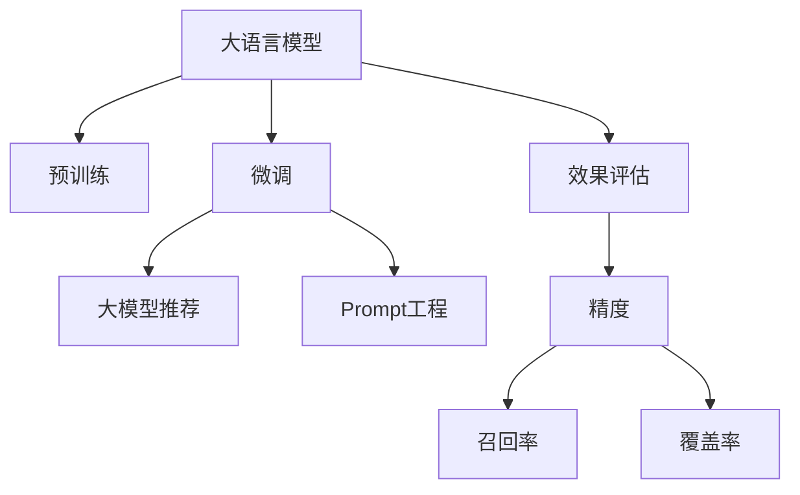

                 

## 1. 背景介绍

随着大语言模型(Large Language Models, LLMs)的迅速发展，推荐系统(Recommendation Systems)在电商、社交媒体、娱乐等领域的应用得到了极大的提升。通过将用户的行为与大模型的语言理解能力结合，推荐系统可以提供更加个性化、多样化的服务。在推荐领域，基于大模型的微调方法(BERT、GPT、ALBERT等)在文本生成、分类等任务上展示了卓越的性能，推动了推荐系统的发展。

然而，大模型微调存在一定的计算开销和参数更新风险，需要通过精心的Prompt工程来优化推荐效果，同时对微调效果进行全面评估，以确保推荐系统的性能和稳定性。

## 2. 核心概念与联系

### 2.1 核心概念概述

为了更好地理解基于大模型推荐中的Prompt工程与效果评估方法，本节将介绍几个密切相关的核心概念：

- 大语言模型(Large Language Model, LLM)：以自回归(如GPT)或自编码(如BERT)模型为代表的大规模预训练语言模型。通过在大规模无标签文本语料上进行预训练，学习通用的语言表示，具备强大的语言理解和生成能力。

- Prompt：也称为输入模板(Prompt Template)，是指在输入文本中添加的一组特殊标记或字符串，用于引导大语言模型进行特定任务推理。

- 大模型微调：指在预训练模型的基础上，使用下游任务的少量标注数据，通过有监督地训练优化模型在特定任务上的性能。

- 推荐系统：通过分析用户行为，推荐其可能感兴趣的产品、文章、内容等。推荐系统可以分为基于内容的推荐、协同过滤推荐、混合推荐等。

- 效果评估：通过一系列指标，如精度、召回率、覆盖率等，量化推荐系统的效果，评估其性能和优化方向。

这些核心概念之间的逻辑关系可以通过以下Mermaid流程图来展示：



这个流程图展示了大语言模型的核心概念及其之间的关系：

1. 大语言模型通过预训练获得基础能力。
2. 微调是对预训练模型进行任务特定的优化，可以通过有监督学习提升模型在特定任务上的表现。
3. 通过Prompt工程，可以进一步优化微调效果，实现更加精准的推荐。
4. 推荐系统应用微调后的模型进行推荐，提供个性化服务。
5. 效果评估对推荐系统进行量化分析，以优化推荐策略。

## 3. 核心算法原理 & 具体操作步骤

### 3.1 算法原理概述

基于大模型的推荐系统通常使用微调方法进行优化。其核心思想是：将大语言模型视作一个强大的"特征提取器"，通过在标注数据上进行有监督的微调，使得模型能够学习到用户行为与商品属性之间的映射关系。

形式化地，假设预训练模型为 $M_{\theta}$，其中 $\theta$ 为预训练得到的模型参数。给定推荐任务 $T$ 的标注数据集 $D=\{(x_i, y_i)\}_{i=1}^N$，推荐系统的优化目标是最小化损失函数：

$$
\mathcal{L}(\theta) = \frac{1}{N} \sum_{i=1}^N \ell(M_{\theta}(x_i),y_i)
$$

其中 $\ell$ 为推荐任务对应的损失函数，用于衡量模型预测输出与真实标签之间的差异。常见的损失函数包括交叉熵损失、均方误差损失等。

### 3.2 算法步骤详解

基于大模型的推荐系统微调一般包括以下几个关键步骤：

**Step 1: 准备预训练模型和数据集**
- 选择合适的预训练语言模型 $M_{\theta}$ 作为初始化参数，如 BERT、GPT等。
- 准备推荐任务 $T$ 的标注数据集 $D$，划分为训练集、验证集和测试集。一般要求标注数据与预训练数据的分布不要差异过大。

**Step 2: 设计Prompt模板**
- 根据推荐任务的特点，设计合适的Prompt模板，引导模型进行推荐预测。
- 对于二分类任务，Prompt模板可以设置为 [CLS] followed by [SEP]，其中 [CLS] 为模型起始标记，[SEP] 为模型结束标记。
- 对于多分类任务，Prompt模板可以设置为 [CLS] followed by [SEP]，其中 [CLS] 和 [SEP] 标记之间可添加类别标签，如 [CLS] item-1 [SEP] item-2 [SEP] item-3。

**Step 3: 微调模型**
- 使用标注数据集 $D$ 进行有监督的微调，优化模型参数 $\theta$。
- 根据推荐任务的特征，选择合适的损失函数 $\ell$，如交叉熵损失。
- 设置合适的学习率、批大小、迭代轮数等微调参数。

**Step 4: 评估推荐效果**
- 在测试集上评估微调后的模型 $M_{\hat{\theta}}$ 的推荐效果。
- 使用精度、召回率、覆盖率等指标进行效果评估。
- 根据评估结果调整Prompt模板和微调参数。

**Step 5: 部署应用**
- 使用微调后的模型进行推荐预测，集成到实际的应用系统中。
- 实时收集用户反馈，进一步优化推荐策略。

### 3.3 算法优缺点

基于大模型的推荐系统微调方法具有以下优点：
1. 简单高效。通过微调，可以将大模型快速适配到推荐任务，获得较大的性能提升。
2. 通用适用。适用于各种推荐场景，包括电商、社交媒体、内容推荐等，设计合适的Prompt模板即可实现。
3. 效果显著。在学术界和工业界的诸多任务上，基于微调的方法已经刷新了最先进的性能指标。

同时，该方法也存在一定的局限性：
1. 依赖标注数据。推荐任务的标注数据质量对微调效果影响较大，获取高质量标注数据的成本较高。
2. 模型复杂度大。预训练语言模型参数量巨大，微调时需要消耗大量计算资源。
3. 效果泛化性有限。当目标任务与预训练数据的分布差异较大时，微调的性能提升有限。
4. 可解释性不足。推荐系统的效果难以解释，难以对其内部工作机制进行分析和调试。

尽管存在这些局限性，但就目前而言，基于大模型的推荐系统微调方法仍然是最主流范式。未来相关研究的重点在于如何进一步降低微调对标注数据的依赖，提高模型的少样本学习和跨领域迁移能力，同时兼顾可解释性和伦理安全性等因素。

### 3.4 算法应用领域

基于大模型的推荐系统微调方法在电商推荐、内容推荐、社交媒体推荐等众多领域中得到了广泛的应用，以下是几个具体应用案例：

- 电商推荐：电商平台根据用户浏览、点击、购买等行为，推荐用户可能感兴趣的商品。使用微调后的模型，可以理解商品描述、用户评论等信息，生成高质量的推荐结果。
- 内容推荐：视频网站根据用户观看历史、评分、搜索记录等信息，推荐用户可能喜欢的视频内容。使用微调后的模型，可以学习视频特征和用户偏好，提供个性化内容推荐。
- 社交媒体推荐：社交平台根据用户互动、点赞、分享等行为，推荐用户可能感兴趣的内容。使用微调后的模型，可以捕捉用户间的社交关系，生成更加个性化、多样化的推荐内容。
- 智能客服推荐：智能客服系统根据用户的历史咨询记录，推荐合适的知识库文章或人工客服，提高客户满意度和服务效率。使用微调后的模型，可以理解用户咨询意图，生成智能回复。
- 金融投资推荐：金融平台根据用户的历史投资行为和市场数据，推荐可能受益的投资产品。使用微调后的模型，可以分析市场趋势，预测投资价值，提供精准推荐。

除了上述这些经典应用外，基于大模型的推荐系统还将在更多场景中得到应用，如健康推荐、旅游推荐、教育推荐等，为各行各业带来全新的推荐体验。

## 4. 数学模型和公式 & 详细讲解 & 举例说明

### 4.1 数学模型构建

本节将使用数学语言对基于大模型推荐系统微调过程进行更加严格的刻画。

记推荐任务的数据集为 $D=\{(x_i,y_i)\}_{i=1}^N, x_i \in \mathcal{X}, y_i \in \mathcal{Y}$，其中 $x_i$ 为输入特征，$y_i$ 为推荐目标。假设模型 $M_{\theta}$ 在输入 $x$ 上的输出为 $\hat{y}=M_{\theta}(x) \in \mathcal{Y}$，表示模型预测的推荐结果。

定义模型 $M_{\theta}$ 在数据样本 $(x,y)$ 上的损失函数为 $\ell(M_{\theta}(x),y)$，则在数据集 $D$ 上的经验风险为：

$$
\mathcal{L}(\theta) = \frac{1}{N} \sum_{i=1}^N \ell(M_{\theta}(x_i),y_i)
$$

其中 $\ell$ 为推荐任务对应的损失函数，用于衡量模型预测输出与真实标签之间的差异。常见的损失函数包括交叉熵损失、均方误差损失等。

### 4.2 公式推导过程

以交叉熵损失为例，推导其在推荐任务上的计算公式。

假设模型 $M_{\theta}$ 在输入 $x$ 上的输出为 $\hat{y}=M_{\theta}(x) \in \mathcal{Y}$，表示模型预测的推荐结果。真实标签 $y \in \mathcal{Y}$。则交叉熵损失函数定义为：

$$
\ell(M_{\theta}(x),y) = -y\log \hat{y} + (1-y)\log(1-\hat{y})
$$

将其代入经验风险公式，得：

$$
\mathcal{L}(\theta) = -\frac{1}{N}\sum_{i=1}^N [y_i\log M_{\theta}(x_i)+(1-y_i)\log(1-M_{\theta}(x_i))]
$$

在得到损失函数的梯度后，即可带入参数更新公式，完成模型的迭代优化。重复上述过程直至收敛，最终得到适应推荐任务的最优模型参数 $\theta^*$。

### 4.3 案例分析与讲解

以电商推荐为例，说明如何通过微调和Prompt工程实现高质量的推荐。

假设电商平台有10种商品，每种商品有一个文本描述，以及对应的用户评分。可以收集用户点击商品链接、搜索商品关键词、评分商品等行为数据，作为微调的标注数据集 $D$。

首先，设计Prompt模板，使用如下格式的输入：

```
I would like to buy a [CLS] followed by [SEP] product with description "[DESC]" and rating "[RAT]".
```

其中 [CLS] 和 [SEP] 为模型标记，[DESC] 和 [RAT] 为输入特征。在训练时，将用户行为数据输入到模型中，通过前向传播计算预测推荐结果，并计算交叉熵损失。反向传播更新模型参数 $\theta$。

经过多次迭代后，模型能够学习到商品描述、评分等特征与用户行为之间的关系，预测用户可能感兴趣的商品。在实际应用中，对于新用户或新商品，模型可以根据其输入特征生成推荐结果，实现冷启动和物品推荐。

## 5. 项目实践：代码实例和详细解释说明

### 5.1 开发环境搭建

在进行微调实践前，我们需要准备好开发环境。以下是使用Python进行PyTorch开发的环境配置流程：

1. 安装Anaconda：从官网下载并安装Anaconda，用于创建独立的Python环境。

2. 创建并激活虚拟环境：
```bash
conda create -n pytorch-env python=3.8 
conda activate pytorch-env
```

3. 安装PyTorch：根据CUDA版本，从官网获取对应的安装命令。例如：
```bash
conda install pytorch torchvision torchaudio cudatoolkit=11.1 -c pytorch -c conda-forge
```

4. 安装Transformers库：
```bash
pip install transformers
```

5. 安装各类工具包：
```bash
pip install numpy pandas scikit-learn matplotlib tqdm jupyter notebook ipython
```

完成上述步骤后，即可在`pytorch-env`环境中开始微调实践。

### 5.2 源代码详细实现

下面我们以电商推荐为例，给出使用Transformers库对BERT模型进行微调的PyTorch代码实现。

首先，定义推荐任务的数据处理函数：

```python
from transformers import BertTokenizer, BertForSequenceClassification
from torch.utils.data import Dataset
import torch

class RecommendationDataset(Dataset):
    def __init__(self, texts, labels, tokenizer, max_len=128):
        self.texts = texts
        self.labels = labels
        self.tokenizer = tokenizer
        self.max_len = max_len
        
    def __len__(self):
        return len(self.texts)
    
    def __getitem__(self, item):
        text = self.texts[item]
        label = self.labels[item]
        
        encoding = self.tokenizer(text, return_tensors='pt', max_length=self.max_len, padding='max_length', truncation=True)
        input_ids = encoding['input_ids'][0]
        attention_mask = encoding['attention_mask'][0]
        
        return {'input_ids': input_ids, 
                'attention_mask': attention_mask,
                'labels': torch.tensor(label, dtype=torch.long)}
```

然后，定义模型和优化器：

```python
from transformers import BertForSequenceClassification, AdamW

model = BertForSequenceClassification.from_pretrained('bert-base-cased', num_labels=10)

optimizer = AdamW(model.parameters(), lr=2e-5)
```

接着，定义训练和评估函数：

```python
from torch.utils.data import DataLoader
from tqdm import tqdm
from sklearn.metrics import accuracy_score, precision_score, recall_score, f1_score

device = torch.device('cuda') if torch.cuda.is_available() else torch.device('cpu')
model.to(device)

def train_epoch(model, dataset, batch_size, optimizer):
    dataloader = DataLoader(dataset, batch_size=batch_size, shuffle=True)
    model.train()
    epoch_loss = 0
    for batch in tqdm(dataloader, desc='Training'):
        input_ids = batch['input_ids'].to(device)
        attention_mask = batch['attention_mask'].to(device)
        labels = batch['labels'].to(device)
        model.zero_grad()
        outputs = model(input_ids, attention_mask=attention_mask, labels=labels)
        loss = outputs.loss
        epoch_loss += loss.item()
        loss.backward()
        optimizer.step()
    return epoch_loss / len(dataloader)

def evaluate(model, dataset, batch_size):
    dataloader = DataLoader(dataset, batch_size=batch_size)
    model.eval()
    preds, labels = [], []
    with torch.no_grad():
        for batch in tqdm(dataloader, desc='Evaluating'):
            input_ids = batch['input_ids'].to(device)
            attention_mask = batch['attention_mask'].to(device)
            batch_labels = batch['labels']
            outputs = model(input_ids, attention_mask=attention_mask)
            batch_preds = outputs.logits.argmax(dim=2).to('cpu').tolist()
            batch_labels = batch_labels.to('cpu').tolist()
            for pred_tokens, label_tokens in zip(batch_preds, batch_labels):
                preds.append(pred_tokens)
                labels.append(label_tokens)
                
    print(f'Precision: {precision_score(labels, preds, average="macro"):.3f}')
    print(f'Recall: {recall_score(labels, preds, average="macro"):.3f}')
    print(f'F1-Score: {f1_score(labels, preds, average="macro"):.3f}')
```

最后，启动训练流程并在测试集上评估：

```python
epochs = 5
batch_size = 16

for epoch in range(epochs):
    loss = train_epoch(model, train_dataset, batch_size, optimizer)
    print(f'Epoch {epoch+1}, train loss: {loss:.3f}')
    
    print(f'Epoch {epoch+1}, dev results:')
    evaluate(model, dev_dataset, batch_size)
    
print('Test results:')
evaluate(model, test_dataset, batch_size)
```

以上就是使用PyTorch对BERT进行电商推荐任务微调的完整代码实现。可以看到，得益于Transformers库的强大封装，我们可以用相对简洁的代码完成BERT模型的加载和微调。

### 5.3 代码解读与分析

让我们再详细解读一下关键代码的实现细节：

**RecommendationDataset类**：
- `__init__`方法：初始化文本、标签、分词器等关键组件。
- `__len__`方法：返回数据集的样本数量。
- `__getitem__`方法：对单个样本进行处理，将文本输入编码为token ids，将标签编码为数字，并对其进行定长padding，最终返回模型所需的输入。

**Prompt模板设计**：
- 设计合适的Prompt模板，用于引导模型进行推荐预测。
- 在模型输入中，将商品描述、评分等特征作为输入，输出为推荐结果。

**模型和优化器定义**：
- 使用BertForSequenceClassification从预训练模型加载，设置学习率等优化器参数。
- 将模型迁移到GPU上，加快训练速度。

**训练和评估函数**：
- 使用PyTorch的DataLoader对数据集进行批次化加载，供模型训练和推理使用。
- 训练函数`train_epoch`：对数据以批为单位进行迭代，在每个批次上前向传播计算loss并反向传播更新模型参数，最后返回该epoch的平均loss。
- 评估函数`evaluate`：与训练类似，不同点在于不更新模型参数，并在每个batch结束后将预测和标签结果存储下来，最后使用sklearn的precision、recall、f1等指标对整个评估集的预测结果进行打印输出。

**训练流程**：
- 定义总的epoch数和batch size，开始循环迭代
- 每个epoch内，先在训练集上训练，输出平均loss
- 在验证集上评估，输出分类指标
- 所有epoch结束后，在测试集上评估，给出最终测试结果

可以看到，PyTorch配合Transformers库使得BERT微调的代码实现变得简洁高效。开发者可以将更多精力放在数据处理、模型改进等高层逻辑上，而不必过多关注底层的实现细节。

当然，工业级的系统实现还需考虑更多因素，如模型的保存和部署、超参数的自动搜索、更灵活的任务适配层等。但核心的微调范式基本与此类似。

## 6. 实际应用场景

### 6.1 智能客服推荐

基于大语言模型的推荐系统，可以广泛应用于智能客服推荐系统的构建。传统客服推荐系统往往需要配备大量专家知识库，维护成本高且难以保证推荐结果的质量。使用微调后的推荐模型，可以根据用户的历史咨询记录，推荐合适的知识库文章或人工客服，提升客户咨询体验。

在技术实现上，可以收集用户的历史咨询记录，使用文本分类等任务进行微调，学习用户咨询意图与知识库文章或人工客服之间的映射关系。微调后的模型可以自动匹配用户咨询记录，推荐最相关的知识库文章或人工客服，从而提高客户满意度和问题解决效率。

### 6.2 内容推荐

内容推荐系统通过分析用户行为，推荐其可能感兴趣的内容。基于大语言模型的推荐系统可以更全面地理解用户需求，提供更加个性化、多样化的推荐结果。

在电商平台上，可以通过微调模型学习商品描述、用户评分等信息，推荐用户可能感兴趣的商品。在视频网站中，可以通过微调模型学习视频标题、内容等信息，推荐用户可能喜欢的视频内容。在新闻网站中，可以通过微调模型学习新闻标题、摘要等信息，推荐用户可能感兴趣的新闻文章。

### 6.3 社交媒体推荐

社交媒体推荐系统通过分析用户互动、点赞、分享等行为，推荐用户可能感兴趣的内容。使用微调后的推荐模型，可以捕捉用户间的社交关系，生成更加个性化、多样化的推荐内容。

在社交平台上，可以通过微调模型学习用户互动信息，推荐用户可能感兴趣的朋友、内容、话题等。在新闻平台上，可以通过微调模型学习用户点赞、评论等信息，推荐用户可能感兴趣的新闻文章、话题等。在社交平台上，可以通过微调模型学习用户互动信息，推荐用户可能感兴趣的朋友、内容、话题等。

### 6.4 未来应用展望

随着大语言模型微调技术的发展，推荐系统将在更多领域得到应用，为各行各业带来变革性影响。

在智慧医疗领域，基于大语言模型微调的医疗推荐系统，可以为患者推荐合适的医疗资源，帮助医生进行精准诊疗，提升医疗服务质量。在金融领域，基于大语言模型微调的金融推荐系统，可以为投资者推荐有潜力的投资产品，帮助其做出明智的投资决策。在教育领域，基于大语言模型微调的教育推荐系统，可以为学生推荐合适的学习资源，帮助其提高学习效率。

此外，在智能家居、智慧农业、智能交通等众多领域，基于大语言模型微调的推荐系统也将得到广泛应用，为各行各业带来更高效、便捷、智能的服务。

## 7. 工具和资源推荐

### 7.1 学习资源推荐

为了帮助开发者系统掌握大语言模型推荐中的Prompt工程与效果评估的理论基础和实践技巧，这里推荐一些优质的学习资源：

1. 《Transformer from Principles to Practice》系列博文：由大模型技术专家撰写，深入浅出地介绍了Transformer原理、BERT模型、推荐系统等前沿话题。

2. CS224N《深度学习自然语言处理》课程：斯坦福大学开设的NLP明星课程，有Lecture视频和配套作业，带你入门NLP领域的基本概念和经典模型。

3. 《Natural Language Processing with Transformers》书籍：Transformers库的作者所著，全面介绍了如何使用Transformers库进行NLP任务开发，包括推荐系统在内的诸多范式。

4. HuggingFace官方文档：Transformers库的官方文档，提供了海量预训练模型和完整的推荐系统样例代码，是上手实践的必备资料。

5. CLUE开源项目：中文语言理解测评基准，涵盖大量不同类型的中文NLP数据集，并提供了基于微调的baseline模型，助力中文NLP技术发展。

通过对这些资源的学习实践，相信你一定能够快速掌握大语言模型推荐中的Prompt工程与效果评估的精髓，并用于解决实际的推荐问题。

### 7.2 开发工具推荐

高效的开发离不开优秀的工具支持。以下是几款用于大语言模型推荐系统微调开发的常用工具：

1. PyTorch：基于Python的开源深度学习框架，灵活动态的计算图，适合快速迭代研究。大部分预训练语言模型都有PyTorch版本的实现。

2. TensorFlow：由Google主导开发的开源深度学习框架，生产部署方便，适合大规模工程应用。同样有丰富的预训练语言模型资源。

3. Transformers库：HuggingFace开发的NLP工具库，集成了众多SOTA语言模型，支持PyTorch和TensorFlow，是进行推荐系统微调任务开发的利器。

4. Weights & Biases：模型训练的实验跟踪工具，可以记录和可视化模型训练过程中的各项指标，方便对比和调优。与主流深度学习框架无缝集成。

5. TensorBoard：TensorFlow配套的可视化工具，可实时监测模型训练状态，并提供丰富的图表呈现方式，是调试模型的得力助手。

6. Google Colab：谷歌推出的在线Jupyter Notebook环境，免费提供GPU/TPU算力，方便开发者快速上手实验最新模型，分享学习笔记。

合理利用这些工具，可以显著提升大语言模型推荐系统微调的开发效率，加快创新迭代的步伐。

### 7.3 相关论文推荐

大语言模型和推荐系统的发展源于学界的持续研究。以下是几篇奠基性的相关论文，推荐阅读：

1. Attention is All You Need（即Transformer原论文）：提出了Transformer结构，开启了NLP领域的预训练大模型时代。

2. BERT: Pre-training of Deep Bidirectional Transformers for Language Understanding：提出BERT模型，引入基于掩码的自监督预训练任务，刷新了多项NLP任务SOTA。

3. Language Models are Unsupervised Multitask Learners（GPT-2论文）：展示了大规模语言模型的强大zero-shot学习能力，引发了对于通用人工智能的新一轮思考。

4. Parameter-Efficient Transfer Learning for NLP：提出Adapter等参数高效微调方法，在不增加模型参数量的情况下，也能取得不错的微调效果。

5. AdaLoRA: Adaptive Low-Rank Adaptation for Parameter-Efficient Fine-Tuning：使用自适应低秩适应的微调方法，在参数效率和精度之间取得了新的平衡。

6. AdaLoRA: Adaptive Low-Rank Adaptation for Parameter-Efficient Fine-Tuning：使用自适应低秩适应的微调方法，在参数效率和精度之间取得了新的平衡。

这些论文代表了大语言模型微调和推荐系统的最新进展。通过学习这些前沿成果，可以帮助研究者把握学科前进方向，激发更多的创新灵感。

## 8. 总结：未来发展趋势与挑战

### 8.1 总结

本文对基于大语言模型推荐中的Prompt工程与效果评估方法进行了全面系统的介绍。首先阐述了大语言模型推荐的核心概念和背景，明确了微调在推荐系统优化中的重要地位。其次，从原理到实践，详细讲解了推荐系统微调的数学模型和关键步骤，给出了微调任务开发的完整代码实例。同时，本文还广泛探讨了微调方法在电商、内容、社交媒体等推荐系统中的应用前景，展示了微调范式的巨大潜力。最后，本文精选了微调技术的各类学习资源，力求为读者提供全方位的技术指引。

通过本文的系统梳理，可以看到，基于大语言模型的推荐系统微调方法在推荐领域具有广泛的应用前景，可以显著提升推荐系统的性能和效果。未来，伴随微调技术的持续演进，推荐系统必将在更多领域大放异彩，为各行各业带来更加智能、个性化的服务。

### 8.2 未来发展趋势

展望未来，大语言模型推荐系统微调技术将呈现以下几个发展趋势：

1. 模型规模持续增大。随着算力成本的下降和数据规模的扩张，预训练语言模型的参数量还将持续增长。超大规模语言模型蕴含的丰富语言知识，有望支撑更加复杂多变的推荐任务微调。

2. 推荐系统多样化。除了传统的基于内容的推荐、协同过滤推荐，未来还会涌现更多基于知识图谱、深度强化学习的推荐方法，实现更加精准、灵活的推荐。

3. 效果评估多样化。除了常用的精度、召回率、覆盖率等指标，未来还会引入更多高级评估方法，如公平性评估、推荐系统鲁棒性评估等，确保推荐系统的公平性、鲁棒性和可解释性。

4. Prompt工程复杂化。未来将引入更多先进的Prompt模板设计方法，如变长Prompt、多级Prompt等，进一步提升模型的推荐能力。

5. 多模态推荐兴起。当前的推荐系统主要以文本数据为主，未来将融合图像、视频、语音等多模态信息，实现更全面的推荐。

6. 个性化推荐深化。未来推荐系统将更加注重用户行为建模，结合上下文信息，实现更加精准、个性化的推荐。

以上趋势凸显了大语言模型推荐系统微调技术的广阔前景。这些方向的探索发展，必将进一步提升推荐系统的性能和应用范围，为各行各业带来更加智能、个性化的服务。

### 8.3 面临的挑战

尽管大语言模型推荐系统微调方法已经取得了瞩目成就，但在迈向更加智能化、普适化应用的过程中，它仍面临着诸多挑战：

1. 标注数据成本高。推荐任务的标注数据质量对微调效果影响较大，获取高质量标注数据的成本较高。如何降低微调对标注数据的依赖，是未来研究的重要方向。

2. 模型鲁棒性不足。当前推荐系统面对域外数据时，泛化性能往往大打折扣。对于测试样本的微小扰动，推荐系统的预测也容易发生波动。如何提高推荐系统的鲁棒性，避免灾难性遗忘，还需要更多理论和实践的积累。

3. 推荐效率有待提高。大规模语言模型虽然精度高，但在实际部署时往往面临推理速度慢、内存占用大等效率问题。如何在保证性能的同时，简化模型结构，提升推理速度，优化资源占用，将是重要的优化方向。

4. 可解释性不足。推荐系统的推荐结果难以解释，难以对其内部工作机制进行分析和调试。对于医疗、金融等高风险应用，算法的可解释性和可审计性尤为重要。如何赋予推荐系统更强的可解释性，将是亟待攻克的难题。

5. 安全性有待保障。推荐系统可能通过微调模型学习到有害信息，产生误导性、歧视性的推荐结果，给实际应用带来安全隐患。如何从数据和算法层面消除模型偏见，避免恶意用途，确保推荐系统的安全性，也将是重要的研究课题。

6. 知识整合能力不足。现有的推荐系统往往局限于任务内数据，难以灵活吸收和运用更广泛的先验知识。如何让推荐系统更好地与外部知识库、规则库等专家知识结合，形成更加全面、准确的信息整合能力，还有很大的想象空间。

正视推荐系统面临的这些挑战，积极应对并寻求突破，将是大语言模型推荐系统微调走向成熟的必由之路。相信随着学界和产业界的共同努力，这些挑战终将一一被克服，大语言模型推荐系统微调必将在构建人机协同的智能推荐系统方面发挥更大作用。

### 8.4 研究展望

未来的研究需要在以下几个方面寻求新的突破：

1. 探索无监督和半监督推荐方法。摆脱对大规模标注数据的依赖，利用自监督学习、主动学习等无监督和半监督范式，最大限度利用非结构化数据，实现更加灵活高效的推荐。

2. 研究参数高效和计算高效的推荐范式。开发更加参数高效的推荐方法，在固定大部分预训练参数的同时，只更新极少量的推荐相关参数。同时优化推荐系统的计算图，减少前向传播和反向传播的资源消耗，实现更加轻量级、实时性的部署。

3. 融合因果和对比学习范式。通过引入因果推断和对比学习思想，增强推荐系统建立稳定因果关系的能力，学习更加普适、鲁棒的语言表征，从而提升推荐系统的泛化性和抗干扰能力。

4. 引入更多先验知识。将符号化的先验知识，如知识图谱、逻辑规则等，与神经网络模型进行巧妙融合，引导推荐系统学习更准确、合理的语言模型。同时加强不同模态数据的整合，实现视觉、语音等多模态信息与文本信息的协同建模。

5. 结合因果分析和博弈论工具。将因果分析方法引入推荐系统，识别出推荐系统的关键特征，增强推荐结果的因果性和逻辑性。借助博弈论工具刻画人机交互过程，主动探索并规避推荐系统的脆弱点，提高系统稳定性。

6. 纳入伦理道德约束。在推荐系统训练目标中引入伦理导向的评估指标，过滤和惩罚有偏见、有害的推荐结果。同时加强人工干预和审核，建立推荐系统的监管机制，确保推荐结果符合人类价值观和伦理道德。

这些研究方向的探索，必将引领大语言模型推荐系统微调技术迈向更高的台阶，为构建安全、可靠、可解释、可控的智能推荐系统铺平道路。面向未来，大语言模型推荐系统微调技术还需要与其他人工智能技术进行更深入的融合，如知识表示、因果推理、强化学习等，多路径协同发力，共同推动推荐系统的发展。只有勇于创新、敢于突破，才能不断拓展推荐系统的边界，让智能推荐更好地服务于人类社会。

## 9. 附录：常见问题与解答

**Q1：大语言模型推荐是否适用于所有推荐场景？**

A: 大语言模型推荐在大多数推荐场景上都能取得不错的效果，特别是对于数据量较小的任务。但对于一些特定领域的任务，如金融、医疗等，仅仅依靠通用语料预训练的模型可能难以很好地适应。此时需要在特定领域语料上进一步预训练，再进行微调，才能获得理想效果。

**Q2：推荐系统如何选择合适的Prompt模板？**

A: 推荐系统中的Prompt模板设计需要根据具体任务和数据特点进行精心设计。常见的Prompt模板设计方法包括：
1. 问题格式：将推荐任务转化为自然语言问题，如"推荐一个合适的产品"。
2. 文本格式：将推荐任务转化为文本格式，如"[CLS] followed by [SEP] 产品推荐"。
3. 列表格式：将推荐任务转化为列表格式，如"[CLS] followed by [SEP] 产品推荐，产品2，产品3"。

设计合适的Prompt模板，可以提高推荐系统的准确性和灵活性。一般而言，使用问题格式的Prompt模板效果较好，但在多分类任务中，使用列表格式的Prompt模板可能更合适。

**Q3：推荐系统如何评估效果？**

A: 推荐系统的效果评估通常使用以下几个指标：
1. 精度：推荐结果与真实标签的匹配度，计算方式为TP / (TP + FP)。
2. 召回率：真实标签在推荐结果中出现的比例，计算方式为TP / (TP + FN)。
3. 覆盖率：推荐结果覆盖真实标签的比例，计算方式为TP / N。
4. 平均精度均值（MAP）：平均精确度的均值，考虑了不同标签的重要性。
5. 均方根误差（RMSE）：推荐结果与真实标签之间的差异度量，适用于回归任务。

在实际应用中，可以根据具体任务选择合适的评估指标。一般而言，精度和召回率是推荐系统的核心指标，而平均精度均值和均方根误差则更加适合用于复杂的推荐任务。

**Q4：推荐系统如何应对数据变化？**

A: 推荐系统需要定期重新微调和优化，以应对数据分布的变化。具体方法包括：
1. 定期重训：在数据分布发生变化时，重新训练推荐模型。
2. 增量学习：根据新的数据样本进行在线学习，更新推荐模型。
3. 主动学习：从无标签数据中主动选择样本进行学习，更新推荐模型。
4. 模型更新：引入新的先验知识或参数调整策略，优化推荐模型。

合理应对数据变化，是推荐系统保持高性能和稳定性的关键。

**Q5：推荐系统如何保护用户隐私？**

A: 推荐系统需要考虑用户隐私保护，通常采用以下方法：
1. 匿名化：对用户行为进行匿名化处理，保护用户隐私。
2. 数据脱敏：对敏感数据进行脱敏处理，防止数据泄露。
3. 差分隐私：在数据收集和处理过程中，添加噪声，保护用户隐私。
4. 用户控制：让用户能够控制自己的数据使用范围和方式，保护用户隐私。

推荐系统需要在保护用户隐私和提供个性化服务之间寻找平衡，确保用户数据的安全性和隐私性。

---

作者：禅与计算机程序设计艺术 / Zen and the Art of Computer Programming

