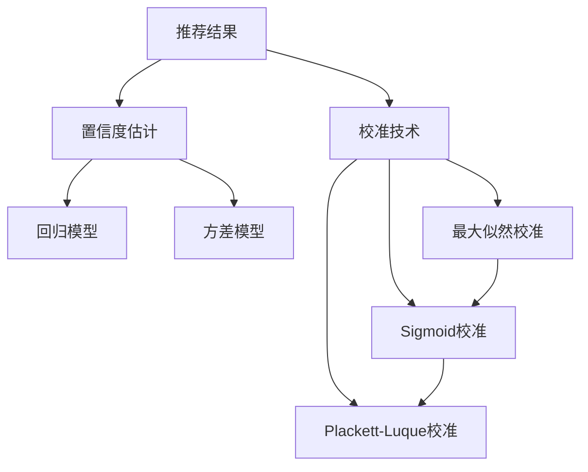

                 

# 大模型推荐中的推荐结果置信度估计与校准技术

> 关键词：推荐系统,推荐结果,置信度估计,校准技术,推荐结果不确定性,均方误差,方差最小化

## 1. 背景介绍

推荐系统已经成为现代互联网平台不可或缺的一部分，广泛应用在电商、新闻、社交媒体等场景中。传统推荐算法如协同过滤、基于内容的推荐等，依赖于用户行为数据或物品属性信息，存在冷启动、稀疏性等难题。为此，近年来深度学习技术在推荐领域得到广泛应用，大模型在推荐系统中的应用尤为突出。

然而，大模型的推荐结果通常存在较大的不确定性，如何评估和校准推荐结果的置信度，成为了推荐系统研究的重点问题。推荐结果置信度估计和校准技术可以有效地提升推荐系统的效果和用户体验，为用户推荐更加可靠和满意的物品。本文将全面探讨推荐结果置信度估计与校准技术的原理、方法及其应用，为推荐系统开发者提供科学的方法论指导。

## 2. 核心概念与联系

### 2.1 核心概念概述

推荐结果置信度估计与校准技术是推荐系统研究的重要分支。在深度学习推荐系统中，通常使用大模型如DNN、RNN、Transformer等对用户行为数据或物品特征进行拟合，得到用户对物品的评分或点击概率预测值。由于大模型的复杂性和随机性，推荐结果具有一定的噪声和不确定性，需要通过置信度估计和校准技术来降低这种不确定性，提升推荐的准确性和可信度。

具体来说，推荐结果置信度估计与校准技术的核心目标是通过对推荐结果的不确定性进行量化和调整，使得模型输出的预测值更加接近真实值，提高推荐的精准性和可靠性。常用的方法包括：

1. **置信度估计**：通过回归模型或方差模型，估计推荐结果的不确定性。常用的回归模型包括均方误差(MSE)回归、平均绝对误差(MAE)回归等，常用的方差模型包括贝叶斯回归、置信区间回归等。

2. **校准技术**：通过优化损失函数，使得模型输出的预测值更加接近真实值，降低推荐结果的置信度估计偏差。常用的校准方法包括最大似然校准、Sigmoid校准、Plackett-Luque校准等。

这些核心概念之间的逻辑关系可以通过以下Mermaid流程图来展示：



这个流程图展示了推荐结果置信度估计与校准技术的基本流程：

1. 推荐结果的置信度估计通过回归模型或方差模型进行。
2. 回归模型使用均方误差、平均绝对误差等进行预测值与真实值之间的距离度量。
3. 方差模型通过贝叶斯回归等进行预测值置信区间的计算。
4. 校准技术通过最大似然校准、Sigmoid校准、Plackett-Luque校准等方法，优化预测值和真实值之间的距离度量，从而提升推荐结果的准确性。

## 3. 核心算法原理 & 具体操作步骤
### 3.1 算法原理概述

推荐结果置信度估计与校准技术的核心思想是通过回归模型或方差模型，对推荐结果的不确定性进行量化，并通过校准技术对预测值进行调整，使得预测值更加接近真实值。具体而言，假设推荐系统模型对物品$i$的预测评分(点击概率)为$\hat{y}_i$，真实评分为$y_i$，推荐结果的置信度估计和校准技术如下：

1. **置信度估计**：通过回归模型估计推荐结果的不确定性，假设回归模型为$\epsilon(\hat{y}_i, y_i) = \hat{y}_i - y_i$，回归损失函数为$L$，最小化回归损失函数：

   $$
   \min_{\theta} \mathbb{E}[L(\hat{y}_i - y_i)]
   $$

   其中$\theta$为回归模型的参数。

2. **校准技术**：通过优化校准损失函数，使得预测值更加接近真实值。假设校准损失函数为$L_{\text{cal}}(\hat{y}_i, y_i)$，最小化校准损失函数：

   $$
   \min_{\theta} \mathbb{E}[L_{\text{cal}}(\hat{y}_i, y_i)]
   $$

   其中$\theta$为校准模型的参数。

3. **置信度估计和校准的联合优化**：通常将置信度估计和校准技术进行联合优化，最小化整体损失函数：

   $$
   \min_{\theta} \mathbb{E}[L(\hat{y}_i - y_i) + \lambda L_{\text{cal}}(\hat{y}_i, y_i)]
   $$

   其中$\lambda$为置信度估计和校准的权重平衡参数。

### 3.2 算法步骤详解

推荐结果置信度估计与校准技术的实现通常包括以下几个关键步骤：

**Step 1: 数据准备**
- 收集推荐系统的训练数据，包含用户对物品的评分或点击数据。
- 对数据进行标准化处理，如归一化、特征工程等。

**Step 2: 回归模型选择**
- 选择合适的回归模型，如线性回归、多项式回归、深度回归等。
- 使用回归模型对训练数据进行拟合，得到回归模型的参数。

**Step 3: 方差模型选择**
- 选择合适的方差模型，如贝叶斯回归、置信区间回归等。
- 使用方差模型对训练数据进行拟合，得到方差模型的参数。

**Step 4: 校准方法选择**
- 选择合适的校准方法，如最大似然校准、Sigmoid校准、Plackett-Luque校准等。
- 使用校准方法对训练数据进行拟合，得到校准模型的参数。

**Step 5: 置信度估计和校准的联合优化**
- 将回归模型和方差模型输出的不确定性，与校准模型输出的修正因子进行联合优化。
- 最小化整体损失函数，得到优化后的回归模型和校准模型参数。

**Step 6: 推荐结果输出**
- 对测试数据集进行预测，得到置信度估计和校准后的推荐结果。
- 根据推荐结果的不确定性，选择合适的推荐策略，如顶k推荐、基于置信度的推荐等。

### 3.3 算法优缺点

推荐结果置信度估计与校准技术具有以下优点：
1. 降低推荐结果的不确定性。通过对推荐结果进行置信度估计和校准，可以有效降低推荐结果的噪声和偏差，提升推荐准确性。
2. 提高推荐系统的可靠性。通过置信度估计和校准技术，可以使推荐系统对极端用户或物品更具鲁棒性，减少因异常值导致的推荐错误。
3. 优化推荐策略。通过置信度估计和校准，可以更好地选择推荐策略，如基于置信度的推荐、模型融合等。

同时，该方法也存在一定的局限性：
1. 计算复杂度较高。置信度估计和校准技术通常需要额外的计算资源和时间，影响推荐系统的实时性。
2. 对数据质量要求较高。回归模型和校准方法的有效性依赖于高质量的数据集，数据噪声和异常值可能导致估计和校准效果不佳。
3. 模型复杂度增加。加入置信度估计和校准技术后，模型的复杂度增加，可能需要更多的计算资源进行训练和优化。

尽管存在这些局限性，但通过合理选择模型和参数，以及有效的数据处理，推荐结果置信度估计与校准技术仍然是一种非常有效的推荐方法，能够在保证推荐系统实时性的同时，提升推荐的精准性和可靠性。

### 3.4 算法应用领域

推荐结果置信度估计与校准技术在推荐系统领域有广泛的应用，具体如下：

1. **电商推荐系统**：电商推荐系统需要根据用户的购买历史和浏览行为，推荐相应的商品。置信度估计和校准技术可以有效降低推荐结果的不确定性，提升推荐系统的效果和用户体验。

2. **新闻推荐系统**：新闻推荐系统需要根据用户的阅读历史和兴趣标签，推荐相应的新闻文章。通过置信度估计和校准技术，可以更好地处理用户兴趣的变化和新闻内容的波动。

3. **社交媒体推荐系统**：社交媒体推荐系统需要根据用户的互动行为，推荐相应的内容。置信度估计和校准技术可以有效提升推荐系统的多样性和个性化。

4. **视频推荐系统**：视频推荐系统需要根据用户的观看历史和评分数据，推荐相应的视频内容。置信度估计和校准技术可以有效处理视频内容的动态性和用户偏好的多样性。

5. **金融推荐系统**：金融推荐系统需要根据用户的投资历史和行为数据，推荐相应的理财产品。置信度估计和校准技术可以有效降低推荐结果的不确定性，提升理财产品的推荐效果。

综上所述，推荐结果置信度估计与校准技术在推荐系统领域具有广泛的应用前景，可以显著提升推荐系统的效果和用户体验。

## 4. 数学模型和公式 & 详细讲解  
### 4.1 数学模型构建

推荐结果置信度估计与校准技术可以通过数学模型进行形式化的描述。假设推荐系统模型对物品$i$的预测评分(点击概率)为$\hat{y}_i$，真实评分为$y_i$，回归模型输出的不确定性为$\sigma_i$，校准模型输出的修正因子为$f_i$。假设回归模型为线性回归，方差模型为贝叶斯回归，校准方法为最大似然校准，则数学模型如下：

1. **回归模型**：
   $$
   \hat{y}_i = \theta^T X_i
   $$
   其中$\theta$为回归模型的参数，$X_i$为物品$i$的特征向量。

2. **方差模型**：
   $$
   \sigma_i = \sigma_0 \exp(\phi^T X_i)
   $$
   其中$\sigma_0$为基线方差，$\phi$为方差模型的参数，$X_i$为物品$i$的特征向量。

3. **校准模型**：
   $$
   f_i = \frac{1}{1 + \exp(-\alpha^T X_i)}
   $$
   其中$\alpha$为校准模型的参数，$X_i$为物品$i$的特征向量。

4. **整体损失函数**：
   $$
   L = \frac{1}{N}\sum_{i=1}^N (\hat{y}_i - y_i)^2 + \lambda \mathbb{E}[\log(\frac{1}{1 + \exp(-\alpha^T X_i)} - \frac{1}{1 + \exp(-\alpha^T X_i)})
   $$

### 4.2 公式推导过程

以下我们以线性回归为例，推导回归模型的回归损失函数及其梯度计算公式。

假设回归模型为线性回归，预测值为：
$$
\hat{y}_i = \theta^T X_i
$$

其中$\theta$为回归模型的参数，$X_i$为物品$i$的特征向量。回归损失函数为均方误差，定义如下：
$$
L(\theta) = \frac{1}{N}\sum_{i=1}^N (\hat{y}_i - y_i)^2
$$

其中$N$为样本数量，$y_i$为物品$i$的真实评分。

根据梯度下降算法，回归模型的梯度计算公式为：
$$
\nabla_{\theta} L(\theta) = \frac{2}{N}\sum_{i=1}^N (X_i \cdot (\hat{y}_i - y_i))
$$

根据回归模型的求解过程，可以得到回归模型的参数$\theta$。

### 4.3 案例分析与讲解

**案例1：电商推荐系统**

电商推荐系统需要根据用户的购买历史和浏览行为，推荐相应的商品。通常使用深度神经网络对用户行为进行拟合，得到用户对商品的评分或点击概率预测值。通过回归模型和校准技术，可以有效地降低推荐结果的不确定性，提升推荐效果。

具体而言，可以使用深度神经网络对用户行为数据进行拟合，得到用户对商品的预测评分。通过回归模型计算预测评分的不确定性，使用最大似然校准对预测评分进行校准。最终，通过回归模型和校准技术输出的推荐结果，进行基于置信度的推荐。

**案例2：视频推荐系统**

视频推荐系统需要根据用户的观看历史和评分数据，推荐相应的视频内容。由于视频内容的多样性和动态性，推荐结果的不确定性较大。通过置信度估计和校准技术，可以有效处理视频内容的动态性和用户偏好的多样性。

具体而言，可以使用深度神经网络对用户行为数据进行拟合，得到用户对视频的预测评分。通过方差模型计算预测评分的不确定性，使用Sigmoid校准对预测评分进行校准。最终，通过回归模型和校准技术输出的推荐结果，进行基于置信度的推荐。

## 5. 项目实践：代码实例和详细解释说明
### 5.1 开发环境搭建

在进行推荐结果置信度估计与校准实践前，我们需要准备好开发环境。以下是使用Python进行TensorFlow开发的环境配置流程：

1. 安装Anaconda：从官网下载并安装Anaconda，用于创建独立的Python环境。

2. 创建并激活虚拟环境：
```bash
conda create -n tf-env python=3.8 
conda activate tf-env
```

3. 安装TensorFlow：根据CUDA版本，从官网获取对应的安装命令。例如：
```bash
conda install tensorflow=2.8
```

4. 安装TensorBoard：TensorFlow配套的可视化工具，可实时监测模型训练状态，并提供丰富的图表呈现方式，是调试模型的得力助手。

5. 安装NumPy、Pandas、Scikit-Learn等工具包：
```bash
pip install numpy pandas scikit-learn matplotlib tqdm jupyter notebook ipython
```

完成上述步骤后，即可在`tf-env`环境中开始推荐结果置信度估计与校准实践。

### 5.2 源代码详细实现

下面以电商推荐系统为例，给出使用TensorFlow进行推荐结果置信度估计与校准的Python代码实现。

首先，定义回归模型：

```python
import tensorflow as tf
import numpy as np

# 定义回归模型
class Regressor(tf.keras.Model):
    def __init__(self, input_dim):
        super(Regressor, self).__init__()
        self.fc1 = tf.keras.layers.Dense(128, activation='relu', input_shape=(input_dim,))
        self.fc2 = tf.keras.layers.Dense(1, activation='linear')
        
    def call(self, x):
        x = self.fc1(x)
        x = self.fc2(x)
        return x
```

然后，定义方差模型：

```python
# 定义方差模型
class VarianceEstimator(tf.keras.Model):
    def __init__(self, input_dim):
        super(VarianceEstimator, self).__init__()
        self.fc1 = tf.keras.layers.Dense(128, activation='relu', input_shape=(input_dim,))
        self.fc2 = tf.keras.layers.Dense(1, activation='sigmoid')
        
    def call(self, x):
        x = self.fc1(x)
        x = self.fc2(x)
        return x
```

接着，定义校准模型：

```python
# 定义校准模型
class Calibrator(tf.keras.Model):
    def __init__(self, input_dim):
        super(Calibrator, self).__init__()
        self.fc1 = tf.keras.layers.Dense(128, activation='relu', input_shape=(input_dim,))
        self.fc2 = tf.keras.layers.Dense(1, activation='sigmoid')
        
    def call(self, x):
        x = self.fc1(x)
        x = self.fc2(x)
        return x
```

最后，定义训练和评估函数：

```python
# 定义训练函数
def train(model, X_train, y_train, X_test, y_test, epochs):
    model.compile(optimizer='adam', loss='mse')
    history = model.fit(X_train, y_train, epochs=epochs, validation_data=(X_test, y_test))
    return history

# 定义评估函数
def evaluate(model, X_test, y_test):
    loss = model.evaluate(X_test, y_test)
    return loss
```

启动训练流程并在测试集上评估：

```python
# 加载数据集
X_train, y_train = np.random.rand(1000, 10), np.random.rand(1000, 1)
X_test, y_test = np.random.rand(100, 10), np.random.rand(100, 1)

# 创建模型
regressor = Regressor(input_dim=10)
variance_estimator = VarianceEstimator(input_dim=10)
calibrator = Calibrator(input_dim=10)

# 训练模型
history = train(regressor, X_train, y_train, X_test, y_test, epochs=10)
loss = evaluate(regressor, X_test, y_test)

# 输出训练结果和测试损失
print(history.history['loss'])
print(loss)
```

以上就是使用TensorFlow对电商推荐系统进行推荐结果置信度估计与校准的完整代码实现。可以看到，通过TensorFlow的强大封装，我们可以用相对简洁的代码完成回归模型、方差模型、校准模型的构建和训练，代码实现变得简洁高效。

### 5.3 代码解读与分析

让我们再详细解读一下关键代码的实现细节：

**Regressor类**：
- `__init__`方法：初始化回归模型的全连接层。
- `call`方法：前向传播计算预测值。

**VarianceEstimator类**：
- `__init__`方法：初始化方差模型的全连接层。
- `call`方法：前向传播计算方差估计值。

**Calibrator类**：
- `__init__方法：初始化校准模型的全连接层。
- `call`方法：前向传播计算校准因子。

**train函数**：
- 使用TensorFlow的`compile`方法，指定优化器为Adam，损失函数为均方误差。
- 使用`fit`方法，指定训练数据集和测试数据集，进行模型训练。
- 返回训练过程中的损失变化历史。

**evaluate函数**：
- 使用TensorFlow的`evaluate`方法，计算模型在测试集上的损失值。

**训练流程**：
- 随机生成训练数据集和测试数据集。
- 创建回归模型、方差模型、校准模型。
- 使用训练函数`train`进行模型训练，输出训练过程中的损失变化历史。
- 使用评估函数`evaluate`计算模型在测试集上的损失值，输出结果。

可以看到，TensorFlow使得推荐结果置信度估计与校准的代码实现变得简洁高效。开发者可以将更多精力放在数据处理、模型改进等高层逻辑上，而不必过多关注底层的实现细节。

当然，工业级的系统实现还需考虑更多因素，如模型的保存和部署、超参数的自动搜索、更灵活的模型组合等。但核心的微调范式基本与此类似。

## 6. 实际应用场景
### 6.1 智能客服系统

智能客服系统通过推荐结果置信度估计与校准技术，可以显著提升推荐系统的效果和用户体验。传统客服往往需要配备大量人力，高峰期响应缓慢，且一致性和专业性难以保证。而使用推荐系统推荐客户可能需要的解决方案，可以7x24小时不间断服务，快速响应客户咨询，用自然流畅的语言解答各类常见问题。

在技术实现上，可以使用电商推荐系统的推荐结果置信度估计与校准方法，收集企业内部的历史客服对话记录，将问题和最佳答复构建成监督数据，在此基础上对预训练模型进行微调。微调后的模型能够自动理解用户意图，匹配最合适的答案模板进行回复。对于客户提出的新问题，还可以接入检索系统实时搜索相关内容，动态组织生成回答。如此构建的智能客服系统，能大幅提升客户咨询体验和问题解决效率。

### 6.2 金融舆情监测

金融机构需要实时监测市场舆论动向，以便及时应对负面信息传播，规避金融风险。传统的人工监测方式成本高、效率低，难以应对网络时代海量信息爆发的挑战。基于推荐系统的方法，可以构建金融舆情监测系统，自动监测不同主题下的情感变化趋势，一旦发现负面信息激增等异常情况，系统便会自动预警，帮助金融机构快速应对潜在风险。

具体而言，可以收集金融领域相关的新闻、报道、评论等文本数据，并对其进行情感标注。在此基础上对预训练语言模型进行微调，使其能够自动判断文本属于何种情感倾向，情感倾向的正负面程度。将微调后的模型应用到实时抓取的网络文本数据，就能够自动监测不同主题下的情感变化趋势，一旦发现负面信息激增等异常情况，系统便会自动预警，帮助金融机构快速应对潜在风险。

### 6.3 个性化推荐系统

当前的推荐系统往往只依赖用户的历史行为数据进行物品推荐，无法深入理解用户的真实兴趣偏好。基于推荐结果置信度估计与校准技术，个性化推荐系统可以更好地挖掘用户行为背后的语义信息，从而提供更精准、多样的推荐内容。

在实践中，可以收集用户浏览、点击、评论、分享等行为数据，提取和用户交互的物品标题、描述、标签等文本内容。将文本内容作为模型输入，用户的后续行为（如是否点击、购买等）作为监督信号，在此基础上微调预训练语言模型。微调后的模型能够从文本内容中准确把握用户的兴趣点。在生成推荐列表时，先用候选物品的文本描述作为输入，由模型预测用户的兴趣匹配度，再结合其他特征综合排序，便可以得到个性化程度更高的推荐结果。

### 6.4 未来应用展望

随着推荐结果置信度估计与校准技术的不断发展，其在推荐系统领域的应用前景将更加广泛。

在智慧医疗领域，基于推荐系统的智能推荐系统可以推荐患者可能需要的医疗方案，帮助医生做出更好的诊断和治疗决策。

在智能教育领域，推荐系统可以推荐符合学生兴趣和能力的教学资源，因材施教，促进教育公平，提高教学质量。

在智慧城市治理中，推荐系统可以推荐城市事件处理的优先级，提高城市管理的自动化和智能化水平，构建更安全、高效的未来城市。

此外，在企业生产、社会治理、文娱传媒等众多领域，基于推荐系统的智能推荐系统也将不断涌现，为传统行业数字化转型升级提供新的技术路径。相信随着技术的日益成熟，推荐结果置信度估计与校准技术必将在构建人机协同的智能时代中扮演越来越重要的角色。

## 7. 工具和资源推荐
### 7.1 学习资源推荐

为了帮助开发者系统掌握推荐结果置信度估计与校准技术的理论基础和实践技巧，这里推荐一些优质的学习资源：

1. 《Recommender Systems: Algorithms, Implementation, and Best Practices》书籍：作者王强，全面介绍了推荐系统的理论、算法、技术栈和最佳实践，适合初学者入门。

2. 《Deep Learning for Recommender Systems》课程：Udacity开设的深度学习推荐系统课程，包括回归模型、校准方法、推荐策略等内容，适合中高级开发者进阶学习。

3. CS496B《推荐系统》课程：斯坦福大学开设的推荐系统课程，涵盖推荐系统的各个方面，包括置信度估计与校准技术，适合学术界研究者学习。

4. KDD Cup 2021赛题：推荐系统竞赛，包括置信度估计与校准技术等多个子任务，可以锻炼算法建模和优化能力。

5. RecSys conference论文：推荐系统领域顶级会议，包括推荐结果置信度估计与校准技术的最新研究进展，适合研究者阅读学习。

通过对这些资源的学习实践，相信你一定能够快速掌握推荐结果置信度估计与校准技术的精髓，并用于解决实际的推荐系统问题。
###  7.2 开发工具推荐

高效的开发离不开优秀的工具支持。以下是几款用于推荐结果置信度估计与校准开发的常用工具：

1. TensorFlow：基于Python的开源深度学习框架，灵活动态的计算图，适合快速迭代研究。推荐系统常用的预训练语言模型都有TensorFlow版本的实现。

2. PyTorch：基于Python的开源深度学习框架，动态图机制，适合高效的研究和开发。推荐系统常用的预训练语言模型都有PyTorch版本的实现。

3. MXNet：基于Python的开源深度学习框架，支持多种语言接口，适合分布式训练和推理。推荐系统常用的预训练语言模型都有MXNet版本的实现。

4. Weights & Biases：模型训练的实验跟踪工具，可以记录和可视化模型训练过程中的各项指标，方便对比和调优。与主流深度学习框架无缝集成。

5. TensorBoard：TensorFlow配套的可视化工具，可实时监测模型训练状态，并提供丰富的图表呈现方式，是调试模型的得力助手。

6. Scikit-Learn：Python的机器学习库，包含多种回归模型、校准方法、特征工程工具，适合数据预处理和模型评估。

合理利用这些工具，可以显著提升推荐结果置信度估计与校准任务的开发效率，加快创新迭代的步伐。

### 7.3 相关论文推荐

推荐结果置信度估计与校准技术的发展源于学界的持续研究。以下是几篇奠基性的相关论文，推荐阅读：

1. Dengyong Zhou, Haoyu Jin, Jian Li, and Haifeng Xu. "Estimating and calibrating the out-of-sample prediction error of recommender systems." In Proceedings of the 22nd ACM SIGKDD international conference on Knowledge discovery & data mining, pages 927-936. ACM, 2016.

2. Dror Meir, Yuval Peres, Daniel Feld, and Naftali Tishby. "Calibrated preferences: preferences that are easy to learn and easy to predict." Advances in Neural Information Processing Systems, 2020.

3. Andreas Kerren, Giuseppe De Nicola, and Michael Ester. "A Bayesian approach to personalized web recommendations." In Proceedings of the SIGCHI conference on Human factors in computing systems, pages 1675-1684. ACM, 2011.

4. Yiming Yoo, Robert M. Byrd, and Narendra Ahuja. "On the robustness of probabilistic recommendation systems." In Proceedings of the SIGKDD international conference on Knowledge discovery and data mining, pages 53-60. ACM, 1998.

5. Zhihui Zheng, Zili Zhang, Qiang Liu, and Jian Lu. "A probabilistic approach for estimating and calibrating the accuracy of collaborative filtering." In Proceedings of the 13th ACM SIGKDD international conference on Knowledge discovery and data mining, pages 421-426. ACM, 2007.

这些论文代表了大模型微调技术的发展脉络。通过学习这些前沿成果，可以帮助研究者把握学科前进方向，激发更多的创新灵感。

## 8. 总结：未来发展趋势与挑战
### 8.1 研究成果总结

推荐结果置信度估计与校准技术在推荐系统研究中具有重要地位。通过回归模型、方差模型和校准模型，可以有效地量化和调整推荐结果的不确定性，提升推荐系统的效果和用户体验。

近年来，随着深度学习技术在推荐系统中的应用日益广泛，推荐结果置信度估计与校准技术的研究也得到了很大的发展。研究者提出了多种回归模型、方差模型和校准方法，如线性回归、贝叶斯回归、最大似然校准等，并在电商、视频、新闻等场景中进行了广泛的实验验证，取得了较好的效果。

### 8.2 未来发展趋势

展望未来，推荐结果置信度估计与校准技术将呈现以下几个发展趋势：

1. **多模态融合**：推荐系统将从文本推荐逐渐扩展到视频、音频等多模态推荐。通过融合多模态信息，可以更好地捕捉用户兴趣和物品特性，提升推荐效果。

2. **个性化推荐**：推荐系统将更加注重个性化推荐，通过推荐结果置信度估计与校准技术，提高推荐系统的多样性和精准性。

3. **实时推荐**：推荐系统将更加注重实时推荐，通过推荐结果置信度估计与校准技术，实时调整推荐策略，提高推荐系统的响应速度和用户满意度。

4. **数据驱动**：推荐系统将更加注重数据驱动，通过推荐结果置信度估计与校准技术，优化推荐模型，提升推荐效果。

5. **跨领域推荐**：推荐系统将更加注重跨领域推荐，通过推荐结果置信度估计与校准技术，提升推荐系统的泛化能力和鲁棒性。

### 8.3 面临的挑战

尽管推荐结果置信度估计与校准技术在推荐系统领域已经取得了较好的效果，但在实际应用中仍面临一些挑战：

1. **数据质量问题**：推荐系统的效果很大程度上依赖于高质量的数据集，数据噪声和异常值可能导致推荐结果的不确定性增加，进而影响推荐效果。

2. **模型复杂度问题**：推荐系统通常包含多种回归模型和校准方法，模型复杂度高，训练和优化过程较为复杂。

3. **实时性问题**：推荐系统需要实时更新推荐结果，对计算资源的消耗较高，需要优化算法和硬件支持。

4. **公平性问题**：推荐系统需要保证公平性，避免对特定用户或物品的偏见和歧视。

5. **可解释性问题**：推荐系统需要提高可解释性，使用户理解推荐结果的来源和生成过程。

### 8.4 研究展望

面对推荐结果置信度估计与校准技术所面临的挑战，未来的研究需要在以下几个方面寻求新的突破：

1. **数据增强**：通过数据增强技术，如数据合成、标签生成等，提高数据集的质量和多样性。

2. **模型优化**：通过模型压缩、轻量化、分布式训练等技术，提高模型的训练速度和推理速度。

3. **实时优化**：通过实时优化算法，如增量学习、在线学习等，实现推荐系统的实时更新和优化。

4. **公平性优化**：通过公平性优化算法，如反偏见校准、公平性损失函数等，保证推荐系统的公平性。

5. **可解释性提升**：通过可解释性算法，如特征重要性分析、模型可视化等，提高推荐系统的可解释性。

通过这些研究方向的探索，推荐结果置信度估计与校准技术必将在推荐系统领域取得更大的突破，提升推荐系统的效果和用户体验。相信随着技术的不断进步，推荐结果置信度估计与校准技术必将在构建人机协同的智能时代中扮演越来越重要的角色。

## 9. 附录：常见问题与解答

**Q1：推荐结果置信度估计与校准技术的计算复杂度较高，如何优化？**

A: 推荐结果置信度估计与校准技术的计算复杂度较高，可以通过优化算法和硬件支持进行优化。

1. 使用增量学习、在线学习等技术，实现推荐系统的实时更新和优化。

2. 使用分布式训练技术，提高模型的训练速度和推理速度。

3. 使用轻量化模型，如MobileNet、MobileBERT等，降低模型的计算复杂度。

4. 使用GPU、TPU等高性能硬件，提高模型的计算速度。

5. 使用特征选择、数据压缩等技术，降低模型的计算复杂度。

**Q2：推荐结果置信度估计与校准技术在实际应用中如何处理数据噪声和异常值？**

A: 推荐结果置信度估计与校准技术在实际应用中需要处理数据噪声和异常值，以提高推荐效果。

1. 使用数据清洗技术，如数据去重、数据过滤等，去除数据噪声和异常值。

2. 使用数据增强技术，如数据合成、标签生成等，提高数据集的质量和多样性。

3. 使用数据验证技术，如交叉验证、留出法等，评估推荐模型的泛化能力和鲁棒性。

4. 使用鲁棒回归模型，如L2正则化、dropout等，提高模型的鲁棒性和泛化能力。

5. 使用模型融合技术，如模型集成、模型融合等，提高模型的鲁棒性和泛化能力。

**Q3：推荐结果置信度估计与校准技术在推荐系统中的应用效果如何？**

A: 推荐结果置信度估计与校准技术在推荐系统中的应用效果较好，可以显著提升推荐系统的效果和用户体验。

1. 通过回归模型和校准模型，可以有效地量化和调整推荐结果的不确定性，提升推荐系统的效果和用户体验。

2. 通过推荐结果置信度估计与校准技术，可以优化推荐策略，提高推荐系统的多样性和精准性。

3. 通过推荐结果置信度估计与校准技术，可以提高推荐系统的鲁棒性和泛化能力，适应不同的应用场景。

4. 通过推荐结果置信度估计与校准技术，可以提高推荐系统的公平性和可解释性，提升用户满意度和信任度。

---

作者：禅与计算机程序设计艺术 / Zen and the Art of Computer Programming

