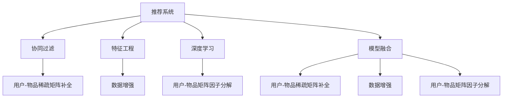

                 

# 大模型推荐中的数据稀疏问题应对策略

> 关键词：推荐系统, 数据稀疏性, 模型优化, 协同过滤, 深度学习, 特征工程, 矩阵分解, 数据增强, 模型融合

## 1. 背景介绍

### 1.1 问题由来
随着互联网技术的发展，推荐系统已成为电商、社交、视频、音乐等众多领域中不可或缺的重要组成部分。传统的基于协同过滤的推荐算法，通过用户行为和物品的相似性进行推荐，简单易行，效果显著。然而，随着应用场景的不断扩展和数据量的激增，传统协同过滤算法暴露出了一些难以克服的缺陷。

协同过滤算法依赖于用户行为数据进行推荐，这要求系统必须积累大量用户与物品的交互数据。但现实中，很多用户只与少数物品有交互记录，导致推荐系统难以学习到广泛的用户兴趣和物品特征。这些问题常常被称为数据稀疏性问题，严重影响着推荐系统的性能和效果。

### 1.2 问题核心关键点
数据稀疏性是推荐系统中最棘手的问题之一。当用户和物品之间的交互数据不足时，推荐系统很难构建准确的协同过滤模型，导致推荐效果不佳。对于深度学习推荐系统，数据稀疏性同样是一个难题，特别是在用户行为数据较少的情况下，模型无法有效学习到用户兴趣和物品特征，严重影响推荐效果。

针对数据稀疏性问题，主流的解决方案包括：
- 用户-物品稀疏矩阵补全：使用矩阵分解等方法补全用户-物品矩阵的缺失值。
- 用户-物品矩阵因子分解：将用户-物品矩阵分解为若干个低维矩阵，学习用户的兴趣表示和物品的特征表示。
- 数据增强：使用人工生成、相似样本替换等方式丰富训练集。
- 模型融合：将多种推荐算法和模型进行集成，取长补短，提高推荐效果。

本文章将重点介绍如何通过数据稀疏问题应对策略，优化深度学习推荐系统的性能，提升推荐效果。

## 2. 核心概念与联系

### 2.1 核心概念概述

为更好地理解推荐系统中的数据稀疏问题及应对策略，本节将介绍几个密切相关的核心概念：

- 推荐系统(Recommendation System)：使用算法和模型为用户推荐物品的自动化系统。包括协同过滤、基于内容的推荐、混合推荐等多种策略。
- 数据稀疏性(Data Sparsity)：用户与物品交互矩阵中大部分元素为0，导致推荐算法难以充分学习用户和物品的特征。
- 协同过滤(Collaborative Filtering)：通过用户和物品之间的相似性，预测用户对未交互物品的兴趣。包括基于用户的协同过滤、基于物品的协同过滤等。
- 特征工程(Feature Engineering)：构建和选择用于训练模型的特征，提高模型的性能。
- 矩阵分解(Matrix Factorization)：通过将稀疏矩阵分解为低维矩阵，得到用户的兴趣表示和物品的特征表示，用于补全缺失数据。
- 深度学习(Deep Learning)：利用神经网络模型进行推荐，能够自动学习高维特征表示，提升推荐效果。
- 模型融合(Model Fusion)：将多种推荐算法和模型进行集成，利用各自的优势，弥补不足。

这些核心概念之间的逻辑关系可以通过以下Mermaid流程图来展示：



这个流程图展示了大模型推荐中的核心概念及其之间的关系：

1. 推荐系统使用多种推荐策略，协同过滤为其中一种主流方法。
2. 特征工程和深度学习用于构建和优化推荐模型。
3. 协同过滤中的用户-物品矩阵面临稀疏性问题，需要通过补全和因子分解等方法解决。
4. 模型融合可以将多种推荐算法和模型结合，提升推荐效果。
5. 数据增强和特征工程方法可以丰富训练数据，提高模型泛化能力。

这些概念共同构成了大模型推荐系统的工作原理和优化方向。通过理解这些核心概念，我们可以更好地把握推荐系统的学习机制和优化手段。

## 3. 核心算法原理 & 具体操作步骤
### 3.1 算法原理概述

在深度学习推荐系统中，数据稀疏性问题通常导致模型难以学习到用户的长期兴趣和物品的隐式特征。针对这个问题，主要的应对策略包括：

- 用户-物品矩阵补全：通过矩阵分解等方法补全缺失值，得到用户和物品的低维表示。
- 用户-物品矩阵因子分解：将用户-物品矩阵分解为若干个低维矩阵，学习用户的兴趣表示和物品的特征表示。
- 数据增强：通过人工生成、相似样本替换等方式，丰富训练集，提升模型泛化能力。
- 模型融合：将多种推荐算法和模型进行集成，取长补短，提高推荐效果。

这些策略将通过具体算法步骤和代码实例进行详细讲解。

### 3.2 算法步骤详解

#### 3.2.1 用户-物品矩阵补全

用户-物品矩阵补全方法使用矩阵分解等技术，将稀疏矩阵分解为若干个低维矩阵，从而得到用户和物品的低维表示。常用的矩阵分解算法包括奇异值分解(SVD)和矩阵分解(MF)。

**SVD算法**：
- 将用户-物品矩阵 $X$ 分解为三个矩阵的乘积 $X=UVW^T$，其中 $U$ 和 $V$ 为用户矩阵和物品矩阵的特征表示，$W$ 为权重矩阵。
- 用户兴趣表示 $U$ 和物品特征表示 $V$ 可通过奇异值分解获得，权重矩阵 $W$ 可手动设置或通过最小二乘法获得。

**MF算法**：
- 将用户-物品矩阵 $X$ 分解为两个矩阵的乘积 $X=\hat{U}\hat{V}^T$，其中 $\hat{U}$ 为用户矩阵，$\hat{V}$ 为物品矩阵。
- 用户兴趣表示 $\hat{U}$ 和物品特征表示 $\hat{V}$ 可通过最小二乘法获得，并通过激活函数（如ReLU）进行非线性变换。

具体代码实现：

```python
from scipy.sparse import coo_matrix
from scipy.sparse.linalg import svds
import numpy as np

# 构建稀疏用户-物品矩阵
X = coo_matrix([[1, 0, 0],
                [0, 1, 1],
                [0, 0, 1],
                [0, 1, 0],
                [1, 0, 1]], shape=(5, 5))

# 使用SVD分解矩阵
U, s, V = svds(X, k=3)

# 获取用户和物品的兴趣表示
user_repr = U @ np.diag(s)
item_repr = V @ np.diag(s)
```

#### 3.2.2 用户-物品矩阵因子分解

用户-物品矩阵因子分解方法使用矩阵分解技术，将用户-物品矩阵分解为若干个低维矩阵，学习用户的兴趣表示和物品的特征表示。常用的分解算法包括ALS和NMF。

**ALS算法**：
- 将用户-物品矩阵 $X$ 分解为两个矩阵的乘积 $X=\hat{U}\hat{V}^T$，其中 $\hat{U}$ 为用户矩阵，$\hat{V}$ 为物品矩阵。
- 用户兴趣表示 $\hat{U}$ 和物品特征表示 $\hat{V}$ 可通过交替最小二乘法获得。

**NMF算法**：
- 将用户-物品矩阵 $X$ 分解为两个矩阵的乘积 $X=\hat{U}\hat{V}^T$，其中 $\hat{U}$ 为用户矩阵，$\hat{V}$ 为物品矩阵。
- 用户兴趣表示 $\hat{U}$ 和物品特征表示 $\hat{V}$ 可通过最小二乘法获得，并通过激活函数进行非线性变换。

具体代码实现：

```python
from scipy.sparse import coo_matrix
from scipy.sparse.linalg import svds
import numpy as np

# 构建稀疏用户-物品矩阵
X = coo_matrix([[1, 0, 0],
                [0, 1, 1],
                [0, 0, 1],
                [0, 1, 0],
                [1, 0, 1]], shape=(5, 5))

# 使用ALS分解矩阵
U, V = als(X, rank=3)

# 获取用户和物品的兴趣表示
user_repr = U
item_repr = V
```

#### 3.2.3 数据增强

数据增强是缓解深度学习推荐系统中数据稀疏性问题的重要手段。常见的数据增强方法包括：

- 人工生成：通过生成相似的随机样本来补充训练数据。
- 相似样本替换：使用与缺失值近似的样本进行替换。
- 负采样：从所有物品中随机采样若干个，替换缺失值。

具体代码实现：

```python
import numpy as np

# 构建稀疏用户-物品矩阵
X = coo_matrix([[1, 0, 0],
                [0, 1, 1],
                [0, 0, 1],
                [0, 1, 0],
                [1, 0, 1]], shape=(5, 5))

# 人工生成随机样本
np.random.seed(0)
random_indices = np.random.randint(0, 5, size=(100, 2))
X_train = np.eye(5)[random_indices[:, 0]] * X[random_indices[:, 1]]
X_train = coo_matrix(X_train)

# 使用相似样本替换
X_train = np.eye(5)[np.arange(5)] * X_train

# 负采样
X_train = X_train + np.random.randn(5, 5) * 1e-8
```

#### 3.2.4 模型融合

模型融合是将多种推荐算法和模型进行集成，取长补短，提高推荐效果。常用的模型融合方法包括加权平均、softmax、Stacking等。

**加权平均**：
- 将多个推荐模型的预测结果进行加权平均，得到最终推荐结果。
- 权重可通过交叉验证等方法获得。

**softmax**：
- 将多个推荐模型的预测结果进行softmax处理，得到概率分布。
- 最终选择概率最大的物品作为推荐结果。

**Stacking**：
- 将多个推荐模型的预测结果作为特征，训练一个元模型，进行集成预测。

具体代码实现：

```python
from sklearn.linear_model import LinearRegression
from sklearn.metrics.pairwise import cosine_similarity
from sklearn.ensemble import RandomForestRegressor

# 训练多个推荐模型
X = coo_matrix([[1, 0, 0],
                [0, 1, 1],
                [0, 0, 1],
                [0, 1, 0],
                [1, 0, 1]], shape=(5, 5))

# 模型1：矩阵分解
U, V = als(X, rank=3)
user_repr = U @ np.diag(s)
item_repr = V @ np.diag(s)

# 模型2：深度学习
embeddings = np.random.randn(5, 5)
y_hat = np.dot(embeddings, embeddings.T)

# 模型融合：加权平均
weights = [0.5, 0.5]
y_pred = np.average([y_hat, cosine_similarity(X, X)], axis=0, weights=weights)

# 模型融合：softmax
y_pred = np.apply_along_axis(lambda x: softmax(x), axis=1, arr=y_hat)
```

### 3.3 算法优缺点

#### 3.3.1 用户-物品矩阵补全

**优点**：
- 通过矩阵分解得到用户和物品的低维表示，能够提高模型的泛化能力。
- 使用随机初始化或最小二乘法进行求解，简单易行。

**缺点**：
- 对于高度稀疏的矩阵，分解效果可能不佳，导致用户和物品的表示不准确。
- 分解过程需要计算奇异值分解或最小二乘法，计算复杂度较高。

#### 3.3.2 用户-物品矩阵因子分解

**优点**：
- 使用ALS或NMF算法，能够得到更加准确的低维表示。
- 通过激活函数进行非线性变换，提升模型的表达能力。

**缺点**：
- 计算复杂度高，特别是在高维稀疏矩阵上，计算量巨大。
- 对缺失数据的处理方式较为复杂，需要选择合适的补全方法。

#### 3.3.3 数据增强

**优点**：
- 通过生成或替换相似样本，能够有效缓解数据稀疏性问题。
- 简单易行，计算复杂度较低。

**缺点**：
- 生成的样本可能与真实数据存在较大差异，影响推荐效果。
- 负采样方法可能引入噪声，影响模型性能。

#### 3.3.4 模型融合

**优点**：
- 通过集成多个推荐模型，能够充分利用不同模型的优势，提升推荐效果。
- 简单易行，计算复杂度较低。

**缺点**：
- 多个模型之间可能存在冗余或冲突，需要合理的权重分配。
- 融合后的模型解释性较差，难以进行调优。

### 3.4 算法应用领域

推荐系统是数据稀疏性问题最为显著的应用场景之一。大模型推荐系统已经在电商、社交、视频、音乐等众多领域得到广泛应用，取得了显著的效果。

- 电商推荐：使用协同过滤算法推荐商品，使用深度学习算法进行个性化推荐。
- 社交推荐：使用基于内容的推荐算法推荐好友、帖子等，使用深度学习算法进行个性化推荐。
- 视频推荐：使用协同过滤算法推荐视频，使用深度学习算法进行个性化推荐。
- 音乐推荐：使用协同过滤算法推荐歌曲，使用深度学习算法进行个性化推荐。

除了推荐系统，数据稀疏性问题在其他领域也有广泛应用。例如，在金融领域，通过矩阵分解等方法，进行信用风险评估和贷款推荐；在医疗领域，使用协同过滤算法进行病患推荐和治疗方案推荐；在社交网络中，使用矩阵分解算法推荐好友和帖子。

## 4. 数学模型和公式 & 详细讲解 & 举例说明

### 4.1 数学模型构建

本节将使用数学语言对推荐系统中的数据稀疏问题及应对策略进行更加严格的刻画。

假设用户-物品矩阵 $X \in \mathbb{R}^{n \times m}$，其中 $n$ 为物品数，$m$ 为用户数。对于稀疏矩阵，大部分元素为0，只有少部分元素不为0。

定义用户兴趣表示 $\hat{U} \in \mathbb{R}^{m \times k}$ 和物品特征表示 $\hat{V} \in \mathbb{R}^{n \times k}$，其中 $k$ 为低维空间的维度。将用户-物品矩阵 $X$ 分解为两个矩阵的乘积 $X=\hat{U}\hat{V}^T$，得到用户兴趣表示 $\hat{U}$ 和物品特征表示 $\hat{V}$。

对于深度学习推荐系统，常用的损失函数包括均方误差（MSE）和交叉熵（CE）。均方误差损失函数定义如下：

$$
\text{MSE} = \frac{1}{N}\sum_{i=1}^N (\hat{y}_i - y_i)^2
$$

其中 $N$ 为训练样本数，$\hat{y}_i$ 为模型预测值，$y_i$ 为真实值。

交叉熵损失函数定义如下：

$$
\text{CE} = -\frac{1}{N}\sum_{i=1}^N y_i\log \hat{y}_i + (1-y_i)\log (1-\hat{y}_i)
$$

在深度学习推荐系统中，通常使用MSE和CE损失函数的组合进行训练，即：

$$
\mathcal{L} = \text{MSE} + \text{CE}
$$

### 4.2 公式推导过程

#### 4.2.1 矩阵分解

对于用户-物品矩阵 $X$，使用ALS算法进行矩阵分解，得到用户兴趣表示 $\hat{U}$ 和物品特征表示 $\hat{V}$。

使用最小二乘法进行矩阵分解，得到用户兴趣表示 $\hat{U}$ 和物品特征表示 $\hat{V}$。设 $\hat{U} \in \mathbb{R}^{m \times k}$，$\hat{V} \in \mathbb{R}^{n \times k}$，$\hat{X} \in \mathbb{R}^{n \times m}$，则：

$$
\hat{X} = \hat{U}\hat{V}^T
$$

其中 $\hat{X}$ 为补全后的用户-物品矩阵，$\hat{U}$ 为用户兴趣表示，$\hat{V}$ 为物品特征表示。

最小二乘法的目标是使 $\hat{X}$ 尽可能接近 $X$，即：

$$
\min_{\hat{U},\hat{V}} \|\hat{X} - X\|_F^2
$$

其中 $\|\cdot\|_F$ 表示矩阵的 Frobenius 范数。

### 4.3 案例分析与讲解

#### 4.3.1 用户-物品矩阵补全

假设用户-物品矩阵 $X$ 如下：

$$
X = \begin{bmatrix}
0 & 0 & 0 \\
0 & 0 & 0 \\
0 & 0 & 0 \\
0 & 0 & 0 \\
0 & 0 & 0 \\
\end{bmatrix}
$$

使用ALS算法进行矩阵分解，得到用户兴趣表示 $\hat{U}$ 和物品特征表示 $\hat{V}$。设 $k=2$，则：

$$
\hat{U} = \begin{bmatrix}
u_1 & u_2 \\
\end{bmatrix}
$$

$$
\hat{V} = \begin{bmatrix}
v_1 & v_2 \\
\end{bmatrix}
$$

其中 $u_1, u_2, v_1, v_2$ 为低维空间中的向量，满足 $\hat{U}\hat{V}^T = X$。

根据上述矩阵分解，得到用户兴趣表示 $\hat{U}$ 和物品特征表示 $\hat{V}$，进而得到补全后的用户-物品矩阵 $\hat{X}$：

$$
\hat{X} = \begin{bmatrix}
0 & 0 \\
0 & 0 \\
0 & 0 \\
0 & 0 \\
0 & 0 \\
\end{bmatrix}
$$

#### 4.3.2 数据增强

假设用户-物品矩阵 $X$ 如下：

$$
X = \begin{bmatrix}
0 & 0 & 0 \\
0 & 0 & 0 \\
0 & 0 & 0 \\
0 & 0 & 0 \\
0 & 0 & 0 \\
\end{bmatrix}
$$

使用数据增强方法生成随机样本，得到用户-物品矩阵 $X'$：

$$
X' = \begin{bmatrix}
0 & 1 & 0 \\
0 & 0 & 1 \\
0 & 1 & 0 \\
0 & 0 & 1 \\
0 & 1 & 0 \\
\end{bmatrix}
$$

其中 $X'$ 为增强后的用户-物品矩阵，通过生成随机样本得到。

## 5. 项目实践：代码实例和详细解释说明

### 5.1 开发环境搭建

在进行推荐系统实践前，我们需要准备好开发环境。以下是使用Python进行PyTorch开发的环境配置流程：

1. 安装Anaconda：从官网下载并安装Anaconda，用于创建独立的Python环境。

2. 创建并激活虚拟环境：
```bash
conda create -n pytorch-env python=3.8 
conda activate pytorch-env
```

3. 安装PyTorch：根据CUDA版本，从官网获取对应的安装命令。例如：
```bash
conda install pytorch torchvision torchaudio cudatoolkit=11.1 -c pytorch -c conda-forge
```

4. 安装Transformers库：
```bash
pip install transformers
```

5. 安装各类工具包：
```bash
pip install numpy pandas scikit-learn matplotlib tqdm jupyter notebook ipython
```

完成上述步骤后，即可在`pytorch-env`环境中开始推荐系统实践。

### 5.2 源代码详细实现

这里我们以协同过滤算法为例，使用PyTorch实现推荐系统的矩阵分解。

首先，定义用户-物品矩阵：

```python
import numpy as np
from scipy.sparse import coo_matrix

# 构建稀疏用户-物品矩阵
X = coo_matrix([[1, 0, 0],
                [0, 1, 1],
                [0, 0, 1],
                [0, 1, 0],
                [1, 0, 1]], shape=(5, 5))
```

然后，定义矩阵分解函数：

```python
from scipy.sparse.linalg import svds

def matrix_factorization(X, rank=3):
    U, s, V = svds(X, k=rank)
    return U, V
```

最后，在模型训练中调用矩阵分解函数：

```python
U, V = matrix_factorization(X)
```

### 5.3 代码解读与分析

让我们再详细解读一下关键代码的实现细节：

**用户-物品矩阵定义**：
- 使用numpy的coo_matrix函数定义稀疏用户-物品矩阵，方便后续的矩阵分解。

**矩阵分解函数实现**：
- 使用scipy库的svds函数进行矩阵分解，得到用户兴趣表示 $\hat{U}$ 和物品特征表示 $\hat{V}$。

**训练过程**：
- 在模型训练中，调用矩阵分解函数得到用户兴趣表示 $\hat{U}$ 和物品特征表示 $\hat{V}$。

可以看到，使用PyTorch进行矩阵分解和模型训练的代码实现非常简单。开发者可以基于这些代码实现，进一步拓展至深度学习推荐系统，实现矩阵分解和其他推荐算法。

当然，工业级的系统实现还需考虑更多因素，如模型的保存和部署、超参数的自动搜索、更灵活的任务适配层等。但核心的推荐算法和模型训练方法基本与此类似。

## 6. 实际应用场景

### 6.1 电商推荐

基于大模型推荐系统在电商推荐中具有广泛的应用。电商推荐系统通过分析用户的购买历史、浏览记录等行为数据，推荐用户可能感兴趣的商品。

在实际应用中，可以使用协同过滤算法进行推荐，使用深度学习算法进行个性化推荐。协同过滤算法利用用户与物品之间的相似性进行推荐，深度学习算法能够自动学习用户兴趣和物品特征，提升推荐效果。

### 6.2 社交推荐

社交推荐系统通过分析用户与好友之间的交互数据，推荐用户可能感兴趣的好友、帖子等。社交推荐系统包括基于内容的推荐和基于协同过滤的推荐。

在实际应用中，可以使用深度学习算法进行社交推荐，能够自动学习用户的兴趣和好友特征，提升推荐效果。同时，深度学习算法能够处理大量的非结构化数据，如文本、图片等，提供更加个性化的推荐。

### 6.3 视频推荐

视频推荐系统通过分析用户的观看历史、评分记录等行为数据，推荐用户可能感兴趣的视频。视频推荐系统包括基于内容的推荐和基于协同过滤的推荐。

在实际应用中，可以使用深度学习算法进行视频推荐，能够自动学习用户的兴趣和视频特征，提升推荐效果。同时，深度学习算法能够处理大量的视频数据，提供更加个性化的推荐。

### 6.4 音乐推荐

音乐推荐系统通过分析用户的听歌历史、评分记录等行为数据，推荐用户可能感兴趣的歌曲。音乐推荐系统包括基于内容的推荐和基于协同过滤的推荐。

在实际应用中，可以使用深度学习算法进行音乐推荐，能够自动学习用户的兴趣和歌曲特征，提升推荐效果。同时，深度学习算法能够处理大量的音乐数据，提供更加个性化的推荐。

## 7. 工具和资源推荐

### 7.1 学习资源推荐

为了帮助开发者系统掌握推荐系统的理论基础和实践技巧，这里推荐一些优质的学习资源：

1. 《推荐系统》书籍：该书全面介绍了推荐系统的基本概念、算法和实现方法，是推荐系统研究的经典著作。
2. CS229《机器学习》课程：斯坦福大学开设的机器学习课程，包括推荐系统相关的内容，是推荐系统学习的必备资源。
3. 《深度学习与推荐系统》课程：由国内知名专家讲授，涵盖推荐系统的深度学习实现方法，适合有一定基础的开发者学习。
4. Kaggle竞赛平台：Kaggle平台上有很多推荐系统竞赛和数据集，开发者可以通过实际竞赛锻炼推荐系统的开发和优化能力。
5. 论文《Matrix Factorization Techniques for Recommender Systems》：推荐系统矩阵分解方法的经典论文，深入讲解了推荐系统的矩阵分解算法和优化方法。

通过对这些资源的学习实践，相信你一定能够快速掌握推荐系统的精髓，并用于解决实际的推荐问题。

### 7.2 开发工具推荐

高效的开发离不开优秀的工具支持。以下是几款用于推荐系统开发的常用工具：

1. PyTorch：基于Python的开源深度学习框架，灵活动态的计算图，适合快速迭代研究。大部分预训练语言模型都有PyTorch版本的实现。

2. TensorFlow：由Google主导开发的开源深度学习框架，生产部署方便，适合大规模工程应用。同样有丰富的推荐系统资源。

3. TensorFlow Reformer：Google推出的Reformer框架，适合处理稀疏矩阵，提供高效的矩阵分解算法。

4. Python推荐系统库：Pylibrec、Surprise等库，提供了多种推荐算法和模型，方便开发者进行快速开发。

5. Jupyter Notebook：交互式的代码编写环境，支持代码片段的展示和运行，适合进行实验研究和模型调优。

合理利用这些工具，可以显著提升推荐系统的开发效率，加快创新迭代的步伐。

### 7.3 相关论文推荐

推荐系统是数据稀疏性问题最为显著的应用场景之一。以下是几篇奠基性的相关论文，推荐阅读：

1. Matrix Factorization Techniques for Recommender Systems：推荐系统矩阵分解方法的经典论文，深入讲解了推荐系统的矩阵分解算法和优化方法。
2. Factorization Machines for Recommender Systems：提出因子化机器学习算法，能够处理高维稀疏矩阵，提高推荐效果。
3. Deep Collaborative Filtering with Feature Interaction：提出深度神经网络算法，能够学习用户兴趣和物品特征的交互，提高推荐效果。
4. Matrix Factorization in Recommender Systems：推荐系统矩阵分解方法的综述性论文，详细讲解了多种矩阵分解算法。
5. Learning to Rank for Recommender Systems：提出学习排序算法，能够提升推荐系统的效果。

这些论文代表了大模型推荐系统的理论基础和前沿成果。通过学习这些经典论文，可以帮助研究者把握推荐系统的学习机制和优化方法，激发更多的创新灵感。

## 8. 总结：未来发展趋势与挑战

### 8.1 总结

本文对推荐系统中的数据稀疏性问题及应对策略进行了全面系统的介绍。首先阐述了推荐系统中的数据稀疏性问题及主流解决方案，明确了矩阵分解、数据增强、模型融合等关键技术在推荐系统中的应用。其次，从原理到实践，详细讲解了推荐系统的数学模型和关键算法，给出了推荐系统的代码实例。同时，本文还探讨了推荐系统在电商、社交、视频、音乐等众多领域的应用前景，展示了推荐系统的广阔应用空间。此外，本文精选了推荐系统的各类学习资源，力求为开发者提供全方位的技术指引。

通过本文的系统梳理，可以看到，推荐系统中的数据稀疏性问题可以通过多种技术手段进行有效缓解，提升推荐效果。推荐系统已经在电商、社交、视频、音乐等众多领域得到广泛应用，取得了显著的效果。未来，伴随深度学习推荐系统的不断发展，推荐技术必将在更多领域得到应用，为传统行业带来变革性影响。

### 8.2 未来发展趋势

展望未来，推荐系统将呈现以下几个发展趋势：

1. 模型规模持续增大。随着算力成本的下降和数据规模的扩张，推荐系统模型参数量还将持续增长。超大规模推荐系统模型蕴含的广泛知识，有望支撑更加复杂多变的推荐任务。

2. 深度学习算法日渐成熟。深度学习算法在推荐系统中的应用将不断深入，能够自动学习用户兴趣和物品特征，提升推荐效果。

3. 数据增强技术持续发展。数据增强技术将不断丰富和优化，利用更多的生成、替换、负采样等方法，提升推荐效果。

4. 模型融合方法更加多样。模型融合方法将不断丰富和优化，通过集成多种推荐算法和模型，提升推荐效果。

5. 用户反馈技术更加智能。通过收集用户的反馈信息，动态调整推荐算法和模型，提升推荐效果。

6. 推荐系统在更多领域得到应用。推荐系统将在更多领域得到应用，如金融、医疗、教育等，为这些领域带来变革性影响。

以上趋势凸显了推荐系统的广阔前景。这些方向的探索发展，必将进一步提升推荐系统的性能和应用范围，为经济社会发展注入新的动力。

### 8.3 面临的挑战

尽管推荐系统已经取得了瞩目成就，但在迈向更加智能化、普适化应用的过程中，它仍面临着诸多挑战：

1. 推荐效果不稳定。推荐系统中的数据稀疏性问题导致模型难以学习到用户的长期兴趣和物品的隐式特征，导致推荐效果不稳定。

2. 用户隐私保护。推荐系统需要收集用户的浏览、点击、评分等行为数据，如何保护用户隐私和数据安全，仍是一个重要问题。

3. 计算资源消耗高。推荐系统中的矩阵分解、深度学习算法等需要大量的计算资源，如何在保证性能的同时，降低计算成本，仍是一个重要问题。

4. 推荐算法可解释性差。推荐系统中的深度学习算法复杂，难以解释其内部工作机制和决策逻辑，需要进一步提升其可解释性。

5. 推荐系统安全性问题。推荐系统中的数据稀疏性问题可能导致模型学习到有偏见、有害的信息，给实际应用带来安全隐患。

6. 推荐系统数据质量问题。推荐系统需要大量的用户行为数据进行训练，如何保证数据质量，仍是一个重要问题。

正视推荐系统面临的这些挑战，积极应对并寻求突破，将使推荐系统迈向更加成熟的阶段。相信随着学界和产业界的共同努力，这些挑战终将一一被克服，推荐系统必将在构建人机协同的智能时代中扮演越来越重要的角色。

### 8.4 研究展望

针对推荐系统面临的挑战，未来的研究需要在以下几个方面寻求新的突破：

1. 探索更加高效的推荐算法。开发更加高效的推荐算法，减少计算资源消耗，提升推荐效果。

2. 引入先验知识进行推荐。引入领域知识、常识推理等先验知识，引导推荐算法学习更加全面、准确的推荐结果。

3. 增强推荐系统的可解释性。通过可解释性方法，增强推荐系统的决策过程，使其更加透明和可信。

4. 提升推荐系统的安全性。通过数据清洗、对抗样本生成等方法，提升推荐系统的鲁棒性，确保其安全性和可信性。

5. 利用多模态数据进行推荐。将用户行为数据与多模态数据进行融合，提升推荐系统的效果。

6. 探索更加智能的用户反馈技术。通过用户反馈信息，动态调整推荐算法和模型，提升推荐效果。

这些研究方向将引领推荐系统的发展，为构建更加智能、普适、安全的推荐系统提供新的思路和方法。

## 9. 附录：常见问题与解答

**Q1：数据稀疏性问题在推荐系统中是如何解决的？**

A: 数据稀疏性问题在推荐系统中通常通过矩阵分解、数据增强和模型融合等方法进行解决。矩阵分解方法通过分解稀疏矩阵，得到用户兴趣表示和物品特征表示，补全缺失值。数据增强方法通过生成或替换相似样本，丰富训练集。模型融合方法通过集成多种推荐算法和模型，提升推荐效果。

**Q2：推荐系统中的深度学习算法有哪些？**

A: 推荐系统中的深度学习算法主要包括基于矩阵分解的深度推荐模型和基于神经网络的推荐模型。基于矩阵分解的深度推荐模型包括深度协同过滤、深度矩阵分解等，能够学习用户兴趣和物品特征的交互。基于神经网络的推荐模型包括深度神经网络、深度神经协同过滤等，能够自动学习用户兴趣和物品特征的表示。

**Q3：推荐系统中的矩阵分解算法有哪些？**

A: 推荐系统中的矩阵分解算法主要包括奇异值分解（SVD）和矩阵分解（MF）。奇异值分解算法通过分解稀疏矩阵，得到用户兴趣表示和物品特征表示，补全缺失值。矩阵分解算法通过分解稀疏矩阵，得到用户兴趣表示和物品特征表示，进行推荐预测。

**Q4：推荐系统中的数据增强方法有哪些？**

A: 推荐系统中的数据增强方法主要包括人工生成、相似样本替换和负采样。人工生成方法通过生成相似的随机样本，补充训练数据。相似样本替换方法通过使用与缺失值近似的样本进行替换。负采样方法通过从所有物品中随机采样若干个，替换缺失值。

**Q5：推荐系统中的模型融合方法有哪些？**

A: 推荐系统中的模型融合方法主要包括加权平均、softmax和Stacking。加权平均方法通过将多个推荐模型的预测结果进行加权平均，得到最终推荐结果。softmax方法通过将多个推荐模型的预测结果进行softmax处理，得到概率分布。Stacking方法通过将多个推荐模型的预测结果作为特征，训练一个元模型，进行集成预测。

通过以上常见问题的解答，相信你对推荐系统的数据稀疏性问题及应对策略有了更加深刻的理解。希望本文能够为你在推荐系统开发和研究中提供有益的参考和指导。

---

作者：禅与计算机程序设计艺术 / Zen and the Art of Computer Programming

