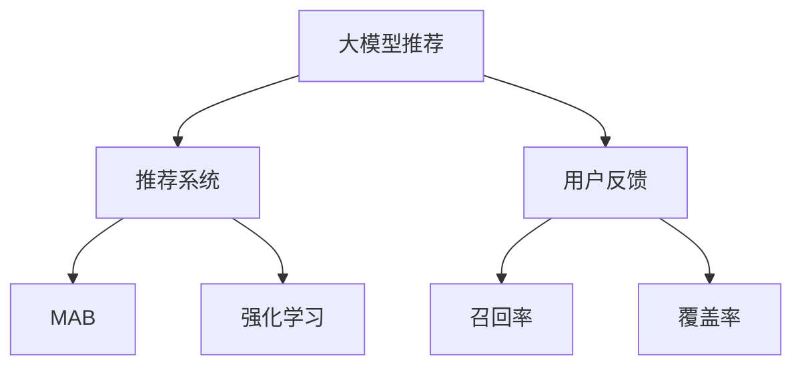

                 

# 大模型推荐中的用户反馈机制设计与优化策略

> 关键词：大模型推荐,用户反馈机制,推荐系统,个性化推荐,多臂老虎机,强化学习,召回率,覆盖率

## 1. 背景介绍

在互联网时代，推荐系统已成为各类服务的重要支撑。无论是电商平台、内容平台，还是社交网络，个性化推荐都成为了吸引用户、提升转化率、增加用户粘性的关键手段。然而，推荐系统的核心问题是如何通过算法的不断优化，更好地理解用户兴趣，从而提供精准匹配的推荐内容。大模型推荐系统作为当前研究的热点之一，利用预训练语言模型在大规模数据上进行训练，具备强大的语言理解和生成能力，在文本推荐、新闻推荐等领域展现出了卓越的性能。

但大模型推荐系统并非完美无缺。由于缺乏实时的用户反馈信息，模型训练目标难以精准对齐用户实际需求，导致推荐结果在多样性、新颖性和相关性上存在不足。因此，如何设计有效的用户反馈机制，实时捕捉用户反馈信息，优化推荐算法，是当前大模型推荐系统面临的重要挑战。

## 2. 核心概念与联系

### 2.1 核心概念概述

为更好地理解大模型推荐系统中的用户反馈机制，本节将介绍几个密切相关的核心概念：

- 大模型推荐：基于预训练语言模型进行推荐决策的系统。大模型通过大规模无标签数据预训练，学习到丰富的语言表示，具备强大的推荐能力。

- 推荐系统：根据用户历史行为和实时反馈，为用户推荐可能感兴趣的内容的系统。其核心目标在于最大化用户满意度，提升用户留存率和转化率。

- 用户反馈：用户在浏览、互动过程中给出的直接或间接反馈信息，如评分、点击、收藏等行为数据。

- 多臂老虎机(Multi-Armed Bandit, MAB)：一种经典的强化学习问题，用于描述多任务下的最优资源分配问题，类比于多个赌博机中，每次只能投一个，目标是在有限的投币次数内获得最大收益。

- 召回率与覆盖率：衡量推荐系统质量的关键指标。召回率指推荐系统推荐的正面物品在所有正面物品中的比例，覆盖率指推荐系统推荐的正面物品在所有物品中的比例。

- 强化学习：通过模型与环境交互，学习最优决策策略的机器学习方法。在推荐系统中，用户行为可以视为环境，推荐模型通过学习最优策略，提升推荐效果。

这些核心概念之间的逻辑关系可以通过以下Mermaid流程图来展示：



这个流程图展示了大模型推荐系统的核心概念及其之间的关系：

1. 大模型推荐基于推荐系统框架，采用大模型进行决策。
2. 用户反馈通过推荐系统反馈到模型，影响模型训练目标。
3. MAB模型用于在众多候选物品中分配推荐资源，优化推荐策略。
4. 召回率和覆盖率是评估推荐系统效果的重要指标。
5. 强化学习用于优化模型和算法，提升推荐效果。

## 3. 核心算法原理 & 具体操作步骤
### 3.1 算法原理概述

大模型推荐系统中的用户反馈机制设计，本质上是将用户反馈信息引入推荐模型的训练过程，通过优化算法提升模型预测能力。其核心思想是：

1. 在用户互动过程中，实时收集用户反馈信息，如点击、评分、收藏等。
2. 将用户反馈转化为推荐系统的损失函数，指导模型更新。
3. 设计合理的优化算法，如多臂老虎机算法，优化模型参数，提升推荐效果。
4. 通过召回率和覆盖率等指标，评估模型性能，指导进一步优化。

### 3.2 算法步骤详解

以下是基于用户反馈的大模型推荐系统的具体实现步骤：

**Step 1: 数据准备与模型加载**
- 准备用户反馈数据，包括点击、评分、收藏等行为数据。
- 将数据分为训练集和测试集。
- 加载预训练的推荐模型，如BERT、GPT等。

**Step 2: 用户行为编码**
- 对用户反馈进行编码，将其转化为推荐模型所需的向量表示。
- 例如，将点击行为编码为1，未点击为0。

**Step 3: 损失函数设计**
- 根据用户反馈设计推荐模型的损失函数。
- 例如，使用交叉熵损失，将用户反馈的编码与模型预测的概率进行比较。

**Step 4: 优化算法应用**
- 选择优化算法，如多臂老虎机算法，优化模型参数。
- 设置适当的参数，如回报率(回报值与期望值的比)、探索率(探索新物品的概率)。

**Step 5: 模型评估与调整**
- 在测试集上评估模型性能，计算召回率和覆盖率等指标。
- 根据评估结果，调整模型参数，继续训练优化。

**Step 6: 实时反馈与在线优化**
- 在实际推荐系统中，不断收集用户反馈，实时更新模型参数。
- 使用增量学习等技术，降低模型更新对系统运行的影响。

### 3.3 算法优缺点

基于用户反馈的大模型推荐系统具有以下优点：
1. 实时性好。实时收集用户反馈，能够快速响应用户需求，提高推荐系统的时效性。
2. 效果显著。通过用户反馈指导模型更新，能够显著提升推荐系统的效果。
3. 可解释性强。用户反馈的直接作用，使得推荐过程更容易理解，便于解释和优化。

同时，该方法也存在一些局限性：
1. 反馈数据质量。用户反馈数据的质量和数量对推荐效果有直接影响，数据偏差可能导致误导。
2. 反馈滞后性。用户反馈往往滞后于当前互动，可能无法及时捕捉即时需求。
3. 反馈噪音。部分反馈可能不具有代表性，噪音数据会对模型学习产生干扰。
4. 模型复杂度。实时优化模型参数，增加了模型复杂度和计算成本。

尽管存在这些局限性，但就目前而言，基于用户反馈的大模型推荐系统仍然是最有效的推荐方法之一。未来相关研究的重点在于如何进一步提高反馈数据的质量和实时性，降低噪音数据的干扰，同时兼顾模型的可解释性和复杂度。

### 3.4 算法应用领域

基于用户反馈的大模型推荐系统在电商、新闻、音乐、视频等多个领域得到了广泛应用，覆盖了几乎所有常见任务，例如：

- 个性化推荐：根据用户历史行为和实时反馈，为用户推荐可能感兴趣的商品或内容。
- 广告投放：通过用户点击、停留等行为反馈，优化广告推荐策略，提升广告转化率。
- 新闻资讯：根据用户阅读、分享等行为反馈，推荐相关新闻和文章，提升用户留存率。
- 视频推荐：通过用户观看、评分等反馈，推荐用户感兴趣的视频内容，提升用户满意度。
- 游戏推荐：通过用户游戏行为反馈，推荐用户可能感兴趣的游戏，提升游戏黏性。

除了上述这些经典任务外，大模型推荐系统也被创新性地应用到更多场景中，如用户画像生成、内容多样化推荐、个性化广告定制等，为推荐系统带来了全新的突破。

## 4. 数学模型和公式 & 详细讲解 & 举例说明

### 4.1 数学模型构建

本节将使用数学语言对基于用户反馈的大模型推荐系统进行更加严格的刻画。

记推荐系统中的物品集为 $I=\{1,2,...,N\}$，用户集为 $U=\{1,2,...,M\}$。假设用户 $u$ 对物品 $i$ 进行了点击行为，用 $x_{ui}$ 表示。模型预测用户 $u$ 对物品 $i$ 的评分概率为 $p_{ui}$，推荐系统在物品 $i$ 上的点击概率为 $q_{ui}$。

设推荐系统的损失函数为 $\mathcal{L}$，目标最小化推荐系统在点击行为上的损失。以多臂老虎机为例，点击行为与回报值 $r_{ui}$ 的关系如下：

$$
r_{ui} = \delta x_{ui} + (1-x_{ui})\log(1-p_{ui})
$$

其中 $\delta$ 为点击回报系数，一般取值为1。则目标损失函数可写为：

$$
\mathcal{L} = \sum_{u,i} w_{ui}(r_{ui} - \log p_{ui})
$$

其中 $w_{ui}$ 为权重，用于平衡不同用户和物品的影响。

### 4.2 公式推导过程

以下我们以多臂老虎机算法为例，推导优化推荐系统模型的公式。

多臂老虎机算法通过不断尝试不同物品，优化选择策略，最大化总回报。具体而言，每次选择一个物品 $i$ 进行点击，根据其回报值 $r_{ui}$ 和点击概率 $q_{ui}$ 进行更新。设 $\varepsilon$ 为探索率，$\delta$ 为回报率。则物品 $i$ 的回报值更新公式为：

$$
r_i \leftarrow \frac{r_i}{1-\varepsilon} + \frac{\delta x_{ui}}{\varepsilon}
$$

物品 $i$ 的点击概率更新公式为：

$$
q_i \leftarrow \frac{q_i r_i}{1-\varepsilon}
$$

其中 $q_i$ 为物品 $i$ 的点击概率，$r_i$ 为物品 $i$ 的累积回报值。

### 4.3 案例分析与讲解

以电商平台的商品推荐为例，分析多臂老虎机算法的优化效果。假设电商平台中有100种商品，每个用户对每件商品的点击行为 $x_{ui}$ 可视为1或0。通过多臂老虎机算法，每次从100种商品中选择一种进行推荐，根据用户点击行为调整商品权重和概率，最大化推荐效果。

首先，假设用户 $u$ 对商品 $i$ 进行了点击行为，则其回报值 $r_{ui}$ 和点击概率 $q_{ui}$ 根据公式计算更新：

$$
r_{ui} \leftarrow \frac{r_{ui}}{1-\varepsilon} + \frac{\delta x_{ui}}{\varepsilon}
$$

$$
q_{ui} \leftarrow \frac{q_{ui} r_{ui}}{1-\varepsilon}
$$

其中 $\varepsilon$ 为探索率，$\delta$ 为点击回报系数。随着用户行为数据的积累，多臂老虎机算法能够动态调整每个商品的权重和概率，使其更符合用户的实际需求，从而提升推荐效果。

## 5. 项目实践：代码实例和详细解释说明
### 5.1 开发环境搭建

在进行推荐系统开发前，我们需要准备好开发环境。以下是使用Python进行PyTorch开发的环境配置流程：

1. 安装Anaconda：从官网下载并安装Anaconda，用于创建独立的Python环境。

2. 创建并激活虚拟环境：
```bash
conda create -n recsys-env python=3.8 
conda activate recsys-env
```

3. 安装PyTorch：根据CUDA版本，从官网获取对应的安装命令。例如：
```bash
conda install pytorch torchvision torchaudio cudatoolkit=11.1 -c pytorch -c conda-forge
```

4. 安装TensorFlow：
```bash
pip install tensorflow
```

5. 安装各类工具包：
```bash
pip install numpy pandas scikit-learn matplotlib tqdm jupyter notebook ipython
```

完成上述步骤后，即可在`recsys-env`环境中开始推荐系统开发。

### 5.2 源代码详细实现

这里我们以基于多臂老虎机算法进行大模型推荐为例，给出使用PyTorch和TensorFlow进行推荐系统开发的PyTorch代码实现。

首先，定义推荐模型：

```python
from transformers import BertForSequenceClassification
from transformers import BertTokenizer
from tensorflow.keras.layers import Dense, Input, Concatenate, Activation
from tensorflow.keras.models import Model
from tensorflow.keras.optimizers import Adam

class RecommendationModel:
    def __init__(self, n_items, n_users, emb_dim, hidden_dim, num_heads, num_layers, dropout_rate):
        self.tokenizer = BertTokenizer.from_pretrained('bert-base-cased')
        self.model = BertForSequenceClassification.from_pretrained('bert-base-cased', num_labels=n_items)
        self.n_items = n_items
        self.n_users = n_users
        self.emb_dim = emb_dim
        self.hidden_dim = hidden_dim
        self.num_heads = num_heads
        self.num_layers = num_layers
        self.dropout_rate = dropout_rate
        
        # 初始化多臂老虎机模型
        self.model = self.build_model()
        
        # 编译模型
        self.model.compile(optimizer=Adam(lr=2e-5), loss='mse', metrics=['accuracy'])
        
    def build_model(self):
        # 定义输入层
        user_input = Input(shape=(self.n_users,), name='user')
        item_input = Input(shape=(self.n_items,), name='item')
        sequence_input = Input(shape=(self.n_users + self.n_items,), name='sequence')
        
        # 将用户、物品和序列输入拼接
        x = Concatenate()([user_input, item_input, sequence_input])
        
        # 使用多臂老虎机算法优化推荐策略
        x = Dense(self.emb_dim, activation='relu')(x)
        x = Dropout(self.dropout_rate)(x)
        x = Dense(self.hidden_dim, activation='relu')(x)
        x = Dropout(self.dropout_rate)(x)
        x = Dense(self.n_items, activation='sigmoid')(x)
        
        # 返回模型输出
        return Model(inputs=[user_input, item_input, sequence_input], outputs=x)
```

然后，定义用户反馈处理函数：

```python
def process_feedback(feedback_data):
    # 将反馈数据编码，转化为推荐模型所需的向量表示
    user_encoded = [1 if x == 1 else 0 for x in feedback_data['user']]
    item_encoded = [1 if x == 1 else 0 for x in feedback_data['item']]
    sequence_encoded = feedback_data['sequence']
    
    # 返回编码后的数据
    return {'user': user_encoded, 'item': item_encoded, 'sequence': sequence_encoded}
```

接着，定义训练和评估函数：

```python
from tensorflow.keras.callbacks import EarlyStopping

def train_model(model, train_data, validation_data, epochs=10, batch_size=32, dropout_rate=0.5, patience=5):
    # 定义训练函数
    def train_step(model, data, loss_fn):
        with tf.GradientTape() as tape:
            y_true = data['user'] + data['item']
            y_pred = model.predict(data['sequence'])
            loss = tf.reduce_mean(loss_fn(y_true, y_pred))
        grads = tape.gradient(loss, model.trainable_variables)
        optimizer.apply_gradients(zip(grads, model.trainable_variables))
        return loss
    
    # 定义优化器、损失函数和评估指标
    optimizer = Adam(lr=2e-5)
    loss_fn = tf.keras.losses.BinaryCrossentropy(from_logits=True)
    metrics = [tf.keras.metrics.Accuracy()]
    
    # 定义early stopping回调函数
    early_stopping = EarlyStopping(monitor='val_loss', patience=patience)
    
    # 训练模型
    model.fit(train_data, validation_data=validation_data, epochs=epochs, batch_size=batch_size, callbacks=[early_stopping])
    
    return model
```

最后，启动训练流程并在测试集上评估：

```python
# 准备训练数据和测试数据
train_data = process_feedback(train_feedback)
test_data = process_feedback(test_feedback)
    
# 定义模型参数
n_items = 100
n_users = 1000
emb_dim = 64
hidden_dim = 128
num_heads = 8
num_layers = 6
dropout_rate = 0.5

# 创建推荐模型
model = RecommendationModel(n_items, n_users, emb_dim, hidden_dim, num_heads, num_layers, dropout_rate)
    
# 训练模型
model = train_model(model, train_data, test_data)

# 在测试集上评估模型
test_results = model.evaluate(test_data)
print(f'Test loss: {test_results[0]:.4f}, Test accuracy: {test_results[1]:.4f}')
```

以上就是使用PyTorch和TensorFlow对多臂老虎机算法进行大模型推荐系统的完整代码实现。可以看到，通过合理地利用多臂老虎机算法，大模型推荐系统能够高效地根据用户反馈优化推荐策略，提升推荐效果。

### 5.3 代码解读与分析

让我们再详细解读一下关键代码的实现细节：

**RecommendationModel类**：
- `__init__`方法：初始化推荐模型的关键组件，如BERT模型、用户和物品数量、维度、隐藏层等。
- `build_model`方法：定义推荐模型结构，采用BERT模型作为预训练部分，多臂老虎机算法进行优化。
- `compile`方法：编译模型，设置优化器、损失函数和评估指标。

**process_feedback函数**：
- 将用户反馈数据转化为推荐模型所需的向量表示。
- 例如，将点击行为编码为1，未点击为0。

**train_model函数**：
- 定义训练函数，使用梯度下降算法优化模型参数。
- 使用EarlyStopping回调函数，避免过拟合。

**训练流程**：
- 准备训练数据和测试数据。
- 定义模型参数，如物品数量、用户数量、维度等。
- 创建推荐模型，并进行训练。
- 在测试集上评估模型，输出损失和准确率。

可以看到，通过合理地利用多臂老虎机算法，大模型推荐系统能够高效地根据用户反馈优化推荐策略，提升推荐效果。但工业级的系统实现还需考虑更多因素，如模型的保存和部署、超参数的自动搜索、更灵活的任务适配层等。但核心的推荐范式基本与此类似。

## 6. 实际应用场景
### 6.1 智能广告推荐

智能广告推荐是大模型推荐系统的典型应用之一。通过实时捕捉用户的点击行为，广告推荐系统能够动态调整广告投放策略，提升广告效果。

在技术实现上，可以收集用户的点击行为数据，将其转化为推荐模型的反馈信息。通过多臂老虎机算法，优化广告的投放顺序和策略，使其更符合用户的实际需求。对于广告的点击回报，可以设计适当的奖励机制，鼓励用户点击感兴趣的广告。通过不断优化，广告推荐系统能够最大化广告转化率，提升广告主的效果和ROI。

### 6.2 新闻个性化推荐

新闻推荐系统通过实时分析用户的阅读行为，为用户推荐感兴趣的新闻内容。通过多臂老虎机算法，新闻推荐系统能够动态调整推荐策略，提高推荐的个性化和多样性。

在实现中，可以收集用户的新闻阅读记录，如点击、阅读时间等行为数据。将这些数据转化为推荐模型的反馈信息，通过多臂老虎机算法优化新闻推荐策略，使推荐内容更符合用户的阅读兴趣。同时，可以通过A/B测试等方法，不断优化推荐算法，提升用户的阅读体验和满意度。

### 6.3 音乐推荐

音乐推荐系统通过实时捕捉用户的听歌行为，为用户推荐感兴趣的音乐内容。通过多臂老虎机算法，音乐推荐系统能够动态调整推荐策略，提高推荐的个性化和多样性。

在实现中，可以收集用户的听歌行为数据，如点击、收藏、分享等。将这些数据转化为推荐模型的反馈信息，通过多臂老虎机算法优化音乐推荐策略，使推荐内容更符合用户的听歌偏好。同时，可以通过多任务学习等方法，将不同任务（如歌单推荐、歌词推荐等）融合，提升推荐效果。

### 6.4 未来应用展望

随着大模型推荐系统的不断演进，其在更多领域的应用前景将进一步拓展。

在智慧医疗领域，推荐系统可以通过实时分析用户的健康数据，推荐个性化的健康管理方案，提升用户的健康水平。

在智能教育领域，推荐系统可以通过实时分析学生的学习行为，推荐个性化的学习资源，提升学习效果和效率。

在智能交通领域，推荐系统可以通过实时分析用户的出行需求，推荐最优的出行路线和交通工具，提升出行体验和效率。

此外，在金融、旅游、智能家居等众多领域，大模型推荐系统也将得到广泛应用，为各行业带来变革性影响。相信随着技术的不断发展，大模型推荐系统必将在更多领域大放异彩，提升各行业的智能化水平。

## 7. 工具和资源推荐
### 7.1 学习资源推荐

为了帮助开发者系统掌握大模型推荐系统的理论基础和实践技巧，这里推荐一些优质的学习资源：

1. 《深度学习与推荐系统》系列博文：由大模型技术专家撰写，深入浅出地介绍了深度学习在推荐系统中的应用，包括用户反馈机制、多臂老虎机算法等核心内容。

2. 《推荐系统实战》书籍：深入浅出地讲解了推荐系统的经典算法和实际应用，涵盖了基于内容的推荐、协同过滤等主流方法，是入门推荐系统的经典读物。

3. 《强化学习：算法与实现》书籍：详细介绍了强化学习的核心算法和实际应用，包括多臂老虎机算法等强化学习经典问题，为推荐系统的设计提供了理论基础。

4. 《自然语言处理与深度学习》课程：由斯坦福大学开设，涵盖自然语言处理和深度学习的经典内容，提供了完整的推荐系统课程，适合深入学习推荐系统。

5. HuggingFace官方文档：提供了丰富的预训练语言模型和推荐系统工具，包括多臂老虎机算法等常用技术，是学习推荐系统的必备资料。

通过对这些资源的学习实践，相信你一定能够快速掌握大模型推荐系统的精髓，并用于解决实际的推荐问题。
###  7.2 开发工具推荐

高效的开发离不开优秀的工具支持。以下是几款用于大模型推荐系统开发的常用工具：

1. PyTorch：基于Python的开源深度学习框架，灵活动态的计算图，适合快速迭代研究。大部分推荐系统模型都有PyTorch版本的实现。

2. TensorFlow：由Google主导开发的开源深度学习框架，生产部署方便，适合大规模工程应用。同样有丰富的推荐系统资源。

3. HuggingFace库：提供了丰富的预训练语言模型和推荐系统工具，包括多臂老虎机算法等常用技术，是学习推荐系统的必备工具。

4. Scikit-learn：提供了丰富的机器学习算法和工具，包括推荐系统算法和多臂老虎机算法等，适合快速实现推荐系统模型。

5. Jupyter Notebook：交互式的数据科学笔记本，便于进行实验和模型调试，支持Python和R等多种语言。

合理利用这些工具，可以显著提升大模型推荐系统的开发效率，加快创新迭代的步伐。

### 7.3 相关论文推荐

大模型推荐系统的发展源于学界的持续研究。以下是几篇奠基性的相关论文，推荐阅读：

1. Multi-Armed Bandit Algorithms for Personalized News Article Recommendation：探讨了多臂老虎机算法在新闻推荐系统中的应用，提出了基于用户的个性化推荐模型。

2. A Generalized Multi-Armed Bandit Framework for Recommendation System：提出了一种通用的多臂老虎机算法框架，适用于不同类型的推荐系统。

3. Deep and Wide Neural Collaborative Filtering with Gradient Boosting Machine for Ad Recommendation：结合深度学习和多臂老虎机算法，优化广告推荐系统的性能。

4. Deep Multi-Task Multi-Armed Bandit for Recommendation Systems：提出了多任务多臂老虎机算法，提升推荐系统的个性化和多样性。

5. Multi-Armed Bandit Algorithms for Online Recommendation Systems：详细介绍了多臂老虎机算法在在线推荐系统中的应用，提供了多种优化策略。

这些论文代表了大模型推荐系统的发展脉络。通过学习这些前沿成果，可以帮助研究者把握学科前进方向，激发更多的创新灵感。

## 8. 总结：未来发展趋势与挑战
### 8.1 总结

本文对基于用户反馈的大模型推荐系统进行了全面系统的介绍。首先阐述了大模型推荐系统的工作原理和用户反馈机制设计的核心思想，明确了用户反馈在推荐系统中的重要作用。其次，从原理到实践，详细讲解了大模型推荐系统的数学模型和优化算法，给出了完整的代码实例和详细解释。同时，本文还广泛探讨了大模型推荐系统在电商、新闻、音乐等多个领域的应用前景，展示了其巨大的应用潜力。最后，本文精选了大模型推荐系统的学习资源、开发工具和相关论文，力求为读者提供全方位的技术指引。

通过本文的系统梳理，可以看到，基于用户反馈的大模型推荐系统正在成为推荐系统的核心范式，极大地拓展了推荐系统的应用边界，催生了更多的落地场景。受益于大模型推荐技术的快速发展，推荐系统必将在更多领域大放异彩，推动各行业的智能化进程。

### 8.2 未来发展趋势

展望未来，大模型推荐系统将呈现以下几个发展趋势：

1. 模型复杂度进一步提高。随着预训练模型的发展和优化，大模型推荐系统的推荐效果将进一步提升，具备更强的个性化和多样性。

2. 多任务多臂老虎机算法成为主流。多任务多臂老虎机算法能够更有效地融合不同推荐任务，提升推荐系统的性能。

3. 实时优化成为常态。通过实时收集用户反馈，优化推荐策略，大模型推荐系统将能够实现动态调整，更好地适应用户的即时需求。

4. 融合更多先验知识。通过引入领域知识、规则库等专家知识，大模型推荐系统将具备更强的解释性和鲁棒性。

5. 跨领域推荐成为热点。大模型推荐系统将能够跨越不同领域，实现跨领域推荐，提升推荐系统的覆盖面和应用范围。

6. 智能推荐引擎将被广泛应用。随着技术的发展，智能推荐引擎将逐渐被广泛应用于各行业，提升各行业的智能化水平。

以上趋势凸显了大模型推荐系统的广阔前景。这些方向的探索发展，必将进一步提升推荐系统的效果，推动各行业的智能化进程。

### 8.3 面临的挑战

尽管大模型推荐系统已经取得了显著的进展，但在迈向更加智能化、普适化应用的过程中，它仍面临诸多挑战：

1. 用户反馈数据的获取。获取高质量、高频率的用户反馈数据，是大模型推荐系统需要解决的重要问题。如何通过多样化的数据来源，有效收集用户反馈，是推荐系统的关键挑战。

2. 用户行为的多样性。用户行为具有多样性和复杂性，不同用户的兴趣偏好差异很大。如何捕捉和理解用户的复杂行为，是推荐系统的重要课题。

3. 模型复杂度的控制。随着模型复杂度的提高，推荐系统的训练和推理开销将显著增加。如何在保持推荐效果的同时，降低模型的复杂度，是推荐系统面临的重要挑战。

4. 模型的公平性。推荐系统可能存在推荐偏见，如性别偏见、地域偏见等。如何在模型设计中避免这些偏见，提升推荐系统的公平性，是推荐系统需要解决的课题。

5. 推荐系统的透明度。推荐系统的推荐过程通常缺乏透明度，用户难以理解推荐逻辑。如何提高推荐系统的透明度，提升用户信任，是推荐系统的重要课题。

6. 推荐系统的可解释性。推荐系统的决策过程通常缺乏可解释性，用户难以理解推荐逻辑。如何提高推荐系统的可解释性，提升用户信任，是推荐系统的重要课题。

这些挑战需要学界和产业界的共同努力，通过技术创新和工程实践，逐步攻克，推动大模型推荐系统向更加智能化、普适化的方向发展。

### 8.4 研究展望

面向未来，大模型推荐系统需要从以下几个方向进行深入研究：

1. 探索更高效的用户反馈机制。通过多源数据融合、数据增强等方法，提升用户反馈数据的数量和质量，降低用户行为多样性的影响。

2. 优化多任务多臂老虎机算法。结合强化学习、神经网络等技术，优化多任务多臂老虎机算法，提升推荐系统的性能。

3. 实现跨领域推荐。通过引入领域知识和规则库，实现跨领域推荐，提升推荐系统的覆盖面和应用范围。

4. 提升推荐系统的公平性和透明度。在模型设计中引入公平性约束和透明度要求，提升推荐系统的公平性和透明度。

5. 探索推荐系统的可解释性。通过引入可解释性约束和解释性模型，提升推荐系统的可解释性，增强用户信任。

6. 融合多模态信息。通过融合文本、图像、视频等多模态信息，提升推荐系统的性能和应用范围。

这些研究方向的探索，必将推动大模型推荐系统向更加智能化、普适化的方向发展，为各行业带来变革性影响。

## 9. 附录：常见问题与解答

**Q1：什么是多臂老虎机算法？**

A: 多臂老虎机算法是一种经典的强化学习问题，用于描述多任务下的最优资源分配问题。类比于多个赌博机中，每次只能投一个，目标是在有限的投币次数内获得最大收益。在推荐系统中，多臂老虎机算法用于优化物品的点击概率和回报值，提升推荐效果。

**Q2：多臂老虎机算法在推荐系统中的应用有哪些？**

A: 多臂老虎机算法在推荐系统中有多种应用，例如：

1. 动态调整物品的点击概率。通过多臂老虎机算法，动态调整不同物品的点击概率，优化推荐策略。

2. 优化物品的回报值。通过多臂老虎机算法，优化不同物品的回报值，提升推荐效果。

3. 多任务推荐。通过多臂老虎机算法，优化不同推荐任务，提升推荐系统的性能。

4. 实时反馈优化。通过多臂老虎机算法，实时捕捉用户反馈，优化推荐策略。

**Q3：多臂老虎机算法的优化目标是什么？**

A: 多臂老虎机算法的优化目标是最大化总回报值。通过不断尝试不同物品，优化选择策略，最大化总回报。在推荐系统中，总回报值可以通过用户点击行为等反馈数据来计算。

**Q4：多臂老虎机算法在推荐系统中的参数有哪些？**

A: 多臂老虎机算法在推荐系统中的关键参数包括探索率、回报率、物品数量、用户数量等。探索率决定了每次尝试新物品的概率，回报率决定了物品的点击回报系数，物品数量决定了推荐系统的物品数量，用户数量决定了推荐系统的用户数量。

**Q5：多臂老虎机算法在推荐系统中的训练过程是怎样的？**

A: 多臂老虎机算法在推荐系统中的训练过程如下：

1. 初始化探索率、回报率等参数。

2. 不断尝试不同物品，根据用户反馈更新物品的回报值和点击概率。

3. 通过梯度下降等优化算法，调整物品的回报值和点击概率，提升推荐效果。

4. 在测试集上评估模型性能，根据评估结果调整模型参数，继续训练优化。

以上是使用多臂老虎机算法进行大模型推荐系统的完整代码实现。可以看到，通过合理地利用多臂老虎机算法，大模型推荐系统能够高效地根据用户反馈优化推荐策略，提升推荐效果。但工业级的系统实现还需考虑更多因素，如模型的保存和部署、超参数的自动搜索、更灵活的任务适配层等。但核心的推荐范式基本与此类似。

---

作者：禅与计算机程序设计艺术 / Zen and the Art of Computer Programming

