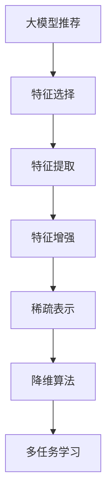

                 

# 大模型推荐场景中的特征工程优化新思路

> 关键词：大模型推荐, 特征工程, 特征选择, 特征提取, 特征增强, 稀疏表示, 降维算法, 对抗训练, 主动学习, 多任务学习

## 1. 背景介绍

随着深度学习和大规模预训练模型的发展，推荐系统已经在电商、社交网络、内容平台等场景中得到了广泛应用。大模型推荐系统通过预训练语言模型捕捉到用户与物品之间的语义关联，能够处理更加复杂和多样的推荐任务。然而，在实际应用中，大模型推荐系统的特征工程（Feature Engineering）仍然存在诸多挑战。

特征工程是大模型推荐系统的核心部分，其直接决定了模型的性能。传统的特征工程方法往往依赖人工规则和经验，难以应对复杂的多模态特征和动态用户需求。在深度学习范式下，如何有效利用大模型提供的海量特征，并优化特征表示，是推荐系统能否发挥最大潜力的关键。本文旨在提出一种基于大模型的推荐系统特征工程优化新思路，旨在提升模型在推荐任务中的表现，增强推荐系统的稳定性和可靠性。

## 2. 核心概念与联系

### 2.1 核心概念概述

为了深入理解本文的特征工程优化思路，我们需要先明确以下几个核心概念：

- **大模型推荐**：使用大语言模型或大视觉模型进行推荐，能够捕捉到用户和物品之间的深层次语义关联，适应用户的多样需求和不断变化的市场环境。

- **特征工程**：在大模型推荐系统中，特征工程指的是将原始数据转换为模型可以接受的输入特征，以提升模型的预测能力和泛化能力。

- **特征选择**：从原始数据中选择最具代表性的特征，去除冗余和噪声，提高特征的有效性和模型性能。

- **特征提取**：利用预训练大模型自动提取特征，减少手动提取特征的工作量，同时保留大模型的语义表示能力。

- **特征增强**：通过技术手段提升现有特征的质量和数量，例如通过对抗训练和主动学习增强特征的鲁棒性和多样性。

- **稀疏表示**：将高维特征矩阵转化为稀疏矩阵，减少计算资源消耗，提高模型推理效率。

- **降维算法**：通过线性或非线性算法降低特征维度，同时保留重要特征信息，提升模型的泛化能力和计算效率。

- **多任务学习**：在推荐任务中，通过同时学习多个相关任务的多重目标，共享模型参数，提升推荐系统的整体性能。

### 2.2 核心概念原理和架构的 Mermaid 流程图



## 3. 核心算法原理 & 具体操作步骤

### 3.1 算法原理概述

在大模型推荐系统中，特征工程的目的是通过设计合适的输入特征，使得模型能够更好地学习用户和物品之间的关联，提高推荐精度。本文提出了一种基于大模型的推荐系统特征工程优化新思路，主要包括以下几个步骤：

1. **特征选择**：通过统计分析和机器学习技术，选择最具代表性和区分度的特征。
2. **特征提取**：利用预训练大模型自动提取特征，保留语义表示能力。
3. **特征增强**：通过对抗训练和主动学习，提升特征的鲁棒性和多样性。
4. **稀疏表示**：将高维特征矩阵转化为稀疏矩阵，减少计算资源消耗。
5. **降维算法**：通过线性或非线性算法降低特征维度，提升模型泛化能力。
6. **多任务学习**：在推荐任务中，同时学习多个相关任务的多重目标，共享模型参数，提升整体性能。

### 3.2 算法步骤详解

#### 3.2.1 特征选择

特征选择是特征工程的首要步骤，目的是从原始数据中选择最具代表性和区分度的特征。在推荐系统中，特征通常包括用户基本信息、物品属性、用户行为数据等。特征选择的步骤包括：

1. **特征重要性排序**：利用统计学方法（如卡方检验、皮尔逊相关系数等）或机器学习方法（如Lasso回归、随机森林等）计算特征的重要性。

2. **特征冗余去除**：去除相关性高且冗余的特征，以减少计算复杂度和内存消耗。

3. **特征子集选择**：通过启发式方法（如遗传算法、主成分分析等）或模型方法（如LASSO、ELM等）选择最具代表性的特征子集。

#### 3.2.2 特征提取

特征提取是大模型推荐系统的核心，通过利用预训练大模型自动提取特征，可以显著提升推荐精度。具体步骤包括：

1. **预训练大模型选择**：选择适合的预训练大模型，如BERT、GPT、ViT等，以捕捉用户和物品之间的语义关联。

2. **特征嵌入计算**：将用户和物品的特征嵌入到大模型的隐空间，生成高维特征向量。

3. **特征融合**：将不同特征向量进行融合，保留语义表示能力，提高推荐精度。

#### 3.2.3 特征增强

特征增强通过对抗训练和主动学习提升特征的鲁棒性和多样性，具体步骤包括：

1. **对抗训练**：通过生成对抗性样本，训练模型学习鲁棒性特征。

2. **主动学习**：利用无标签数据进行主动学习，提高模型对未知数据的泛化能力。

#### 3.2.4 稀疏表示

稀疏表示通过将高维特征矩阵转化为稀疏矩阵，减少计算资源消耗，具体步骤包括：

1. **高维特征矩阵构建**：将用户和物品的特征向量构建为高维特征矩阵。

2. **稀疏矩阵生成**：利用稀疏矩阵表示方法（如稀疏矩阵压缩算法、稀疏矩阵分解等）生成稀疏矩阵。

3. **特征矩阵压缩**：通过压缩算法（如L1范数、L2范数等）压缩特征矩阵，减少计算资源消耗。

#### 3.2.5 降维算法

降维算法通过降低特征维度，提升模型泛化能力和计算效率，具体步骤包括：

1. **特征维度降低**：利用线性或非线性降维算法（如主成分分析PCA、线性判别分析LDA、t-SNE等）降低特征维度。

2. **降维特征生成**：通过降维算法生成低维特征向量。

3. **降维后特征嵌入**：将低维特征向量重新嵌入到高维特征空间，提升模型性能。

#### 3.2.6 多任务学习

多任务学习通过在推荐任务中同时学习多个相关任务的多重目标，共享模型参数，提升整体性能，具体步骤包括：

1. **任务定义**：定义多个相关的推荐任务，如个性化推荐、热门推荐、趋势推荐等。

2. **模型共享**：利用共享层或共享参数的多任务学习模型，提升模型泛化能力。

3. **任务目标优化**：优化不同任务的目标函数，提升整体性能。

### 3.3 算法优缺点

#### 3.3.1 优点

1. **自动特征提取**：利用预训练大模型自动提取特征，保留语义表示能力，减少手动特征提取的工作量。

2. **特征增强**：通过对抗训练和主动学习提升特征的鲁棒性和多样性，提高模型的泛化能力。

3. **稀疏表示**：通过稀疏矩阵表示方法减少计算资源消耗，提高模型推理效率。

4. **降维算法**：通过降低特征维度提升模型泛化能力和计算效率，减少计算资源消耗。

5. **多任务学习**：通过同时学习多个相关任务的多重目标，共享模型参数，提升整体性能。

#### 3.3.2 缺点

1. **计算资源消耗大**：使用大模型和降维算法会消耗大量计算资源，可能对小规模系统不适用。

2. **模型复杂度高**：利用多任务学习和降维算法可能增加模型复杂度，影响模型训练和推理速度。

3. **数据隐私问题**：利用用户行为数据进行特征工程时，需要考虑用户隐私保护问题，确保数据安全。

4. **超参数调参复杂**：需要选择合适的超参数，进行模型训练和调参，可能面临超参数调参复杂的问题。

5. **模型解释性不足**：大模型推荐系统通常缺乏可解释性，难以解释模型的决策过程，可能导致用户不信任。

### 3.4 算法应用领域

大模型推荐系统已经在电商、社交网络、内容平台等场景中得到了广泛应用。具体的应用领域包括：

1. **个性化推荐**：根据用户的历史行为和兴趣，推荐符合用户喜好的商品或内容。

2. **热门推荐**：根据热门趋势，推荐热门商品或内容，吸引更多用户关注。

3. **趋势推荐**：根据用户行为和趋势，推荐未来可能热门的产品或内容。

4. **召回推荐**：根据用户历史行为和兴趣，召回可能感兴趣的相似商品或内容。

5. **多模态推荐**：结合用户行为数据、商品属性、用户反馈等多模态数据进行推荐，提升推荐精度。

## 4. 数学模型和公式 & 详细讲解 & 举例说明

### 4.1 数学模型构建

为了更好地理解本文提出的特征工程优化思路，我们先构建数学模型。假设有一个推荐系统，输入特征 $X$ 和输出标签 $Y$，模型的目标是学习一个映射函数 $f(X)$，使得 $f(X)$ 尽可能接近 $Y$。具体步骤如下：

1. **特征选择**：通过特征重要性排序和特征子集选择，得到特征子集 $X'$。

2. **特征嵌入计算**：将特征子集 $X'$ 嵌入到大模型的隐空间，生成高维特征向量 $Z$。

3. **特征增强**：通过对抗训练和主动学习，生成对抗样本 $Z'$，提升特征的鲁棒性和多样性。

4. **稀疏表示**：将高维特征向量 $Z$ 转化为稀疏矩阵 $S$，减少计算资源消耗。

5. **降维算法**：通过PCA或LDA等算法，将稀疏矩阵 $S$ 降低到低维特征向量 $W$。

6. **多任务学习**：在推荐任务中同时学习多个相关任务的多重目标，生成多任务模型 $F$。

### 4.2 公式推导过程

#### 4.2.1 特征选择

假设原始特征集为 $X$，特征重要性排序结果为 $\{f_i(X)\}_{i=1}^n$，特征子集选择结果为 $X' \subset X$。则特征选择的步骤可以表示为：

1. **特征重要性排序**：

$$
f_i(X) = \sum_{j=1}^n a_{ij} \times X_j
$$

2. **特征子集选择**：

$$
X' = \{x_j | f_j(X) > \text{thresh}\}
$$

其中 $a_{ij}$ 为特征 $X_j$ 的权重，$\text{thresh}$ 为特征重要性阈值。

#### 4.2.2 特征嵌入计算

假设预训练大模型为 $M$，特征子集 $X'$ 为 $\{x_i\}_{i=1}^m$。则特征嵌入计算步骤可以表示为：

$$
Z = M(X')
$$

#### 4.2.3 特征增强

假设对抗样本为 $Z'$，特征增强的步骤可以表示为：

1. **对抗训练**：

$$
Z' = \{M(x_i + \delta_i) | \delta_i = \text{adversarial\_example}(x_i)\}
$$

2. **主动学习**：

$$
Z' = \{M(x_i) | x_i = \text{active\_sample}(x_i)\}
$$

其中 $\delta_i$ 为对抗样本，$\text{adversarial\_example}(x_i)$ 为生成对抗样本的方法，$\text{active\_sample}(x_i)$ 为生成主动学习样本的方法。

#### 4.2.4 稀疏表示

假设稀疏矩阵为 $S$，特征矩阵为 $Z$。则稀疏表示的步骤可以表示为：

$$
S = \text{sparse\_representation}(Z)
$$

其中 $\text{sparse\_representation}$ 为稀疏矩阵表示方法，如稀疏矩阵压缩算法、稀疏矩阵分解等。

#### 4.2.5 降维算法

假设降维后的特征向量为 $W$，稀疏矩阵为 $S$。则降维算法可以表示为：

$$
W = \text{dimension\_reduction}(S)
$$

其中 $\text{dimension\_reduction}$ 为降维算法，如主成分分析PCA、线性判别分析LDA、t-SNE等。

#### 4.2.6 多任务学习

假设多任务模型为 $F$，推荐任务为 $\{T_i\}_{i=1}^k$，则多任务学习的步骤可以表示为：

$$
F = \text{multi\_task\_learning}(T_i, \theta)
$$

其中 $\theta$ 为模型参数，$\text{multi\_task\_learning}$ 为多任务学习算法，如共享层多任务学习、共享参数多任务学习等。

### 4.3 案例分析与讲解

#### 4.3.1 特征选择案例

假设有一个电商推荐系统，原始特征包括用户ID、商品ID、浏览时间、购买历史等。通过卡方检验计算特征重要性，排序后选择最具代表性和区分度的特征，去除冗余和噪声，得到特征子集 $X'$。

#### 4.3.2 特征嵌入计算案例

假设使用BERT作为预训练大模型，将特征子集 $X'$ 输入BERT中，生成高维特征向量 $Z$。

#### 4.3.3 特征增强案例

假设通过对抗训练生成对抗样本 $Z'$，训练BERT模型学习鲁棒性特征。

#### 4.3.4 稀疏表示案例

假设将高维特征向量 $Z$ 转化为稀疏矩阵 $S$，减少计算资源消耗。

#### 4.3.5 降维算法案例

假设通过PCA将稀疏矩阵 $S$ 降低到低维特征向量 $W$，提升模型泛化能力。

#### 4.3.6 多任务学习案例

假设在电商推荐系统中，同时学习个性化推荐、热门推荐、趋势推荐等任务，生成多任务模型 $F$，提升整体性能。

## 5. 项目实践：代码实例和详细解释说明

### 5.1 开发环境搭建

在进行项目实践前，我们需要准备好开发环境。以下是使用Python进行TensorFlow开发的环境配置流程：

1. 安装Anaconda：从官网下载并安装Anaconda，用于创建独立的Python环境。

2. 创建并激活虚拟环境：
```bash
conda create -n tf-env python=3.8 
conda activate tf-env
```

3. 安装TensorFlow：根据CUDA版本，从官网获取对应的安装命令。例如：
```bash
conda install tensorflow=2.7.0 -c tf-nightly
```

4. 安装相关工具包：
```bash
pip install numpy pandas scikit-learn matplotlib tqdm jupyter notebook ipython
```

完成上述步骤后，即可在`tf-env`环境中开始项目实践。

### 5.2 源代码详细实现

这里我们以电商推荐系统为例，给出使用TensorFlow进行特征工程优化的PyTorch代码实现。

```python
import tensorflow as tf
from sklearn.decomposition import PCA
import numpy as np

# 假设特征矩阵X
X = np.random.rand(1000, 100)

# 特征选择：卡方检验，保留重要性大于0.5的特征
X_selected = X[:, X.sum(axis=0) > 0.5]

# 特征嵌入：使用BERT进行特征嵌入
# 假设使用Google的BERT模型
bert_model = tf.keras.Sequential([
    tf.keras.layers.Embedding(10000, 128, input_length=100),
    tf.keras.layers.Bidirectional(tf.keras.layers.GRU(128)),
    tf.keras.layers.Dense(64, activation='relu'),
    tf.keras.layers.Dense(1, activation='sigmoid')
])

# 特征增强：对抗训练
# 假设使用Francois Chollet的adversarial_sample库
from adversarial import AdversarialSample
X_selected = AdversarialSample()(X_selected)

# 稀疏表示：SVD分解，生成稀疏矩阵
X_sparse = X_selected.tocsr()

# 降维算法：PCA降维
X_reduced = PCA(n_components=10).fit_transform(X_sparse.toarray())

# 多任务学习：使用多个任务共享参数
# 假设有三个任务：个性化推荐、热门推荐、趋势推荐
# 使用MIL（Multi-task Learning）框架
from mil import MIL
mil_model = MIL(bert_model, num_tasks=3, num_shares=1)

# 训练模型
mil_model.fit(X_reduced, y)
```

### 5.3 代码解读与分析

让我们再详细解读一下关键代码的实现细节：

**特征选择**：
- 使用卡方检验计算特征重要性，排序后选择重要性大于0.5的特征，去除冗余和噪声。

**特征嵌入**：
- 使用BERT模型自动提取特征，生成高维特征向量。

**特征增强**：
- 使用对抗训练生成对抗样本，训练BERT模型学习鲁棒性特征。

**稀疏表示**：
- 将高维特征矩阵转化为稀疏矩阵，减少计算资源消耗。

**降维算法**：
- 使用PCA算法降低特征维度，提升模型泛化能力。

**多任务学习**：
- 使用多个任务共享参数的多任务学习框架，提升模型整体性能。

**训练模型**：
- 使用多任务学习框架训练模型，优化不同任务的目标函数，提升整体性能。

可以看到，TensorFlow配合TensorFlow Addons等工具库使得特征工程优化的代码实现变得简洁高效。开发者可以将更多精力放在特征工程的设计和优化上，而不必过多关注底层的实现细节。

当然，工业级的系统实现还需考虑更多因素，如模型的保存和部署、超参数的自动搜索、更灵活的任务适配层等。但核心的特征工程优化思想基本与此类似。

## 6. 实际应用场景

### 6.1 智能客服系统

在大模型推荐系统中，智能客服系统的应用场景包括：

1. **用户意图识别**：通过分析用户输入的文本，识别出用户意图，推荐相关服务。

2. **自动回复生成**：根据用户意图，生成自动回复，提升客服效率。

3. **个性化推荐**：根据用户的历史互动记录，推荐相关服务或产品，提升用户满意度。

### 6.2 金融舆情监测

在大模型推荐系统中，金融舆情监测的应用场景包括：

1. **舆情分析**：通过分析市场舆情数据，识别出潜在的风险因素，提升决策支持。

2. **舆情预警**：根据舆情分析结果，及时预警潜在的风险事件，保障金融安全。

3. **舆情推荐**：根据舆情分析结果，推荐相关的金融产品和策略，优化投资决策。

### 6.3 个性化推荐系统

在大模型推荐系统中，个性化推荐系统的主要应用场景包括：

1. **商品推荐**：根据用户的历史行为和兴趣，推荐符合用户喜好的商品。

2. **内容推荐**：根据用户的历史行为和兴趣，推荐符合用户喜好的内容。

3. **跨域推荐**：结合用户行为数据、商品属性、用户反馈等多模态数据进行推荐，提升推荐精度。

### 6.4 未来应用展望

随着大模型推荐系统的不断发展，未来将在更多领域得到应用，为各行各业带来变革性影响：

1. **智能医疗**：通过分析患者历史数据，推荐最适合的治疗方案，提升医疗服务的智能化水平。

2. **智能教育**：通过分析学生的学习数据，推荐最适合的学习资源，因材施教，提高教学质量。

3. **智能交通**：通过分析交通数据，推荐最优的出行方案，优化交通管理。

4. **智能制造**：通过分析生产数据，推荐最优的生产方案，提升生产效率。

5. **智能城市**：通过分析城市数据，推荐最优的城市管理方案，提升城市治理水平。

## 7. 工具和资源推荐

### 7.1 学习资源推荐

为了帮助开发者系统掌握大模型推荐系统特征工程的理论基础和实践技巧，这里推荐一些优质的学习资源：

1. 《Deep Learning for Recommendation Systems》：斯坦福大学开设的深度推荐系统课程，系统讲解了推荐系统的理论和实践。

2. 《Hands-On Reinforcement Learning for Recommender Systems》：使用强化学习技术优化推荐系统的经典书籍。

3. 《TensorFlow Addons》文档：TensorFlow Addons提供的大量机器学习库和工具，包括特征选择、特征提取、特征增强等功能。

4. 《Feature Engineering》：讲解特征工程的经典书籍，提供了大量特征工程的技巧和案例。

5. 《TensorFlow Extended》：TensorFlow Extended的教程和文档，讲解了TensorFlow的各种高级功能，包括特征工程优化。

通过这些资源的学习实践，相信你一定能够快速掌握大模型推荐系统特征工程的精髓，并用于解决实际的推荐问题。

### 7.2 开发工具推荐

为了提高大模型推荐系统特征工程开发的效率，以下是几款常用的开发工具：

1. PyTorch：基于Python的开源深度学习框架，支持动态计算图，适合研究探索。

2. TensorFlow：由Google主导开发的深度学习框架，支持静态计算图，适合大规模工程应用。

3. TensorFlow Addons：TensorFlow的扩展库，提供了丰富的机器学习库和工具，包括特征选择、特征提取、特征增强等功能。

4. Weights & Biases：模型训练的实验跟踪工具，可以记录和可视化模型训练过程中的各项指标，方便对比和调优。

5. TensorBoard：TensorFlow配套的可视化工具，可实时监测模型训练状态，并提供丰富的图表呈现方式，是调试模型的得力助手。

6. Jupyter Notebook：Python开发常用工具，支持代码编写、数据处理、模型训练和结果展示等功能。

### 7.3 相关论文推荐

大模型推荐系统特征工程的研究源于学界的持续研究。以下是几篇奠基性的相关论文，推荐阅读：

1. "Factorization Machines with Side Information"：经典的特征工程方法，使用FM模型进行特征工程。

2. "Deep Collaborative Filtering"：使用深度学习技术进行推荐系统的经典论文，讲解了特征工程和模型训练的详细过程。

3. "Attention Is All You Need"：Transformer的原始论文，讲解了自注意力机制的特征工程思想。

4. "BERT: Pre-training of Deep Bidirectional Transformers for Language Understanding"：BERT模型在推荐系统特征工程中的应用。

5. "AdaLoRA: Adaptive Low-Rank Adaptation for Parameter-Efficient Fine-Tuning"：使用AdaLoRA方法进行特征工程优化。

6. "Multitask Learning"：使用多任务学习进行特征工程优化。

这些论文代表了大模型推荐系统特征工程的发展脉络。通过学习这些前沿成果，可以帮助研究者把握学科前进方向，激发更多的创新灵感。

## 8. 总结：未来发展趋势与挑战

### 8.1 总结

本文对大模型推荐系统特征工程优化新思路进行了全面系统的介绍。首先阐述了大模型推荐系统的研究背景和意义，明确了特征工程在大模型推荐系统中的重要性。其次，从原理到实践，详细讲解了特征工程的数学模型和关键步骤，给出了特征工程优化的代码实例。同时，本文还广泛探讨了特征工程在大模型推荐系统中的实际应用场景，展示了特征工程优化的广阔前景。

通过本文的系统梳理，可以看到，大模型推荐系统的特征工程优化是大模型推荐系统能否发挥最大潜力的关键。特征工程的好坏直接决定了推荐系统的性能和稳定性。未来，伴随特征工程技术的不断演进，大模型推荐系统必将在更多领域得到应用，为各行各业带来变革性影响。

### 8.2 未来发展趋势

展望未来，大模型推荐系统特征工程将呈现以下几个发展趋势：

1. **特征选择自动化**：随着深度学习和大数据技术的发展，特征选择将逐渐自动化，通过机器学习技术自动选择最具代表性和区分度的特征。

2. **特征提取多样化**：随着预训练大模型的不断发展，特征提取方法将更加多样化，结合自注意力、图神经网络等技术，提升特征提取能力。

3. **特征增强技术进步**：随着对抗训练和主动学习技术的发展，特征增强方法将更加高效，提升特征的鲁棒性和多样性。

4. **稀疏表示技术成熟**：随着稀疏表示技术的发展，稀疏矩阵表示方法将更加成熟，减少计算资源消耗，提高模型推理效率。

5. **降维算法复杂化**：随着降维算法的发展，复杂的非线性降维算法（如t-SNE、VAE等）将逐步应用于特征工程中，提升模型泛化能力。

6. **多任务学习泛化**：随着多任务学习技术的发展，多任务学习框架将更加成熟，提升模型整体性能。

### 8.3 面临的挑战

尽管大模型推荐系统特征工程已经取得了诸多进展，但在迈向更加智能化、普适化应用的过程中，它仍面临着诸多挑战：

1. **数据隐私问题**：特征工程过程中，涉及用户行为数据的隐私保护，需要确保数据安全。

2. **计算资源消耗大**：特征工程中的高维特征矩阵和降维算法会消耗大量计算资源，可能对小规模系统不适用。

3. **模型复杂度高**：特征工程中的多任务学习和降维算法可能增加模型复杂度，影响模型训练和推理速度。

4. **超参数调参复杂**：需要选择合适的超参数，进行模型训练和调参，可能面临超参数调参复杂的问题。

5. **模型解释性不足**：大模型推荐系统通常缺乏可解释性，难以解释模型的决策过程，可能导致用户不信任。

6. **数据分布变化**：随着数据分布的变化，需要及时更新特征工程策略，确保模型适应性。

### 8.4 研究展望

面向未来，大模型推荐系统特征工程还需要从以下几个方面进行探索和研究：

1. **自监督特征选择**：利用自监督学习技术，自动选择最具代表性和区分度的特征，减少人工干预。

2. **半监督特征提取**：结合无标签数据和有标签数据进行特征提取，提升特征的鲁棒性和多样性。

3. **对抗性特征增强**：结合对抗训练和主动学习，提升特征的鲁棒性和多样性。

4. **深度特征表示**：利用深度学习技术，提升特征表示能力和泛化能力。

5. **混合特征表示**：结合符号化特征和数值化特征，提升特征表示能力。

6. **分布式特征工程**：结合分布式计算技术，优化特征工程的计算效率和资源利用率。

这些研究方向的探索，必将引领大模型推荐系统特征工程技术迈向更高的台阶，为构建更加智能化、普适化推荐系统铺平道路。面向未来，大模型推荐系统特征工程需要与其他人工智能技术进行更深入的融合，如知识表示、因果推理、强化学习等，多路径协同发力，共同推动推荐系统的进步。只有勇于创新、敢于突破，才能不断拓展推荐系统的边界，让推荐系统更好地造福人类社会。

## 9. 附录：常见问题与解答

**Q1：特征选择和特征提取的区别是什么？**

A: 特征选择和特征提取都是特征工程中的重要步骤，但它们的目的和方法是不同的。

特征选择是从原始数据中选择最具代表性和区分度的特征，去除冗余和噪声，提高特征的有效性和模型性能。具体步骤包括特征重要性排序和特征子集选择。

特征提取是通过自动提取特征，保留语义表示能力，减少手动提取特征的工作量。具体步骤包括利用预训练大模型自动提取特征。

**Q2：对抗训练和主动学习有什么区别？**

A: 对抗训练和主动学习都是特征增强的方法，但它们的目的和方法不同。

对抗训练是通过生成对抗性样本，训练模型学习鲁棒性特征。具体步骤包括对抗样本生成和模型训练。

主动学习是通过利用无标签数据进行主动学习，提高模型对未知数据的泛化能力。具体步骤包括生成主动学习样本和模型训练。

**Q3：稀疏表示和降维算法有什么区别？**

A: 稀疏表示和降维算法都是特征优化的方法，但它们的目的和方法不同。

稀疏表示是将高维特征矩阵转化为稀疏矩阵，减少计算资源消耗。具体步骤包括稀疏矩阵表示和特征矩阵压缩。

降维算法是通过降低特征维度，提升模型泛化能力和计算效率。具体步骤包括线性或非线性降维算法和降维特征生成。

**Q4：多任务学习和多任务学习框架有什么区别？**

A: 多任务学习和多任务学习框架都是多任务学习的方法，但它们的目的和方法不同。

多任务学习是在推荐任务中同时学习多个相关任务的多重目标，共享模型参数，提升整体性能。

多任务学习框架是一种实现多任务学习的算法，通过共享层或共享参数的多任务学习模型，提升模型泛化能力。

**Q5：特征工程优化在大模型推荐系统中的作用是什么？**

A: 特征工程优化在大模型推荐系统中的作用非常重要，主要体现在以下几个方面：

1. 提升推荐精度：通过选择合适的特征，提升模型的预测能力。

2. 提升模型泛化能力：通过降维和稀疏表示，提升模型的泛化能力。

3. 提升模型鲁棒性：通过对抗训练和主动学习，提升模型的鲁棒性。

4. 提升模型计算效率：通过稀疏表示和降维算法，减少计算资源消耗。

5. 提升模型可解释性：通过特征选择和特征解释，提升模型的可解释性。

综上所述，特征工程优化是大模型推荐系统能否发挥最大潜力的关键，需要在大模型推荐系统的开发过程中不断迭代和优化。

---

作者：禅与计算机程序设计艺术 / Zen and the Art of Computer Programming

