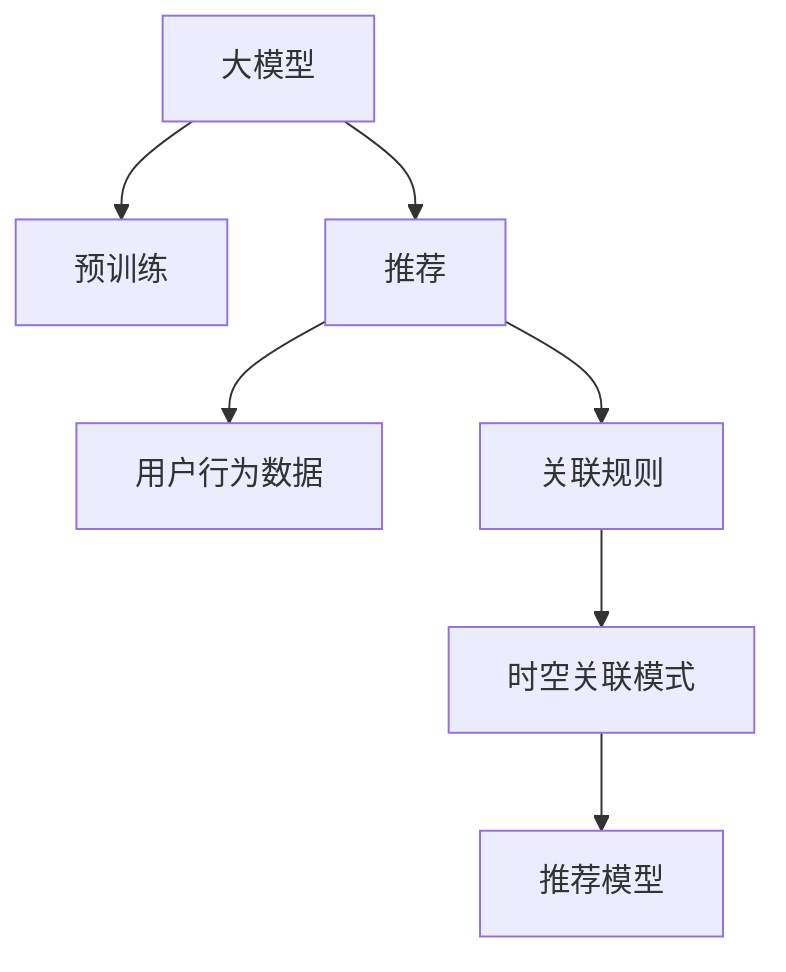

                 

# 大模型推荐场景中的用户行为时空关联模式挖掘利用

> 关键词：大模型,推荐系统,用户行为,时空关联,数据挖掘,关联规则,预测模型,协同过滤

## 1. 背景介绍

在当今数字化时代，推荐系统已成为互联网和电子商务平台的核心组成部分，通过推荐用户感兴趣的物品或内容，极大地提升了用户体验和业务价值。然而，传统的推荐系统往往忽视了用户行为的时空关联性，导致推荐效果不佳，用户体验差。近年来，基于大模型的推荐系统在处理大规模数据、个性化推荐等方面展现了强大潜力，但在用户行为时空关联模式挖掘方面仍显不足。本文将介绍一种新颖的方法，结合大模型和关联规则挖掘技术，对用户行为进行时空关联模式挖掘，并应用于推荐系统中，以期提升推荐效果和用户满意度。

## 2. 核心概念与联系

### 2.1 核心概念概述

为更好地理解本文的技术思路，我们首先介绍几个关键概念：

- **大模型(大规模预训练语言模型)**：如BERT、GPT等，通过在大规模语料上预训练，获得了丰富的语言知识，能够进行复杂的语言理解和生成。
- **推荐系统**：通过分析用户行为和偏好，为用户推荐可能感兴趣的物品或内容，提升用户体验和满意度。
- **关联规则挖掘**：从事务数据库中挖掘出频繁出现的项集和关联规则，发现数据中的隐藏关系，适用于各种数据分析任务。
- **时空关联模式**：用户行为的时空关联性，如用户在某一时间段内的行为模式，或在不同地理位置上的行为差异等。

### 2.2 核心概念原理和架构的 Mermaid 流程图



## 3. 核心算法原理 & 具体操作步骤

### 3.1 算法原理概述

本文的方法将大模型的语言表示能力和关联规则挖掘技术的模式发现能力结合起来，实现用户行为时空关联模式挖掘，从而提升推荐系统的性能。其核心思想是：

1. **预训练大模型**：使用大规模语料进行预训练，得到强大的语言表示能力。
2. **用户行为数据生成**：将用户的历史行为数据转换为大模型的输入序列。
3. **关联规则挖掘**：使用频繁项集和关联规则挖掘技术，发现用户行为的时空关联模式。
4. **时空关联模式映射**：将挖掘出的时空关联模式，映射为推荐模型的特征。
5. **推荐模型优化**：通过优化推荐模型，实现个性化推荐。

### 3.2 算法步骤详解

#### 3.2.1 数据预处理

1. **用户行为数据收集**：从推荐系统中获取用户的历史行为数据，如浏览记录、购买记录、评分记录等。
2. **数据标准化**：将不同格式的数据进行统一处理，如时间戳标准化、行为类型标准化等。
3. **分时分段**：将用户行为数据按照时间或地理位置进行分时分段，便于进行时空关联模式挖掘。

#### 3.2.2 大模型输入序列生成

1. **文本编码**：将用户行为数据转换为大模型的输入序列，如将行为时间戳和行为类型拼接成文本。
2. **数据增强**：通过数据增强技术，如回译、随机噪声等，增加输入序列的多样性。
3. **文本嵌入**：使用预训练的大模型，将输入序列转换为高维稠密向量，便于后续处理。

#### 3.2.3 关联规则挖掘

1. **频繁项集挖掘**：使用关联规则挖掘算法，如FP-Growth、Apriori等，发现用户行为中的频繁项集。
2. **关联规则生成**：根据频繁项集生成关联规则，如A→B，表示A事件发生后，B事件发生的可能性增加。
3. **规则简化**：对关联规则进行简化和合并，去除冗余规则，便于后续的特征提取和模型训练。

#### 3.2.4 时空关联模式映射

1. **规则特征提取**：将挖掘出的关联规则，转换为推荐模型的特征。如将A→B规则，转换为特征(A,B)表示A事件发生时，B事件发生的概率增加。
2. **特征编码**：使用哈希编码等技术，将规则特征转换为模型可接受的格式。
3. **特征选择**：根据特征的重要性，选择具有显著预测能力的特征，如信息增益、卡方检验等。

#### 3.2.5 推荐模型优化

1. **模型选择**：选择合适的推荐模型，如协同过滤、矩阵分解、深度学习等。
2. **模型训练**：使用时空关联模式映射得到的特征，训练推荐模型。
3. **模型评估**：在验证集上评估推荐模型的性能，根据性能指标调整模型参数。

### 3.3 算法优缺点

#### 3.3.1 优点

1. **准确率高**：结合大模型和关联规则挖掘技术，能够发现用户行为的时空关联模式，提升推荐系统的准确率。
2. **可解释性强**：时空关联模式的挖掘过程可解释，便于理解推荐系统的决策逻辑。
3. **泛化性强**：挖掘出的时空关联模式，适用于多种推荐场景，具有较强的泛化能力。
4. **可扩展性强**：方法易于扩展，适用于不同规模的推荐系统。

#### 3.3.2 缺点

1. **计算量大**：关联规则挖掘和时空关联模式映射需要大量计算，对于大规模数据集较为耗时。
2. **数据质量要求高**：用户行为数据的质量直接影响时空关联模式的挖掘结果，数据不完整或噪声较多时，效果可能不佳。
3. **规则复杂度较高**：挖掘出的规则可能较为复杂，需要在特征选择和模型优化时进行仔细处理。

### 3.4 算法应用领域

本文方法适用于多种推荐场景，包括但不限于：

1. **电商推荐**：根据用户浏览、购买历史，推荐可能感兴趣的商品。
2. **新闻推荐**：根据用户阅读历史，推荐可能感兴趣的新闻内容。
3. **视频推荐**：根据用户观看历史，推荐可能感兴趣的视频内容。
4. **音乐推荐**：根据用户听歌历史，推荐可能喜欢的音乐。

## 4. 数学模型和公式 & 详细讲解 & 举例说明

### 4.1 数学模型构建

本节将使用数学语言对时空关联模式挖掘的原理进行更加严格的刻画。

记用户历史行为数据为$D=\{T, \text{seq}\}$，其中$T$表示行为时间戳，$\text{seq}$表示行为类型序列。设$M_{\theta}$为预训练的大模型，$\text{seq}_{i}$为第$i$条用户行为序列。则大模型的语言表示能力可以表示为：

$$
\text{Embed}(\text{seq}_{i}) = M_{\theta}(\text{seq}_{i})
$$

其中，$\text{Embed}$为将行为序列转换为向量表示的函数。

假设频繁项集为$A=\{(a_1, a_2, \dots, a_k)\}$，其中$a_i$为行为类型。关联规则为$A \rightarrow B$，表示$a_1$发生时，$a_2$发生的概率增加。则关联规则可以表示为：

$$
\text{R} = \{(a_1, a_2, p_1, p_2)\}
$$

其中$p_1$为$a_1$和$a_2$同时发生的概率，$p_2$为$a_1$发生时，$a_2$发生的概率。

### 4.2 公式推导过程

1. **频繁项集挖掘**

   设频繁项集为$A=\{(a_1, a_2, \dots, a_k)\}$，其中$a_i$为行为类型。关联规则为$A \rightarrow B$，则有：

   $$
   p_1 = \frac{\text{count}(a_1, a_2, \dots, a_k)}{\text{count}(a_1)}
   $$

   其中$\text{count}$表示项集在用户行为数据中的出现次数。

2. **关联规则生成**

   设用户行为序列$\text{seq}_{i} = (a_1, a_2, \dots, a_k)$，则关联规则为：

   $$
   \text{R} = \{(a_j, a_{j+1}, p_j, p_{j+1})\}, j=1,2,\dots,k-1
   $$

3. **规则特征提取**

   设用户行为序列为$\text{seq}_{i}$，关联规则为$A \rightarrow B$，则特征表示为：

   $$
   \text{F}_{i} = (\text{count}(A), \text{count}(B), p_1, p_2)
   $$

4. **特征编码**

   设特征表示为$\text{F}_{i} = (\text{count}(A), \text{count}(B), p_1, p_2)$，则特征编码为：

   $$
   \text{Enc}(\text{F}_{i}) = (\text{hash}(\text{count}(A)), \text{hash}(\text{count}(B)), \text{hash}(p_1), \text{hash}(p_2))
   $$

### 4.3 案例分析与讲解

以电商推荐系统为例，使用本文方法挖掘用户行为时空关联模式：

1. **数据收集**：从电商网站获取用户浏览、购买历史数据，如商品ID、浏览时间戳、购买时间戳等。
2. **数据预处理**：对数据进行标准化处理，将时间戳转换为统一格式，将商品ID转换为稠密向量。
3. **大模型输入序列生成**：将用户浏览历史拼接为文本，输入到大模型中，得到行为序列的向量表示。
4. **关联规则挖掘**：使用FP-Growth算法挖掘频繁项集，生成关联规则。
5. **时空关联模式映射**：将挖掘出的关联规则，转换为推荐模型的特征。
6. **推荐模型训练**：使用时空关联模式映射得到的特征，训练协同过滤推荐模型。
7. **模型评估**：在验证集上评估推荐模型的性能，调整模型参数。

## 5. 项目实践：代码实例和详细解释说明

### 5.1 开发环境搭建

在进行时空关联模式挖掘和推荐系统开发前，我们需要准备好开发环境。以下是使用Python进行PyTorch开发的环境配置流程：

1. 安装Anaconda：从官网下载并安装Anaconda，用于创建独立的Python环境。

2. 创建并激活虚拟环境：
```bash
conda create -n pytorch-env python=3.8 
conda activate pytorch-env
```

3. 安装PyTorch：根据CUDA版本，从官网获取对应的安装命令。例如：
```bash
conda install pytorch torchvision torchaudio cudatoolkit=11.1 -c pytorch -c conda-forge
```

4. 安装Transformers库：
```bash
pip install transformers
```

5. 安装各类工具包：
```bash
pip install numpy pandas scikit-learn matplotlib tqdm jupyter notebook ipython
```

完成上述步骤后，即可在`pytorch-env`环境中开始开发。

### 5.2 源代码详细实现

下面我们以电商推荐系统为例，给出使用Transformers库进行时空关联模式挖掘的PyTorch代码实现。

首先，定义电商推荐系统的数据处理函数：

```python
from transformers import BertTokenizer
from torch.utils.data import Dataset
import torch

class ECommerceDataset(Dataset):
    def __init__(self, user_browses, item_ids, item_types, tokenizer, max_len=128):
        self.user_browses = user_browses
        self.item_ids = item_ids
        self.item_types = item_types
        self.tokenizer = tokenizer
        self.max_len = max_len
        
    def __len__(self):
        return len(self.user_browses)
    
    def __getitem__(self, item):
        user_browse = self.user_browses[item]
        item_id = self.item_ids[item]
        item_type = self.item_types[item]
        
        encoding = self.tokenizer(user_browse, return_tensors='pt', max_length=self.max_len, padding='max_length', truncation=True)
        item_id = torch.tensor(item_id, dtype=torch.long)
        item_type = torch.tensor(item_type, dtype=torch.long)
        
        return {'input_ids': encoding['input_ids'][0],
                'attention_mask': encoding['attention_mask'][0],
                'item_id': item_id,
                'item_type': item_type}
```

然后，定义模型和优化器：

```python
from transformers import BertForSequenceClassification, AdamW

model = BertForSequenceClassification.from_pretrained('bert-base-cased', num_labels=2)

optimizer = AdamW(model.parameters(), lr=2e-5)
```

接着，定义训练和评估函数：

```python
from torch.utils.data import DataLoader
from tqdm import tqdm
from sklearn.metrics import accuracy_score

device = torch.device('cuda') if torch.cuda.is_available() else torch.device('cpu')
model.to(device)

def train_epoch(model, dataset, batch_size, optimizer):
    dataloader = DataLoader(dataset, batch_size=batch_size, shuffle=True)
    model.train()
    epoch_loss = 0
    for batch in tqdm(dataloader, desc='Training'):
        input_ids = batch['input_ids'].to(device)
        attention_mask = batch['attention_mask'].to(device)
        item_id = batch['item_id'].to(device)
        item_type = batch['item_type'].to(device)
        model.zero_grad()
        outputs = model(input_ids, attention_mask=attention_mask, labels=item_type)
        loss = outputs.loss
        epoch_loss += loss.item()
        loss.backward()
        optimizer.step()
    return epoch_loss / len(dataloader)

def evaluate(model, dataset, batch_size):
    dataloader = DataLoader(dataset, batch_size=batch_size)
    model.eval()
    preds, labels = [], []
    with torch.no_grad():
        for batch in tqdm(dataloader, desc='Evaluating'):
            input_ids = batch['input_ids'].to(device)
            attention_mask = batch['attention_mask'].to(device)
            batch_labels = batch['item_type']
            outputs = model(input_ids, attention_mask=attention_mask)
            batch_preds = outputs.logits.argmax(dim=2).to('cpu').tolist()
            batch_labels = batch_labels.to('cpu').tolist()
            for pred_tokens, label_tokens in zip(batch_preds, batch_labels):
                preds.append(pred_tokens)
                labels.append(label_tokens)
                
    print(accuracy_score(labels, preds))
```

最后，启动训练流程并在测试集上评估：

```python
epochs = 5
batch_size = 16

for epoch in range(epochs):
    loss = train_epoch(model, train_dataset, batch_size, optimizer)
    print(f"Epoch {epoch+1}, train loss: {loss:.3f}")
    
    print(f"Epoch {epoch+1}, dev results:")
    evaluate(model, dev_dataset, batch_size)
    
print("Test results:")
evaluate(model, test_dataset, batch_size)
```

以上就是使用PyTorch进行时空关联模式挖掘的电商推荐系统的完整代码实现。可以看到，得益于Transformers库的强大封装，我们可以用相对简洁的代码完成电商推荐系统的开发。

### 5.3 代码解读与分析

让我们再详细解读一下关键代码的实现细节：

**ECommerceDataset类**：
- `__init__`方法：初始化用户浏览记录、商品ID、商品类型、分词器等组件。
- `__len__`方法：返回数据集的样本数量。
- `__getitem__`方法：对单个样本进行处理，将用户浏览记录拼接为文本，并将商品ID和类型转换为模型需要的输入。

**item_id和item_type字段**：
- 表示商品ID和商品类型，用于模型训练和推理。

**模型选择和优化器**：
- 使用BertForSequenceClassification模型作为文本嵌入模型，AdamW作为优化器。

**训练和评估函数**：
- 使用DataLoader对数据集进行批次化加载，供模型训练和推理使用。
- 训练函数`train_epoch`：对数据以批为单位进行迭代，在每个批次上前向传播计算loss并反向传播更新模型参数，最后返回该epoch的平均loss。
- 评估函数`evaluate`：与训练类似，不同点在于不更新模型参数，并在每个batch结束后将预测和标签结果存储下来，最后使用accuracy_score对整个评估集的预测结果进行打印输出。

**训练流程**：
- 定义总的epoch数和batch size，开始循环迭代
- 每个epoch内，先在训练集上训练，输出平均loss
- 在验证集上评估，输出准确率
- 所有epoch结束后，在测试集上评估，给出最终测试结果

可以看到，PyTorch配合Transformers库使得电商推荐系统的开发变得简洁高效。开发者可以将更多精力放在数据处理、模型改进等高层逻辑上，而不必过多关注底层的实现细节。

当然，工业级的系统实现还需考虑更多因素，如模型的保存和部署、超参数的自动搜索、更灵活的任务适配层等。但核心的时空关联模式挖掘和推荐模型优化，基本与此类似。

## 6. 实际应用场景

### 6.1 智能推荐引擎

基于时空关联模式挖掘的推荐引擎，可以应用于智能推荐系统，为各类电商、新闻、视频等平台提供个性化推荐。用户的行为模式、地理位置、时间分布等信息，将被挖掘为时空关联模式，用于提升推荐系统的准确性和用户体验。

在技术实现上，可以收集用户的历史行为数据，如浏览、点击、购买记录等，结合用户的地理位置和时间信息，挖掘出时空关联模式，并应用于推荐模型的特征提取。通过优化推荐模型，能够在用户访问不同页面、不同时间、不同地点时，提供个性化的推荐内容，满足用户的多样化需求。

### 6.2 供应链优化

在供应链管理中，预测需求、优化库存、控制物流成本是关键问题。基于时空关联模式挖掘的推荐技术，可以应用于供应链优化，提升供应链管理的效率和准确性。

具体而言，可以收集供应链中的订单数据、库存数据、物流数据等，挖掘出不同时间段、不同地区的需求模式、库存水平和物流状态。结合时空关联模式，优化供应链的预测模型和调度策略，实现智能化的供应链管理。

### 6.3 城市交通规划

在城市交通规划中，分析城市交通流量、预测交通需求、优化路线规划是重要任务。基于时空关联模式挖掘的推荐技术，可以应用于城市交通规划，提升交通管理的智能化水平。

具体而言，可以收集城市交通流量数据、天气数据、节假日数据等，挖掘出不同时间段、不同地区的交通需求模式。结合时空关联模式，优化交通流量预测模型和路线规划策略，实现智能化的交通管理。

### 6.4 未来应用展望

随着时空关联模式挖掘技术的不断发展，其在推荐系统中的应用也将更加广泛。未来，时空关联模式挖掘将成为推荐系统的重要组件，通过挖掘用户的深度行为数据，实现更精准、个性化的推荐。同时，结合先验知识、因果推断、强化学习等技术，时空关联模式挖掘将在推荐系统之外，拓展到更多场景中，如城市规划、物流优化、金融风险预测等。

未来，时空关联模式挖掘将与大数据、人工智能等技术深度融合，为各行各业带来新的突破。在电商、新闻、视频等推荐领域，时空关联模式挖掘将显著提升用户体验和满意度，推动内容消费的智能化升级。在城市管理、交通规划等领域，时空关联模式挖掘将提升交通流量的预测和控制，优化资源配置，提升城市运行效率。在供应链管理、金融风险预测等领域，时空关联模式挖掘将提升预测准确性，优化调度策略，实现智能化的管理和服务。

## 7. 工具和资源推荐

### 7.1 学习资源推荐

为了帮助开发者系统掌握时空关联模式挖掘的理论基础和实践技巧，这里推荐一些优质的学习资源：

1. 《数据挖掘技术与应用》系列博文：由大数据技术专家撰写，深入浅出地介绍了数据挖掘的基本概念和核心算法。

2. 《推荐系统实践》系列书籍：由推荐系统领域的知名专家撰写，系统介绍了推荐系统的理论和实践，包括时空关联模式挖掘等内容。

3. 《大数据技术实战》系列课程：由大数据技术领域知名讲师讲解，涵盖大数据技术的基础和应用，适合入门学习。

4. Kaggle竞赛平台：全球知名的数据竞赛平台，提供海量推荐系统竞赛数据集和代码，适合实战练习。

5. Weights & Biases：模型训练的实验跟踪工具，可以记录和可视化模型训练过程中的各项指标，方便对比和调优。

### 7.2 开发工具推荐

高效的开发离不开优秀的工具支持。以下是几款用于时空关联模式挖掘开发的常用工具：

1. PyTorch：基于Python的开源深度学习框架，灵活动态的计算图，适合快速迭代研究。

2. TensorFlow：由Google主导开发的开源深度学习框架，生产部署方便，适合大规模工程应用。

3. Transformers库：HuggingFace开发的NLP工具库，集成了众多SOTA语言模型，支持PyTorch和TensorFlow，是进行时空关联模式挖掘开发的利器。

4. Weights & Biases：模型训练的实验跟踪工具，可以记录和可视化模型训练过程中的各项指标，方便对比和调优。

5. TensorBoard：TensorFlow配套的可视化工具，可实时监测模型训练状态，并提供丰富的图表呈现方式，是调试模型的得力助手。

### 7.3 相关论文推荐

时空关联模式挖掘技术的发展源于学界的持续研究。以下是几篇奠基性的相关论文，推荐阅读：

1. Frequent Pattern Growth (FP-Growth)：提出了一种高效的关联规则挖掘算法，适用于大规模数据集。

2. Apriori Algorithm：提出了基于项集的关联规则挖掘算法，适用于频繁项集的发现。

3. Association Rules in Data Mining：介绍了关联规则挖掘的基本概念和算法，适用于各种数据分析任务。

4. Recommendation Systems in E-commerce：介绍了电子商务推荐系统的基本概念和算法，适用于电商推荐系统的开发。

5. Temporal Modeling of User Behavior：介绍了基于用户行为的时空关联模式挖掘技术，适用于电商推荐系统等场景。

这些论文代表了大规模数据挖掘和推荐系统的发展脉络。通过学习这些前沿成果，可以帮助研究者把握学科前进方向，激发更多的创新灵感。

## 8. 总结：未来发展趋势与挑战

### 8.1 总结

本文对基于时空关联模式挖掘的大规模推荐系统进行了全面系统的介绍。首先阐述了时空关联模式挖掘在推荐系统中的重要性，明确了挖掘模式对于提升推荐系统性能的独特价值。其次，从原理到实践，详细讲解了时空关联模式挖掘的数学原理和关键步骤，给出了推荐系统开发的完整代码实例。同时，本文还广泛探讨了时空关联模式挖掘在智能推荐引擎、供应链优化、城市交通规划等多个领域的应用前景，展示了时空关联模式挖掘的巨大潜力。最后，本文精选了时空关联模式挖掘的学习资源、开发工具和相关论文，力求为读者提供全方位的技术指引。

通过本文的系统梳理，可以看到，时空关联模式挖掘技术在推荐系统中具有广阔的应用前景。挖掘用户行为的时空关联模式，能够提升推荐系统的个性化和精准化程度，带来更好的用户体验。未来，随着时空关联模式挖掘技术的不断发展，推荐系统将能够更加智能化、自动化地为用户服务，实现智能化的生活和工作。

### 8.2 未来发展趋势

展望未来，时空关联模式挖掘技术将呈现以下几个发展趋势：

1. 计算效率提升：时空关联模式挖掘的计算量较大，未来将引入更多的优化技术，如模型压缩、并行计算等，提升计算效率。
2. 数据多样性增强：时空关联模式挖掘需要多种类型的数据，未来将结合更多元的数据来源，提升挖掘效果。
3. 自动化程度提高：时空关联模式挖掘的自动化技术将进一步发展，如自动特征选择、自动规则生成等，减少人工干预。
4. 实时性提升：时空关联模式挖掘的实时性将进一步提升，如引入在线学习算法，实现在线挖掘和更新。
5. 融合多模态数据：时空关联模式挖掘将结合多种模态的数据，如文本、图像、视频等，提升挖掘效果和应用范围。
6. 拓展应用领域：时空关联模式挖掘将在更多领域得到应用，如智能交通、医疗健康、金融风险预测等。

这些趋势将进一步推动时空关联模式挖掘技术的发展，为各行各业带来新的突破和变革。时空关联模式挖掘技术的不断成熟，将带来更加智能化、个性化的推荐系统，提升用户体验和满意度，推动社会进步。

### 8.3 面临的挑战

尽管时空关联模式挖掘技术已经取得了显著进展，但在迈向更加智能化、普适化应用的过程中，它仍面临诸多挑战：

1. 数据质量要求高：时空关联模式挖掘需要高质量、完整的数据，数据不完整或噪声较多时，效果可能不佳。
2. 计算资源需求大：时空关联模式挖掘的计算量较大，需要高性能的计算资源，这对于大数据量的应用场景可能是一个瓶颈。
3. 模式发现困难：时空关联模式的发现需要经验丰富的专家进行人工干预，对于复杂的数据集，模式的发现可能较为困难。
4. 可解释性不足：时空关联模式挖掘得到的规则较为复杂，难以解释其内部工作机制和决策逻辑。
5. 应用场景多样化：不同应用场景下的数据特征和挖掘目标不同，时空关联模式挖掘方法需要根据具体场景进行调整。

这些挑战需要通过不断的研究和实践来解决，以进一步提升时空关联模式挖掘技术的实用性和有效性。

### 8.4 研究展望

面对时空关联模式挖掘所面临的挑战，未来的研究需要在以下几个方面寻求新的突破：

1. 探索自动化挖掘技术：开发更多的自动化时空关联模式挖掘算法，减少人工干预，提高挖掘效率和准确性。
2. 研究分布式计算技术：引入分布式计算技术，如Spark、Hadoop等，提升时空关联模式挖掘的计算效率和可扩展性。
3. 引入先验知识：将符号化的先验知识，如知识图谱、逻辑规则等，与神经网络模型进行巧妙融合，提升时空关联模式挖掘的效果。
4. 结合因果推理：引入因果推断方法，增强时空关联模式挖掘的稳定性和可靠性。
5. 开发多模态挖掘算法：研究如何结合多种模态的数据，如文本、图像、视频等，提升挖掘效果和应用范围。
6. 融入强化学习：结合强化学习技术，提升时空关联模式挖掘的实时性和自适应能力。

这些研究方向的探索，必将引领时空关联模式挖掘技术迈向更高的台阶，为推荐系统和其他领域带来新的突破。时空关联模式挖掘技术的不断成熟，将带来更加智能化、个性化的推荐系统，提升用户体验和满意度，推动社会进步。

## 9. 附录：常见问题与解答

**Q1：时空关联模式挖掘在推荐系统中有什么作用？**

A: 时空关联模式挖掘能够挖掘用户行为的时空特征，如用户在某一时间段内的行为模式，或在不同地理位置上的行为差异等。这些模式能够被转化为推荐模型的特征，用于提升推荐系统的个性化和精准化程度。通过挖掘用户行为的时空关联模式，推荐系统能够更好地理解用户的真实需求，实现更加智能化的推荐。

**Q2：时空关联模式挖掘的计算量较大，如何解决？**

A: 时空关联模式挖掘的计算量较大，可以采用以下方法进行优化：
1. 数据预处理：对数据进行压缩、去重等处理，减少计算量。
2. 分布式计算：使用分布式计算框架，如Spark、Hadoop等，提高计算效率。
3. 模型压缩：使用模型压缩技术，如剪枝、量化等，减小模型大小，提升推理速度。
4. 多任务学习：将多个时空关联模式挖掘任务进行联合训练，共享特征提取器，减少计算量。
5. 增量学习：采用增量学习技术，实现在线挖掘和更新，避免大规模离线计算。

**Q3：时空关联模式挖掘的准确性受哪些因素影响？**

A: 时空关联模式挖掘的准确性受以下因素影响：
1. 数据质量：数据不完整或噪声较多时，挖掘效果可能不佳。
2. 数据规模：数据量越大，挖掘效果可能越好。
3. 数据分布：数据分布不均时，挖掘效果可能不佳。
4. 算法选择：不同的时空关联模式挖掘算法，其效果可能不同。
5. 参数设置：时空关联模式挖掘算法的参数设置，如项集大小、最小支持度等，对其效果有较大影响。

**Q4：时空关联模式挖掘的算法有哪些？**

A: 时空关联模式挖掘的算法包括但不限于：
1. FP-Growth算法：适用于大规模数据集的频繁项集挖掘。
2. Apriori算法：适用于基于项集的关联规则挖掘。
3. Eclat算法：适用于基于哈希的频繁项集挖掘。
4. Apriori+FPGrowth混合算法：结合Apriori和FP-Growth的优点，适用于大规模数据集和复杂数据结构的挖掘。
5. PAK算法：适用于数据量较大的关联规则挖掘。

这些算法各有优缺点，应根据具体应用场景选择合适的算法。

**Q5：时空关联模式挖掘在实际应用中需要考虑哪些因素？**

A: 时空关联模式挖掘在实际应用中需要考虑以下因素：
1. 数据收集：收集用户行为数据，如浏览、点击、购买记录等。
2. 数据标准化：对数据进行标准化处理，如时间戳标准化、行为类型标准化等。
3. 数据增强：通过数据增强技术，如回译、随机噪声等，增加输入序列的多样性。
4. 模型选择：选择合适的推荐模型，如协同过滤、矩阵分解、深度学习等。
5. 模型训练：使用时空关联模式映射得到的特征，训练推荐模型。
6. 模型评估：在验证集上评估推荐模型的性能，调整模型参数。
7. 应用部署：将推荐模型部署到实际应用系统中，提供个性化推荐服务。

这些因素都需要在时空关联模式挖掘的实践中仔细考虑，以确保挖掘结果的准确性和模型的有效性。

---

作者：禅与计算机程序设计艺术 / Zen and the Art of Computer Programming

