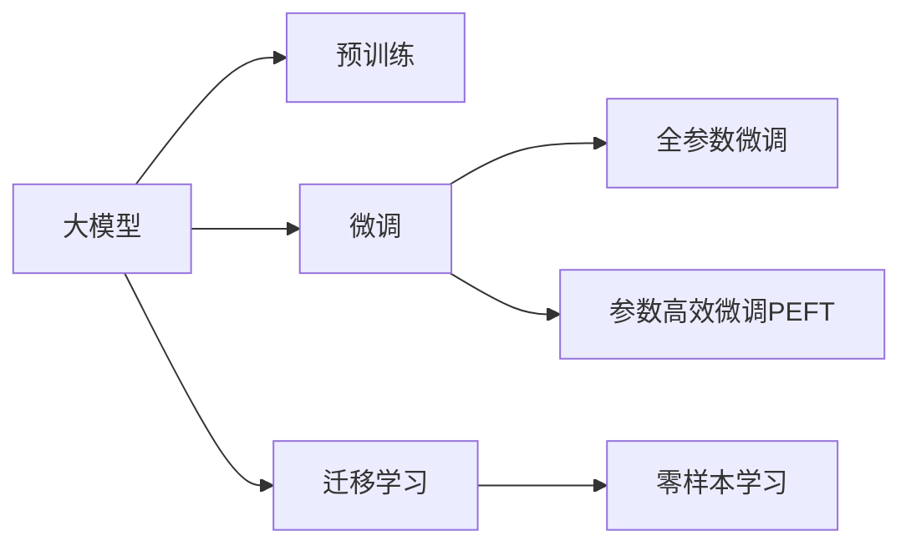

                 

## 1. 背景介绍

### 1.1 问题由来

随着大模型（如GPT-3、BERT等）在自然语言处理（NLP）领域的迅速崛起，我们正步入大模型时代。大模型通过在海量数据上进行预训练，积累了丰富的语言知识和上下文推理能力，为下游任务如对话、翻译、摘要等提供了强劲的驱动。Lepton AI作为一家致力于大模型技术的公司，正在积极探索大模型在多个领域的应用潜力，例如智能客服、自动摘要、个性化推荐等。

本文将通过与Lepton AI的首席科学家贾扬清博士的对话，深入探讨大模型的发展方向、技术瓶颈以及未来应用展望，揭示Lepton AI在大模型战略执行中的卓越执行力。

### 1.2 问题核心关键点

大模型时代，如何高效利用大模型，如何选择合适的微调方法，如何应对模型规模和计算资源限制，这些问题成为Lepton AI在研发和部署过程中需重点考虑的关键点。我们将围绕这些问题展开对话，共同探讨大模型时代的前沿技术和战略执行。

## 2. 核心概念与联系

### 2.1 核心概念概述

在讨论大模型的执行策略之前，我们先梳理一些核心概念：

- **大模型（Large Models）**：指通过在海量数据上进行预训练，具备强大语言生成和理解能力的深度学习模型，如GPT-3、BERT等。
- **微调（Fine-Tuning）**：在大模型基础上，通过下游任务的少量标注数据进行微调，使模型适应特定任务，例如自动摘要、对话系统等。
- **迁移学习（Transfer Learning）**：利用预训练模型在特定任务上的微调，以避免从头训练，加速模型开发。
- **持续学习（Continual Learning）**：模型能够不断学习新数据，避免过时信息的影响，保持模型的实时性和适应性。
- **零样本学习（Zero-shot Learning）**：模型在未见过的数据上直接进行推理，无需额外训练。

### 2.2 核心概念原理和架构的 Mermaid 流程图



这个流程图展示了从预训练到微调的整个流程，以及迁移学习和零样本学习在大模型中的应用。

## 3. 核心算法原理 & 具体操作步骤

### 3.1 算法原理概述

大模型的微调主要基于监督学习，通过在大规模无标签数据上进行预训练，然后利用下游任务的标注数据进行有监督微调，使得模型能够适应特定任务。微调的原理可以总结如下：

1. **预训练**：使用大规模无标签数据对大模型进行预训练，学习语言的通用表示。
2. **微调**：使用下游任务的标注数据对预训练模型进行有监督微调，学习特定任务的语言表示。
3. **迁移学习**：利用预训练模型作为迁移源，在下游任务上进行微调，提高模型适应性和泛化能力。

### 3.2 算法步骤详解

以下是大模型微调的主要步骤，每个步骤都有详细说明：

#### 3.2.1 准备预训练模型和数据集

- 选择合适的预训练模型，如GPT-3、BERT等。
- 准备下游任务的标注数据集，划分为训练集、验证集和测试集。

#### 3.2.2 添加任务适配层

- 根据任务类型，在预训练模型的基础上添加合适的输出层和损失函数。例如，对于分类任务，添加线性分类器和交叉熵损失函数；对于生成任务，使用解码器输出概率分布，并以负对数似然为损失函数。

#### 3.2.3 设置微调超参数

- 选择合适的优化算法及其参数，如AdamW、SGD等，设置学习率、批大小、迭代轮数等。
- 设置正则化技术及强度，包括权重衰减、Dropout、Early Stopping等。
- 确定冻结预训练参数的策略，如仅微调顶层，或全部参数都参与微调。

#### 3.2.4 执行梯度训练

- 将训练集数据分批次输入模型，前向传播计算损失函数。
- 反向传播计算参数梯度，根据设定的优化算法和学习率更新模型参数。
- 周期性在验证集上评估模型性能，根据性能指标决定是否触发 Early Stopping。
- 重复上述步骤直至满足预设的迭代轮数或 Early Stopping 条件。

#### 3.2.5 测试和部署

- 在测试集上评估微调后模型的性能，对比微调前后的精度提升。
- 使用微调后的模型对新样本进行推理预测，集成到实际的应用系统中。
- 持续收集新的数据，定期重新微调模型，以适应数据分布的变化。

### 3.3 算法优缺点

#### 3.3.1 优点

- **高效性**：微调过程不需要从头开始训练，只需少量标注数据，能够快速提升模型性能。
- **泛化能力**：通过迁移学习，模型能够适应多种下游任务，泛化能力强。
- **适应性**：能够动态更新模型参数，适应数据分布的变化。

#### 3.3.2 缺点

- **标注数据依赖**：微调效果依赖于标注数据的质量和数量，获取高质量标注数据的成本较高。
- **过拟合风险**：如果微调数据量过少，模型可能过拟合，泛化性能下降。
- **计算资源消耗**：大模型的参数规模庞大，微调需要大量计算资源。

### 3.4 算法应用领域

大模型微调技术广泛应用于以下几个领域：

- **自然语言处理（NLP）**：如文本分类、命名实体识别、关系抽取、问答系统、翻译等。
- **智能客服**：构建基于大模型的对话系统，提升客户服务体验。
- **金融舆情监测**：利用大模型进行情感分析和主题分类，监测金融舆情。
- **个性化推荐**：结合用户行为数据，实现高效、个性化的推荐系统。
- **智慧医疗**：利用大模型进行疾病诊断、医学知识检索等。

## 4. 数学模型和公式 & 详细讲解 & 举例说明

### 4.1 数学模型构建

假设大模型为 $M_{\theta}$，下游任务为 $T$，训练集为 $D=\{(x_i,y_i)\}_{i=1}^N$。微调的优化目标是：

$$
\theta^* = \mathop{\arg\min}_{\theta} \mathcal{L}(M_{\theta},D)
$$

其中 $\mathcal{L}$ 为任务 $T$ 的损失函数，通过梯度下降等优化算法求解。

### 4.2 公式推导过程

以文本分类任务为例，假设模型 $M_{\theta}$ 在输入 $x$ 上的输出为 $\hat{y}=M_{\theta}(x) \in [0,1]$，表示样本属于正类的概率。真实标签 $y \in \{0,1\}$。则二分类交叉熵损失函数定义为：

$$
\ell(M_{\theta}(x),y) = -[y\log \hat{y} + (1-y)\log (1-\hat{y})]
$$

将其代入经验风险公式：

$$
\mathcal{L}(\theta) = -\frac{1}{N}\sum_{i=1}^N [y_i\log M_{\theta}(x_i)+(1-y_i)\log(1-M_{\theta}(x_i))]
$$

根据链式法则，损失函数对参数 $\theta_k$ 的梯度为：

$$
\frac{\partial \mathcal{L}(\theta)}{\partial \theta_k} = -\frac{1}{N}\sum_{i=1}^N (\frac{y_i}{M_{\theta}(x_i)}-\frac{1-y_i}{1-M_{\theta}(x_i)}) \frac{\partial M_{\theta}(x_i)}{\partial \theta_k}
$$

其中 $\frac{\partial M_{\theta}(x_i)}{\partial \theta_k}$ 可通过自动微分技术高效计算。

### 4.3 案例分析与讲解

以BERT微调为例，BERT模型在处理自然语言文本时，通常采用掩码语言模型（Masked Language Model, MLM）和下一句预测（Next Sentence Prediction, NSP）任务进行预训练。微调时，可以选择以下两种方法：

1. **全参数微调**：更新模型全部参数。
2. **参数高效微调**：仅微调任务相关的参数，如语言模型的顶层和分类器的参数，其余参数保持不变。

## 5. 项目实践：代码实例和详细解释说明

### 5.1 开发环境搭建

在微调大模型之前，需要搭建好开发环境。以下是一个基本的Python环境配置示例：

```bash
conda create -n lepton-env python=3.8
conda activate lepton-env
pip install torch transformers
```

### 5.2 源代码详细实现

以BERT微调为例，以下是完整的代码实现：

```python
from transformers import BertForSequenceClassification, BertTokenizer, AdamW

# 定义模型和优化器
model = BertForSequenceClassification.from_pretrained('bert-base-uncased', num_labels=2)
optimizer = AdamW(model.parameters(), lr=2e-5)

# 定义任务适配层
class TaskAdapter:
    def __init__(self, num_labels):
        self.num_labels = num_labels
        self.linear = nn.Linear(768, num_labels)

    def forward(self, features):
        pooled_output = features.pooler_output
        logits = self.linear(pooled_output)
        return logits

    def init_weights(self):
        pass

# 定义模型训练函数
def train_epoch(model, data_loader, optimizer, device, task_adapter):
    model.to(device)
    model.train()
    epoch_loss = 0
    for batch in data_loader:
        input_ids = batch['input_ids'].to(device)
        attention_mask = batch['attention_mask'].to(device)
        labels = batch['labels'].to(device)
        outputs = model(input_ids, attention_mask=attention_mask)
        logits = task_adapter(outputs[0])
        loss = nn.CrossEntropyLoss()(logits, labels)
        epoch_loss += loss.item()
        optimizer.zero_grad()
        loss.backward()
        optimizer.step()
    return epoch_loss / len(data_loader)

# 定义模型评估函数
def evaluate(model, data_loader, device, task_adapter):
    model.eval()
    preds, labels = [], []
    with torch.no_grad():
        for batch in data_loader:
            input_ids = batch['input_ids'].to(device)
            attention_mask = batch['attention_mask'].to(device)
            labels = batch['labels'].to(device)
            outputs = model(input_ids, attention_mask=attention_mask)
            logits = task_adapter(outputs[0])
            preds.append(logits.argmax(dim=1).to('cpu').tolist())
            labels.append(labels.to('cpu').tolist())
    return classification_report(labels, preds)
```

### 5.3 代码解读与分析

以下是代码的详细解读：

- `BertForSequenceClassification`：定义了序列分类任务的大模型。
- `BertTokenizer`：定义了分词器，用于将输入文本转化为模型可接受的格式。
- `AdamW`：定义了优化器，用于参数更新。
- `TaskAdapter`：定义了任务适配层，将预训练模型的输出映射到分类任务。
- `train_epoch`：定义了训练函数，使用梯度下降更新模型参数。
- `evaluate`：定义了评估函数，计算模型在测试集上的性能。

## 6. 实际应用场景

### 6.1 智能客服系统

基于大模型的微调，可以实现智能客服系统。通过收集企业内部的历史客服对话记录，构建监督数据集，对预训练大模型进行微调，使其能够自动理解用户意图，匹配最合适的答案模板，生成回复。

### 6.2 金融舆情监测

通过大模型的微调，可以监测金融舆情。收集金融领域相关的新闻、报道、评论等文本数据，并对其进行主题标注和情感标注，训练微调后的模型自动判断文本属于何种主题，情感倾向是正面、中性还是负面，实时监测金融舆情。

### 6.3 个性化推荐系统

利用大模型的微调，可以实现个性化推荐系统。收集用户浏览、点击、评论、分享等行为数据，提取和用户交互的物品标题、描述、标签等文本内容，训练微调后的模型学习用户的兴趣点，实现高效、个性化的推荐。

### 6.4 未来应用展望

未来，大模型微调将应用于更多领域。例如：

- **智慧医疗**：利用大模型进行疾病诊断、医学知识检索等。
- **智能教育**：通过微调构建个性化学习系统，因材施教，提高教学质量。
- **智慧城市**：构建智能安防、城市事件监测等系统。
- **商业智能**：利用大模型进行市场分析、用户画像等。

## 7. 工具和资源推荐

### 7.1 学习资源推荐

- **《Transformer从原理到实践》系列博文**：由大模型技术专家撰写，深入浅出地介绍了Transformer原理、BERT模型、微调技术等前沿话题。
- **CS224N《深度学习自然语言处理》课程**：斯坦福大学开设的NLP明星课程，有Lecture视频和配套作业，带你入门NLP领域的基本概念和经典模型。
- **《Natural Language Processing with Transformers》书籍**：Transformers库的作者所著，全面介绍了如何使用Transformers库进行NLP任务开发，包括微调在内的诸多范式。
- **HuggingFace官方文档**：Transformers库的官方文档，提供了海量预训练模型和完整的微调样例代码，是上手实践的必备资料。
- **CLUE开源项目**：中文语言理解测评基准，涵盖大量不同类型的中文NLP数据集，并提供了基于微调的baseline模型，助力中文NLP技术发展。

### 7.2 开发工具推荐

- **PyTorch**：基于Python的开源深度学习框架，灵活动态的计算图，适合快速迭代研究。
- **TensorFlow**：由Google主导开发的开源深度学习框架，生产部署方便，适合大规模工程应用。
- **Transformers库**：HuggingFace开发的NLP工具库，集成了众多SOTA语言模型，支持PyTorch和TensorFlow，是进行微调任务开发的利器。
- **Weights & Biases**：模型训练的实验跟踪工具，可以记录和可视化模型训练过程中的各项指标，方便对比和调优。与主流深度学习框架无缝集成。
- **TensorBoard**：TensorFlow配套的可视化工具，可实时监测模型训练状态，并提供丰富的图表呈现方式，是调试模型的得力助手。
- **Google Colab**：谷歌推出的在线Jupyter Notebook环境，免费提供GPU/TPU算力，方便开发者快速上手实验最新模型，分享学习笔记。

### 7.3 相关论文推荐

- **Attention is All You Need**：提出了Transformer结构，开启了NLP领域的预训练大模型时代。
- **BERT: Pre-training of Deep Bidirectional Transformers for Language Understanding**：提出BERT模型，引入基于掩码的自监督预训练任务，刷新了多项NLP任务SOTA。
- **Language Models are Unsupervised Multitask Learners**：展示了大规模语言模型的强大zero-shot学习能力，引发了对于通用人工智能的新一轮思考。
- **Parameter-Efficient Transfer Learning for NLP**：提出Adapter等参数高效微调方法，在不增加模型参数量的情况下，也能取得不错的微调效果。
- **Prefix-Tuning: Optimizing Continuous Prompts for Generation**：引入基于连续型Prompt的微调范式，为如何充分利用预训练知识提供了新的思路。
- **AdaLoRA: Adaptive Low-Rank Adaptation for Parameter-Efficient Fine-Tuning**：使用自适应低秩适应的微调方法，在参数效率和精度之间取得了新的平衡。

## 8. 总结：未来发展趋势与挑战

### 8.1 研究成果总结

大模型微调技术在NLP领域取得了显著成果。通过微调，大模型能够适应多种下游任务，显著提升模型性能。微调方法也在不断优化，参数高效微调、零样本学习等技术日益成熟，为实际应用提供了更多的可能性。

### 8.2 未来发展趋势

未来，大模型微调技术将呈现以下发展趋势：

1. **模型规模持续增大**：预训练语言模型的参数量将继续增长，超大规模模型将具备更强的泛化能力。
2. **微调方法日趋多样**：除了传统的全参数微调，更多参数高效和计算高效的微调方法将涌现。
3. **持续学习成为常态**：微调模型需要不断学习新数据，避免过时信息的影响。
4. **少样本和零样本学习**：利用大模型的语言理解能力，通过巧妙的任务描述，在更少的标注样本上也能实现理想的效果。
5. **多模态微调崛起**：将视觉、语音等数据与文本信息结合，提升模型的综合能力。
6. **模型通用性增强**：经过海量数据的预训练和多领域任务的微调，大模型将具备更强的常识推理和跨领域迁移能力。

### 8.3 面临的挑战

尽管大模型微调技术取得了显著进展，但仍面临诸多挑战：

1. **标注数据瓶颈**：标注数据成本高，获取高质量标注数据难度大。
2. **模型鲁棒性不足**：微调模型面对域外数据时，泛化性能有限。
3. **推理效率问题**：大模型推理速度慢，内存占用大。
4. **可解释性不足**：微调模型的决策过程缺乏可解释性。
5. **安全性问题**：模型可能学习有害信息，产生误导性输出。
6. **知识整合能力不足**：模型难以有效整合外部知识。

### 8.4 研究展望

未来，大模型微调技术需要在以下几个方面进行深入研究：

1. **无监督和半监督微调**：摆脱对大规模标注数据的依赖。
2. **参数高效和计算高效微调**：开发更加参数高效和计算高效的微调方法。
3. **因果学习和对比学习**：增强模型的泛化性和鲁棒性。
4. **融合符号知识**：结合符号化的先验知识，提升模型的准确性。
5. **多模态融合**：将视觉、语音等多模态信息与文本信息结合。
6. **因果分析和博弈论**：增强模型的决策可解释性和稳定性。
7. **伦理和安全性**：确保模型的输出符合伦理和安全标准。

## 9. 附录：常见问题与解答

**Q1：大模型微调是否适用于所有NLP任务？**

A: 大模型微调在大多数NLP任务上都能取得不错的效果，特别是对于数据量较小的任务。但对于一些特定领域的任务，如医学、法律等，仅仅依靠通用语料预训练的模型可能难以很好地适应。

**Q2：微调过程中如何选择合适的学习率？**

A: 微调的学习率一般要比预训练时小1-2个数量级，如果使用过大的学习率，容易破坏预训练权重，导致过拟合。一般建议从1e-5开始调参，逐步减小学习率。

**Q3：采用大模型微调时会面临哪些资源瓶颈？**

A: 大模型的参数规模庞大，微调需要大量计算资源。GPU/TPU等高性能设备是必不可少的，但即便如此，超大批次的训练和推理也可能遇到显存不足的问题。

**Q4：如何缓解微调过程中的过拟合问题？**

A: 过拟合是微调面临的主要挑战，尤其是在标注数据不足的情况下。常见的缓解策略包括数据增强、正则化、对抗训练等。

**Q5：微调模型在落地部署时需要注意哪些问题？**

A: 在实际应用中，需要考虑模型的裁剪、量化加速、服务化封装、弹性伸缩、监控告警和安全防护等问题。

---

作者：禅与计算机程序设计艺术 / Zen and the Art of Computer Programming

