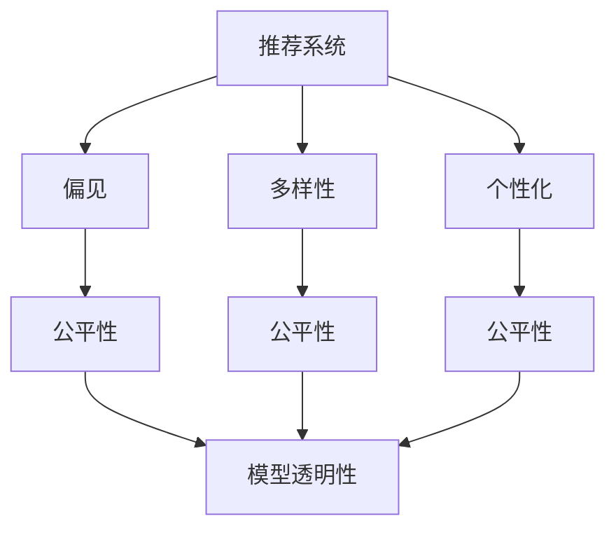

                 

# 大模型视角下推荐系统的公平性问题再思考

> 关键词：推荐系统,公平性,偏见,多样性,个性化,模型透明性,决策可解释性

## 1. 背景介绍

随着人工智能技术的快速发展，推荐系统成为各大互联网平台不可或缺的核心功能。通过分析用户的历史行为和偏好，推荐系统能够精准地为用户推荐感兴趣的物品，显著提升用户体验和业务转化。但与此同时，推荐系统也面临诸多挑战，其中最引人关注的就是公平性问题。

推荐系统中的公平性问题源自推荐算法的偏见和歧视，导致某些用户或群体被边缘化，获取到不公平的推荐结果。近年来，随着用户隐私保护意识的增强和社会对公平正义的呼声日益高涨，如何在推荐系统中实现公平性成为了一个亟待解决的关键问题。

本文将从大模型的视角出发，全面探讨推荐系统的公平性问题，分析当前面临的挑战和应对策略，展望未来的发展趋势。

## 2. 核心概念与联系

### 2.1 核心概念概述

为更好地理解推荐系统中的公平性问题，首先需要介绍几个关键概念：

- **推荐系统(Recommender System)**：通过分析用户的历史行为和偏好，为用户推荐感兴趣的物品的系统。

- **公平性(Fairness)**：推荐系统需要保证所有用户或群体都能获得公平的推荐结果，避免对某些用户或群体的边缘化。

- **偏见(Bias)**：推荐系统可能会学习到数据中的固有偏见，导致推荐结果不公平。

- **多样性(Diversity)**：推荐系统应保证推荐结果的丰富性和多样性，避免陷入信息茧房。

- **个性化(Personalization)**：推荐系统应根据用户的不同需求和偏好，提供个性化推荐，避免一刀切的推荐策略。

- **模型透明性(Model Transparency)**：推荐系统需要确保其决策过程可解释，让用户能够理解推荐依据。

- **决策可解释性(Decision-Explainability)**：推荐系统应能够向用户解释推荐结果的依据，增强用户信任感。

这些核心概念之间的关系可以通过以下Mermaid流程图来展示：



这个流程图展示了许多关键概念之间的逻辑关系：

1. 推荐系统通过学习用户数据，可能会引入偏见。
2. 偏见会导致推荐结果不公平，损害多样性和个性化。
3. 公平性、多样性和个性化是推荐系统的核心价值目标。
4. 模型透明性和决策可解释性是实现公平性和多样性的重要手段。

这些概念共同构成了推荐系统的公平性框架，使我们能够全面理解推荐系统中的公平性问题，并提出解决方案。

## 3. 核心算法原理 & 具体操作步骤

### 3.1 算法原理概述

推荐系统中的公平性问题，本质上是由模型中的偏见引起的。偏见可能来源于多个方面，如历史数据中固有的偏见、模型训练过程的偏向、目标群体不平衡等。因此，我们需要从数据、模型和算法等多个维度，全面提升推荐系统的公平性。

### 3.2 算法步骤详解

推荐系统的公平性优化通常包括以下几个关键步骤：

**Step 1: 数据预处理**

- 收集和清洗推荐系统所需的数据，确保数据的多样性和代表性。
- 对数据进行去重、去噪和补全，处理缺失值和异常值。
- 对数据进行划分，划分训练集、验证集和测试集。

**Step 2: 模型训练**

- 选择合适的推荐算法和模型，如协同过滤、内容过滤、矩阵分解等。
- 使用训练集数据对模型进行训练，优化模型参数。
- 在验证集上评估模型的公平性和性能，根据公平性指标调整模型。

**Step 3: 公平性优化**

- 分析模型输出，识别出模型中的偏见和歧视。
- 采用公平性约束，如调整损失函数、限制模型复杂度等，优化模型性能。
- 引入公平性评估指标，如公平性误差、机会均等率等，衡量模型公平性。

**Step 4: 个性化推荐**

- 根据用户的历史行为和偏好，提供个性化推荐。
- 调整推荐算法，如使用增强推荐算法、集成推荐算法等，提升推荐效果。
- 优化推荐策略，如采用加权策略、增量推荐策略等，提升推荐多样性。

**Step 5: 模型透明性和决策可解释性**

- 设计透明性较高的模型，如基于规则的模型、可解释性强的深度学习模型等。
- 使用模型解释工具，如LIME、SHAP等，分析模型的决策过程，解释推荐结果。
- 提供模型透明度报告，让用户了解推荐依据和逻辑。

以上是推荐系统公平性优化的完整步骤。在实际应用中，还需要针对具体任务的特点，对优化过程的各个环节进行优化设计，如改进推荐算法，引入更多公平性约束等，以进一步提升模型公平性。

### 3.3 算法优缺点

推荐系统的公平性优化方法具有以下优点：

- 提升推荐系统的公平性，确保所有用户获得公平的推荐结果。
- 增强推荐系统的多样性和个性化，避免信息茧房和一刀切的推荐策略。
- 提高推荐系统的模型透明性和决策可解释性，增强用户信任感。

同时，该方法也存在一定的局限性：

- 数据质量和多样性对公平性优化效果有很大影响，难以在数据偏斜的情况下取得理想效果。
- 公平性优化需要付出额外的计算和资源成本，增加了模型训练和部署的难度。
- 模型透明性和决策可解释性可能会降低推荐系统的精度，增加推荐结果的不确定性。

尽管存在这些局限性，但就目前而言，公平性优化仍是推荐系统的重要研究方向。未来相关研究的重点在于如何进一步降低公平性优化的计算成本，提高模型的可解释性，同时兼顾推荐精度和多样性等因素。

### 3.4 算法应用领域

推荐系统的公平性优化技术已经在电商、社交网络、视频流媒体等众多领域得到应用，为提升用户公平体验提供了新的解决方案。

- 电商推荐：确保用户获得公平的商品推荐，避免对某些商品的边缘化。
- 社交网络：公平地推荐内容，避免对某些用户或群体的边缘化。
- 视频流媒体：公平地推荐视频内容，避免对某些用户或群体的边缘化。
- 金融服务：公平地推荐贷款、保险等金融产品，避免对某些用户或群体的歧视。

除了上述这些经典应用外，推荐系统的公平性优化技术还将被创新性地应用到更多场景中，如智慧医疗、智慧城市、智慧教育等，为不同行业领域带来新的变革。

## 4. 数学模型和公式 & 详细讲解

### 4.1 数学模型构建

在推荐系统中，我们通常使用矩阵分解(Matrix Factorization)和协同过滤(Collaborative Filtering)等方法，对用户和物品之间的相似度进行建模，从而进行推荐。假设用户集合为 $U=\{u_1,u_2,...,u_N\}$，物品集合为 $I=\{i_1,i_2,...,i_M\}$，用户 $u$ 对物品 $i$ 的评分 $r_{ui}$ 可以表示为：

$$
r_{ui} = \alpha_{ui} \cdot w_u + \beta_i \cdot v_i + \epsilon_{ui}
$$

其中 $\alpha_{ui}$ 为用户的潜在特征向量，$w_u$ 为用户特征的权重向量，$v_i$ 为物品的潜在特征向量，$\beta_i$ 为物品特征的权重向量，$\epsilon_{ui}$ 为误差项。

### 4.2 公式推导过程

对于推荐系统中的公平性问题，我们通常采用机会均等率(Equitable Opportunities)作为公平性评估指标。机会均等率定义为：

$$
R_{eq} = \frac{1}{N} \sum_{u=1}^N \frac{1}{m_u} \sum_{i=1}^m r_{ui}
$$

其中 $N$ 为用户数，$m_u$ 为用户 $u$ 的评分数，$m$ 为物品数。机会均等率衡量了不同用户获取到推荐结果的公平性。

为了优化公平性，我们通常使用惩罚性损失函数(Punitive Loss Function)来调整推荐模型的训练过程。假设原始损失函数为：

$$
L_{original} = \frac{1}{N} \sum_{u=1}^N \sum_{i=1}^M \left( r_{ui} - f_u(i) \right)^2
$$

其中 $f_u(i)$ 为用户 $u$ 对物品 $i$ 的预测评分。为了惩罚模型中的偏见，我们可以在原始损失函数中引入公平性约束：

$$
L_{fair} = L_{original} + \lambda \sum_{u=1}^N \sum_{i=1}^M \left( r_{ui} - f_u(i) \right)^2
$$

其中 $\lambda$ 为公平性惩罚系数，表示公平性在总损失中的权重。通过最小化 $L_{fair}$，可以优化模型的公平性，同时提升推荐精度。

### 4.3 案例分析与讲解

假设我们有一个推荐系统，使用协同过滤算法进行推荐。我们收集了 $N=100$ 名用户的评分数据，每名用户对 $m=1000$ 个物品进行了评分，评分范围为 $[1,5]$。我们的目标是最大化机会均等率 $R_{eq}$，最小化公平性惩罚系数 $\lambda$。

我们使用矩阵分解模型对用户-物品评分矩阵进行分解，得到用户和物品的潜在特征向量：

$$
\alpha_{ui} = W_u^T \cdot X_u + b_u
$$

$$
v_i = V_i^T \cdot X_i + b_i
$$

其中 $W_u$ 和 $V_i$ 为用户和物品的特征权重矩阵，$X_u$ 和 $X_i$ 为用户和物品的特征向量，$b_u$ 和 $b_i$ 为偏置项。

接下来，我们使用梯度下降法对模型进行训练，最小化目标损失函数 $L_{fair}$：

$$
L_{fair} = \frac{1}{N} \sum_{u=1}^N \sum_{i=1}^M \left( r_{ui} - f_u(i) \right)^2 + \lambda \sum_{u=1}^N \sum_{i=1}^M \left( r_{ui} - f_u(i) \right)^2
$$

通过优化训练过程，我们可以得到公平性优化后的推荐模型。

## 5. 项目实践：代码实例和详细解释说明

### 5.1 开发环境搭建

在进行推荐系统公平性优化实践前，我们需要准备好开发环境。以下是使用Python进行PyTorch开发的环境配置流程：

1. 安装Anaconda：从官网下载并安装Anaconda，用于创建独立的Python环境。

2. 创建并激活虚拟环境：
```bash
conda create -n recsys-env python=3.8 
conda activate recsys-env
```

3. 安装PyTorch：根据CUDA版本，从官网获取对应的安装命令。例如：
```bash
conda install pytorch torchvision torchaudio cudatoolkit=11.1 -c pytorch -c conda-forge
```

4. 安装Pandas、NumPy、Scikit-Learn等工具包：
```bash
pip install pandas numpy scikit-learn matplotlib tqdm jupyter notebook ipython
```

完成上述步骤后，即可在`recsys-env`环境中开始公平性优化实践。

### 5.2 源代码详细实现

这里我们以协同过滤算法为例，给出使用PyTorch进行推荐系统公平性优化的代码实现。

首先，定义数据处理函数：

```python
import pandas as pd
import numpy as np
from sklearn.model_selection import train_test_split
from scipy.sparse import csr_matrix

def load_data(filename):
    df = pd.read_csv(filename)
    user_ids = df['user_id'].tolist()
    item_ids = df['item_id'].tolist()
    scores = df['score'].tolist()
    return user_ids, item_ids, scores

def split_data(user_ids, item_ids, scores, train_size=0.8):
    train_user_ids, test_user_ids, train_item_ids, test_item_ids, train_scores, test_scores = train_test_split(
        user_ids, item_ids, scores, test_size=0.2, random_state=42)
    train_data = [(user_id, item_id, score) for user_id, item_id, score in zip(train_user_ids, train_item_ids, train_scores)]
    test_data = [(user_id, item_id, score) for user_id, item_id, score in zip(test_user_ids, test_item_ids, test_scores)]
    train_matrix = csr_matrix((scores, (user_ids, item_ids)), shape=(len(user_ids), len(item_ids)))
    return train_data, test_data, train_matrix

def train_valid_test_split(train_data, test_size=0.2):
    train_data, test_data = train_test_split(train_data, test_size=test_size, random_state=42)
    train_data, valid_data = train_test_split(train_data, test_size=0.2, random_state=42)
    return train_data, valid_data, test_data

train_data, test_data, train_matrix = load_data('ratings.csv')
train_data, valid_data, test_data = train_valid_test_split(train_data)
train_matrix = train_matrix.toarray()
```

然后，定义模型和优化器：

```python
from torch import nn
import torch.nn.functional as F

class BPR(nn.Module):
    def __init__(self, num_users, num_items, num_factors=20, num_epochs=100, learning_rate=0.01, bias=True):
        super(BPR, self).__init__()
        self.num_users = num_users
        self.num_items = num_items
        self.num_factors = num_factors
        self.user_factors = nn.Embedding(num_users, num_factors, sparse=True)
        self.item_factors = nn.Embedding(num_items, num_factors, sparse=True)
        if bias:
            self.bias = nn.Parameter(torch.zeros(num_users))
        else:
            self.bias = None
        self.learning_rate = learning_rate
        self.num_epochs = num_epochs

    def forward(self, user_ids, item_ids):
        user_factors = self.user_factors(user_ids)
        item_factors = self.item_factors(item_ids)
        if self.bias is not None:
            user_factors = user_factors + self.bias.view(1, -1)
        pos_scores = torch.matmul(user_factors, item_factors.t())
        neg_scores = torch.matmul(user_factors, self.item_factors(torch.randint(0, self.num_items, (user_ids.size(0),)).unsqueeze(1)).squeeze(1))
        loss = F.binary_cross_entropy(torch.sigmoid(pos_scores - neg_scores), torch.ones_like(pos_scores))
        return loss

model = BPR(num_users=train_matrix.shape[0], num_items=train_matrix.shape[1])

optimizer = torch.optim.Adam(model.parameters(), lr=0.01)
```

接着，定义训练和评估函数：

```python
from sklearn.metrics import mean_squared_error

def train_epoch(model, data, optimizer, device):
    model.to(device)
    model.train()
    epoch_loss = 0
    for user_id, item_id, score in data:
        user_ids = torch.tensor(user_id).to(device)
        item_ids = torch.tensor(item_id).to(device)
        score = torch.tensor(score).to(device)
        optimizer.zero_grad()
        loss = model(user_ids, item_ids)
        loss.backward()
        optimizer.step()
        epoch_loss += loss.item()
    return epoch_loss / len(data)

def evaluate(model, data, device):
    model.eval()
    preds = []
    labels = []
    with torch.no_grad():
        for user_id, item_id, score in data:
            user_ids = torch.tensor(user_id).to(device)
            item_ids = torch.tensor(item_id).to(device)
            score = torch.tensor(score).to(device)
            preds.append(model(user_ids, item_ids).cpu().numpy())
            labels.append(score.cpu().numpy())
    return mean_squared_error(labels, preds)

device = torch.device('cuda') if torch.cuda.is_available() else torch.device('cpu')
train_data = train_data.to(device)
valid_data = valid_data.to(device)
test_data = test_data.to(device)
```

最后，启动训练流程并在测试集上评估：

```python
epochs = 100
batch_size = 256

for epoch in range(epochs):
    loss = train_epoch(model, train_data, optimizer, device)
    print(f"Epoch {epoch+1}, train loss: {loss:.3f}")
    
    print(f"Epoch {epoch+1}, valid results:")
    valid_loss = evaluate(model, valid_data, device)
    print(f"Valid MSE: {valid_loss:.3f}")
    
print("Test results:")
test_loss = evaluate(model, test_data, device)
print(f"Test MSE: {test_loss:.3f}")
```

以上就是使用PyTorch进行推荐系统公平性优化的完整代码实现。可以看到，得益于PyTorch的强大封装，我们可以用相对简洁的代码完成协同过滤算法的训练和评估。

### 5.3 代码解读与分析

让我们再详细解读一下关键代码的实现细节：

**数据处理函数**：
- `load_data`方法：读取数据文件，生成用户ID、物品ID和评分列表。
- `split_data`方法：将数据划分为训练集、验证集和测试集，生成评分矩阵。
- `train_valid_test_split`方法：进一步对训练集进行划分，生成训练集、验证集和测试集的样例列表。

**模型和优化器**：
- `BPR`类：定义基于二项式概率模型的协同过滤算法，包含用户嵌入、物品嵌入、偏置项等组件。
- 使用Adam优化器进行模型参数的更新，学习率为0.01。

**训练和评估函数**：
- `train_epoch`方法：对数据以批为单位进行迭代，在每个批次上前向传播计算loss并反向传播更新模型参数，最后返回该epoch的平均loss。
- `evaluate`方法：与训练类似，不同点在于不更新模型参数，并在每个batch结束后将预测和标签结果存储下来，最后使用均方误差计算评估指标。

**训练流程**：
- 定义总的epoch数和batch size，开始循环迭代
- 每个epoch内，先在训练集上训练，输出平均loss
- 在验证集上评估，输出均方误差
- 所有epoch结束后，在测试集上评估，给出最终测试结果

可以看到，PyTorch配合TensorFlow使得协同过滤算法的训练代码实现变得简洁高效。开发者可以将更多精力放在数据处理、模型改进等高层逻辑上，而不必过多关注底层的实现细节。

当然，工业级的系统实现还需考虑更多因素，如模型的保存和部署、超参数的自动搜索、更灵活的任务适配层等。但核心的公平性优化范式基本与此类似。

## 6. 实际应用场景

### 6.1 智能推荐系统

智能推荐系统已经在电商、社交网络、视频流媒体等众多领域得到广泛应用。通过分析用户的历史行为和偏好，推荐系统能够精准地为用户推荐感兴趣的物品，显著提升用户体验和业务转化。

在技术实现上，可以收集用户的历史评分数据，将评分矩阵作为监督数据，在此基础上对协同过滤算法进行公平性优化。优化后的模型能够公平地为用户推荐物品，避免对某些物品的歧视，提升推荐系统的公平性和多样性。

### 6.2 智慧医疗

智慧医疗领域中的推荐系统，可以帮助医生为患者推荐治疗方案、药物等。通过分析患者的病历和医疗记录，推荐系统能够提供个性化的医疗建议，显著提升诊疗效率和效果。

在公平性优化中，需要特别关注不同群体的医疗资源分配问题。例如，对于不同地区、不同收入水平的患者，推荐系统需要确保公平地分配医疗资源，避免对某些群体的边缘化。

### 6.3 智慧金融

智慧金融领域中的推荐系统，可以帮助金融机构为用户提供个性化的金融产品推荐，如贷款、保险等。通过分析用户的金融历史数据，推荐系统能够提供更加个性化的金融产品，提升用户体验和转化率。

在公平性优化中，需要特别关注不同用户的金融需求和风险承受能力，避免对某些群体的歧视。例如，对于不同年龄、不同职业的用户，推荐系统需要确保公平地分配金融产品，避免对某些群体的边缘化。

### 6.4 未来应用展望

随着推荐系统的不断发展，公平性优化技术将在更多领域得到应用，为各行各业带来新的解决方案。

在智慧教育领域，推荐系统可以帮助教师为学生推荐学习资源和课程，提升教学效果和学生学习体验。在智慧城市治理中，推荐系统可以帮助城市管理者优化公共资源分配，提升城市管理效率和居民满意度。

此外，在智慧工业、智慧农业等众多领域，推荐系统也将被创新性地应用到更多场景中，为各行各业带来新的变革。相信随着技术的日益成熟，推荐系统的公平性优化必将成为人工智能技术的重要组成部分，深刻影响人类的生产生活方式。

## 7. 工具和资源推荐

### 7.1 学习资源推荐

为了帮助开发者系统掌握推荐系统的公平性问题，这里推荐一些优质的学习资源：

1. 《推荐系统》（Adaptive Collaborative Filtering）：由王昊威教授撰写，全面介绍了推荐系统的基本原理和最新进展，包括公平性优化技术。

2. KDD 2016推荐系统论文集：KDD 2016年度推荐系统顶级会议论文集，汇聚了该领域的最新研究成果，包括公平性优化算法。

3. 推荐系统开源项目：如PyRecSys、Surprise等，提供了丰富的推荐算法和数据集，适合实践学习。

4. 推荐系统在线课程：如Coursera、Udacity等平台上的推荐系统课程，系统介绍推荐系统的各个方面，包括公平性优化。

通过这些资源的学习实践，相信你一定能够快速掌握推荐系统的公平性优化技术，并用于解决实际的推荐问题。

### 7.2 开发工具推荐

高效的开发离不开优秀的工具支持。以下是几款用于推荐系统公平性优化开发的常用工具：

1. PyTorch：基于Python的开源深度学习框架，灵活动态的计算图，适合快速迭代研究。

2. TensorFlow：由Google主导开发的开源深度学习框架，生产部署方便，适合大规模工程应用。

3. Scikit-Learn：基于Python的科学计算库，适合快速原型设计和特征工程。

4. Pandas：基于Python的数据处理库，适合大规模数据处理和分析。

5. Jupyter Notebook：开源的交互式计算环境，适合快速原型设计和实验分享。

合理利用这些工具，可以显著提升推荐系统公平性优化的开发效率，加快创新迭代的步伐。

### 7.3 相关论文推荐

推荐系统的公平性问题引起了学界的广泛关注，以下是几篇奠基性的相关论文，推荐阅读：

1. Balancing bias and fairness in collaborative filtering（Bias and Fairness Balancing in Collaborative Filtering）：该论文提出了在协同过滤中平衡偏见和公平性的方法，解决了推荐系统中的公平性问题。

2. Bias Mitigation in Recommendation Algorithms via Adversarial Learning（推荐算法中的偏见缓解）：该论文提出了使用对抗性学习的方法来缓解推荐系统中的偏见，提升了推荐系统的公平性。

3. Learning Fair and Transparent Recommendations via Regularized Matrix Factorization（基于正则化矩阵分解的公平和透明推荐学习）：该论文提出了使用正则化矩阵分解的方法来优化推荐系统的公平性和透明性。

这些论文代表了大模型视角下推荐系统公平性问题的最新进展，阅读这些文献可以帮助研究者更好地理解该领域的核心技术。

## 8. 总结：未来发展趋势与挑战

### 8.1 研究成果总结

本文对推荐系统中的公平性问题进行了全面系统的介绍。首先阐述了推荐系统中的公平性问题，明确了偏见和歧视对推荐系统性能的影响。其次，从数据、模型和算法等多个维度，详细讲解了推荐系统公平性优化的原理和步骤。最后，探讨了推荐系统公平性优化在电商、医疗、金融等领域的应用前景，并对未来的发展趋势和挑战进行了展望。

通过本文的系统梳理，可以看到，推荐系统的公平性问题是一个多维度的复杂问题，需要从多个层面进行综合优化。只有在数据、模型和算法等多个维度共同提升的情况下，才能实现真正的公平性。

### 8.2 未来发展趋势

展望未来，推荐系统的公平性优化技术将呈现以下几个发展趋势：

1. 数据质量提升：通过数据清洗、去重、补全等技术，提升推荐系统数据的质量和多样性。

2. 公平性约束优化：引入更多公平性约束，如限制模型复杂度、调整损失函数等，优化模型性能。

3. 增强推荐算法：开发更多公平性优化算法，如自适应协同过滤、集成推荐算法等，提升推荐系统公平性。

4. 模型透明性和决策可解释性：使用模型解释工具，如LIME、SHAP等，分析推荐系统决策过程，增强模型透明性和决策可解释性。

5. 持续学习：通过实时更新推荐系统，不断优化模型参数，提高推荐系统适应新数据的能力。

6. 多模态融合：将视觉、语音、文本等多种模态信息融合，提升推荐系统的综合表现。

以上趋势凸显了推荐系统公平性优化的广阔前景。这些方向的探索发展，必将进一步提升推荐系统的公平性和多样性，为各行各业带来新的变革。

### 8.3 面临的挑战

尽管推荐系统的公平性优化技术已经取得了显著进展，但在实现推荐系统公平性目标的过程中，仍面临诸多挑战：

1. 数据质量和多样性问题：推荐系统依赖于用户的历史行为数据，但历史数据可能存在偏斜和噪声，影响推荐系统的公平性。

2. 计算资源消耗：公平性优化需要付出额外的计算资源，增加了模型训练和部署的难度。

3. 模型复杂度增加：公平性优化可能会增加模型复杂度，降低推荐系统的效率和精度。

4. 模型透明性和可解释性问题：推荐系统中的模型通常较为复杂，难以解释推荐依据，影响用户信任感。

5. 偏见和歧视问题：推荐系统中的偏见和歧视问题难以完全消除，可能会对某些用户或群体造成不公平的推荐结果。

6. 跨领域适用性问题：推荐系统中的公平性优化方法在不同领域和场景中可能存在局限性。

正视推荐系统公平性优化面临的这些挑战，积极应对并寻求突破，将是大规模推荐系统实现公平性目标的重要步骤。相信随着学界和产业界的共同努力，这些挑战终将一一被克服，推荐系统公平性优化必将在人工智能技术中发挥更大的作用。

### 8.4 研究展望

面向未来，推荐系统的公平性优化技术还需要与其他人工智能技术进行更深入的融合，如知识表示、因果推理、强化学习等，多路径协同发力，共同推动推荐系统公平性优化技术的进步。只有勇于创新、敢于突破，才能不断拓展推荐系统的边界，让智能技术更好地造福人类社会。

## 9. 附录：常见问题与解答

**Q1：推荐系统中的公平性问题如何解决？**

A: 推荐系统中的公平性问题可以通过公平性约束和优化方法来解决。常见的公平性优化方法包括正则化、惩罚性损失函数、公平性约束等。具体而言，可以在训练过程中引入公平性约束，调整损失函数，最小化机会均等率等指标，优化模型参数。此外，还可以采用公平性评估指标，衡量模型公平性，并根据评估结果进行调整。

**Q2：如何在推荐系统中避免数据偏差？**

A: 数据偏差是导致推荐系统不公平的主要原因之一。为了避免数据偏差，可以采取以下措施：

1. 数据清洗：对数据进行清洗，去除噪声和异常值。

2. 数据补全：对缺失数据进行补全，确保数据完整性。

3. 数据增强：通过数据增强技术，扩充数据集，增加数据多样性。

4. 数据采样：采用随机抽样、分层抽样等方法，确保数据分布均衡。

5. 数据预处理：对数据进行归一化、标准化等预处理，减小数据偏差。

**Q3：推荐系统中的模型复杂度如何控制？**

A: 推荐系统中的模型复杂度可以通过以下方法进行控制：

1. 模型压缩：对模型进行压缩，减小模型大小和参数数量。

2. 特征选择：选择重要的特征进行建模，减小模型复杂度。

3. 模型简化：采用简单的模型结构，如线性模型、树模型等，减小模型复杂度。

4. 模型剪枝：对模型进行剪枝，去除冗余参数和层。

5. 正则化：使用L1、L2正则等方法，限制模型复杂度。

**Q4：推荐系统中的模型透明性和决策可解释性如何实现？**

A: 推荐系统中的模型透明性和决策可解释性可以通过以下方法实现：

1. 模型解释工具：使用LIME、SHAP等模型解释工具，分析推荐系统决策过程，解释推荐依据。

2. 规则引擎：使用规则引擎，根据预定义规则进行推荐。

3. 用户反馈：收集用户反馈，优化推荐策略。

4. 模型可视化：使用模型可视化工具，展示模型结构、参数等关键信息。

5. 用户教育：通过教育用户，帮助用户理解推荐依据和逻辑。

通过这些方法，可以提升推荐系统的透明性和决策可解释性，增强用户信任感。

---

作者：禅与计算机程序设计艺术 / Zen and the Art of Computer Programming

